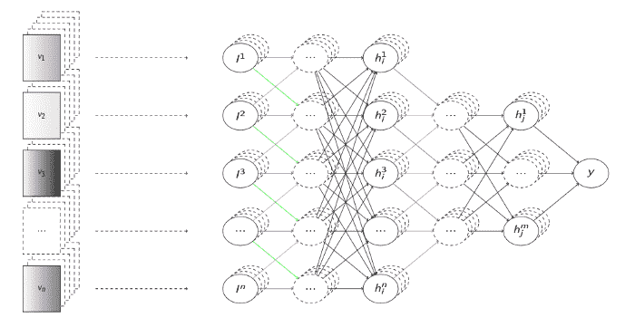
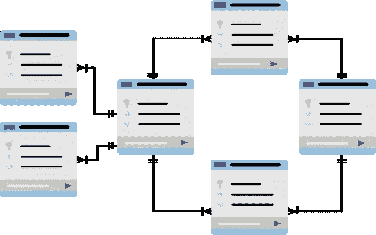
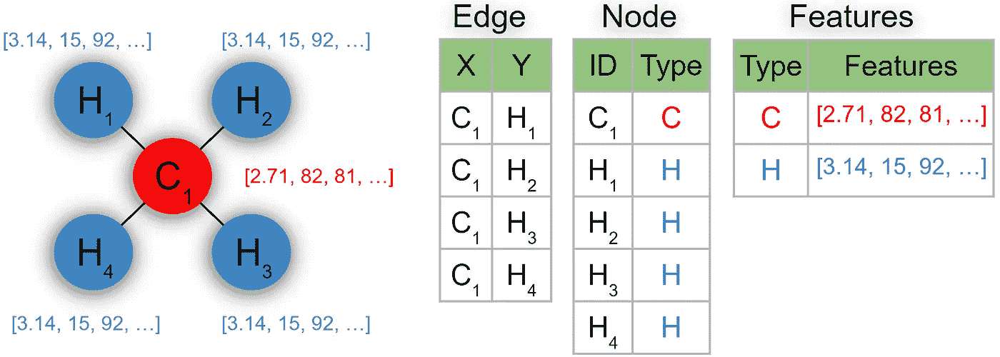
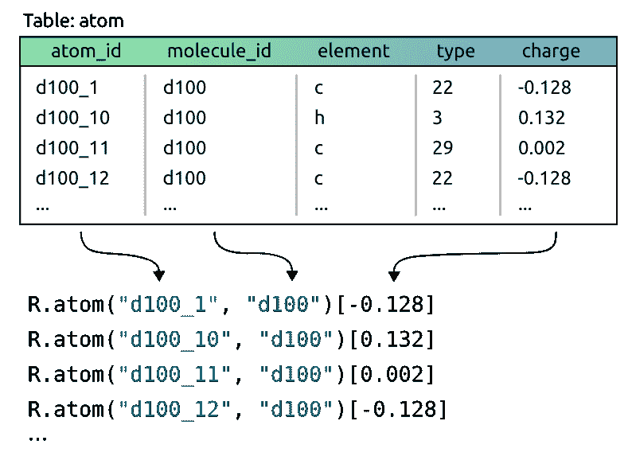
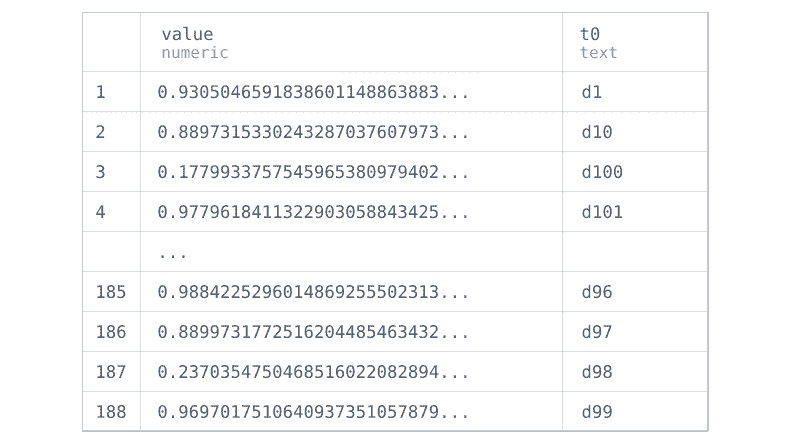

# 面向关系数据库的深度学习

> 原文：<https://towardsdatascience.com/towards-deep-learning-for-relational-databases-de9adce5bb00>

## 走向[深度关系学习](https://medium.com/tag/deep-relational-learning)

## *推广深度学习架构，实现与关系数据库原理和实践的自然整合。*


借助[**PyNeuraLogic**](https://github.com/LukasZahradnik/PyNeuraLogic)**框架，你可以编写直接在关系数据库上运行的深度学习模型。(图片改编自 [Pixabay](https://pixabay.com/vectors/database-storage-data-storage-152091/) 和 [PyNeuraLogic](https://pyneuralogic.readthedocs.io/en/latest/advanced/database_deep_learning.html) )**

**我们现在非常习惯于阅读关于深度学习的内容，从视觉和图像生成到游戏玩等研究领域的各种突破成为头条新闻。然而，大多数深度学习方法距离日常商业实践仍然相当遥远。许多公司成功转型到数据驱动时代，收集大量有价值的数据作为其流程的一部分。虽然大多数这样的公司确实使用各种数据分析工具来从这些数据中提取洞察力，但我们很少看到实际的 ***深度学习*** 方法的参与，除非它们直接匹配业务领域(例如，图像数据处理公司)。**

**在这篇文章中，我们认为商业实践中缺乏神经网络的核心原因之一是几乎所有深度学习模型所假设的学习表示与日常实践中最常见的数据存储表示之间的差距——*。***

***为了缩小这一差距，我们引入了一种原则性的方法，即*通过与每个关系数据库引擎底层的形式原则相集成，将*最先进的深度学习模型推广到*数据库上的直接应用*。然后，我们用 Python 框架[中的实用教程来实例化这种方法，该框架](https://github.com/LukasZahradnik/PyNeuraLogic)旨在轻松实现现有的和新的深度*关系*模型，以便直接使用数据库进行学习。***

# ***学习表征***

***虽然在数百个框架和库中有无数现成的统计和机器学习模型，但它们的一个方面仍然基本通用——学习数据表示法。无论你是否擅长基本的逻辑回归，想要升级到树集成，或者创建高级深度学习模型，无论你是否选择用 SPSS 支付专有解决方案，或者用 Tensorflow 从头开始编程，你总是期望以*数字张量*的形式提供数据，即 n 维数字数组。***

******

***摄取张量数据样本的典型(卷积)神经模型草图。(图片由作者提供)***

***这归结为传统的*特征向量*的学习表示，形成了这些张量的一维情况。历史上，无论学习领域如何，所有经典的机器学习模型都是为特征向量输入而设计的。在这里，作为一名领域专家，您需要在范围内设计问题的典型特征，将许多这些特征组合成一个向量，并对这些特征向量进行重复测量，以创建一个足够大的训练数据集。至少在深度学习革命带来其*表示学习*范式之前是如此，这在很大程度上消除了对这些输入特征的手动设计的需要，并代之以大量的原始数据。***

*   ***这里的想法是，典型特征作为训练过程本身的一部分出现，通常称为*嵌入*，即嵌入到共享 n 维空间中的对象的数字矢量表示。***

***然而，在庆祝从特征制作到神经架构制作的这一进步时，人们可能会注意到学习表示实际上仍然完全相同— *数字向量/张量*。***

***这不是一个巧合，因为使用这种学习表现形式背后有可以理解的原因——一部分是历史的，一部分是数学的，一部分是实用的(正如我们之前的文章中所解释的)。然而，这种表示远没有机器学习实践者看起来那么普遍。只需环顾四周，看看真实世界的数据是什么样的。它不是存储在数字向量或张量中，而是存储在互联网页面、社交网络、知识图表、生物、化学和工程数据库等的互连结构中。这些是固有的*关系型*数据，它们自然地以图表、超图以及最常见的*关系型数据库*的结构化形式存储。***

******

***现实世界中很大一部分数据存储在关系数据库中。(图片来自 [pixabay](https://pixabay.com/vectors/database-schema-data-tables-schema-1895779/) )***

***现在，一个显而易见的问题来了——难道我们不能将这些数据结构转化为我们的特征向量(数字张量)，并直接利用我们已经开发的所有好的机器学习(深度学习)吗？虽然这很有诱惑力，但这种方法存在深层的问题:***

*****1)** 显然，没有办法在不丢失信息的情况下，将一个*未绑定的*关系数据结构转换成普通的固定大小的数值张量。***

*   ***顺便说一下，张量也是关系数据结构的一个例子(它是一个网格)。如果示例张量比预期的模型输入大*，我们就有大问题了。****

******2)** 即使我们将自己限制在有界表示中，这种转换的*模糊性*也存在原则性问题，这源于关系结构的固有*对称性*。****

*   ****为了简单起见，这里只假设图形数据结构。如果在图和张量之间有一个明确的内射映射，这将很容易解决(硬)图同构问题。****

****即使你只是不关心信息的丢失和歧义，这两者都会导致严重的学习效率低下，并决定将结构转化为向量，你还是会回到特征加工。****

*   ****实际上有许多方法可以做到这一点，例如聚合(计算)出对象、关系、各种模式(子图)及其统计数据，通常称为“[命题化](https://link.springer.com/referenceworkentry/10.1007/978-0-387-30164-8_680)”(关系特征提取)，也可以是[自动化](https://getml.com/)。****

****第二个虽然在实践中有用，但这种关系特征加工可以说是不酷的，因为它与深度(表征)学习的核心思想不相容。那么，我们能否以某种方式解决这个问题，以一种有原则的方式将深度学习应用于关系结构？这将不受欢迎地需要超越常见深度学习补救措施的解决方案(例如将更大的数据扔进更大的转换器……)。****

# ****关系表示****

****这些关系表示是什么，我们为什么需要它们？先说学习数据流行的特征向量表示法。这样的数据也可以认为是一个 ***表*** ，其中每一列对应一个特征(或目标标签)，每一行对应一个单独的*独立*学习示例——一个特征向量。因此，我们可以很容易地用一个表将特征向量存储在任何数据库中。现在假设特征向量不再如此独立，并且一个特征向量中的一个元素实际上可以表示与另一个特征向量中的另一个元素相同的对象。这在实践中非常常见，人们使用这样的向量来表示时间序列数据中的重叠序列、句子中的单词、购物车中的物品或棋盘上的图形。在所有这些情况下，这些向量中的元素不再被认为是简单的独立值，而是 ***引用*** 到底层的*对象*，然后这些对象携带实际的特征。因此，从概念上讲，我们现在有两个表，其中第一个表包含对第二个表的对象引用(可能是重复的)，第二个表包含(唯一的)对象的特征值。****

*   ****在正式的数据库术语中，表也被称为 ***关系*** ，因为它将列中的对象联系在一起。****

****一换句话说，这样的向量也可以被认为是物体的*序列*。然后，这允许我们考虑一般化为*可变长度*的向量，这可以利用序列模型，如递归神经网络。此外，这样的序列可以开始分支，导致*树*数据表示，例如句子分析树数据，以及模型，例如*递归*神经网络。最后，我们可以推广到一般的图形结构数据，表示从分子到社会网络的任何东西，这是现代*图形神经网络*运行的表示。****

*   ****这也是流行的[转换器](https://thegradient.pub/transformers-are-graph-neural-networks/)有效运行的表现形式——这些转换器虽然在技术上接受输入序列，但通过假设(自)注意模块内的所有成对元素关系，在内部将它们转化为完全连通的图。****

****所有这些模型都属于关系(数据库)形式主义吗？它们当然会——这些都是*二元关系*处理的例子。这意味着，为了在数据库中存储一个图(序列、树)，创建一个单个表就足够了，该表具有与通过*边*连接的两个节点相对应的 ***和两个*** 列。每个图就是这些边的集合，每个边存储在一个单独的行中。对于不同标记的图，相关属性可以像以前一样有效地存储在单独引用的表中。****

********

****与标准 GNN 框架中使用的通用矩阵格式相比，以关系(数据库)格式存储类型化、属性化(分子)图具有更大的灵活性和更少的冗余。这也可以用来使 GNNs 模型[更有效](https://openreview.net/forum?id=oxnp2q-PGL4)。(图片由作者提供)****

****请注意，这说明了由关系表示引入的另一个重要概括，即单行不再对应于单个学习实例，因为我们通常可以有不同大小和结构的示例，通过对象引用跨越多个表。最后，数据库不局限于二元关系，因为一个数据库表可以很容易地关联两个以上的对象(即，每个表是一个超图)。****

****这清楚地表明，我们可以很容易地在关系数据库中捕获所有常用的学习表示(但反之则不然)。这使得潜在的关系逻辑(代数)形式主义成为理想学习表示的非常有力的候选者！****

*   ****请注意，实践中使用的所有结构化数据存储和操作语言，如 SQL 和 ERM，都是从关系代数和逻辑发展而来的。****

****然而，虽然这些是数据操作和商业实践的标准形式，但不幸的是，它们似乎与机器学习中可用的表示相去甚远。然而，这只适用于普通的机器学习…****

## ****关系机器学习****

****几十年来，远离深度学习主流的聚光灯，研究人员实际上已经在一个被称为 ***关系学习*** 的利基子领域内开发了直接基于前述关系逻辑形式主义的*的学习方法，在[之前的文章](https://medium.com/towards-data-science/what-is-relational-machine-learning-afbe4a9c4231)中有所概述。简而言之，关系学习方法，如[归纳逻辑编程](https://link.springer.com/referenceworkentry/10.1007/978-0-387-30164-8_396) (ILP)，为学习高度表达、高效和可解释的模型提供了一种非常优雅的方式。这种方法真实地展示了关系逻辑形式的一般性，它在这里不仅用于捕获数据和学习表示，还用于*模型本身*，同时提供了一种有效的方式来合并*背景知识*和领域对称性。*****

***所得到的模型自然允许从数据库中学习，其中不同的样本由不同类型和数量的对象组成，每个对象由不同的属性集表征，跨越多个相互链接的表。虽然这对于任何经典的机器学习算法来说都是一个噩梦般的场景，但它却是 ILP 的标准。***

***然而，除了这些有利的特征之外，这些方法还严重缺乏鲁棒性、准确性和可伸缩性——这些方面是深度学习最近主导整个领域的方面。***

# ***深度关系学习***

***自然，关系型和深度学习范式的互补优势要求它们的集成，我们称之为"[深度关系型学习](https://medium.com/tag/deep-relational-learning)"，我们在[上一篇文章](https://medium.com/towards-data-science/from-graph-ml-to-deep-relational-learning-f07a0dddda89)中详细介绍了其一般原则，随后是一个名为 PyNeuraLogic 的实用框架，在[的后续文章](https://medium.com/towards-data-science/beyond-graph-neural-networks-with-pyneuralogic-c1e6502c46f7)中进行了描述。***

***简而言之，关键的本质是采用*提升的建模*范式，从 [*统计关系学习*](https://link.springer.com/referenceworkentry/10.1007/978-0-387-30164-8_786) 中的关系图形模型中得知，并将其外推至*深度学习设置*。换句话说，这意味着引入一种新的、声明性的、基于关系逻辑的“模板化”语言，这种语言是*可微分的*，从而允许对深度学习模型进行编码，同时保持关系逻辑表示和推理的表达能力。***

***由于这听起来非常抽象，让我们来看看一些熟悉的东西— [图形神经网络](https://distill.pub/2021/gnn-intro/) s (GNNs)，它可以被视为深度关系学习模型的一个简单示例。***

*   ***gnn 是当前深度学习中最热门的话题之一，是药物发现、蛋白质折叠和一般科学中许多最新突破的基础。此外，[变压器](https://thegradient.pub/transformers-are-graph-neural-networks/)实际上也是一种[类型的 GNNs](https://thegradient.pub/transformers-are-graph-neural-networks/) 。***

******

***典型 GNN 的计算图，其中节点传播并聚合其邻居的表示，在表示甲烷分子的输入图上展开(灰色，左侧)。这些颜色表示每层内的权重分配(“卷积”)。单个卷积运算节点(粉色)之后是汇集运算(蓝色)，这些运算构成了对输入图(浅棕色)的下一层表示(C)的输入。然后在更多层上重复相同的计算模式。最后，来自最后一层的节点表示被聚集(A^y)以形成最终预测(y)。(图片由作者提供)***

## ***示例:图形神经网络***

***所以现在我们已经知道，一个图只是一些节点(`X`和`Y`)之间的一组边(`edge(X,Y)`)。任何 GNN 模型的本质都是简单地传播和聚集来自其邻居的节点的表示(又名“*消息传递*”)。在关系逻辑术语中，这个消息传递规则实际上可以放入一个*逻辑*规则中，如下所示:***

```
*message2(X) <= message1(Y), edge(X, Y)*
```

***可以直观地理解为:***

> ***为了计算一个对象 *X* 的表示'*消息 2* '，所有这样的对象 *Y* 的集合表示'*消息 1* '，其中'*边*'在 *X* 和 *Y* 之间。***

***现在让我们从正式的、声明性的、关系逻辑的角度来仔细看看这意味着什么。这里的逻辑*谓词*【消息 2】*、*消息 1*、【边缘】表示*关系*的名称，而逻辑*变量*“X”和“Y”表示对某些*对象*的引用。“消息 1”和“消息 2”都是一元关系，通常表示一个对象的一些属性，而“边”是一个二元关系，将两个对象联系在一起，即在这里用一条边连接图中的两个节点。“< =”运算符是一个*蕴涵*，在逻辑编程中通常从右向左书写，意思是右边部分(“规则的主体”)的(真)值隐含左边部分(“规则的头”)。最后，逗号“，”表示一个*连词*，意味着关系“消息 1(Y)”和“边(X，Y)”必须同时成立，即对于相同的对象 Y 和 X。****

****现在让我们从数据库(SQL)的角度来看一下同样的原理，它从一个更熟悉、更实用的角度揭示了幕后发生的事情。我们已经知道逻辑关系对应于数据库中的*表*。类似地，逻辑*变量*对应于它们的*列*。规则“头部”(左侧)中的表格是隐含的(< =)，即通过评估规则的“主体”(右侧)来创建。主体中的逻辑合取“”对应于各个表之间的一个*连接*，约束遵循各个变量绑定。例如，这里我们希望将表“message1”和“edge”连接到它们各自的列 Y 上，并将结果的列 X(投影)存储到一个名为“message2”的新表中。虽然可能有多个对象满足这样的约束，即多个 Y 具有来自特定 X 的“边”，但我们也需要通过 X 进行*分组，同时*聚合*相邻 Y 的属性(我们也可以聚合来自二元“边”的值)。因此，GNN 规则实际上也对应于一个简单的 SQL 查询，可以理解为:*****

> ***在列 Y 上联接表“message1”和“edge ”,按 X 分组，并将结果值聚合到新表“message2”中。***

***如果你停下来想一想，这正是所有 GNN 模型下的“消息传递”图传播/聚集规则。***

*   ***在这里，您通常会看到表“边”以邻接矩阵的形式表示(而不是这个邻接表/表)，表“消息 1”作为节点的特征/嵌入矩阵。传播步骤，即这里的连接和聚合，可以通过两者的矩阵相乘来表示。***

***现在，我们只需要给这种计算模式添加一些可学习的参数，以使其成为常识中的统计机器学习模型。这通过简单地将规则中的每个关系与可学习的(张量)权重相关联来完成。***

***最后，我们“仅仅”需要使这些逻辑规则，即 SQL 查询、*可微分*，以便高效地学习那些关联权重*。虽然我们不会详细讨论这种语言的可微分解释的语义，但它在之前的一篇文章中有所概述，并在这篇论文中有更详细的描述。简而言之，底层查询评估的每个程序步骤都表示相应计算图中的一些操作，然后我们以类似于经典深度学习模型的方式反向传播。****

****总之，我们刚刚展示了如何将经典的深度学习 GNN 模型表示为简单的参数化 SQL 查询。这不是很奇怪吗？虽然这听起来像一些抽象的概念，你可能在研究论文中读到过，但在实践中并不真正起作用，现在让我们通过下面关于创建一个 ***数据库内 GNN*** 的实用教程来明确我们的意思。****

# ****创建数据库内 gnn****

****现在让我们切换到一个*实用的*框架，它实例化了我们到目前为止讨论过的所有前述的[深度关系学习](https://medium.com/tag/deep-relational-learning)原则。它叫做<https://github.com/LukasZahradnik/PyNeuraLogic>**，你可以在[之前的文章](https://medium.com/towards-data-science/beyond-graph-neural-networks-with-pyneuralogic-c1e6502c46f7)中读到更多关于它的内容。这里，让我们直接进入它的一个(最近的)模块，处理框架内部使用的关系逻辑表示和关系数据库之间的映射。******

*****与常见的以张量为中心的深度学习框架相反，PyNeuraLogic 将一切都建立在逻辑*关系*上。由于关系(表)是框架中的一等公民，因此不需要任何特别的(有问题的)张量变换，这使得它与关系数据库的互操作非常自然。特别是，PyNeuraLogic 框架配备了一组工具，用于直接关系表数据映射，直接在其上训练当代深度关系模型，甚至导出到普通 SQL 代码，以便您可以直接在数据库中评估训练的模型！*****

## ****示例数据库****

****首先，让我们介绍一下我们将在这个简单的演示中使用的数据。我们的示例数据库包含分子的结构化信息。每个分子都有一些属性，由不同数量的原子组成。原子也有一些属性，可以和其他原子形成属性键。因此，我们的数据库由三个表组成——“分子”、“原子”和“键”。****

********

*****本* [*教程使用的关系数据库图*](https://pyneuralogic.readthedocs.io/en/latest/advanced/database_deep_learning.html#) *(图片来自 PyNeuraLogic)*****

****在这种情况下，我们的任务是确定分子的诱变性，这是关系学习和 GNNs 中最常用的基准之一。因此，我们的目标标签将是“分子”表中的“诱变”字段。现在，这 3 个表将自然地对应于 PyNeuraLogic 框架中的 3 个关系。然而，我们也可以对这种映射进行一些定制。例如，我们可能希望将“atom”表的每一行映射到一个关系“R.atom ”,仅将“atom_id”和“molecule_id”列作为关系的*项*,将“charge”列作为关系的*值*。****

*   ****注意，将*值*分配给关系(关系事实)超出了标准的关系逻辑形式，在标准的关系逻辑形式中，值被限制为真(存在)或假(不存在)。放松到全范围的(张量)值是 PyNeuraLogic 能够将深度学习功能集成到关系逻辑原则中的原因。****

********

*****将表映射到有值关系事实。我们将“atom_id”和“molecule_id”列映射到关系的项，但是“charge”列映射到其* ***值*** *用于演示。(图片来自 PyNeuraLogic)*****

****请注意，这种映射非常灵活。我们当然可以将“charge”作为另一个术语(值*将默认为 True 或“1”)，也包括“element”和“type”列，或者我们甚至可以将表拆分成多个新定义的关系。*****

****为了实例化这个关系-表映射，我们创建一个“DBSource”对象的实例，将“关系名”、“表名”和“列名”(将被映射到术语)作为参数。为了简单起见，我们将只利用“键”和“原子”表中的数据:****

```
**from neuralogic.dataset.db import DBSource, DBDataset

atoms = DBSource("atom", "atom", ["atom_id", "molecule_id"], 
                  value_column="charge")
bonds = DBSource("bond", "bond", ["atom1_id", "atom2_id", "type"],
                  default_value=1)**
```

****接下来，对于监督训练，我们还需要查询*标签*——也就是简单的“分子”表中的“诱变”字段。由于这些是文本标签，我们只想将它们转换为标准(交叉熵)误差优化的数值，这也可以定制:****

```
**queries = DBSource("mutagenic", "molecule", ["molecule_id"], 
                    value_column="mutagenic",
                    value_mapper=lambda value: 1 if value == "yes" else 0
)**
```

****最后，我们只是将这些映射放在一起，并通过一些兼容的数据库驱动程序(如 psycopg2 或 MariaDB)建立一个数据库连接，以创建一个关系型`logic_dataset`:****

```
**import psycopg2

with psycopg2.connect(**connection_config) as connection:
    dataset = DBDataset(connection, [bonds, atoms], queries)
    logic_dataset = dataset.to_dataset()**
```

*   ****请注意，这里没有隐藏预处理，比如转换成张量，这是通用框架所必需的。这只是表和关系之间非常直接的映射，然后可以通过适当的深度*关系*模型直接学习。****

## ****GNN 模型模板示例****

****关系数据集已准备好；现在让我们来看看如何定义学习*模板*。我们有意避免学习“模型”这个常用术语，因为模板可以被看作是构建这种模型的高级蓝图。也就是说，单个关系模板可以对应于多个模型，即计算图，其将根据这里的每个示例结构及其目标查询自动定制。****

*   ****这允许对输入数据的不同大小和结构的问题进行通用处理。例如，这里的单个示例分子很好地对应于“分子”表中的单个行，这可以直接用作标准模型(树、支持向量机、神经网络等)的输入。).但是同一个分子也跨越了“原子”和“键”表中不同数量的行，这对于标准模型来说是一个很大的问题，正如[以前的一篇文章](https://medium.com/towards-data-science/what-is-relational-machine-learning-afbe4a9c4231)中所解释的。因此将“模型”概括为“模板”。****

****我们在这里定义的模板首先计算每种化学键的嵌入量(化学键类型只是它在`range(1,8)`中的多重性)。然后，我们添加两个消息传递规则(GNN 层)，类似于本文前面描述的规则，用于在整个分子中传播原子和键的表示。最后，该模板定义了一个“读出”规则，该规则将所有层中所有节点的表示聚合成一个单一的“诱变”值，该值被传递到一个 sigmoid 函数中，并与诱变分类的二进制目标查询标签进行匹配。****

*   ****这是一个经典的 GNN 模型架构，具有跳过连接和附加边缘(结合)嵌入传播，类似于 [GIN](https://arxiv.org/abs/1810.00826) 。****

```
**from neuralogic.core import Template, R, V, Transformation

template = Template()

template += [R.bond_embed(bond_type)[1,] for bond_type in range(1, 8)]

template += R.layer1(V.A)[1,] <= (
    R.atom(V.N, V.M)[1,], R.bond_embed(V.B)[1,], R._bond(V.N, V.A, V.B) )

template += R.layer2(V.A)[1,] <= (
    R.layer1(V.N)[1,], R.bond_embed(V.B)[1,], R._bond(V.N, V.A, V.B) )

template += (R.mutagenic(V.M)[1,] <= (
    R.layer1(V.A)[1,], R.layer2(V.A)[1,], R.atom(V.A, V.M)[1,] )
) | [Transformation.IDENTITY]

template += R.mutagenic / 1 | [Transformation.SIGMOID]**
```

*   ****PyNeuraLogic 用逻辑编程重载 Python，这样你就可以通过这样的参数化规则编写神经模型模板。`R`代表*关系*生成器，`V`代表*变量*，`[1,]`是关联的权重*维度*(即这里的标量)，而`<=`连接了从规则体(右侧)到规则头(左侧)的关系模式。可以附加诸如非默认激活功能的附加信息。如果这没有意义，请参见[文档](https://pyneuralogic.readthedocs.io/en/latest/language.html)快速入门。****

****最后，我们可以通过将此模板传递到“评估器”来构建和训练我们的模型，这看起来非常类似于经典的深度学习框架:****

```
**from neuralogic.nn import get_evaluator
from neuralogic.core import Settings, Optimizer
from neuralogic.nn.init import Glorot
from neuralogic.nn.loss import CrossEntropy
from neuralogic.optim import Adam

settings = Settings(
    optimizer=Adam(), epochs=2000, initializer=Glorot(), 
    error_function=CrossEntropy(with_logits=False)
)

neuralogic_evaluator = get_evaluator(template, settings)
built_dataset = neuralogic_evaluator.build_dataset(logic_dataset)

for epoch, (total_loss, seen_instances) \ 
    in enumerate(neuralogic_evaluator.train(built_dataset)):

    print(f"Epoch {epoch}, total loss: {total_loss}, 
            average loss {total_loss / seen_instances}")**
```

## ****将神经模型转换为 SQL****

****此外，只需几行代码，我们刚刚构建和训练的模型就可以变成(Postgres) SQL 代码。通过这样做，您可以直接在您的数据库服务器中对进一步的数据*评估模型，而无需安装 NeuraLogic 甚至 Python。简单的 PostgreSQL 就可以了！*****

****我们所要做的就是创建一个*转换器*，它接受我们的模型、“表映射”和设置。对于关系和表之间的映射，表映射类似于前面描述的“DBSource ”:****

```
**from neuralogic.db import PostgresConverter, TableMapping

convertor = PostgresConverter(
    neuralogic_evaluator.model,
    [
        TableMapping("_bond", "bond", ["atom1_id", "atom2_id", "type"]),
        TableMapping("atom", "atom", ["atom_id", "molecule_id"], 
                      value_column="charge")
    ],
    settings,
)**
```

****初始设置后(请参见[文档](https://pyneuralogic.readthedocs.io/en/latest/advanced/database_deep_learning.html#converting-model-to-sql)，您可以将您的实际模型安装为 SQL 代码，只需调用“to_sql”即可检索该代码:****

```
**sql = convertor.to_sql()**
```

****现在，您已经做好了准备，可以直接在数据库中评估您训练好的模型，而不会留下任何数据。对于每个学习表示，在“neuralogic”命名空间中都会有一个对应的函数。比方说，我们想在一个 id 为“d150”的分子上评估我们的模型，这现在就像做一个 ***选择*** 语句一样简单:****

```
**SELECT * FROM neuralogic.mutagenic('d150');**
```

********

****类似地，我们可以通过使用“NULL”作为占位符来请求所有可推断的替换及其值，例如，在此请求所有的分子预测:****

```
**SELECT * FROM neuralogic.mutagenic(NULL);**
```

********

****以完全相同的方式，我们甚至可以检查模型的内部表示！比如我们可以从*第一层*查询 id 为*“d15 _ 11”的化学*原子*的值:*****

```
**SELECT * FROM neuralogic.layer1('d15_11');**
```

********

# ****结论****

****总之，我们使用 PyNeuraLogic 框架从零开始声明了一个简单的 GNN 模型变体*,它可以在具有多个相互链接的表的关系数据库上本地工作。此外，我们甚至将模型导出到普通 SQL 中，以便可以随时在数据库引擎中直接对其进行进一步评估，而无需任何外部库。*****

****这表明，现有的结构化数据的现代深度学习原则可以在(加权)关系逻辑的(数据库)表示形式下有效地捕获。然而，很明显，使用表达能力更强、可区分的关系逻辑形式的要点是，它允许您做的远不止是通过二元关系(gnn)进行简单的图形传播。****

****直接从 GNN 的例子中推断，没有什么可以阻止你扩展到更高层次的关系，不同的传播模式连接更多的表，并以新的方式将这些组合到层次逻辑(SQL)程序中。因此，不需要等到下一年的 NeurIPS 来介绍另一轮新的“深度超图”、“深度元图”、“深度推理”、“深度逻辑”和其他[深度关系学习](https://medium.com/tag/deep-relational-learning)想法——你现在就可以开始在 [PyNeuraLogic](https://github.com/LukasZahradnik/PyNeuraLogic) 中简单地宣布这些。****

****只需`$pip install neuralogic`开始将这些模型想法付诸实践，或者如果感兴趣，请联系我们！****

1.  ****在这篇文章中，我们没有在向量和张量表示之间进行太多的区分，因为你总是可以将一个转换为另一个，知道维度，这在标准的深度学习模型中总是已知/固定的。****
2.  ****当然，在关系数据库中使用递归自连接来遍历图并不是处理这些结构的最有效的方式(例如，有专门的图数据库来处理这些结构)。然而， [NeuraLogic](https://github.com/GustikS/NeuraLogic) 使用定制的、高效的[基于 CSP](https://en.wikipedia.org/wiki/Constraint_satisfaction_problem) 的关系(逻辑)推理引擎，非常适合高度互联结构上的复杂结构化查询。****
3.  ****这种矩阵形式也可以说是非常优雅的，但这只适用于基本的 GCN 模型。转到更具表达力的 GNN 模型，利用例如图(子)结构和更高级的传播方案，矩阵代数形式很快变得混乱，而关系逻辑形式保持不变。****

*****作者感谢*[*Lukas Zahradnik*](https://github.com/LukasZahradnik)*校对这些帖子，创作了* [*教程*](https://pyneuralogic.readthedocs.io/en/latest/advanced/database_deep_learning.html) *，开发了*[*PyNeuraLogic*](https://github.com/LukasZahradnik/PyNeuraLogic)*。*****