# 走向可持续的生成人工智能革命

> 原文：<https://towardsdatascience.com/towards-sustainable-generative-ai-revolution-a9786de586cb>

## 面对成长的烦恼:如何驾驭超级潜意识的狂野新时代

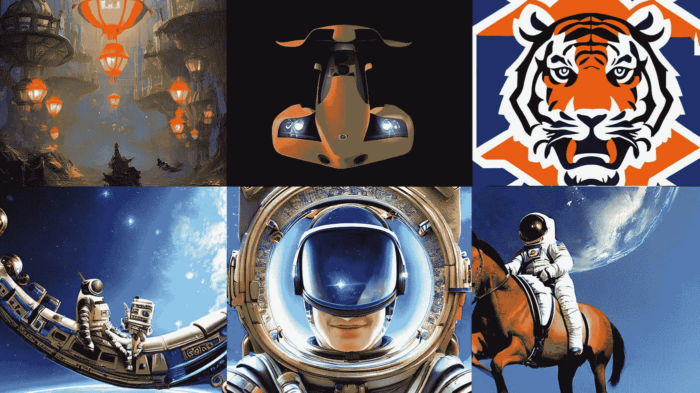

由生成式人工智能生成的图像

不可阻挡的生成性人工智能革命正在拉伸人类的创造性肌肉。通过使用文本和其他类型的提示，人们使用这项技术来生成令人惊叹的图像、视频、3D 形状、VR 环境等。然而，**成长的烦恼**开始出现在各种事情上，从在世艺术家的权利到艺术竞赛、艺术平台、股票图书馆等人工智能一代的存在。

我是这场革命开始时推出的第一批生成式人工智能平台之一的联合创始人(<https://geniverse.co>**)。我也做了很长时间的多学科艺术家。**

**作为一个在这两个领域(生成人工智能和艺术)都非常活跃的人，我打算思考这些问题中涉及的许多角度和观点。**

**不过，首先，我们将一起进行一次有趣的旅程，以便**从基本原则出发，回顾这项令人兴奋的技术的本质**，将它与人类创造力以及创意人员和艺术家的思想联系起来。**

**然后，我们将**探索这场革命当前状态中好的、棘手的和房间里的大象**。最后，我将思考我们如何超越这些快节奏的初始阶段，为实现更可持续的发展做出贡献。**

**系好安全带，在这篇文章中，我们将从关于人工智能的隐喻到潜在空间、艺术家的思维、智能生成环境和其他未来场景、创意者的权利、内容真实性倡议(CAI)标准和方法等。我们开始吧。**

# **回家**

**让我们用一个简单的比喻来探索生成式人工智能革命带来了什么，以及它对创意人员、艺术家和全人类意味着什么。**

**曾几何时，你坠入了生命的海洋。这是一个相当广阔的海洋，一个信息的海洋。**

****

**哈维尔·伊达米| ideami.com 制图**

**让我们想象你是由两个视角或部分组成的:你的潜意识和你的有意识的 T21 视角。让我们把你的潜意识想象成一个厨房的锅，漂浮在信息的海洋上。**

**在这片海洋上，你的首要任务是生存，希望能茁壮成长。为此，你需要信息。所以你要把足够多的高质量的原料带进你的锅里，并把这些原料结合和重组，以便产生帮助你达到目标的知识和想法。**

****

**哈维尔·伊达米| ideami.com 制图**

**在你的潜意识锅上面，有这个弥漫的神秘闪亮的球体，它代表着我们的意识(对此我们仍然知之甚少)。**

****

**哈维尔·伊达米| ideami.com 制图**

**所以，你在这里。漂浮在生命的海洋上，你神秘的意识有时会为你潜意识中的烹饪过程提供方向。**

**一直以来，潜意识都在不断地组合、混合和再混合通过我们的感官到达它的各种成分(信息)。**

**有时，这些组合可能会成为新思想的种子。打个比方，我们可以想象在烹饪过程中出现的脆弱、微妙的气泡，从潜意识上升到意识。而且，如果我们的头脑中有空间，如果它们不是充满噪音，我们可能会感知到那些脆弱的泡沫，然后:找到了！一个想法！**

****

**哈维尔·伊达米| ideami.com 制图**

**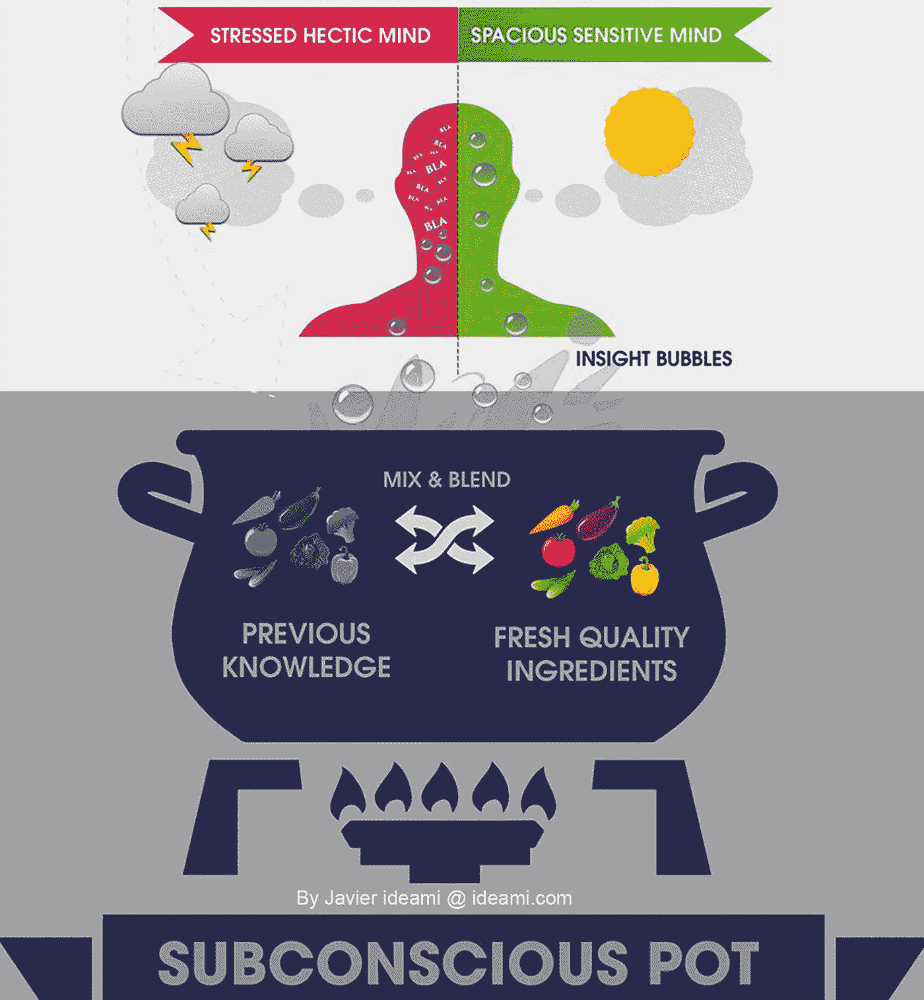**

**哈维尔·伊达米| ideami.com 制图**

**但是，这里有一个问题。这片海洋上有太多的信息，太多的复杂性。而我们潜意识的锅，大小有限。它不是刚性的。它在某种程度上是灵活的，可延展的。但是它的尺寸仍然有限。**

**因此，大自然进化出一种机制来解决处理生命海洋的巨大复杂性的问题:**压缩和解压过程**。**

**我们的大脑能够接受通过我们的感官获得的信息，并将其压缩成一种更少细节、更多抽象的形式。**

**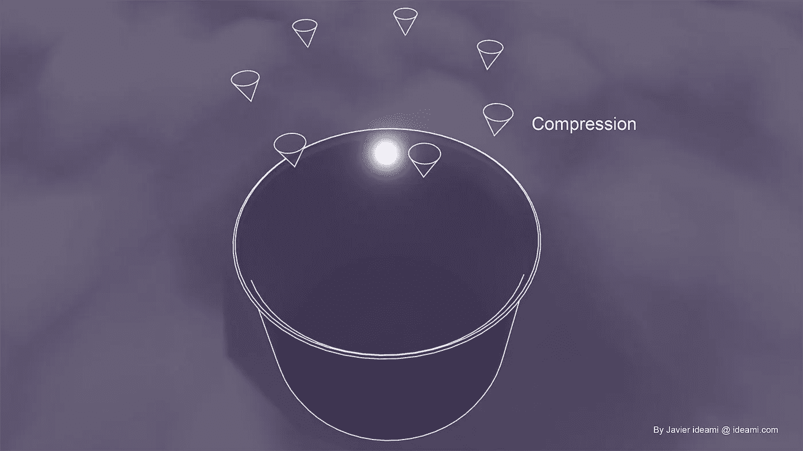**

**压缩漏斗|贾维尔·艾达米的作品| ideami.com**

**让我们开始想象这个非常重要的轴，**细节抽象轴**。当我们压缩生活的复杂性时，我们从高细节(和高维空间)到高抽象(在低维空间内)。**

**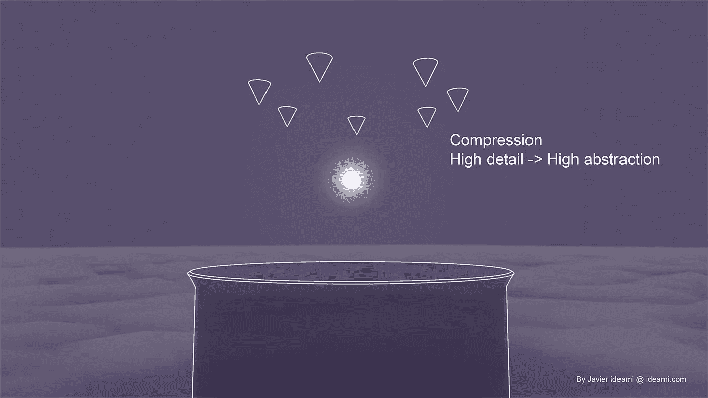**

**哈维尔·伊达米| ideami.com 制图**

**因此，在我们的潜意识里，我们收集了这个世界复杂性的压缩表现，我们有时称之为:**潜在空间**。**

****

**哈维尔·伊达米| ideami.com 制图**

**这些潜在空间容纳了不同信息领域的**抽象本质**。我们去掉了无信息的细节，保留了许多降维，每个降维都记录了与数据所属的信息领域相关的有用因素。**

****

**哈维尔·伊达米| ideami.com 制图**

**我们的大脑也可以做相反的过程。它可以执行**解压缩、**并从高抽象到高细节。**

**"想象一头大象！"我们听到这些话，一只大象的形象就会浮现在我们的脑海里。我们只是运行了相反的过程，将高抽象表示(*大象*)解压缩成我们头脑中高度详细的可视化。**

**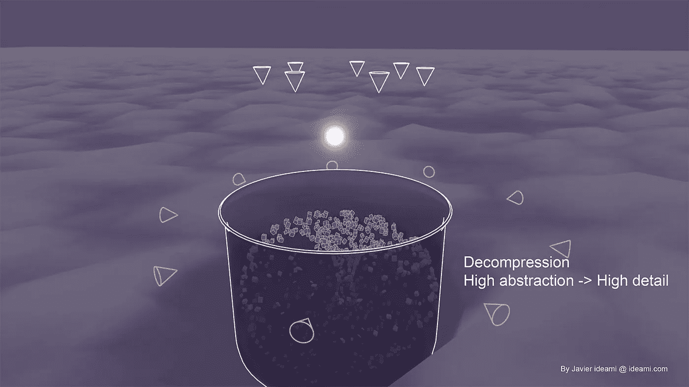**

**哈维尔·伊达米| ideami.com 制图**

**我们刚刚探索的过程与人工智能网络中发生的过程非常相似。我们训练人工智能网络学习将高维域(如自然图像的域)压缩到潜在空间中，这些空间将这些域的抽象本质保留在更少的维度中。**

**并且我们还训练他们将那些潜在空间内的任何点解压缩成属于原始信息域的相应高维表示。**

****

**哈维尔·伊达米| ideami.com 制图**

**当我们探索复杂的生成式人工智能系统时，从 **DALLE-2** (OpenAI)到 **Imagen** (Google)，**稳定扩散** (Stability.ai)以及更远，我们发现不同的中间阶段，例如，它们可能在模态之间转换，执行扩散过程，缩放输入和输出等；但是所有这些系统的共同基础是这些压缩和解压缩过程，它们允许我们在高细节和高抽象之间双向移动。**

**人工智能系统的细节取决于我们的目标。我们可能想要提升图像，或者锐化它们，或者根据文本提示生成全新的图像，或者这些事情一起做，或者一些完全不同的事情。这将决定我们使用什么样的培训目标和数据集，以及最终架构不同部分的精确细节。**

**当今领先的生成式人工智能系统使用的关键策略是基于我们所说的**扩散**。例如，稳定扩散系统使用类似于 [**U-Net**](https://en.wikipedia.org/wiki/U-Net) 的架构，该架构已经被训练(利用大型数据集)来预测已经添加到图像中的噪声。**

**一旦被训练，相同的网络能够在许多步骤中从图像+噪声(包括来自完全随机噪声)的不同组合回到高质量图像。**

**它也可以从一个图像到另一个图像，通过在初始图像中添加一些噪声，然后执行与之前相同的过程。**

**为了让这些代朝着正确的方向前进，它们受到我们输入的文本提示的压缩表示的制约(注入到 U-Net 架构的不同部分)。**

**技术细节说够了。我们继续。**

# **艾要回家了**

**因此，随着生成性人工智能革命的到来，我们正越来越**接近我们的本质**，因为人类能够执行**会聚和发散**(压缩和解压缩)的互补过程，通过我们的分析和创造性肌肉来表达。**

**在我们逐渐扩展和进化深度学习人工智能系统的融合能力(能够预测、推荐、分类、识别等)的十年之后，生成式人工智能革命通过添加超人的发散能力(能够创造和生成)来完成循环。艾要回家了。**

****

**人工智能回家了|图片作者:ideami.com**

# **潜在空间的魔力**

**但是，当我们谈论潜在空间或抽象压缩表示时，我们真正的意思是什么？通过一个非常简单的例子，我们在自己身上找到了答案。**

**我在大自然中散步。当我回来时，我的朋友问我散步怎么样。我说:“太棒了，我看到了一只美丽的蝉！”。她问我:“蝉长什么样？”**

**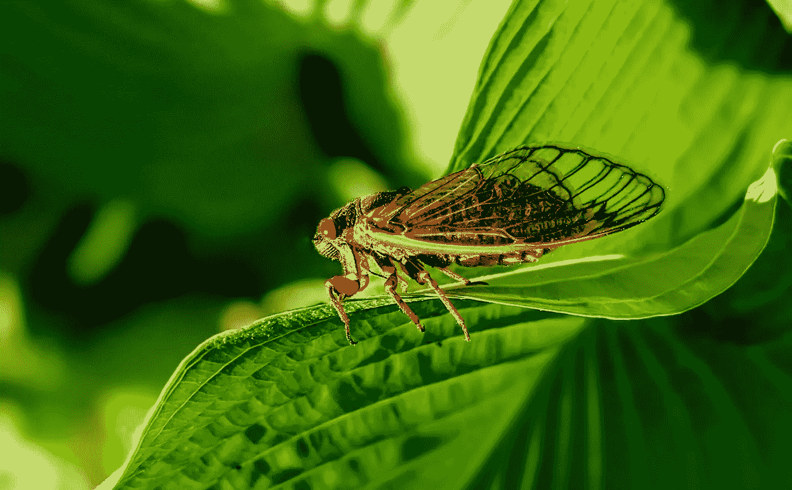**

**比尔·尼诺在 Unsplash 上拍摄的照片**

**那时，我在脑海中想象那只蝉。让我们假设我的视觉化是用 1000 x 1000 个光点的网格来表达的。那是一个一百万维的空间。如果这些点有颜色，那么它们中的每一个都有一个红色、绿色和蓝色的成分(3 倍的维度)。**

**所以我可以这样开始向我的朋友描述这只蝉:“嗯，在我的视觉化图像左上角的第一个光点有 15 的红色强度，25 的绿色强度和 77 的蓝色强度。它右边的下一个点有 145 的红色强度，55 的绿色强度…等等，下一个点有..等”。我可以一直这样穿过一百万个光点。这种方法的问题显而易见。**

**我可能要花一个月的时间来描述这只蝉，到那时，我的朋友早就走了。**零效率。**但主要问题甚至不是这个。**

**知道这一百万个点中的一个具有 155 的红色强度是没有多大用处的。**的细节**往往**不提供相关信息**。这就是为什么我会做一些不同的事情。**

**我将把蝉的所有复杂和丰富的细节压缩成几个维度，30、50、100 个因子(无论如何都是个小数字),来解释我所看到的本质。**

**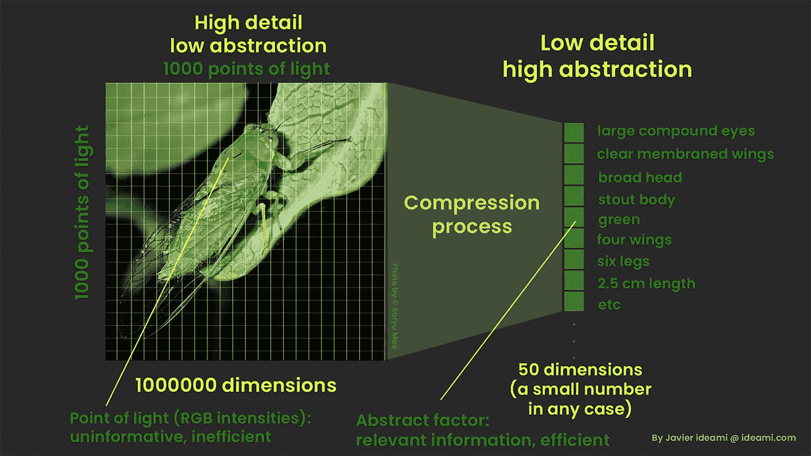**

**照片由 Saryu Mae([https://inaturalist.nz/taxa/342384-Kikihia-ochrina](https://inaturalist.nz/taxa/342384-Kikihia-ochrina)|抄送人:[https://creativecommons.org/licenses/by/4.0/](https://creativecommons.org/licenses/by/4.0/))|图片由 Javier ideami | ideami.com**

**我会告诉我的朋友:看，它有一个宽阔的脑袋，结实的绿色身体和透明的薄膜翅膀。四个翅膀，翅膀上有这样的图案。它有很大的复眼，有这么多眼睛，六条腿，腿是这样的，等等。我已经将高细节的表现压缩到少量的维度上，这些维度传达了重要和相关的信息。**

**现在，我的朋友听到这个，她做了相反的过程，**解压**。**

**她转换这些表达我所看到的本质的压缩维度，并在她的脑海中膨胀它们，以在脑海中想象与本质相对应的高细节表示，一只蝉的形象(这将与我想象的不同，因为压缩-解压缩过程以及所涉及的系统和我们每个人对相关场景的先前知识之间的其他差异)。**

**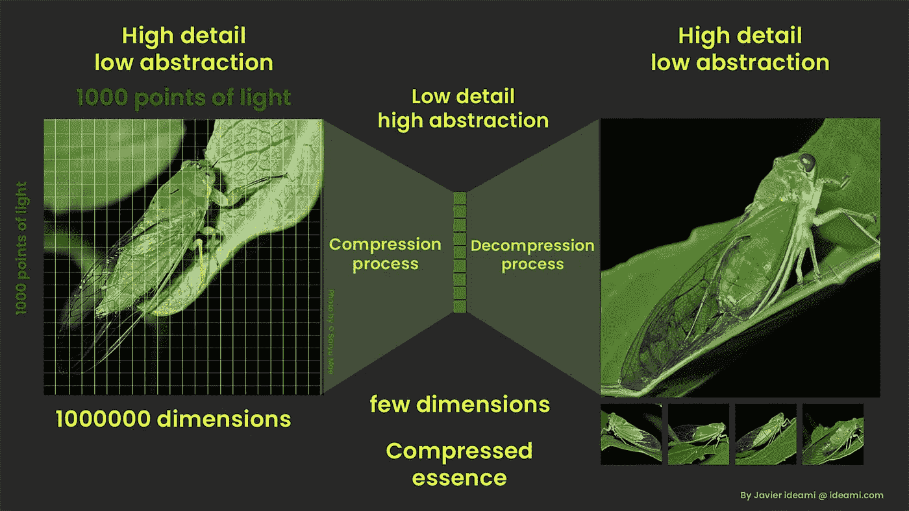**

**照片由 Saryu Mae(【https://inaturalist.nz/taxa/342384-Kikihia-ochrina】|抄送人:[【https://creativecommons.org/licenses/by/4.0/】](https://creativecommons.org/licenses/by/4.0/))|使用生成式人工智能创建的变体进行修改|图片由 Javier ideami | ideami.com 制作**

**因此，在某种程度上，每次我们回忆起一些事情，我们都在重建它，重新想象它，从我们储存的本质中重新创造它(这一过程的精确度在很大程度上取决于相关潜在空间的丰富程度以及参与其创造的感官形式的数量，以及其他因素)。**

**以下是我几个月前制作的一张关于 DALLE-2 如何工作的信息图，将它的过程与人类大脑中发生的事情进行了比较。**

**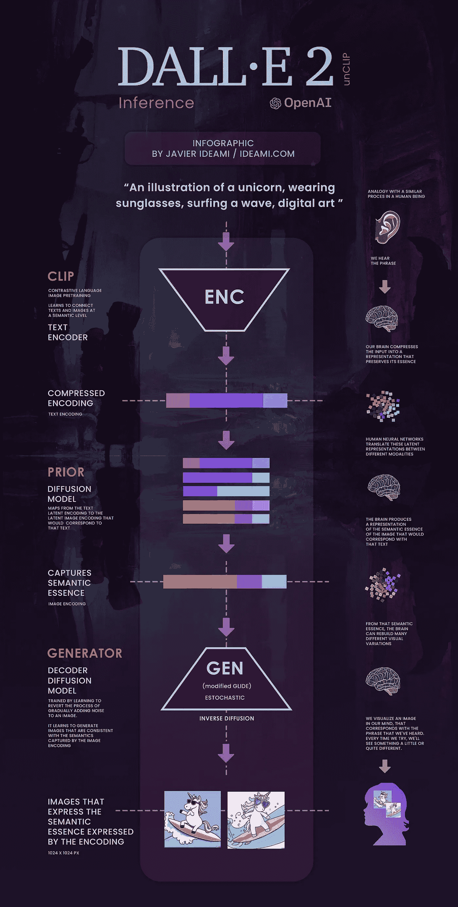**

**Javier ideami | ideami.com |在 https://github.com/javismiles/dalle2-inference[下载超高分辨率版本的信息图](https://github.com/javismiles/dalle2-inference)**

# **小锅，巨锅**

**我们大脑内部和这些人工智能网络内部发生的事情有许多不同之处，但打个比喻来说，与本文特别相关的一个不同之处是潜意识锅的大小。**

**我们的潜意识来源于我们在生活中的经历。当我们与人交谈时，当我们体验世界时，我们丰富了它的内容。最终，它的烹饪过程会在我们的脑海中产生新的想法、视觉效果、声音等等。**

**人工智能网络(在训练时)由庞大的数据集喂养。生成式人工智能系统使用的数据集是由从互联网上收集的信息组成的。我们谈论的是海量数据。**

**所以，一方面，我们有我们人类，有我们潜意识里的小锅。**

**另一方面，我们有这些巨大的人工智能罐子，从互联网上收集数据。有些数据是公开的。但不是全部。稍后我们会讨论这意味着什么。**

**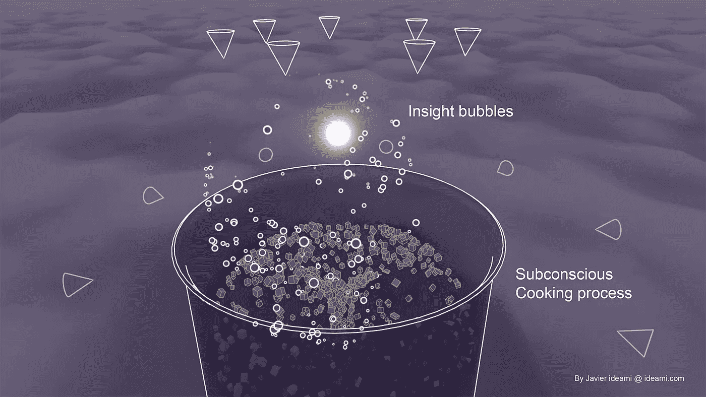**

**哈维尔·伊达米| ideami.com 制图**

**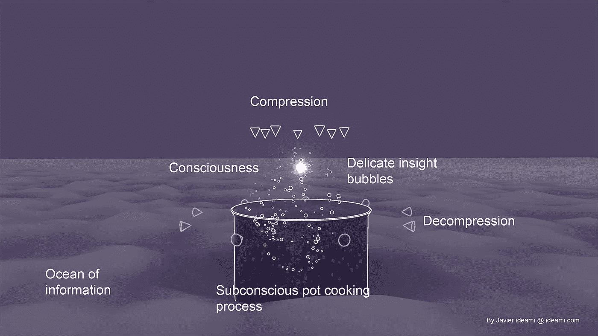**

**哈维尔·伊达米| ideami.com 制图**

# **深度电梯**

**是时候把前面所有的板块和艺术和人类艺术家联系起来了。现在，定义什么是艺术家是一项不可能的任务。相反，我将专注于**探索历史上许多伟大创意者**共有的**事物**。**

**还记得我在上面讨论的那个**轴** ( **细节到抽象**)吗？在我几年前出版的一本书中，我写了我想到的另一个比喻，我称之为“深度电梯”。**

**想象一条垂直的线，电梯穿过这条线。在这条线的底部，我们有高维度和高细节的领域。这是生命海洋的复杂性得到充分表达的地方。**

**在这条线的顶端，我们有压缩的低维潜在空间的领域，它保存了较低领域的抽象本质(例如，这里生活着我们的语言)。**

**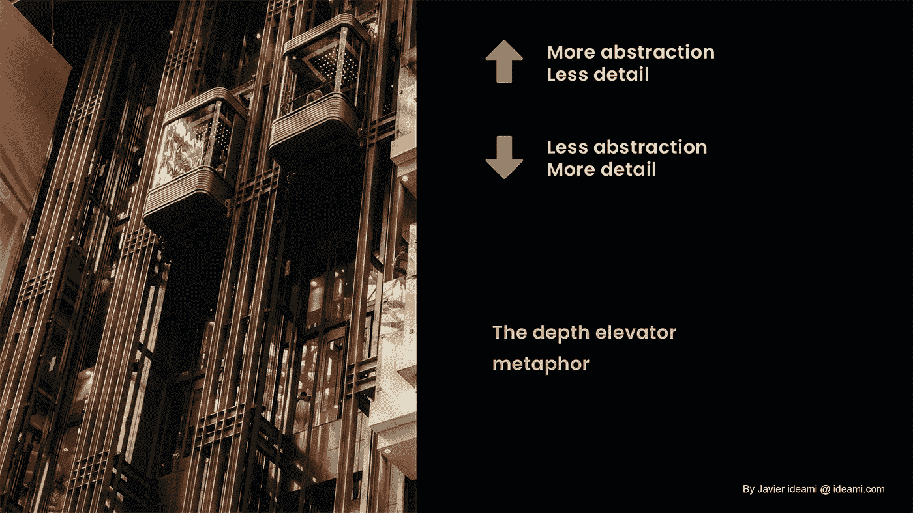**

**欧文坎农在 Unsplash.com 的照片。作者:哈维尔·伊达米| ideami.com**

**艺术家是以敏捷、灵活和动态的方式驾驭这种深度电梯的大师。让我们更深入地研究这个问题。**

**当我们还是小婴儿，以及后来的孩子时，我们大部分时间都呆在深度电梯的底部，与宇宙的丰富多彩和细节互动。我们的分析心智模块还没有完全开发出来。现在是我们的**探索**阶段。**

**相反，大多数成年人倾向于通过重新利用他们头脑中已经建立的思维模式来关注效率(这也有助于我们防止浪费我们宝贵的燃料，为我们的大脑提供动力的葡萄糖)。这是我们的**开发**阶段。因此，成年人在深度电梯顶部狭窄的象牙塔中度过了大量时间。**

**在深度提升器的两半部分花费的时间之间达到一个良好的平衡是一个健康的目标。在**收敛**和**发散**之间，在压缩和解压缩之间，在抽象和细节之间取得良好的平衡。**

**这两极(无论哪个方向)之间缺乏平衡会在成年人身上产生不同类型的问题。我已经写了很多关于这些问题的文章，但这不是本文的主题。让我们回到艺术家身上。**

****

**重复性精神劳损| ideami.com 制图**

**许多伟大的艺术家都有以下共同点。他们能够以敏捷灵活的方式操纵这个深度电梯。他们能够下到电梯底部的深处，那里有丰富的宇宙在等待着他们。**

**关键的一点是，他们不会踮起脚尖就离开。相反，它们能够在水下呆很长时间，探索那些泥泞、荒凉和不确定的水域。**

**他们还能够将这种丰富性具体化为不同的解释和表示，这些解释和表示可以在从细节到抽象的整个轴的不同层次上表达自己。**

**而表象本身，或者相反，它们的解释或者它们交流的方式，也位于更接近深度电梯的顶部。**

**这与大多数时间呆在电梯顶部或接近顶部的典型成年人形成了鲜明的对比。你也猜到了原因。**

**因为在电梯顶部的抽象象牙塔上，比在那个包含宇宙复杂细节的轴的泥泞底部航行要舒服得多(并且需要更少的燃料)(打个比喻，我们也可以说，这比在电梯底部探索下面的野生游乐场要舒服得多)。**

**这里我们到达另一个关键点。像历史上许多伟大的艺术家一样，**需要努力**。这需要**时间**。**毅力**。而且，在某种程度上，这违背了我们成年人高效思维和避免浪费宝贵燃料的天性。**

**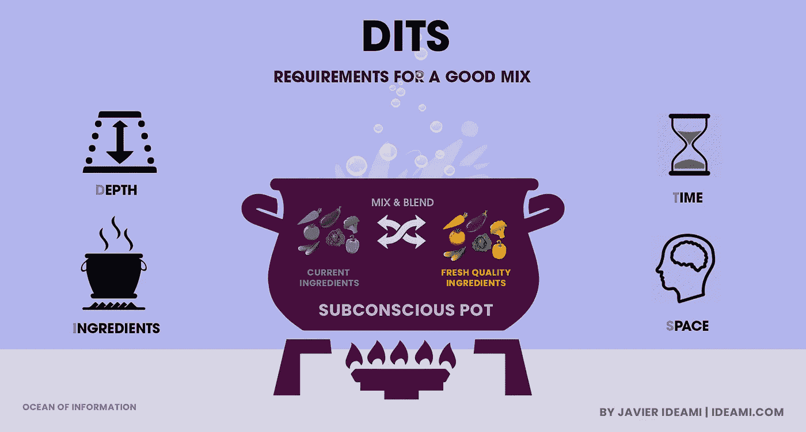**

**高效创新烹饪流程的要求|作者:哈维尔·艾达米| ideami.com**

**关于这一点，有必要指出一些平台目前正在禁止**生成性人工智能艺术**(或将其放在一个单独的类别或领域)，因为他们认为它是:**【低努力】**艺术。**

**是的，找到正确的提示来指导生成式人工智能架构需要一些努力。但是，这一过程所需的努力和时间无法与之前描述的掌握这一过程所需的数年甚至数十年相比。在本文的稍后部分，我们将更深入地探讨这一点和其他相关问题。届时，我们还将思考此类难题的潜在解决方案。**

**因此，通过在深度电梯中进行这种灵活的导航，伟大的艺术家和创意人员能够以新颖的方式表达宇宙的丰富性。**

**选择生活中的任何东西，比如说，木头。你可能会以一种非常超然、抽象的方式体验木头。或者你可以深入细致地探索木材的所有错综复杂之处。如果你能够灵活地在两极之间移动，你就处于一个更好的位置来创造一些与宇宙元素相关的新奇和不同的东西。**

**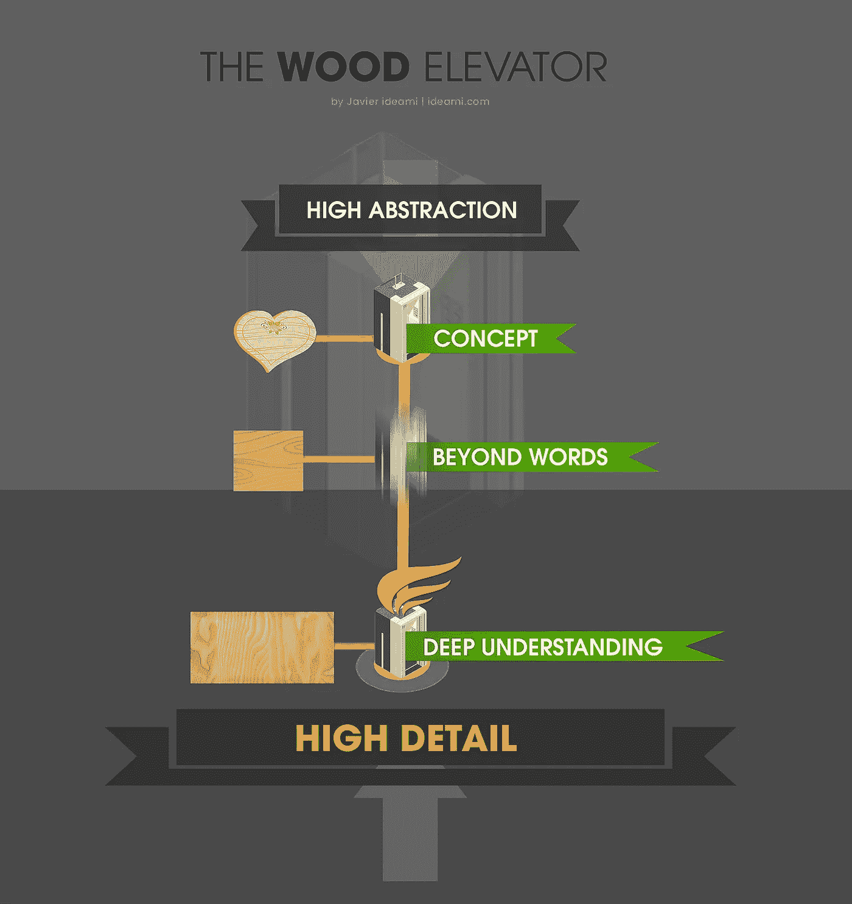**

**哈维尔·伊达米| ideami.com 制图**

**伟大的创意者也能够理解位于轴底部的广阔海洋的不同区域的不同互联方式，跨越这些水域的不同层，也通过深度电梯的顶层。**

**例如，当一个伟大的创意经历节奏时，她可以超越学科、技术、工具和华而不实的术语。一个伟大的创意看到和感受到节奏无处不在。在窗帘投射的灯光和阴影中，在眼泪落下的声音和动作中，在星星的舞蹈中，在我们思想的缝隙中，以及更远的地方。**

**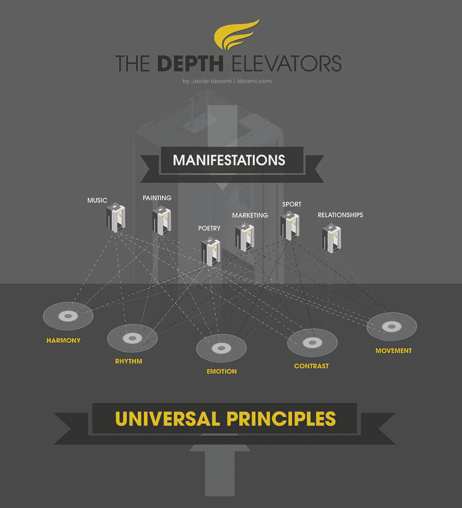**

**哈维尔·伊达米| ideami.com 制图**

**几十年来，伟大的创意者扩展并巩固他们潜意识中的潜在空间。**

**他们还改进了导航深度电梯的方式，这使他们能够以强大的方式将细节与抽象联系起来，从而丰富他们的创作过程。**

**此外，艺术家和创意人员经常与其他人合作。这样做，不同的潜意识锅可能会互相充实。**

**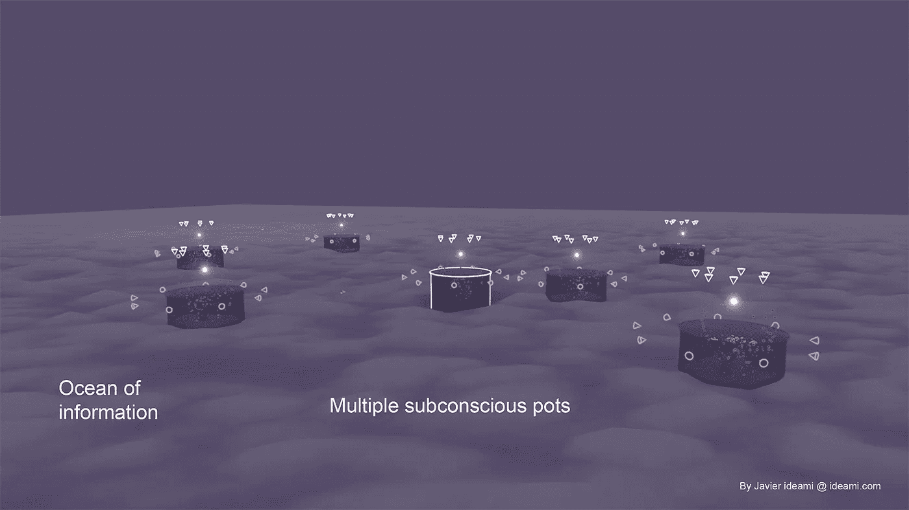**

**哈维尔·伊达米| ideami.com 制图**

**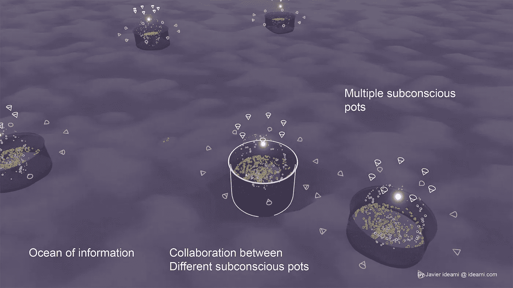**

**哈维尔·伊达米| ideami.com 制图**

**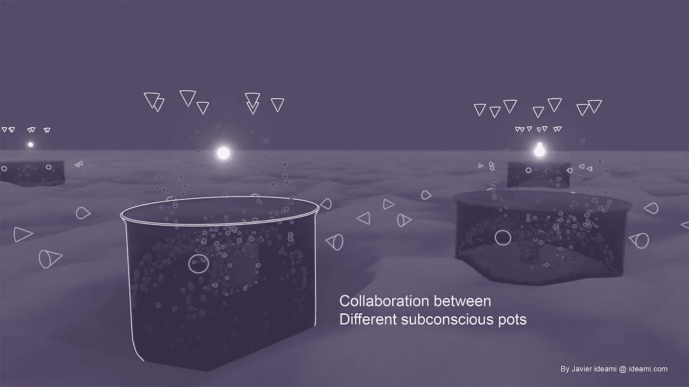**

**哈维尔·伊达米| ideami.com 制图**

**所以，如果你研究历史上一些最伟大的创意者和艺术家，你会发现他们都有话要说，有信息，有愿景。而且，这种愿景，以及他们表达的方式，与他们几十年来培养的能力密不可分，他们以流畅的方式驾驶这些深度电梯，探索宇宙丰富的深度，以及抽象的象牙塔和两极之间的许多领域。**

**最后，关于那些深度电梯，下一步将不是把它们想象成孤立的实体，而是在多维空间中相互连接的多个漏斗。**

**下面这张**折纸**的图片，试图表现隐喻延伸的一小部分。**

**然而，现在是时候停下电梯继续前进了，以便专注于对生殖式人工智能革命的现状进行审查，以及解决其当前成长烦恼的方法。**

****

**深度电梯折纸|贾维尔·艾达米| ideami.com**

**因此，利用我们上面所探讨的，让我们考虑一下今天和未来的情况，以及对此可以做些什么。**

# **好的，狡猾的，房间里的大象**

**让我们来探索从这个生成性人工智能革命的初始阶段衍生出的许多后果。**

# **好人**

*   **生殖型人工智能**和**不会取代人类的创造力。它**会增强**它。**
*   **这项技术**揭开了创造力**的神秘面纱。想想爱迪生说过的话:天才是 99%的汗水(结合、重组、富有成效的工作和实验)和 1%的灵感(播种、打磨等)。多亏了这项新技术，我们现在意识到我们可以自动化很大一部分的创造过程，这一部分是在我们的大脑中潜意识地发生的。**
*   **关于人类决策的研究表明，我们每天做出超过 30000 个决定。但我们只知道其中的 0.26%左右(例如华为的[研究)。我们生活中发生的事情比我们想象的要多得多**潜意识里**。通过人工智能技术自动化我们的潜意识烹饪过程，我们可以以积极的方式影响我们生活的很大一部分。](https://pressreleases.responsesource.com/news/94586/new-research-highlights-the-unlocked-potential-of-the-human-brain/)**
*   **事实上，我称这个新时代为“**超级潜意识的时代**”。**

****

**超级潜意识时代| ideami.com 的图解**

*   **把这项技术想象成一系列不同的**钢铁侠套装**，它们将**增强**你的潜意识，并**增强**你的创意肌肉。**
*   **不同的钢铁侠套装会有不同的风格、特点和个性。**
*   ****提示工程师**是将成为从这些钢铁侠套装中获得最佳效果的专家的人。他们会知道来龙去脉，各自的优缺点。**
*   **当与这些强大的放大器互动时，他们也将成为运用人类经验和直觉的大师，以达到期望的结果。**
*   **因此，这些**提示专家**将在未来几年受到高度重视。他们的角色将成为就业市场上的重要角色。我们将会看到大量的课程、出版物和系统来教育和帮助人们训练这种技能。**
*   **今天我们的**提示**是自然语言和图像。但是由于多模态架构，提示将很快成为我们想要用来指导这些架构的任何类型的数据(不同的系统将被设计来吸收不同类型的指导输入)。**
*   **最初的文本到图像阶段现在已经过渡到文本到视频和文本到 3D 功能。最终，我们将能够使用定制系统输出各种数据，这些系统将针对特定垂直行业的需求。**
*   **接下来，我们将见证**多模态输出**能力，这将最终允许我们制作，例如，包括视觉、对话、音乐等的完整电影。**
*   **这项技术将激发出我们还无法想象的新艺术形式。多模态生成人工智能即将引发结合深度电梯探索和未探索领域的新方法的出现，这些方法最终可能成为备受推崇的新艺术表达形式。**
*   **生殖人工智能将影响大量行业。它将用于通过合成世代扩展科学数据集，革新头脑风暴过程，以仅在几个月前还无法想象的方式个性化品牌，加速实时动态“只为你”营销和广告的兴起，并通过在各种演示文稿周围放置以令人印象深刻的方式匹配其内容的媒体，将各种演示文稿带入一个新时代。从图片库到设计精品店，整个媒体领域都将争相采用这项技术。**
*   **像 **VR & AR** (一般来说，所有形式的 **XR** )这样的尖端技术都将结合这项技术([实验](https://twitter.com/ScottieFoxTTV)已经在进行中)，最终我们将见证沉浸式空间的实时生成，这些空间通过跟踪用户的目光以智能的方式再生(考虑这些实验和唐纳德·霍夫曼的[理论之间的联系很有趣)。](https://www.edge.org/conversation/donald_d_hoffman-realism-is-false)**
*   **这项技术也将加速许多创新过程的探索和实验阶段。从概念设计到产品设计，角色设计和原型阶段，跨越了广泛的领域，生成式人工智能将允许我们在更短的时间内做更多的事情，尝试各种新的方向，并更深入地探索深度电梯的每个级别。**
*   **对许多人来说，所谓的“**元宇宙**”仍然是一个乌托邦，它的体面实现似乎还遥遥无期。如果元宇宙有朝一日成为有用的现实，它可能会发生在生成性人工智能技术的肩上，这可能是加速其实现的关键。**
*   **在更远的未来，我们将见证**智能生成环境(SGE)** 的崛起，它会根据我们的需求或情绪状态而变异。房屋、活动场所和其他环境将开始通过匹配和相似其内容的意图和情感来类似有机生命体。他们将以多式联运的方式这样做。最终，我们将能够与这些环境交流，它们将成为我们心理平衡和健康的重要支撑。**
*   **生殖人工智能与越来越强大的传感模型相结合，能够解释我们表情和行为的每一个细微差别，这将使我们能够对我们的情绪和心理状态进行实时多模式解释。当与脑电波读取技术(脑电图、脑磁图等)的新迭代相结合时，这将迎来一种新的创造性表达，将真正使用我们最亲密的领域作为画笔，产生对人类状况的非凡再现。**
*   **尽管一些工作正处于并将处于危险之中，但我们还无法想象的新角色也很有可能会从管理和与这项技术互动的需求中出现。**
*   **与此同时，许多受影响的工作和角色将通过拥抱这个新时代并使其流程适应这一新技术所提供的内容而生存下来，甚至茁壮成长。**
*   **许多人可能不是专业艺术家，但他们天生就有锻炼创造力的素质，他们将会在这项新技术的帮助下茁壮成长。他们会以更快更容易的方式强化这些肌肉，他们会享受新的机会来增强和放大他们的创造潜力。**
*   **我们将像开始时一样结束这一部分。提醒我们所有人，生成式人工智能不会取代人类的创造力。它会增强它。并且，锻炼我们的创造性肌肉将会继续成为同样被强烈推荐的活动。在我们发散和收敛、压缩和解压的能力之间达到一个良好的平衡，在可预见的未来对我们的精神和心灵健康将继续是非常重要的。**

# **棘手的**

*   **我们，**人类**，有一个有限且相对**小的潜意识**锅。生殖性的人工智能系统被训练成能容纳包含大部分互联网知识的巨大罐子。**
*   **正因为如此，人类创意应该与生成性人工智能系统竞争，这似乎不公平，也不符合道德。**
*   **当机器在下棋方面战胜人类时(这是一个没有这次那么重要的事件)，没有人认为继续探索人类与机器的象棋比赛会有很大的乐趣(除了那些表明我们输掉了战斗的比赛)。我们承认他们更好。然后我们就各奔东西了。**
*   **人类棋手使用**人工智能**来**训练**自己，然后**变得更好**(类似于生成式人工智能系统提供的这些隐喻钢铁侠套装的增强和放大能力)。**
*   **下棋或下围棋的人工智能系统有时会做出人类永远不会想到的非常漂亮的棋步。他们有自己特殊的视角(当然，基于对未来的巨大预见能力)。然而，很少有人对机器对机器的比赛感兴趣。人类更喜欢看其他不完美的人类玩耍。**
*   **在任何情况下，关键是它们将两个领域分开。机器帮助人类棋手训练，变得更好。他们也可以在一起玩。人类各自在自己的比赛中比赛。**
*   **我相信，最终类似的事情可能会发生在生殖人工智能上(当然，有一些不同，因为这些是非常不同的领域)。**
*   **另一个需要考虑的棘手问题是这项技术目前令人兴奋的背后的一个关键因素。我将在本文的最后一节详细阐述这个问题。现在，让我们来介绍一下。**
*   **在许多人看来，格雷格·鲁特考斯基是当今最好的幻想艺术插图画家之一，如果不是最好的话。最近，他的名字出现在大量用于制作一些最令人印象深刻的生成性人工智能艺术的提示中。**
*   **因此，在所有由格雷格·鲁特考斯基(Greg Rutkowski)所画的令人惊叹的艺术作品引发的多巴胺热潮消退后，在这些多巴胺热潮消退后，许多人将会剩下成百上千个人工智能生成的图像或视频，然后，他们会问自己:“现在，什么？”**
*   **大多数情况下答案是“没有”。因为这些人中的大多数人并没有真正锻炼他们与任何深层的有意义的内部驱动相关的创造性肌肉；他们使用这项技术，就像一个人买了一部新的 iPhone，以一种强迫性的方式，跟随闪亮的最新技术。**
*   **当这种冲动消失时，他们会感到某种空虚。因为大多数留下来的东西不是他们的，而是属于格雷格·鲁特科夫斯基和他的风格，这是他几十年努力的结果(举个例子，还有许多活着的艺术家，他们的作品推动了这些网络)。**
*   **无论如何，让我们现实一点。事情发展得太快了，人们需要时间来赶上是有道理的。目前的情况可能有许多解决方案。我将在下一节的最后讨论其中的一些。**

# **明摆着的难题**

**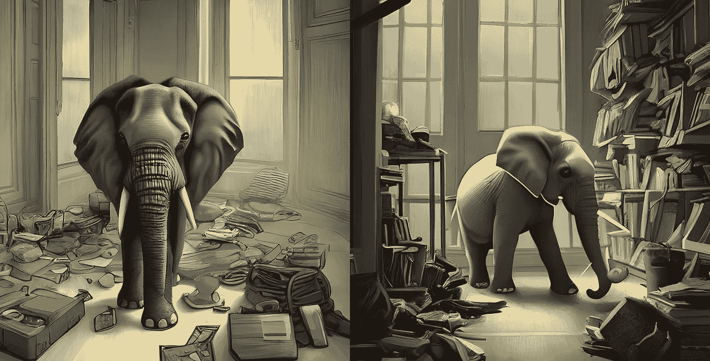**

**在 Geniverse 生成的图像(生成人工智能)**

*   **人工智能生成系统之所以成为可能，仅仅是因为用来训练它们的**巨型数据集**。**
*   **人工智能生成架构由大量数据集训练而成，这些数据集由图像、视频、文本以及其他类型的数据组成。**
*   **这些数据通常是由创建这些数据集的团队从互联网上提取的。**
*   ****这些数据集中使用的数据中的一些**是**公共域** **数据**。使用这样的数据来创建这些数据集似乎是公平的。**
*   **但是，这些数据集中使用的大部分数据属于活着的艺术家，他们没有声明这些数据是公共领域的数据。这些艺术家通过出售这些数据谋生=出售他们几十年的辛勤工作，这些工作产生了一种特定的风格和一系列的作品。**
*   **这些**艺术家**确实是**这场革命迅速崛起的基础**。**
*   **因此，越来越多的在世艺术家对此表示不满。他们中的一些人表示，在世艺术家的作品不应该包含在这些数据集中。据一些人说，他们的抱怨被置若罔闻。他们大多被忽视了(至少到目前为止)。**
*   **如果我们忽视这些活着的艺术家的抱怨，我们就是在忽视我们自己。今天，我们在讨论视觉艺术，但明天，它可能是音乐、小说、法律著作，或者我们的职业或领域。**
*   **让我们再次从许多人在使用这些系统时的体验的角度来思考这一切。当一个人创作出与 Rutkowski 先生的风格和作品极其相似的令人惊叹的数字艺术时，他可能会产生多巴胺的冲动，这种冲动是建立在谁的肩膀上的呢？当然是在 Rutkowski 先生的手机上。更具体地说，是几十年来 Rutkowski 先生为创造这种风格和作品所付出的极大努力和坚持。**
*   **一种风格和一系列作品现在给了那个人如此强烈的多巴胺冲动，当他们花一些时间想出一个包括鲁特科夫斯基名字的提示，然后点击一个按钮，用最少的努力产生一个与他的艺术如此相似的结果。**
*   **有些人可能会说:“但是我花了 50 个小时才想到这个提示”。**
*   **不管这是不是一个夸大的数字，它都不能改变一个事实，即任何人对语言提示的几分钟或几小时的探索，都无法与 Rutkowski 先生等人投入数十年的工作相提并论。**
*   **这也不能改变这样一个事实，Rutkowski 先生从未明确允许他的作品被包含在这些人工智能架构使用的数据集中。**
*   ****提示工科**是艺术+科学。它将逐渐成为一种有声望的技能和学科。**
*   **关于这个问题将会有大量的书籍和课程。伟大的提示工程师将知道许多不同的人工智能架构的来龙去脉、优势和弱点，同时能够将他们的人类直觉应用于从人机交互中提取最佳结果的提示的生成。确实如此。**
*   **但这仍然不是践踏人类同胞和在世艺术家权利的借口。在本文的下一部分，也是最后一部分，我将更详细地讨论我们可以做些什么来解决这个问题和其他相关问题。**
*   **让我们再次强调以下几点:这场革命进展如此之快，人们需要时间来赶上这一切是可以理解的。追赶和寻找更可持续发展方案的过程正处于初始阶段。**
*   **我将永远支持生成性人工智能，但最重要的是，我将支持和捍卫我的创意伙伴(因为人和他们的生命永远比技术更重要)。这是一个**伦理和道德**的问题(法律方面不是本文的一部分。这些将由其他人来解决，我认为伦理和道德应该是这件事的首要指南。**

**这是一场奇妙的革命，将给人类带来许多好处。但是正如我们所看到的，在这些初始阶段也有一些棘手的方面需要考虑。让我们讨论一下如何解决其中的一些问题。**

**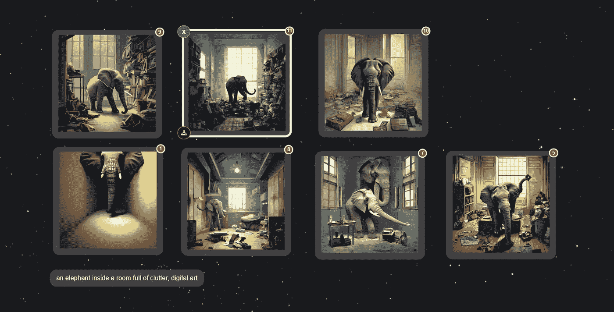**

**在 Geniverse 生成的图像(生成人工智能)**

# **引领革命**

**我将从道德和伦理的角度来阐述这最后一部分。**

**预计最终，许多机构和团体将引入与这些系统相关的不同形式的监管，公司也将引入自己的保障和控制措施。但是，这些以及其他法律观点需要时间来确立。**

**虽然可能没有我们预期的那么多时间。在下一节的最后，我将评论一下[**内容真实性倡议(蔡)**](https://contentauthenticity.org/)**一个**开放标准，**由 **Adobe 创立。蔡**已经有数百家公司加入，其中一些已经计划在他们的平台上实现它。****

****这将允许他们**追踪**数字内容**来自哪里**，如果生成性人工智能已经被用于制作它，以及与错误信息和保护创作者权利相关的其他因素。****

****现在让我们思考如何让这场革命更可持续。****

****一位在世的艺术家，花了几十年时间发展一种风格和一套作品，其权利完全属于我们正在考虑的艺术家，如果这位艺术家的作品被纳入这些大规模生成性人工智能数据集，他应该有发言权和/或得到补偿。****

****否则，就好像，举例来说，你在一个画廊里展示一件艺术品，有人来拿走它，拿走它，并从中获利。有一种被普遍称为**版权**的东西，它并没有在生成式人工智能革命开始时神奇地消失。****

****有些人会以 **YouTube** 为例，说在开始阶段，YouTube 有点像挥舞着这些问题的手，否则他们永远不会起飞。众所周知，现在和很长一段时间，YouTube 在其平台内采用了一套非常严格的版权保护机制。事实是，生成式人工智能已经大规模爆发。因此，最初的“管它呢”阶段是可以理解的，但那个阶段现在已经过去了。因此，像 YouTube 和其他类似平台必须做的那样，开始保护创作者权利的时刻就是现在。****

****最后，我们需要讨论一个超级重要的问题，即**灰色地带**。为此，让我们快速回顾一下我们在前面几节中提到的一点。****

****让人类和机器在同一个艺术比赛、艺术平台之类的地方竞争，这是不公平的。人类潜意识的锅很小。人工智能系统有大量的。人类的潜意识保存着他们生命的有限经验，一个生命的有限经验。人工智能系统拥有数百万或数十亿人类的知识。让我们现实一点。让他们互相竞争是不公平的，也是不道德的。****

****相反，就像国际象棋一样，我们可以想象艺术竞赛和艺术平台中的独立部分。人类创造的艺术。艾的艺术。这已经在世界各地的许多平台上发生了。但是这一点最终把我们带到了灰色地带。****

# ****灰色地带。****

****“等等，这东西还没有完全由人工智能生产出来，你看。我使用人工智能制作了部分作品，是的，没错，但后来我对它进行了润色，我在它的基础上进行了构建，因此，它是合法的，对吗？”****

****我们会听到很多这样的话。因此，解决这种情况至关重要。****

******美国版权局**最近就人工智能作品的注册请求做出裁决，称“**人类作者身份是美国版权保护的先决条件**，因此作品不能注册。”关于这项裁决的详细讨论可以在[这里](https://ipkitten.blogspot.com/2022/02/us-copyright-office-refuses-to-register.html)找到。****

****但是，我们将要面对的(并且已经发生的)是灰色地带。介于两者之间。我相信****的答案**就在— **公有领域 vs 非公有领域—** 的讨论中。******

****因为，在某种程度上，一切都变了但同时什么都没变。我们开始吧:****

*   ******在生殖人工智能**爆发之前，**你可以**去谷歌搜索，找到一些公共领域的图像、视频或任何类型的数据，并将它们融入你的创作过程，一切都很公平和美好。****
*   ******在生殖人工智能**爆发之前，**你不能**去谷歌搜索，从某个活着的艺术家那里找到一些非公共领域的图像、视频或任何类型的数据，并在未经许可的情况下将它们合并到你的作品中(显然是在试图从他们的作品和你的作品的组合中获利时)。我们在这里讨论的不是你只是私下使用一些在线艺术品进行实验，而不寻求从中获利的情况)。****

****好吧，你猜怎么着。这就是答案。没什么新鲜的。答案是，同样的标准可以继续适用。****

*   ******当我们在这场生成性人工智能革命**中导航时，当它与仅使用公共领域数据(或来自在世艺术家的数据，这些艺术家明确允许他们的创作在这些数据集中使用)的数据集连接时，使用这项技术**应该是可以的**。我们再次只提到寻求从使用这种技术中获利的场景。****
*   ****如果您打算将结果用于任何商业目的，在使用包含非公共领域数据的数据集时，完全或部分使用该技术**是不合适的**。你可以为自己的个人用途进行实验，就像现在有些人从一位著名的在世艺术家那里下载艺术品一样，但肯定不是为了商业目的。****

****我认为，这些想法是基于常识。但是其他人可能会想出新的想法来补偿艺术家，这可能为解决这个难题提供新的途径。YouTube 再次提供了解决这些问题的一些替代方法的线索(更多信息见下文)。****

****因此，艺术**竞赛**、艺术**平台**、股票图像平台等可以要求参与者披露:****

*   ****如果他们使用了生成式人工智能技术。****
*   ****如果是，他们使用了哪一种，什么数据集在推动该技术。****
*   ****如果支持这项技术的数据集只包含公共领域的数据，那么他们可能会选择向这项工作敞开大门。****
*   ****如果所涉及的数据集也包含非公共领域的数据，那么他们可以决定关闭这些作品的大门，或者把它们放在一个单独的部分。****
*   ****当然，人们可能会撒谎。因此，我们也将见证自动系统的崛起，这些系统能够识别你的部分作品是否与版权受到保护的在世艺术家的作品相匹配。****

****这正是像 YouTube 这样的平台今天所使用的，例如，与人们上传的视频音乐相关的。会有很多假阳性之类的。就像 YouTube 现在使用的系统一样。这是保护活着的创意者和艺术家的权利所要付出的代价。****

****扩展这些机制来解释各种数据，以及比音频更复杂、更高维的数据，并不容易。但是肯定已经有人在做这些事情了。****

****如果我们再看看 YouTube，我们也可以看到平台可以处理基于非公共领域数据的生成性人工智能艺术的各种方式(预计平台最终将能够检测到这一点，要么是因为用户声明了它，要么是因为它们的自动系统检测到了它，要么是因为像 **CAI 标准**提出的技术有助于检测它)。****

****平台可能会在这些作品中添加广告，并与受影响的艺术家分享利润。或者他们可能会在受艺术家或创作团体相关版权影响的地区封锁部分或全部作品。或者他们会把它们放在单独的特殊类别中(远离人类创造的事物),而这些场景会得到进一步的澄清。我们也可能会目睹各种各样的方式来处理由人类+由公共领域数据驱动的人工智能系统产生的创作。总之，一旦检测系统变得足够好，将有许多方法来处理这些灰色地带。****

****那些**探测系统**的工作已经开始。通过使用[智能元数据](https://contentauthenticity.org/how-it-works)和其他工具， **CAI 标准**将很快开始在世界各地的公司和平台上实施。让我们简单探讨一下它的作用。****

# ******负责任的 AI 和内容真实性倡议(CAI)******

****许多公司和团体已经在研究和设计可以用来处理灰色地带和错误信息的系统。****

****这些系统中的一个是由 Adobe 启动的内容真实性计划。**蔡**实际上是在 2019 年开始的，因为 Adobe 等公司预计到需要一个标准来处理人工智能工具产生错误信息和其他相关问题的可能性。****

****用他们的话来说， **CAI 成员**是:“一个由媒体和科技公司、非政府组织、学术界和其他人组成的社区，致力于推动采用内容真实性和出处的开放行业标准”。([现任成员名单](https://contentauthenticity.org/our-members))****

****该组织的成员资格是免费的，提供开源工具，允许在从捕获到分发的整个过程中跟踪数字内容的来源和属性。****

****最终目标是确保**创意人员的工作得到**认可，并且人们和平台能够**理解**他们正在处理的内容的制作所涉及的**来源和方法**是什么。****

****要强调的关键是，CAI 标准将使人们能够知道，生成式人工智能是否以及如何被用来创建某一段内容。****

****这是一个好迹象，表明有大公司正在努力推广他们所谓的“负责任的人工智能”。系统正在到位，这将允许我们知道每一个数字内容来自哪里，如果生成性人工智能参与其生产或没有，内容附带什么版权，等等。****

****需要强调的是，为了保护摄影记者和其他创作者的隐私和安全，这些创作者可以选择在使用这些系统时是保留署名还是保持匿名。****

****全世界都在关注。在最近的 [**视觉第一届**](https://www.visual1st.biz/) **会议**(成像生态系统的首要会议，在三藩市举行，由 Hans Hartman 和 Alexis Gerard 主持)上，生成性人工智能是谈话的一大部分。在活动开始的炉边谈话中，我有幸与汉斯和亚历克西斯进行了一次精彩的讨论。****

****视觉技术专家像 [**保罗·梅尔彻**](https://www.linkedin.com/in/melcher/) 正在做一项伟大的工作，将最新的生成式人工智能带给全世界的观众。****

****世界各地的教育者们，从像 T2 的 fast.ai 到 T4 的人工智能硕士项目，拥有成千上万追随者的 YouTubers 和 prompt 工程的专家们，正在记录和解释这场革命的每一个阶段。****

****在**数据集**领域，我们也发现了非常有趣的公司和项目，如[datasetshop.com](http://datasetshop.com)，由**虚拟**驱动，是**合法清洁**合成股票媒体的先驱，也是世界上最大的可授权生物统计发布的真实生活数据集的创造者。****

****同样，这是一个好消息，我们正在见证“**负责任的人工智能**”和“**合法清洁的**”数据集等术语的兴起。****

****作为一个在生殖人工智能和艺术这两个领域都非常活跃的人，我试图在这篇文章中给你一个在这些动态早期阶段所涉及的一些观点的高层次概述。****

****让我们提醒自己，在一个快速发展的背景下，这些确实是早期阶段，所以**让我们尽可能温和地对待彼此****，因为我们尽最大努力**在鼓励将为人类带来许多好处的技术与保护创意和艺术家权利的需要之间找到正确的平衡。****

# ****未来会怎样****

****至于未来的时代，在我看来，简单地说:****

*   ****艺术家会继续做艺术家。正如本文试图解释的那样，成为或不成为艺术家与特定的工具或技术无关。相反，它与我们与之前探索的深度电梯互动的方式有很大关系。****
*   ****工程师会继续做工程师****
*   ****研究者将继续做研究者****
*   ******提示工程师**(一个新段)，将是那个，提示工程师。****
*   ****以及**艺术家和创意人员**，专业与否(以下同样适用于专业创意人员或那些天生倾向于锻炼其创意肌肉的人)**将生成性人工智能技术和即时工程**融入他们的过程中，将有更好的机会领导他们的领域，并可能成为更伟大的艺术家和创意人员，因为他们将在这些强大的钢铁侠套装(巨大的潜意识罐)的帮助下孵化他们的想法，并使用同样的技术来加速他们的创意生产过程。****
*   ****最后，懒人会一直做懒人。****

# ****让我们一起努力吧****

****艾肯定要回家了。为了尽可能造福人类，我们必须齐心协力，让这场革命发挥最大的作用。****

****为了完成这篇文章，我们已经探索了相当复杂的问题，**让我们以一种更轻松的语气**结束，用一些**音乐来赞颂这一奇妙的技术**。****

****以下是**女高音科瓦东加·冈萨雷斯·贝尔纳多的一小段表演，**表演了一首由不同人工智能系统和我自己**合作创作的歌曲。GPT 架构用于歌词，音乐变压器用于旋律+和弦，VQGAN 用于视觉效果。(这个小片段中没有出现视觉效果)。这是由[**人工智能研究所**](https://iia.es) **@ iia.es，**提出并组织的一个项目，我在那里做过几次演讲。******

**哈维尔·伊达米| ideami.com 的视频**

**接下来，一个简单的小钢琴 **improv** 致力于**生成性 AI 回家**的主题，更接近人类的潜能。**

**哈维尔·伊达米| ideami.com 的视频**

**最后，一点**时间旅行的乐趣**。我们能否都意识到，我们今天在生成式人工智能方面所经历的一切，在几十年前可能会被解释为一个奇迹？让我们回到 1950 年的西班牙:)**

**哈维尔·伊达米| ideami.com 的视频**

**好好对待每个人，最重要的是，保持人性。**

# **收场白**

**关于我的最后一句话，“保持人性”。**

**有时，人们问我:我认为 30 年、40 年或 50 年后，当人工智能在系统 2 能力(推理、规划等)方面表现出色时，会发生什么？**

****系统 1 和系统 2** 是我们心目中不同类型的**思维模式**。**

**系统 1 指的是快速、潜意识、同时、直觉的过程，这是人工智能正在达到超人能力的领域。**

****系统 2** 指缓慢的、逻辑的、理性的、系统的、精确的、顺序的那种思维。掌握第二种模式仍然远远超出了我们的人工智能系统。(参见**丹尼尔·卡内曼的书**“[思考快与慢](https://en.wikipedia.org/wiki/Thinking,_Fast_and_Slow)”展开系统 1 vs 系统 2 的思考)。**

**关于现在和将来与人工智能相关的系统 2 能力的讨论，将会占满一整篇这样大小甚至更大的文章。所以我下次再讲。让我们回到这个结语开始时提出的问题。**

**我通常会回答，这个问题在几十年后可能不再有意义。为什么不呢？**

**因为**今天**AI 和人类之间有一个**分离**。AI 在那里。我们在这里。**

**但是**几十年后**，那种**分离将不再存在**。想想 Neuralink 公司这些天已经在做什么了。这只是未来的开始。**

**在几十年内，我们的技术，包括人工智能，和我们的生物学，将会在很多方面融合。**

**然后，新的问题可能是:**“既然我们在一起了，接下来我们要去哪里？”****

**感谢您的阅读。**

**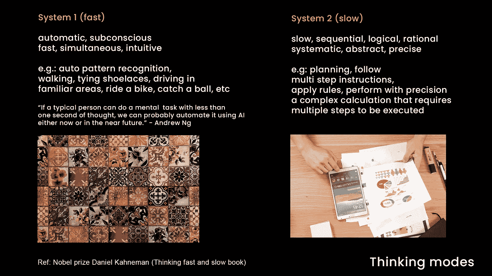**

**凯莉·西克玛和 Firmbee.com 在 Unsplash 上的照片|贾维尔·伊达米的文字| ideami.com**