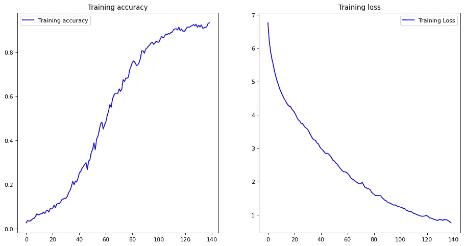

# 训练神经网络像人类一样创造文本

> 原文：<https://towardsdatascience.com/training-neural-networks-to-create-text-like-a-human-23bfdc23c28>

# 训练神经网络像人类一样创造文本

## 递归神经网络可以生成与人类书写难以区分的文本。这里有一个亚马逊产品评论数据的例子。


由 mauricio SANTOS 在 [Unsplash](https://unsplash.com?utm_source=medium&utm_medium=referral) 上拍摄的照片

语言建模使用各种技术来确定特定语言的句子中单词序列的概率。它在很大程度上借鉴了 Yoshua Bengio 及其合作者的工作(例如，参见 [Bengio 等人，2003](https://www.jmlr.org/papers/volume3/bengio03a/bengio03a.pdf) )中的神经概率语言模型)。

事实上，语言模型被用于人们日常使用的应用程序中。语音识别系统，如亚马逊的 Alexa，将语音转换为文本，其关键组件之一是其语言模型([拉朱，2019](https://www.amazon.science/blog/how-to-make-neural-language-models-practical-for-speech-recognition) )。此外，目前帮助在所有主要语言之间直接翻译句子的谷歌翻译(Google Translate)由深度学习语言模型支持(【吴等人，2016 ，展示了其原始架构)。

本文将说明神经语言模型如何生成人们无法从人类书写中识别的文本。我们将探索 TensorFlow 中的实现，并将使用和****神经网络编写产品评论。产品评论可以作为非常好的训练数据，因为它们通常比书籍或诗歌在语法上更简单，这样，深度神经网络应该可以很好地预测文本。****

# ****数据****

****朱利安·麦考利从他的[网站](http://jmcauley.ucsd.edu/data/amazon/)收集的亚马逊产品评论数据被用作训练数据。通过在亚马逊上填写评论，客户授予亚马逊权利*“使用、复制、修改、改编、出版、表演、翻译、创作衍生作品、在全球范围内以任何媒体发布和展示这些内容。”* ( [数据使用条件](https://www.amazon.com/gp/help/customer/display.html?nodeId=508088)编于[何、麦考利，2016](https://arxiv.org/abs/1602.01585) )。****

****这里有几个例子:****

********

****作者图片****

> ****当生成文本时，我们不需要验证数据集，并将使用 100 %的数据进行训练。我们将仅使用训练数据来预测单词序列。没有过度拟合的风险，没有一般化，不需要训练测试分割。****

****本文使用 TensorFlow 和 Pandas 版本，此处指定。要复制文章，请在虚拟环境中按照这些要求运行代码。****

# ****建立语料库****

****从实现开始，有必要参考一下 [Laurence Moroney 在 TensorFlow](https://www.youtube.com/watch?v=ZMudJXhsUpY) 开设的 NLP 基础课程。我遵循了他的指导方针，但是在必要的地方对 python 代码做了一些修改。****

****我们将遵循这个方案:****

********

****图片作者(来源:draw.io)****

****我不会过多地讨论几个概念的细节。请使用 [**这篇文章**](https://www.kdnuggets.com/2020/03/tensorflow-keras-tokenization-text-data-prep.html) 来刷新这些术语的含义:标记化、填充、文本到序列。****

****此功能删除特殊字符、标点和数字，并准备一个干净的评论列表。我们需要熊猫和熊猫。****

****接下来，我们**通过创建一个 tokenizer 对象并使其适合清理后的数据，对数据进行标记化。Tokenizer 将文本语料库矢量化，将其转换为单词及其索引的字典。******

**对于每个评论，我们准备 **n-grams** 来使用作为训练的输入序列。**

**我们将训练模型来预测所有可能的单词组合；因此，单个有序审查的 n 元语法如下所示:**

****

**作者图片**

**最后，我们填充测序数据并定义**预测值**和**标签**。我们使用预测器来猜测序列中的下一个单词是什么，并使用标签来纠正模型的预测。**

# **模特培训**

**为了训练模型，我们需要 *TensorFlow* 和 *Keras* :**

**顺序模型包括六层:第一层将文本输入矢量化到 240 个维度。第二层是一个 LSTM，然后是一个辍学层做一些正规化。两个密集层跟随另一个 LSTM，在最后一个中具有 softmax 激活功能。**

**这项任务需要对模型进行多次训练，以获得良好的准确性。让我们也在准确度达到某个阈值(在我们的例子中是 93 %)时设置一个回调，并将其传递给`fit`方法。**

**我们在大约 140 个时期内达到了 93 %的准确率。这是沿着训练时期的准确度和损失的图:**

****

**作者图片**

# **训练数据与生成的文本**

**现在，让我们看看客户评论和用神经网络生成的评论，看看我们是否能发现任何差异。**

****

**作者图片**

**生成的评论中有一些不完美之处:**

1.  **没有逗号，但训练数据中的许多“真正的”评论也漏掉了逗号。**
2.  **除了句子中的第一个单词，预测不处理大写字母。同样，在“我”的地方有“我”。**

**否则，很难发现任何差异。**

*****我们是怎么做到的？*****

**该模型基于我们指定为输入的种子文本来预测下一个单词。下面是我们要求神经网络完成的句子的五个开头:**

**我们之前适合训练数据的标记器现在用于对种子文本(前两个单词)进行排序，然后填充种子文本并使用`model.predict_classes.`预测下一个单词。然后，循环将预测的单词附加到一个句子中，并以相同的方式继续，直到我们获得一个包含 12 个单词的大写句子(种子文本+ 10 个预测的单词)。**

**如果我们想解决“I”的问题，我们可以在代码中用“I”替换“I ”,如下所示:**

```
if output_word == ‘i’:
 output_word == ‘I’
```

# **结论**

**这篇文章展示了一个简单的神经网络如何产生一个很难从人类书写中识别的文本。亚马逊评论是很好的训练范例。当然，一个主要的区别是，递归神经网络只是一种应用的统计方法，并且不理解它被训练的文本。但是，将人类编写的文本和程序生成的文本进行比较真的很令人兴奋，这两者看起来非常相似。**

**jupyter 笔记本的完整代码可以在我的 [GitHub](https://github.com/PetrKorab/Training-Neural-Networks-to-Create-Text-Like-a-Human) 上找到。**

***PS:你可以订阅我的* [*邮件列表*](https://medium.com/subscribe/@petrkorab) *在我每次写新文章的时候得到通知。如果你还不是中等会员，你可以在这里加入*[](https://medium.com/@petrkorab/membership)**。****

******免责声明:*** *本文使用的数据仅作为 TensorFlow 中教学文本生成的训练示例，适合这种特定的深度学习应用。作者不同意在生产中使用生成的数据，或者暗示任何不道德或法律禁止的行为。****

## ***参考资料:***

***一个神经概率语言模型。 J *机器学习研究杂志*，2003 年第 33 期，第 1137–1155 页。***

***拉朱，A. [如何使神经语言模型在语音识别中实用](https://www.amazon.science/blog/how-to-make-neural-language-models-practical-for-speech-recognition)。*亚马逊科学博客*，2019 年 8 月 29 日。***

***何，r .，麦考利，J. [沉浮:用一类协同过滤建模流行趋势的视觉演变](https://arxiv.org/abs/1602.01585)。*国际万维网大会。*2016 年 4 月 11 日至 15 日，加拿大魁北克省蒙特利尔。***

***训练人工智能创作诗歌。 [*Youtube NLP 零到英雄课程，第 6 部分。*](https://www.youtube.com/watch?v=ZMudJXhsUpY)***

***Mayo，M. [使用 TensorFlow & Keras 进行标记化和文本数据准备。](https://www.kdnuggets.com/2020/03/tensorflow-keras-tokenization-text-data-prep.html) *KDnuggets 教程。****