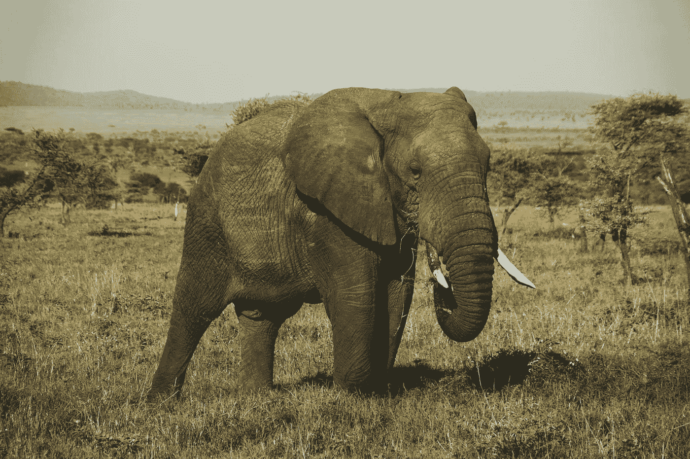
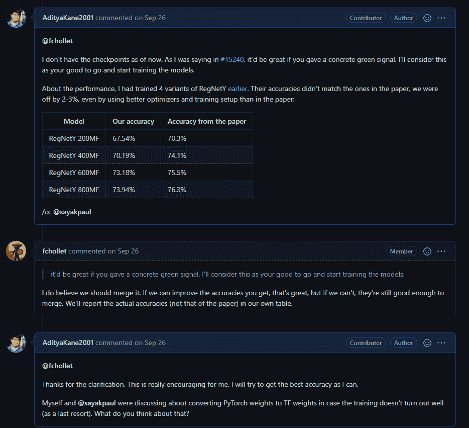
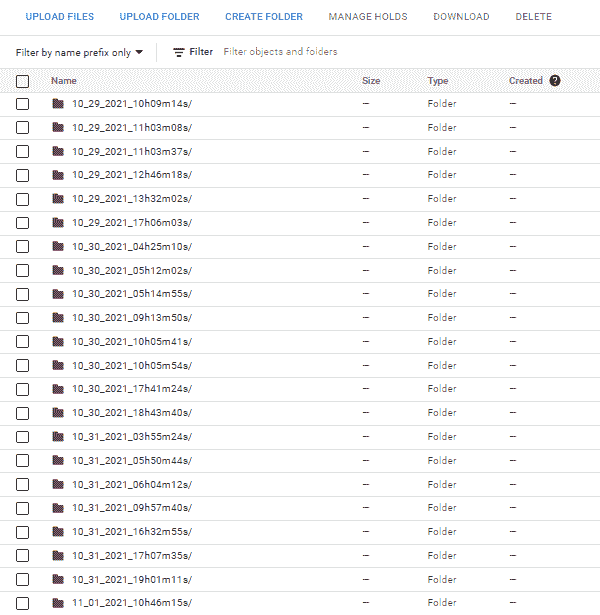
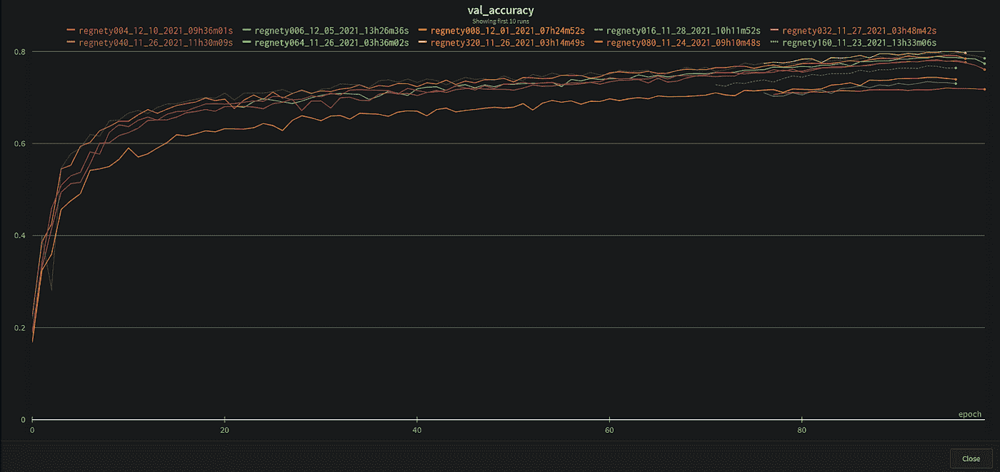

# tf.keras .应用程序的培训规则

> 原文：<https://towardsdatascience.com/training-regnets-for-tf-keras-applications-c9bcdc70755>

## 这篇博文是关于分享我为`tf.keras.applications`训练 24 个 RegNet 模型的经验。

Paola blaskovi 在 [Unsplash](https://unsplash.com/photos/5Md4QPSQVhE) 上的照片

# 序言

`tf.keras.applications`是 TensorFlow-Keras 中的一组内置模型。它们在 ImageNet-1k 上进行了预训练，只需一次函数调用。这使得大联盟成员的生活更加轻松，因为他们有现成的模型可供使用。[regnet](https://arxiv.org/abs/2003.13678)是脸书人工智能研究所(FAIR)提出的高效可扩展模型。它们被用在像 [SEER](https://arxiv.org/abs/2103.01988) 这样的工程中，这些工程需要可以扩展到亿万个参数的模型。在向 Keras 提交 [PR 的过程中，我实现并训练了 24 个不同复杂程度的 RegNet 模型给`tf.keras.applications`。](https://github.com/keras-team/keras/pull/15702)

尽管我负责 PR 的主要开发工作以及培训模型，但我从社区获得了很大的帮助，这使它真正具有协作性。

我用这些模型进行了几个实验，因为使用本文提供的超参数无法重现报告的精度。这篇博文记录了我尝试的这些实验以及它们的结果。

# 致谢:

我真诚地感谢 Keras 团队允许我添加这些模型。非常感谢 [TPU 研究小组(TRC)](https://sites.research.google/trc/about/) 在整个项目期间提供 TPU，没有他们，这一切都是不可能的。非常感谢[Fran ois Chollet](https://github.com/fchollet)允许这一点并在整个过程中指导我。感谢[Scott Zhu](https://github.com/qlzh727)在虚拟机上从源代码构建 Keras 的指导。感谢 Matt Watson 对分组卷积的支持。特别感谢 Lukas Geiger 对代码的贡献。最后但同样重要的是，非常感谢 Sayak Paul 不断的指导和鼓励。

# 基础知识

## 关于报纸

论文[“设计网络设计空间”](https://arxiv.org/abs/2003.13678)旨在从一个没有约束的模型空间出发，系统地推导出最佳模型群体。该文件还旨在找到一个最佳模型群体，而不是像在 [NASNet](https://arxiv.org/abs/1707.07012) 这样的作品中找到一个单一的最佳模型。

该实验的结果是一系列网络，其包括具有各种计算成本的模型。用户可以根据需要选择特定的架构。

## 关于模型

RegNet 系列的每个模型都包含四个阶段。每个阶段由许多块组成。该模块的架构是固定的，并且该模块有三种主要变体:X 模块、Y 模块、Z 模块。在论文中可以看到其他变体，并且作者声明模型推导方法是稳健的，并且 RegNets 很好地推广到这些块类型。

每一级的块数及其通道宽度由文中提出的简单量化规则决定。更多信息请见[博客](https://medium.com/visionwizard/simple-powerful-and-fast-regnet-architecture-from-facebook-ai-research-6bbc8818fb44)。由于其卓越的扩展能力，正则网络已经成为 SEER 等自监督方法的首选网络。

# 拉取请求:

在打开需要大量工作的“拉”请求之前，建议先咨询团队，这样就不会有利益冲突。在得到 Keras 团队的可靠确认后，我开始编写代码。你可以点击查看我们的讨论[。以下是我们对话中的一小段:](https://github.com/keras-team/keras/issues/15240)

问题#15240 的摘录

Franç ois Chollet 和 Keras 团队给予了极大的支持，使合并 PR 成为一个顺利的过程。我对团队的帮助表示衷心的感谢。

尽管我要实现 24 个模型，但基本代码相当简单。因此，我能够用代码创建一个 PR，并很快得到团队的评论。点击查看公关[。](https://github.com/keras-team/keras/pull/15702)

# 训练模型:

## 一般设置

我主要用 TPU v3–8 节点进行训练。它有一个 96 核虚拟机，大约 335 GB 内存，可以轻松处理繁重的预处理。经过预处理后，原始图像被调整到 224x224 的大小，如文中所述。我同时使用多个 TPU 节点，以便并行运行多个实验。这大大减少了实验时间。

我用来训练的代码可以在[这里](https://github.com/AdityaKane2001/regnets_trainer)得到。

在这一部分，我简单地记下了我实现这一表现的要点和方法。

## 1.输入管道

我在强大的 TPU-v3 上训练这些模型(感谢 TRC)。这意味着我不得不使用一个快如闪电的输入管道。此外，输入管道必须是静态的，这意味着我不能在运行时突然改变预处理图(因为预处理函数是使用 AutoGraph 优化的)。根据 TPUs 的要求，我将 ImageNet-1k TFRecords 存储在一个 GCS 存储桶中，并采用了一种交叉读取数据集的方法。

*学习要点:重要的是以最有效和最稳定的方式实施扩增，并在此过程中尽量减少缓慢和冗余的操作。*

这里有一个例子，说明如何避免执行图中的动态变化。我已经为盗梦风格的裁剪创建了几个函数，最初的盗梦文件推广了这个函数。有趣的是，在图形执行中不允许使用`break`语句，因为它们会动态地改变图形。

一些代码块是重复的，但是这保证了函数保持纯净。这里的纯粹仅仅意味着没有`break`语句，否则会导致图形任意变化。例如，我们还可以看到，在整个函数调用中，变量`w_crop`恰好被转换为`tf.int32`一次。进行这样的优化很重要，因为我们一次处理一个图像，而不是一批图像。你可以在这里查看代码。为了简洁起见，实际的代码没有包含在这个博客中。

除了初始风格的裁剪，其余输入管道的实现相当简单。总之，我使用了初始裁剪、通道式 PCA 抖动、水平翻转和[混音](https://arxiv.org/abs/1710.09412v2)。

PCA 抖动增强代码

混合增强代码

水平翻转增强代码

论文中提出了 PCA 抖动和随机水平翻转，而添加 mixup 则受到了论文 [Revisited ResNets](https://arxiv.org/abs/2103.07579) 的启发。

## 2.体重衰减对训练的影响

权重衰减是一种正则化技术，我们对过大的权重进行惩罚。权重衰减是一种久经考验的方法，经常在训练深度神经网络时使用。一个小注意，我使用解耦权重衰减，而不是权重衰减的传统实现。

我看到增加过多的权重衰减会使模型难以收敛。然而，小的重量衰减导致模型在最后的时期具有接近恒定的精度。这些观察表明，重量衰减是一个强正则化，特别是对于较小的模型。受论文[“重温结果:改进的训练和缩放策略”](https://arxiv.org/abs/2103.07579)的启发，我保持大模型的权重衰减不变，因为混合同时增加。

*学习点:权重衰减是强正则化。对于大型模型，建议减少权重衰减或保持其不变，同时使用其他增强或正则化。*

最后，我对所有模型使用了 5e-5 的恒定重量衰减，这是原始论文中建议的。

## 3.作为模型大小函数的正则化

根据经验，增加正则化的增强会导致更好的性能。与此一致，随着模型尺寸的增加，我逐渐增加了混合增强的强度。我看到使用这个简单的技术效果很好。

*学习点:增加模型规模时，增加扩充和正则化。*

## 4.较小的模型很难训练

我必须训练 RegNetX 和 RegNetY 的 12 个变种。这包括小模型，它们没有大模型那么多参数。据推测，这些模型根本没有足够的容量来保存给定的信息。它们往往会出现不足，解决方案很少像增加功能那样简单。在大多数情况下，最好的起点是低正则化和中等增强。我可以从那里调整其余的超参数。这些模型需要花费大量时间进行微调和训练，而较大的模型具有更大的灵活性。较小的模型对正则化或增强中的微小变化很敏感。

*学习点:做一个小模型的超参数搜索。随着模型尺寸的增加，重复搜索。*

## 5.值得注意的学习:

**答:如有可能，使用数据的多个副本**

据观察，训练会突然停止，并在一个时期结束时停滞不前。我使用了`tf.data.Dataset.interleave`方法，它同时从多个 TFRecords 中读取数据。在此读取操作期间，TFRecords 对其他进程不可用。我曾经并行训练多个模型，因此它们经常需要从同一个桶中读取数据。因此，为了解决这个问题，我创建了 TFRecords 的多个副本，并将它们保存在不同的桶中。这减少了碰撞，问题也大大减少了。

**b .在单一位置转储日志**

在训练多个模型时，维护日志可能会失控。在我看来，最好的办法是把所有的原木都倒在一个地方。在我们的例子中，我使用训练的时间和日期来组织模型的日志和检查点。这使得在需要的地方定位和使用检查点变得更加容易。以下是相同的快照:

我的圆木桶。虽然有点乱，但确实管用:)

**c .使用自动化来减少认知负荷**

同时快速管理多个实验成为一项艰巨的任务。从一开始就将你需要重复做的事情自动化是一件非常有用的事情。例如，可以使用权重和偏差(W&B)来自动跟踪所有实验。将超参数与运行一起记录在 W&B 中是有用的，而不是手动输入它们。这些看起来很小的事情减少了大量的认知负荷，所以你可以专注于重要的事情——进行实验。以下是我们运行的快照:

**d .获得模型如何对超参数的某些变化做出反应的直觉**

在一个架构上工作了几天或几个月之后，您可能会注意到模型性能的模式。这有助于建立模型如何对超参数的不同变化做出反应的直觉。利用这种新发现的直觉，你可能会想出有助于提高性能的主意。例如，对 RegNetY004 使用稍高的权重衰减会导致运行结束时准确度突然增加，然后降低，但使用较低的权重衰减会使这种情况变平。这意味着，在这种情况下，使用更积极的增加策略和更低的体重下降可能有助于训练。以类似的方式，人们可以发现导致显著改善的超参数的变化。

最后，这里是结果。在下面的表格中，我将我们的结果与论文进行了比较。最后一列具有不同于原始实现的超参数。

**X 变种**

**Y 变体**

# 结论

为了这次公关，我一共训练了 24 个模特。这是一次丰富的经历，我希望这些模型将被许多开发人员使用。通过这次经历，我学到了很多东西，我希望在不久的将来继续为 TensorFlow & Keras 做出贡献。