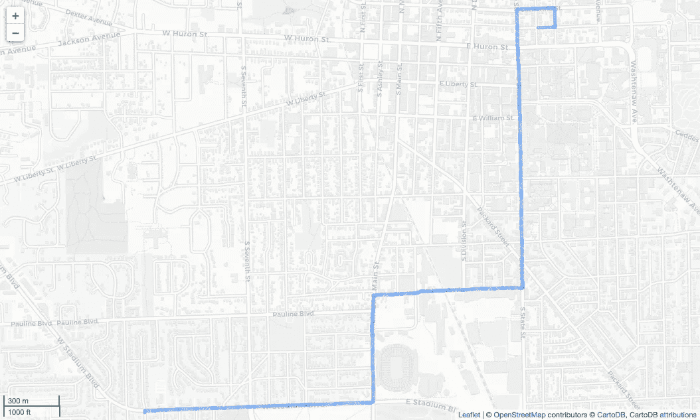
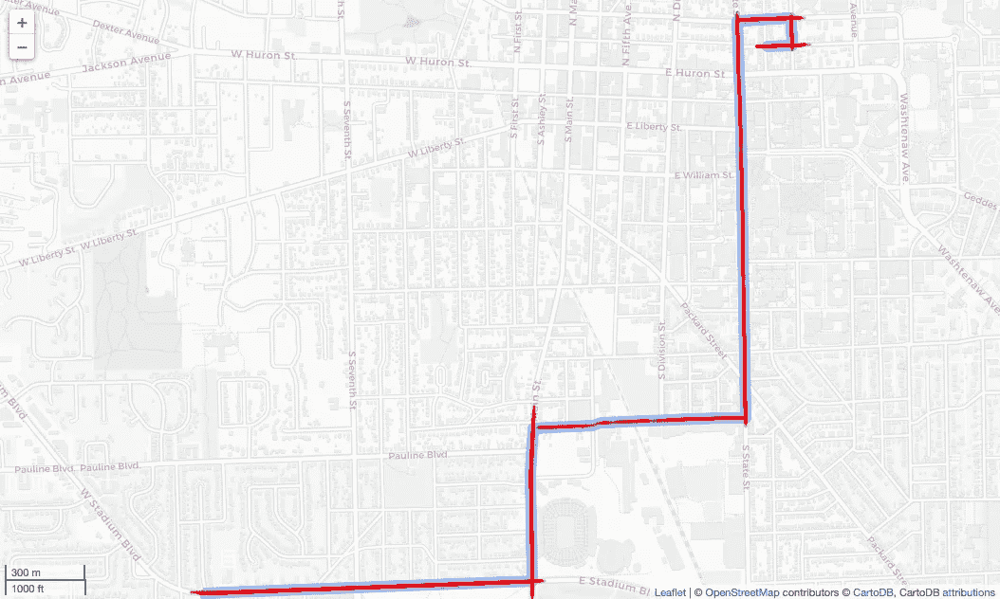
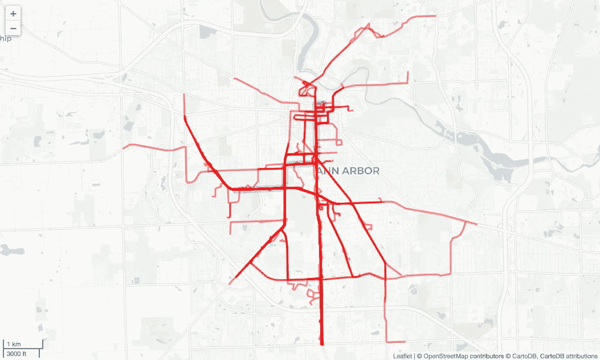
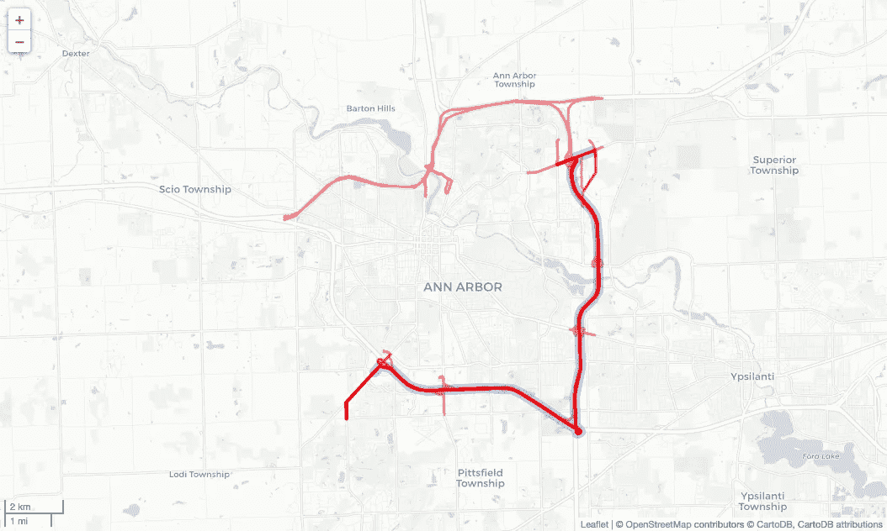
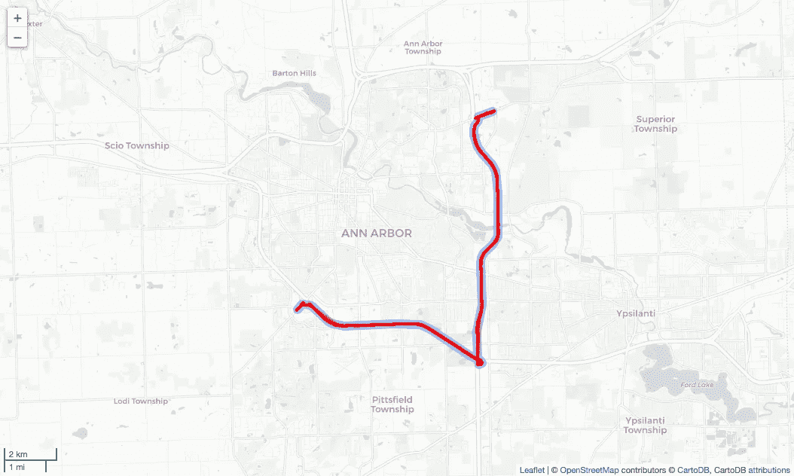

# 使用空间划分的轨迹查询

> 原文：<https://towardsdatascience.com/trajectory-queries-using-space-partitioning-773167d4184e>

## 怎样才能快速找到重叠的轨迹？

照片由 [Unsplash](https://unsplash.com?utm_source=medium&utm_medium=referral) 上的[延斯·勒列](https://unsplash.com/@madebyjens?utm_source=medium&utm_medium=referral)拍摄

当穿越空间时，一个物体描绘了一条轨迹。我们可以把轨迹看作是时间的函数，它输出空间位置。从概念上讲，轨迹是连续的函数，尽管我们实际上使用它们的离散形式。离散轨迹是空间中点的时间有序集合，其中我们隐含地假设每个点之间的线性插值。这种表示使得在数据库中存储离散轨迹非常容易和直观。

本文介绍了一种使用空间划分机制从关系数据库中高效查询轨迹的方法。在这里，我们使用方形分区和我在[上一篇文章](/travel-time-estimation-using-quadkeys-ecf6d54823b4)中使用的[扩展车辆能源数据集](https://arxiv.org/abs/2203.08630v1) (EVED)来解决这个问题。

EVED 包含了从 2017 年 11 月到 2018 年 11 月一整年期间在密歇根州安阿伯收集的超过三万二千条这样的轨迹。EVED 论文的作者用几个额外的功能增强了数据集，即地图匹配的 GPS 坐标。地图匹配是一个使用车辆的噪声 GPS 数据流来推断车辆行驶过哪些道路的过程。这个过程需要访问该地区的数字地图，对于这个数据集，论文作者使用了 [OpenStreetMap](https://www.openstreetmap.org/) 公共数据和 [Valhalla](https://github.com/valhalla) 地图匹配引擎。

地图匹配过程将每个采样的 GPS 位置“捕捉”到最可能的街道或道路。该过程使用复杂的概率算法，从采样位置序列中推断出最可能的地图路径。您可以在源数据集中看到这方面的证据，其中每个样本都包含两个位置，即高噪声位置和地图匹配位置。在本文中，我们将只使用第二组。

**下面的图 1** 说明了地图匹配过程如何将采样的 GPS 位置捕捉到最可能的道路网络边缘。

**图 1** —地图匹配过程将嘈杂的 GPS 测量捕捉到最可能的道路网络边缘。在这里，您可以看到对该过程的描述，其中标有“n”的圆圈表示道路网络节点，标有“e”的箭头表示有向边。绿色的采样 GPS 位置与弧线上的另一个位置相匹配，并记录在数据库中。但是没有关于匹配边缘的信息。(图片来源:作者)

注意，数据集只包含匹配的点；它没有扩展到包括匹配的边。边缘信息的缺失使得查询过程变得更加困难但是有趣。

# 查询轨迹

查询一个轨迹是什么意思？在本文的上下文中，查询轨迹意味着使用输入轨迹来查询轨迹数据的数据库。我们从查询轨迹开始，可能是从地图提供商那里获得的，然后使用它从数据库中检索特定的信息。在这种情况下，我们将检索完整的*轨迹*或相交的*轨迹段*。

**图 2** —轨迹是轨迹段的集合，上面用箭头表示。箭头顶点是采样的 GPS 位置。轨迹段不必与现有的道路网络重合。(图片来源:作者)

地图匹配轨迹可确保其结点位于路网边缘，但不必与路网结点重合。

例如，我们可以用查询结果实现行程时间估计。如果所查询的轨迹包含能量消耗信息，那么我们可以使用这些信息来预测未观察到的轨迹的消耗。你可以为轨迹查询想出更多的用例。

# 问题

我想解决的问题是查询数据集，寻找与覆盖区域上的任意查询轨迹相匹配的*轨迹段*或*完整轨迹*。*轨迹段*是连接给定轨迹上两个连续位置的[测地线](https://en.wikipedia.org/wiki/Geodesic)。轨迹是连续轨迹段的集合，如图**图 2** 所示。轨迹查询应该检索与输入最匹配的轨迹段，并排除方向相反的轨迹段。

# 解决办法

我在这里的解决方案使用了[四键](https://learn.microsoft.com/en-us/bingmaps/articles/bing-maps-tile-system)来分割地理空间以实现更快的查询，并建立在我在[以前的文章](/travel-time-estimation-using-quadkeys-ecf6d54823b4)中使用的类似技术的基础上。请参考该材料作为当前讨论的介绍。

我设计的解决方案需要扩展数据库中的信息，将轨迹离散为四键线。我们稍后使用这些四键索引来匹配四键离散化轨迹查询。

让我们看看解决方案是如何工作的。

## 数据准备

如果您遵循上一篇文章中的过程，我们创建了一个支持的 [SQLite](https://www.sqlite.org/index.html) 数据库，其中包含一个包含所有采样信号的表。我们需要在现有数据库中创建三个新的支持表，以支持更快的轨迹索引。

第一个表格模拟轨迹，这很容易做到。原始数据已经包含由**车辆**和**行程**标识符唯一识别的轨迹信息。图 3 中的代码显示了简单的表格结构。

**图 3** —上面的 SQL 代码创建了包含所有记录轨迹的表格。(图片来源:作者)

**下图 4** 显示了如何从现有信号表中的数据填充轨迹表。

**图 4** —上面的代码显示了如何从信号中填充轨迹表。(图片来源:作者)

我们为轨迹中的每对不同位置创建一个*链接*(一个*轨迹段*)。每个链接都包含信号对的标识符和我们在上一篇文章中计算的方位的信息。**下图 5** 显示了表格结构。

**图 5** —链接表包含包含轨迹和信号端点的标识符信息。方位与最终信号的方位相同，出于性能原因复制到这里，因为它避免了额外的连接。(图片来源:作者)

最后，我们为链接端点的线创建包含单个四键的表。**下面的图 6** 显示了创建该表的 SQL 代码。

**图 6** —上表中的每一行包含一个整数四键代码，对应一个行像素。当查询轨迹链接时，我们使用这个四键代码作为匹配目标。(图片来源:作者)

请注意，我们将在四键代码列上创建一个索引，以支持轨迹查询。这个索引列将把查询轨迹与轨迹链接相匹配，并且可能与轨迹本身相匹配。

数据准备过程的最后一步也是最长的一步，因为它需要列举所有轨迹，确定所有联系，最后在它们的端点之间画线。下面的图 7 显示了填充这两个表的代码。

**图 7** —上面的函数填充了链接表和相应的“像素”行。每个“像素”都是一个四键代码，用于以后的查询。(图片来源:作者)

该功能首先将所有数据库轨迹加载到包含轨迹、车辆和行程标识符的元组列表中。**下面的图 8** 显示了加载所有轨迹的简单代码。

**图 8** —上面的代码从数据库加载所有轨迹。(图片来源:作者)

接下来，我们迭代轨迹列表并处理每一项，从加载轨迹的点开始(图 7 中的第 7 行)。这里我们需要解决数据库中连续重复位置的问题。这种情况可能是由于 GPS 位置变化之间产生的信号的不同采样周期而发生的。**下图 9** 显示了如何在这些情况下加载轨迹的点。

**图 9** —上面的代码加载轨迹中的所有点，确保没有重复的位置。(图片来源:作者)

现在我们有了所有唯一的轨迹点，我们迭代每个连续的对(**图 7** ，第 10 行)并创建相应的链接。请记住，链接连接数据库中两个连续的车辆位置。下面图 10 中的代码显示了如何插入一个新链接并检索新生成的标识符。

**图 10** —插入新的链接时，我们重新使用先前计算的方位值。插入最新数据后，上面的函数返回新生成的标识值，以备后用。(图片来源:作者)

插入链接后，我们可以使用与上一篇文章相同的方法在端点之间画出四键线*。使用四键和位图像素之间的类比，我们可以很容易地绘制一条连接任意两点的线(**图 7，**第 16 到 18 行)。生成的行是我们插入到数据库中的四键代码的简单列表。下面图 11 中的代码说明了该过程。*

***图 11** —上面的代码将四键代码批量插入数据库。(图片来源:作者)*

*一旦完成，我们需要创建一些支持索引，我们准备好开始查询轨迹的数据库。请参考 [GitHub 库文件](https://github.com/joaofig/eved-explore/blob/main/calculate-trajectories.py)中的完整源代码。*

# *查询轨迹的方法*

*查询包括将查询轨迹离散化为一组四键代码，然后将它们与先前离散化的链接四键进行匹配。我们将从两个不同的角度来探讨这个问题。第一种观点涉及使用任意轨迹作为查询，而第二种观点使用数据库中的现有轨迹。例如，最后一种方法可能驱动轨迹聚类算法。*

*请使用已出版的 [Jupyter 笔记本](https://github.com/joaofig/eved-explore/blob/main/06-trajectory-querying.ipynb)和支持的[图书馆代码](https://github.com/joaofig/eved-explore/blob/main/geo/trajectory.py)来跟随这个讨论。*

## *使用任意轨迹进行查询*

*我们从第一种方法开始，使用两个随机地址定义一个任意查询。**下面的图 12** 显示了我们将使用的查询轨迹。*

**

***图 12** —上图描绘了从地理编码地址计算出的随机查询轨迹。较暗的蓝点代表道路网络节点。(图片来源:作者使用了 Folium 和 OpenStreetMap 图像)*

*我们使用图 13 中的简单代码片段生成上述路线。首先，我们实例化一个对象，帮助我们查询在现有道路网络上定义的任意轨迹。这里，我们使用密歇根州安阿伯市的定义。接下来，我们使用来自同一城市的两个随机地址生成查询路由。生成的路径由包含相应道路网络节点的列表组成。请注意，这些位置不一定与数据库中的位置匹配。*

***图 13** —上面的代码加载安阿伯的道路网络，并从两个任意地址生成一条路线。请注意，图形路由对象保留了函数 return 的副本以供将来使用。(图片来源:作者)*

*正如我前面提到的，查询任意轨迹需要将其离散化为四键，以便进行后续的数据库搜索。图 14 中列出的功能显示了如何实现这一点。该函数为每对道路网络结点生成一条四键线以及相应的方位角。我们将使用该列表通过执行精确的四键匹配和近似的方位比较来查询轨迹数据库。*

***图 14** —上面的函数将生成的路线转换成一列四键和方位对。(图片来源:作者)*

*下一步是将生成的路径四键和方位列表与数据库中的轨迹记录进行比较。下面的**图 15** 中列出的函数就是这样做的，并返回链接和相应的轨迹标识符。为了方便和以后使用，该函数还返回相应范围的信号标识符。*

***图 15** —对于每个查询轨迹四键和方位对，我们向链接表发出一个查询，返回匹配的链接和轨迹标识符。(图片来源:作者)*

*使用重叠链路标识符，我们可以用数据库中的匹配轨迹段来补充图 12 中的图(见**图 16** )。请注意，我们仅在方位上过滤这些查询，但也可以将这些查询扩展到一天中的时间或一周中的某一天，如在[上一篇文章](https://medium.com/towards-data-science/travel-time-estimation-using-quadkeys-ecf6d54823b4)中。*

**

***图 16** —上图用红色显示了数据库中所有匹配查询轨迹的轨迹链接。我们可以使用这些链接的属性来推断查询轨迹的属性。(图片来源:作者使用了 Folium 和 OpenStreetMap 图像)*

*我们现在可以扩展练习并显示与查询轨迹最匹配的完整轨迹。为了验证匹配质量，我使用了 [Jaccard 相似度](https://en.wikipedia.org/wiki/Jaccard_index)度量来衡量四键集的相似程度。**下面的图 17** 显示了使用 Python 集合实现这个指标是多么容易。*

***图 17** —上面的代码显示了 Jaccard 相似性的简单实现。(图片来源:作者)*

*为了计算这种相似性，我们必须加载所有匹配轨迹的四键，并使用 Jaccard 相似性将它们与查询进行比较。图 18 中的代码描述了这个过程。*

***图 18** —为了计算轨迹与查询的相似性，我们必须首先从数据库加载四键并比较两组，如上所述。该函数返回包含轨迹标识符和与查询轨迹的 Jaccard 相似性的元组列表。(图片来源:作者)*

*有了这些信息，我们现在可以过滤相似性最低的轨迹。在这种情况下，我们保留前 5%。*

***图 19** —上面的代码使用前一个函数的结果来选择前 5%的最佳匹配轨迹。(图片来源:作者)*

*图 20 中的结果图显示了匹配轨迹的前 5%。*

**

***图 20** —上面的地图显示了最佳轨迹匹配的前 5%。(图片来源:作者使用了 Folium 和 OpenStreetMap 图像)*

## *使用数据库轨迹进行查询*

*第二种查询方法涉及使用现有的数据库轨迹作为查询。使用这种方法，我们不必求助于道路网络，也不必将数据库作为唯一的信息来源。更好的是，我们只需要一个功能强大的函数来检索匹配的链接。**下面的图 21** 显示了允许我们检索与查询轨迹匹配的链接和轨迹的 SQL 查询。注意，这个函数返回与查询轨迹相对应的链接。正如您将看到的，消费函数允许从响应中过滤查询轨迹数据。*

***图 21** —上面描述的有些复杂的数据库查询检索所有与给定查询轨迹匹配的链接和各自的轨迹。(图片来源:作者)*

*一旦我们从上面的函数中得到结果，我们就可以确定最佳的匹配轨迹。这个过程包括计算轨迹查询四键集和所有其他匹配轨迹的四键集之间的 Jaccard 相似性。下面图 22 中描述的函数就是这样做的，并使用百分位数排序提取最佳匹配轨迹。*

***图 22** —上面的代码检索顶部匹配轨迹。该函数允许最高百分比截止点以及排除查询轨迹。请注意该流程如何使用 Jaccard 相似性函数对所选结果进行排序。(图片来源:作者)*

***下面的图 23** 显示了带有查询轨迹和前 5%最佳匹配轨迹的地图。*

**

***图 23** —上面的地图用蓝色显示查询轨迹，用红色显示前 5%的匹配轨迹。请注意，生成的轨迹会完整显示。(图片来源:作者使用了 Folium 和 OpenStreetMap 图像)*

*我们也可以只显示匹配的链接，我们可以使用下面的**图 24** 中的函数进行查询。*

***图 24** —为了得到一个查询轨迹的所有匹配链接，我们只需要从**图 21** 中的函数中提取链接标识符。(图片来源:作者)*

*下图**图 25** 中的地图显示了与**图 23** 中相同的查询轨迹的所有匹配轨迹段。*

**

***图 25** —上图显示了与**图 23** 中相同的查询轨迹的匹配轨迹段。(图片来源:作者使用了 Folium 和 OpenStreetMap 图像)*

# *结论*

*从数据库中查询轨迹是一个相对复杂的过程，通常涉及专门的索引和支持逻辑。本文讨论了使用四键通过空间离散化从数据库中查询轨迹的方法。方形四键分区通过将轨迹减少到整数集来简化空间查询。该方法包括将轨迹离散为四键线，然后使用轨迹段方位进行匹配。不需要专门的地理空间索引，所以简单的数据库引擎就足够了。*

# *相关文章*

*</travel-time-estimation-using-quadkeys-ecf6d54823b4>  </geospatial-indexing-with-quadkeys-d933dff01496>  </clustering-moving-object-trajectories-216c372d37e2>  

# 参考

[必应地图磁贴系统——必应地图|微软学习](https://learn.microsoft.com/en-us/bingmaps/articles/bing-maps-tile-system)

[GitHub 库](https://github.com/joaofig/eved-explore)

[gsoh/VED: VED(车辆能源数据集):用于车辆能耗研究的大规模数据集。(IEEE 智能交通系统汇刊，2020)(github.com)](https://github.com/gsoh/VED)

[扩展的车辆能量数据集(eVED):一个增强的大规模数据集，用于车辆出行能量消耗的深度学习](https://arxiv.org/pdf/2203.08630.pdf)

[Zhang sl 2013/eVED:VED 数据集的扩展版本，是用于车辆能量分析的大规模数据集。(github.com)](https://github.com/zhangsl2013/eVED)

# 笔记

1.  数据集在 Apache 2.0 许可下获得许可(参见 [VED](https://github.com/gsoh/VED) 和 [EVED](https://github.com/zhangsl2013/eVED) GitHub 库)。请注意，这也适用于衍生作品，比如本文中构建的数据库。

joo Paulo Figueira 在葡萄牙里斯本的[TB . LX by Daimler Trucks and bus](https://tblx.io/)担任数据科学家。*