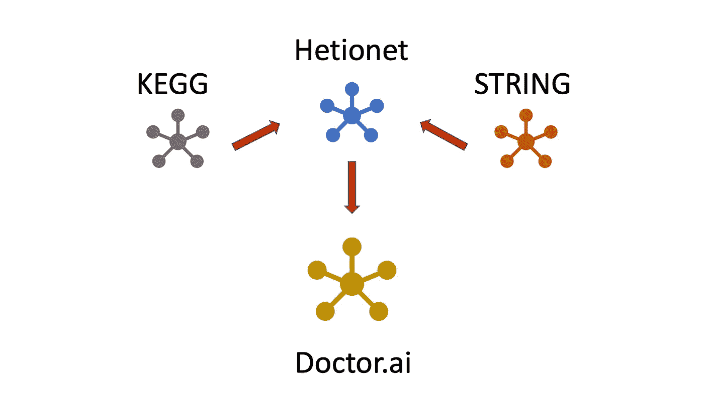
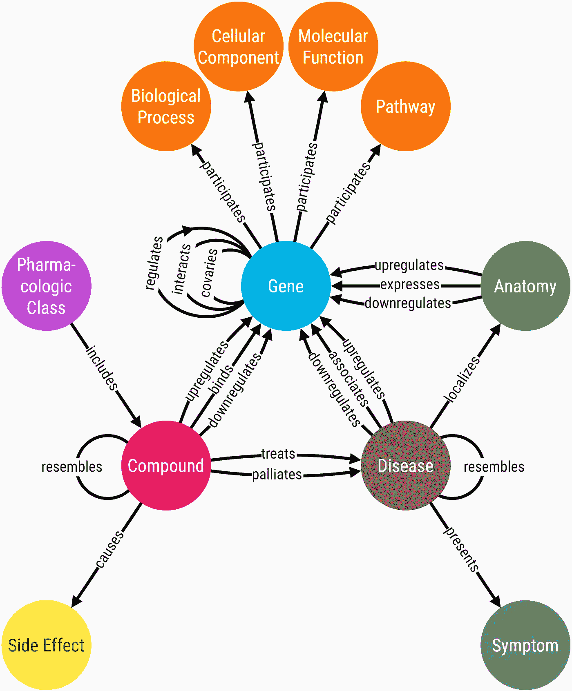
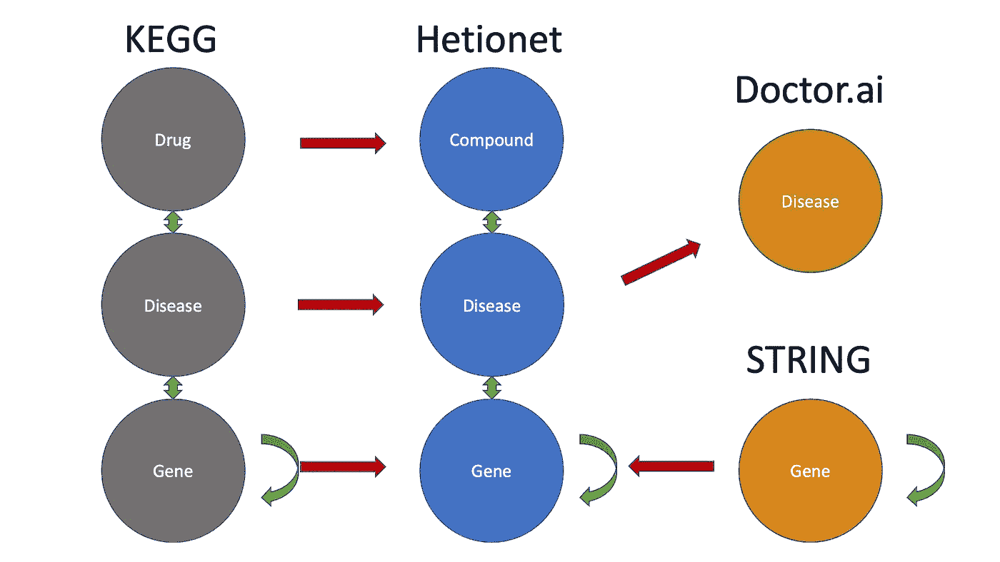
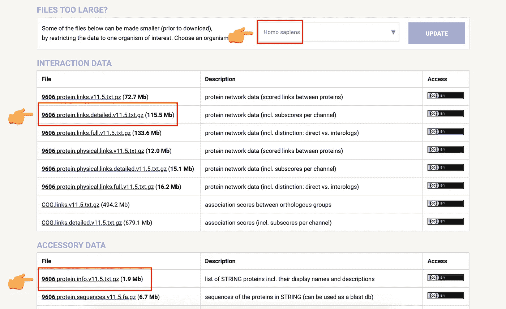
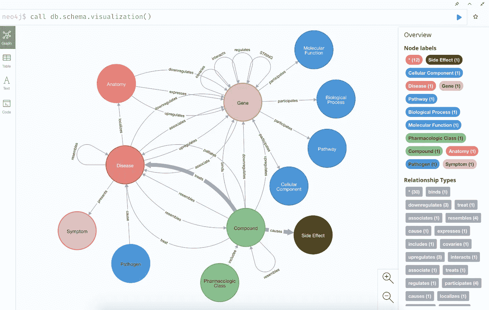
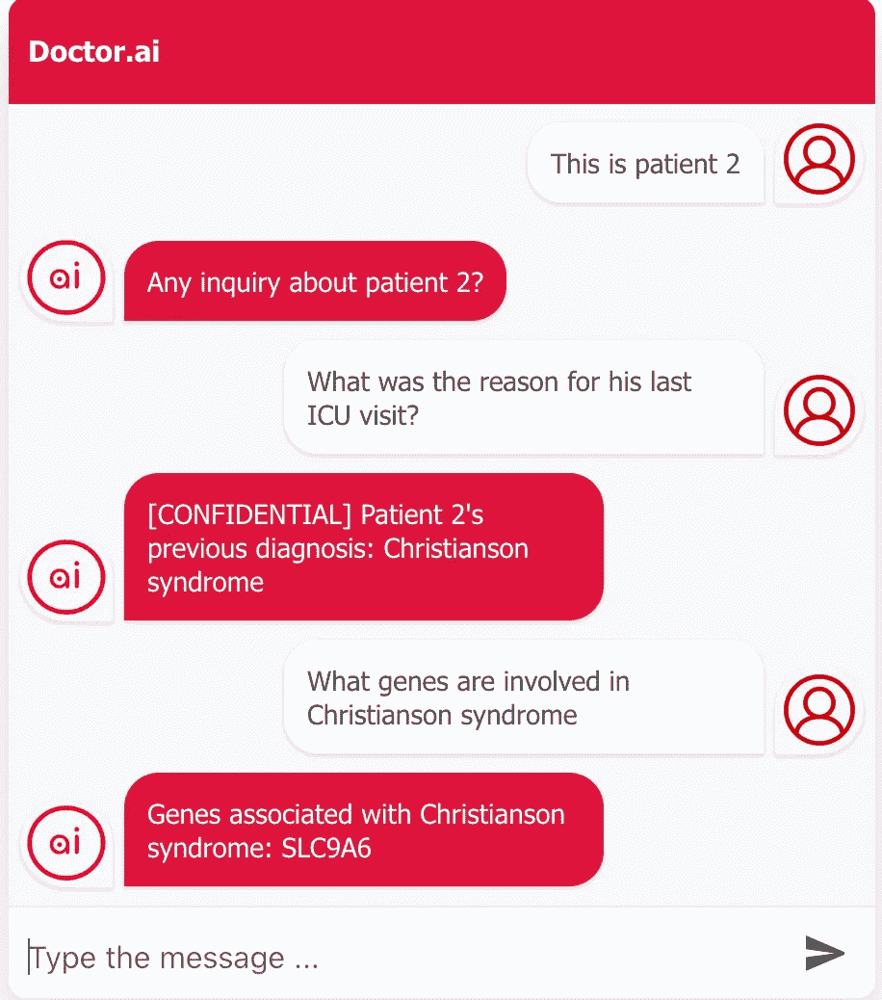
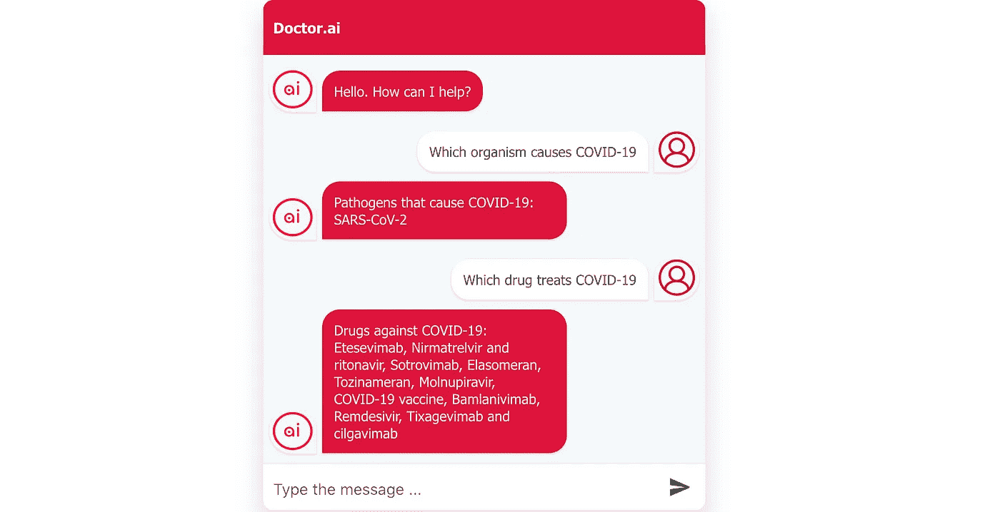
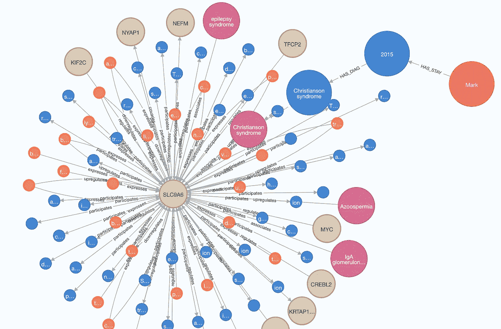

# 将知识图表转移到 Doctor.ai

> 原文：<https://towardsdatascience.com/transfer-knowledge-graphs-to-doctor-ai-cc21765fa8a6>

## 用 Hetionet，STRING，KEGG 扩展 Doctor.ai

> 本文展示了如何:
> 
> 1.将三个公共知识图谱整合成一个医疗聊天机器人——doctor . ai。
> 
> 2.通过 AWS Lex 使用自然语言向 Doctor.ai 询问病史、病原体、药物和基因。

帕特里克·托马索在 [Unsplash](https://unsplash.com/?utm_source=unsplash&utm_medium=referral&utm_content=creditCopyText) 上的照片

正在进行的新冠肺炎疫情给我们上了许多宝贵的一课。其中之一是，我们需要使我们的医疗保健系统现代化，让所有人都能享受到。世界各国政府已经投入巨资进行数字化建设(这里[这里](https://www.tagesschau.de/investigativ/kontraste/gesundheitsaemter-sormas-software-101.html)和[这里](https://databund.de/2021/10/29/5-fehlentwicklungen-bei-der-digitalisierung-des-oeffentlichen-gesundheitswesens-oegd/))。但是进入疫情两年后，像德国这样的富裕国家仍然在他们的医院里使用传真和漏洞百出的软件来传输数据。这一明显的技术差距付出了生命的代价。

2021 年 12 月，我和四名 Neo4j 工程师基于 eICU 数据库创建了一个名为 Doctor.ai 的聊天机器人(阅读详情[此处](https://medium.com/p/8c09af65aabb)和[此处](https://neo4j.com/blog/doctor-ai-a-voice-chatbot-for-healthcare-powered-by-neo4j-and-aws/))。Doctor.ai 可以为患者和医生管理海量的病历。通过 AWS Lex，用户可以快速查询自己的病史，而医生甚至可以要求治疗建议。该数据库包含许多不同类型的数据:人口统计信息、ICU 就诊详情、实验室结果、病原体鉴定、诊断和治疗。即便如此，我们还是能够将它们全部放入一个 Neo4j 知识图中。与其他基于表的数据库不同，该图让我们可以自由地轻松构建和执行高度复杂的查询。

但是这个第一版的 Doctor.ai 知识范围非常有限——只有 eICU 记录和一些预定义的医学常见问题。那么如何才能让它更有知识呢？我们可以将新的数据放入它的图表中。Medium 的很多教程都教我们使用自然语言处理(NLP)来抓取维基百科等网站进行自动知识图构建。尽管 NLP 可以快速生成草图，但需要严格的控制和事实检查来确保其正确性。在医疗保健领域，正确性最为重要，在这个领域，准确的信息往往是生死攸关的问题。

图一。作者将三幅医学知识图转换为 Doctor.ai. Image。

但是我们可以有第二个更简单的方法。互联网上有一些公开的、精心策划的知识图谱，比如 [Hetionet](https://het.io/) 、 [STRING](https://string-db.org/) 和 [KEGG](https://www.kegg.jp/kegg/) 。为什么不直接把这些数据转移到 Doctor.ai 里？然后，Doctor.ai 将在其所有医疗记录的基础上获得关于药物-药物相互作用、药物副作用、基因-基因相互作用的知识。在这篇文章中，我将向您展示如何将这三个数据库集成到 Doctor.ai 中。您可以在我的存储库中找到这些数据和我的代码。

 [## GitHub - dgg32/transfer_kg

### 此时您不能执行该操作。您已使用另一个标签页或窗口登录。您已在另一个选项卡中注销，或者…

github.com](https://github.com/dgg32/transfer_kg) 

集成知识图转储在这里:

[https://1drv.ms/u/s!Apl037WLngZ8hhj_0aRswHOOKm0p?e=7kuWsS](https://1drv.ms/u/s!Apl037WLngZ8hhj_0aRswHOOKm0p?e=7kuWsS)

# 1.数据源

[Hetionet](https://het.io/) 数据库是一个全面的医学知识图表。它是由丹尼尔·希梅尔斯坦和旧金山加利福尼亚大学巴兰兹尼实验室的合作者开发的。它连接了 47031 个节点和 24 种不同类型的 2250197 条边:基因、疾病、化合物、解剖、副作用等等(图 2)。在本文中，我将使用 Hetionet 作为主干。

图二。Hetionet 的元图。图片来自[https://het.io/about/metagraph.png](https://het.io/about/metagraph.png)

然而，Hetionet 本身也需要更新。Hetionet 上一次更新是在 2018 年。它的 Neo4j 包是 3.x 格式的。我们还可以借助一些外界数据极大地丰富它的基因-基因相互作用。最后，它只包含 137 种疾病。完全没有关于传染病及其病原体的数据。

为此，我将引入两个数据库:STRING 数据库和 KEGG 疾病数据库。字符串数据库收集关于蛋白质-蛋白质相互作用的数据。它包含 6700 万个蛋白质和 200 亿个相互作用。 [KEGG 疾病数据库](https://www.genome.jp/kegg/disease/)目前包含超过 2500 种疾病，[我之前在 Neo4j](https://medium.com/p/959dffb5b479) 也调查过。它还包含有关传染病及其病原体的数据，包括新冠肺炎病毒。最后，KEGG 还将药物和基因整合到其知识图中。

[Hetionet](https://github.com/hetio/hetionet) 发布为 [CC0](https://creativecommons.org/publicdomain/zero/1.0/) 。 [STRING 可以在“4.0 知识共享”许可下免费获得](https://string-db.org/cgi/access)，而[学术用户可以免费使用 KEGG 网站](https://www.kegg.jp/kegg/legal.html)。

# 2.整合三个数据源

整合不同的知识图并不容易，因为它们可以使用不同的标识符来描述同一概念。在我们的例子中，Hetionet 数据库用 DOID 索引疾病，用 DrugBank ID 索引化合物，用 Entrez Gene ID 索引基因。KEGG 和 STRING 数据库都创建了它们的唯一标识符。幸运的是，生物医学研究人员已经逐渐就受控词汇达成一致，并对基因、病原体和其他概念的命名进行了标准化。出于这个原因，我将基于节点的`name`属性而不是它们的原始标识符来合并节点。所以我首先在三个数据源(我的存储库中的源代码)之间标准化名称。

图 3。整合计划。绿色箭头表示不同类型节点之间的交互。红色箭头表示数据库之间的节点将如何合并。其他类型未在图中示出。图片作者。

我尝试按照本[教程](https://neo4j.com/videos/migrating-from-neo4j-3-5-to-4-0/)中的每一步来导入 Hetionet 的 Neo4j 数据转储。但是每次都失败，并显示“数据库没有完全关闭”的错误。然后我决定下载[它的 JSON](https://github.com/hetio/hetionet/tree/master/hetnet/json) 。事实证明这是一个更好的解决方案，因为我可以编辑它的内容。我已经将节点`name`设置为标识符，并相应地修改了边定义。

然后我把这个修改过的 Hetionet 导入到 Neo4j 4.3.6 中。220 万关系的导入花了几个小时才完成。我建议您在 AWS EC2 上这样做(CloudFormation 模板在我的存储库中)。不要忘记为这个 4.3.6 版本创建一个转储作为备份。

导入后可以看到 Hetionet 中有 20943 个基因，137 种疾病，1552 个化合物。

接下来，下载*智人* 的两个[字符串数据集。](https://string-db.org/cgi/download?sessionId=b4X65NobmDKI&species_text=Homo+sapiens)

图 4。为人类下载字符串数据。图片作者。

字符串数据库基于不同的证据渠道，如实验、共表达、同源性等，为每个蛋白质-蛋白质相互作用分配分数。0.5 的分数将指示大约每隔一次的交互可能是错误的(即，假阳性)。然而在下载的`links`数据中，分数被乘以 1000。在这个项目中，我在导入之前删除了与低于 900 的`combined_scores`的连接。

图 5。Hetionet、STRING 和 KEGG 整合后的知识图图式。图片作者。

表 1。STRING-KEGG 整合前后 Hetionet 4 中的标记数量。

KEGG 疾病数据库的整合更加复杂。我已经通过 KEGG API 下载了数据，如我之前的[项目](https://medium.com/p/959dffb5b479)中所述。这一次，我需要用名称而不是 KEGG 标识符来链接实体。之后，我将数据导入知识图。Hetionet 吞噬 STRING 和 KEGG 后，其在“疾病”、“化合物”和“病原体”中的节点数量大幅增加(表 1)。连接的数量也增加了。已经创造了 123577 对`STRING`基因-基因相互作用。`treats`关系的数量从 755 增加到 3363，`causes`的数量从 138944 增加到 139376。

# 3.将知识图谱与 Doctor.ai 连接起来

现在我的“Hetionet + STRING + KEGG”知识图就完成了。是时候将它与 Doctor.ai 连接起来了。我通过 CloudFormation 设置了 AWS 基础设施，如我的[上一篇文章](https://medium.com/p/8c09af65aabb)中所述(模板在我的存储库中)。Doctor.ai 中的原始替身数据是 eICU 数据集。申请者必须完成在线课程，然后等待批准。在本文中，我将基于 eICU 数据创建两个虚构的患者来演示新医生。ai。1 号患者 Lucy 患有 Kyasanur Forest 病，而 2 号患者 Mark 患有 Christianson 综合征(图 6)。

图 6。作者笔下艾医生形象中的两个虚构病人。

一旦他们的病历被导入 Doctor.ai，我就进行了以下两次对话(图 7)。

图 7。Doctor.ai 截图知识图谱转移后，Doctor.ai 可以检索到更多关于疾病的细节，比如病原体、基因等。图片作者。

如图 7 所示，Doctor.ai 首先找到了他们的病历。多亏了新的知识图表，它也可以提供关于这些疾病的更多细节。在第一种情况下，它报告了病原体，而在第二种情况下，它可以说 SLC9A6 基因与克里斯蒂安森综合征有关。

图 8。艾医生回答关于新冠肺炎的问题。图片作者。

接下来，我向艾医生询问了这两年的话题——新冠肺炎。正如你所看到的，Doctor.ai 不仅能说出致病病原体新型冠状病毒的名字，还能列出对抗这种疾病的药物清单。所有这些数据都来自 KEGG 数据库。

在引擎盖下，我们可以看到 AWS Lex 的局限性。目前，Lex 的内置插槽类型`Alphanumeric`不能识别开箱即用的空格。所以“葡萄球菌感染”或“单纯疱疹病毒感染”并没有被正确地引出(见[这里](https://forums.aws.amazon.com/thread.jspa?messageID=903398))。我通过定义自己的槽类型并输入所有 2000 种疾病名称作为候选值来解决这个限制。

# 结论

当他们在网络中时，事情更容易学习。而这个小项目有效地将 Doctor.ai 插入到通用医学知识宇宙中(图 9)。与其马上用 NLP 从头构建一个，为什么不先集成现有的呢？Doctor.ai 是一个聊天机器人，它管理一种特定类型的数据——医疗记录。在首次亮相时，Doctor.ai 在 AWS Kendra 的帮助下回答了一些事实性的问题，后者可以检索预定义的答案给用户。它也很贵(每月 810 美元)。通过嵌入 Hetionet、STRING 和 KEGG 的研究数据，它非常经济地获得了一般医学知识。有了这些扩大的知识，Doctor.ai 不仅可以向患者和医生报告过去医院就诊的详细信息，还可以为他们提供有关病原体、药物、副作用和基因的信息。虽然这仍然不能使 Doctor.ai 成为一个开放域的聊天机器人，但它是朝着这个方向迈出的坚实的第一步。

图 9。Doctor.ai 与医学知识图谱的集成。来自 Doctor.ai 的数据位于图表的右侧，而 Hetionet、STRING 和 KEGG 数据位于图表的中央和左侧。图片作者。

尽管还有改进的空间。这个项目中的数据集成是初级的。可以进一步清除数据条目。例如，Hetionet 和 KEGG 的许多疾病没有 ICD-10 分类。这使得数据合并变得困难。由于 ICD-11 已经于 2022 年 1 月 1 日生效，KEGG 已经采纳了这一新标准，我们最好尽快适应未来。

你也可以扩展 Doctor.ai。目前，我们的数据集中只有非常少的关于精神疾病的数据。事实上，与身体疾病相比，互联网上关于精神健康的数据随处可见。因此，精神障碍患者长期得不到足够的服务。患者数量众多:2020 年，近五分之一的美国成年人患有精神疾病。所以我们迫切需要收集更多这方面的数据。此外，药物-药物相互作用可以用来自药物库的数据进一步增强。[卡抗生素耐药性数据](https://medium.com/p/f452f74137e8)也是一个不错的整合候选。综上所述，Doctor.ai 的拓展方向有很多。

最后，将特定和一般知识图相结合的想法并不局限于 Doctor.ai for healthcare。有了合适的数据，我们可以在其他领域使用相同的基础设施:从兽医到林业，从银行到人力资源，从物流到制造业。然而，在这些新的使用案例中，决策者不仅需要考虑技术，还需要考虑伦理和法律。

*更新:在* [*这篇新文章*](https://dgg32.medium.com/from-symptoms-and-mutations-to-diagnoses-doctor-ai-as-a-diagnosis-tool-5b31ac7a16c3) *中，我把 Doctor.ai 做成一个基于症状或基因突变的诊断工具，数据来自这些转移的知识图。*

[*本文*](https://medium.com/p/1396d1cd6fa5) *采用 GPT-3 作为 NLU，提高性能，减少开发时间，收缩代码。*

 [## 加入媒介与我的介绍链接-黄思兴

### 作为一个媒体会员，你的会员费的一部分会给你阅读的作家，你可以完全接触到每一个故事…

dgg32.medium.com](https://dgg32.medium.com/membership)