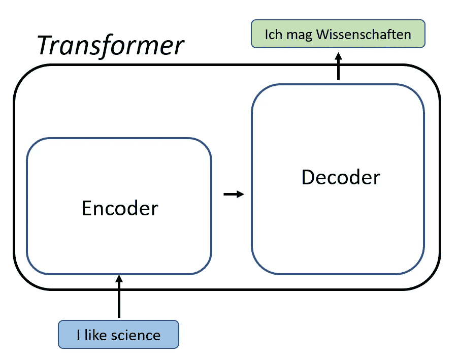
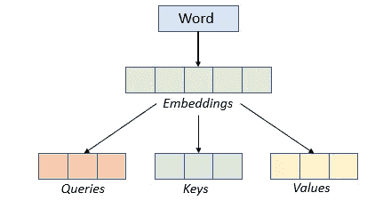
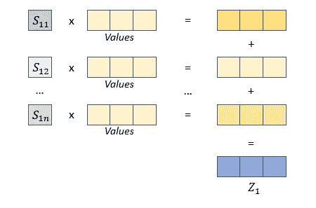
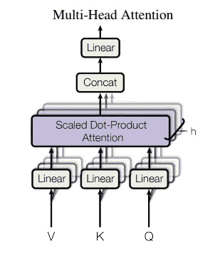
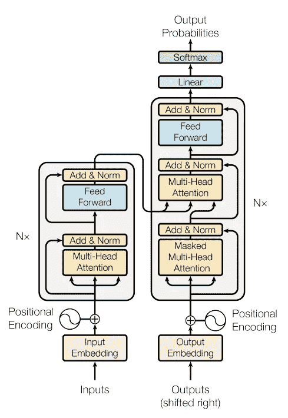

# 变形金刚:最新颖的人工智能架构概述

> 原文：<https://towardsdatascience.com/transformers-an-overview-of-the-most-novel-ai-architecture-cdd7961eef84>

## 机器学习理论

## 负责 Siri、Alexa 和 Google Home 的模型

作者图片

转换器彻底改变了自然语言处理、计算机视觉和图像生成领域。在这篇文章中，我将分解这个新颖的架构，并解释它是如何工作的。

## 介绍

在过去的几年里，最新一代的大规模人工智能模型产生了令人印象深刻的结果。就像过去十年深度学习已经彻底改变了各种各样的行业一样，这种新一代的机器学习模型具有巨大的潜力。像 GPT-3 和 DALL-E 这样依靠变压器运行的模型，已经引发了新的产品、服务和业务，将为社会增加巨大的价值。

变压器是这些模型的组成部分。GPT-3，可以说是迄今为止最先进的自然语言处理(NLP)模型，能够以类似人类的方式完成各种各样的 NLP 任务。它的架构是一个标准的变压器，使它与众不同的是它前所未有的 1750 亿个参数。变压器的效率和简单性使得这种大型模型变得可行。在这篇文章中，我想讨论这些是如何工作的，以及为什么它们如此重要。

## 是什么让变形金刚与众不同

变压器是一种机器学习模型架构，像长短期记忆神经网络(LSTMs)和卷积神经网络(CNN)。这种新的架构有一些优点，使变压器成为最新的艺术模型的基础。

正如我已经提到的，变形金刚可以非常巨大。更大的模型产生更好的结果，但是训练更昂贵。然而，现代变压器模型尺寸无法通过任何其他架构实现。变压器和其他架构之间的一个关键区别是变压器是高度并行化的，这使它们非常适合计算，并允许我们训练非常大的模型。

让变形金刚与众不同的第二点是它们对注意力的巧妙利用。为了描述他们是如何做到这一点的，我将把重点放在介绍变形金刚的原始论文上:注意力是你所需要的一切。

# 你需要的只是关注

> Ashish Vaswani、Noam Shazeer、Niki Parmar、Jakob Uszkoreit、Llion Jones、Aidan N. Gomez、Lukasz Kaiser、Illia Polosukhin 于 2017 年 6 月提交的论文

变形金刚由一个简单的架构组成，巧妙地利用了注意力。转换器由编码器和解码器组成。在编码器中，模型首先获取要翻译的句子，对其进行矢量化，并使用注意力对其进行转换。解码器反其道而行之，从矢量化转换到句子。例如，解码可以用不同的语言输出结果，使它们在翻译任务中更强大。

我现在将描述注意力是如何工作的，然后是多头注意力是如何工作的，最后我将谈论一个变压器如何使用它们。

## 注意力

注意力是变形金刚的关键，也是为什么它们是如此强大的架构。注意力层非常有效，比其替代品的复杂性更低:

表 I:各种层的复杂度和最大路径长度(图片来自[注意力是你所需要的全部](https://arxiv.org/abs/1706.03762) [1])

自我注意比它的对应部分具有更低的复杂性和更短的路径长度。 *n* 代表序列长度， *d* 为表示维数( *d* 往往大于 *n* ，文中 d 取 512)。

## 注意力层是如何工作的

注意层位于转换器的编码器和解码器部分。稍后，我将描述这些层在 Transformer 架构中的位置。

在到达注意层之前，输入文本首先被标记为代表性嵌入。从每一次嵌入，编码器将产生代表性的编码使用注意，和解码器将做相反的事情，输出文本。

作者图片

注意力层的第一级**由 3 个神经网络组成。这些将句子中嵌入的单词作为输入，对于每个单词，产生 3 个输出向量:*查询、键和值。*对句子中的每个单词都这样做，会产生 *n 个*查询、键和值。**

**第二阶段**包括计算每个单词的分数。每个单词都会有 *n* 个分数，然后巧妙组合。这允许模型考虑句子中的所有其他单词，以理解每个单词的意思。

看一个句子中的第一个单词，它会被分配一个*查询*，一个*键*和一个*值*。我们要计算所有其他单词在第一个单词上的分数。为此，我们首先获取第一个单词的查询向量和句子中所有关键向量的点积。这里的点积可以被认为是相似性的度量。如果查询和键向量对齐，它们的点积将产生一个大值。如果查询和关键向量接近正交，点积的结果将接近零。

单词 1 的得分权重(图片由作者提供)

在上图中，第一个单词的查询和句子中所有关键字之间的点积用于产生分数。

**第三步**是将 SoftMax 标准化并应用于这些值(使它们的总和等于 1)

简单回顾一下:注意力从 3 个神经网络开始，输出每个单词的*查询*、*键*和*值*。到目前为止，我们已经使用了*查询*和*键*向量来为每个单词产生一组权重，该权重对我们在查看特定单词时应该对每个单词给予多少关注进行排序。

**第四步**是使用*值*向量，并使用在前面步骤中计算的分数缩放它们。最后，我们将得到的缩放值向量相加，给出每个单词的注意力向量。

单词 1 的注意力向量(图片由作者提供)

在上图中，基于查询 1 的每个单词的分数用于衡量这些值。然后将这些相加以产生最终矢量。

这个结果向量是查询 1 的结果注意力向量(来自第一个单词)。您将对每个查询都这样做，从而产生 *n* 个向量，这些是注意力层的输出。注意，每个结果向量只取决于对那个单词的*查询*，还取决于句子中所有单词的*键*和*值*。这就是注意力在连续任务中的强大之处，因为你能够将整个输入的上下文嵌入到每个表示中。

现在我想展示论文中说明自我关注的图表。

图片来自[注意力是你所需要的一切](https://arxiv.org/abs/1706.03762) [1]

如您所见，*查询*和*键*用于产生分数，然后将分数应用于*值*向量以产生最终的输出向量。

## 多头注意力

到目前为止，我们已经看到了单头注意力层。多头注意力层是允许更快计算的单头注意力的扩展。

对于单头注意力，每个单词的嵌入向量有 512 维。在多头关注中，*查询*、*键*和*值*向量被分割成 8 个头(64 维向量)，关注层被应用到每个头上的方式与我之前展示的方式相同。然后，将每个头部的结果注意力向量连接在一起，以形成 512 维注意力向量。

图片来自[注意力是你所需要的一切](https://arxiv.org/abs/1706.03762) [1]

多头注意力仅仅是我之前详细描述的注意力层的扩展，你不需要完全理解它来理解注意力在更大的变形金刚环境中的作用。

## 变形金刚

现在您已经了解了注意力层的样子，我将通过描述 transformer 架构来结束本文:

图 1:变压器模型架构(图片来自[注意力是你所需要的全部](https://arxiv.org/abs/1706.03762) [1])

转换器由编码器(左块)和解码器(右块)组成

**编码器:**编码器是左边的那块。这个块由一堆 *N* 个相同的层组成(在文中 *N* = 6)。每层包含一个多头注意力层，后面是一个全连接的前馈神经网络。每个编码器层的输出被用作后续编码器层的输入。所有层输出具有相同的维度(512，就像嵌入一样)。

**解码器:**解码器堆栈也由 6 个相同的层组成。每个解码层有 2 个多头注意力层，后面是一个前馈神经网络。在每个解码器层中，第一关注层的输入是来自前一解码器的输出。第二关注层的输入是来自编码器堆栈的输出。

## 培训和结果

变压器接受了英语到德语和英语到法语翻译任务的训练，并且在这两个问题上都达到了新的最先进水平。该模型使用 8 个 GPU 训练了数天。这些模型比以前发表的任何结果都取得了更好的结果，而训练成本只是其一小部分。

结果是突破性的，从那以后，变压器被用于该行业生产的许多最先进的模型中。

# 结论

在这篇文章中，我解释了变压器的工作原理。我拿起原始的 Transformer 文件(你所需要的只是注意力)并把它分解成简单易懂的步骤。变形金刚改变了自然语言处理任务的游戏。它与其他模型的不同之处在于它创造性地使用了注意力，并且它是高度并行的，这使得它的训练非常有效。在未来的文章中，我期待着讨论 transformer 如何集成到其他复杂的模型架构中，以及它们如何彻底改变图像和声音生成等行业。

## 支持我

希望这对你有所帮助，如果你喜欢，你可以跟我来！

您也可以使用我的推荐链接成为 [**中级会员**](https://diegounzuetaruedas.medium.com/membership) ，并访问我的所有文章及更多:[https://diegounzuetaruedas.medium.com/membership](https://diegounzuetaruedas.medium.com/membership)

## 你可能喜欢的其他文章

</cancer-prediction-vs-telecom-churn-modelling-9e4ec49095f6>  </support-vector-machines-svms-important-derivations-4f50d1e3d4d2>  

## 参考

[1]阿希什·瓦斯瓦尼、诺姆·沙泽尔、尼基·帕尔马、雅各布·乌兹科雷特、利永·琼斯、艾丹·戈麦斯、卢卡兹·凯泽、伊利亚·波洛苏欣，《注意力是你所需要的一切》，NIPS，2017 年。可用:[https://arxiv.org/abs/1706.03762](https://arxiv.org/abs/1706.03762)。

## 其他有用的链接

变形金刚的惊人插图:

<http://jalammar.github.io/illustrated-transformer/>  

AI Epiphany 的这个视频很棒: