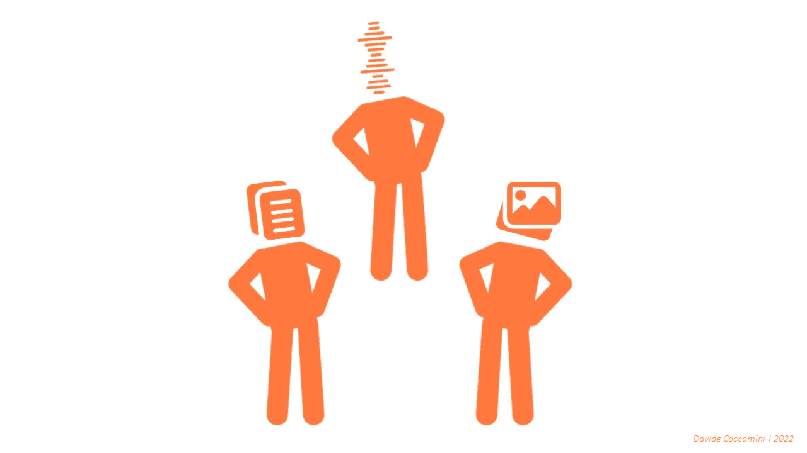
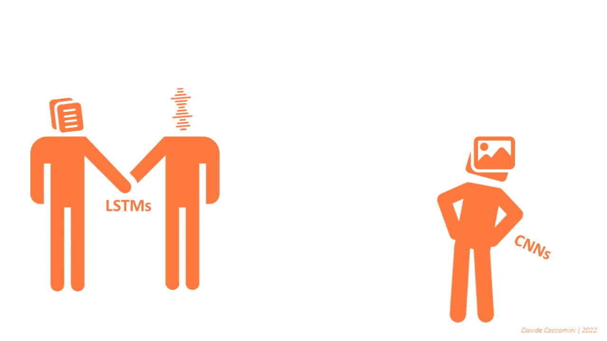
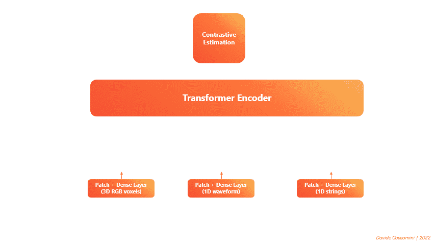

# Transformers 和 Multimodal:所有数据类型的相同键

> 原文：<https://towardsdatascience.com/transformers-and-multimodal-the-same-key-for-all-data-types-d990b79741a0>

机器学习的世界无疑是迷人的，不断增长，并能够触及最多样化的部门，从医学到太空竞赛，从餐饮到大型制造业。这项技术有无数的应用领域，几十年来也开发了许多技术，但它们都有一个共同点:数据。

每一个机器学习模型的存在和工作都要归功于它能够以这样或那样的方式从数据中学习。然而，这些数据可以采取非常不同的形式，例如，大量的文本来训练语言模型生成句子，理解上下文或讽刺，或识别异常。或者数以百万计的物体、人和动物的图像来创建分类或物体检测模型，甚至音轨来执行诸如识别歌曲或其风格的任务。

作者图片

所有这些都带来了一个大问题:处理如此不同的数据需要不同的技术，因此机器学习的整个独立分支应运而生，每个分支都专注于这些数据类型中的一种。特别是用于语言学的自然语言处理(NLP)、用于图像和视频的计算机视觉(CV)以及用于音轨的音频信号处理(ASP)。

当解决需要混合不同类型的数据的问题时，这个问题变得更加突出，例如找出哪种文本描述最适合图像，或者同时使用音频和视频来识别图像中的异常。

但让我们更深入地探讨一下，试着从头开始追溯形势的演变。

# 变形金刚的出现

在过去的早期，在数十种深度学习架构中，有两种非常突出，即长短期记忆(LSTM)网络和卷积神经网络(CNN)。

由于 LSTMs，第一种分析不同类型数据的方法出现在文本和音频之间。这些网络旨在有效地分析序列形式的数据。在文本领域工作，把句子看作单词序列是很自然的，但也把音轨看作序列。

作者图片

与此同时，卷积神经网络正在计算机视觉领域取得进展，与 LSTMs 不同，卷积神经网络能够更好地捕捉空间相关性，因此更适合通过移动窗口扫描图像进行图像处理。

基于非常不同的概念，NLP/ASP 和 CV 世界在很大程度上独立发展了几年，接受了由于数据的不同性质，视觉和文本/音频领域不能有一个共同的架构来使用。

沉寂了这么多年，至关重要的转折点似乎来自 2017 年首次呈现《变形金刚架构》[1]的 NLP 领域。

该体系结构也用于分析序列形式的数据，但与 LSTMs 不同，它能够克服一些重要的局限性:

*   他们能够更好地捕捉输入序列中非常远的部分之间的相关性；
*   他们利用注意力机制，允许更大的计算并行化；
*   他们甚至能够分析很长的序列。

查看自然语言处理领域中的一个示例，Transformers 通过利用注意力机制来将句子分析为由单词组成的序列，该注意力机制计算句子中所有可能的单词组合之间的一种关系相关性。因此，如图所示，注意力是在句子的第一个单词和所有其他单词之间、第二个单词和所有其他单词之间等等之间计算的。

作者图片

这样做时，序列的每个部分都相对于所有其他部分进行分析，由于计算是独立的，它们也可以并行！

如果你想深入了解变形金刚的架构，我建议你阅读我之前的概述。

由于这些特点，在很短的时间内，Transformers 成为自然语言处理领域的参考架构，几乎完全取代了 LSTMs。显然，正如可以预料的那样，即使在音频信号处理领域，变压器也开始越来越多地被使用，但几乎没有人会想到的是，这种新的架构也引起了计算机视觉领域研究人员的注意。

如果我们可以将图像转换成序列，转换器能够分析它们并捕捉足够的空间信息来与传统的卷积神经网络竞争吗？

作者图片

答案是肯定的！所谓的视觉变压器[4]背后的想法是将一幅图像分成许多部分，称为补丁，然后将它们线性投影到令牌中。这些令牌与从单词中获得的令牌完全类似，因此，变压器的整个剩余架构可以保持不变。

[如前一篇文章](https://medium.com/p/de1a2c3c62e4)所示，计算机视觉领域的变形金刚非常强大，因为与卷积神经网络相比，其架构细节允许它们更好地捕捉全局关系和局部模式。

完成了，变形金刚正式成为我们需要的通用架构。他们可以操纵文本，图像，视频，音频和任何类型的数据，可以变成令牌！

# **多模态机器学习**

现在拥有能够处理不同类型数据的单一架构代表了所谓的多模态机器学习领域的重大进步。

这门学科始于对人类行为的观察。人们能够综合几个来源的信息，得出自己的推论。他们通过用眼睛观察周围的世界，同时也通过闻气味、听声音或触摸形状来接收数据。对我们来说，通过将不同类型的脉冲组合在一起进行工作是完全自然的，但让神经网络做同样的事情一直非常困难。

问题在于以相同的方式处理所有不同的输入而不丢失信息，并且由于变压器，我们现在可以建立一个通用的架构来处理任何类型的数据！

作者图片

# VATT:多模态自我监督学习的变形金刚

变形金刚在多模态机器学习领域最重要的应用之一当然是 VATT [3]。

这项研究旨在利用变形金刚处理不同类型数据的能力，创建一个可以同时从视频、音频和文本中学习的单一模型。

为此，建议的体系结构由一个 Transformer 编码器组成，在该编码器上进行三个不同的转发调用。对每种类型的输入数据的一个调用总是被转换成一个令牌序列。转换器将这些序列作为输入，并返回三组不同的特征。然后，这些特征被输入到对比估计块，该对比估计块计算单个损失并执行反向。

图片来自作者

以这种方式，损失是对所考虑的所有三种类型的数据犯下的错误的结果，因此，在各时期之间，模型将学习通过更好地管理来自所有三个不同来源的信息来减少损失。

因此，VATT 代表了多模态机器学习多年来一直试图实现的顶点，即一个可以一起处理完全不同类型数据的单一模型。

# GATO:多面手

但是多模态机器学习研究能导致什么令人印象深刻的结果呢？有没有可能实现一个能够接收不同类型的输入，处理它们，甚至执行许多不同性质的任务的神经网络？

如果我告诉你，具有完全相同的内部权重的同一个网络可以从非常不同的来源接收不同的数据输入，并且能够玩 Atari，像真人一样聊天，给图像加字幕，用真正的机器人手臂叠积木等等，你会怎么想？

多亏了 GATO[5]，一个多模态、多任务、多化身的通才代表了当今该领域最令人印象深刻的成就之一。

但是加托是如何做到这一切的呢？在内部，同样有一个转换器，它接收不同类型的输入数据，并将其转换为一系列标记。

图片由作者提供。

由于这种输入的统一和 Transformer 架构，该模型将能够从非常不同的来源获取信息，实现前所未有的一般化水平。

图片来自 [Deepmind 的论文](https://storage.googleapis.com/deepmind-media/A%20Generalist%20Agent/Generalist%20Agent.pdf)。

# 结论

我们看了一下人工智能的新前沿之一，多模态机器学习，并分析了变形金刚在这场革命中的作用。由于这种新的架构能够以有效的方式处理不同类型的输入，通向更通用的神经网络的道路比以往任何时候都更加具体。还有许多步骤要走，但是当本文中讨论的工作出现时，进步是不可否认的。

**这些会是通用人工智能的最初信号吗？我们会查清楚的！**

# 参考资料和见解

[1]“Tadas Baltrusaitis 等人”。"[多模态机器学习:调查和分类](https://dl.acm.org/doi/10.1109/TPAMI.2018.2798607)"

[2]“阿希什·瓦斯瓦尼等人”。"[注意力是你所需要的全部](http://Attention is All you Need)"

[3]“哈桑·阿克巴里等人”。 [VATT:从原始视频、音频和文本进行多模态自我监督学习的变形金刚](https://proceedings.neurips.cc/paper/2021/file/cb3213ada48302953cb0f166464ab356-Paper.pdf)

[4]“阿列克谢·多索维茨基等人”。"[一幅图像相当于 16x16 个字:大规模图像识别的变形金刚](https://arxiv.org/abs/2010.11929)"

[5]“斯科特·里德等人”。" [GATO:一个多面手经纪人](https://www.deepmind.com/publications/a-generalist-agent)"

[6]《大卫·柯考米尼》。[关于变压器、定时器和注意事项](/transformers-an-exciting-revolution-from-text-to-videos-dc70a15e617b)

[7]《大卫·柯考米尼》。"[视觉变形金刚中的自我监督学习](/self-supervised-learning-in-vision-transformers-30ff9be928c)"