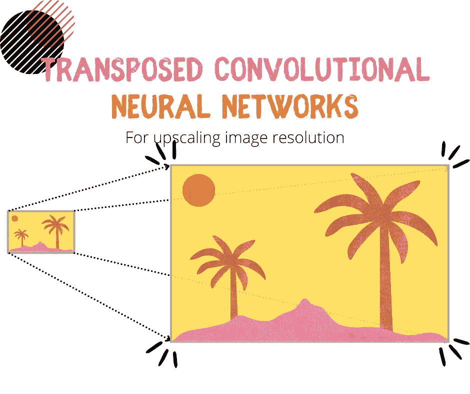
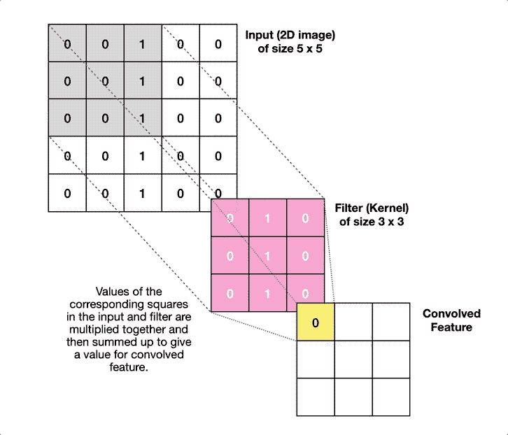
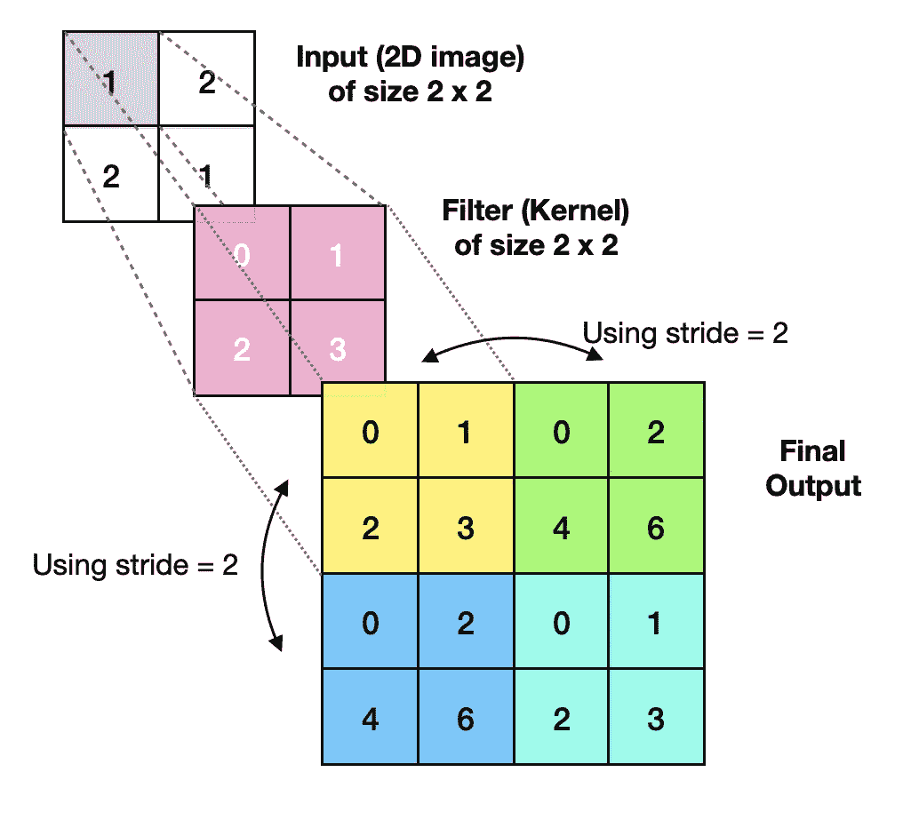
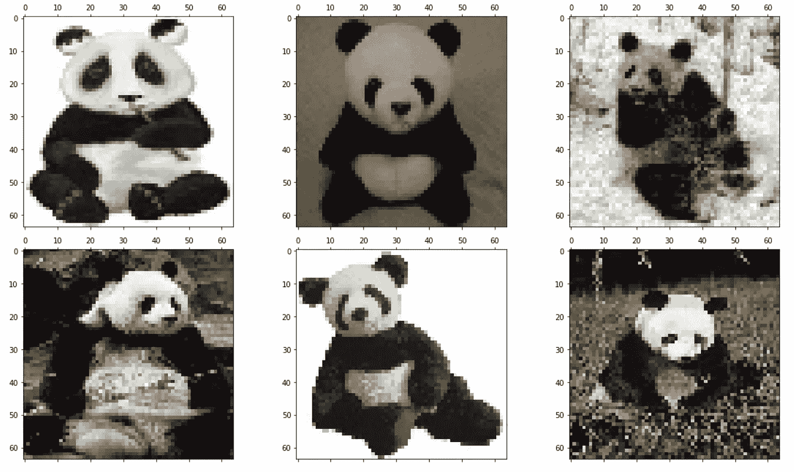
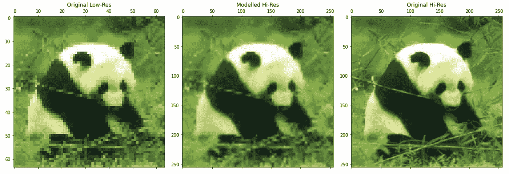

# 转置卷积神经网络——如何提高图像分辨率

> 原文：<https://towardsdatascience.com/transposed-convolutional-neural-networks-how-to-increase-the-resolution-of-your-image-d1ec27700c6a>

## 神经网络

## 用一个简单的 Python 例子详细解释转置卷积



转置卷积神经网络。图片由[作者](https://solclover.com/)提供。

# 介绍

卷积神经网络彻底改变了图像分类和对象检测领域。但是你听说过**转置卷积、**吗，你知道如何使用它们吗？

在本文中，我将解释什么是转置卷积，它们与常规卷积相比如何，并向您展示如何构建一个简单的神经网络，利用它们来提升图像分辨率。

# 内容

*   机器学习算法领域内的转置卷积
*   什么是转置卷积？
*   转置卷积有什么用？
*   在 Keras/Tensorflow 中使用转置卷积构建神经网络的完整 Python 示例

# 机器学习算法领域内的转置卷积

我已经根据机器学习算法的性质和它们被设计用来做的工作对它们进行了分类。您可以在下面的图表中看到这种分类。

虽然不可能完美地做到这一点，因为一些算法可以被分配到多个类别，但尝试带来一些结构使我们能够可视化这些不同的算法如何连接和比较。

**图表是交互式的**，所以你可以通过点击**来探索它👇在不同的类别上**揭示更多。不出所料，你会在卷积神经网络分支下找到转置卷积网络。

机器学习算法分类。由[作者](https://solclover.com/)创建的互动图表。

***如果你喜欢数据科学和机器学习*** *，请* [*订阅*](https://bit.ly/3sItbfx) *获取我的新文章邮件。如果你不是中等会员，可以在这里加入*[](https://bit.ly/36Mozgu)**。**

# *什么是转置卷积？*

> *注意，在一些文献中，转置卷积也被称为解卷积或卷积步长卷积。*

*为了理解转置卷积，让我们首先提醒自己什么是正则卷积。*

## *盘旋*

*卷积有三个部分:输入(例如，2D 图像)、滤波器(又称为内核)和输出(又称为卷积特征)。*

**

*卷积。对输入数据应用过滤器的迭代过程中的第一次计算。图片由[作者](https://medium.com/@solclover)提供。*

*卷积过程是迭代的。首先，对输入图像的一部分应用滤镜，并记录输出值。然后，当**步距=1** 时，滤波器移动一个位置，或者当步距设置为一个更高的数字时，滤波器移动多个位置，重复相同的过程，直到卷积特征完成。*

*下面的 gif 图像说明了对 5x5 输入应用 3x3 过滤器的过程。*

**

*卷积在起作用。Gif 图片由[作者](https://medium.com/@solclover)提供。*

## ***转置卷积***

*转置卷积的目标与常规卷积相反，即**将输入特征图上采样为所需的更大尺寸的输出特征图**。*

*为了实现这一点，转置卷积会经历一个迭代过程，即通过过滤器将输入要素地图中的条目相乘，然后将它们相加。请注意，我们还会在每一步中移动指定数量的位置(**步距**)。*

*下面的 gif 说明了转置卷积是如何工作的。该示例使用步长 1，通过 2x2 滤波器从 2x2 输入变为 3x3 输出。*

*   *取第一个输入条目，并将其乘以滤波器矩阵。暂时存储结果。*
*   *然后，取第二个输入条目，并将其乘以滤波器矩阵。暂时存储结果。对输入矩阵的其余部分继续此过程。*
*   *最后将所有的部分输出相加得到最终结果。*

**

*转置卷积的作用。Gif 图片由[作者](https://solclover.com/)提供。*

*值得注意的是，在转置卷积运算期间，我们实际上是在生成额外的数据，因为我们将特征图从较小的尺寸向上采样到较大的尺寸。*

*然而，这种运算并不完全是卷积的逆运算。这是因为在卷积过程中总是会丢失一些信息，这意味着我们永远无法通过应用转置卷积来精确地重建相同的数据。*

*最后，我们可以试验过滤器的大小或步幅，以获得所需的输出特征地图大小。例如，我们可以将步幅从 1 增加到 2，以避免部分重叠，并产生 4x4 输出(见下图)。*

**

*跨距=2 的转置卷积。图片由[作者](https://solclover.com/)提供。*

## *转置卷积有什么用？*

*转置卷积对于**语义分割**和**生成对抗网络(GANs)** 中的数据生成至关重要。一个更直接的例子是训练神经网络来提高图像分辨率。我们现在就要建立一个这样的网络。*

*[](https://solclover.com/membership)**[](https://www.linkedin.com/in/saulius-dobilas/)*

# *利用 Keras/Tensorflow 的完整 Python 示例*

## *设置*

*我们需要获得以下数据和库:*

*   *加州理工学院 101 图像数据集([来源](https://data.caltech.edu/records/20086))*

> ***数据许可:** [归属 4.0 国际(CC BY 4.0)](https://creativecommons.org/licenses/by/4.0/)*
> 
> ***参考**:李，女，男，安德雷托，男，兰扎托，文学硕士，&p .(2022)。加州理工 101(版本 1.0)[数据集]。CaltechDATA。[https://doi.org/10.22002/D1.20086](https://doi.org/10.22002/D1.20086)*

*   *用于数据操作的[熊猫](https://pandas.pydata.org/docs/)和 [Numpy](https://numpy.org/)*
*   *[Open-CV](https://pypi.org/project/opencv-python/) 、 [Matplotlib](https://matplotlib.org/stable/index.html) 和 [Graphviz](https://graphviz.org/) 用于摄取和显示图像并显示模型图*
*   *[Tensorflow/Keras](https://www.tensorflow.org/api_docs/python/tf) 用于构建神经网络*
*   *[Scikit-学习库](https://scikit-learn.org/stable/index.html)用于拆分数据( [train_test_split](https://scikit-learn.org/stable/modules/generated/sklearn.model_selection.train_test_split.html) )*

*让我们导入库:*

*上面的代码打印了我在这个例子中使用的包版本:*

```
*Tensorflow/Keras: 2.7.0
pandas: 1.3.4
numpy: 1.21.4
sklearn: 1.0.1
OpenCV: 4.5.5
matplotlib: 3.5.1
graphviz: 0.19.1*
```

*接下来，我们下载、保存和摄取加州理工学院 101 图像数据集。注意，在这个例子中，我将只使用熊猫的图片(Category = "panda ")，而不是 101 个类别的完整列表。*

*同时，我准备数据并以两种不同的分辨率保存图像:*

*   *64 x 64 像素，这将是我们的低分辨率输入数据。*
*   *256 x 256 像素，这将是我们的高分辨率目标数据。*

*上面的代码打印出我们数据的形状，是**【样本，行，列，通道】**。*

```
*Shape of whole data_lowres:  (38, 64, 64, 3)
Shape of whole data_hires:  (38, 256, 256, 3)
Shape of X_train:  (30, 64, 64, 3)
Shape of Y_train:  (30, 256, 256, 3)
Shape of X_test:  (8, 64, 64, 3)
Shape of Y_test:  (8, 256, 256, 3)*
```

*为了更好地理解我们正在处理的数据，让我们显示一些低分辨率的图像，我们将使用它们作为输入。*

**

*训练数据中的低分辨率图像。来自[加州理工学院 101](https://data.caltech.edu/records/20086) 的原始图像数据。由[作者](https://solclover.com/)合成的图片。*

*和一些高分辨率图像作为我们模型中的目标。*

**

*目标数据中更高分辨率的图像。来自[加州理工 101](https://data.caltech.edu/records/20086) 的原始图像数据。组合图片由[作者](https://solclover.com/)提供。*

# *训练和评估转置卷积神经网络*

*这个模型非常简单，包含一个输入层、两个转置卷积层和一个充当输出的最终卷积层。您可以按照代码中的注释来理解每个部分的作用。*

*这是模型图:*

**

*转置卷积网络图。图片作者[作者](https://solclover.com/)。*

*接下来，我训练模型超过 100 个时期。*

*一旦训练完成，我们可以使用该模型将低分辨率图像预测(升级)到更高的分辨率。让我们看几个例子，一个来自训练集，另一个来自测试集。*

*显示来自训练集的图像比较:*

**

*来自列车组的示例。来自[加州理工学院 101](https://data.caltech.edu/records/20086) 的原始图像数据。由[作者](https://solclover.com/)合成的图片。*

*显示测试集中的图像比较:*

**

*来自测试集的示例。来自[加州理工学院 101](https://data.caltech.edu/records/20086) 的原始图像数据。由[作者](https://solclover.com/)合成的图片。*

*我们可以看到，在上面的两个例子中，我们都成功地提高了图像分辨率。即，单个像素在建模图像中不太明显。*

*然而，我们确实损失了一些锐度，这与我们的目标(256 x 256)图像相比是显而易见的。人们可以试验模型参数以获得更好的结果，因为我的模型决不是优化的。*

# *结束语*

*我真诚地希望你喜欢阅读这篇文章，并获得一些新的知识。*

*你可以在我的 [**GitHub 资源库**](https://github.com/SolClover/Art051_NN_Transposed_CNN) 中找到完整的 Jupyter 笔记本代码。您可以随意使用它来构建自己的转置卷积神经网络，如果您有任何问题或建议，请随时联系我们。*

*如果您想在我发表新文章时得到通知，例如关于**语义分割**或 **GANs** 的文章，您可以[在此](https://bit.ly/3uJnQFT)订阅。*

*还有，可以随意查阅我的其他神经网络文章:[前馈](/feed-forward-neural-networks-how-to-successfully-build-them-in-python-74503409d99a)、[深度前馈](/deep-feed-forward-neural-networks-and-the-advantage-of-relu-activation-function-ff881e58a635)、 [CNN](/convolutional-neural-networks-explained-how-to-successfully-classify-images-in-python-df829d4ba761#b32e-f8a4ab5107c5) 、 [RNN](/rnn-recurrent-neural-networks-how-to-successfully-model-sequential-data-in-python-5a0b9e494f92) 、 [LSTM](/lstm-recurrent-neural-networks-how-to-teach-a-network-to-remember-the-past-55e54c2ff22e) 、 [GRU](/gru-recurrent-neural-networks-a-smart-way-to-predict-sequences-in-python-80864e4fe9f6) 、 [AE](/autoencoders-ae-a-smart-way-to-process-your-data-using-unsupervised-neural-networks-9661f93a8509#5a19-bd0fb45c9472) 、 [DAE](/denoising-autoencoders-dae-how-to-use-neural-networks-to-clean-up-your-data-cd9c19bc6915) 、 [SAE](/sparse-autoencoder-neural-networks-how-to-utilise-sparsity-for-robust-information-encoding-6aa9ff542bc9) 、 [VAE](/vae-variational-autoencoders-how-to-employ-neural-networks-to-generate-new-images-bdeb216ed2c0) 。*

*干杯！
索尔·多比拉斯*

***[](https://bit.ly/3J6StZI) [## 通过我的推荐链接加入 Medium 索尔·多比拉斯

### 作为一个媒体会员，你的会员费的一部分会给你阅读的作家，你可以完全接触到每一个故事…

solclover.com](https://bit.ly/3J6StZI)***