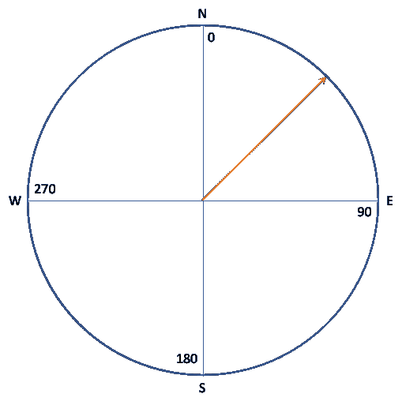
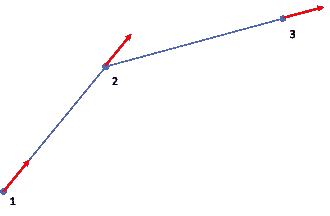
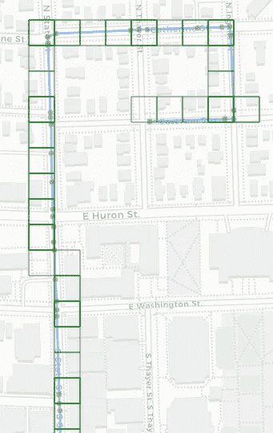
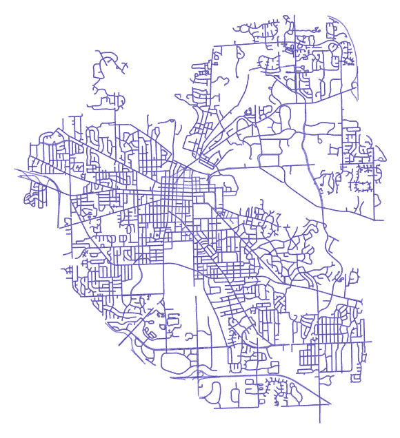
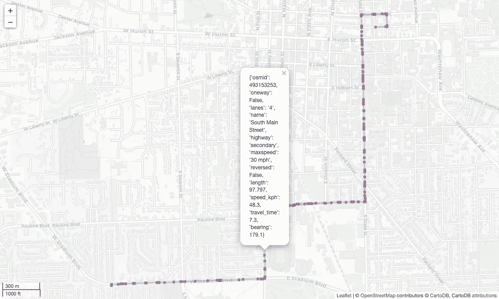
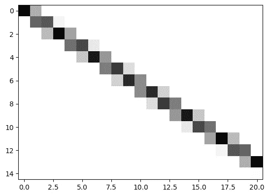
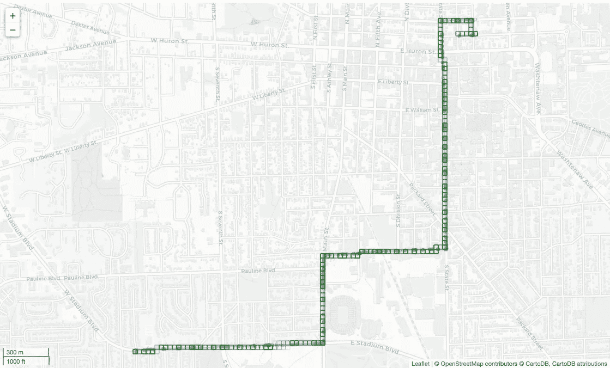
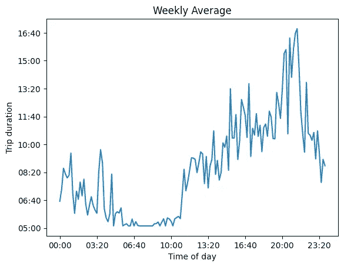

# 使用四键的旅行时间估计

> 原文：<https://towardsdatascience.com/travel-time-estimation-using-quadkeys-ecf6d54823b4>

## 本文解释了如何使用由四键索引的已知速度向量来估计旅行时间

迪诺·瑞奇穆斯在 [Unsplash](https://unsplash.com?utm_source=medium&utm_medium=referral) 上拍摄的照片

你的公路旅行将持续多长时间？如果你和我一样，你去 Google maps 或者 Here maps 直接查询路线。你不仅会得到最快或最短的路径，而且还会得到你的旅行时间的估计。这些服务根据学习的时间模式和实时交通信息报告最常见的速度，并针对道路上的典型车辆进行报告。

如果你有一个专门的车队，比如垃圾收集车，嘟嘟车，甚至普通的卡车，这些路线服务就没什么价值了。例如，最大允许高速公路速度往往根据车辆分类而变化，在欧洲，卡车的最高允许高速公路速度低于轻型车辆。一些商业地图路径选择产品支持卡车路径选择，但是如果您有专门的车队，您也可以自己选择。

如果您可以使用自己私人收集的速度矢量数据做出这些预测，会怎么样？车队出于从节省燃料到交通安全的各种目的收集远程信息处理数据并不罕见。远程信息处理数据通常包括 GPS 信息，除了采样位置，还报告相应的速度矢量，包括绝对速度和方向([方位](https://en.wikipedia.org/wiki/Bearing_(angle)))。如果您有这样的数据，您可以使用我在本文中描述的方法，用它来预测您的车队的预期行驶时间。

# 方法

我们必须从覆盖感兴趣区域的大量速度向量数据集开始。在本文中，我将使用[扩展的车辆能源数据集](https://arxiv.org/abs/2203.08630)。这里引用了这篇论文的陈述，解释了它与之前版本[车辆能源数据集](https://arxiv.org/abs/1905.02081)的主要区别:

> 这项工作提出了车辆能源数据集(VED)的扩展版本，这是一个公开发布的大规模数据集，用于车辆能耗分析。与原始版本相比，扩展的 VED (eVED)数据集增强了精确的车辆行程 GPS 坐标，作为将 VED 行程记录与外部信息(例如，道路速度限制和交叉口)相关联的基础，这些信息来自可访问的地图服务，以累积对分析车辆能耗至关重要的属性。

车辆能源数据集收集了密歇根州安阿伯市 383 辆私人汽车 2017 年 11 月至 2018 年 11 月的出行信息。扩展的车辆能量数据集通过地图匹配校正 GPS 波动，将采样位置“捕捉”到已知道路并添加更多上下文信息，从而增强了原始数据集。

该数据集的每个记录都包含原始和地图匹配的 GPS 位置、车辆报告的速度以及一组描述车辆状态和地点的附加属性。不幸的是，数据集不包括速度方向，所以我们丢失了一半的速度矢量信息。我们将通过使用位置序列的地理空间数据推断角度来解决这个问题(见下文)。

## 旅行时间估计

为了估计旅行时间，我们必须从使用直接地理空间坐标或[地址地理编码](https://en.wikipedia.org/wiki/Address_geocoding)来识别旅行终点开始。接下来，我们使用带有相关区域地理空间描述的图表来查找符合我们要求的路线。我们从公开可用的地图，即 [OpenStreetMap](https://welcome.openstreetmap.org/working-with-osm-data/downloading-and-using/) 提供商创建了这个图表，使用 [OSMnx](https://osmnx.readthedocs.io/en/stable/) Python 包来获取和增强数据。

结果路径是一系列图形节点和有向边，其中节点包含地理空间坐标。边带有描述性属性，如端点之间的距离、行驶时间、最大速度等。

有了路线信息，我们现在可以查询已知速度向量的数据库，并提取具有相同近似方向或方位的最接近路线的向量。我们甚至可以强制查询返回特定时间间隔(一周中的某一天或一天中的某个小时)记录的速度向量。

## 方位；轴承

不幸的是，扩展数据集不包括与每个采样 GPS 位置相关联的速度方向。矢量方向称为方位，以顺时针方向与正北成角度测量，如图 1 中**所示。**

**图 1** —我们以顺时针方向测量方位，零度朝向北方。图中显示的是东北方向，测量角度为 45 度。(图片来源:作者)

我们将使用基于自然位置序列的近似值来计算收集的 GPS 速度矢量方位。数据中的 GPS 位置序列属于车辆行程，每个行程都有其唯一的标识符，并根据单调递增的计时器进行排序。对于这些序列中的任何一个，我们将连接两个连续位置的直线的方位角投影到第二个位置。例外发生在第一个位置，该位置接收的方向与第二个位置相同。当查询速度矢量数据库时，我们将使用这些角度作为标准。**下图 2** 说明了轴承计算过程。

**图 2** —我们使用连接连续 GPS 位置的测地线的角度作为最后一个 GPS 位置的方位。在位置 2 采样的速度矢量的方向与连接位置 1 和 2 的线的角度相同。序列中的第一个位置与第二个位置具有相同的方位角。(图片来源:作者)

我使用了“[活字字体](http://www.movable-type.co.uk/scripts/latlong.html)”在线资源来计算端点位置的方位，这是地理空间算法和公式的宝库。实现矢量方位计算的功能如下图**图 3** 所示。

**图 3** —上面的函数将两个 NumPy 数组作为参数，这两个数组具有车辆行程的纬度和经度序列。结果是连续的成对方位角计算。(图片来源:作者)

注意，对于 *N 个*点，该函数计算 *N-1 个*方位。然后，我们需要使用图 2 中描述的规则将方位分配给速度测量的各个位置。

## 空间离散化

我们需要反复查询采样输入向量数据库，以推断任意行程的速度。由于其超过 2200 万条记录的庞大规模，我们需要一种非常有效的方法来索引采样向量数据库。遵循简单的方法并避免复杂的地理空间索引，我们将使用带有四键的固定空间分区。或者，我们可以使用[优步·H3](https://www.uber.com/en-PT/blog/h3/)的六边形分区，结果类似。

方形空间离散化允许快速隐式索引和画布上绘制。为什么我们需要画画？一旦我们有了行程路径，我们就可以把它分解成相交的四键，并用它们来查询速度向量数据库。**图 4** 说明了该过程。

**图 4** —在我们查询速度向量数据库之前，我们应该确定使用它的哪一部分。通过将路径分解为交叉的四键，如上所述，我们可以更容易地查询数据库。红点代表 OSM 图节点，行程路径显示为蓝色，相交的四键显示为绿色。(图片来源:作者使用了 Folium 和 OpenStreetMap 图像)

在**图 4** 中描述的过程相当于在四键图块空间中画线。我们确定每个图形边的图块端点，然后使用画线算法来决定哪些四键与路径相交。最后，我们使用得到的四键列表*和*边缘方位来查询数据库中的采样速度向量。

然后，我们估计每个行程边缘的平均速度，并使用各个边缘距离重建总行程时间。

## 时间离散化

我们应该预料到，对于同一路段和同一方向，交通速度在一天和一周内会有所不同。交通密度与车速密切相关；当交通密度低时，我们应该期待更高的速度，反之亦然。高峰时段是典型的密度循环，速度较慢，周末也应该表现出与平日不同的交通行为。如果我们想在微观层面上捕捉这些速度变化，我们最好将时间离散化。

在本文中，我将使用一种简单的时间离散化技术，将一年分为七个工作日，每天分为 144 个十分钟的间隔。这个时间离散化允许我们研究每周和每天的模式。

# 履行

我们现在关注本文代码的实现细节。请首先前往附带的 [GitHub 库](https://github.com/joaofig/eved-explore)并克隆它。

## 数据采集

要下载和解压数据集，要用[第一个笔记本](https://github.com/joaofig/eved-explore/blob/main/01-download-data.ipynb)。代码非常简单。准备就绪后，您可以将数据导入支持数据库。

## 数据导入

与本文之前的许多文章一样，我使用了一个 [SQLite](https://docs.python.org/3/library/sqlite3.html) 数据库来保存所有数据，并实现了将数据导入到[第二个笔记本](https://github.com/joaofig/eved-explore/blob/main/02-import-data.ipynb)中的过程。代码只是遍历扩展的 CSV 文件，将数据读入一个 [Pandas](https://pandas.pydata.org/) [DataFrame](https://pandas.pydata.org/docs/reference/frame.html) ，然后将其插入数据库。请注意，代码首先将 CSV 文件读入一个字符串，然后过滤掉分号字符，因为有些文件在行尾有这个字符，这会破坏标准的 CSV 导入。

## 方位和四键计算

现在，我们可以从采样的速度矢量数据中计算方位和四键。为此，请使用第三个笔记本。如您所见，它只是调用一个外部 Python 脚本来完成所有繁重的工作。代码并行执行，以利用它计算每辆车的行程。请注意，这段代码将需要很长时间来运行(预计至少九十分钟)。

## 时隙计算

时隙计算需要信号表中的两个额外列，即工作日和时隙。我们根据“日数”列包含偏移到 2017 年 11 月 1 日的信息来计算工作日。正如最初的 [GitHub 存储库](https://github.com/gsoh/VED)文档中所讨论的，值 1 意味着当天的午夜(星期三)。小数表示当天的分数，因此 1.5 表示当天的中午。使用这些信息，我们可以很容易地将日期数分解为相应的工作日和时间段。我们将使用 10 分钟时段，这意味着每天有 144 个这样的时段。为了更新该表，我们使用以下 SQL 查询:

**图 5** —上面的查询更新了信号表上的时隙。(图片来源:作者)

请注意，上面的查询将星期日编码为零。你可以适应你的喜好。

运行[四号笔记本](https://github.com/joaofig/eved-explore/blob/main/04-calculate-time-slots.ipynb)用时间段更新你的数据库。我们现在可以预测出行时间了。

# 出行时间预测

既然我们已经设置了所有的先决条件，让我们来说明使用 EVED 估算在安阿伯的任意旅行的过程。具体实施请参考[笔记本五](https://github.com/joaofig/eved-explore/blob/main/05-trip-estimation.ipynb)。

## 加载并准备地图数据

我们的第一步是在 Ann Arbor 上加载 OpenStreetMap 数据。我们将使用 [Geoff Boeing](https://geoffboeing.com/) 出色的 [OSMnx Python 包](https://geoffboeing.com/2022/05/osmnx-v1-2-released/)来完成这项工作。

**图 6** —多亏了 OSMnx，我们使用一行 Python 代码为安阿伯加载了 OSM 数据。(图片来源:作者)

**图 6** 显示了从 OpenStreetMap 加载 Ann Arbor 的可行驶道路信息所需的单行代码。我明确避免了网络简化步骤，以便在匹配出行端点位置和道路图节点时获得更好的分辨率。**下图 7** 显示了加载后的道路图。

**图 7** —上图描绘了安阿伯的可行驶道路图。(图片来源:作者)

加载道路网络后，我们需要添加一些缺失的信息，即边速度、行驶时间和方位。幸运的是，我们得到了 OSMnx 的帮助，如下图 8 所示。

**图 8** —上面的代码片段显示了如何使用 OSMnx 包添加缺失的边缘速度、行进时间和方位。(图片来源:作者)

既然已经接收并准备好了数据，我们就可以继续路由定义过程了。

## 定义路线

我们通过指定路由的端点，使用最简单的方法来定义路由。我改编了下面这篇优秀文章中的方法和代码。

 [## OSMnx 第 1 部分。从开放的街道地图加载数据并查找两点之间的最短路径

### 开放街道地图是一个合作项目，旨在创建一个免费的可编辑的世界地理数据库。它包含…

max-coding.medium.com](https://max-coding.medium.com/osmnx-part-1-loading-data-from-open-street-maps-and-finding-shortest-route-between-two-points-5bb073b0a27d) 

下面图 9 中的代码说明了从其端点获取路线的过程。我们首先定义地址，将它们地理编码到地理空间位置，将它们映射到最近的图节点，最后获得路线。产生的 route 对象是一个按顺序排列的图节点列表。通过使用顺序节点对查询图形对象，我们很容易得到连接边。

**图 9** —上面的代码使用街道地址指定行程终点。然后，它通过地理编码将地址转换为地理空间坐标，并将这些位置映射到图表中，找到最近的节点。我们通过查询网络的最短路径来确定路由。请注意，我们也可以使用 OSMnx 来计算路线。(图片来源:作者)

在获得端点之间的有效路线之后，我们现在可以使用它来查询离散化的速度向量数据库。我们将通过将图形节点的位置转换为它们相应的四键并使用它们的平铺坐标来“绘制”它们之间的边，从而确定最匹配它们的四键来实现这一点。**下面的图 10** 显示了我们的路线，从路网信息中提取。

**图 10** —上面的地图显示了计算出的路线，图中节点为红色，边为蓝色。工具提示显示了从地图提供程序收集并由 OSMnx 增强的边属性。(图片来源:作者使用了 Folium 和 OpenStreetMap 图像)

## 绘制路线四键

使用四键的一个令人兴奋的优点是，我们将纬度和经度空间划分成一个正方形区域的网格，就像绘图纸或光栅显示器一样。每个方块接收一个唯一的 *x* 和 *y* 坐标对，这取决于“缩放”或细节级别。随着细节的增加，正方形的大小会减小。

我们需要一种在四键空间上绘制虚拟线条的方法，如上面的图 4 所示。虽然我们可以使用旧的 [Bresenham 画线算法](https://en.wikipedia.org/wiki/Bresenham%27s_line_algorithm#:~:text=Bresenham%27s%20line%20algorithm%20is%20a,straight%20line%20between%20two%20points.)，但我会选择一个反走样的版本，[吴晓林的算法](https://en.wikipedia.org/wiki/Xiaolin_Wu%27s_line_algorithm)。从下面的**图 11** 中，或者一旦你看到[维基百科中算法工作的动画](https://en.wikipedia.org/wiki/Xiaolin_Wu%27s_line_algorithm#/media/File:LineXiaolinWu.gif)，这个选择就变得显而易见了。每个绘制的正方形是一个四键查询，它的阴影是报告信息的权重。该算法允许我们查询线附近的数据，并为其分配重要性或相关性分数。

**图 11** —上图描绘了从坐标(0，0)到(20，13)画一条抗锯齿线的结果。黑色像素的权重为 1，而白色像素的权重为零。请注意我们是如何为每条水平扫描线收集多个像素的。(图片来源:作者)

你可以在下面的**图 12** 中看到抗锯齿的线生成函数。请注意该函数如何生成包含 *x* 和 *y* 坐标和像素权重的元组列表。我们稍后将使用这些坐标来创建四键索引，以在数据库中查询与行方向匹配的速度向量。

**图 12** —以上函数生成了抗锯齿线的坐标和权重。(图片来源:作者)

我们可以通过在地图上绘制结果来查看将此方法应用于生成的路径的结果。**下面的图 13** 显示了我们的路径完全被 20 级四键覆盖。我们现在可以使用这些来查询匹配速度向量的数据库，并使用四键权重来推断边缘速度。我们从边缘速度和它们的已知距离计算边缘移动持续时间。

**图 13** —上面的地图显示了用 20 级四键绘制的路线。请注意，由于重量较轻，一些显示器比其他显示器更轻，尽管叠加也起了作用。(图片来源:作者使用了 Folium 和 OpenStreetMap 图像)

## 速度推断

如前所述，我们通过将边缘速度分解成四个键并查询每个键来估计边缘速度。下面图 14 中描述的函数显示了我们如何查询每个四键的速度向量。请注意我们是如何应用角度条件的，强制矢量方位角在边方位角 5 度(总共 10 度)的范围内。

**图 14** —上面的函数从四键查询速度矢量。请注意，该函数也接受方位和时间离散化。(图片来源:作者)

我们使用前面的函数来估计给定时间段和工作日期间的*实际*边缘速度。图 15 中的**描述了下面的函数，该函数查询线条绘制的四键中的速度向量，并使用抗锯齿算法的权重对其进行平均。**

**图 15** —边缘出行持续时间推断需要从生成的线中查询每个四键。注意每个四键权重如何隐式平均每个向量的贡献。如果边不包含任何速度向量数据，则上面的函数默认为边元数据中的函数。(图片来源:作者)

请注意这个函数是如何接受以秒为单位的时间偏移而不是天数的。当我们穿过边缘，估计它们的持续时间时，我们还必须更新隐含的时钟和前进时间。我们在下面的函数中看到了这种机制，该函数建立在前一个函数的基础上，并估计整个路线的行程持续时间。

**图 16** —所描绘的函数估计整个路线持续时间。请注意它是如何按照功能参数的指定来提升当前时钟的。我们必须更新隐式时钟，以避免从同一个时隙查询整个路由，如果必要的话增加一天。(图片来源:作者)

使用上面的函数，我们可以估计一天中给定时间和工作日的旅行持续时间，并获得每日概况，如下面的**图 17** 所示。

**图 17** —上图显示了周一指定路线的预计持续时间。(图片来源:作者)

我们可以在图表中看到一些噪声，可能是由于十分钟的短暂时间段和由此产生的数据稀疏。根据当前的数据准备，我们只能通过平均一周的行程持续时间来缓解这一问题，如下图 18 所示。

**图 18** —我们通过平均一周的旅行持续时间获得上图。请注意，交通流量似乎只是在上午 11 点左右才开始增加。(图片来源:作者)

## 绘画速度

我们现在可以采取额外的步骤，根据实际速度和地图提供的速度之间的关系来给路线着色。下面的函数迭代路径的边，并比较推断速度和边速度。

**图 19** —上述函数使用颜色代码绘制路线，以反映车辆行驶的速度，红色表示最慢，浅绿色表示最快。(图片来源:作者)

通过在星期一晚上 9 点运行上面的函数，我们得到了下面的地图:

**图 20** —上面的地图显示了彩色版本的路线，其中红色部分最慢。上述实例的数据与星期一晚上 9 点有关。(图片来源:作者)

# 结论

在这篇文章中，我们开发了一种技术，使用采样速度向量数据库和数字地图来推断行程时间。我们使用扩展的车辆能量数据集作为速度信息的来源，我们用方位信息丰富了速度信息。速度查询过程包括在四键图块空间上绘制路线，然后查询每个图块与基础边方位角一致的速度。利用得到的数据，我们可以估计一周中不同日期和时间的路线持续时间，并创建一个显示最快和最慢路段的路线图形描述。

# 未来的工作

我应该进行的一个明显的实验是将时间间隔从 10 分钟增加到 15 分钟，甚至 20 分钟。虽然结果将具有较小的粒度，但它将通过降低数据稀疏度而获益。

# 参考

[【2203.08630】扩展的车辆能源数据集(eVED):用于车辆出行能耗深度学习的增强型大规模数据集(arxiv.org)](https://arxiv.org/abs/2203.08630)

【arxiv.org[【1905.02081】汽车能源数据集(VED)，用于汽车能源消耗研究的大规模数据集](https://arxiv.org/abs/1905.02081)

[OSMnx 1.2.2 — OSMnx 1.2.2 文档](https://osmnx.readthedocs.io/en/stable/)

[joaofig/eved-explore:扩展车辆能源数据集的探索(github.com)](https://github.com/joaofig/eved-explore)

joo Paulo Figueira 在葡萄牙里斯本的[TB . LX by Daimler Trucks and bus](https://tblx.io/)担任数据科学家。