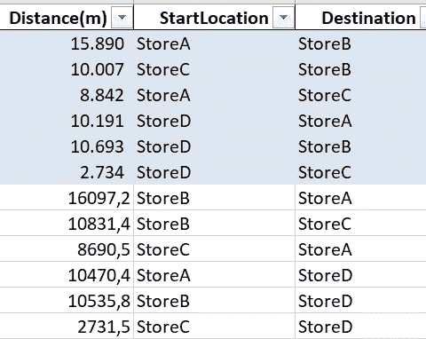
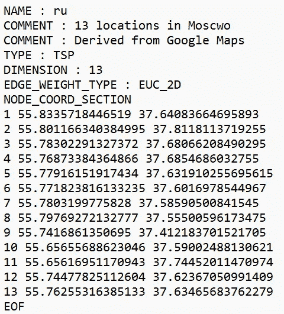

# 旅行推销员问题

> 原文：<https://towardsdatascience.com/traveling-salesman-problem-92e21d488a6a>

## 使用遗传算法寻找最短路径


如何找到不同地方之间的最短路线？(图片由作者提供)

所谓的旅行推销员问题是一个众所周知的挑战。任务是在多个目的地之间寻找最短的整体路线:女售货员连续访问几家商店，并在终点以整体最短的距离返回起点。我们打算用 Python 实现一个遗传算法来解决这个问题。

**背景:**

想象一下，从前，莫斯科一家金色汉堡连锁店的销售人员。销售人员必须走遍 A、B、C 和 d 四家商店。因为时间就是金钱，所以很自然地，您希望找到最短的旅行路线。

首先，我们需要所有四家商店之间的距离:



四家商店之间的车程，以米为单位。也考虑相反的方向(蓝色阴影)。

正如我们所看到的，所有商店之间的距离——在两个方向上——都是已知的。我们正在考虑两个方向，因为开车的距离可能略有不同。让我们看看商店 A 和商店 B 之间的距离，例如:


使用谷歌地图的汽车距离。我们的数据基于 OpenStreetMap，这就是为什么数字可能不同(图片由作者提供)

将所有商店组合在一条总的最短路线中称为非确定性多项式问题。这意味着找到的最短距离最多可以在多项式时间内得到验证。通俗地说，要找到确定性很高的最优路线可能需要很长时间。因为我们没有这个时间(即使我们有，我们也不能证明我们是否真的找到了最短的总距离)，我们将通过一种叫做遗传算法的特殊方法来接近最佳可能的解决方案。

**解:**
遗传算法反复修改一个群体的染色体(个体解)。染色体包含一个可能的存储序列，例如从存储 D 到 B，从 B 到 A，从 A 到 C，最后再从 C 回到 D:


存储在数组中(图片由作者提供)

另一个可能是:


第三个，例如:


..诸如此类。

染色体背后的想法是基于模拟生物进化的自然选择过程。因为它只是模仿，但肯定甚至不接近自然的镜子，我更喜欢称遗传方法为“高级盲猜”和染色体为“潜在的解决方案”。遗传方法的有趣之处在于，在每一步，遗传算法从当前群体中随机选择个体，并使用它们作为父母为下一代产生孩子。因此，通过使用遗传算法，从可能的随机生成解的初始群体中选择特别有前景的路线(商店的顺序)。经过一定数量的循环(突变)，种群“进化”到一个最优解。

遗传算法的实现包括类潜在解决方案，它将染色体表示为一种可能的单路解决方案。

```
class PotentialSolution:
    def randomInstance(cls):
        return PotentialSolution()
    def fitness(self):
        return 1
    def mutate(self):
        return self
    def crossover(self, other):
        return [self, other]
```

randomInstance()为第一代创建一个具有随机位置的实例。它也能够突变，即改变一条随机选择的路线，并与另一条染色体进行交叉，以与其随机交换位置。

由于距离将被最小化，因此适应度函数计算相应总距离的倒数。

```
def fitness(self):
    return 1 / self.getDistance()
```

在突变过程中，两个位置随机互换，

```
def mutate(self):
    return self
```

并且在交叉中，存储区将其位置与该存储区在另一个染色体中的位置交换。

```
def crossover(self, other):
    return [self, other]
```

class 方法 randomInstance()首先创建一个位置列表的副本，因为否则相同的列表将一直被传递。

```
def randomInstance(cls):
    return PotentialSolution()
```

使用 random shuffle()函数将副本随机化，并用于创建一个新实例，然后返回该实例。

```
def randomCoordinates(cls):
    PlacesCopy = cls.locations[:]
    shuffle(PlacesCopy)
    return distanceShuffling(PlacesCopy)
```

在 mutate()和 crossover()中，randint()函数用于生成两个指定数字之间的随机整数。方法 cross()在子代之间交换信息之前，使用 copy.deepcopy()获得父代染色体的完整拷贝。这是因为在当前的生殖循环中，父母可能会被重新选择。

主程序创建由 20 条随机染色体组成的初始第一个群体。计算每条染色体所有距离的总和。一旦其适应度超过指定的阈值(一个非常小的数字)，生成序列就会提前结束，并返回最优解。否则，经过预定的世代数后会找到最好的一个。算法将在达到最大 20 代后停止。Crossover _ chance 是一个介于 0 和 1 之间的概率值，表示平均发生交叉的频率，而不是直接接管父代。“突变 _ 机会”指定新一代染色体的平均突变频率。该值也介于 0 和 1 之间。

```
if __name__ == '__main__': 
    population = []
    for i in range(0, 20):
        population.append(distanceShuffling.randomCoordinates())
    advancedGuessing = AdvancedGuess(population, 0.0000001, 20, 0.7, 0.5)
    optimal = advancedGuessing.find()
    print("Shortest distance found:", optimal)
```

主要过程发生在 find()方法中。

```
def find(self):
    optimal = deepcopy(
        max(self.population, key = lambda potentialSolution: potentialSolution.fitness())
    )
    for i in range(0, self.max_generations):
        if optimal.fitness() >= self.expected:
            return optimal
        self.propagate()
        current_best = deepcopy(
            max(self.population, key = lambda potentialSolution: potentialSolution.fitness())
        )
        if current_best.fitness() > optimal.fitness():
            optimal = current_best
        print(i, optimal)
    return optimal
```

在最多 max_generations 代开始循环之前，这首先确定初始代的最适合的染色体。如果先前的最佳值已经达到预期的阈值，则立即返回。总体最适染色体和每轮最适染色体都被复制。

在标准情况下，下一代的生殖周期接下来发生。propagate()方法对此负责。之后，确定新一代的最佳个体，与先前的最佳值进行比较，如果出现进一步的改进，则接管该最佳个体。如果运行了所选的最大代数，但没有产生最佳结果，则最终返回目前为止找到的最佳结果。propagate()复制方法也是循环的，为下一代选择或创建个体，直到有足够多的个体。为此，在每次循环中首先选择两个人。

```
def propagate(self):
    newPopulation = []
    while len(newPopulation) < len(self.population):
        parents = self.chooseParents()
        if random() < self.crossover_chance:
            [child1, child2] = parents[0].crossover(parents[1])
            newPopulation.append(child1)
            newPopulation.append(child2)
        else:
            newPopulation.append(parents[0])
            newPopulation.append(parents[1])
    if len(newPopulation) > len(self.population):
        newPopulation.pop()
    for potentialSolution in newPopulation:
        if random() < self.mutation_chance:
            potentialSolution.mutate()
    self.population = newPopulation
```

与交叉概率相比较的随机值接下来决定是将来自上一代的原始个体延续下来，还是将由它们的父母产生新一代。

```
while len(newPopulation) < len(self.population):
    parents = self.chooseParents()
    if random() < self.crossover_chance:
        [child1, child2] = parents[0].crossover(parents[1])
        newPopulation.append(child1)
        newPopulation.append(child2)
    else:
        newPopulation.append(parents[0])
        newPopulation.append(parents[1])
```

在新一代最终取代老一代之前，所有新个体的另一个循环决定了它们是否应该变异。这也是通过将随机值与期望概率进行比较来完成的。

```
def mutate(self):
    rand_index_1 = randint(0, len(self.places) - 1)
    rand_index_2 = randint(0, len(self.places) - 1)
    if rand_index_1 != rand_index_2:
        self.places[rand_index_1], self.places[rand_index_2] = (
            self.places[rand_index_2], self.places[rand_index_1]
        )
```

只要我们运行所有的代码，我们就能在几秒钟内得到解决方案:


可能的最短总距离之一(图片由作者提供)

请注意，这些遗传算法是高度随机的。继续尝试连续几次代码，更改参数并观察结果如何变化。你可以在这里找到完整的代码和数据。

**小短途:**

当我们在玩的时候，我想提一下迭戈·维森特解决旅行推销员问题的迷人方法:

[](https://github.com/diego-vicente/som-tsp) [## GitHub - diego-vicente/som-tsp:使用自组织地图解决旅行推销员问题

### 该存储库包含一个自组织映射的实现，可用于为…寻找次优解决方案

github.com](https://github.com/diego-vicente/som-tsp) 

Diego 应用了一种改进的自组织映射(SOM)技术。出于好奇，现在让我们将现有的四家 McD-Moscow 商店再扩展 9 个坐标:



tsp 格式的 13 家商店的坐标(图片由作者提供)

..并将迭戈的知识库应用于此:


我们没看到本文开头的 gif 吗？你说的完全正确，我就是百听不厌！

如果迭戈的方法不酷，那什么才酷呢？

**总结:**

恭喜你，你已经应用遗传算法找到了一条最佳路线。

在这一点上，让我们也简单地记住，生活中有比 Python 编程更重要的事情。因此，这听起来也许很幽默，但却很真诚的愿望是，希望不久就会有和平，这样我们就可以在世界各地一起吃自由薯条了！

在此之前，非常感谢您的阅读！希望这篇文章对你有帮助。请随时在 [LinkedIn](https://de.linkedin.com/in/jesko-rehberg-40653883) 、 [Twitter](https://twitter.com/DAR_Analytics) 或[工作室](https://jesko-rehberg.medium.com/virtual-reality-vr-for-education-a532aa5b6272)与我联系。

[](https://jesko-rehberg.medium.com/membership) [## 通过我的推荐链接加入 Medium-Jesko Rehberg

### 阅读杰斯科·雷伯格(以及媒体上成千上万的其他作家)的每一个故事。您的会员费直接支持…

jesko-rehberg.medium.com](https://jesko-rehberg.medium.com/membership)