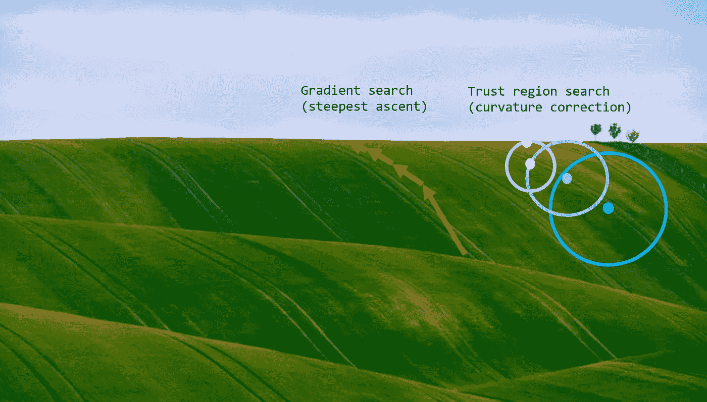
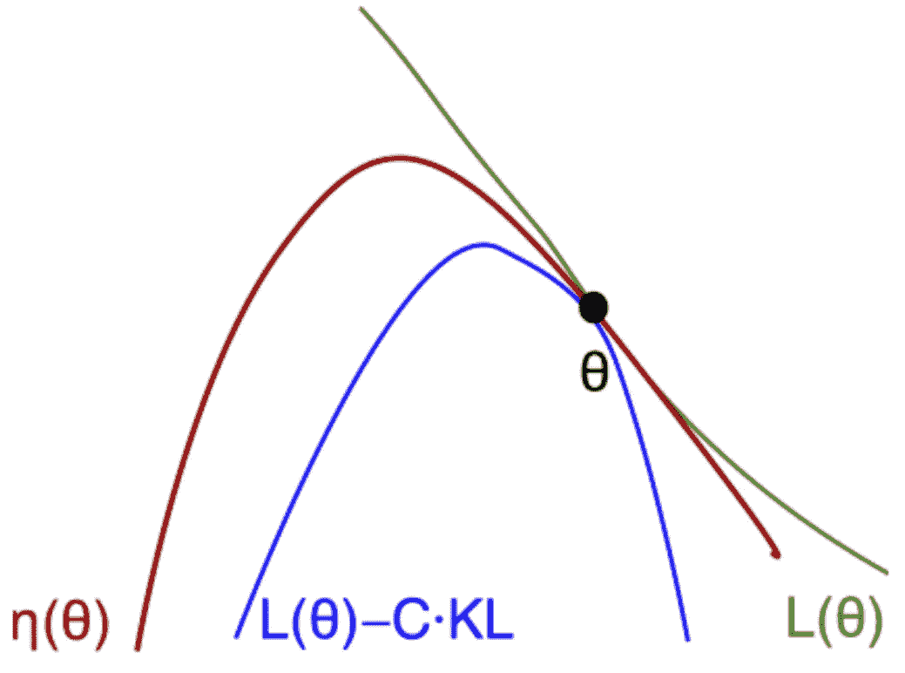
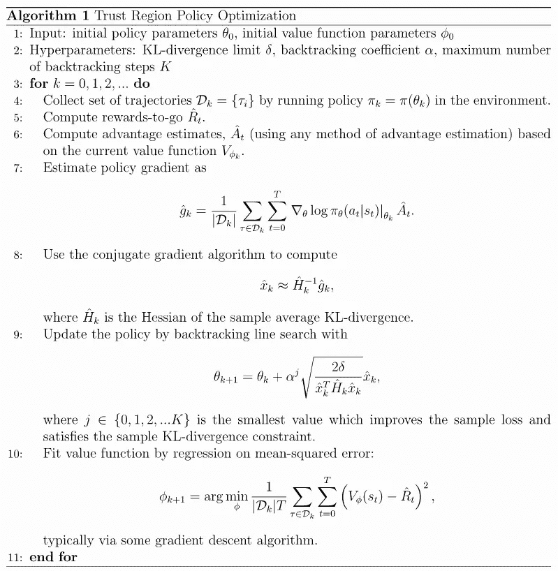

# 解释了信任区域策略优化(TRPO)

> 原文：<https://towardsdatascience.com/trust-region-policy-optimization-trpo-explained-4b56bd206fc2>

## 强化学习算法 TRPO 建立在自然策略梯度算法的基础上，确保更新保持在“可信”的策略区域内

在 [Unsplash](https://unsplash.com?utm_source=medium&utm_medium=referral) 上由 [Ronda Dorsey](https://unsplash.com/@thirtyspoke?utm_source=medium&utm_medium=referral) 拍摄的照片

描述 OpenAI 的信任区域策略优化(TRPO)算法的论文，作者是舒尔曼*等人*。(2015)，是现代强化学习的基础。它植根于 Amari (1998)和 Kakade (2001)关于自然政策梯度的早期工作，以及此后的改进。

TRPO 很快获得了欢迎和主流认可，因为根据经验，它比自然政策梯度算法表现得更好、更稳定。虽然它已经被最近的政策优化(PPO)超越，但它的贡献仍然很重要。

尽管我将简要地**重述一些核心概念**，但我假设您已经了解了政策梯度和自然政策梯度方法。本文将阐述 TRPO 背后的单调改进定理(关注直觉)以及区别于自然政策梯度的三个实施变化。

# 政策梯度(一阶优化)

政策梯度算法的主要思想相当简单。我们有一个参数化的策略 *π_θ* ，它以一定的概率返回动作。如果我们观察到一个行为产生高于平均水平的回报，我们**会增加这个行为的可能性**。

为了指导更新，我们定义依赖于 *π_θ* 的目标函数 *J(θ)* ，并且**计算梯度** *∇_θJ(θ)* (偏导数的向量)w.r.t .参数 *θ* 。

目标函数，产生与随机政策成比例的国家行动轨迹。

通过对多个动作进行采样，我们可以将回报轨迹 R(τ)相互对比——**导数告诉我们在哪个方向更新 *θ*** 。目标函数的斜率越陡，我们的更新就越大。

概率分布*P(τ；θ)* 既反映了随机政策，也反映了环境中嵌入的外生不确定性。幸运的是，我们可以推导出一个只依赖于策略*π_θ*的**表达式。如果这个策略对于 w.r.t. *θ* 是可微的，我们可以计算梯度 *∇_θ* 并优化目标函数。这产生了以下更新函数:**

传统的策略梯度更新函数，基于目标函数梯度∇_θJ(θ和步长α更新策略权重θ

关键的挑战是**选择合适的学习速率*α*。一阶导数告诉我们朝哪个方向走，但不是走多少。事实上，在一次更新中， *α* 的好值对于下一次更新可能是糟糕的。过冲和欠冲(见下图)在一阶优化中很常见；梯度只是不提供步长应该有多大的信息。**

一阶梯度算法不提供关于适当步长的信息，并且经常过冲或失速。[图片由作者提供]

有关策略梯度的更多详细信息，请查看以下文章:

 [## 强化学习中的策略梯度解释

### 了解所有关于基于似然比的政策梯度算法(加强):直觉，推导，和…

towardsdatascience.com](/policy-gradients-in-reinforcement-learning-explained-ecec7df94245) 

# 自然政策梯度(二阶优化)

为了解决一阶优化的步长问题，自然策略梯度**还包括二阶导数**，用于捕捉梯度相对于权重变化的灵敏度。本质上，它衡量的是政策*πθ*(回想一下，这是一个概率分布，在统计流形上移动)变化的程度。为此，我们计算更新前后策略之间的差异，称为 KL-divergence:

KL-divergence 衡量更新前后策略之间的距离。

通过在散度上加上上限 *ϵ* ，我们得到以下方案:

权重更新方案，最大 KL-散度为上限。

由于强化学习依赖于样本，我们在实践中执行了许多近似以使用自然梯度。最值得注意的是，我们对修改后的目标函数执行**泰勒展开**，对目标函数使用一阶展开，对 KL 散度使用二阶展开。推导过程非常繁琐，所以我将直接跳到最终的权重更新公式:

自然政策梯度的权重更新公式

我们用一个依赖于目标函数的局部灵敏度的动态函数代替了 *α* ，由费希尔信息矩阵 *F(θ)* 表示。直观上，我们的目标是发散阈值*ϵ*t21】内的**最大更新。在平坦的区域，我们可以安全地执行较大的更新，在弯曲的区域，我们更加谨慎。因此，这种行为通常与一阶优化相反，小心翼翼地逼近奖励峰值。**

有关自然政策梯度的详细解释，请查看以下文章:

 [## 解释强化学习中的自然策略梯度

### 传统的政策梯度方法存在根本缺陷。自然梯度收敛得更快更好，形成…

towardsdatascience.com](/natural-policy-gradients-in-reinforcement-learning-explained-2265864cf43c) 

# 自然政策梯度的问题

通过限制政策变化并考虑当地的敏感性，自然梯度往往比普通梯度收敛得更好更快。然而，这种方法也有许多缺点。

首先，虽然提供了一个迷人的理论框架，自然梯度需要大量的近似。二阶泰勒展开可能会错误地表示政策之间的实际距离，导致步长过大。因此，自然政策梯度**不能保证满足 KL-divergence 的约束！**在实践中，人们仍可能采取过大的步骤并违反约束。

第二，费希尔信息矩阵 f 是一个 *|θ|⋅|θ|* 矩阵，它可能需要大量内存来存储。然而，更具限制性的是计算逆矩阵 *F^-1* ，这是一个 *O(N )* 复杂度的**运算。对于包含数千甚至数百万个参数的神经网络，这在计算上变得非常困难。**

第三，尽管偏离理论框架很远，自然梯度算法并不检查更新是否实际上改善了目标。由于近似值，建议的权重更新实际上可能会恶化性能。

总而言之，自然政策梯度面临以下关键问题:

*   由于近似，可能违反 **KL 约束**，导致分析得出的步长过大。
*   逆矩阵 ***F^-1* 计算**耗时太长，是一个 *O(N )* 复杂度的运算。
*   我们没有检查**更新是否真的改善了政策**。由于所有的近似值，情况可能并非如此。

TRPO 通过一些有针对性的调整，在一定程度上解决了这三个问题。在处理实现更改之前，有必要讨论一些理论。

梯度搜索(一阶优化)与信赖域搜索(二阶优化)的对比图。前者遵循最陡的斜率(有过冲或失速的风险)，而后者根据统计流形的曲率调整其搜索空间[图片由作者改编自[Dawid za wia](https://unsplash.com/@davealmine?utm_source=medium&utm_medium=referral)on[Unsplash](https://unsplash.com?utm_source=medium&utm_medium=referral)]

# 信赖域策略优化(TRPO)——理论

如果你理解自然政策梯度，实际变化应该是全面的。为了充分理解它们，最好理解一下**单调改进定理**。

我们从夺回**优势** *A(s，a)* 开始，这是一个重塑的奖励信号。强化学习中的样板材料。优势表示——对于给定的策略 *π* 和给定的状态*s*——特定行为 *a* 的预期累积回报减去整体期望值。因此，优势描述了该行为的相对吸引力。

优势功能。直观地说，优势描述了与状态 s 中特定动作 A 相关的 Q 值与 s 中所有动作的 Q 值之间的差异。正优势意味着该动作的“优于预期”性能。

随机政策影响轨迹中的行动选择 *τ* ，环境决定状态的出现。因此，我们可以根据当前政策下生成的轨迹来计算预期回报。目标函数 *J(π_θ)* 描述了这些折扣奖励，期望源于政策 *π_θ* :

目标函数，写为无限时间范围内的预期贴现回报。

为了描述两种政策的预期报酬的差异，我们可以取原政策的预期报酬并**加上新政策的预期优势**【Kakade&Langford(2002)或 Schulman *et al.* (2015)的证明】。该表达式采用新策略下调整后的行动概率，但采用旧策略下计算的优势(即，我们不必重新采样):

更新政策的目标函数，用当前政策和预期优势表示

由于时间范围是无限的，上述可以用状态分布*ρ_(π_θ+δθ)*来重新表示:

表示保单质量的变化，将更新保单的预期优势加到当前保单的预期价值上。

术语*ρ_(π_θ+δθ)*是有问题的——如果不采样，我们如何知道对应于更新策略的状态分布？为了解决这个问题，我们利用状态分布，就像在当前策略下发生的一样，代价是**引入近似误差**:

策略质量变化的近似值，使用当前策略π_θ下的状态分布，而不是更新后的策略*π_θ+δθ*。近似可能会引入误差。

接下来，我们必须让事情适合模拟，因为我们没有完整的状态和动作集。我们用一个期望符号来代替*ρ*——可以使用蒙特卡罗模拟来采样——并使用**重要性采样来代替动作之和**。通过重要性抽样，我们有效地利用了当前政策的行动预期，并对新政策下的概率进行了修正:

使用状态样本和重要性抽样，为蒙特卡罗模拟调整目标函数。

描述更新策略相对于旧策略的质量的预期优势被称为替代优势*𝓛_π_θ(π_θ+δθ】*:

替代优势𝓛的定义，使用来自策略π_θ的样本描述更新策略π_θ+δθ的预期优势

近似误差可以用两种策略之间最坏情况下的 KL-散度来表示。因此，我们可以表示以下不等式:

描述更新后目标值最小变化的不等式。右手边表示下限，考虑到对发散误差进行了修正的替代优势。

舒尔曼*等人*推导出 *C* 的值，并以此作为目标函数改进的下限。因此，如果我们改进了右侧，我们保证也会改进左侧。实质上，如果替代优势*𝓛_π_θ(π_θ+δθ*超过最坏情况近似误差 *C⋅D_KL* ，我们肯定会改进目标。

这就是简而言之的单调改进定理。相应的程序是**最小化最大化(MM)算法**。如果我们提高下限 *M=𝓛_π_θ-C⋅D_KL* ，我们也提高目标至少相同的数量。

MM 算法的说明。当改进下限 L(θ)-C⋅KL 时，我们保证也改进目标函数η(θ)[来源:[舒尔曼，OpenAI，2017](https://drive.google.com/file/d/0BxXI_RttTZAhMVhsNk5VSXU0U3c/view?resourcekey=0-6NrgDm29IIPlXsPESX2w4w) ]

这一理论结果令人放心，但**并不过分实用**。首先， *D_KL^max* (即最大散度)很难计算，对于模拟实现，我们用预期(例如平均)散度来代替它。第二，所提出的算法严厉地惩罚策略偏差，因此产生非常小的保守更新。

尽管有实际的缺点，单调改进定理为充分理解 TRPO 的机制提供了重要的背景信息。

# 信任区域策略优化(TRPO) —实践

在实际实现方面，TRPO 与早期的自然政策梯度算法并没有太大的不同。有三个主要的改进**，每个都解决了原始算法中的一个问题。请注意，TRPO 旨在验证提议的更新是否实际上改善了我们的算法，符合单调改善定理。**

## 一、共轭梯度法[*x=f^-1∇logπ_θ(x】*

从自然梯度，我们已经导出了以下等价关系，允许将费希尔信息矩阵表示为我们已经拥有的梯度的外积(即，我们不必计算包含所有二阶导数的海森矩阵):

费希尔信息矩阵可以计算为梯度的外积。

不幸的是，计算费希尔逆矩阵*f^-1(θ*是一个耗时且数值不稳定的过程。特别是对于神经网络，一个 *|θ|⋅|θ|* 矩阵可以变得非常大，一个 *O(θ )* 矩阵是不可行计算的。

好消息是:我们对逆矩阵本身不感兴趣。如果你检查方程式，我们只需要乘积 *F^-1∇logπ_θ(x)* 。如果我们可以计算*x=f^-1∇logπ_θ(x)*——或者*f⋅x=∇logπ_θ(x)*——我们实际上不需要求逆。

进入**共轭梯度法**。解释整个过程远远超出了本文的范围，但可以说这是一个既定的数值过程来近似 *x* 。通过这种方式，我们可以避开计算倒数的需要。共轭梯度一般在 *|θ|* 步内收敛(通常要小得多)，这样我们就可以处理大型矩阵。

共轭梯度的使用并不是 TRPO 所独有的——例如，截断的自然政策梯度使用了相同的方法——但仍然是算法的一个组成部分。

## 二。线搜索[D _ KL(π_θ| |π_θ+δθ)≤δ]

尽管自然梯度提供了给定 KL 散度约束的最佳步长，但是由于所有的近似，我们实际上可能不满足该约束。

TRPO 通过执行线搜索——与典型的梯度搜索不同— **,迭代地减小更新的大小**,直到第一次更新不违反约束，从而解决了这个性能问题。该过程可以被视为收缩信任区域，即，我们信任更新实际上改进目标的区域。

对于减少，使用指数衰减率 *α^j* ，其中 *0 < α < 1* 和 *j∈N* 。如果第一次更新( *α⁰=1* )满足条件，我们保留原始的自然梯度步长。如果没有，我们继续缩小信任区域，直到更新令人满意。

线搜索算法。该算法迭代地减小更新的大小(使用指数衰减α^j)，直到散度落在阈值内(II)并且代理优势是非负的(iii)[来源: [Joshua Achuam，UC Berkeley](http://rail.eecs.berkeley.edu/deeprlcourse-fa17/f17docs/lecture_13_advanced_pg.pdf)

因此，与自然政策不同的是，*假定满足*发散约束，而在 **TRPO 中执行的线搜索实际上实施了它**。还要注意，单调改进理论利用了*惩罚*，而实现使用了*约束*(即信任区域)。

从伪代码中我们看到 *D_KL(θ||θ_k)≤δ* 并不是唯一必须满足的约束。它还断言 *𝓛_θ ≥0* 。这是改进检查，我们接下来将对此进行解释。

## 三。改进检查[𝓛(θ)≥0]

最后的区别很有意义。与其说*假设*更新会提高代理优势*𝓛(θ*，我们实际上*检查*它。回想一下，我们基于旧策略计算优势，使用重要性抽样来调整概率。当然，检查需要一些时间，但是在接受它之前，验证我们的更新是否确实改进了策略是令人放心的。

TRPO 算法的伪代码。TRPO 执行一个共轭梯度算法，一个约束样本 KL-divergence 的线搜索和一个关于提高代理优势的检查[来源: [OpenAI](https://spinningup.openai.com/en/latest/algorithms/trpo.html) ，麻省理工学院许可]

# 结束语

与传统的梯度算法相比，自然策略梯度提供了相当大的改进，传统的梯度算法难以确定适当的学习速率，并且在学习时经常停滞或超调。TRPO 再次向前迈出了重要的一步，主要是通过简单的**检查一个更新是否是一个改进**。共轭梯度近似使得 TRPO 适合于具有大量参数的策略，尽管这种方法在早期的工作中已经被提出。

根据经验，TRPO 在许多任务上优于早期的自然梯度算法，但它本身也不是没有缺陷:

*   虽然不再需要计算 *F^-1* ，但是估计 *F* 仍然是一项繁琐的任务(需要内存和大量的样本批次)。对于深度神经网络，TRPO 不具有伸缩性；
*   共轭梯度算法是容易得到的，但是它们的结合使得 RL 算法的实现更加复杂；
*   TRPO 在利用卷积或循环网络的任务中表现不佳(CNN 和 RNN)；
*   作为二阶算法，它明显比一阶算法慢，并且没有充分利用 ADAM 等优秀的优化器；
*   当架构有多个输出时——神经网络输出策略和价值函数的情况很常见——没有一致的度量标准可供使用；
*   总的来说，TRPO 很难解释和说明，使得实现、调试和培训都很困难。

 [## 解释了最近策略优化(PPO)

### 从强化到连续控制中的 go-to 算法

towardsdatascience.com](/proximal-policy-optimization-ppo-explained-abed1952457b) 

[近似策略近似法](https://medium.com/p/abed1952457b)——也是 OpenAI 在 2017 年推出的——在经验上与 TRPO 等方法具有竞争力(甚至优于 TRPO ),而且实现起来也简单得多。因此，*事实上已经*取代了 PPO。尽管如此， **TRPO 代表了自然政策梯度发展中的一个重要里程碑****，值得强化学习领域的学生关注。**

***喜欢这篇文章？你可能也会喜欢下面的 RL 文章:***

** [## 马尔可夫决策过程的五个组成部分

### 通过掌握马尔可夫决策的基本原则来定义和交流您的强化学习模型…

towardsdatascience.com](/the-five-building-blocks-of-markov-decision-processes-997dc1ab48a7)  [## 为什么强化学习不需要贝尔曼方程

### 强化学习中著名的贝尔曼方程和 MDP 公式的再评价

towardsdatascience.com](/why-reinforcement-learning-doesnt-need-bellman-s-equation-c9c2e51a0b7)  [## 基于离散策略梯度算法的悬崖行走问题

### 用 Python 实现了一个完整的增强算法。手动执行这些步骤来说明内部…

towardsdatascience.com](/cliff-walking-problem-with-the-discrete-policy-gradient-algorithm-59d1900d80d8) 

# 进一步阅读

论文:

*   阿马里，S. I. (1998 年)。[自然渐变在学习中很有效。](https://d1wqtxts1xzle7.cloudfront.net/32944066/Amari_-_Natural_Gradient_works_efficiently_in_learning-with-cover-page-v2.pdf?Expires=1662047457&Signature=KiOeWpPHdAWivpd0vlFhsg4bbZt~AmV1GA5ZL9ZwUMdjDPzzLB7fMeFiaBOQ11wYGgW5MKXX-gGgGgqQms3aHjpGYivUeN~U0xeXBwceDoz6jh4~7i8G--7rdavlU0HVj1sxX1vrQUSk~qVXqbsjKm-wCtwuk9o6jXUfeJql1PGTv65T70akN6rWVPUb3mW7Xw8drbgBfDsUh1AWCrczpSuWUIZG4n~gCzmGzfqb~Jfj3zBy~WbzSLNFUgMoT3FsrI-fq0~gMkmyXKThnd~4gY00k445Y0HKQmHjNq5RO9~OCr9~kx1tTvks6Zd9BBjtUBmHPAywLiQzPHWPEAf0-A__&Key-Pair-Id=APKAJLOHF5GGSLRBV4ZA) *神经计算*， *10* (2)，251–276。
*   Kakade，S. M. (2001 年)。[天然的政策梯度。](https://proceedings.neurips.cc/paper/2001/file/4b86abe48d358ecf194c56c69108433e-Paper.pdf) *神经信息处理系统进展*， *14* 。
*   s . m . kakade 和 j . John Langford(2002 年)。[近似最优近似强化学习。](https://people.eecs.berkeley.edu/~pabbeel/cs287-fa09/readings/KakadeLangford-icml2002.pdf)在*国际机器学习会议*。
*   舒尔曼，j .，莱文，s .，阿贝耳，p .，乔丹，m .，莫里茨，P. (2015)。[信托区域政策优化。](http://proceedings.mlr.press/v37/schulman15.pdf)参加*机器学习国际会议。*

讲座幻灯片:

*   高级政策梯度(CS 285)。加州大学伯克利分校。
*   Achiam，J. (2017 年)。[高级政策梯度方法。](http://rail.eecs.berkeley.edu/deeprlcourse-fa17/f17docs/lecture_13_advanced_pg.pdf)加州大学伯克利分校。
*   自然政策梯度，TRPO，PPO (CMU 10703)。卡内基梅隆。
*   舒尔曼，J. (2017)。[高级政策梯度方法:
    自然梯度、TRPO 等。](https://drive.google.com/file/d/0BxXI_RttTZAhMVhsNk5VSXU0U3c/view?resourcekey=0-6NrgDm29IIPlXsPESX2w4w) OpenAI。

博客帖子:

*   自然渐变(TRPO，PPO)。[ [链接](https://julien-vitay.net/course-deeprl/notes/3.6-PPO.html)
*   OpenAI (2018)。信任区域策略优化。[ [链接](https://spinningup.openai.com/en/latest/algorithms/trpo.html#id2)**