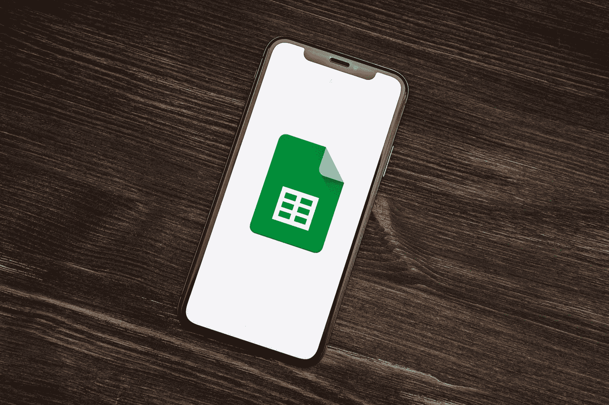
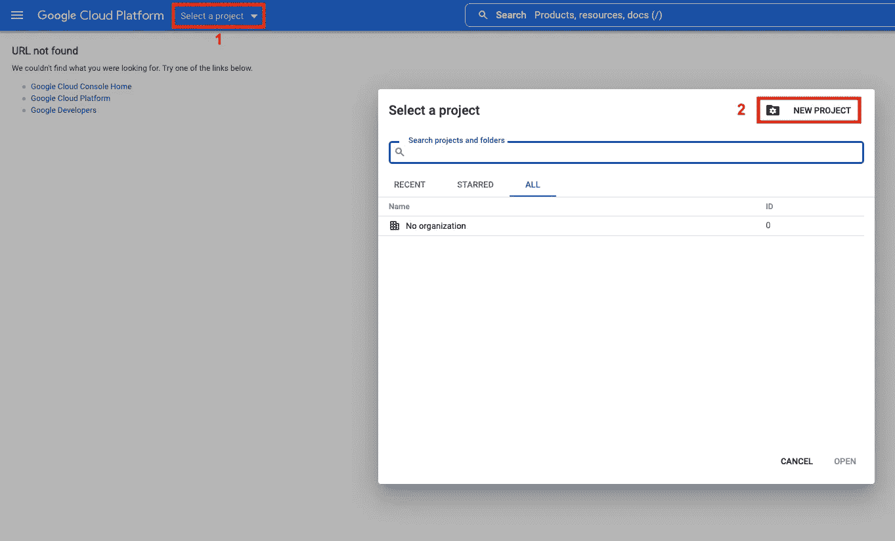
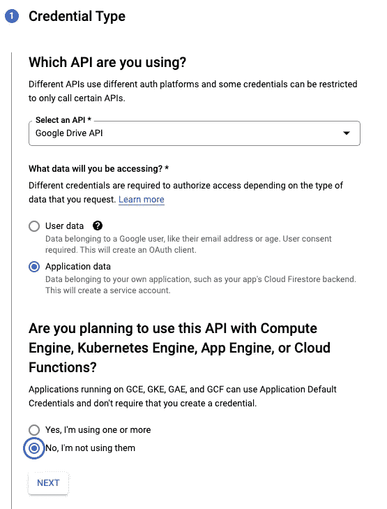
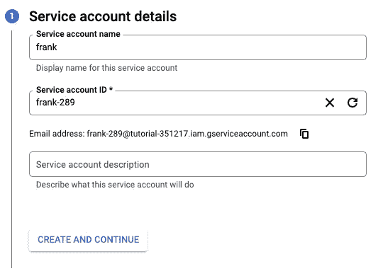
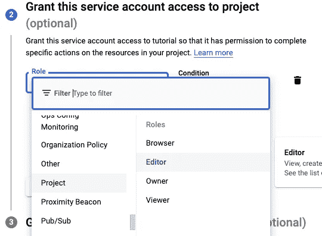
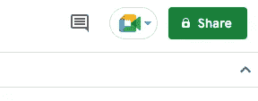

# 用 Python 把 Google Sheets 变成你自己的数据库

> 原文：<https://towardsdatascience.com/turn-google-sheets-into-your-own-database-with-python-4aa0b4360ce7>

## 使用 Python 创建电子表格并将数据保存到 Google Sheets 的指南。



图片来自 Shutterstock，授权给 Frank Andrade

您知道 Google Sheets 可以用作轻量级数据库吗？

Google Sheets 是一个基于云的电子表格应用程序，可以像大多数数据库管理系统一样以结构化的方式存储数据。您还可以通过几次点击来编辑和删除数据，除此之外，还可以在线访问您的数据。

尽管 Google Sheets 有一些限制，比如您可以使用的单元格数量(最多 1000 万个单元格)和每分钟可以进行的 API 调用，但它仍然是一个不错的选择，您可以免费获得。

在本指南中，我将向您展示如何在 Python 中使用 Google Sheets。我们将学习如何使用 Python 创建电子表格并保存数据，这样您就可以将 Google Sheets 转换成自己的数据库。

```
**Table of Contents** 1\. [Enable APIs and download credentials](#461d)
2\. [Turning Google Sheets into a Database with Python](#6054)
 - [Connect to Google Sheets](#7881)
 - [Create a blank spreadsheet](#36be)
 - [Sharing a spreadsheet](#06b5)
 - [Open the spreadsheet and upload data](#34d4)
3\. [Bonus: Open Any Google Sheet File with Python](#c20a)
```

如果你不想看，你可以看我的视频！

# 1.启用 Google Drive 和 Google Sheet API 并下载凭证

要用 Python 连接 Google Sheets，我们必须将我们的凭证下载到一个 JSON 文件中。为此，我们必须开始一个新项目。

## 创建新项目

要创建一个新项目，请访问这个[网站](https://console.cloud.google.com/)，并遵循以下步骤(您需要已经登录您的谷歌账户)。

1.  选择一个项目
2.  点击“新项目”
3.  将加载一个新页面。在那里，你必须写下你的新项目的名称，然后点击“创建”



作者图片

4.创建项目后，您将看到下图


作者图片

点击“选择项目”您应该会看到新的一页。

## 为新项目启用 Google Drive API，创建凭证，并下载它

选择项目后，转到左侧面板，单击“APIs & Services”，然后选择“Library”，如下所示。


作者图片

你现在应该看到下面的页面。在那里，我们必须搜索 **Google Drive API** 并启用它。


作者图片

启用后，我们必须单击右上角的“创建凭据”。

在此之后，我们必须选择下面的选项，然后单击“下一步”



作者图片

然后，我们为我们的服务帐户命名，并单击“创建并继续”



作者图片

现在我们必须选择角色。在这种情况下，我们从“项目”选项中选择“编辑器”，然后单击“完成”



作者图片

在此之后，我们必须再次打开左侧面板，单击“APIs & Services ”,然后选择“Credentials”

在页面底部，您会看到一个“服务帐户”部分。在这里，我们必须点击我们的**客户端电子邮件**(请记住，我们将在该部分创建的所有文件都将保存在该客户端电子邮件中)


作者图片

然后，我们必须转到“密钥”部分，并单击“创建新密钥”


作者图片

然后点击“创建”,一个包含您的凭证的 JSON 文件将被下载到您的计算机上。我将把这个文件重命名为" **gs_credentials.json"** 你必须把这个 json 文件移动到你的 Python 脚本所在的同一个文件夹中。

最后，我们必须搜索 **Google Sheets API** ，并像我们之前对 Google Drive API 所做的那样启用它。

# 2.用 Python 将 Google Sheets 转化为数据库

## 连接到 Google Sheets

要在 Python 中使用 Google Sheets，首先，我们必须安装 gspread 和 oauth2client。除此之外，我们将使用 Pandas 来读取我们的本地数据，并将其更新到 Google Sheets。

```
pip install gspread
pip install oauth2client
pip install pandas
```

现在让我们导入库并连接到 Google Sheets。

在上面的代码中，我们在`scope`列表中启用对特定链接的访问，然后在`credentials`变量中写入我们之前下载的 JSON 文件的名称。

最后，我们创建一个`client`变量。

## 创建空白电子表格

让我们创建一个名为“NewDatabase”的新电子表格

为此，我们必须使用我们之前定义的`client`变量的`.create`方法。

```
sheet = client.create("NewDatabase")
```

请注意，这个新工作表仅对我们之前创建的服务帐户可见。要使用我们自己的 Google 帐户访问此表单，我们必须通过电子邮件共享它

## 共享电子表格

让我们用自己的谷歌账号来分享这个`sheet`。为此，请运行下面的代码。

```
sheet.share('your_email_goes_here', perm_type='user', role='writer')
```

运行上面的代码后，该表将位于 Google Drive 的“与我共享”部分。

## 打开电子表格并上传数据

现在是时候打开工作表并向其中上传数据了。为此，我们使用`.open`方法并选择`sheet1`。

然后我们阅读任何关于熊猫的 CSV 文件。在这种情况下，我将使用一个 CSV 文件，您可以在 [Google Drive](https://docs.google.com/spreadsheets/d/1NaEkBT4oER7eq3qfziH5X7-1_-Sye5k5fqMvItbykbo/edit?usp=sharing) 或我的 [Github](https://github.com/ifrankandrade/api.git) 中找到，但是您可以随意使用任何您想要的 CSV 文件。

最后，我们使用`.update`方法将数据上传到工作表中。

```
*# Open the spreadsheet*
sheet = client.open("NewDatabase").sheet1*# read csv with pandas*
df = pd.read_csv('football_news')*# export df to a sheet*
sheet.update([df.columns.values.tolist()] + df.values.tolist())
```

就是这样！现在，您的工作表应该具有与 CSV 文件中相同的数据。你可以在我的 [Github](https://github.com/ifrankandrade/api.git) 上找到本指南所写的所有代码。

# 额外收获:用 Python 打开任何 Google 工作表文件

现在是时候打开任何 Google 工作表文件了(即使那些不是由我们的客户电子邮件创建的)。

要做到这一点，打开任何谷歌工作表文件，转到右上角，点击“分享”。



作者图片

将弹出一个新窗口。插入我们之前收到的客户电子邮件(也在我们下载的 JSON 文件中),然后单击“发送”


作者图片

太好了！现在我们有了权限，您可以使用我们之前编写的相同代码打开它。

用 Python 学习数据科学？ [**通过加入我的 10k+人电子邮件列表，获得我的免费 Python for Data Science 备忘单。**](https://frankandrade.ck.page/26b76e9130)

如果你喜欢阅读这样的故事，并想支持我成为一名作家，可以考虑报名成为一名媒体成员。每月 5 美元，让您可以无限制地访问数以千计的 Python 指南和数据科学文章。如果你用[我的链接](https://frank-andrade.medium.com/membership)注册，我会赚一小笔佣金，不需要你额外付费。

<https://frank-andrade.medium.com/membership> 