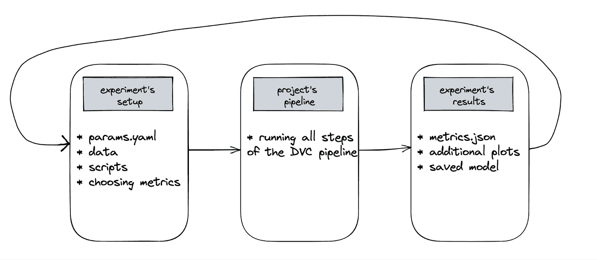
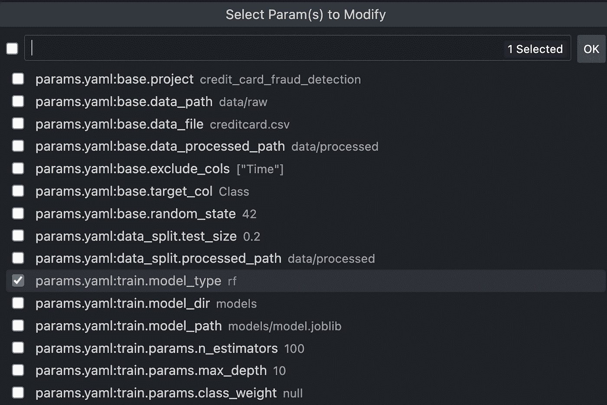
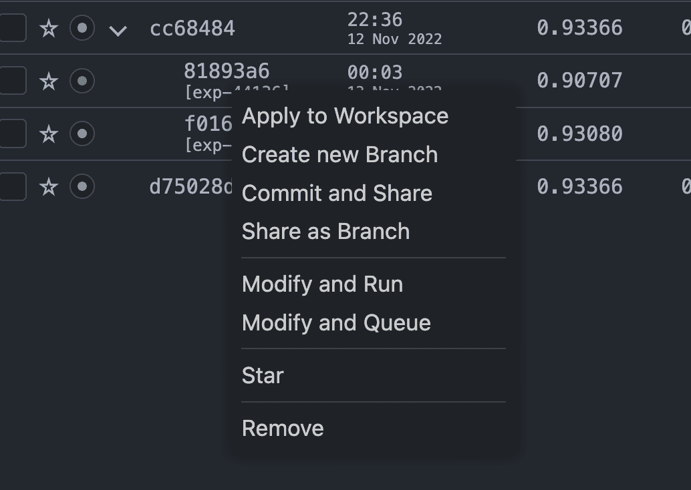

# 将 VS 代码变成 ML 实验的一站式商店

> 原文：<https://towardsdatascience.com/turn-vs-code-into-a-one-stop-shop-for-ml-experiments-49c97c47db27>


作者使用[稳定扩散](https://huggingface.co/spaces/stabilityai/stable-diffusion)生成的图像

## 如何在不离开 IDE 的情况下运行和评估实验

近来，生产力面临的最大威胁之一是环境转换。这个术语起源于计算机科学，但应用于人类。它指的是停止一件事情的工作，执行一项不同的任务，然后重新开始最初的任务的过程。

在工作日，您可能想要检查堆栈溢出，例如，为您的项目选择哪种规范化技术。在这样做的同时，您开始研究`scikit-learn`的文档，看看哪些方法已经实现，以及它们之间的比较。这可能会给你带来一些有趣的关于媒体的比较文章或者 YouTube 上的视频教程。你知道接下来会怎样…

在处理数据时，每当我们需要离开 IDE 并转向浏览器时，潜在的威胁就会出现。它可能是查找我们正在处理的一个棘手的编程问题，或者使用我们选择的平台查看我们的实验结果。不仅在 IDE 中编写我们的实验代码，而且在那里评估和比较它们，这不是很好吗？

在本文中，我将展示如何利用 DVC 的新扩展直接从 VS 代码中运行和评估实验。

# VS 代码的 DVC 扩展

你可能听说过 DVC ( *数据版本控制)*，你知道它是一个类似 Git 的系统，用于版本化你的数据和模型。本质上，它允许我们用 Git 跟踪数据，而不需要实际将数据存储在 Git 存储库中。

你可能没有听说过的是，DVC 也有助于进行人工授精实验。在我们的项目中，我们可能会运行几十个甚至几百个实验，每个实验都与之前的略有不同。随着实验数量的快速增长，DVC 可以跟踪这些实验并将其版本化。然后，它还允许我们比较它们最相关的依赖项(数据、脚本等。)、参数和度量。一旦我们对实验的结果感到满意，我们就可以只将相关的部分提交给 Git。

最近，iterative . ai(DVC 背后的公司)也发布了一个开源的 VS 代码扩展，为最受欢迎的 ide 之一带来了许多非常有用的功能。我将提到对我来说最突出的两个。

首先，该扩展提供了强调可再现性的实验簿记。我们可以快速运行新的实验，跟踪它们的版本(代码、模型、参数、数据等。)，并在综合表中比较它们的结果。然后，通过点击一个按钮，我们可以将我们的代码库和工件切换到我们已经运行的任何实验。在下面的 GIF 中可以看到评测表的快速预览。


其次，该扩展扩展了绘图功能。使用 DVC，我们可以使用交互式绘图跟踪、可视化和评估我们的实验性能。例如，我们可以并排显示两条 ROC 曲线或混淆矩阵，以检查哪个实验取得了更好的性能。更好的是，该扩展还提供了某些指标的实时绘图。例如，我们可以在模型仍在被训练时，可视化模型在时期/估计器上的当前损失或验证性能。

在实践中，DVC 扩展扩展了一些选项卡的功能，添加了一个用于运行和评估实验的全新选项卡，并在命令面板中注册了新命令(在 macOS 上，通过`cmd + shift + p`访问)。我强烈推荐使用`DVC: Get Started`命令来检查扩展的所有功能。

最后，DVC 扩展目前处于测试阶段，但我们已经可以用它来改善我们的工作流程。

# 动手示例

## 问题定义

在这个玩具示例中，我们试图识别欺诈性的信用卡交易。数据集(可在 [Kaggle](https://www.kaggle.com/datasets/mlg-ulb/creditcardfraud) 上获得)可以被认为是高度不平衡的，只有 0.17%的观察值属于正类。

我们将使用随机森林和 LightGBM 分类器，并使用召回率、精确度和 F1 分数来评估它们的性能。

下图显示了使用 DVC 的实验工作流的简化步骤。首先，我们通过调整脚本(例如，不同的数据分割方式、选择不同的预处理步骤、跟踪不同的度量标准等)来设置实验。)或考虑的参数(这包括选择模型、其超参数等。).然后，我们运行项目的管道，即输入数据和最终输出之间的所有步骤。最后，我们评估跟踪的指标并检查潜在的图表。如果我们对结果满意，我们可以在这一步停下来，将更改提交给 Git/DVC，并专注于将一切投入生产。如果我们想继续试验，我们回到第一步，迭代。



下面，我们展示这个[项目的代码库](https://github.com/erykml/vscode_exp_tracking_with_dvc)的结构:

```
📦vscode_exp_tracking_with_dvc
┣ 📂.dvc
┣ 📂data
┃ ┣ 📂processed
┃ ┃ ┣ 📜X_test.csv
┃ ┃ ┣ 📜X_train.csv
┃ ┃ ┣ 📜y_test.csv
┃ ┃ ┗ 📜y_train.csv
┃ ┣ 📂raw
┃ ┃ ┗ 📜creditcard.csv
┃ ┣ 📜.gitignore
┃ ┗ 📜raw.dvc
┣ 📂models
┃ ┗ 📜model.joblib
┣ 📂src
┃ ┣ 📂stages
┃ ┃ ┣ 📜data_split.py
┃ ┃ ┣ 📜eval.py
┃ ┃ ┗ 📜train.py
┃ ┗ 📂utils
┃ ┃ ┣ 📜__init__.py
┃ ┃ ┗ 📜params.py
┣ 📜.dvcignore
┣ 📜.gitignore
┣ 📜README.md
┣ 📜dvc.lock
┣ 📜dvc.yaml
┣ 📜metrics.json
┣ 📜params.yaml
┗ 📜requirements.txt
```

代码库可能看起来有点令人生畏，但它实际上代表了项目结束时的状态。我相信花一分钟时间来检查它是有益的，因为它展示了一个潜在的设置，使得用不同的模型/参数进行实验变得容易。

为了展示整个实验工作流程，我将带你经历我必须遵循的所有步骤，以达到这个最终项目的结构。这样，您可以更容易地为自己的项目重现工作流。

接下来，我建议创建一个新的虚拟环境，安装`requirements.txt`的内容，并下载 DVC [VS 代码扩展](https://marketplace.visualstudio.com/items?itemName=Iterative.dvc)。

## 建立 DVC

在建立了项目的目录后，我们需要初始化 DVC 跟踪。请记住，如果我们正在克隆一个已经初始化了 DVC 的项目，则不需要这一步。出于本教程的考虑，我们假设我们是从零开始这个项目。为此，我们在终端中运行以下命令:

```
dvc init
```

运行这个命令会创建 3 个文件:`.dvc/.gitignore`、`.dvc/config`和`.dvcignore`。然后，我们需要使用 Git 提交这些文件，并将它们推送到我们的存储库。

我们还需要为 DVC 指明一个遥控器，也就是放置对象(数据、模型等)的地方。)将被实际存储和版本化。最简单的解决方案是将它们存储在本地。我们可以使用以下命令来设置它:

```
mkdir -p /tmp/dvc-storage
dvc remote add local /tmp/dvc-storage
dvc push -r local
```

自然，我们也可以使用云解决方案作为远程(亚马逊 S3，Azure Blob 存储，谷歌云存储，DagsHub 等)。).

## 跟踪数据并建立 DVC 管道

下一步，我们从 Kaggle 下载数据，并将 CSV 文件放在`data/raw`目录中。顾名思义，这是原始数据文件。我们对其应用的所有转换(例如，预处理或分割)将由单独的 Python 脚本执行，对数据集的更改将使用 DVC 进行跟踪。

然后，我们开始追踪数据。为此，我们运行以下命令:

```
dvc add data/raw
```

执行该命令会创建一个名为`raw.dvc`的小文本文件，其中存储了关于如何访问数据的信息。由于文本文件本身很小，我们用 Git 而不是原始数据文件(由 DVC 进行版本控制)对其进行版本控制。用 Git 对`raw.dvc`文件进行版本控制后，我们再运行一个命令将数据推送到本地远程:

```
dvc push -r local
```

现在，我们的原始数据被跟踪使用 DVC。我们可以继续创建 DVC 管道，它存储了项目中执行的所有步骤的信息，包括它们各自的依赖项和输出。

创建 DVC 管道有不同的可能方式。其中之一是使用一组`dvc run`命令(在终端中执行)并将所有内容指定为这些命令的参数。我在另一个项目中使用了这种方法，你可以在这里阅读更多关于[的内容。或者，我们可以直接创建包含完全相同信息的`dvc.yaml`文件。对于这个项目，我选择了第二种方法。就个人而言，我发现直接创建 YAML 文件比使用 CLI 编写很长的参数化命令更容易一些。](https://hackernoon.com/data-testing-for-machine-learning-pipelines-using-deepchecks-dagshub-and-github-actions)

我们几乎处于实验阶段！还有几件事需要澄清。我们的管道由 3 个步骤组成:

*   `data_split` —该步骤消耗原始数据(位于`data/raw`目录中)并将其分成训练集和测试集。这些器械包以 CSV 文件的形式存储在`data/processed`目录中。
*   `train` —训练我们选择的 ML 模型，并将其作为`.joblib`文件存储在`models`目录中。
*   `eval` —评估模型在测试集上的性能，并将跟踪的指标输出到`metrics.json`文件。

我们项目的管道如下所示。

```
stages:
  data_split: 
    cmd: python src/stages/data_split.py --config=params.yaml
    deps:
      - src/stages/data_split.py
      - data/raw
    params:
      - base
      - data_split
    outs:
      - data/processed
  train:
    cmd: python src/stages/train.py --config=params.yaml
    deps:
      - src/stages/train.py
      - data/processed
    params:
      - base
      - train
    outs:
      - models/model.joblib
  eval:
    cmd: python src/stages/eval.py --config=params.yaml
    deps:
      - src/stages/eval.py
      - data/processed
      - models/model.joblib
    params:
      - base
      - data_split
      - train
    metrics:
      - metrics.json:
          cache: false
```

创建文件后，我们运行`dvc repro`命令来重现整个管道。因为我们以前没有运行过，所以这 3 个步骤将按顺序执行，同时存储和版本化它们的输出。

所有的步骤都是可配置的，也就是说，它们有自己专用的参数集，我们可以在运行实验时调整这些参数。对于训练阶段，这些非常直观，因为它们只是模型的超参数。对于分割阶段，它可以是我们想要用于测试集的数据集的一部分。

参数存储在`params.yaml`文件中，我们使用`argparse`和`python-box`库的组合将它们加载到我们的脚本中。为了简洁起见，我们不在这里讨论这些部分，但是我强烈推荐检查这个项目中的`.py`脚本，看看一切是如何设置的。

我们的初始`params.yaml`文件包含以下设置:

```
base:
  project: credit_card_fraud_detection
  data_path: data/raw
  data_file: creditcard.csv
  data_processed_path: data/processed
  exclude_cols:
  - Time
  target_col: Class
  random_state: 42

data_split:
  test_size: 0.2
  processed_path: data/processed

train:
  model_type: rf
  model_dir: models
  model_path: models/model.joblib
  params:
    n_estimators: 100
    max_depth: 10
    class_weight: null
```

大多数设置都非常简单。但是，值得一提的是，一旦加载了参数，YAML 文件中的`null`值(用于`class_weight`超参数)将被解释为 Python 中的`None`。

## 用 DVC 做实验

在深入实验之前，我认为有必要澄清一下，运行和评估实验并不是 VS 代码扩展的新功能。我们可以使用命令行来执行几乎所有通过扩展可用的任务。这个扩展提供了一个很好的交互式 GUI，我们可以用它来改进我们的工作流程。最后，DVC 和 VS 代码扩展都读取实验的数据文件，如`metrics.json`或`params.yaml`。

首先，让我们探索一下新的 DVC 选项卡。我们可以使用 ide 左侧导航栏上的图标来访问它。我们首先列出选项卡的面板:

*   `COLUMNS` —在此面板中，我们可以选择哪些列(代表指标、参数、数据/模型版本等。)我们想在实验评估表中看到。
*   `EXPERIMENTS` —包含已执行实验的列表。
*   `SORT BY` —我们可以使用此面板来配置实验表的排序方式。
*   `FILTER BY` —我们可以使用此面板查看/添加/删除应用于评估表的指标和参数过滤器。
*   `PLOTS`-包含微调绘图仪表板的实用程序。

对于本教程，只有前两个是相关的。您可以在下图中看到它们的预览。


我们另外标记了两个方便的按钮，它们显示实验评估表(1)和图(2)。在本文中，我们只关注表格，我们在下面的截图中展示了它。顺便说一下，我们还可以通过运行`dvc exp show`来检查终端中的表。


首先，我们解释左侧的*实验*栏。我已经运行了一些实验，所以表已经被填充了。默认情况下，该表包含工作区(当前代码库)、当前 Git 分支(在本例中为`main`)以及对该分支的前两次提交。每一个都可以有任意多的实验，这些实验都有各自的名称和 id。对于要在表中注册的实验，我们只需要使用 DVC 运行它(从扩展或命令行)，我们不需要将这些实验提交给 Git。

使用默认设置，该表相当大，因为它包含:

*   实验的 id 和运行日期，
*   所有请求的指标(来自`metrics.json`文件)，
*   所有参数(来自`params.yaml`文件)，
*   `src`目录下文件的版本，数据目录和存储的模型。

由于这很难理解，而且表格也不容易阅读，我们使用`COLUMNS`面板来隐藏我们知道在本教程中不会改变的列。因此，较小的表格更容易阅读。你可以在下面看到。


要运行新的实验，我们右键单击要修改的载物台。在这种情况下，我们希望从当前工作区创建一个新的实验。下图说明了。


我们选择第一个选项— *修改并运行。*点击它会打开一个弹出窗口，在该窗口中我们可以从`params.yaml`文件中选择我们想要修改的参数。对于这个简单的实验，我们只是将分类器从 Random Forest 改为 LightGBM。



选择参数并单击 OK(或按 Enter)后，会出现另一个弹出窗口。在这里，我们必须输入参数的新值。


按下*输入*将接受新值，并使用新的参数组运行实验。一些额外的事情值得一提:

*   如果我们选择了多个要修改的参数，我们必须依次提供新的值，每个值都在一个单独的对话窗口中。由于我们当前正在修改的参数的名称在顶部可见，因此非常直观和简单。
*   通过 DVC 扩展调整这些参数会用新的参数值修改`params.yaml`文件。
*   我们可以通过在终端中运行下面的命令来获得完全相同的结果:`dvc exp run --set-param train.model_type=lgbm`。
*   不带任何参数运行`dvc exp run`命令将导致使用默认设置运行实验，即使用`params.yaml`文件的当前内容。
*   新模型是单独版本化的，我们可以在最后一列看到它的 ID。

下面，我们可以看到我们的实验结果。我们可以在两个地方看到结果——工作区行和显示在`main`分支下的实验(因为我们是从那个分支操作的)。


根据该表，我们可以得出一些结论，例如:

*   LightGBM 模型似乎性能严重不足，需要更多的调整，
*   各种随机森林模型在测试集上达到 100%的精度，
*   最平衡的模型，即具有最高 F1 分数的模型，是具有平衡类权重的随机森林模型。

我们不会深入评估模型的性能，因为这不是本文的目的。相反，我们提到了该扩展的一个更方便的特性。通过右键单击任何过去的实验，我们可以看到以下选项:



使用这些选项，我们可以轻松地:

*   将实验的所有更改应用到我们当前的工作区。
*   使用给定实验的设置创建一个新分支。
*   通过调整之前执行的任何实验的参数来运行新的实验。
*   把实验从桌子上拿走。用 DVC 创建的实验是短暂的，也就是说，它们只存储在 DVC 而不是 Git 上(除非我们提交它们)。

这将结束使用新的 VS 代码扩展来创建和评估使用 DVC 的实验的最基本的场景。

# 附加功能

到目前为止，我们已经介绍了在 VS 代码中使用 DVC 扩展的基本工作流程。然而，该扩展(以及 DVC 本身)提供了许多其他功能，您可能会对您的项目感兴趣:

*   实验被智能地缓存起来，用完全相同的参数重新运行实验只会导致加载缓存的结果。
*   这个扩展在绘图方面有很多不错的功能。首先，它可以存储管道特定阶段的输出图，例如，混淆矩阵热图或 ROC 曲线。第二，它具有实时绘图功能，例如，当模型仍在训练时，我们可以看到模型的训练和验证损失。
*   我们可以创建按顺序运行的实验队列。如果实验运行需要相当长的时间，并且我们不希望在运行下一个实验之前不断地监控第一个实验是否已经完成，那么这个特性就特别有用。
*   使用简单的脚本，我们可以通过`dvc exp run`命令创建循环，使用穷举或随机网格搜索来搜索超参数的最佳组合。或者，我们也可以通过组合`dvc exp run`命令的`--set-param`和`--queue`参数来使用 CLI。您可以在本文的[中找到更多关于网格搜索实现的信息。](https://iterative.ai/blog/hyperparam-tuning)
*   通过`SORT BY`和`FILTER BY`面板，我们可以修改实验表格，使评估更加简单和直观。
*   我们不局限于在本地使用扩展。我们可以在虚拟机上启动 VS 代码，或者将我们的本地 IDE 连接到任何云环境(GitHub Codespaces、Google Colab 等)。).

# 外卖食品

在本文中，我们介绍了如何将新的 DVC VS 代码扩展集成到我们的工作流中。使用该扩展，我们可以在不离开 IDE 的情况下轻松运行和评估实验。这样，我们可以通过避免与上下文切换相关的问题来提高我们的生产力。

一如既往，我们非常欢迎任何建设性的反馈。你可以在推特上或评论中联系我。您可以在[这个资源库中找到本文使用的所有代码。](https://github.com/erykml/vscode_exp_tracking_with_dvc)

*喜欢这篇文章吗？成为一个媒介成员，通过无限制的阅读继续学习。如果你使用* [*这个链接*](https://eryk-lewinson.medium.com/membership) *成为会员，你就支持我，不需要你额外付费。提前感谢，再见！*

您可能还会对以下内容感兴趣:

[](/dealing-with-outliers-using-three-robust-linear-regression-models-544cfbd00767) [## 使用三种稳健线性回归模型处理异常值

### 通过使用 Huber、RANSAC 和 Theil-Sen 回归算法的实际例子

towardsdatascience.com](/dealing-with-outliers-using-three-robust-linear-regression-models-544cfbd00767) [](https://medium.com/geekculture/investigating-the-effects-of-resampling-imbalanced-datasets-with-data-validation-techniques-f4ca3c8b2b94) [## 利用数据验证技术研究不平衡数据集重采样的效果

### 了解流行的重采样方法对处理类别不平衡的影响

medium.com](https://medium.com/geekculture/investigating-the-effects-of-resampling-imbalanced-datasets-with-data-validation-techniques-f4ca3c8b2b94) [](/estimating-the-performance-of-an-ml-model-in-the-absence-of-ground-truth-cc87dbf6e57) [## 在缺乏基本事实的情况下估计最大似然模型的性能

### 这可能吗？你应该如何接近它？

towardsdatascience.com](/estimating-the-performance-of-an-ml-model-in-the-absence-of-ground-truth-cc87dbf6e57) 

# 参考

*   马克，g .，古迪思，d .，&克洛基，U. (2008 年 4 月)。中断工作的代价:更快的速度和更大的压力。在*关于计算系统中人的因素的 SIGCHI 会议记录中*(第 107-110 页)。
*   [https://github.com/iterative/vscode-dvc](https://github.com/iterative/vscode-dvc)
*   [https://www.kaggle.com/datasets/mlg-ulb/creditcardfraud](https://www.kaggle.com/datasets/mlg-ulb/creditcardfraud)
*   [https://dvc.org/doc](https://dvc.org/doc)

所有图片，除非特别注明，均为作者所有。