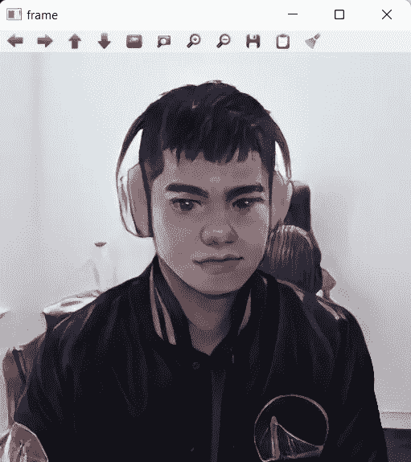
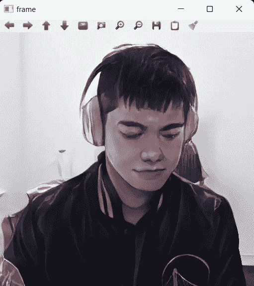
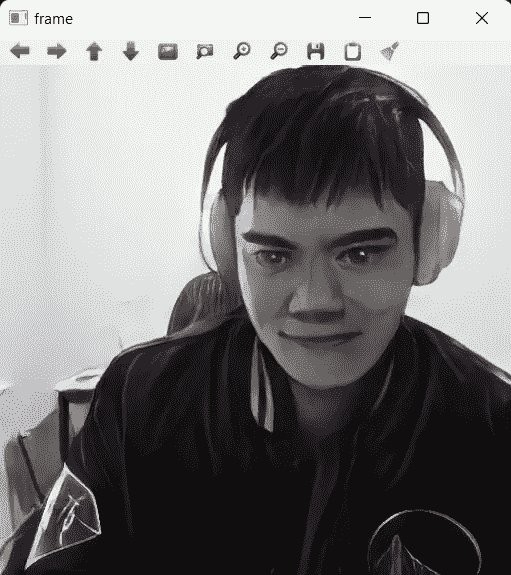
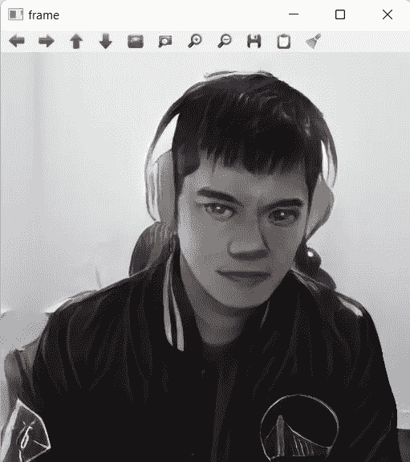
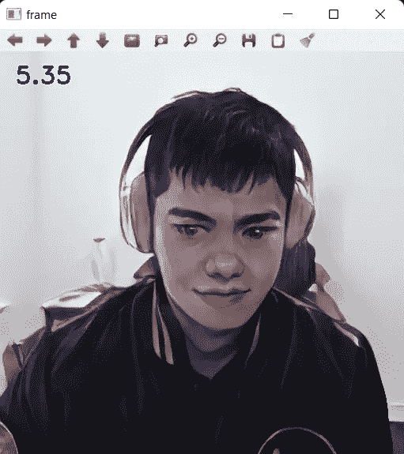
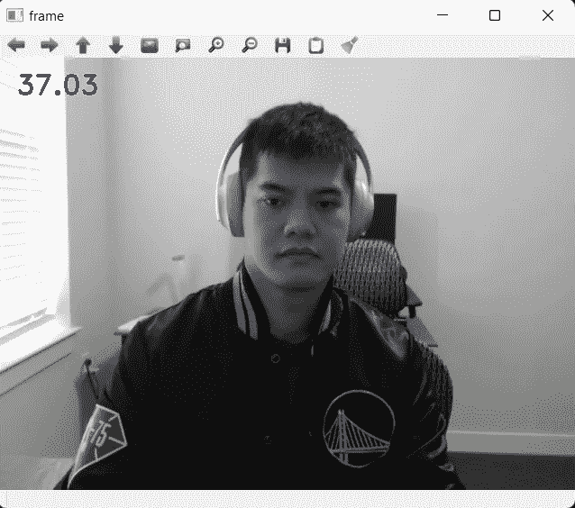

# 在五分钟内将你的网络摄像头变成动画

> 原文：<https://towardsdatascience.com/turn-your-webcam-into-anime-in-five-minutes-6e547b94d45>

## 一个简单有趣的项目的一步一步的教程


Ryan Yao 在 Unsplash 上拍摄的照片

一个关于如何从你的网络摄像头捕捉实时视频并将其转换为动画风格的快速教程。我还将讨论如何为我们的网络摄像头创建一些其他自定义过滤器，以及它们各自的利弊。

本教程不需要任何机器学习知识。

> 以下所有代码片段和图片均由作者制作。在适用的情况下，代码段中引用了代码参考。

# 概观

我们将回顾以下步骤:

*   从你的网络摄像头捕捉输出(使用 CV2)
*   转换输出(使用 PyTorch)
*   显示或保存图像(使用 CV2)
*   讨论其他过滤器和权衡

如果您想跳过教程并快速获得结果:

*   下载下面名为`animeme.py`的代码片段
*   打开终端，导航到该文件的文件夹
*   运行`python animeme.py`

# 履行

**依赖关系:**

需要以下软件包:

对于我的设置，我有:

```
pytorch==1.11.0
opencv==4.5.5
pillow==9.1.1
numpy==1.22.4
python==3.9.12
```

我使用用于 Windows 的 [Anaconda](https://www.anaconda.com/products/distribution) 来管理和安装所有依赖项。

**拍摄输入图像:**

首先，让我们确保您的网络摄像头被检测到，并找到适当的端口号。通常，内置网络摄像头会使用端口 0，但如果您有外置摄像头，它可能会使用不同的端口。

我使用两台摄像机，所以这个脚本返回两个端口:

```
>>> camera_indexes
[0, 1]
```

现在我们可以开始捕捉摄像机输出:

这将为您提供摄像机输出的实时反馈。要关闭，按`q`。


网络摄像头直播

**转换输出图像**

用这条线

```
_, frame = cam.read(), 
```

`frame`现在是来自您相机的输入。在用`cv2.imshow()`显示它之前，我们将在这里应用我们的变换。

为了将我们的图像转换成动画，我将使用 [AnimeGANv2](https://github.com/TachibanaYoshino/AnimeGANv2) 的 [PyTorch 实现](https://github.com/bryandlee/animegan2-pytorch)。这个回购的模型带有预先训练的重量和易于遵循的指示。

一些重要的细节:

*   `cam.read()`返回 BGR 格式的 Numpy 数组，而 AnimeGANv2 需要 RGB 类型的图像，`cv2.imshow()`需要 BGR。因此，我们必须做一些图像预处理和后处理。
*   AnimeGANv2 有四种不同的预训练风格。你可以实验一下，看看你最喜欢哪一个。
*   如果可能，我们应该在 GPU 上运行 Pytorch 模型，以最大化推理速度。

整个过程是:

```
-> input frame BGR from cam.read()
-> convert to RGB 
-> apply model(preferrably on GPU) 
-> convert to BGR 
-> display with cv2.imshow()
```

将所有这些放在一起:

这是结果:



动漫里的直播提要

# 超越动漫

输入帧的动画样式不是我们唯一的选择。在这一步，我们还可以做许多其他的转换:

```
-> apply model(preferrably on GPU)
```

例如，您可以将图像转换为灰度:

得到


灰度实时馈送

或者甚至结合这两个步骤:

我们的漫画现在是黑白的:



灰度动画中的实时提要

一些转换是免费的[这里](https://pytorch.org/vision/0.9/transforms.html)。或者您可以自己编写一个自定义的图像转换。

# 权衡取舍

你可能会注意到你的网络摄像头的动画版本要慢得多。我们可以添加以下代码片段来衡量模型的性能:

以下是显示 FPS 的输出:



**为什么动漫版慢了这么多？**

*   对于每一帧，我们必须向前运行一次 AnimeGANv2。这一步的推断时间明显拖慢了整个过程。
*   使用默认的网络摄像头输出，我们可以达到 37–40 fps，或 25 毫秒/帧。
*   使用灰度滤镜，它可以降低到 36–38 fps，大约 27 毫秒/帧。
*   有了 AnimeGANv2，我们降到了 5FPS，或 200 ms/帧。
*   对于任何自定义过滤器，如果我们使用大模型进行图像处理，我们将不得不牺牲一些性能。

**优化**

*   为了提高推理速度，我们可以优化模型运行时间。一些常见的技术是在 FP16 中运行模型或将模型量化到 INT8。
*   这些都是相当复杂的技术，不在本文讨论范围之内。
*   我们可以减小网络摄像头输入的大小。但是你的直播也会变小。
*   我们可以买一个更强的 GPU(我目前有一个 GTX 3070 用于我的设置)。

最后重要的一点是:

> 通常情况下，一本漫画书会有彩色封面和灰度内容，因为黑白印刷更便宜。但在我们的设置中，彩色帧实际上生产起来更便宜，因为我们不必转换成灰度，然后再转换回来。

# 结论

这是一个关于如何捕捉你的网络摄像头的输出，并将其转换为动画风格，或其他过滤器的快速教程。

我觉得这个项目很有趣，也很容易实施。即使你之前没有机器学习或计算机视觉的经验，你也会看到利用最先进的深度学习模型来创造一些令人着迷的东西是多么容易。

希望你会喜欢跟随本教程，并能够创造一些难忘的时刻！

# 资源

animegan v2:[https://github.com/TachibanaYoshino/AnimeGANv2](https://github.com/TachibanaYoshino/AnimeGANv2)

AnimeGANv2，PyTorch 实现:[https://github.com/bryandlee/animegan2-pytorch](https://github.com/bryandlee/animegan2-pytorch)

使用 OpenCV 捕获网络摄像头视频:[https://www . geeks forgeeks . org/python-OpenCV-capture-video-from-camera/](https://www.geeksforgeeks.org/python-opencv-capture-video-from-camera/)

火炬视觉改造:【https://pytorch.org/vision/0.9/transforms.html 

如果你愿意支持 Thu，你可以考虑注册成为一名中等会员。每月支付 5 美元，你就可以无限制地阅读媒体上的故事。如果你使用他的推荐链接，Thu 也会得到一小笔佣金。

[](https://medium.com/@tdinh15/membership) 