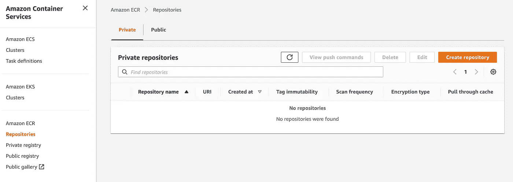
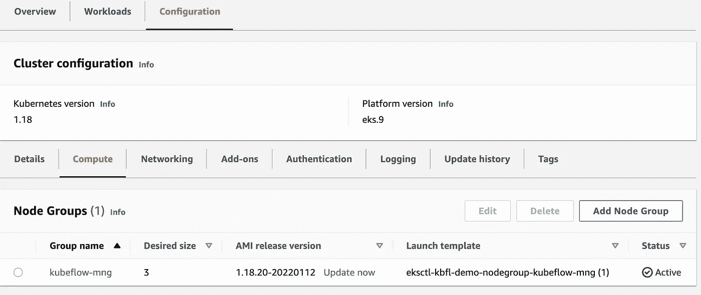
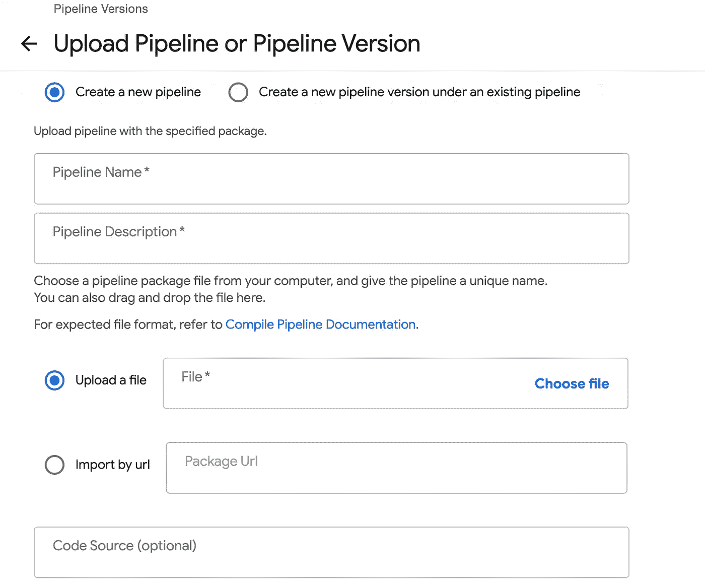
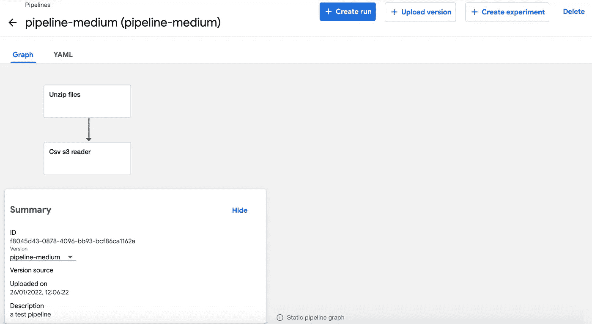
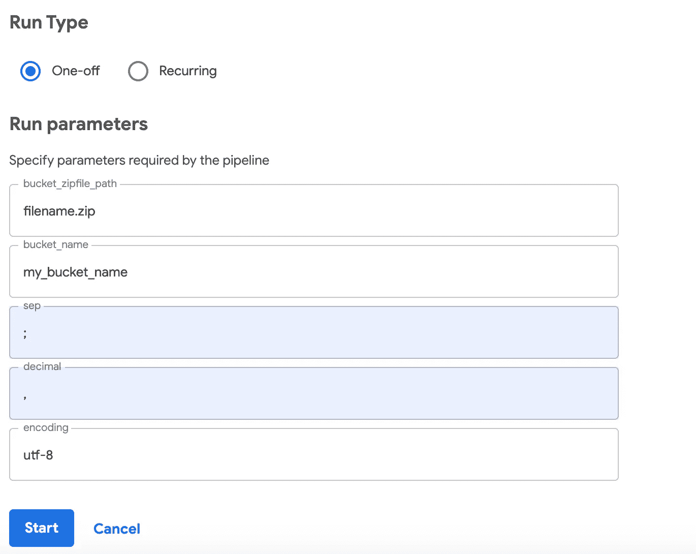

# 教程—从零开始的基本 Kubeflow 管道

> 原文：<https://towardsdatascience.com/tutorial-basic-kubeflow-pipeline-from-scratch-5f0350dc1905>


来源:Hanna Morris 在 [Unsplash](https://unsplash.com?utm_source=medium&utm_medium=referral) 上拍摄的照片

Kubeflow 是一个机器学习工具包，便于在 Kubernetes 上部署机器学习项目。尽管最近，Kubeflow 越来越多地出现在科技公司的堆栈中，由于项目档案的稀缺，新手开始使用它可能会非常困难。

即使 Kubeflow 的文档远不缺乏，但当您从头创建机器学习管道时，有一只援助之手总是有帮助的。我会尽我所能成为那只援助之手。

在本指南中，我们将介绍建立一个正常运行的管道所需的每一个步骤。您将学习如何:

*   创建一个 Kuberneter 集群
*   安装 Kubeflow
*   创建容器注册表
*   构建一个容器映像，并将其推送到您的注册表中
*   让 Kubeflow 访问您的 S3 桶
*   用输入和输出工件创建 Kubeflow 组件
*   创建一个 Kubeflow 管道，上传并运行它

# AWS —弹性 Kubernetes 服务

在这里，我将重点关注使用 [AWS EKS](https://aws.amazon.com/eks/) 从零开始创建一个管道，这是一个创建 Kubernetes 集群的服务，就像[谷歌的 GKE](https://cloud.google.com/kubernetes-engine) 。

# 创建一个 EKS 集群并安装 Kubeflow

虽然您可以通过在搜索栏上键入“EKS”并选择“弹性 Kubernetes 服务”**来从 AWS 管理控制台创建 EKS 集群，但我强烈建议您遵循本** [**Kubeflow 指南**](https://www.kubeflow.org/docs/distributions/aws/deploy/install-kubeflow/) ，其中包括集群创建步骤，直接从您的计算机终端的命令行完成。遵循这一点将确保您的集群具有正确的设置，以便稍后安装 Kubeflow。

确保不要错过以下先决条件:

*   安装 [kubectl](https://kubernetes.io/docs/tasks/tools/install-kubectl/#install-kubectl)
*   安装 [AWS 命令行界面](https://docs.aws.amazon.com/cli/latest/userguide/cli-chap-install.html) (CLI)
*   通过运行以下命令配置 AWS CLI:`aws configure`。
*   输入您的访问密钥([访问密钥 ID 和秘密访问密钥](https://docs.aws.amazon.com/general/latest/gr/aws-sec-cred-types.html#access-keys-and-secret-access-keys))。
*   输入您的首选 AWS 区域和默认输出选项。
*   安装 [eksctl](https://github.com/weaveworks/eksctl) 和 [aws-iam 认证器](https://docs.aws.amazon.com/eks/latest/userguide/install-aws-iam-authenticator.html)。

请不要犹豫更改您的 AWS 区域(如“eu-west-1”)并选择更强大的 EC2 实例。我个人选择的是 p2.xlarge 实例。
例如，我的配置是:

```
export AWS_CLUSTER_NAME**=**kubeflow-demo
export AWS_REGION**=**eu-west-1
export K8S_VERSION**=**1.18
export EC2_INSTANCE_TYPE**=**p2.xlarge
```

截至 2022 年 1 月，Kubeflow 无法在最新版本的 Kubernetes 上正确安装。**我强烈建议保持 K8S_VERSION 为 1.18。**

如果您已经按照指南阅读了“访问 Kubeflow central dashboard”一章，那么命令`kubectl get ingress -n istio-system`应该会返回一个如下所示的地址:
`123-istiosystem-istio-2af2-4567.us-west-2.elb.amazonaws.com`
将这个地址复制并粘贴到您的浏览器中。如指南中所述，如果您正在使用基本身份验证，则凭证是您在配置文件中指定的凭证，或者是默认凭证(`admin@kubeflow.org` : `12341234`)。

您现在应该可以访问您的 Kubeflow 中央仪表盘:


Kubeflow 中央仪表盘。作者图片

# 创建容器注册表

使用 Kubernetes 意味着使用容器图像，所以让我们离开仪表板，创建一个容器注册中心。

回到你的 AWS 管理控制台，在搜索栏中输入“ECR”并点击“弹性容器注册”。从那里，选择左侧栏上的“存储库”，然后单击“创建存储库”。



ECR 菜单。作者图片

创建后，一个新的存储库将出现在您的菜单上。请注意，它有一个类似这样的 URI:
`<ID>.dkr.ecr.<REGION>.amazonaws.com/<REGISTRY_NAME>`
其中< ID >是您的帐户 ID，< REGION >是您的注册表所在的区域(例如 eu-west-1)，而< REGITSTRY_NAME >是您在创建注册表时给它起的名字。

每个存储库都有一个 URI，你放在上面的每个图像也是如此。这是我们在本文后面研究组件创建时需要的链接。

# 检查您的集群的工作节点是否可以访问 ECR

在 AWS 管理控制台上转到 EKS，选择“集群”。单击您之前创建的群集，转到“配置”选项卡，然后转到“计算”子选项卡:



您应该会看到这样的节点组。作者图片

单击您的节点组，在“详细信息”选项卡上，单击“节点 IAM 角色 ARN”。这将打开节点的 IAM 管理控制台。请确保附加了“amazonec 2 containerregistryreadonly”策略。如果没有，请单击“附加策略”进行添加:


作者图片

# 安装 Docker

如果您已经安装了 Docker，请转到下一部分。如果没有，进入 [Docker 主页，安装 Docker 桌面](https://docs.docker.com/desktop/)。

在 Linux 或 Mac 上，最简单的方法是在终端上键入命令
`brew install Docker`。

# 创建一个容器

在您的计算机上，创建一个文件夹，您将在该文件夹中工作。如果你想对你的作品进行版本控制，它可以是一个 GitHub 存储库文件夹。

创建一个文件，命名为“Dockerfile”。在 linux 和 mac 上，您可以为此键入`touch Dockerfile`命令。用任何你想要的 IDE 打开它，甚至是记事本(Windows)或文本编辑(Mac)。

在 docker 文件中，我们将声明一个父映像(这里我将使用 ubuntu:20.04)，安装 pip，然后安装一些运行脚本所需的包。我们的 docker 文件将如下所示:

```
FROM ubuntu:20.04
RUN set -xe \
 && apt-get update -y \
 && apt-get install -y python3-pip \
 && apt install -y python-is-python3
RUN pip3 — no-cache-dir install numpy scikit-learn pandas boto3
```

现在用这个命令构建一个图像，并把<image_name>改成你想给图像起的任何名字。不要忘记结尾的点！</image_name>

```
docker build -t <image_name> .
```

# 将您的映像推送到您的容器注册表中

检索一个认证令牌，并向您的注册表认证您的 Docker 客户端。使用 AWS CLI:

```
aws ecr-public get-login-password --region <REGION>| docker login --username AWS --password-stdin <ECR_URI>
```

将<region>更改为您的存储库的区域(例如 eu-west-1)，并且<ecr_uri>应该是这样的:
`<ACCOUNT_ID>.dkr.ecr.<REGION>.amazonaws.com`用于私有注册中心，
`public.ecr.aws/<REGISTRY_ID>/`用于公共注册中心</ecr_uri></region>

然后，标记您的映像，以便您可以将映像推送到此存储库:

```
docker tag <image_name>:latest <ECR_URI>/<REGISTRY_NAME>:latest
```

运行以下命令将该映像推送到新创建的 AWS 存储库:

```
docker push <ECR_URI>/<REGISTRY_NAME>:latest
```

如果您有任何问题，您可以通过点击“查看推送命令”在注册表的菜单上获得所有命令


作者图片

# 在 S3 上设置测试数据集

我们的基本管道将从从 S3 下载压缩数据集开始。
我们将使用这个 [kaggle 数据集](https://www.kaggle.com/olistbr/brazilian-ecommerce)作为例子，但是任何压缩的 csv 文件都可以。

在 AWS 管理控制台上，在搜索栏上键入“S3”以访问该服务，然后单击“创建存储桶”。一旦创建，点击你的桶，上传你的 zip 文件。

# 让库伯弗洛进入 S3

回到你的 Kubeflow 中央仪表盘，点击“笔记本服务器”，然后点击“新服务器”。这可能需要几分钟时间。

创建完成后，单击“Connect”打开 Jupyterlab 并打开一个终端实例。
键入`aws configure`并键入您在步骤 1 的先决条件中所做的凭证，以便从您的 Kubeflow 实例登录到 aws。这将使您能够从脚本中访问 S3 存储桶。

# 测试你是否可以访问 S3

在 Jupyterlab 上，打开一个新笔记本。

在这个代码片段中，<bucket_name>是您的存储桶的名称。
如果您运行此单元格，您应该会看到您的 zip 文件，以及任何其他子文件夹中的任何其他文件。如果您想要浏览特定的子文件夹，请将第三行更改为:
`contents = conn.list_objects(Bucket=<bucket_name>,
Prefix=<subfolder_name>)['Contents']`</bucket_name>

# 创建 Kubeflow 管道

我们将做一个简单的管道，从我们的 S3 桶中下载我们的 zip 文件，将解压后的 csv 文件上传到桶中，并读取其中一个包含熊猫的数据集

## 第一步。创建 python 函数

我们将创建解压缩函数:

然后是阅读器功能:

在我们的管道中，“csv_s3_reader()”的“csv_path”参数将是“unzip_func()”的输出字符串。
您现在可以测试您的功能是否正常。

## 第二步。将 python 函数重新格式化为组件函数

为了让 Kubeflow 能够理解它们，我们将这些函数重写如下:

如您所见，您需要为函数声明每个参数的类型。由于 Kubeflow 管道处理工件，而不是返回一个对象，我们的行为就像我们在磁盘上写它一样，只是我们给出的不是路径，而是一个 comp。输出路径()对象。

例如，如果你想写一个熊猫数据帧到你的计算机上，你应该写`df.to_csv(path_name)`。在 Kubeflow 中，这变成了`df.to_csv(output_path_object)`，其中`output_path_object`在函数的参数中定义为`comp.OutputPath(‘CSV')`。

您可以用同样的方式处理 Kubeflow 输入，方法是读取`comp.InputPath()`对象，就好像它们是写在您的磁盘上一样。

您可能已经注意到这些函数内部有导入，我们在讨论组件时很快就会谈到这一点。

## 第三步。将功能转换为组件

您可以用`kfp.components.create_components_from_func`从一个函数创建一个组件，我们将向它传递两个参数:要转换的函数和调用组件时应该运行的基本映像:

这就是为什么一些包被导入到函数中的原因。例如，`boto3`并不像`kfp`那样安装在 Kubeflow 的环境中。所以过早导入会返回错误；它应该被导入到函数中，因为它将在安装了`boto3`的容器映像上运行。

## 第四步。创建管道

管道描述了要调用的一系列组件和传递它们的参数。它采用一个带有`kfp.dsl.pipeline()`
装饰器的函数的形式。

## 第五步。完整管道

整个管道应该是这样的。复制并粘贴到 Jupyter 笔记本单元格中，不要忘记根据您的桶名和容器图像更改某些行 URIs:

`%%writefile ./test_pipeline.py`行意味着运行该单元会将该脚本保存为您当前目录中的 test_pipeline.py。

然后，使用 jupyter 笔记本上的以下命令将 python 管道转换为 YAML:

```
%%sh
dsl-compile --py test_pipeline.py --output test_pipeline.yaml
```

# 上传管道至库贝弗洛

在库贝弗洛的中央仪表板上，转到“管道”并单击“上传管道”



管道创建菜单。作者图片

给你的管道一个名称和一个描述，选择“上传一个文件”，并上传你新创建的 YAML 文件。点击“创建”。您应该在管道列表中看到您的管道。选择它，您将看到如下图:



管道摘要。作者图片

# 运行管道

点击“创建运行”。您将需要选择或创建一个实验来运行您的管道。您还需要指定管道的参数，这些参数是您在`unzip_and_read_pipeline`函数中定义的。

**请注意，字符串参数的指定必须不带引号**。`my_bucket_name`将被正确处理，而`'my_bucket_name'`不会！



启动菜单。作者图片

开始你的实验。

如果一切顺利，运行成功，您将看到结果屏幕:


实验总结。作者图片

如果您点击任何任务，您将能够看到它的日志、输入参数以及输入和输出工件。

这里，第二个任务不是很有用，但是您可以添加一些数据预处理说明来返回一个清理过的 csv 文件。

就在那里！一个基本的库贝弗洛管道！

通常，您希望避免将所有的功能都写在 jupyter 笔记本中，而是将它们放在 GitHub 存储库中。

GitHub Actions 允许您构建一个容器映像并将其推送到 ECR，ECR 包含您的所有脚本，您可以在以后构建管道时导入这些脚本。