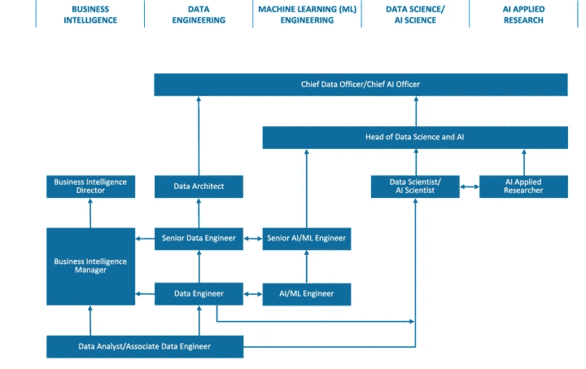

# 十二个人力资源就绪的角色，帮助建立健康的数据科学和人工智能团队

> 原文：<https://towardsdatascience.com/twelve-hr-ready-roles-to-help-build-healthy-data-science-and-ai-teams-cbb6660f87b8>

## 数据科学功能障碍

## 把那些数据科学维恩图收起来。是的，全部 13 个。

Artem Podrez 的照片

从 2021 年开始的持续的[大辞职](https://en.wikipedia.org/wiki/Great_Resignation)，而[聚集蒸汽](https://www.theatlantic.com/ideas/archive/2021/10/great-resignation-accelerating/620382/)和[有可信的数据](https://www.weforum.org/agenda/2021/12/great-resignation-us-american-workers-jobs-quitting-quit/#:~:text=A%20record%204.4%20million%20Americans,highs%20for%20six%20straight%20months.)，[在数据科学](https://medium.com/swlh/why-so-many-data-scientists-quit-good-jobs-at-great-companies-429ea61fb566)中并不新鲜。

今天不是对人们为什么辞职进行解释的时候。(我们做到了这一点，并且[勇敢地发表了我们的想法](https://www.pdpc.gov.sg/-/media/files/pdpc/pdf-files/resource-for-organisation/ai/sgaigovusecases.ashx)关于我们认为如何通过同理心和治理来做到这一点)。相反，今天我想关注功能失调的数据科学团队的一个关键驱动因素— [管理层错误地设定数据科学家应该做什么和不应该做什么](https://www.quora.com/Is-long-term-burnout-as-a-data-scientist-common/answer/Jason-T-Widjaja)。

这种特殊的功能障碍会导致多种故障模式，包括:

*   数据科学家和分析师被迫构建全栈应用，而不是与软件工程合作(事实上*在软件工程中扮演多重角色*)。
*   数据科学家负责数据管理、报告和构建仪表板(而不是与专业的数据工程和商业智能团队合作)。
*   一旦项目完成，人工智能研究人员就会花费越来越多的时间来部署和监控模型(这更接近于机器学习工程师和 MLOps 团队的工作，而不是研究人员)。
*   数据科学与人工智能混为一谈(人工智能*方法*可用于洞察，人工智能本身是一个不同的学科，有不同的侧重点)。

这并不是说您需要雇佣四个团队来从关系数据库中建模一个表。所有的数据团队都是从某个地方开始的，在小公司里，多任务处理是绝对必要的。

这也不是说数据科学家没有能力完成这些任务。成长的心态是很好的，所有的角色都从理解相邻团队的工作中受益。但是仅仅因为*一些*数据科学家*能够*完成任务并不意味着*应该*作为一般规则成为核心数据科学职责的一部分。

数据科学家经常延伸并扮演多重角色，做任何必要的事情来整合事物。但这本身就是一种失败的模式——因为讽刺的是，这导致管理层认为事情运转良好，所以他们需要的只是……更多的数据科学家。从而使功能障碍永久化。

那么，我们如何避免这种情况呢？

更好、更精确的职称。

这符合候选人的期望，节省招聘经理的时间，甚至可能让你的公司免于成为[数据科学工作诱饵和交换线索](https://www.reddit.com/r/datascience/comments/q658kq/feel_disappointed_about_my_new_data_science_job/)的对象。

但在我们走得太远之前，我们需要谈谈数据科学维恩图。

## 超越数据科学维恩图

> 当有人提到数据科学维恩图时，一个合理的问题应该是“哪一个”？

根据最近的统计，至少有 [13 张数据科学维恩图](https://www.kdnuggets.com/2016/10/battle-data-science-venn-diagrams.html)，它们是由[德鲁·康威](http://drewconway.com/)的原作演变而来。(非常感谢 [KDNuggets](https://www.kdnuggets.com/) 汇总了这份名单。)

我非常尊重德鲁·康威分享他的想法——很容易指出有些事情对我来说并不完全正确，却忘记了分享想法之前的世界状态。他最初的想法是一个伟大的里程碑，值得借鉴，今天仍然适用。

但是这个领域已经成熟，我们需要解决的问题不仅仅是理解数据科学家的角色，还要同等关注补充数据科学的其他数据角色。并意识到这些职业本身就是既定的平等职业。

## 来自世界上人工智能准备最充分的城市的数据科学职业道路

几年前，我和我的数据和人工智能团队领导一起尝试解决这个问题。意外的是，从一个小团队开始的努力最终将我们带入了新加坡的国家角色定义活动，我们中的许多人都在那里工作。我们的工作最终扩展到定义十二个数据、分析、数据科学和人工智能角色。

这些在下面的框架中公布。

 [## 信息和通信技术技能框架

### 编辑描述

www.imda.gov.sg](https://www.imda.gov.sg/cwp/assets/imtalent/skills-framework-for-ict/index.html) 

重要的是，**目标是装备公司来建立数据和人工智能团队**。因此，这些角色都是人力资源就绪型的，您会发现以下全套服务:

1.  角色描述，
2.  技术技能和软技能的分类法，
3.  每个角色的每项技能的校准水平，以及
4.  每个技能级别的定义。

在同一时期，我很受鼓舞地听说[新加坡作为人工智能中心的增长轨迹](https://www.scmp.com/week-asia/business/article/2116290/why-tech-giants-see-singapore-next-artificial-intelligence-hub)获得了由[奥纬论坛](https://www.oliverwyman.com/media-center/2019/sep/cities-need-to-prepare-now-for-disruption-from-artificial-intell.html)、[牛津洞察和国际发展研究中心](https://www.oxfordinsights.com/ai-readiness2019)以及 [IMD](https://www.imd.org/news/updates/data-shows-effects-of-covid-and-climate-change-on-citizens-perceptions-of-how-smart-their-cities-are/) 颁发的三个奖项，该城市目前被评为世界上人工智能准备最充分的城市。(作为一名数据科学家，我一直对排名的内部运作方式感到好奇，所以我做了一些深入研究，通过斯坦福大学海(Stanford HAI)的全球人工智能活力工具发现，新加坡的成功很可能是以人均为基础计算的。)

不考虑奖项，该框架实际上是有用的，现在代表了数据和人工智能专业人员职业道路的最新来源之一。

## 数据和人工智能职业的技能框架

五个职业系列中的十二个数据和人工智能角色

## 数据和人工智能中有 12 个不同的角色

下面列出了这些不同的角色。他们分为五个角色“家族”，y 轴大致表示家族中的资历*:*

*   数据分析师/助理数据工程师
*   商业智能经理
*   商业情报总监
*   数据工程师
*   高级数据工程师
*   数据架构师
*   人工智能/机器学习工程师
*   高级人工智能/机器学习工程师
*   数据科学家/人工智能科学家
*   人工智能应用研究员
*   数据科学和人工智能主管
*   首席数据官/首席人工智能官

与其重复网站上的内容，一个更有用的框架可能是拍摄一个数据和人工智能职业新人的镜头。

> 我们希望帮助数据、分析和人工智能领域的新进入者回答这个问题:我最适合从事哪种数据角色？

为了回答这个问题，我提出了四个具体的数据分割:

帮助你找到合适角色的四个问题

## 商业智能是一个既定的领域，有自己的职业道路。

商业智能(“BI”)是一个成熟的领域，与数据科学有许多重叠。它包括确定业务需求，准备和分析数据，并提出见解。然而，仅仅这些并不意味着它应该被归入数据科学。

BI 需要一系列技能，这些技能既要贴近客户，又要贴近数据，还要贴近所选择的产品或平台。这些技能包括数据分析、数据工程、数据治理、数据可视化和利益相关方参与——完整列表可通过[技能框架网站此处的](https://www.imda.gov.sg/cwp/assets/imtalent/skills-framework-for-ict/index.html)获得。

同样重要的是缺少了什么——虽然 BI 的进步意味着许多现代 BI 工具现在提供了一些预测能力，但建模的责任不在他们的*所需的*技能集上。

一个特别有趣的特点是，我们调查的每个 BI 团队都是如何围绕少量商业 BI 工具构建他们的实践的。

BI 是其独特的职业道路，即使是现在，BI 专业人员和工作也经常超过数据科学，这可能会让一些数据科学家感到惊讶。

## 在工作中提供最多信息的问题通常是关于你是否生产 ***洞察力*** 或产品。

如果我在面试一份工作，并且只能问一个问题来获得关于数据科学角色的信息，我不会问这份工作是否需要深度学习，在 devops 环境中工作，或者需要因果关系的知识。

> 向我提供关于您的数据科学角色的最多信息的一个问题是:“您的产出主要是见解还是产品？”

或者换一种稍微不同的方式问，你的角色的产出主要被人类消耗，还是被机器消耗？

在某种程度上，答案是“洞察力”，你倾向于框架的右边，可能更像“科学家”而不是“工程师”。这是你加倍理解你的*业务问题*领域的地方，需要仔细的推理技巧和渠道沟通技巧来帮助你的利益相关者做同样的事情。你也可以从尽可能靠近你试图支持的决策者的位置上获益。

相反，当答案是“产品”时，你会偏向左边，偏向“工程师”的角色。你可能会“更接近 IT”，从对应用程序开发和集成的理解中受益匪浅，并且可能会在敏捷产品或交付团队中工作。

## **有些特定的职位要求博士学位。但是他们相对来说是少之又少。**

第三个问题是我与毕业生交谈时经常遇到的一个问题——一个人是否需要博士学位才能成为数据科学家。最近几年，这种观点略微转向了“拥有博士学位会对我的职业生涯有帮助吗？”

虽然你的具体情况是最重要的，但值得一提的是，有一些特定的角色会从博士学位中受益匪浅。这些往往在机器学习或者人工智能的某个特定子领域(比如图像处理或者 NLP)。

这些属于人工智能应用研究人员的角色，通常以他们工作的 R&D 性质为标志，将发表论文作为他们工作范围的一部分，以及产生可申请专利的人工智能解决方案的能力。

**初级申请人应该知道分析师角色有多重含义。**

如果你只是转行做数据，而你的录用通知书上写着“数据分析师”，这可能是一个没有用的词。).

这是因为“数据分析师”的角色被用于多个不同的工作类别，根据角色所在的类别，您的体验会有很大的不同。

对数据分析师的一种解释是*为洞察*分析数据，另一种解释是*为工程*分析数据。

更复杂的是，**都使用了术语建模**。但当数据科学家提到建模时，它通常意味着将曲线拟合到分布，并为预测或推理任务构建数据的表示。但是当一个数据工程师提到建模时，这种用法与数据结构和模式有关，以存储、管理和执行数据操作。

无论你发现自己处于哪种变化中，都要知道自己是谁，我相信你会成为一名模范员工(抱歉)。

**结束语:打造你最好的团队！**

从数据科学家到经理、总监及其他职位，需要为扩展团队中的新角色和角色制定新的路线图。我们这样做是为了让您不必这么做，所以您可以根据自己的需求随意利用和调整这个框架。如果您有问题、反馈或只是需要一个建立团队的共鸣板，请不要犹豫。

现在，如果你是一名经理，你刚刚雇佣了一名计量经济学家来“构建你的数据结构，这样你就可以在上面进行预测分析”，或者雇佣了一名“商业智能开发人员”来优化你的营销支出，因为“你想在仪表板上看到结果”，你可能需要再次阅读这篇文章。但是先去一个随机的森林里散散步。

*Jason 是一位研究人力资源和数据科学的数据科学家。我是以个人身份写这篇文章的，这并不代表我所工作或隶属的组织的观点。*