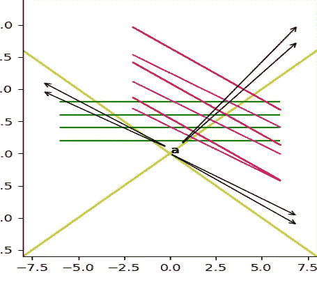
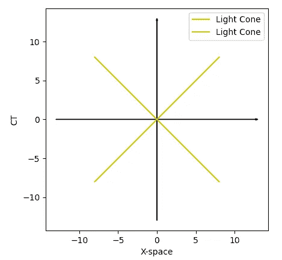
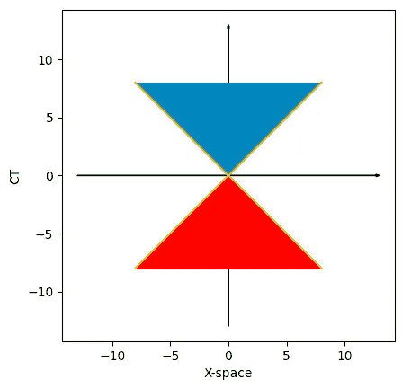
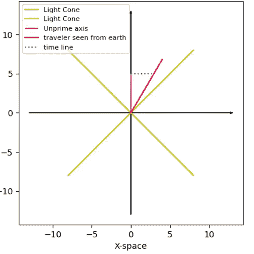
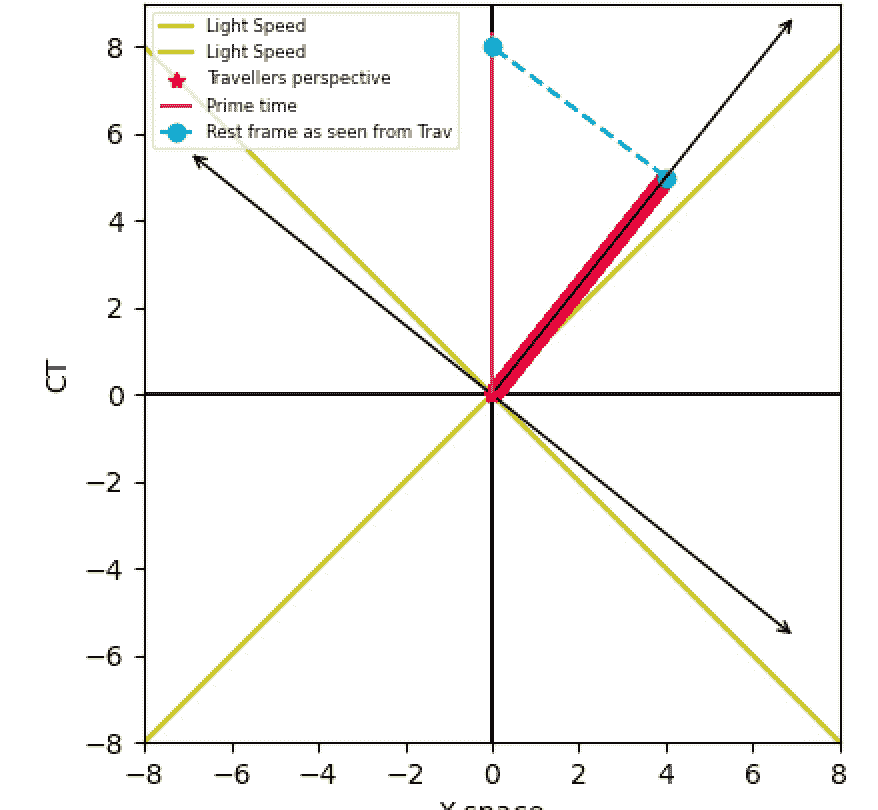
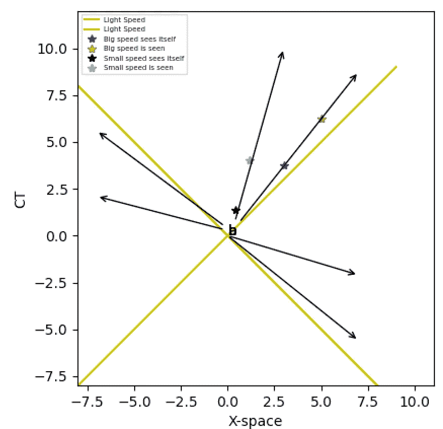
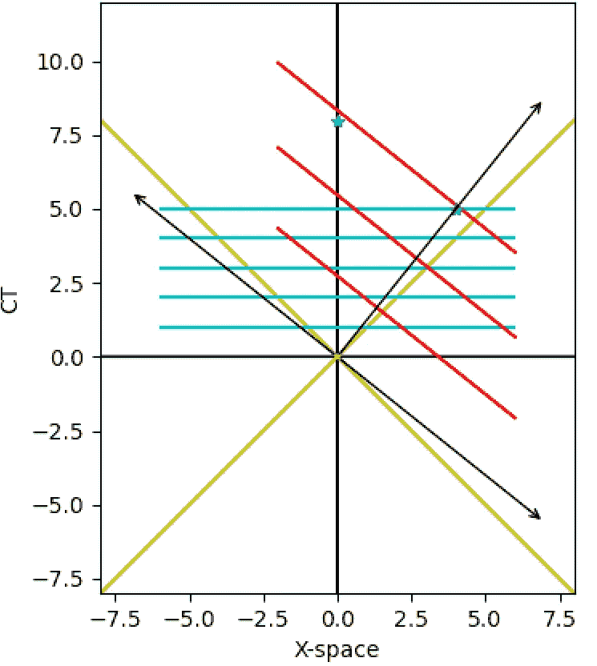
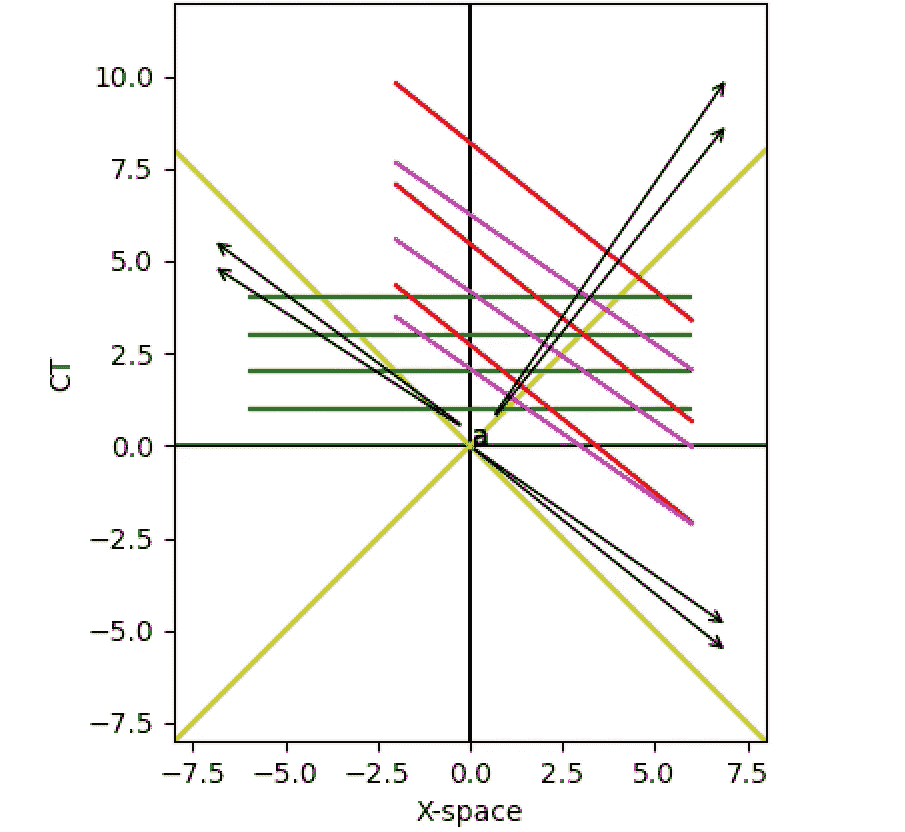

# 孪生悖论可视化

> 原文：<https://towardsdatascience.com/twin-paradox-visulazation-6455fafb7efc>

## 加速不是问题

作者

## 背景

狭义相对论不仅是一个神秘有趣的话题，激发了几乎每个人的好奇心，而且提供了一套数学工具，有时用于数据项目。数学对象，如闵可夫斯基空间，用于语音项目。因此，熟悉这个领域不仅在智力上引人入胜，而且可以提供数据科学的优点。

## **我为什么要告诉你这个**？

几天前，我在我们的走廊里听到两个员工之间关于 [**双胞胎**](https://en.wikipedia.org/wiki/Twin_paradox) [**悖论**](https://www.youtube.com/watch?v=GgvajuvSpF4) 的讨论(是的，我正在和受过良好教育、充满好奇心的淑女和公子哥儿一起工作)。在交谈中，一位与会者说“这不是一个悖论，因为旅行者在加速”。虽然我的大部分物理知识已经蒸发了，但我的脑海里还是响起了一个警报声。然而，当我开始谷歌“双胞胎悖论”时，我看到了大量旨在澄清悖论并关注加速的网站。事实上，加速有助于创造一个时间间隙，这听起来像是一个连贯的澄清……但这是**错误的**(对于不熟悉**孪生** **悖论**的读者，请等待下一节)**。随着我浏览更多的网站，我发现这些解释缺乏形象化。这篇文章旨在改进它，并提供一个更具体的解释。**

## 什么是孪生悖论？

1905 年，在他出版了特刊**[**相对论**](https://www.khanacademy.org/science/physics/special-relativity) 后不久，爱因斯坦写道**如果我们带着两个双胞胎，让其中一个以接近光速的速度旅行，而他的兄弟仍在休息，当旅行者旅行回来时，他会更年轻。**这句话是在接近相对论的著名“宣告”时给出的:“一切**都是相对的**”。如果是这样，那么旅行者看到自己在休息，而地球和休息的孪生兄弟在旅行，因此后者也必须更年轻:**一个悖论。****

**嗯，你可以猜到物理学很少允许悖论，爱因斯坦也很少出错。然而，当我们遇到一个大脑健康的人认为是悖论的话题时，它有一个智力上令人兴奋和冷静的解决方案是合理的。**

**在我们继续之前，我希望指出，我将避免在这篇文章中使用公式，但我建议读者熟悉一些概念:**

*   **[**伽马因子**](https://www.youtube.com/watch?v=qXxtqK7G4Uw)**
*   **[**洛伦兹**](https://en.wikipedia.org/wiki/Lorentz_transformation) [**变换**](https://www.khanacademy.org/science/physics/special-relativity/lorentz-transformation/v/introduction-to-the-lorentz-transformation)**——在 [**时空**](https://www.khanacademy.org/science/physics/special-relativity/minkowski-spacetime/v/introduction-to-special-relativity-and-minkowski-spacetime-diagrams) 中进行两个坐标系转换的方程****
*   ****[**时空间隔**](https://phys.libretexts.org/Courses/Skidmore_College/Introduction_to_General_Relativity/01%3A_Special_Relativity/1.02%3A_The_Spacetime_Interval) 。-时空间隔的长度。出于平凡的线性代数，这个区间的长度在坐标变换下是不变的。****
*   ****[**同时性**](https://en.wikipedia.org/wiki/Relativity_of_simultaneity) **-** 相对论中的一个概念表明一个观察者所观察到的两个同时发生的事件不会被另一个观察者所察觉****
*   ****[**时间**](https://www.phy.olemiss.edu/HEP/QuarkNet/time.html) **膨胀******

## ****时空****

****我们现在要介绍时空。为了简单起见，我们将假设 1D 空间，然而，很容易推断出整个规则也适用于 3D 空间。****

********

****作者-时空的基本图形****

****在上图中，我们看到了时空的普通形状。黄色斜线代表光速。x 轴代表空间(通常以光年为单位)，Y 轴是时间或者更准确的时间乘以光速 [**C**](https://en.wikipedia.org/wiki/Speed_of_light)****

****因为没有什么能比光速更快，物理事件只能发生在上半部分和下半部分，如下图所示:****

********

****作者:起源是他的存在(此时此地)。红色部分是过去发生的事件的领域，蓝色部分是现在和未来的事件的领域****

****为了继续讨论孪生佯谬，我们需要提出坐标系的概念。在狭义相对论中，我们总是考虑问题的不变性。对于孪生悖论，我们考虑**素数**和**素数系统******

******无质**指的是留在地球上不动的双胞胎。它也被称为**静止框架******

********

****作者****

****在该图中，洋红色垂直线代表静止帧。因为他假设自己是固定的，只有它的时钟向前变化。****

********

****作者****

****在该图中，我们添加了红色斜线，代表从静止框架视角**观察的旅行者(主系统**)**。**蓝色虚线代表休息的双胞胎观察旅行者的时间水平曲线。****

**既然我们讨论狭义相对论，我也将代表质数系统的观点**

****

**作者**

**这里我们看到红线作为我们的参照物:旅行者在空间中是固定的，只随时间变化。他观察到静止帧(洋红色)以固定的速度离开。青色虚线是根据旅行者坐标系的时间水平曲线。**

****关于悖论，什么是正确的？****

**正如我们上面所写的，一个高速旅行者手表里的时间比他旅途中的时间走得慢，因为时间是用静止坐标系来测量的。因为旅行者可以认为自己是一个静止的框架，所以我们得到了相反的结果。**

**在下面的部分，我们将分析这些现象，并提供一个客观的说明。在这项研究中，我们采用了维基百科的数据:假设一艘宇宙飞船在太空中以 0.8* **C** 的速度运动。当它到达地球时，它保持速度，并与地球上的人同步手表。现在它飞向一颗距离地球 4 光年的恒星。请注意，在我们研究的场景中，根本没有加速度！！。**

**让我们从两个角度来分析:**

****地球观察者****

****

**作者**

**我们将使用我们已经见过的符号:洋红色垂直线代表地球上的观察者，红线代表宇宙飞船旅行者。据地球上的那个家伙说，旅行者要花 5 年时间才能到达那颗恒星。根据他的手表，旅行者只需要 3 年。我们可以通过两种方法看到这一点:**

*   **简单地使用由青色虚线表示的**洛伦兹变换**。**
*   **使用时空间隔:根据地球上的家伙，路径长度是 3C(原点到(4，5))，因此根据旅行者，它一定也是 3C。但是旅行者假设他是固定的，因此它的空间坐标是 0。因此他经历了一个长度 3C 的路径，它只依赖于时间。也就是说，需要 3 年时间。**

****旅行者****

**我们可以用前面的图表来解释他的观点**

****

**作者**

**游客再次用红线表示。他假设自己没有移动，看到静止框架(地球上的家伙)以 0.8* **C** 的速度远离地球。地球佬在他的位置上站了五年:(0，5)。根据旅行者所说，地球上过去了多少时间？我们可以使用时空间隔或洛伦兹变换:根据地球，路径的长度是 5 **C** ，因此根据旅行者，路径的长度将是 5 **C** 。具体多少钱？看起来是 8 年零 4 个月，根据旅行者系统，它处于点(-20/3.25/3)，其长度正好是 5 **C** 。**

**我们可以总结为:**

****在每个系统中，观察者的手表比另一个系统中测量他的手表走得慢****

****

**作者**

**后面的图表显示了一般情况:我们有两个旅行者，一个速度很快，另一个速度很慢。我们可以看到，每个旅行者在他的手表上测量的时间比其他人测量的时间要短。**然而，我们看到测量值不相等:主绷绳在非主绷绳上测量的时间不等于非主绷绳在主绷绳上测量的时间****

**相对论是相对的但不是镜子！**

## **那解决办法是什么？**

**为了描述事物实际上是如何工作的，我们将观察下图**

****

**作者**

**在上图中，我们可以看到两个系统的时间线:静止帧(青色水平线)和旅行者(红色斜线)相对于相关系统，每两条相邻线之间的距离为 1。我们可以看到两个红色邻居之间的距离大于两个蓝色邻居之间的距离，这反映了旅行者的时钟走得更慢。此外，我们可以推断，随着速度的增加，时间会变慢，如下图所示**

****

**作者**

**这里我们添加了一个较慢的移动物体，用洋红色线条表示。**

**希望用数学方法验证这一点的读者只需摆弄洛伦兹方程就能得到这些线。**

## **总结和结论**

**在这篇文章中，我已经表明，与网络上的普遍观点相反，双胞胎之间的时间差距不是**加速的结果。此外，人们不需要熟悉“惯性”的概念就能理解这个概念。这仅仅是关于理解**时空**礼仪。****

## **确认**

**我要感谢伊琳娜·沙勒姆提出了这个问题的挑战，并迫使我进行连贯的思考。**

**剧情的代码可以在这里找到[。](https://github.com/natank1/Twin_paradox_v)**