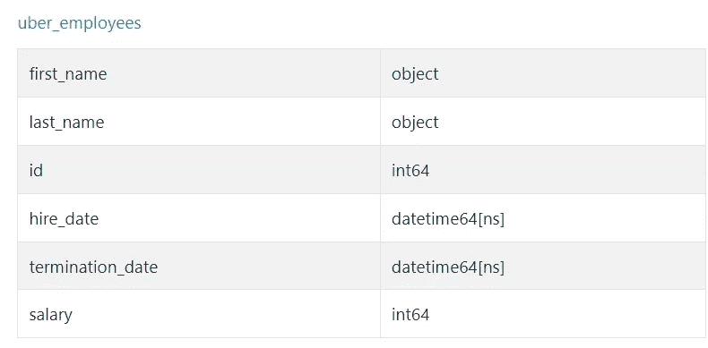
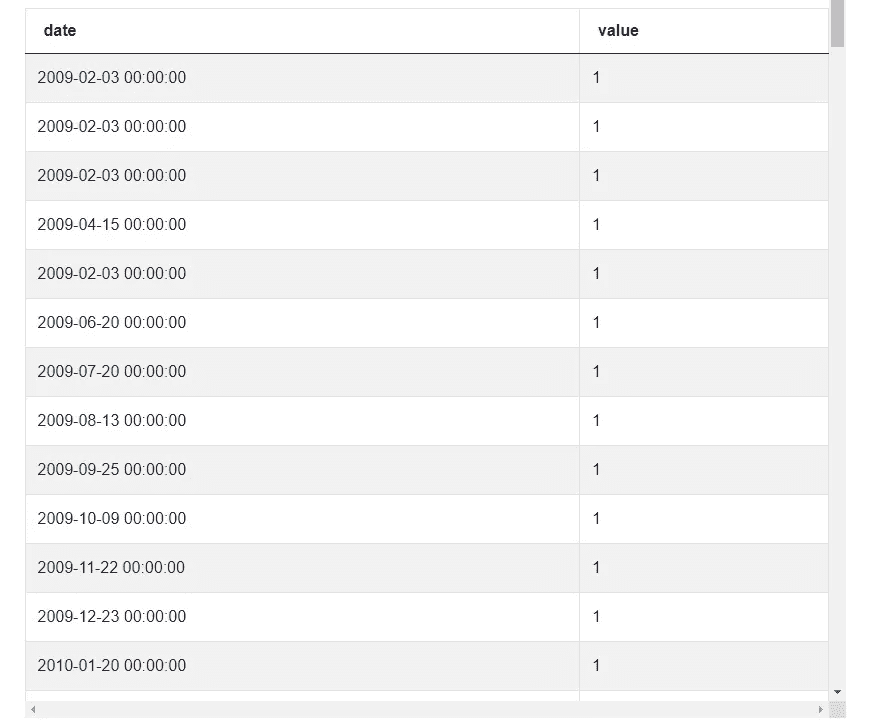
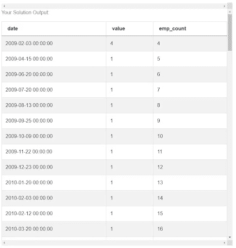
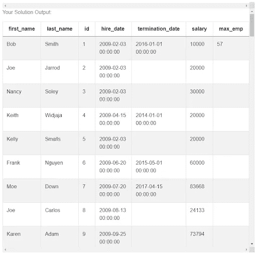
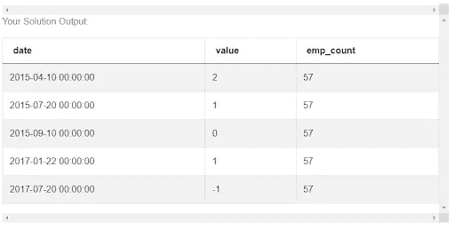
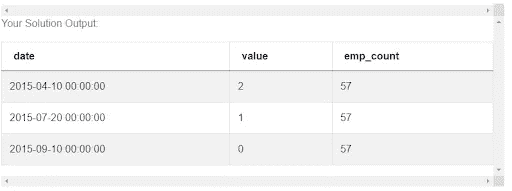

# 优步数据科学家面试问题演练

> 原文：<https://towardsdatascience.com/uber-data-scientist-interview-question-walkthrough-60b7ccdcb592>

# 优步数据科学家面试问题演练

## *在本帖中，我们将仔细研究一个来自优步的数据科学家面试难题，并向您展示一个 Python 解决方案*


作者在 [Canva](https://canva.com/) 上创建的图像

与当今的其他科技巨头相比，优步是一家相对年轻的公司。在 2009 年成立并于一年后推出拼车应用后，优步迅速开始成为出租车和出租车的替代品。今天，该公司的服务遍及全球 500 多个城市。

在其公司分支机构内，优步有一个专门的数据科学和分析部门，并进一步划分为专注于安全和保险、骑行、风险、政策、平台或营销的团队。这些团队不仅为关键的拼车应用服务，也为优步 Eats 等公司提供的一些新产品服务。该部门一直在寻找新的数据科学家和产品分析师，这些机会在全球多个地方都有。

在本帖中，我们将仔细研究优步数据科学家面试中的一个难题，并带您了解 Python 中的解决方案。事实证明，只要找到几个简单而聪明的步骤，这个优步数据科学家面试问题就变得更容易解决了。

# 优步数据科学家面试问题


截图来自 [StrataScratch](https://platform.stratascratch.com/coding/2046-maximum-number-of-employees-reached?python=1&utm_source=blog&utm_medium=click&utm_campaign=medium)

问题链接:[https://platform . stratascratch . com/coding/2046-maximum-number-of-employees-reached？python=1](https://platform.stratascratch.com/coding/2046-maximum-number-of-employees-reached?python=1&utm_source=blog&utm_medium=click&utm_campaign=medium)

这个优步数据科学家采访问题的标题是达到的最大员工数，我们被要求编写一个查询，返回曾经为该公司工作过的每个员工。然后，对于每个员工，我们应该计算在他们任职期间为公司工作的员工的最大数量以及达到该数量的第一个日期。员工的离职日期不应该被算作工作日。

该问题还指定输出应该包含员工 ID、在员工任职期间为公司工作的最大员工数量以及达到该数量的第一个日期。

这是优步数据科学家面试中最难的问题之一，因为它涉及到操纵日期，本质上是调查员工数量如何随时间变化。

为了尝试解决这个优步数据科学家面试问题，让我们坚持解决数据科学问题的一般框架。其思想是首先理解数据，然后通过编写几个可以引导我们找到解决方案的一般步骤来制定方法，最后，编写基于高级方法的代码。

# 了解您的数据

让我们先来看看为这个面试问题提供的数据。通常，在面试中你不会得到任何实际的记录，相反，你会看到有哪些表格或数据框，以及这些表格中有哪些列和数据类型。但是，在这里，我们可以预览一个数据可能是什么样子的例子。

在本例中，只有一个名为 uber_employees 的表，它看起来相当简单。表名和列名表明这是某个公司的雇员列表，每行对应一个雇员。对于他们中的每一个人，我们都有一个名，一个姓，一个 ID，我们可以看到这是一个整数。还有雇员受雇的日期和合同终止的日期，两者都是日期时间数据类型，还有雇员的工资。



截图来自 [StrataScratch](https://platform.stratascratch.com/coding/2046-maximum-number-of-employees-reached?python=1&utm_source=blog&utm_medium=click&utm_campaign=medium)

一开始可能不明显并且在问题中没有指定的一件事是，对于仍然在公司工作的雇员来说，termination_date 列的值是多少。我们可以对此做一个假设，例如，在这些情况下，termination_date 将为空或者将具有空值。这样的假设还会导致我们假设每次 termination_date 列为空或为空值时，对应的雇员今天仍在那里工作。

因为这个问题没有给出任何解释，所以我们可以在面试时做出这样的假设，并解决这个问题，只要我们把这些假设清楚地告诉面试官。分析数据的第一步正是我们应该做出和传达假设的时候。

# 制定方法

研究完数据后，下一步是制定解决优步数据科学家面试问题的高级步骤。我们的目标是当雇佣和终止日期发生变化时，将其转换为每个日期的员工总数。

1.  要实现这一点，第一步可能是列出来自“雇用日期”列的所有日期，并添加一个新列，其中每行的值为 1。这仅仅意味着在这些日期，当某个雇员的雇佣日期，公司得到 1 个新雇员，因此值为 1。
2.  我们可以对 termination_date 列做类似的事情—让我们列出该列中的所有日期，并创建一个用值'-1 '填充的新列。与之前相同，值 1 意味着公司获得了一名新员工，在这种情况下，在某个员工的终止日期，公司将失去一名员工。
3.  接下来，我们可以将两个列表连接在一起。换句话说，我们将获取雇佣日期列表并在末尾追加终止日期列表。这样，我们将获得一个很长的日期列表，每个日期的值要么是 1，表示获得一个新雇员，要么是-1，表示失去一个雇员。
4.  第四步，让我们聚合或分组这个列表，这个列表是在对 1 或-1 值求和时按日期获得的。我们这样做是因为在同一天可能有几个雇员被雇用。或者有一天，一些员工被雇佣，一些员工的合同被终止。这种聚合的目标是获得一个日期和一个值，该值表示当天雇员数量的变化。如果雇佣了更多的员工，这个数字可以是正的；如果终止了更多的合同，这个数字可以是负的；如果公司得到和失去了相同数量的员工，这个数字甚至可以是零。
5.  有了雇员数量在不同日子里如何变化的列表，我们将能够计算一个累积和，以获得公司在任何时间点的雇员总数——这正是我们所寻找的。然而，在这样做之前，从最早的日期到最近的日期对我们的列表进行排序是至关重要的，这样累积的总和才有意义。
6.  现在，我们大致了解了员工数量如何随时间变化，并且我们仍然知道该数量发生任何变化的日期。这就离解决面试问题不远了。但是在我们得出最终答案之前，还有一个小问题需要解决——一些仍在公司工作的员工在 termination_date 列中没有任何值。为了使进一步的操作更容易，我们可以用今天的日期替换空值。
7.  下一步是我们实际解决这个优步数据科学家面试问题的地方。我们可以使用日期列表和员工数量变化的累计总和来查找每个员工在雇佣日期和终止日期以及发生日期之间的最大员工数量。由于相同数量的员工可能在一个员工的任期内出现过几次，因此找出发生的最早日期很重要，因为这是问题所要求的。
8.  在这一步之后，我们已经有了面试任务的解决方案，因此最后一步将是根据问题的规格调整输出—输出员工 ID、相应的最高员工数以及达到该数字的第一个日期。

# 代码执行

定义了一般和高级步骤后，我们现在可以使用它们来编写代码，以解决这个优步数据科学家面试问题。我们需要从导入一些我将在代码中使用的 Python 库开始。最重要的一个是 Pandas，它是用于操作数据的库，允许对数据表执行各种操作，类似于 SQL。另一个库叫做 datetime，一旦我们需要今天的日期，我将使用它。

```
import pandas as pd
import datetime as dt
```

第一步是列出所有的雇佣日期，并添加一个值为 1 的列。列出日期并不困难，因为这些日期已经存在于原始表中，所以我们可以从表 uber_employee 中获取列‘hire _ date ’,并创建一个只有该列的新的 Pandas DataFrame。让我们称这个新的数据框架为雇佣日期

```
hired_dates = pd.DataFrame(uber_employees['hire_date'].rename('date'))
```

然后添加一个填充 1 的列也很简单，让我们称这个新列为“值”,写这个列等于 1 就足够了。

```
hired_dates['value'] = 1
```


截图来自 [StrataScratch](https://platform.stratascratch.com/coding/2046-maximum-number-of-employees-reached?python=1&utm_source=blog&utm_medium=click&utm_campaign=medium)

这是结果，表中的每一行基本上意味着在这一天我们得到了一个新员工。当然，如果雇佣了不止一个员工，同一个日期可能会出现在几行中，但是我们现在可以这样保留它。第二步，列出所有的 termination_date 日期并添加一个值为-1 的列，可以用同样的方法解决。基于“终止日期”列创建一个名为“终止日期”的新数据帧，并创建一个名为“值”的新列，这次用-1 填充。

```
terminated_dates = pd.DataFrame(uber_employees['termination_date']
.rename('date'))
terminated_dates['value'] = -1
```


结果看起来与前面的情况相似，但是正如您所看到的，相当多的行没有日期。这是因为，如果员工仍然为公司工作，并不是所有的员工都有终止日期。为了清理一下，我们可以使用熊猫函数。dropna()，其中 na 代表空值，用于删除所有包含 null 而不是 termination_date 的行。

```
terminated_dates = terminated_dates.dropna()
```


这看起来更好，与前一个案例类似，每一行都意味着公司在某一天失去了一名员工，同样，这些日期可能会重复，但这没关系，我们稍后会处理它。现在，让我们进入第三步，即“连接日期列表”。我们想要实现的是一个单一的列表，所有的日期在一列中，值为 1 或-1 在秒列中。换句话说，我们将获取雇佣日期数据帧，并将终止日期数据帧粘贴在其底部。为了实现这一点，让我们使用 Pandas concat 函数。

```
all_dates = pd.concat([hired_dates, terminated_dates],
ignore_index=True)
```

我们说过，雇佣日期和终止日期应该连接在一起，并将 ignore_index 参数设置为 true。这个参数告诉 Pandas 在结果数据帧中重置索引。如果没有它，雇佣日期的第一行将具有索引 0，但是终止日期的第一行也将具有相同的索引。如果我们忽略或重置索引，那么每一行都会再次获得一个唯一的索引。在这种情况下，不会有太大的变化，但是在这种情况下，将 ignore_index 设置为 true 是一个很好的做法。



这个新表 all_dates 的格式完全符合我们的要求。是时候进入下一步了:按日期汇总列表。可以使用 Pandas groupby()函数执行聚合，并指定应该根据哪一列来聚合数据。

```
all_dates = all_dates.groupby('date')
```

但是除了聚合之外，我们还应该指定应用于表中其他值的聚合函数。在我们的例子中，我们希望看到在每个日期雇员的数量是如何变化的，因为可能有一些雇员被雇用，一些雇员被解雇。帮助我们实现这一点的函数是 SUM()函数，因为我们希望将每个日期的所有 1 和-1 值相加。

```
all_dates = all_dates.groupby('date').sum()
```

现在，带有日期的列从输出中消失了，因为它变成了表的索引，而索引现在没有显示给我们。为了改变它，并且仍然能够容易地访问日期，让我们添加一个 Pandas reset_index()函数。它的工作方式类似于我们前面看到的 igonre_index 参数，但是现在实际使用它更重要。一般来说，当在 Pandas 中聚合数据时，总是对结果应用 reset_index()函数是一个很好的实践。

```
all_dates = all_dates.groupby('date').sum().reset_index()
```


查看结果，我们可以看到不再有重复的日期。这些值代表每天员工数量的变化。例如，2009 年 2 月 3 日，公司多了 4 名员工，4 月 15 日比前一天多了 1 名员工。在 2013 年 7 月 20 日，相同数量的员工被雇用和解雇，因此变化为 0。如果有一天终止的合同数量超过了新雇佣的员工数量，这也可能是负面的。

继续下一步，是时候按日期对列表进行排序并应用累积和了。排序相当简单——可以使用 Pandas 函数 sort_values()并指定应该对哪一列进行排序。默认情况下，该函数将按照升序或从最早到最新的顺序对值进行排序，因此不需要添加任何其他参数。

```
all_dates = all_dates.sort_values('date')
```

计算累积和也很简单，因为还有一个熊猫函数可以帮我们完成。我们只需将其应用于“值”列，并将结果存储在一个名为“emp_count”的新列中，用于计算雇员数。

```
all_dates['emp_count'] = all_dates['value'].cumsum()
```



现在，除了员工数量的变化之外，我们还可以看到某一天的实际员工数量。它遵循先前的值，这些值指定了它增加或减少的量，或者有时保持不变。

及时准备好员工数量的概览后，我们现在可以分别查看每个员工，并使用我们的列表提取他们的必要信息，即员工任职期间的最大数量以及发生的日期。为了使事情更容易解释，我们现在只对表中的第一个雇员这样做，即索引为 0 的雇员。

首先要做的是检查这个雇员是否有一个 termination_date，如果没有，用今天的日期替换空值。第一个雇员是否有终止日期并不重要，我们将编写一个 if 语句来涵盖这两种情况。要检查索引为 0 的雇员的 termination_date 列的值，我们可以使用 Pandas。像这样的属性:

```
if uber_employees.at[0, 'termination_date']
```

现在我们想说，如果这个值为空，那么我们想做点什么。因为这个值在 Pandas 数据帧中，所以我们需要通过写 pd 来使用 Pandas 空值进行比较。NaT:

```
if uber_employees.at[0, 'termination_date'] is pd.NaT:
```

当员工没有终止日期时，我们该怎么办？我们希望将这个空值转换为今天的日期。让我们创建一个名为 end_date 的新变量，并使用 datetime 库来获取今天的日期。我们编写 dt.datetime.today()是因为我们使用了一个库 datetime，它在开始时以别名“dt”导入，然后是这个库的模块 datetime，同名，最后是它的函数 today()。

```
if uber_employees.at[0, 'termination_date'] is pd.NaT:
    end_date = dt.datetime.today()
```

这是当一个雇员没有终止日期时发生的情况，但是如果他们有，那么结束日期变量应该正好等于这个终止日期，所以我们可以说 else，并使用。at 属性再次以与之前相同的方式。

```
if uber_employees.at[0, 'termination_date'] is pd.NaT:
    end_date = dt.datetime.today()
else: 
    end_date = uber_employees.at[0, 'termination_date']
```

我们可以运行这段代码，看看 end_date 变量变成了什么，现在是 2016 年 1 月 1 日，因为这是表中第一个雇员的 termination_date。但是，如果我们将这些 0 更改为 1，并检查第二个雇员，则 end_date 等于 UTC 时区中的当前日期和时间，因为索引为 1 的第二个雇员没有 termination_date。

在我们继续之前，让我们也为 start_date 创建一个等于 hire_date 的新变量，以便我们可以像访问 end_date 一样方便地访问它。我们假设所有雇员都有某个雇佣日期，所以不需要 IF 语句。

```
start_date = uber_employees.at[0, 'hire_date']
```

创建这个变量不是强制性的，但是我们需要多次使用雇员的雇佣日期，如果没有这个变量，我们每次都需要编写完整的 uber_employees.at[0，' hire_date']，所以为了可读性，最好为它取一个更短更简单的名称。

下一步是找出他们的雇佣日期和终止日期之间的累计总和的最大值，我们仍然只对第一个员工这样做。我们可以这样开始:我们想要获取 all_dates 表的一部分，这样 all_dates 表的列日期应该在 start_date 和 end_date 之间，这是我们定义的两个变量。

```
max_emp_count = all_dates[all_dates['date'].between
(start_date, end_date)]
```

这将为我们提供整个 all_dates 表，但只提供 2009 年雇佣第一名员工到 2016 年 1 月终止合同之间的日期。由此，我们需要提取最大员工数。为此，让我们只选择 emp_count 并使用 max()函数来获得最大值。

```
max_emp_count = all_dates[all_dates['date'].between
(start_date, end_date)]['emp_count'].max()
```

这个数字似乎是 57。如果我们回到原来的表，我们可以看到值上升到 57。值 58 也出现在数据中，但只是在 2016 年 1 月该员工停止为公司工作之后，因此在这种情况下，值 57 是正确的。让我们将它添加到 uber_employees 表中，使它与这个雇员相关联，位于一个名为 max_emp 的新列中。

```
uber_employees.at[0, 'max_emp'] = max_emp_count
```



查看 uber_employees 表，我们可以看到这个值是为第一个雇员保存的。但是还有一件事要做，即找到最大员工数对应的最早日期。显然，我们可以像前面一样通过过滤 all_dates 表来做到这一点，即我们需要 all_dates 表的 emp_count 列等于我们找到的 max_emp_count 值的这部分表。

```
earliest_date = all_dates[(all_dates['emp_count'] == max_emp_count)]
```



但这还不够。如您所见，这返回了许多日期，包括该员工不再在公司工作的日期。因此，让我们再添加一个条件，即除了列 emp_count 等于 max_emp_count 之外，同时 all_dates 表的列“date”需要在 start_date 和 end_date 之间。我们可以使用 AND 运算符来表示过滤器中需要满足这两个条件。

```
earliest_date = all_dates[(all_dates['emp_count'] == max_emp_count) & (all_dates['date'].between(start_date, end_date))]
```



现在我们只剩下员工人数变成 57 人的日期，这发生在第一个员工任职期间。但还是有 3 次约会。这个问题告诉我们应该返回最早的日期。要获得它，我们可以从结果中只选择“date”列，并对其应用 min()函数，该函数将返回最小值，也就是最早的日期。

```
earliest_date = all_dates[(all_dates['emp_count'] == max_emp_count) & (all_dates['date'].between(start_date, end_date))]['date'].min()
```

同样，与最大雇员数一样，我们可以将这个日期存储在 uber_employees 表的 min_date 列中。

```
uber_employees.at[0, 'min_date'] = earliest_date 
```


再次查看 uber_employees 表，我们可以看到它起作用了，对于第一个雇员，我们有最大数量的雇员和它发生的最早日期。但是在我们进入最后一步之前，我们仍然需要获得所有其他雇员的这些值。幸运的是，我们可以使用刚刚编写的代码，并将其放入一个循环中。让我们在 IF 语句之前放置一个 FOR 循环开始语句，通过添加一个列表，从 IF 语句开始直到结尾的所有内容都将在循环内部——这就是我们在 python 中指示循环内部的方式。

这个循环的目标是用表中所有可能的索引替换我们用来获取第一个雇员信息的这 0 个索引。让我们创建一个变量 I，它将在每次循环迭代中切换一个值。这个 I 需要从 0 到 uber_employees 表的最后一个索引取值。为了获得最后一个索引，或者 uber_employees 表的长度，我们可以使用 shape 属性。

```
uber_employees.shape
```

它返回[100，8]表示该表有 100 行和 8 列。这意味着指数也会上升到 100，所以我们只对第一个值感兴趣。这个[100，8]是一个列表，所以我们可以像这样选择第一个值。

```
uber_employees.shape[0]
```

但是在开始循环的时候，仅仅说变量 I 应该能够，在这个例子中，是 100 是不够的。我们需要把这 100 变成从 0 到 100 的所有数字。为此，我们可以使用 Python range()函数。这将创建一个 0 到 100 之间的值列表，为了定义循环，我们可以说我应该在这个范围内。

```
for i in range(uber_employees.shape[0]):
```

最后要做的事情是将我们用来获取第一个雇员数据的所有这些零都更改为变量 I，该变量 I 的值会随着循环的每次迭代而改变，从而对每个雇员重复相同的过程。完成此操作后，我们现在可以看到，在 uber_employees 表中，我们有雇员的最大数量和每个雇员的日期，而不仅仅是第一个。


但是我们也可以看到，这个表仍然有相当多的列。这就是为什么我们有这最后一步，在这一步中，我们根据问题的预期来调整输出。我们被要求输出雇员 id、相应的最大雇员数和日期，因此我们可以过滤表，只留下 ID、max_emp 和 min_date 列。

```
result = uber_employees[['id', 'max_emp', 'min_date']]
```


而这就是，这个面试问题的完整正确解答。

```
import pandas as pd
import datetime as dt

hired_dates = pd.DataFrame(uber_employees['hire_date'].rename('date'))
hired_dates['value'] = 1

terminated_dates = pd.DataFrame(uber_employees['termination_date'].
rename('date'))
terminated_dates['value'] = -1
terminated_dates = terminated_dates.dropna()

all_dates = pd.concat([hired_dates, terminated_dates], ignore_index=True)
all_dates = all_dates.groupby('date').sum().reset_index()
all_dates = all_dates.sort_values('date')
all_dates['emp_count'] = all_dates['value'].cumsum()

for i in range(uber_employees.shape[0]):
    if uber_employees.at[i, 'termination_date'] is pd.NaT:
        end_date = dt.datetime.today()
    else: 
        end_date = uber_employees.at[i, 'termination_date']

    start_date = uber_employees.at[i, 'hire_date']

    max_emp_count = all_dates[all_dates['date'].between(start_date, end_date)]
['emp_count'].max()

    uber_employees.at[i, 'max_emp'] = max_emp_count

    earliest_date = all_dates[(all_dates['emp_count'] == max_emp_count)
& (all_dates['date'].between(start_date, end_date))]['date'].min()

    uber_employees.at[i, 'min_date'] = earliest_date

result = uber_employees[['id', 'max_emp', 'min_date']]
```

## 结论

在这篇文章中，你可以看到解释，并学习如何使用 Python 解决优步数据科学家面试中的一个难题。这是解决这个问题的一种可能的方法，但是还有其他的方法和解决方案。好的建议是，通过构建问题的解决方案来练习回答面试问题，但总是试图想出解决问题的其他方法，也许你会想到一个更有效或更复杂的方法。但是始终要考虑并涵盖数据中可能出现的所有可能的边缘情况。查看我们之前的帖子“ [*”优步数据科学家面试问题*](https://www.stratascratch.com/blog/uber-data-scientist-interview-questions/?utm_source=blog&utm_medium=click&utm_campaign=medium) ”，找到更多来自优步公司的问题。此外，如果你想全面了解亚马逊、谷歌、微软等顶级公司的数据科学面试中所问的 Python 面试问题类型。，请看这篇“[*30 大 Python 面试问题*](https://www.stratascratch.com/blog/top-30-python-interview-questions-and-answers/?utm_source=blog&utm_medium=click&utm_campaign=medium) ”的帖子。

*最初发表于*[*【https://www.stratascratch.com】*](https://www.stratascratch.com/blog/uber-data-scientist-interview-question-walkthrough/?utm_source=blog&utm_medium=click&utm_campaign=medium)*。*