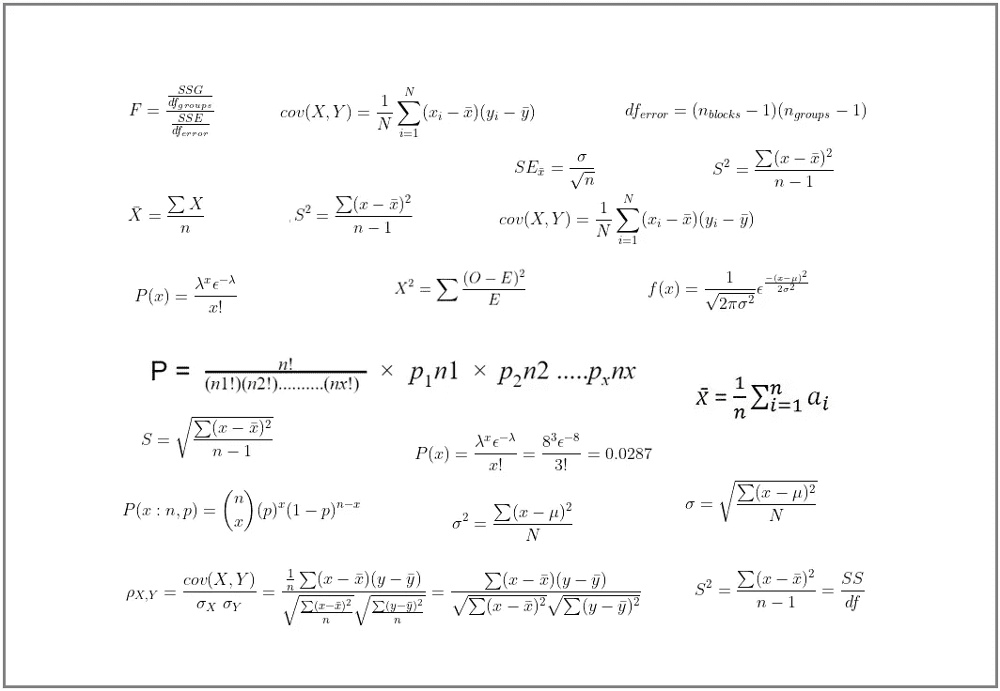
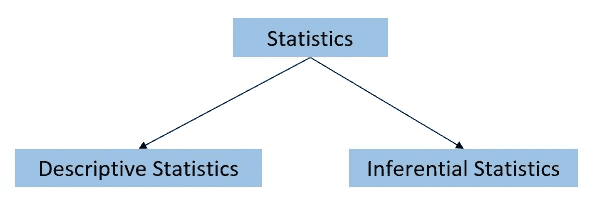
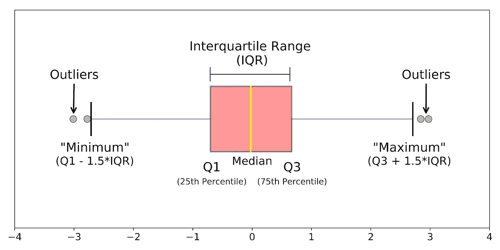
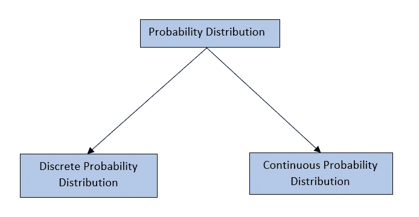
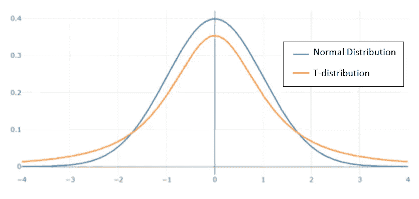

# 数据科学统计终极指南

> 原文：<https://towardsdatascience.com/ultimate-guide-to-statistics-for-data-science-a3d8f1fd69a7>

## 数据科学统计一瞥:标准指南

作者图片

# 动机

统计学是一个强大的数学领域。我说“强大”是因为它有助于我们从样本数据中推断总体结果。因为它可以推断人口结果，它也可以用于大图片(如整体影响，未来预测等。).统计学不仅仅是一些孤立主题的组合。此外，统计学在这些主题中发现了新的语义，这有时为新的机会铺平了道路。在我们的日常生活中，统计无处不在。大三时面临的主要问题是无法将统计知识与现实生活联系起来。我不知道在哪里使用哪种技术来找到答案并采取相应的行动。当我在 2018 年开始学习数据科学时，新的旅程开始了。我涵盖了数据科学所需的所有基本统计学主题，并意识到统计学知识是多么必要！作为一所大学的人工智能和数据科学讲师，我开设了统计学课程，并试图将其作为我们日常使用的有用工具。我也想在我的文章中分享这些知识。这就是为什么我写了一系列文章，涵盖统计学的所有基本主题，并试图以最简单的方式来表达它们。虽然本系列中遗漏了一些主题，但我会尝试将它们与我以前的作品一起整合到本文中。我希望各行各业的人都能容易地理解这些关于统计的文章。***不需要先决条件。*** 最后，我想说，“本文涵盖了大部分(但不是全部！)主题，它将为数据科学提供一个**统计基础，以便您可以根据需要探索其他高级主题。”**

因此，如果你是统计学的绝对初学者，并且正在寻找一个完整的指导方针，这篇文章将会适合你。

## 目录

1.  `[**Statistics at a Glance**](#aada)`
2.  `[**Population and Sample**](#e609)`
3.  `[**Variable and Level of Measurement**](#187d)`
4.  `[**Central Tendency (Mean, Median and Mode)**](#ff63)`
5.  `[**Percentile, Quartile and IQR**](#7890)`
6.  `[**Frequency Distribution and Visualization**](#7b63)`
7.  `[**Measure of Dispersion (Range, Variance, Standard Deviation, etc.)**](#cd9d)`
8.  `[**Covariance and Correlation Coefficient**](#31b1)`
9.  `[**Normalization**](#beff)`
10.  `[**Probability**](#eca3)`
11.  `[**Probability Distribution (Uniform, Binomial, Poisson, Normal and Student’s t distribution)**](#633b)`
12.  `[**Central Limit Theorem**](#4b93)`
13.  `[**Point Estimator and Estimate**](#f195)`
14.  `[**Standard Error**](#3408)`
15.  `[**Confidence Interval and Level**](#8d9d)`
16.  `[**Significance level**](#3433)`
17.  `[**Hypothesis Testing**](#a41f)`
18.  `[**Analysis of Variance (ANOVA)**](#452e)`
19.  `[**Chi-Square Test**](#6d4c)`

***下一节是本文最重要的部分，本系列中的所有文章都将与简要描述相关联。***

## 带有嵌入链接的主题描述

## 统计数据一览

根据我的理解，统计学结合了一些技术，通过对一个小群体(样本)进行实验并总结数据集，得出关于一个大群体(人群)的可靠结论。这不是一个正式的定义；这是我在处理统计数据时的体会。

*让我们根据维基百科[1]来看一个正式的定义——*

> **统计学**是关于数据的收集、组织、分析、解释和展示的学科。

***有两类统计数据。***

作者图片

*   **描述性**统计总结/描述总体或样本数据集。它涵盖了以下主题— `***types of data, variables, data representation, frequency distribution, central tendency, percentile and quartile, covariance, correlation, etc.***`
*   **推断**统计是统计的一部分，它从样本数据中找到群体数据的可靠推断。它涵盖了— `**probability distribution, *Central Limit Theorem, Point Estimator and Estimate, Standard Error, Confidence Interval and Level, Level of Significance, Hypothesis Testing, Analysis of Variance (ANOVA), Chi-Square Test, etc.***`

## **人口和样本**

**总体**由实验的所有成员组成，而**样本**是从代表总体的总体中选出的一组成员。

例如，我们想知道大学生的平均 CGPA。在这里，实验区覆盖了所有的学生。因此，人口将是该大学的所有学生。如果我们挑选一些学生来计算平均 CGPA，这些学生就是样本。

在跳到统计学之前，你必须清楚地了解题目。

***为了让你的想法变得清晰，请阅读下面的文章—***

  

## 变量和测量水平

简单地说**变量**是可以变化的东西(保存多个值)。它只不过是数据集的特征。由于现实世界中存在不同的特征，因此存在不同类型的数据。我们必须知道测量级别才能明白我们是如何处理数据的。

如果你对题目有任何困惑，请通读这篇文章。

  

## 集中趋势

中心倾向是一种找出多数值的倾向的方法。在统计学中，**均值、中位数、众数**都是用来认识它的。

*   **的意思是**

**“意思是”**的概念很直白。我们通过将总和除以值的数量(n)得到平均值。

*完整均值准则—*

  

*   **中位数**

**中位数**是知道中心倾向的另一种方式。为了得到中间值，我们需要按升序对值进行排序，并选取中间值，它随值的偶数和奇数而变化。

例如，`**12, 13, 10, 15, and 7**`就是数值系列。首先，我们需要理清价值观。排序后，序列将为`**7, 10, 12, 13, and 15.**` 值的总数为 ***5，*** 其中**为奇数**。***S*o**我们将使用下面的公式——

在我们的例子中， **12** 是中间值。

再比如有些价值观是`**12, 13, 10, 15, 7, and 9**`。经过排序，我们得到`**7, 9, 10, 12, 13, and 15**` **。**这次数值个数是 **6** ，是**偶数**。所以，我们不会用上面的公式得到中间值。因为 **(6+1)/2= 3.5 不是整数**。现在，我们需要总结第三个*和第四个*的数值。而它们的平均值就是中值， ***22/2 = 11。*****

***Python 实现—***

*   ****模式****

****模式**作用于分类数据，它是数据集的最高频率。假设您有一些包含像 `**[‘good’, ‘bad’, ‘normal’, ‘good’, ‘good’]**`这样的产品质量的数据。在这里，**好的**出现的频率最高。所以，我们的数据是**模式**。**

***Python 实现—***

****什么时候用哪个中枢倾向？****

**在名义数据的情况下，我们使用模式。对于有序数据，建议使用中位数。均值广泛用于寻找比率/区间变量的集中趋势。但是平均值并不总是确定中心趋势的正确选择，因为如果数据集包含异常值，平均值将会非常高或非常低。在这种情况下，中位数比平均数更稳健。如果中位数大于或小于平均值，我们将使用中位数。否则，刻薄是最好的选择。**

***更多详情，点击* [***此处。***](https://docs.google.com/presentation/d/11xPTowmogyCWL-Sv4JzEQ4GUFlccPZcm/edit?usp=sharing&ouid=110378133937074275698&rtpof=true&sd=true)**

## **百分位数、四分位数和 IQR**

*   ****百分位数****

**百分位数是统计学中使用的一种度量，表示一组观察值中给定百分比的观察值低于的值。例如，第 20 个百分位数是一个值(或分数)，低于该值可能会发现 20%的观察值[2]。**

*   ****四分位数****

**在百分位数中，整个数值被分成 100 个不同的部分。四分位数将数值分成**四个**等份，每份占 25%。主要四分位数是 ***第一四分位数(Q1)、第二四分位数(Q2)、第三四分位数(Q3)和第四四分位数(Q4)。*****

****

**作者图片(摘自我之前的文章[3])**

*   ****IQR(四分位数比率)****

****IQR** 是在 **Q1** 和 **Q3** 之间的范围。所以， ***IQR = Q1 — Q3。*****

****

**作者图片(摘自我之前的文章[4])**

**我们还可以通过定义一个最小值 ***(Q1 -1.5*IQR，又称下围栏)*** 和最大值 ***(Q3 + 1.5*IQR，又称上围栏)*** 边界值，找出与 **IQR** 的离群值。最小值和最大值之外的值被视为异常值。**

*****箱线图显示所有的四分位数和上下栅栏。*****

## **频率分布和可视化**

**频率是数据集中事件发生的量度。下面的文章将帮助你了解这个话题的细节。**

**      

## 离差的度量

概念**分散度的度量**表示数值的分布程度！**范围、方差、标准差。等等。，**是求离差的一些技巧。

*   **范围**

范围是最大值和最小值的间隔。比如我们有一些样本数据`**12, 14, 20, 40, 99, and 100**`。范围将是***(100–12)= 88。***

*   **差异**

方差测量数据集的每个值与平均值之间的差异。根据 **Investopedia —**

> 方差衡量的是集合中的每个数字与平均值的距离，也就是与集合中其他数字的距离[5]。

这里， **x̄** 是样本平均值， **n** 是数值的个数。

**μ** 是总体均值，N 是总体值的个数。

*   **标准偏差**

**标准差**是**方差**的平方根。

*方差和标准差的 Python 实现—*

## 协方差和相关性

*   **协方差**

协方差是比较两个数值变量之间方差的一种方法。下面的公式用来计算它。

这里， ***x*** 和 ***y*** 代表两个变量。 ***N*** 是人口数。

*   **相关性(皮尔森相关性)**

它找出两个数值变量之间的线性关系。

相关值在 ***-1*** 到 ***+1 之间波动。* -1** 表示完全负相关，而 **+1** 表示变量之间完全正相关。而 **0** 表示没有关系。

*Python 实现—*

## **正常化**

归一化是将数据转换成相似尺度的过程，是数据预处理的关键部分之一。下面的文章集成了数据规范化的所有技术。

  

## **概率**

概率是一种数学技术，通过它我们可以预测一个事件的可能结果。如果你对概率有任何困惑，请阅读以下文章。

    

## 概率分布

概率分布是一个事件所有概率的分布。概率分布有两种类型。

作者图片

*   **离散概率分布**

离散概率分布是离散值的概率分布。比如掷骰子的概率。我们为每个角色找到一个特定的结果，很明显是一个离散的值。

***均匀分布、二项式分布、泊松分布等。*** ，是一些主要的离散概率分布。

*   **连续概率分布**

连续概率分布是连续值的概率分布。例如，样本组的年龄为 24 岁的概率。由于 24 岁是一个连续值，我们需要使用连续概率分布。

***正态分布、学生的 t 分布等。*、**是一些连续的概率分布。

*   **离散均匀分布**

在均匀分布中，所有特定结果的值都是相等的。例如，掷骰子有 6 个单独的结果= `{1,2,3,4,5,6}`。如果是均匀分布，每个概率值是 **0.16667** 。

*Python 实现[6]——*

*   **二项分布**

名字“**二项式**”暗示了两个相互排斥的试验结果。例如，*头或尾，好或坏，通过或失败等。*

对于二项分布，试验必须满足**伯努利试验的标准。**

伯努利试验必须有两个独立的结果，比如高或低。成功的概率必须是恒定的。

这里， **n** 为试验次数， **p** 为成功概率，成功次数 **x** 。

> 让我们为掷骰子画一个二项式分布。假设你掷骰子 16 次。2 出现 4 次的概率会是多少？这里，p=1/6，n=16。python 代码显示了该场景的二项式分布。

*【文章【7】帮助我实现代码。】*

红色条表示概率为 2，出现 4 次。

*   **泊松分布**

红色条表示出现 4 次的概率为 2。

*   **泊松分布**

二项式分布从特定次数的试验中找出成功的次数。泊松分布决定了单位时间间隔内成功的次数。

例如，在一家商店里，8 个顾客在中午 12 点到下午 1 点之间到达。借助泊松分布，可以求出 12 点到 1 点之间到达 3 个人的概率。*泊松分布可以用下面的公式来解释。*

其中 **x** 是成功的次数， **λ** 是单位时间内发生的次数。 **ε** 是欧拉数(2.71828…)。对于上述问题，x=3，λ=8/1=8。

红色条显示在 *12pm* 到 *1pm* 之间到达 3 个客户的概率。

*   **正态分布**

作者图片(正态分布图)

连续概率分布适用于连续变量。正态分布是广泛使用的连续概率分布之一。许多现实生活中的问题都可以用正态分布来解决/描述。假设我们考虑 70 名学生的样本年龄。年龄从 18 岁到 25 岁不等。如果样本中的**均值、众数和中位数**相等，则该样本将呈正态分布。

在正态分布的情况下，左右部分平均分布的概率意味着它是对称的。总概率等于 1。该分布遵循以下等式。

这里， **σ** 是标准差， **μ** 是均值。

*使用 python 实现正态分布—*

正态分布当标准差为 **1** ，均值为 **0** 时，将为标准正态分布。下面是 python 中标准正态分布的一个例子。

*   **学生的 t 分布**

威廉·西利·戈塞特提议分配。由于他工作的地方有限制，不能用原来的名字发表研究文章，所以他用了自己的化名“学生”提出这种分布是为了从小样本中找出最佳样本[8]。

按作者分类的图像(学生的 t 分布)

该图显示了两种分布的比较。学生的 t 分布比正态分布有一个更宽的尾部。学生 t 分布的 Python 实现[9]。

## **中心极限定理**

如果我们从总体中随机抽取大量样本并考虑平均值，我们会发现样本值将围绕总体平均值呈正态分布。这是一种找出好的样本数据的方法。

作者图片

## 估算者和估计者

**估计量**是统计术语，我们通过它来估计关于总体的一些事实。一些估计量是样本均值、标准差、方差等。

估计量的值称为**估计值。**

假设样本的方差为 5。这里方差为**估计量**，方差的值称为估计量。

## 标准误差

**标准差**表示数值离总体均值有多远，**标准差**表示**样本均值**离总体均值有多远。计算如下—

这里， **σ** 为总体标准差， **n** 为样本量。

## 置信水平和区间

*   **置信度**

置信度是百分比值；在该值内，参数的真值将保持不变。假设我们以 95%的置信度解决了一个问题；这意味着 95%的时候，我们会从我们解决的问题中得到准确的结果。

*   **置信区间**

置信区间是一个范围，在这个范围内我们将得到置信水平的真值。

## 显著性水平

某一事件(如统计测试)的*显著性水平*是该事件可能偶然发生的概率。如果水平相当低，即偶然发生的概率相当小，我们就说事件*重大【11】*。

按作者分类的图像(显著性级别)

显著性水平用 **α** 符号表示。

## 假设检验

假设检验是一种统计技术，通过它我们可以检验和验证一个假设。在**假设检验**中，我们考虑一个**零假设**，它被假定为真，而**是一个替代假设**，如果零假设失败，它是可接受的。关于**假设检验**的更多细节在下面的文章中给出。

  

## 方差分析(ANOVA)

在假设检验的文章中，我提到过一些检验，如 p 检验、t 检验等。但是这些测试只是在两组之间进行比较。它们都不能用于多个组。 **ANOVA** 是一种统计检验，用于比较两组或多组之间的可变性。下面的文章提供了详细的解释。

  

## 卡方检验

卡方检验是另一种用于发现分类变量相关性的统计检验。通读下面这篇文章。

  

## 结论

统计学是数据科学不可或缺的一部分。统计学的每一个主题都不可能被涵盖，因为这个领域是巨大的。但是，我已经尽量涵盖了数据科学所需要的统计学的重要知识。通过这篇文章，我将结束我的数据科学统计学系列文章。如果你有任何问题，请在评论区告诉我。

***谢谢***

## 参考

1.  [*统计—百科*](https://en.wikipedia.org/wiki/Statistics)
2.  *百分位数。IAHPC Pallipedia。***。2022 年 10 月 16 日进入。**
3.  *[*所有频率分布的基础知识|走向数据科学*](/to-increase-data-analysing-power-you-must-know-frequency-distribution-afa438c3e7a4)*
4.  *[*https://towards data science . com/compare-multi-frequency-distributions-to-extract-of-a-valued-information-from-a-dataset-10 CBA 801 f 07 b*](/compare-multiple-frequency-distributions-to-extract-valuable-information-from-a-dataset-10cba801f07b)*
5.  *[*什么是统计学中的方差？定义、公式和示例(investopedia.com)*](https://www.investopedia.com/terms/v/variance.asp#:~:text=The%20term%20variance%20refers%20to,by%20this%20symbol%3A%20%CF%832.)*
6.  *[https://pyshark . com/continuous-and-discrete-uniform-distribution-in-python/](https://pyshark.com/continuous-and-discrete-uniform-distribution-in-python/)*
7.  *[Python —二项式分布— GeeksforGeeks](https://www.geeksforgeeks.org/python-binomial-distribution/#:~:text=Binomial%20distribution%20is%20a%20probability,a%20number%20of%20Bernoulli%20trials.)*
8.  *邓尼特，C. W .，&索贝尔，M. (1954)。学生 t 分布的二元概括，并附有特殊情况的表格。 *Biometrika* ，*41*(1–2)，153–169。*
9.  *[Python —统计学中的学生 t 分布— GeeksforGeeks](https://www.geeksforgeeks.org/python-students-t-distribution-in-statistics/)*
10.  *[估计量:简单定义和示例—统计如何进行](https://www.statisticshowto.com/estimator/)*
11.  *[https://www . science direct . com/topics/mathematics/significance-level-alpha](https://www.sciencedirect.com/topics/mathematics/significance-level-alpha)*

*   ***