# ultra tiny ml:8 位微控制器的机器学习

> 原文：<https://towardsdatascience.com/ultra-tinyml-machine-learning-for-8-bit-microcontroller-9ec8f7c8dd12>

## 如何用 Arduino 和内乌顿 TinyML 创建手势识别系统

> “一个错误重复多次就是一个决定”——p·科埃略

TinyML 是机器学习的一个子领域，研究在小型低功耗设备上运行 ML 模型的方式。

在这篇文章中，我将展示一种开始使用 TinyML 的简单方法:在 *Arduino* 板上实现一个机器学习模型，同时创建一些很酷的东西:一个基于**加速度计**的**手势识别系统**。

> 手势识别是一个试图通过使用数学算法来识别人类手势的过程。

为了使实验更简单，该系统被设计为只识别两种手势:一种*出拳*和一种*弯曲*运动。
这个，在数据科学领域，叫做 [**二元分类**](https://en.wikipedia.org/wiki/Binary_classification) 。

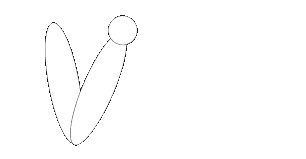

“出拳”手势。图片作者。

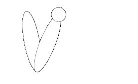

“伸缩”手势。图片作者。

*但是……为什么要“超”TinyML？*

这项实验的最大挑战是试图在一个非常小的设备上运行预测模型:一个 8 位 T21 微控制器。
要实现这一点，可以使用 [*内乌顿*](https://bit.ly/36rN4Pg) 。

内乌顿是一个 TinyML 框架。它允许在没有任何编码和很少机器学习经验的情况下自动构建神经网络，并将它们嵌入到小型计算设备中。
支持 **8** 、 **16** 、 **32 位**微控制器，不像[*tensor flow Lite*](https://www.tensorflow.org/lite/microcontrollers)TinyML 框架只支持 32 位。你不需要一个强大的机器来使用*内乌顿，*它是一个运行在网络浏览器上的在线软件工具。
使用免费计划，你可以训练和下载无限数量的模型。

*…我们开始吧！*

实验分为三步:

1.  **捕获**训练**数据集**
2.  **训练**模型使用*内乌顿*
3.  **部署**并在 *Arduino* 上运行模型


实验流程。图片作者。

# 硬件系统

手势识别系统由以下部分组成:

*   一款单片机:**[**Arduino Mega 2560**](https://store.arduino.cc/products/arduino-mega-2560-rev3)**
*   **加速度传感器**:**[**GY-521**](https://www.amazon.it/Aukru-MPU-6050-Giroscopio-Accelerometro-Arduino/dp/B00PL70P7K)**模块****

******Arduino Mega 2560** 是一个基于 **ATmega2560** 的微控制器板:一个低功耗 **8 位 MCU** ，带有 256KB 闪存、32 个通用工作寄存器、UART 接口、10 位 A/D 转换器和许多其他外设。
Mega 2560 板是为复杂项目设计的:它比其他 *Arduino* 板( *Uno、Nano、Micro 等)有更大的**空间**。)*。这使得它非常适合有大量数据要处理的机器学习应用程序。****

******GY-521** 模块是围绕*InvenSense***MPU-6050**构建的:一种在单个 IC 中包含三轴 MEMS 加速度计和三轴 MEMS 陀螺仪的传感器。
它的操作非常精确，因为每个通道都包含一个精确的数字转换器。它能够同时捕捉 X、Y 和 Z 轴的值。使用 **I2C** 接口与 MCU 进行通信。****

****下面是用[烧结](https://fritzing.org/)软件设计的连接电路:****

********

****连接电路:Arduino Mega2560 和 GY-521。图片作者。****

****GY-521 由 *Arduino* Mega power 部分的 *5V* 和 *GND* 引脚供电，数据通讯使用 *I2C* 引脚(引脚 20 和引脚 21)。
剩余的引脚是可选的，对该应用没有用处。****

****为了验证 GY-521 模块是否正确供电，连接 *Arduino* 板的 USB 电缆，并检查安装在传感器板上的 LED 是否打开。****

****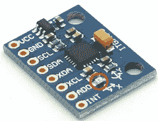****

****GY-521: LED 位置。图片作者。****

****验证传感器电源后，通过下载 [Adafruit MPU6050 Arduino 库](https://learn.adafruit.com/mpu6050-6-dof-accelerometer-and-gyro/arduino)并打开*绘图仪*示例，检查 *I2C* 通信是否正常工作。****

****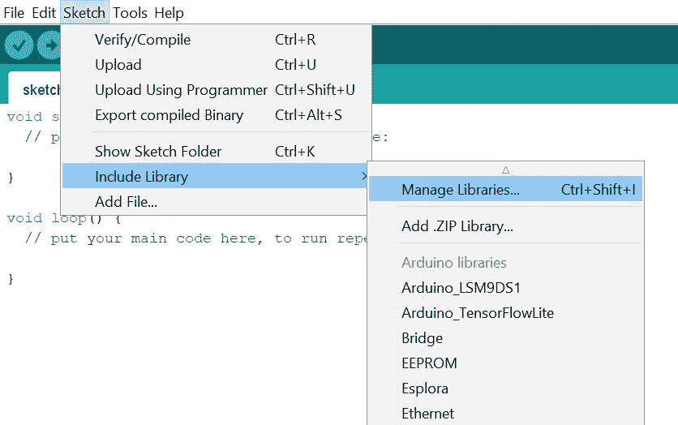****

****在 Arduino IDE 中添加库。图片作者。****

********

****Adafruit MPU6050 库。图片作者。****

****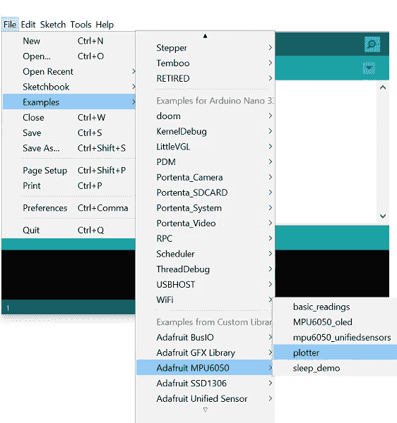****

****MPU6050 示例图片作者。****

****将示例草图上传到 *Arduino* 板上，打开*工具*菜单中的*串行绘图仪*，在*波特*下拉菜单中设置 115200，并“摇动”传感器板。预期结果如下:****

****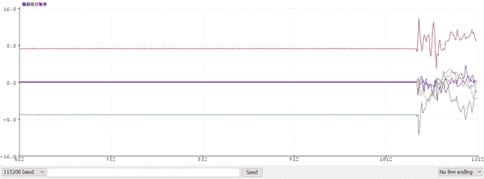****

****MPU6050 绘图仪的串行绘图仪实例。图片作者。****

****现在，系统已准备好收集加速度计和陀螺仪数据。****

# ****捕获培训数据****

****建立预测模型的第一步是收集足够的运动测量值。
这组测量被称为**训练数据集**，它将用于训练*内乌顿*神经网络构建器。****

****最简单的方法是通过捕捉加速度和陀螺仪测量值并将结果存储在一个文件中，重复几次相同的两个动作(*打孔*和*弯曲*)。
为此，您创建一个专用于传感器数据采集的 *Arduino* 草图。该程序将获取每个动作的测量值，并将传感器测量值输出打印在串行端口控制台上。****

****你将完成至少 60 个动作:第一个动作 30 个(*出拳*)，第二个动作 30 个(*弯曲*)。对于每个动作，您将在 1 秒时间窗口内获得 50 个加速度和 50 个陀螺仪测量值(*采样时间:20 毫秒—50Hz* )。在这个实验中，60 个动作就足够了。通过增加运动测量的数量，可以提高模型的预测能力。然而，大型数据集会导致*过拟合*模型。没有“正确的”数据集大小，但建议使用“*试错法*”方法。****

*****Arduino* 草图的串口输出将根据*内乌顿*训练[数据集要求](https://lab.neuton.ai/#/support_library/user_guide/TRAINING_DATASET_REQUIREMENTS)进行格式化:****

*   ******CSV** 格式:是一种数据库文件格式。文件的每一行都是一个数据记录，由一个或多个用逗号分隔的字段组成。****
*   ****至少 **50 条数据记录**(对于二元分类任务，意味着每组至少 25 条数据记录)。****
*   ****第一行必须包含**列名**(例如 *ax0、ay0、az0、gx0、gy0、gz0、…* )。****
*   ****必须存在一个**目标**变量列。每一行必须被分配到一个特定的目标组(在本实验中:对于*冲头*，为“0”；对于*弯曲*，为“1”)。****
*   ****使用一个**点**作为小数点分隔符。****

****下面， *Arduino* 程序用于数据集创建:****

*   ****IMU 传感器初始化和 CSV 报头生成:****

```
**#define **NUM_SAMPLES 50**Adafruit_MPU6050 mpu;void **setup**() {
  // init serial port
  **Serial.begin**(115200);
  while (!Serial) {
    delay(10);
  } // init IMU sensor
  if (!**mpu.begin**()) {
    while (1) {
      delay(10);
    }
  }

  // configure IMU sensor
  // *[...]* // print the CSV header (ax0,ay0,az0,...,gx49,gy49,gz49,target)
  for (int i=0; i<**NUM_SAMPLES**; i++) {
    Serial.print("**aX**");
    Serial.print(i);
    Serial.print(",**aY**");
    Serial.print(i);
    Serial.print(",**aZ**");
    Serial.print(i);
    Serial.print(",**gX**");
    Serial.print(i);
    Serial.print(",**gY**");
    Serial.print(i);
    Serial.print(",**gZ**");
    Serial.print(i);
    Serial.print(",");
  }
  Serial.println("**target**");
}**
```

*   ****采集 30 个连续运动。如果加速度总和高于某个阈值(例如**2.5g*)，则检测到运动开始。*****

```
***#define **NUM_GESTURES    30**#define GESTURE_0       0
#define GESTURE_1       1
#define **GESTURE_TARGET** GESTURE_0 
//#define **GESTURE_TARGET** GESTURE_1 void **loop**() {
  sensors_event_t a, g, temp;

  while(gesturesRead < NUM_GESTURES) {
    // wait for significant motion
    while (samplesRead == NUM_SAMPLES) {
      // read the acceleration data
      mpu.getEvent(&a, &g, &temp);

      // sum up the absolutes
      float aSum = fabs(a.acceleration.x) + 
                   fabs(a.acceleration.y) + 
                   fabs(a.acceleration.z);

      // check if it's above the threshold
      if (aSum >= ACC_THRESHOLD) {
        // reset the sample read count
        samplesRead = 0;
        break;
      }
    }

    // read samples of the detected motion
    while (samplesRead < **NUM_SAMPLES**) {
        // read the acceleration and gyroscope data
        mpu.getEvent(&a, &g, &temp);

        samplesRead++;

        // print the sensor data in CSV format
        Serial.print(a.acceleration.x, 3);
        Serial.print(',');
        Serial.print(a.acceleration.y, 3);
        Serial.print(',');
        Serial.print(a.acceleration.z, 3);
        Serial.print(',');
        Serial.print(g.gyro.x, 3);
        Serial.print(',');
        Serial.print(g.gyro.y, 3);
        Serial.print(',');
        Serial.print(g.gyro.z, 3);
        Serial.print(','); // print target at the end of samples acquisition
        if (samplesRead == **NUM_SAMPLES**) {
          Serial.println(**GESTURE_TARGET**);
        }

        delay(10);
    }
    gesturesRead++;
  }
}***
```

*****首先，在串行监视器打开并且*手势 _ 目标*设置为**手势 _0** 的情况下运行上面的草图。然后，在*手势 _ 目标*设置为**手势 _1** 的情况下运行。每次执行时，执行相同的动作 30 次，尽可能确保动作以相同的方式执行。*****

*****将两个动作的串行监视器输出复制到一个文本文件中，并将其重命名为“trainingdata”。 **csv** ”。*****

*****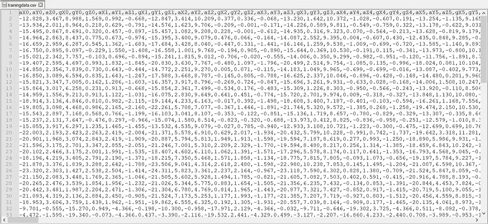*****

*****CSV 格式的训练数据集示例。图片作者。*****

# *****用内乌顿·丁尼尔训练模型*****

> *****训练模型的过程包括向机器学习算法提供训练数据以供学习。在这个阶段，您尝试将权重和偏差的最佳组合与 ML 算法相匹配，以最小化损失函数。*****

******内乌顿*自动执行训练，无需任何用户交互。
用*内乌顿*训练神经网络快速简单，分为三个阶段:*****

1.  *******数据集**:上传和验证*****
2.  *******训练**:自动 ML*****
3.  *******预测**:结果分析和模型下载*****

## *****数据集:上传和验证*****

*   *****首先，创建一个新的*内乌顿*解决方案，并将其命名为(例如*手势识别*)。*****

**********

*****内乌顿:添加新的解决方案。图片作者。*****

*   *****上传 CSV 训练数据集文件。*****

**********

*****内乌顿:上传 CSV 文件。图片作者。*****

*   ******内乌顿*根据数据集要求验证 CSV 文件。*****

*****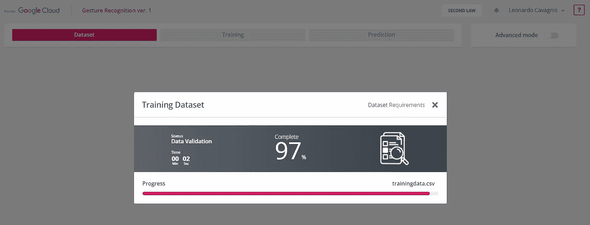*****

*****内乌顿:数据集验证。图片作者。*****

*   *****如果 CSV 文件符合要求，将出现绿色复选标记，否则将显示错误消息。*****

*****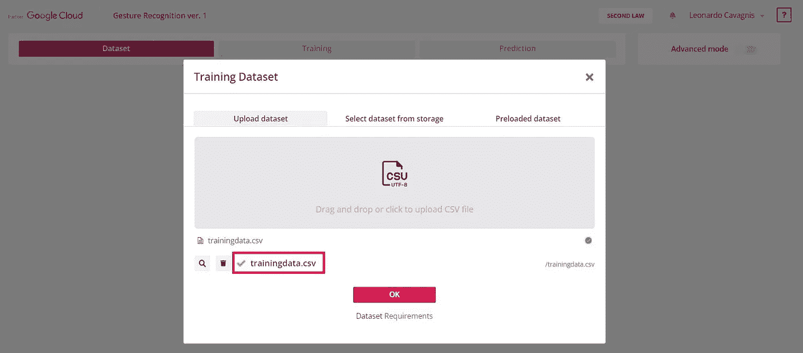*****

*****内乌顿:经过验证的数据集。图片作者。*****

*   *****选择目标变量的列名(如 *target* ，点击 *Next* )。*****

*****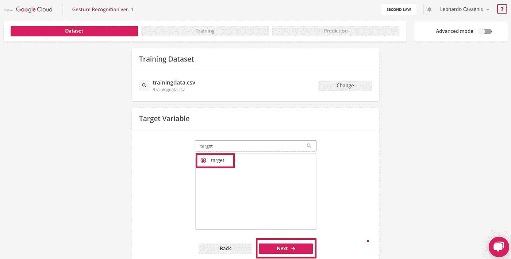*****

*****内乌顿:目标变量。图片作者。*****

*****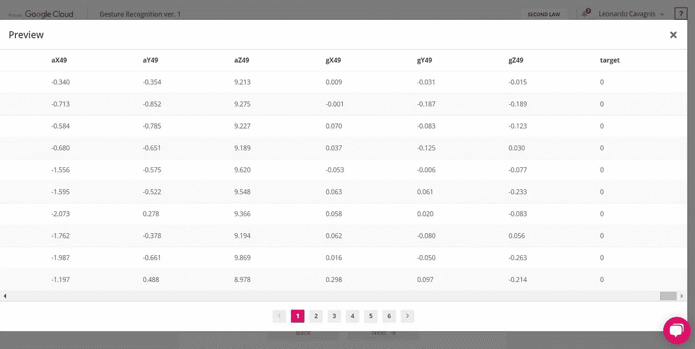*****

*****内乌顿:数据集内容预览。图片作者。*****

## *****培训:自动 ML*****

*****现在，让我们进入训练的核心！*****

*   ******内乌顿*分析训练数据集的内容并定义 ML 任务类型。有了这个数据集，自动检测**二元分类**任务。*****

*****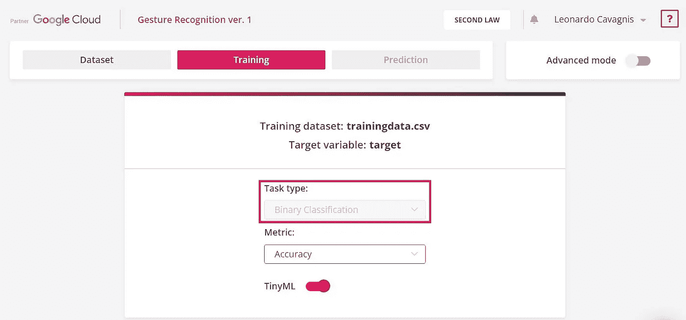*****

*****内乌顿:任务类型。图片作者。*****

*   *******指标**用于监控和测量模型在训练期间的表现。对于这个实验，您使用了**准确性**度量:它表示预测类的准确性。值越高，模型越好。*****

*****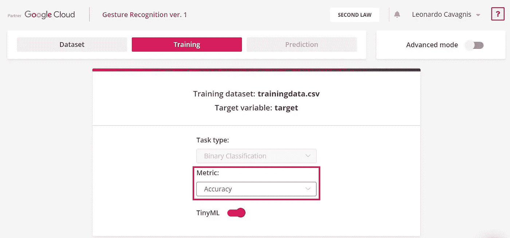*****

*****内乌顿:公制。图片作者。*****

*   *****启用 **TinyML** 选项，允许*内乌顿*为微控制器构建一个微型模型。*****

*****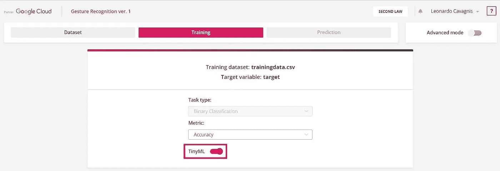*****

*****内乌顿:TinyML 选项。图片作者。*****

*   *****在 TinyML 设置页面，在下拉菜单中选择“*，并启用“ ***【浮点数据类型支持】*** 选项。这是因为实验中使用的微控制器是支持浮点数的 8 位微控制器。******

******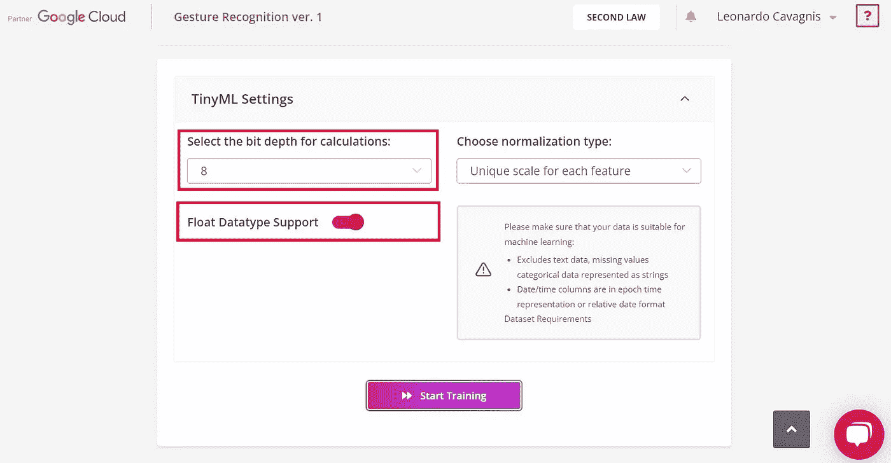******

******内乌顿:TinyML 设置。图片作者。******

*   ******按下“*开始训练*按钮后，您将看到进程进度条和完成百分比。******

******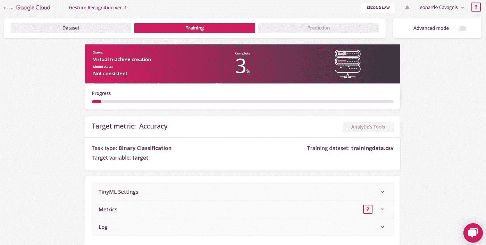******

******内乌顿:训练开始了。图片作者。******

*   ******第一步是**数据预处理**。它是准备(*清理、组织、改造等的过程。*)原始数据集，使其适合于训练和构建 ML 模型。******
*   ******数据预处理完成后，模型训练开始。这个过程可能需要很长时间；您可以关闭窗口，并在该过程完成后返回。在训练期间，您可以通过观察**模型状态**(*一致*)或*不一致*)和**目标度量**值来监控实时模型性能。******

************

******内乌顿:数据预处理完成。图片作者。******

*   ******训练完成后，“*状态*将变为“*训练完成”*。模型是一致的，并已达到最佳预测能力。******

******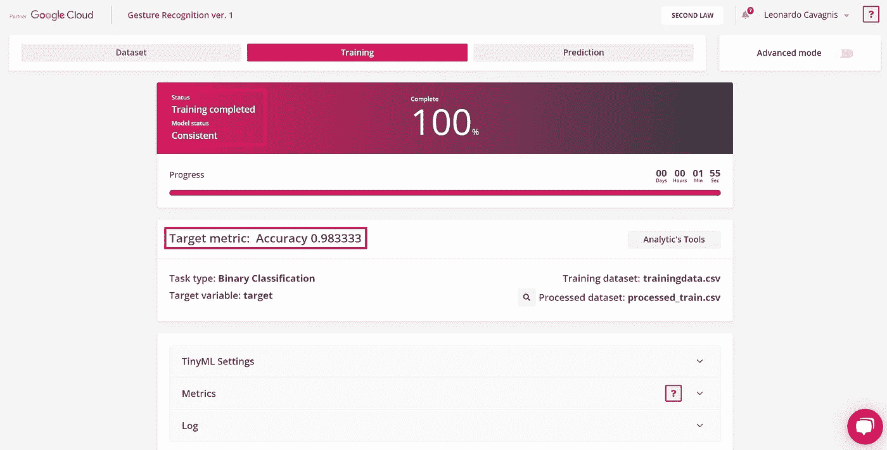******

******内乌顿:培训完成。图片作者。******

## ******预测:结果分析和模型下载******

******就这样…模型做好了！******

************

******内乌顿:培训完成。图片作者。******

******训练程序完成后，您将被重定向到*预测*部分。
在本次实验中，模型达到了 **98%** 的准确率。这意味着从 100 条预测记录中，有 98 条被分配到了正确的类别……*真令人印象深刻！*******

******而且要嵌入的模型大小小于 *3KB* 。
考虑到正在使用的 *Arduino* 板的内存大小为 *256KB* ，8 位微控制器的典型内存大小为 *64KB÷256KB* ，这是一个非常小的尺寸。******

******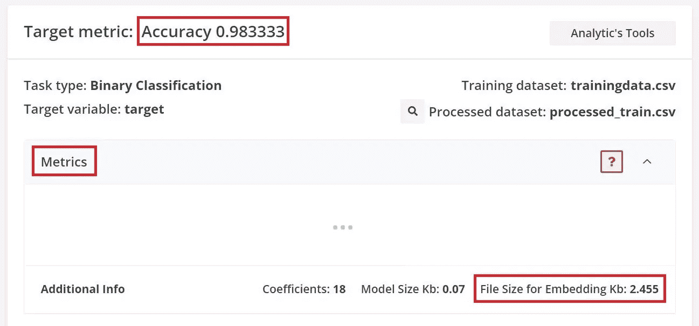******

******内乌顿:度量。图片作者。******

******要下载模型档案，点击*下载*按钮。******

******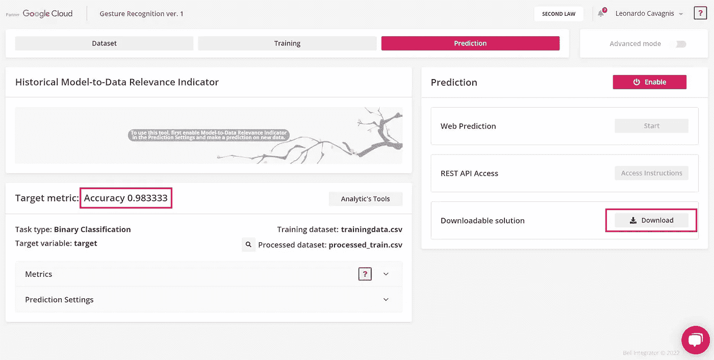******

******内乌顿:预测选项卡。图片作者。******

# ******在 Arduino 上部署模型******

******现在，是时候将生成的模型嵌入微控制器中了。******

******从*内乌顿*下载的模型档案包括以下文件和文件夹:******

*   ******/ **模型** : 紧凑形式(十六进制和二进制)的神经网络模型。******
*   ******/ **neuton** : 用于执行预测、计算、数据传输、结果管理、*等的一组功能。*******
*   ********user_app.c** :一个文件，您可以在其中设置应用程序的逻辑来管理预测。******

************

******内乌顿模型档案馆。图片作者。******

******首先，修改 **user_app.c** 文件，添加初始化模型和运行推理的函数。******

```
****/*
 * Function: model_init
 * ----------------------------
 *
 *    returns: result of initialization (bool)
 */
uint8_t **model_init**() {
   uint8_t res;

    res = **CalculatorInit**(&neuralNet, NULL);

    return (ERR_NO_ERROR == res);
}/*
 * Function: model_run_inference
 * ----------------------------
 *
 *   sample: input array to make prediction
 *   size_in: size of input array
 *   size_out: size of result array
 *
 *   returns: result of prediction
 */
float* **model_run_inference**(float* sample, 
                           uint32_t size_in, 
                           uint32_t *size_out) {
   if (!sample || !size_out)
      return NULL; if (size_in != neuralNet.inputsDim)
      return NULL; *size_out = neuralNet.outputsDim; return **CalculatorRunInference**(&neuralNet, sample);
}****
```

******之后，创建 **user_app.h** 头文件，允许主应用程序使用用户函数。******

```
****uint8_t **model_init**();
float*  **model_run_inference**(float* sample, 
                            uint32_t size_in, 
                            uint32_t* size_out);****
```

******下面是 *Arduino* 主要应用示意图:******

*   ******型号**初始化********

```
****#include "src/Gesture Recognition_v1/**user_app.h**"void **setup**() {
   // init serial port and IMU sensor
   // *[...]* // init Neuton neural network model
   if (!**model_init**()) {
      Serial.print("Failed to initialize Neuton model!");
      while (1) {
        delay(10);
      }
   }
}****
```

*   ******模型**推理********

```
****#define GESTURE_ARRAY_SIZE  (6*NUM_SAMPLES+1) void **loop**() {
   sensors_event_t a, g, temp;
   float gestureArray[GESTURE_ARRAY_SIZE]  = {0}; // wait for significant motion
   // *[...]* // read samples of the detected motion
   while (samplesRead < NUM_SAMPLES) {
      // read the acceleration and gyroscope data
      mpu.getEvent(&a, &g, &temp); // fill gesture array (model input)
      gestureArray[samplesRead*6 + 0] = a.acceleration.x;
      gestureArray[samplesRead*6 + 1] = a.acceleration.y;
      gestureArray[samplesRead*6 + 2] = a.acceleration.z;
      gestureArray[samplesRead*6 + 3] = g.gyro.x;
      gestureArray[samplesRead*6 + 4] = g.gyro.y;
      gestureArray[samplesRead*6 + 5] = g.gyro.z;

      samplesRead++;

      delay(10); // check the end of gesture acquisition
      if (samplesRead == **NUM_SAMPLES**) {
         uint32_t size_out = 0;

         // run model inference
         float* result = **model_run_inference**(gestureArray,  
                                             GESTURE_ARRAY_SIZE, 
                                             &size_out); // check if model inference result is valid
         if (result && size_out) {
            // check if problem is binary classification
            if (size_out >= **2**) { 
               // check if one of the result has >50% of accuracy
               if (result[0] > **0.5**) {
                  Serial.print(**"Detected gesture: 0"**); 
                  // *[...]*
               } else if (result[1] > **0.5**) {
                  Serial.print(**"Detected gesture: 1"**); 
                  // *[...]*
               } else { 
                  // solution is not reliable
                  Serial.println("Detected gesture: NONE");
               } 
            }
         }
     }
   }
}****
```

# ******行动模型！******

*******项目和代码准备好了！*******

```
****/neuton_gesturerecognition
 |- /src
 | |- /Gesture Recognition_v1
 |   |- /model
 |   |- /neuton
 |   |- user_app.c
 |   |- user_app.h
 |- neuton_gesturerecognition.ino****
```

******现在，是时候看看预测模型的运行了！******

*   ******验证硬件系统设置是否正确******
*   ******打开主应用程序文件******
*   ******点击*验证*按钮，然后点击*上传*一******
*   ******打开*串行监视器*******
*   ******把你的硬件系统抓在手里，做一些动作。******

******对于每个检测到的运动，模型将尝试猜测运动的类型(0*-击打*或 1*-弯曲*)以及预测的准确性。如果预测的准确度低( *0.5* )，则模型不做出决定。******

******下面是一个模型推理执行的例子:******

******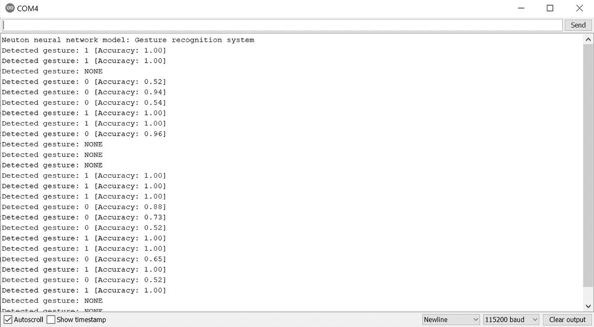******

******内乌顿手势识别系统的串行监视器输出。图片作者。******

# ******…已经完成了？******

******用*内乌顿*做机器学习简单快捷。在低功耗 8 位微控制器上实现的模型精度和性能令人印象深刻！
*内乌顿*适合快速原型开发。它允许用户专注于应用程序，避免在复杂的手动统计分析中浪费时间。******

> ******[在这里](https://github.com/leonardocavagnis/GestureRecognition_Arduino_NeutonTinyML)，你可以找到本文描述的所有 Arduino 草图！******