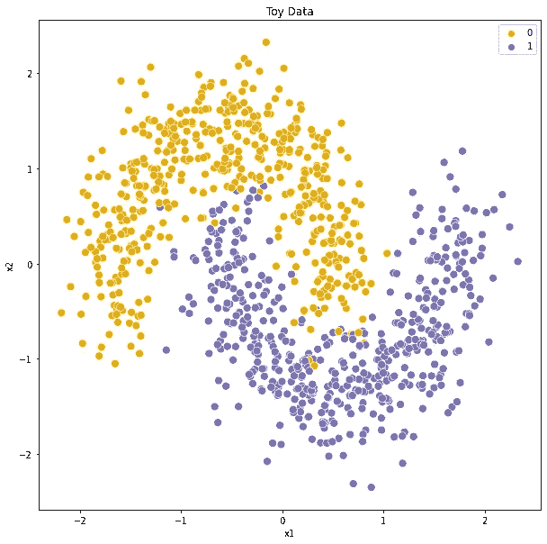
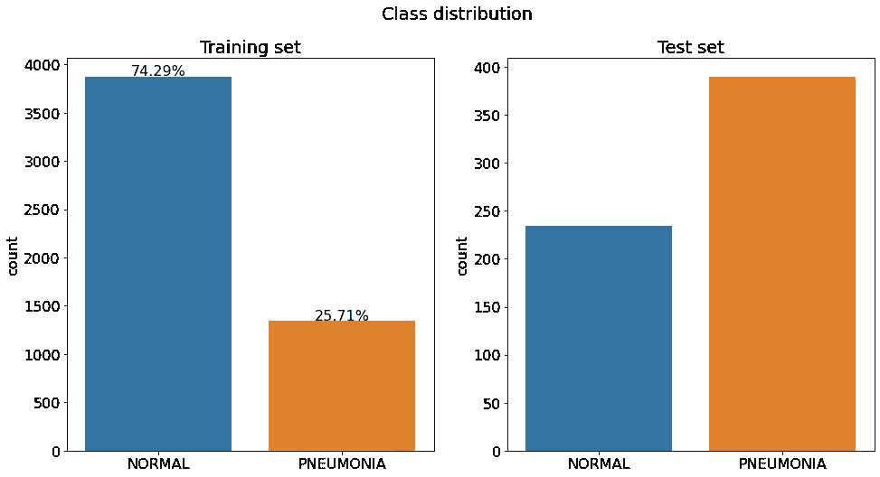
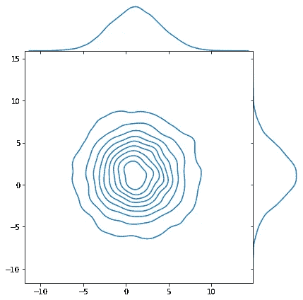
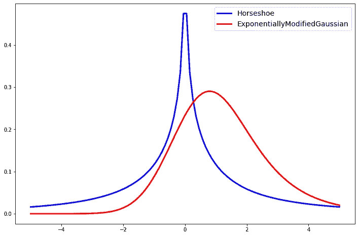
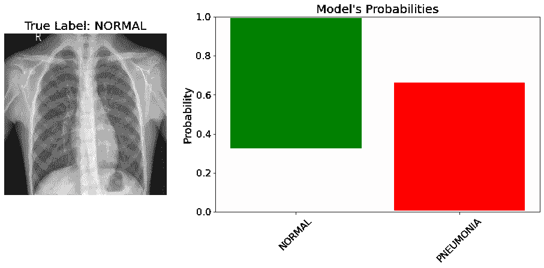

# 深度学习中的不确定性:贝叶斯 CNN 实验

> 原文：<https://towardsdatascience.com/uncertainty-in-deep-learning-experiments-with-bayesian-cnn-1ca37ddb6954>

## KL-Weight 如何影响模型？为胸部 x 光图像编写贝叶斯 CNN。

由[埃文·丹尼斯](https://unsplash.com/@evan__bray?utm_source=medium&utm_medium=referral)在 [Unsplash](https://unsplash.com?utm_source=medium&utm_medium=referral) 上拍摄

这是深度学习中**不确定性系列的**第五部**。**

*   [第 1 部分—简介](/uncertainty-in-deep-learning-brief-introduction-1f9a5de3ae04)
*   [第 2 部分—随机不确定性和最大似然估计](/uncertainty-in-deep-learning-aleatoric-uncertainty-and-maximum-likelihood-estimation-c7449ee13712)
*   [第 3 部分——认知不确定性和反向投影贝叶斯](/uncertainty-in-deep-learning-epistemic-uncertainty-and-bayes-by-backprop-e6353eeadebb)
*   [第 4 部分——实现完全概率贝叶斯 CNN](/uncertainty-in-deep-learning-bayesian-cnn-tensorflow-probability-758d7482bef6)
*   **第五部分——贝叶斯 CNN 实验**
*   第六部分——贝叶斯推理和变形金刚

这篇文章是前几篇文章的后续。因此，在这篇文章中，并不是每一个术语或层都像在前面的部分中解释的那样进行解释。

# 介绍

在[第三部分](/uncertainty-in-deep-learning-epistemic-uncertainty-and-bayes-by-backprop-e6353eeadebb)中，我们使用了`DenseVariational`层，以便通过反向投影算法实现**贝叶斯。这一层接受`kl_weight`作为参数，我们将看到它是如何影响模型的。**

在本文的下一节，我们将看到如何实现一个具有剩余连接的贝叶斯 CNN 模型。实现的模型将在真实数据集上训练。

该职位的组织结构如下:

*   **KL-重量摘要**
*   **多元线性作为变分后验**
*   **不同 KL-权重和方差的后验**
*   **加载真实数据集**
*   **作为正则化者的先验**
*   **提供自定义的先验&后验**
*   **DenseNet121 作为特征提取器**
*   **贝叶斯 ResNet**
*   **检查结果和不确定度**
*   **结论**
*   **接下来的步骤**

# KL-重量概述

回想一下，我们不能计算真实的后验概率，因此我们需要近似它。也就是说，我们将应用**变分贝叶斯**技术。

图片作者。(摘自第三部分)

凭直觉，我们希望这两个分布之间的 KL-散度尽可能低，这表明我们的变分后验接近于原始分布。

由于数学运算在第 3 部分有所解释，我将直接得出结论，最终损失如下:

最终损失，贝叶斯反投影。(第三部分)

`1/M`是 KL-Weight，其中`M`是训练样本的总数。我们将从一个玩具数据集开始。

对于 KL 重量部分，进口如下:

## `MultivariateNormalTriL()`

对于我们的任务，我将展示`tfpl.MultivariateNormalTriL()`。这一层将允许我们把我们的变分后验概率指定为多元分布。

我们的先验分布只是一个标准的正态分布。然而，后验概率是一个具有完全协方差的多元正态分布。和`tfpl.VariableLayer`一起，这将是一个可训练的分布。

`params_size`将为`MultivariateNormalTriL()`确定正确的参数数量。

让我们看看它如何影响模型参数:

假设，我们在一个数据集中有 **3 个要素和 2 个类**。我们将尝试使用神经元来学习数据集。这基本上是逻辑回归。问题是，模特有 14 个可训练参数。让我们用一个图表来解释这个问题:

图片作者。

**多元正态分布**由**均值**向量和**协方差矩阵**定义。

协方差矩阵测量两个随机变量的依赖程度。换句话说，它显示了它们如何一起变化。在复杂模型中，由于协方差矩阵的原因，在每一层中为多元正态分布设置变分后验概率是不可行的。

## KL-重量实验

显然，KL-Weight 参数将影响我们的变分后验概率。因此，我们需要创建一个自定义回调来监控我们的变化后验概率。

最终损失，贝叶斯反投影。(第三部分)

在每个时期结束时，我们检索我们的变分后验标准差，并将其附加到一个列表中。

在 Sklearn 的帮助下，数据创建过程非常简单:

图片作者。

由于输出将是一个分布，我们可以直接使用负对数似然作为损失函数。回想一下，标签是热编码的，所以最后使用的是`tfpl.OneHotCategorical`层。

后验函数和先验函数是相同的:

*   **先前:**正常
*   **变分后验:**带协方差的多元正态分布

在一个循环中运行不同`kl_weights`的实验:

*   `1/x.shape[0]`在这里是正确的，因为我们除以数据集中的元素总数。

损失值和准确度值看起来很接近。那用比如`**kl_weight**` **= 0 可以吗？大多数情况下，你可能不想这么做。这是因为我们在这里做**贝叶斯深度学习**，避免得到固定的预测。**

这听起来可能有点神秘，所以首先让我们检查不同`kl_weight`项的变分后验方差。

图片作者。

对于值`0.0, 0.0001, 0.0005`，方差较低。请记住，为了得到预测，我们从变分后验样本。因此**如果方差接近零或某个低值，采样值将趋于更接近**。换句话说，如果方差变为零，我们可以收敛到一个 MLE 解！

这有一个严重的缺点，在贝叶斯深度学习中，我们的目标是测量模型对给定输入的信心。如果方差低于预期值，这可能会导致高估模型的可信度。

# 真实数据集

在本帖中，我们将使用 **Paul Mooney** 在 Kaggle 上发布的**胸部 x 光图像(肺炎)【1】**数据集。数据集包括两类，正常和肺炎。

`label_mode`被选为分类层，因此我们可以使用`OneHotCategorical`层作为模型的最后一层。数据加载过程很简单，所以我跳过这一部分。

数据集中的图像。

在进入模型创建过程之前，让我们也检查一下类分布

图片作者。

所有绘制图像和类分布的相关代码都可以在笔记本中找到，我会在文章的最后分享它的链接。

作为先验，我会用`MultivariateNormalDiag`。这种分布允许建立具有对角协方差矩阵多元正态分布。为`Convolution2DReparameterization`设置自定义先验很容易，正如我们在前一部分看到的。

因为先验没有可训练的参数，所以像这样构建并返回一个独立的分布对象就足够了。

如果那个`MultivariateNormalDiag`是 2D，它可以被想象成如下:

图片作者。(位置= 1.2，刻度= 3.0)

所以我们可以说它是一个球形分布。从贝叶斯的角度来看，**先验充当了正则化子**。所以如果你使用，比方说**拉普拉斯**先验，你实际上将使用 **L1 正则化**。我不会在此详述，但如果您想深入了解，可以查看一下:

  

在我们的例子中，有许多分布可以用作先验分布:

图片作者。

幸运的是，TFP 库使得使用这些发行版变得很容易。由于这些先验表示我们对模型参数的先验信念，它可以影响模型的收敛性。

例如，马蹄形分布不会将大重量缩小太多。并且小的值将被推向零。

## `Reparameterization Layers`的自定义后验

因为变化后验概率是可训练的，所以在`Reparameterization`层中创建它有点笨拙。

使用`default_loc_scale_fn`,我们为可训练参数生成一个闭包。闭包接受与`posterior`函数相同的参数，并返回`loc, scale`，它可以被传递到一个分布中。在那之后，发行版将是可训练的。

在引擎盖下，`tf.nn.softplus`应用于`scale`参数，所以我们不需要担心它，例如是否为负。

然而，当处理贝叶斯 DL 时，如果变分后验恰好是正态分布，则**容易收敛。**

在这篇文章中，**我将使用正态分布**，但如果你愿意，这就是你改变后验概率的方法。

## 逼近 KL 散度

因为我们改变了先验，TFP 将不能计算 KL 散度的解析值。我们需要近似它:

我想提到的一点是:在实践中，用其他值进行缩放可能会更好。根据我的经验，这是可以的，但你也可以尝试其他合理的值。

## 贝叶斯网

这些层需要很多参数，封装在这样的函数里更方便。对于后验分布，我们使用默认值，并通过`is_singular = False`来确保它们是**而不是**点估计。

`tfpl.default_mean_field_normal_fn`是参数可训练的正态分布。它实际上是对后路的默认。

剩余部分很简单，看起来比平常长，因为`reparameterization`层接受了太多的参数。

现在，我们将遵循不同的方法。**我们不是从头开始训练一个** **贝叶斯 CNN，而是采用一个预训练的模型，仅用于特征提取**，这意味着它们的层将被冻结，在训练期间不会更新。

`DenseNet121`将是该任务中的特征提取器。此外，不是采取整个架构，它将被分割使用功能 API。

*   我们获取`conv5_block9_concat`的输出，并将其提供给我们的贝叶斯残差层。
*   贝叶斯卷积层将分别有 64 个和 128 个滤波器，随后是`swish`激活。

现在，我们准备使用数据集来训练模型。

*   损失是负对数似然，因为产出是一个分布
*   使用回调来提高训练，如果`val_accuracy`没有连续提高 7 个纪元，早期停止将给出最佳权重。
*   如果`val_accuracy`没有任何改善，学习率将每 3 个周期降低一次。

最终，模型达到了 85%的测试准确率。然而，我们更感兴趣的是预测的不确定性，而不是简单的准确性。

# 结果

让我们检查一下测试集中的图像。

图片作者。

对于该预测，模型将很高的概率分配给正确的类别 1。可以说模型对这个预测是有把握的，而且不确定性很低。

条形图显示了预测的不确定性。因此，如果**柱更高**，我们**得出结论，不确定性更高**。这是因为，我们显示了 95%的置信区间，条形的长度显示了百分位数 2.5 和 97.5 之间的差异。

在最好的情况下，模型将只分配 1 作为预测值，百分位数 2.5 和 97.5 之间的差值为零。在这种情况下，条形会更短。

图片作者。

对于这个具体的例子，真实类是正常的，但是模型似乎很难预测它。例如，在向前传递中，它为正常类分配了非常高的概率。但是在另一次向前传递中，类正常的概率很低。**我们得出结论，模型对这个预测是不确定的，并且知道它不知道的东西！**

# 结论

在本帖中，我们:

*   已经看到当选择`MultivariateNormalTriL()`作为变分后验概率时，它如何影响模型的参数，
*   已经看到了 KL-Weight 的影响，
*   已经学会如何为`Reparameterization`层提供定制的先验和后验函数，
*   使用了预先训练的模型作为特征提取器并将特征向量输入到贝叶斯 ResNet 模型中，
*   检查了测试集中两幅图像的不确定性。

您可以从这里获得[笔记本。](https://github.com/Frightera/Medium_Notebooks_English/tree/main/Bayesian%20CNN%20-%20Experiments)

# 后续步骤

您可以尝试数据扩充技术，看看它是否有助于减少预测中的不确定性。

在下一篇文章中，我们将探讨关于**变形金刚和贝叶斯推理。**

# 参考

[1]:科曼尼，丹尼尔；张、康；Goldbaum，Michael，“用于分类的标记光学相干断层扫描(OCT)和胸部 X 射线图像”，Mendeley Data，V2。2018，doi: 10.17632/rscbjbr9sj.2，【https://data.mendeley.com/datasets/rscbjbr9sj/2】T4(CC BY 4.0)