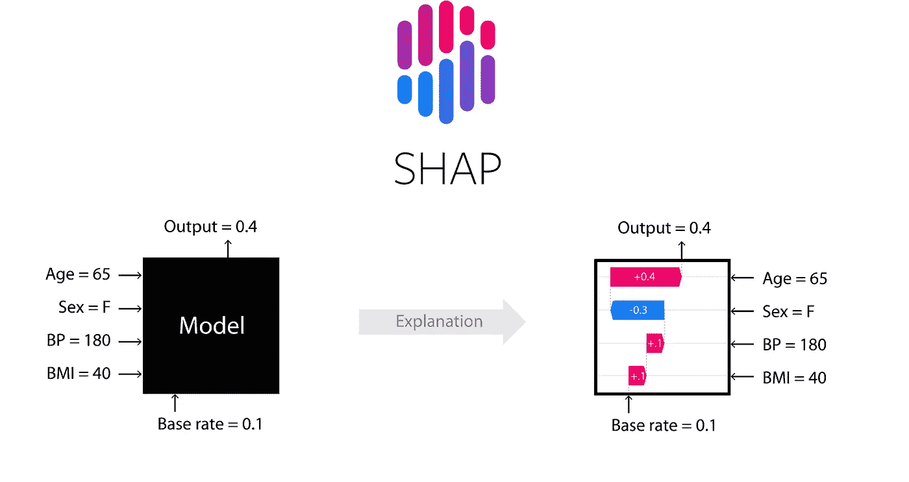
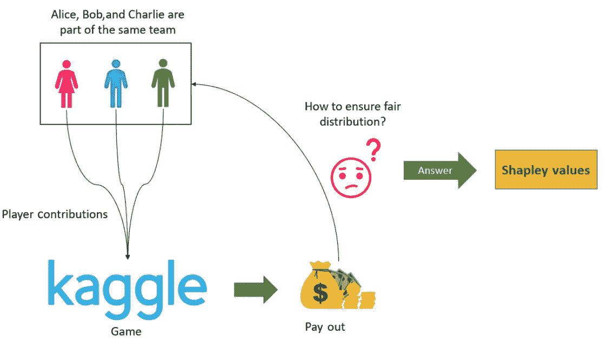
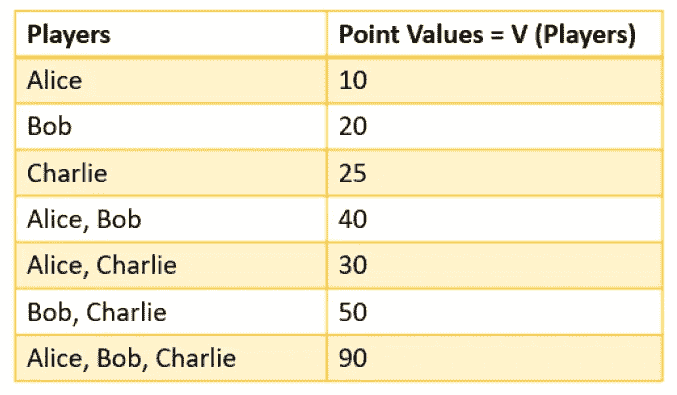
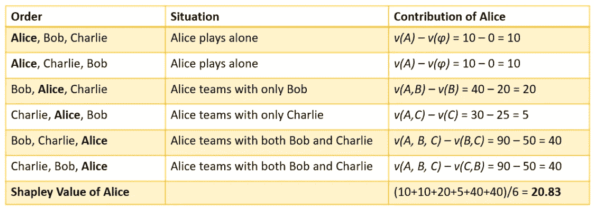
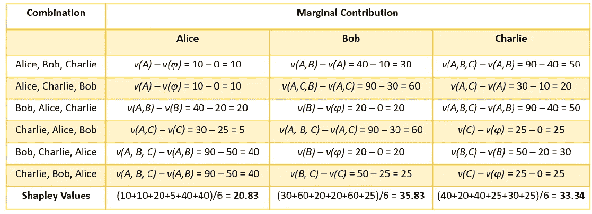
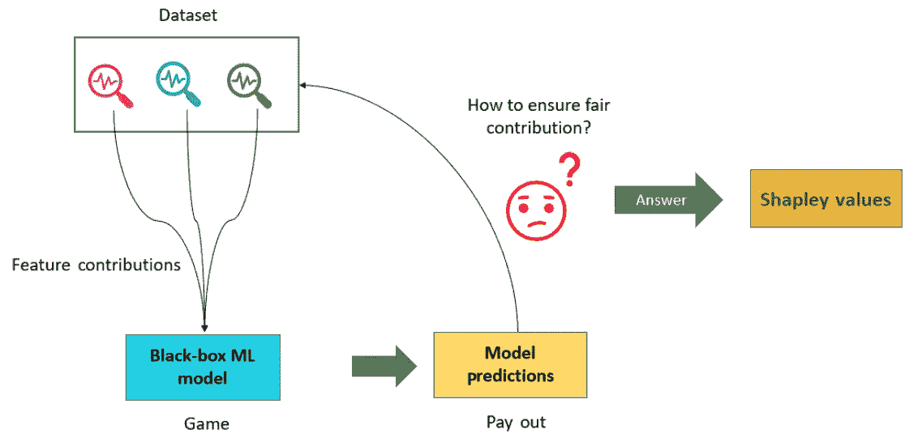

# 理解可解释人工智能中使用的 SHAP 和沙普利值的工作原理

> 原文：<https://towardsdatascience.com/understand-the-working-of-shap-based-on-shapley-values-used-in-xai-in-the-most-simple-way-d61e4947aa4e>

## 你还对 SHAP 和沙普利价值观的运作感到困惑吗？让我在本文中对 SHAP 值和沙普利值提供最简单直观的解释。

来源—[https://github.com/slundberg/shap](https://github.com/slundberg/shap)

[**【沙普利附加解释】**](https://amzn.to/3cY4c2h) ，这是另一个流行的 [**可解释 AI**(**【XAI)**](https://amzn.to/3cY4c2h)**框架，可以为表格、图像和文本数据集提供模型不可知的局部可解释性。**

****SHAP** 基于沙普利值，沙普利值是 [**博弈论**](https://c3.ai/glossary/data-science/shapley-values/) 中普遍使用的概念。尽管对 Shapley 值的数学理解可能很复杂，但我将提供对 **Shapley 值**和 **SHAP** 的简单、直观的理解，并更多地关注该框架的实际方面。在本文中，我将参考 SHAP 在《应用机器学习可解释技术》一书中提供的非常简单的解释，并推荐浏览 GitHub 库 https://GitHub . com/packt publishing/Applied-Machine-Learning-explability-Techniques/tree/main/chapter 06，以获得在 Python 中应用 SHAP 的实用代码示例[。](https://amzn.to/3cY4c2h)**

**<https://www.amazon.com/Applied-Machine-Learning-Explainability-Techniques/dp/1803246154?_encoding=UTF8&pd_rd_w=Wr6SJ&content-id=amzn1.sym.716a1ed9-074f-4780-9325-0019fece3c64&pf_rd_p=716a1ed9-074f-4780-9325-0019fece3c64&pf_rd_r=6P2PM599T97MRG7NZD9J&pd_rd_wg=m4qUW&pd_rd_r=6e349d93-5ba0-4bfe-9055-905c0153fe58&linkCode=li3&tag=adib0073-20&linkId=35506e1847de5c011fc57aa66c2b1d8e&language=en_US&ref_=as_li_ss_il>  

如果你想得到关于这本书的详细反馈，这个视频可能对你有用:

如果你对 XAI 概念不太熟悉，我强烈推荐你观看过去在 2021 年 APAC 人工智能加速器节上发表的关于 XAI 的演讲:

让我们现在就开始吧，不要耽搁！

# SHAP 值和沙普利值简介

**SHAP 框架**是由 **Scott Lundberg** 和 **Su-In Lee** 在他们的研究工作中提出的， [*解释模型预测*](https://arxiv.org/abs/1705.07874) 的统一方法。这是 2017 年发表的。SHAP 是基于合作博弈论中 Shapley 值的概念，它考虑了附加特征的重要性。

根据定义，Shapley 值是每个特征值对特征空间中所有可能值的平均*边际贡献。Shapley 值的数学理解很复杂，可能会让大多数读者感到困惑。也就是说，如果你有兴趣深入了解沙普利值的数学知识，我们建议你看看名为*“n 人游戏的价值”的研究论文《博弈论》投稿 2.28***(1953)****罗伊德·S·沙普利**。在下一节中，我们将通过一个非常简单的例子来直观地了解 Shapley 值。*

# 什么是沙普利价值观？

在这一节中，我将用一个非常简单易懂的例子来解释 Shapley 值。让我们假设 Alice、Bob 和 Charlie 是三个朋友，他们作为一个团队参加了一场 Kaggle 比赛，以解决给定的 ML 问题，并获得一定的现金奖励。他们的共同目标是赢得比赛，获得奖金。他们三个在 ML 的所有领域都同样不好，因此以不同的方式做出了贡献。现在，如果他们赢得了比赛并赢得了奖金，考虑到他们个人的贡献，他们将如何确保奖金的公平分配？他们将如何衡量自己对同一目标的贡献？这些问题的答案可以由 Shapley 值给出，Shapley 值是由 Lloyd Shapley 于 1951 年在 T21 提出的。

下图直观地展示了这种情况:

[作者图片](https://amzn.to/3cY4c2h)

因此，在这个场景中，Alice、Bob 和 Charlie 属于同一个团队，玩同一个游戏(即 Kaggle 竞赛)。在博弈论中，这被称为联盟博弈。比赛的奖金是他们的支出。因此，Shapley 值告诉我们每个玩家对确保公平分配的支出的平均贡献。但是为什么不在所有玩家之间平均分配奖金呢？嗯，既然贡献不对等，那么把钱平均分配就不公平了。

# 决定支出

现在，我们如何决定最公平的分配方式呢？一种方法是假设 Alice、Bob 和 Charlie 按顺序加入游戏，Alice 先开始，Bob 接着，Charlie 接着。让我们假设，如果爱丽丝、鲍勃和查理单独参与，他们将分别获得 10 分、20 分和 25 分。但如果爱丽丝和鲍勃联手，他们可能会得到 40 分。爱丽丝和查理一起可以得到 30 分，鲍勃和查理一起可以得到 50 分。当他们三个一起合作时，只有这样他们才能得到 90 分，这足以让他们赢得比赛。

该表说明了用于计算每个玩家的平均边际贡献的每个条件的分值

数学上，如果我们假设有 n 个玩家，其中 s 是玩家的联盟子集，𝑣(𝑆)是 s 个玩家的总价值，那么通过 Shapley 值的公式，玩家 I 的边际贡献给出如下:

参与人 I 的边际贡献等式

Shapley 值的等式可能看起来很复杂，但是让我们用我们的例子来简化它。请注意，每个玩家开始游戏的顺序很重要，因为 Shapley 值试图考虑每个玩家计算边际贡献的顺序。

现在，对于我们的示例，可以通过计算爱丽丝对最终得分可能造成的差异来计算爱丽丝的贡献。因此，贡献是通过计算爱丽丝在游戏中和不在游戏中得分的差异来计算的。

还有，当爱丽丝在玩的时候，她既可以独自玩，也可以和别人组队玩。当爱丽丝在玩的时候，她能创造的价值可以表示为𝑣(𝐴).同样，𝑣(𝐵)和𝑣(𝐶)表示鲍勃和查理创造的个人价值。现在，当 Alice 和 Bob 合作时，我们可以通过从总贡献中移除 Bob 的贡献来计算 Alice 的贡献。这可以用𝑣(𝐴、𝐵)–𝑣(𝐵来代表)。如果三个人一起玩，爱丽丝的贡献是𝑣(𝐴，𝐵，𝐶)–𝑣(𝐵，𝐶).

考虑到爱丽丝、鲍勃和查理玩游戏的序列的所有可能排列，爱丽丝的边际贡献是她在所有可能场景中个人贡献的平均值。

爱丽丝的沙普利值是考虑到所有可能的情况下她的边际贡献

因此，爱丽丝的总贡献将是她在所有可能情况下的边际贡献，这也恰好是沙普利值。对于爱丽丝来说，沙普利值是 **20.83** 。同样，我们可以计算 Bob 和 Charlie 的边际贡献，如下表所示:

爱丽丝、鲍勃和查理的边际贡献

我希望这不会太难理解！需要注意的一点是，Alice、Bob 和 Charlie 的边际贡献之和应该等于他们三个加在一起的总贡献。现在，让我们试着在 ML 的背景下理解 Shapley 值。

<https://www.amazon.com/Applied-Machine-Learning-Explainability-Techniques/dp/1803246154?_encoding=UTF8&pd_rd_w=Wr6SJ&content-id=amzn1.sym.716a1ed9-074f-4780-9325-0019fece3c64&pf_rd_p=716a1ed9-074f-4780-9325-0019fece3c64&pf_rd_r=6P2PM599T97MRG7NZD9J&pd_rd_wg=m4qUW&pd_rd_r=6e349d93-5ba0-4bfe-9055-905c0153fe58&linkCode=li3&tag=adib0073-20&linkId=35506e1847de5c011fc57aa66c2b1d8e&language=en_US&ref_=as_li_ss_il>  

# 沙普利值(ML)

为了理解 ML 中 Shapley 值对解释模型预测的重要性，我们将尝试修改我们用于理解 Shapley 值的关于 Alice、Bob 和 Charlie 的示例。我们可以将 Alice、Bob 和 Charlie 视为用于训练模型的数据集中存在的三个不同特征。因此，在这种情况下，玩家的贡献将是每个特性的贡献。游戏或 Kaggle 竞争将是黑盒 ML 模型，支出将是预测。因此，如果我们想知道每个特征对模型预测的贡献，我们将使用 Shapley 值。

在 ML 环境下理解 Shapley 值([图片作者](https://amzn.to/3cY4c2h)

因此，Shapley 值帮助我们理解每个特征对黑盒 ML 模型预测的结果的集体贡献。通过使用 Shapley 值，我们可以通过估计特征贡献来解释黑盒模型的工作。

# 摘要

在本文中，我们关注于理解 SHAP 框架对于模型可解释性的重要性。至此，您已经对沙普利价值观和 SHAP 有了很好的了解。如果你喜欢这篇文章，并想了解更多关于如何应用 SHAP 来解释 ML 模型的信息，我推荐阅读这本书: [**【应用机器学习可解释技术】**](https://amzn.to/3cY4c2h) 并探索 GitHub 资源库:[https://GitHub . com/packt publishing/Applied-Machine-Learning-explability-Techniques/tree/main/chapter 06](https://github.com/PacktPublishing/Applied-Machine-Learning-Explainability-Techniques/tree/main/Chapter06)以获得实际操作的代码示例。

<https://www.amazon.com/Applied-Machine-Learning-Explainability-Techniques/dp/1803246154?_encoding=UTF8&pd_rd_w=Wr6SJ&content-id=amzn1.sym.716a1ed9-074f-4780-9325-0019fece3c64&pf_rd_p=716a1ed9-074f-4780-9325-0019fece3c64&pf_rd_r=6P2PM599T97MRG7NZD9J&pd_rd_wg=m4qUW&pd_rd_r=6e349d93-5ba0-4bfe-9055-905c0153fe58&linkCode=li3&tag=adib0073-20&linkId=35506e1847de5c011fc57aa66c2b1d8e&language=en_US&ref_=as_li_ss_il>  

# 作者关于 TDS 的其他 XAI 相关文章:

1.  [用于在文本数据上训练的模型的可解释机器学习:将 SHAP 与变压器模型相结合](/explainable-machine-learning-for-models-trained-on-text-data-combining-shap-with-transformer-5095ea7f3a8)
2.  [EUCA——一个有效的 XAI 框架，让人工智能更贴近终端用户](/euca-an-effective-xai-framework-to-bring-artificial-intelligence-closer-to-end-users-74bb0136ffb1)

<https://www.amazon.com/Applied-Machine-Learning-Explainability-Techniques/dp/1803246154?_encoding=UTF8&pd_rd_w=Wr6SJ&content-id=amzn1.sym.716a1ed9-074f-4780-9325-0019fece3c64&pf_rd_p=716a1ed9-074f-4780-9325-0019fece3c64&pf_rd_r=6P2PM599T97MRG7NZD9J&pd_rd_wg=m4qUW&pd_rd_r=6e349d93-5ba0-4bfe-9055-905c0153fe58&linkCode=li3&tag=adib0073-20&linkId=35506e1847de5c011fc57aa66c2b1d8e&language=en_US&ref_=as_li_ss_il>  

# 参考

1.  Python SHAP 框架的 GitHub repo—【https://github.com/slundberg/shap 
2.  应用机器学习解释技术—【https://amzn.to/3cY4c2h 
3.  GitHub repo 自《应用机器学习可解释技术》——[https://GitHub . com/packt publishing/Applied-Machine-Learning-explability-Techniques/](https://github.com/PacktPublishing/Applied-Machine-Learning-Explainability-Techniques/)**