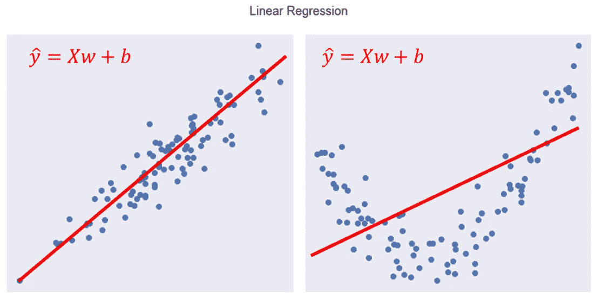
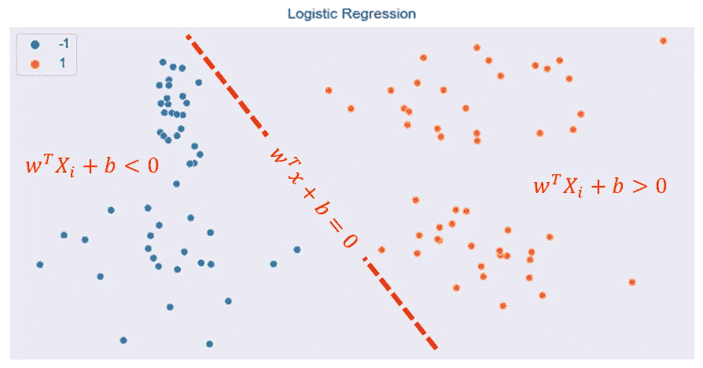
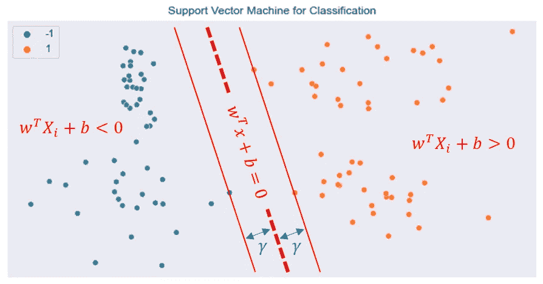
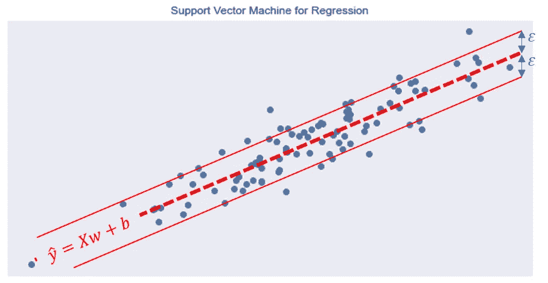
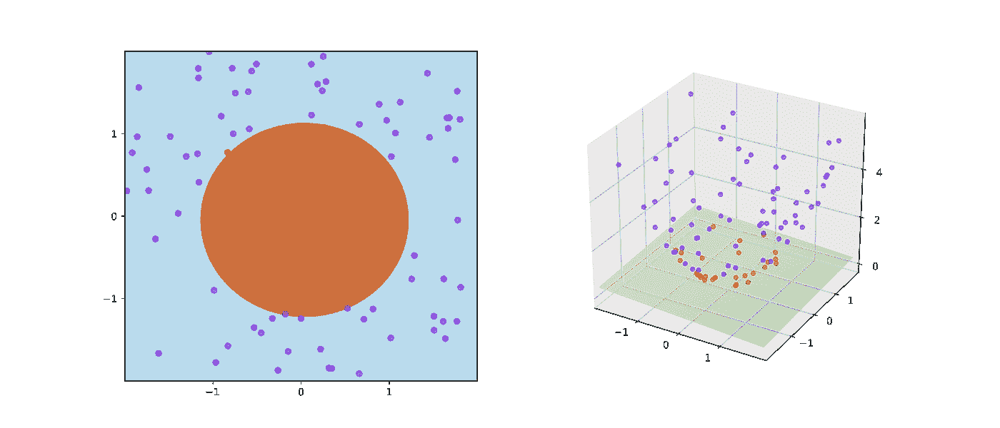
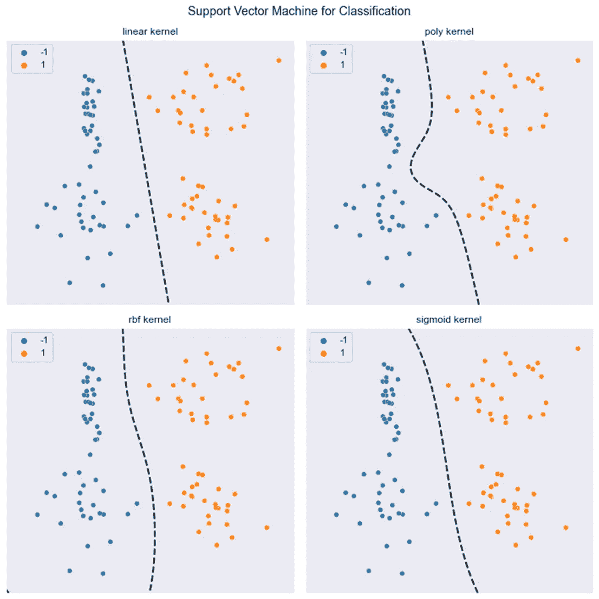
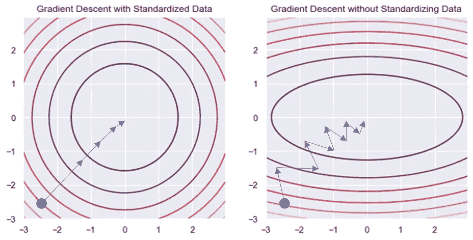

# 10 分钟内完成线性回归、逻辑回归和 SVM

> 原文：<https://towardsdatascience.com/understanding-3-classical-machine-learning-models-once-and-for-all-part-1-32a1ac52c0fd>

## 机器学习

## 线性回归与 logistic 回归和支持向量机有什么关系？

```
**Table of contents****·** [**So, how does machine learning work?**](#a1a6)
**·** [**Linear Models**](#ae6d)
  ∘ [Linear regression](#1e7e)
  ∘ [Ridge](#a70b)
  ∘ [Lasso](#5e73)
  ∘ [Elastic-Net](#cd6f)
**·** [**Logistic Regression**](#551b)
**·** [**Support Vector Machine (SVM)**](#3bbd)
  ∘ [Classification](#31cc)
  ∘ [Regression](#0286)
  ∘ [Kernel functions](#daf9)
**·** [**A note on preprocessing**](#0f82)
**·** [**Conclusion**](#2996)
```

机器学习建模是数据科学家的问题解决者。尽管它不会占用我们大部分的时间，但就个人而言，它比数据清理有趣得多。

坦率地说，一些模型在数学上是复杂的。好消息是，作为一名数据科学家，你不一定有能力从零开始构建机器学习模型。已经有太多的库可供选择，没有必要重新发明轮子。然而，从鸟瞰的角度了解模型是如何工作的总是好的。

# 那么，机器学习是如何工作的呢？


机器学习模型的内部运作|图片作者[作者](http://dwiuzila.medium.com/membership)

一般来说，所有有监督的机器学习模型的工作方式都是一样的:你有 ***输入数据*** *X* 和 ***输出数据*** *y* ，然后模型找到一个 ***映射*** 从 *X* 到 *y* 。这就是为什么机器学习被称为这样:不是我们故意编码将 *X* 映射到 *y* 的逻辑，而是模型通过更新其 ***参数*** 来自主学习。大多数车型还有 ***超参数*** ，即无法学习，需要用户整定的参数。

为了清楚起见，假设您有 *m* ***观察值*** 和 *n* ***特征*** ，并且您正在处理一个单输出任务。然后， *X* 是一个 *m × n* 矩阵，而 *y* 是一个大小为 *m* 的向量。为了学习从 *X* 到 *y* 的映射，模型必须使用 ***优化器*** 找到最佳参数，例如梯度下降、BFGS 等等。但是什么是最优呢？具体来说什么是最佳的？

你可以把“寻找最佳参数”的问题看作一个优化问题(是的，机器学习确实只是一个优化问题)。所以，你需要一个 ***目标函数*** ，或者在其他文献中也叫做 ***代价函数*** 。

成本函数根据模型和任务而不同。例如，对于预测参数为 *w* 的线性回归，常见的成本函数是*误差平方和*，表示为


当 *w* 最小化该成本函数时，找到最优 *w* 。

# 线性模型

在下面的线性模型和逻辑回归中，为了方便起见，我们省略了偏差系数 *b* 。偏差系数使我们的模型更通用，有两种方法可以添加它:

1.  通过在 *X* 中创建一列 1，因此 *X* 现在是一个 *m × (n+1)* 矩阵，并且 *w* 是一个大小为 *n+1* 的向量，符号 *Xw* 保持不变。
2.  通过将 *Xw* 显式更改为 *Xw + b* 。

## 线性回归

在线性回归中，目标值 *ŷ* 预计是特征的线性组合。换句话说，


如前所述，使用这个模型，你可以最小化*相对于 *w* 的误差平方和*，也就是说，



(**左**)线性回归模型与数据拟合得很好| ( **右**)线性回归模型与数据拟合得不太好|图片作者[作者](http://dwiuzila.medium.com/membership)

尽管形式简单，线性回归有一个问题。如果 *X* 中的一些特征是相关的，那么( *XᵀX* ) *⁻* 将接近奇异，并且 *w* 变得对误差高度敏感，导致过拟合。幸运的是，有一个变通办法:如果太大，给 *w* 一个惩罚。

这就产生了脊、套索和弹性网回归。

## 山脉

为了给 *w* 一个罚分，我们需要根据 *w* 向成本函数添加一个量，使得最小化成本函数也最小化这个量。所讨论的量是 *w* 的欧几里德范数(也称为 L2 范数)的平方乘以超参数 *α ≥ 0* 。目标变成了


基于这一目标，不鼓励模型过于复杂，并且倾向于将 *w* 向零收缩。 *α* 的值越大，收缩量越大，因此 *w* 对共线性变得更加稳健。

## 套索

有一个替代岭回归的方法。不是将 *w* 中的*所有*系数向零收缩，你的模型也可以学习将*部分*系数设置为零。只剩下一些非零系数，有效地减少了相关特性的数量。

目标变得出奇的容易。我们简单地将岭回归的成本函数中的 L2 范数的平方与 L1 范数交换如下


有了这种能力，套索回归也可用于特征选择，并通过选择非零系数来减少 *X* 的维度。然后，简化的数据可以用于另一个分类器/回归器。很容易看出， *α* 的值越高，选择的特征越少。

## 弹性网

也有可能获得脊和套索回归的优势。弹性网络在成本函数中具有 L1 和 L2 范数，允许学习稀疏模型，其中很少有系数像 lasso 一样非零，同时仍然保持 rigde 的正则化属性。现在的目标是


超参数 *0 ≤ ρ ≤ 1* 称为 L1 比，它控制着 L1 和 L2 范数的组合。请注意，如果 *ρ = 0* ，则物镜等效于 ridge 的物镜。另一方面，如果 *ρ = 1* ，那么这个目标就相当于 lasso 的。

以下是对相同数据应用线性模型的示例，其中 *X* 有 4 个特征，偏差 *b = 0* 。我们可以看到，ridge 将系数向零收缩，lasso 将第一个系数设置为零，而 elastic-net 就像是两者的组合。

```
Linear Regression
w = [ 2.7794 -11.3707  46.0162  32.4487]

Ridge
w = [ 2.2607  -9.8212  45.3181  31.9229]

Lasso
w = [-0\.      -2.4307  44.7832  31.3252]

Elastic-Net
w = [-0.2630  -2.1721  40.4175  27.8334]
```

从线性回归到弹性网络，模型具有更好的性能(更低的 RMSE)。请注意，这是*而不是*的情况。


线性模型的性能示例|图片作者[作者](http://dwiuzila.medium.com/membership)

# 逻辑回归

我们已经谈了很多关于回归的问题，所以让我们继续讨论分类。在二进制分类任务中， *y* 的每个元素 *yᵢ* 都是两个类中的一个，可以编码为-1 和 1。目标是


其中 *Xᵢ* 是垂直矢量形式的 *X* 的第 *i* 个观测值(行)。由于我们使用的是 [***逻辑函数***](https://en.wikipedia.org/wiki/Logistic_function) (在某些文献中也称为 sigmoid 函数)，因此该任务也称为逻辑回归。



逻辑回归寻找线性决策边界|图片作者[作者](http://dwiuzila.medium.com/membership)

我们将解释为什么这个成本函数有意义。固定一个观察点 *j* 。逻辑回归的工作方式是首先定义一个*决策边界*，在本例中为 0。如果 *Xⱼᵀw ≥ 0* ，则预测 *ŷⱼ = 1* 。否则，预测 *ŷⱼ = -1* 。现在…

*   如果 *yⱼ = 1* 和 *Xⱼᵀw* ≪ *0* ，那么这次观察的成本很大，因为


因此，该模型将更倾向于满足 *Xⱼᵀw ≥ 0* ，这预测了 *ŷⱼ = 1* ，并且符合观测值 *yⱼ = 1* 。

*   如果 *yⱼ = -1* 和 *Xⱼᵀw* ≫ *0* ，那么这个观测的成本就很大，因为


因此，模型将更倾向于满足 *Xⱼᵀw < 0* 预测 *ŷⱼ = -1* 并符合观察 *yⱼ = -1* 。

逻辑回归也可以支持 L1、L2 或两者正则化。

# 支持向量机(SVM)

## 分类

当我们看逻辑回归时，它能够为两个类别之间的任意 *x* 画出一个决策边界 *wᵀx + b = 0* 。直观上，如果判定边界与任何类别的最近训练数据点的距离最大，则判定边界实现了良好的分离，因为一般来说，边界越大，分类器的泛化误差越低(尤其是在可分离的类别中)。

如果你看一下文献，SVM 正试图通过最小化参数 w 的长度(L2 范数)来最大化余量。当我第一次看到这个的时候，我不知道为什么。事实证明，这一事实成立，因为许多数学操作和推理，这将在下文中探讨。



线性可分数据的 SVM 判定边界，边缘边界上的三个观察值称为“支持向量”|图片由[作者](http://dwiuzila.medium.com/membership)提供

因此，支持向量机的工作方式就像逻辑回归一样，只是稍微有点变化:符号( *wᵀXᵢ + b* )对于大多数观察值 *i* 来说应该是正确的，并且


越大越好。这叫做 ***功能余量*** 。让


现在，对于每个 *i = 1，2，…，m* ，让 *γᵢ* 是从每个观察值 *Xᵢ* 到判定边界的距离。从几何学上讲，由 [***简单代数***](https://en.wikipedia.org/wiki/Distance_from_a_point_to_a_line) ，我们有


或者以更紧凑的形式，


这叫做 ***几何余量*** 。设 *γ* 为所有距离中的最小值，


那么 SVM 的目标是在一些约束条件下找到 *γ* 的最大值，


由于将 *w* 和 *b* 乘以某个因子不会改变几何余量，我们可以找到 *w* 和 *b* 使得‖*w**= 1*。因此，不失一般性，目标变成


根据功能和几何余量的定义，目标变成


由于将 *w* 和 *b* 乘以某个因子不会改变符号( *wᵀXᵢ + b* )但会改变功能裕度，因此我们可以找到 *w* 和 *b* 使得功能裕度等于 1。因此，不失一般性，目标变成


因为‖ *w* ‖ *> 0* ，这相当于


上面的约束是理想的，表示一个完美的预测。但是类并不总是可以用判定边界完全分离的，所以我们允许一些观察值与它们正确的判定边界相距 *ξᵢ* 。超参数 *C* 控制这种惩罚的强度，并且因此充当逆正则化参数。最终目标是


就是这样！SVM 试图通过最小化参数 *w* 的长度来最大化余量。

## 回归

用于回归的 SVM 可以直接从分类中采用。我们不是希望 *yᵢ* ( *wᵀXᵢ + b* )尽可能大，而是希望|*yᵢ*-(*wᵀxᵢ+b*)|尽可能小，即误差 *ε* 尽可能小。再次利用逆正则化，我们有以下回归目标



回归作者 SVM |图片作者[作者](http://dwiuzila.medium.com/membership)

## 核函数

到目前为止，在我们预测输出数据 *y* 的方式中，我们只使用了输入数据 *X* 中特征的线性组合。对于逻辑回归和 SVM，这导致了线性决策边界。因此，对于不可线性分离的输入数据，该模型的性能很差。但是有一种方法可以改进。

我们可以通过映射*ϕ*:ℝ*ⁿ*→ℝ*ᵖ*将输入数据映射到**高阶特征空间**。在这个更高的维度中，通过正确的映射，数据有可能是可分离的。然后，我们通过我们的模型使用这些映射的数据。



训练数据被映射到一个 3 维空间，在那里可以容易地找到一个分离的判定边界。|图片出自[纪——自己的作品](https://commons.wikimedia.org/w/index.php?curid=60458994)

但是我们还有另一个问题。SVM 和许多其他机器学习模型可以用点积来表示，在高维映射数据中求解点积是非常昂贵的。幸运的是，我们有锦囊妙计:内核技巧<https://en.wikipedia.org/wiki/Kernel_method>*。*

**

*50×50 网格实数的核值可视化。我会把它留在这里，因为它看起来很美|图片作者[作者](http://dwiuzila.medium.com/membership)*

*核 *K* 是一个相似度函数。它是由我们映射数据的点积定义的。所以，如果我们有两个观察值 *x* 和 *y* 在ℝ *ⁿ* ，*

**

*通过内核技巧，我们可以在不访问高阶特征空间ℝ *ᵖ* 的情况下计算这个方程，见鬼，我们甚至不需要知道映射 *ϕ* 。因此，在我们的模型中计算点积不再昂贵。*

*一些常见的内核是:*

**

*非线性核允许模型学习更复杂的决策边界。核的所有参数都是模型的超参数。如果您将不同的核应用于我们用于分类的先前数据集，您将获得以下决策边界:*

**

*不同内核的 SVM 分类|图片作者[作者](http://dwiuzila.medium.com/membership)*

> *SVM 在高维空间和特征数量大于观察数量的情况下是有效的。许多不同的内核可供选择(或自己制作)，这使得 SVM 功能多样。*

*然而，如果特征的数量远大于观察的数量，在选择核和正则项时避免过度拟合是至关重要的。*

# *关于预处理的一个注记*

*总是有这样一个问题:“在将输入数据 *X* 输入到模型之前，我应该标准化/规范化它吗？”。讽刺的是，最满意的答案是“看情况”。*

*如果您的模型使用一元解析解，即 [***正规方程***](http://mlwiki.org/index.php/Normal_Equation) 进行线性回归，那么**不需要**进行标准化/规范化。你知道为什么吗？*

*假设你有一个比其他特征大几千倍的特征，而你没有标准化/规范化它。假设法线方程将该特定特征的系数设置为 *β* 。如果先标准化/归一化，正规方程会产生一个系数是 *β* 的几千倍。因此，特征的缩放和产生的系数相互抵消，模型随后给出相同的预测。*

*另一方面，如果您的模型使用迭代方法，即 [***梯度下降***](/complete-step-by-step-gradient-descent-algorithm-from-scratch-acba013e8420) 而不是标准方程，那么您希望首先标准化/规范化您的输入数据以加快收敛。*

**

*数据标准化对梯度下降算法的影响。标准化数据导致更快的收敛|图片作者[作者](http://dwiuzila.medium.com/membership)*

*另一个问题与**模型扩展**(非线性内核、正则化等)有关。例如，学习算法的成本函数中使用的许多元素(例如 SVM 的 **RBF 核或者线性模型**的 **L1 和 L2 正则化子)假设所有特征都以零为中心，并且具有相同顺序的方差。如果某个要素的方差比其他要素的方差大几个数量级，则它可能会在成本函数中占主导地位，并使估计者无法像预期的那样从其他要素中正确学习。因此，你**需要**来标准化。***

# *结论*

*你已经非常详细地学习了三个最基本的机器学习模型:**线性回归**、**逻辑回归**和 **SVM** 。现在，您不仅可以使用已建立的库来构建它，还可以自信地知道它们是如何从内到外工作的，使用它们的最佳实践，以及如何提高它们的性能。*

*恭喜你。*

**

*[Mukuko 工作室](https://unsplash.com/@mukukostudio?utm_source=medium&utm_medium=referral)在 [Unsplash](https://unsplash.com?utm_source=medium&utm_medium=referral) 拍摄的照片*

*以下是一些关键要点:*

1.  *线性回归有利于回归任务中的**基线**。*
2.  *正则化用于解决**过拟合**，有三种方法可用: **L1、L2 或两者都用**。*
3.  *尽管有他的名字，逻辑回归是用于**分类**任务的。它在两个类之间找到一个**线性判定边界**。*
4.  *直观地，如果决策边界具有到任何类别的最近训练数据点的最大距离，则逻辑回归给出较低的泛化误差。这正是 SVM 所做的。*
5.  *得益于内核函数，SVM 还通过允许**非线性决策边界**有效地将逻辑回归推向了一个新的高度。*
6.  *SVM 适用于高维空间以及特征数量大于观察数量的情况。*
7.  *SVM 的 RBF 核或线性模型的 L1 和 L2 正则化子假设**标准化**输入数据。*

*希望你学点东西:)*

**

*🔥你好！如果你喜欢这个故事，想支持我这个作家，可以考虑 [***成为会员***](https://dwiuzila.medium.com/membership) *。每月只需 5 美元，你就可以无限制地阅读媒体上的所有报道。如果你注册使用我的链接，我会赚一小笔佣金。**

*🔖*想了解更多关于经典机器学习模型如何工作以及如何优化其参数的信息？或者 MLOps 大型项目的例子？有史以来最优秀的文章呢？继续阅读:**

*

[艾伯斯·乌兹拉](https://dwiuzila.medium.com/?source=post_page-----32a1ac52c0fd--------------------------------)* 

## *从零开始的机器学习*

*[View list](https://dwiuzila.medium.com/list/machine-learning-from-scratch-b35db8650093?source=post_page-----32a1ac52c0fd--------------------------------)**8 stories********

[艾伯斯·乌兹拉](https://dwiuzila.medium.com/?source=post_page-----32a1ac52c0fd--------------------------------)* 

## *高级优化方法*

*[View list](https://dwiuzila.medium.com/list/advanced-optimization-methods-26e264a361e4?source=post_page-----32a1ac52c0fd--------------------------------)**7 stories********

[艾伯斯·乌兹拉](https://dwiuzila.medium.com/?source=post_page-----32a1ac52c0fd--------------------------------)* 

## *MLOps 大型项目*

*[View list](https://dwiuzila.medium.com/list/mlops-megaproject-6a3bf86e45e4?source=post_page-----32a1ac52c0fd--------------------------------)**6 stories********

[艾伯斯·乌兹拉](https://dwiuzila.medium.com/?source=post_page-----32a1ac52c0fd--------------------------------)* 

## *我最好的故事*

*[View list](https://dwiuzila.medium.com/list/my-best-stories-d8243ae80aa0?source=post_page-----32a1ac52c0fd--------------------------------)**24 stories********

艾伯斯·乌兹拉* 

## *R 中的数据科学*

*[View list](https://dwiuzila.medium.com/list/data-science-in-r-0a8179814b50?source=post_page-----32a1ac52c0fd--------------------------------)**7 stories*******