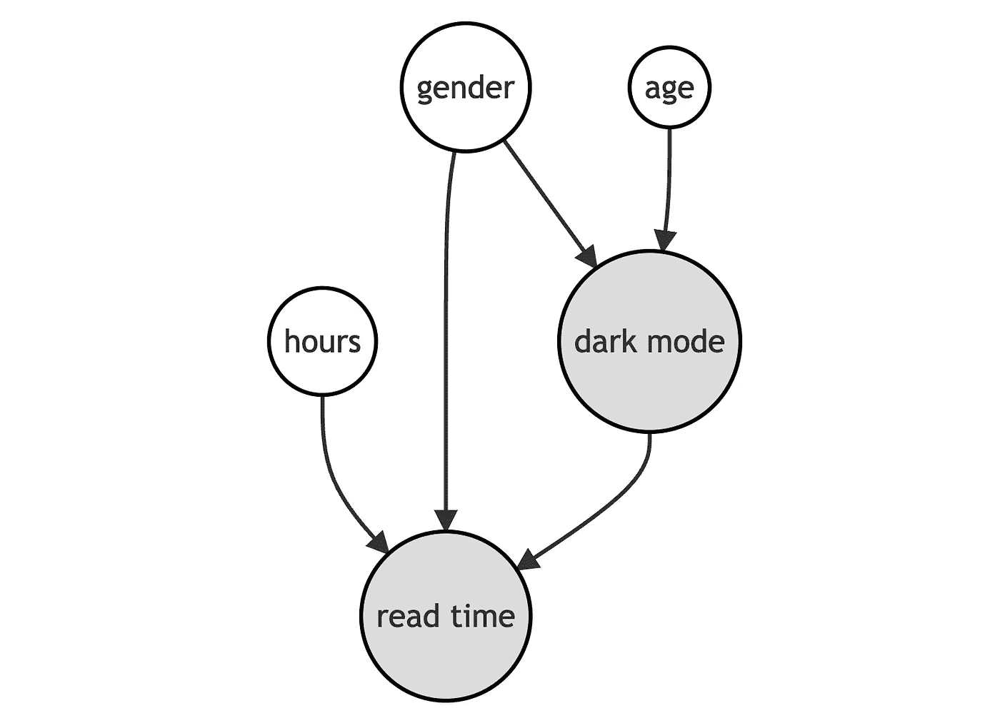
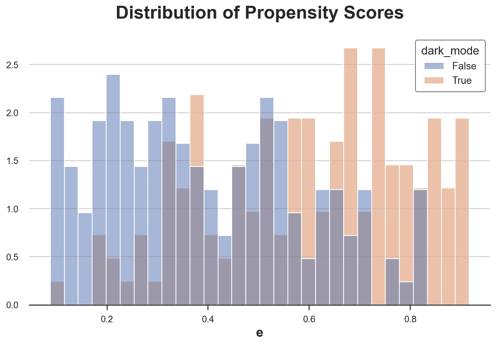
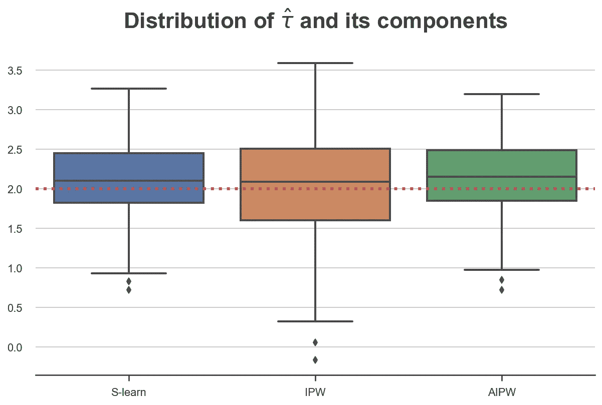

# 了解双重稳健估计量 AIPW

> 原文：<https://towardsdatascience.com/understanding-aipw-ed4097dab27a>

## [因果数据科学](https://towardsdatascience.com/tagged/causal-data-science)

## *模型错误设定下条件平均治疗效果(CATE)估计指南*


封面，图片来自我的好朋友[基亚拉·艾纳](https://chiaraaina.github.io/)

在估计因果关系时，黄金标准是**随机对照试验或 AB 测试**。通过随机将单位暴露于治疗，我们确保两组中的个体在平均水平上是可比较的，并且我们观察到的任何差异都可以单独归因于治疗效果。

然而，通常治疗组和对照组**并不完全可比**。这可能是由于随机化不完善或不可用的事实。出于伦理或实践的原因，我们并不总是能够随机选择治疗方法。即使我们可以，有时我们也没有足够的个人或单位来捕捉群体间的差异。这种情况经常发生，例如，当随机化不是在个体水平上进行，而是在更高的聚集水平上进行时，例如，邮政编码、县甚至州。

在之前的[帖子](/99bf5cffa0d9)中，我介绍并比较了一系列从观察或实验数据中计算**条件平均治疗效果(CATE)** 的方法。在给定治疗和可观察特征的情况下，这些方法中的一些要求研究者指定和估计感兴趣的结果的分布(例如[元学习者](/8a9c1e340832))。其他方法要求研究人员根据可观察的特征(例如 [IPW](/99bf5cffa0d9) )指定和估计被治疗的概率。

在这篇文章中，我们将看到一个程序，它结合了两种方法，并且对两种模型的错误设定都是鲁棒的(T21):增强逆概率加权估计(AIPW)。


融合，gif 由作者剪切

**TLDR；** AIPW 是 IPW 和元学习者两者的概括，比他们每一个都好用！

# 例子

假设我们有一个关于统计和因果推理的博客😇。为了改善用户体验，我们正在考虑**发布一个黑暗模式**，我们想了解这个新功能是否会增加用户在我们博客上花费的时间。

这个例子是从我上一篇关于估计条件平均治疗效果(CATE)的文章中借用的。你可以在这里找到[原帖](/99bf5cffa0d9)。如果你记得设置，你可以跳过这个介绍。


不使用和使用黑暗模式的博客外观，由作者提供的图像

我们不是一家成熟的公司，因此我们不进行 AB 测试，而是简单地发布黑暗模式，我们观察用户是否选择它以及他们在博客上花费的时间。我们知道可能会有**选择**:偏好黑暗模式的用户可能会有不同的阅读偏好，这可能会使我们的因果分析变得复杂。

我们可以用下面的 [**有向无环图(DAG)**](/b63dc69e3d8c) 来表示数据生成过程。



数据生成过程的 DAG，按作者排序的图像

我们使用来自`[src.dgp](https://github.com/matteocourthoud/Blog-Posts/blob/main/notebooks/src/dgp.py)`的数据生成过程`dgp_darkmode()`生成模拟数据。我还从`[src.utils](https://github.com/matteocourthoud/Blog-Posts/blob/main/notebooks/src/utils.py)`引进了一些绘图函数和库。

```
from src.utils import *
from src.dgp import dgp_darkmodedgp = dgp_darkmode()
df = dgp.generate_data()
df.head()
```


数据快照，图片由作者提供

我们有 300 名用户的信息，我们观察他们是否选择了`dark_mode`(治疗)、他们每周的`read_time`(感兴趣的结果)以及一些特征，如`gender`、`age`和以前在博客上花费的总`hours`。

我们想估计一下新的`dark_mode`对用户`read_time`的影响。作为第一种方法，我们可能天真地将效果计算为平均值的差异，假设治疗和对照样本是可比的。我们可以通过在`dark_mode`上回归`read_time`来估计均值的差异。

```
smf.ols("read_time ~ dark_mode", data=df).fit().summary().tables[1]
```


线性回归结果，图片由作者提供

选择`dark_mode`的人平均每周花在博客上的时间少了 0.44 小时。我们应该断定`dark_mode`是一个**坏主意**吗？这是因果关系吗？

问题是我们做了**而不是**运行 [**AB 测试**](https://de.wikipedia.org/wiki/A/B-Test) 或随机对照试验，因此选择了`dark_mode`的用户可能无法与没有选择的用户直接**比较**。我们能证实这种担忧吗？部分地。在我们的设置中，我们只能检查我们观察到的特征、`gender`、`age`和总计`hours`。我们无法检查用户是否在我们没有观察到的其他维度上存在差异。

让我们使用优步`[causalml](https://causalml.readthedocs.io/)`包中的`create_table_one`函数来生成一个**协变量平衡表**，包含我们在治疗组和对照组中可观察特征的平均值。顾名思义，这应该永远是你在因果推断分析中呈现的第一张表。

```
from causalml.match import create_table_one

X = ['male', 'age', 'hours']
create_table_one(df, 'dark_mode', X)
```


平衡表，作者图片

治疗组(`dark_mode`)和对照组之间似乎有**一些差异**。特别是，选择`dark_mode`的用户年龄较大，花在博客上的时间较少，他们更有可能是男性。

我们能做什么？如果我们假设治疗组和对照组之间的所有差异都是**可观察的**，我们可以通过执行**条件分析**来解决问题。

# 条件分析

我们假设对于一组主题 *i = 1，…，n* ，我们观察到一个元组 *(Dᵢ，Yᵢ，Xᵢ)* 包括

*   一个治疗分配 *Dᵢ ∈ {0，1}* ( `dark_mode`)
*   一个回应 *Yᵢ ∈ ℝ* ( `read_time`)
*   一个特征向量 *Xᵢ ∈ ℝⁿ* ( `gender`、`age`和`hours`)

我们感兴趣的是**估计条件平均治疗效果(CATE)** 。


条件平均治疗效果(CATE)，图片由作者提供

其中 *Yᵢ* ⁽ᵈ⁾表示个体 *i* 在治疗状态 *d* 下的潜在结果。我们还做了以下假设。

**假设 1:未发现**(或可忽略，或可观的选择)


无根据假设，作者的图像

即以可观察的特征 *X* 为条件，治疗分配 *D* 几乎是随机的。我们实际假设的是，没有其他我们没有观察到的特征会影响用户是否选择`dark_mode`和他们的`read_time`。这是一个强有力的假设，我们观察到的个人特征越多，这个假设就越有可能得到满足。

**假设 2:重叠**(或共同支撑)


重叠假设，作者图片

即没有观察结果被确定地分配给治疗组或对照组。这是一个更技术性的假设，基本上意味着对于任何级别的`gender`、`age`或`hours`，都可能存在选择`dark_mode`的个体和不选择`dark_mode`的个体。与未发现假设不同，总体假设是**可检验的**。

**假设 3:稳定单位治疗值(SUTVA)**


稳定单位治疗值假设(SUTVA)，作者图片

即潜在的结果不取决于治疗状态。在我们的例子中，我们排除了另一个用户选择`dark_mode`可能会影响我的`dark_mode`对`read_time`的影响。违反 SUTVA 的最常见的情况是存在**网络效应**:如果我的一个朋友使用一个社交网络，会增加我使用它的效用。

## IPW 和元学习者

执行条件分析的两种替代方法是

这两个替代程序利用了我们以不同方式观察个体特征 *X* 的事实:

1.  IPW 利用 *X* 来预测治疗分配 *D* 并估计**倾向得分***e(x)=𝔼[d|x】*
2.  元学习者利用 *X* 来预测反事实结果 *Y* ⁽ᵈ⁾并估计**响应函数**μ⁽ᵈ⁾*(x)*=*𝔼[y|d，x】*

我们能不能把这两个过程结合起来，从而两全其美呢？

是的，使用 **AIPW 或双稳健估计器**。

# AIPW 估计量

**增强的反向倾向加权**估计量由下式给出


AIPW 估算器，作者图片

其中 *μ* ⁽ᵈ⁾ *(x)* 为**反应函数**，即结果的期望值，以可观察特征 *x* 和治疗状态 *d* 为条件， *e(x)* 为**倾向得分**。


响应函数和倾向得分，按作者分类的图像

AIPW 估计量的公式乍一看似乎非常神秘，所以让我们深入研究并试图理解它。

## 分解

理解 AIPW 公式的最好方法是**将**分解成两部分。

**第一种方式**是将 AIPW 估计器分解成一个 [**S-learner 估计器**](/8a9c1e340832) 和一个调整因子。


第一次 AIPW 分解，图片作者

在哪里


第一次 AIPW 分解的详细信息，图片由作者提供

这种调整实质上是对 S 学习器的**残差**执行的 IPW 估计器。

**第二种方式**将 AIPW 估算器分解成 **IPW 估算器**和一个调整因子。


第二次 AIPW 分解，作者图片

在哪里


第二次 AIPW 分解的详细信息，图片由作者提供

该调整本质上是一个由剩余治疗概率加权的 S-学习器估计器。

## 双重鲁棒性

为什么 AIPW 估算器如此引人注目？原因是它只需要两个预测 *μ̂* 或 *ê* 中的一个是正确的，以便**无偏**(即平均正确)。让我们检查一下。

如果 *μ̂* 指定正确，即𝔼[*μ̂*⁽ᵈ⁾*(x)**=*𝔼[*yᵢ| xᵢ=x，Dᵢ=d* ，那么*τ\̘*aipw 是无偏的，**即使***e\792;*拼写错误。


倾向分数错误设定下的 AIPW 无偏性，作者图片

**直觉**是，如果 *μ̂* 被正确指定， *τ̂* S-learn 是**无偏的**并且调整因子**消失**，因为残差*(yᵢ−μ̂*【⁽ᵈ⁾*(xᵢ)*收敛到零。

另一方面，如果 *ê* 被正确指定，即𝔼[*ê(x)*]= 𝔼[*dᵢ=1 | xᵢ=x*，那么 *τ̂* AIPW 是无偏的，**即使** *μ̂* 被错误指定。


响应函数错误设定下的 AIPW 无偏性，图片由作者提供

**直觉**是，如果 *ê* 被正确指定，*τ̂*ipw**无偏**，并且调整因子**消失**，因为残差 *(Dᵢ−ê (Xᵢ))* 收敛到零。

## 最佳实践

下面是实现 AIPW 估计器时的最佳实践列表(有些更通用)。

**1。检查协变量平衡**

IPW 和 AIPW 都是为治疗 *D* 不是无条件随机分配，而是可能依赖于一些可观察的 *X* 的设置而构建的。可以通过两种方式检查该信息:

1.  制作平衡表，总结各治疗组的协变量。如果无条件随机化不成立，我们期望在一些可观察的方面看到显著的差异
2.  画出估计的倾向分数。如果无条件随机化成立，我们期望倾向得分是常数

**2。检查重叠假设**

我们可以检查的另一个假设是**重叠**假设。为了检验这个假设，我们可以简单地检验预测倾向得分的界限。如果重叠假设被违反，我们最终将估计量的某些项除以零。

**3。使用十字接头**

每当我们建立一个预测时，当估计响应函数 *μ̂* ⁽ᵈ⁾ *(Xᵢ)* 或倾向得分*ê(xᵢ*时，最好的做法是排除观察值 *i* 。这个程序在机器学习文献中一般称为 [**交叉拟合**](https://en.wikipedia.org/wiki/Cross-validation_(statistics)) 。虽然有许多可能的方法来执行交叉拟合，但最简单的方法如下:

1.  将样本随机分成两份
2.  用样本 1 估计 *μ̂* ⁽ᵈ⁾ *(x)* 和*ê(x*
3.  使用样本 2 估计 *τ̂₁* AIPW
4.  重复(2)和(3)交换样本以估计 *τ̂₂* AIPW
5.  计算 *τ̂* AIPW 作为两个估计值的平均值

步骤(2)和(3)确保估计器是**而不是过拟合**。步骤(4)和(5)确保估计器是**有效的**，使用所有步骤的所有数据，而不仅仅是一半。 [Kennedy (2022)](https://arxiv.org/abs/2004.14497) 表明这种方法比现有方法产生更精确的估计，并提供关于误差界限的正式结果。特别是，他们的主要结果如下:

> 定理 2 中给出的 DR-Learner 误差的界限表明，它最多只能偏离 oracle 误差一个(平滑的)倾向得分和回归估计量的误差乘积，因此即使当 NUS ance 估计以较慢的速率收敛时，也允许以较快的速率估计 CATE。重要的是，结果与所用的方法无关，不需要特殊的调整或不必要的修饰。

# 回到数据

现在，让我们在博客阅读时间和黑暗模式的数据集中构建和探索 AIPW 估计器。

## 倾向得分

首先，我们来估计一下**倾向得分** *e(X)* 。

```
def estimate_e(df, X, D, model_e):
    e = model_e.fit(df[X], df[D]).predict_proba(df[X])[:,1]
    return e
```

我们使用`sklearn`包中的`LogisticRegression`方法，通过[逻辑回归](https://en.wikipedia.org/wiki/Logistic_regression)来估计它们。

```
from sklearn.linear_model import LogisticRegression

df['e'] = estimate_e(df, X, "dark_mode", LogisticRegression())
```

让我们通过绘制治疗组和对照组的估计倾向得分来检查是否满足**有界支持**假设。

```
sns.histplot(data=df, x='e', hue='dark_mode', bins=30, stat='density', common_norm=False).\
    set(ylabel="", title="Distribution of Propensity Scores");
```



倾向得分的分布在两组之间是不同的，但它通常是重叠的。

我们现在可以使用倾向分数来构建 IPW 估计量。

```
w = 1 / (e * df["dark_mode"] + (1-e) * (1-df["dark_mode"]))
smf.wls("read_time ~ dark_mode", weights=w, data=df).fit().summary().tables[1]
```


IPW 回归结果，图片由作者提供

请注意，计算出的标准误差并不精确，因为我们忽略了来自倾向得分估计的额外不确定性 *e(x)* 。

## 响应函数

现在让我们来估计 AIPW 估计器的第二个构件:**响应函数** *μ(x)* 。

```
def estimate_mu(df, X, D, y, model_mu):
    mu = model_mu.fit(df[X + [D]], df[y])
    mu0 = mu.predict(df[X + [D]].assign(dark_mode=0))
    mu1 = mu.predict(df[X + [D]].assign(dark_mode=1))
    return mu0, mu1
```

先用线性回归估计 *μ(x)* 吧。

```
from sklearn.linear_model import LinearRegression

mu0, mu1 = estimate_mu(df, X, "dark_mode", "read_time", LinearRegression())
print(np.mean(mu1-mu0))1.3858099131476969
```

我们已经将平均治疗效果的元学习者估计值计算为两个估计响应函数 *μ* ⁽ ⁾ *(x)* 和 *μ* ⁽⁰⁾ *(x)* 之间的均值差。

**注意**我们可以使用任何估计量来获得响应函数，为了简单起见，我使用了线性回归。

## 估计 AIPW

我们现在有了**计算 AIPW 估计量的所有构件**！

```
aipw = mu1 - mu0 + df["dark_mode"] / e * (df["read_time"] - mu1) - (1-df["dark_mode"]) / (1-e) * (df["read_time"] - mu0)
print(np.mean(aipw))1.3153774511905783
```

我们也可以使用微软`[EconML](https://econml.azurewebsites.net/index.html)`库中的`LinearDRLearner`函数直接计算。

```
from econml.drlearner import LinearDRLearner

model = LinearDRLearner(model_propensity=LogisticRegression(), 
                        model_regression=LinearRegression(),
                        random_state=1)
model.fit(Y=df["read_time"], T=df["dark_mode"], X=df[X]);
```

模型直接给我们平均治疗效果。

```
model.ate_inference(X=df[X].values, T0=0, T1=1).summary().tables[0]
```


AIPW 评估结果，图片由作者提供

该估计在统计上不同于零，并且置信区间包括真值 2。

**注意**我们得到了一个不同的估计，因为`LinearDRLearner`函数也在后台执行**交叉拟合**，这是我们以前没有做过的。

## 评价

现在让我们来评估 AIPW 估计器的主要特性:它的**双重鲁棒性**。为此，我们将它与它的两个双亲:IPW 估计器和 S 学习器进行比较。

我们使用`[joblib](https://joblib.readthedocs.io/en/latest/)`库来并行运行模拟，并加快进程。

首先，假设我们对两个模型都使用**所有变量**,*μ(x)*和 *e(x)* 。在这种情况下，两个模型都是**良好指定的**，我们期望所有的估计器都表现良好。

我们绘制了 100 次模拟中三个估计量的分布。

```
simulate_estimators(X_e=X, X_mu=X, D="dark_mode", y="read_time")
```



事实上，所有的估计都是无偏的，并且给出非常相似的估计。

如果我们错误地指定了两个模型中的一个会怎么样？让我们首先(正确地)假设`gender`和`age`影响选择`dark_mode`的概率，并(错误地)假设只有先前的`hours`影响每周的`read_time`。在这种情况下，倾向得分 *e(x)* 被很好地指定，而响应函数 *μ(x)* 被错误地指定。

```
simulate_estimators(X_e=['male', 'age'], X_mu=['hours'], D="dark_mode", y="read_time")
```


不出所料，S-learner 有偏见，因为我们拼错了 *μ(x)* ，而 IPW 没有。AIPW 选择两个世界中最好的**并且不偏不倚。**

**现在让我们来探究另一种**错误设定**。我们(错误地)假设只有`age`影响选择`dark_mode`的概率，并且(正确地)假设`gender`和之前的`hours`都影响每周的`read_time`。在这种情况下，倾向得分 *e(X)* 被错误指定，而响应函数 *μ(x)* 被正确指定。**

```
simulate_estimators(['age'], ['male', 'hours'], D="dark_mode", y="read_time")
```

****

**在这种情况下，S-learner 是无偏的，而 IPW 不是，因为我们错误地指定了 *e(X)* 。同样，AIPW 选择了两个世界中最好的**并且没有偏见。****

# ****结论****

****在本文中，我们已经看到了一种估计条件平均治疗效果(CATE)的方法，即**对模型设定错误**具有鲁棒性的方法:增强型反向倾向加权(AIPW)估计器。AIPW 估计器从现有的两种估计器中取长补短:IPW 估计器和 S 学习器。它需要估计倾向得分函数𝔼[D *|X* 和响应函数𝔼[ *Y|X，D* ，并且它是**无偏的**，即使两个函数中的一个被错误指定。****

****这个估计器现在是一个标准，它包含了所有最重要的因果推理包，如微软的 [EconML](https://econml.azurewebsites.net/) ，优步的 [causalml](https://causalml.readthedocs.io/) 和斯坦福研究人员的 R 包 [grf](https://grf-labs.github.io/grf/) 。****

## ****参考****

****[1] J. Robins，A. Rotzniski，J. P. Zhao，[某些回归变量不总是被观测时回归系数的估计](https://www.tandfonline.com/doi/abs/10.1080/01621459.1994.10476818) (1994)，*美国统计协会杂志*。****

****[2] A. Glyn，K. Quinn，[增广逆倾向加权估计量介绍](https://www.cambridge.org/core/journals/political-analysis/article/abs/an-introduction-to-the-augmented-inverse-propensity-weighted-estimator/4B1B8301E46F4432C4DCC91FE20780DB) (2010)，*政治分析*。****

****[3] E. Kennedy，[对异质因果效应的最优双重稳健估计](https://arxiv.org/abs/2004.14497) (2022)，*工作论文*。****

## ****相关文章****

*   ****[Dag 和控制变量](/b63dc69e3d8c)****
*   ****匹配、加权还是回归？****
*   ****[了解元学习者](/8a9c1e340832)****

## ****密码****

****你可以在这里找到 Jupyter 的原始笔记本:****

****[](https://github.com/matteocourthoud/Blog-Posts/blob/main/notebooks/aipw.ipynb) [## Blog-Posts/aipw . ipynb at main matter courthoud/Blog-Posts

### 我的中型博客文章的代码和笔记本。为 matteocourthoud/Blog-Posts 的发展作出贡献

github.com](https://github.com/matteocourthoud/Blog-Posts/blob/main/notebooks/aipw.ipynb)**** 

## ****感谢您的阅读！****

*****我真的很感激！*🤗*如果你喜欢这个帖子并想看更多，可以考虑* [***关注我***](https://medium.com/@matteo.courthoud) *。我每周发布一次与因果推断和数据分析相关的主题。我尽量让我的帖子简单而精确，总是提供代码、例子和模拟。*****

*****还有，一个小小的* ***免责声明*** *:我写作是为了学习所以出错是家常便饭，尽管我尽了最大努力。当你发现他们的时候，请告诉我。也很欣赏新话题的建议！*****