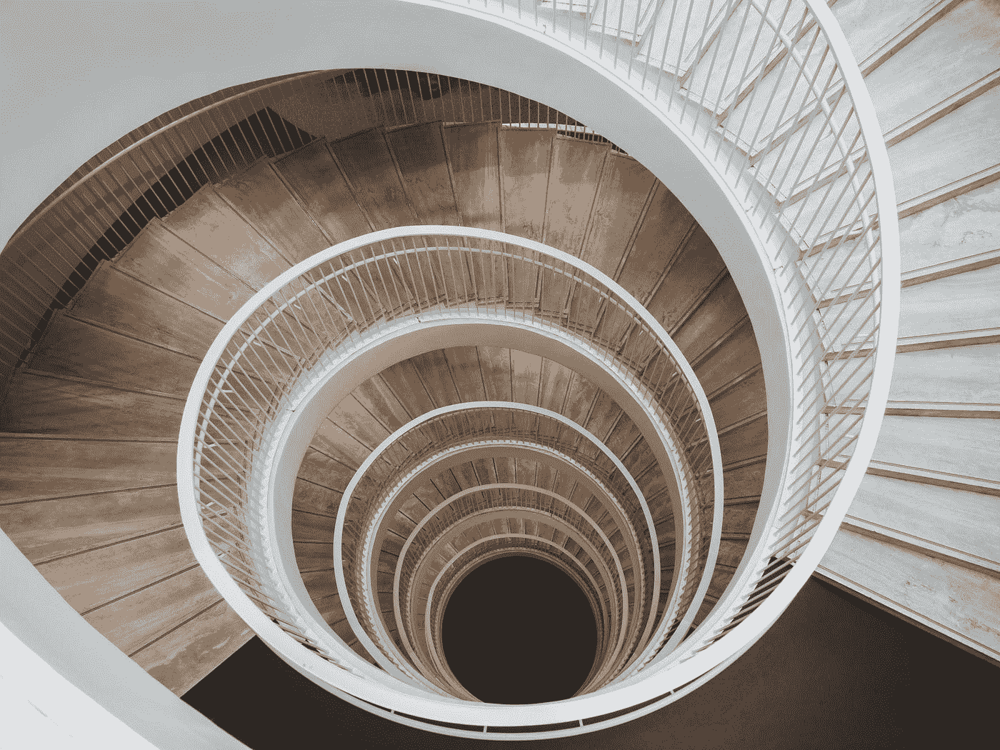
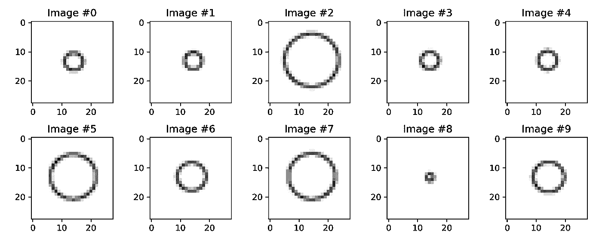
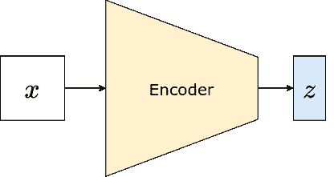
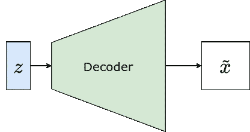
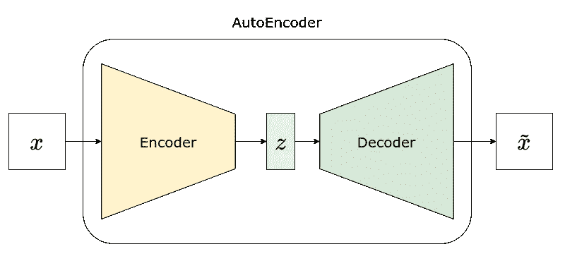
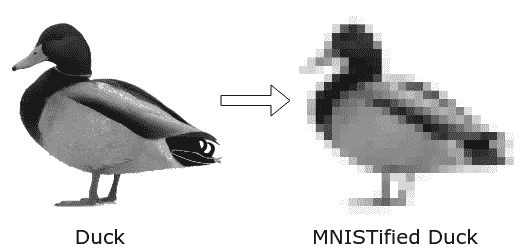
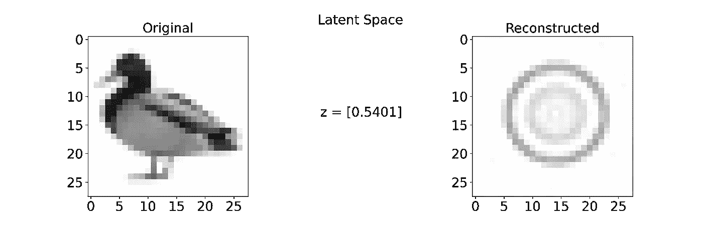

# 通过示例了解自动编码器:分步指南

> 原文：<https://towardsdatascience.com/understanding-autoencoders-with-an-example-a-step-by-step-tutorial-693c3a4e9836>

## 第一部分:普通自动编码器



Natalya Letunova 在 [Unsplash](https://unsplash.com?utm_source=medium&utm_medium=referral) 上的照片

# 介绍

**自动编码器很酷！**例如，它们可以用作*生成模型*，或者用作*异常检测器*。

此外，自动编码器背后的想法实际上非常简单:我们采用**两个模型**，一个**编码器**和一个**解码器**，并在它们中间放置一个“ ***瓶颈*** ”。然后，我们给它**相同的数据作为输入和输出**，因此自动编码器同时**学习输入的压缩表示**(这是编码器将做的)，以及**如何从该表示重构输入**(这是解码器将做的)。

看起来很简单，对吧？

然而，自动编码器的**实现细节**，**是** **许多**并且需要你密切注意以使它们正确。因此，我们从一个简单的*合成数据集*(我们将在整个系列中使用它)和一个*普通自动编码器(AE)开始这个系列的两篇文章。*

在第二篇文章中，我们将使用*变分自动编码器*、*重新参数化技巧*、 *Kullback-Leibler 发散/损失*和*卷积变分自动编码器(CVAEs)。*

我们邀请您在使用 Google Colab 运行随附笔记本的同时阅读这一系列文章，随附笔记本可从 my GitHub 的“[随附笔记本](https://github.com/dvgodoy/AccompanyingNotebooks)”存储库中获得:

[](https://colab.research.google.com/github/dvgodoy/AccompanyingNotebooks/blob/main/Understanding%20AutoEncoders.ipynb)  

此外，我构建了一个*目录*来帮助你浏览两篇文章的主题，如果你把它作为一个**迷你课程**并且一次一个主题地浏览内容的话。

# 目录

## 第一部分:普通自动编码器(本文)

*   [一个类似 MNIST 的圆形数据集](https://medium.com/p/693c3a4e9836#d28b)
*   [编码器](https://medium.com/p/693c3a4e9836#9828)
*   [潜在空间](https://medium.com/p/693c3a4e9836#dc2a)
*   [解码器](https://medium.com/p/693c3a4e9836#bcda)
*   [损失函数](https://medium.com/p/693c3a4e9836#1fef)
*   [自动编码器(AE)](https://medium.com/p/693c3a4e9836#4600)
*   奖励:[自动编码器作为异常检测器](https://medium.com/p/693c3a4e9836#1e0c)

## 第二部分:可变自动编码器

*   [变分自动编码器(VAE)](https://medium.com/p/a79d2ea2945e#0e6a)
*   [重新参数化技巧](https://medium.com/p/a79d2ea2945e#19b6)
*   [库尔贝克-莱布勒分歧/损失](https://medium.com/p/a79d2ea2945e#3443)
*   [损失规模](https://medium.com/p/a79d2ea2945e#13ed)
*   [卷积变分自动编码器(CVAE)](https://medium.com/p/a79d2ea2945e#a1e5)

# 一个类似 MNIST 的圆形数据集

手写数字的 MNIST 数据库(*修改的* [*国家标准与技术研究所*](https://en.wikipedia.org/wiki/National_Institute_of_Standards_and_Technology) *数据库*)是使用图像作为输入的教程的首选数据集。这些单通道(灰度)图像的尺寸缩小到 28x28 像素，非常适合快速训练计算机视觉模型。

在本教程中，我们将保持使用 28x28 像素图像的悠久传统，但我们将生成一个比传统 MNIST 更简单的合成数据集-一个由不同大小的圆组成的数据集:



一个由不同大小的圆组成的类似 MNIST 的数据集。图片作者。

为了生成这些圆，我们将使用 Matplotlib 在图形上绘制它们，然后使用 PIL 将这些图形转换为灰度图像，调整为典型的 28x28 大小。靠近中心(坐标 0.5，0.5)画圆，每个圆的半径在 0.03 到 0.47 之间。

生成类似 MNIST 的圆形数据集

在生成 1000 个圆的图像后，我们将构建一个 **TensorDataset** ，其中**像素值(现在在范围【0.0，1.0】内)是特征**，半径是标签；以及一个数据加载器，用于在训练我们的模型时加载小批量数据。

那么，让我们开始吧！

# 编码器

编码器的作用是**将一个输入**(***x***)—784 像素(在我们的例子中是 28 x28)—**映射到一个压缩表示**，也就是一个矢量。这个向量通常用字母 ***z*** 表示，可以是你想要的任何大小。

在我们这个简单的例子中，我们将使用一个大小为 1 的向量，也就是说，每幅图像将被赋予一个值，并且只有一个值。



将输入( **x** )编码成压缩表示( **z** )。图片作者。

> "为什么向量的大小只有一个？"

这种选择背后的原因有两个:首先，它将使可视化更容易(例如，绘制直方图，沿单一维度重建图像)；第二，我还没有告诉你第二个原因(这将是一个主要的剧透)，因为你会在后面的“潜在空间分布(AE)”部分找到答案

因此，我们需要一个模型，它获取一幅图像并输出一个包含单个值的向量( ***z*** )。下面的模型做到了这一点——它将图像展平为 784 像素/特征，通过两个完全连接的隐藏层，最终输出一个值。

```
Encoder(
  (base_model): Sequential(
    (0): Flatten(start_dim=1, end_dim=-1)
    (1): Linear(in_features=784, out_features=2048, bias=True)
    (2): LeakyReLU(negative_slope=0.01)
    (3): Linear(in_features=2048, out_features=2048, bias=True)
    (4): LeakyReLU(negative_slope=0.01)
  )
  (lin_latent): Linear(in_features=2048, out_features=1, bias=True)
)
```

请注意，我将**输出层(** `**lin_latent**` **)** 与“基础”模型分开。目前看起来这似乎是一个没有区别的区别，但是当我们在本系列的第二篇文章中处理*变型自动编码器*时，你会理解这个选择背后的原因。请原谅我。

此外，请记住，这个模型只是一个例子，它可以更简单，或更深入，甚至是一个卷积神经网络(我们将在第二篇文章中再次讨论)。

现在，让我们看看代码中的模型:

然后，让我们对数据集中的 7 号图像进行编码:

```
x, _ = circles_ds[7]
z = encoder(x)
z**Output:
tensor([[-0.1314]], grad_fn=<AddmmBackward>)**
```

这是一个大小为 1 的向量( ***z*** )。那是我们的…

# 潜在空间

**潜在空间就是我们上一节讲过的矢量( *z* )** 。就是这样！向量中的每个元素代表所谓的潜在空间中的一个维度。但是不要被行话吓倒，说到底，潜在空间只是一个矢量。


潜在空间( **z** ) —一个向量。图片作者。

而且，**你要决定矢量的大小 *z*** ！请记住，随着潜在空间维数的增加(即向量的长度)，重构的输入更有可能接近原始输入。

> "我如何选择潜在空间的**尺寸**？"

自动编码器背后的一般思想是通过“*瓶颈*”效应获得数据的**压缩表示，因此唯一合理的是**潜在空间的大小应当比输入**的大小*小*。**

在我们的例子中，输入是包含 784 个像素/值的图像，我们选择的潜在空间尽可能小——只有一维——因为这将使可视化更容易。但是我们可以很好地选择其他值，比如说 50，重建的图像可能会好得多。

> 话虽如此，还是有这样的情况，即**潜在空间*可能*比原始输入有更多的维度:*去噪自动编码器*** 浮现在脑海中。这些模型背后的想法是使用图像的**损坏/噪声版本作为输入**，使用**原始、干净的图像作为期望的重建输出**。在这种情况下，潜在空间中的额外维度使模型能够“过滤”掉噪声。

# 解码器

解码器的作用是**使用潜在空间中的一个点( *z* )** ，在我们的例子中是一个包含单个值的向量，来尝试**重构相应的输入( *x~* )** ，即一个 28×28 像素的图像。这正是编码器工作的**对立面**。



解码压缩表示( **z** )以重构输入( **x** ~)。图片作者。

理论上，您可以使用任何模型，该模型采用包含单个值的矢量( ***z*** )，并输出 784 个特征/像素。然而在实践中，通常**使用的解码器是编码器**的镜像，因此它们在模型复杂性方面是相似的。

```
Sequential(
  (0): Linear(in_features=1, out_features=2048, bias=True)
  (1): LeakyReLU(negative_slope=0.01)
  (2): Linear(in_features=2048, out_features=2048, bias=True)
  (3): LeakyReLU(negative_slope=0.01)
  (4): Linear(in_features=2048, out_features=784, bias=True)
  (5): Unflatten(dim=1, unflattened_size=(1, 28, 28))
)
```

如你所见，解码器使用**与编码器相同的三个线性层，但顺序与**相反，因此它是编码器的完美镜像。

让我们使用未经训练的解码器用它(不良地)重建图像#7:

```
x_tilde = decoder(z)
x_tilde, x_tilde.shape**Output:
tensor([[[[ 1.9056e-01, -4.4774e-02, ..., -2.6308e-02],
          ...
          [ 8.7409e-02, -6.3456e-03, ...,  1.8832e-02]]]], 
grad_fn=<ViewBackward>)
torch.Size([1, 1, 28, 28]))**
```

现在我有一个问题要问你:你看到上面的输出(`**x_tilde**`)有什么异常吗？

> 提示:记住解码器的输出是试图重建输入(图像)。

如果你发现了消极的价值观，你就明白了！

**像素不应该有负值**——它们可以是[0，255]范围内的整数，也可以是[0，1]范围内的浮点数，但绝不是负值。

> “那么，解码器模型有错吗？”

不一定，不。但是，当涉及到用于训练模型的损失函数时，您需要做出明智的选择。

# 损失函数

由于解码器的**最后一层是线性层**，它将输出(-inf，+inf)范围内的值，但这本身并不是一个决定性因素——我们只需要意识到这一点，然后**相应地选择损失函数**。

在这种情况下，我们可以使用**均方误差(MSE)作为损失函数**，就好像我们在为每个像素运行**回归任务一样。**

> “听起来很奇怪；我可以在末尾添加一个 sigmoid 层，将所有内容都挤到(0，1)范围内吗？”

当然，你可以！**在解码器模型上加一个 sigmoid 层**其实也是家常便饭，所以输出保证在像素范围内(0，1)。

> “损失函数呢？”

一方面，现在看起来好像我们正在为每个像素运行二进制分类任务，这将调用不同的损失函数，即二进制交叉熵。

> 另一方面，也有可能**继续使用 MSE 而不是**(这实际上相当普遍！)，将 sigmoid 图层简单地用作将输出挤压到所需范围的手段(毕竟，将输出视为像素具有值 1.0 的概率没有太大意义)。

所以，你可能会疑惑，“*MSE 和 BCE 哪个损失函数更好？*“就像我们这个领域的许多事情一样，这个问题没有直接的答案，但我们遵循大卫·福斯特的建议，在本教程中坚持使用 MSE:

> “二进制交叉熵对严重错误的极端预测处以更重的惩罚，因此它倾向于将像素预测推到范围的中间。这导致图像不太清晰。”
> 
> 来源:“生成性深度学习”，作者大卫·福斯特

# 自动编码器

> “转发:当编码器遇到解码器时”

这看起来像是 80 年代的电影名，但在我们的例子中，**编码器和解码器是*字面上的*为彼此而生** :-)

那么，自动编码器是如何工作的呢？这是一系列简短的步骤:

*   **编码器**接收**输入(*x*)**)**将其映射到一个向量( *z* )** ，即潜在空间；
*   **解码器**从编码器接收**向量( *z* )** 、潜在空间，**生成重构输入( *x~* )。**



当编码器遇到解码器时。图片作者。

很简单，对吧？我们只是把两块拼在一起。如果我们使用前面章节中的模型，它看起来像这样:

```
AutoEncoder(
  (enc): Encoder(
    (base_model): Sequential(
      (0): Flatten(start_dim=1, end_dim=-1)
      (1): Linear(in_features=784, out_features=2048, bias=True)
      (2): LeakyReLU(negative_slope=0.01)
      (3): Linear(in_features=2048, out_features=2048, bias=True)
      (4): LeakyReLU(negative_slope=0.01)
    )
    (lin_latent): Linear(in_features=2048, out_features=1, bias=True)
  )
  (dec): Sequential(
    (0): Linear(in_features=1, out_features=2048, bias=True)
    (1): LeakyReLU(negative_slope=0.01)
    (2): Linear(in_features=2048, out_features=2048, bias=True)
    (3): LeakyReLU(negative_slope=0.01)
    (4): Linear(in_features=2048, out_features=784, bias=True)
    (5): Unflatten(dim=1, unflattened_size=(1, 28, 28))
  )
)
```

此外，很容易看出*解码器是编码器*的镜像，如下表所示:


将图层“匹配”为镜像。图片作者。

现在，让我们看看如何执行…

## 模型训练(AE)

这是 PyTorch 中一个典型的训练循环:执行正向传递，计算损耗，使用`**backward()**`计算梯度，更新参数，将梯度归零。一切照旧！

```
Epoch 001 | Loss >> 0.1535
Epoch 002 | Loss >> 0.0220
...
Epoch 009 | Loss >> 0.0117
Epoch 010 | Loss >> 0.0109
```

如果您需要了解如何在 PyTorch 中培训模特，请查看:

[](/understanding-pytorch-with-an-example-a-step-by-step-tutorial-81fc5f8c4e8e)  

## 重建示例

现在模型已经训练好了，让我们对数据集的图像#7 进行编码和解码(即重建):


一个重建的圆。图片作者。

还不错，对吧？这个圆圈被清晰地重建了，但看起来像是其他更小的圆圈也被模糊地重建了。让我们试着理解为什么会发生这种情况…

## 潜在空间分布

如果我们为我们数据集中的每个图像绘制相应的**潜在空间( *z* )** 的**直方图**，我们将得到左边的图。有几件事需要注意:

(1)略低于 1 的**巨大尖峰**，这意味着**我们数据集中的许多图像被映射到一个微小的区间** [0.6，0.9]；

(2)所有点都在[-0.50，1.62]内——任何超出这个区间的都是“空”的潜在空间；


左图:潜在空间的分布；右图:潜在空间与半径。图片作者。

为了进一步研究它，我们可以**为每一幅图像绘制潜在空间与圆的半径**的关系，这就是右边的图。

> “半径？为什么？”

由于我们的圆是画在图像的中心(除了一点点抖动)，最好描述圆的一个特征是它的半径。我们的自动编码器的任务是将圆映射到潜在空间中的一维空间中。所以，**可能，*只是可能*，它可能已经学会将圆映射到一个实际代表半径的潜在空间**。那会是*牛逼*吧？

如果是这样的话，我们应该会看到一个圆的半径和它对应的一维潜在空间之间的*线性关系。但是，很明显，在右边的图中看不到这种关系，至少在半径的整个范围内(或者如果你更喜欢拉丁复数的话，在半径的整个范围内)看不到这种关系！).*

我们在那里发现了什么？

(3)**半径小于 0.25** 左右的圆都被**映射到潜在空间**的[0.6，0.9]区间(图的垂直部分)；

(4)对于 0.25 到 0.3 左右的**半径，半径与映射的潜在空间**之间存在**线性关系；**

(5)对于大于 0.3 左右的**半径，半径与映射的潜在空间**之间大致呈**的负线性关系。**

> “实际上，这意味着什么？”

让我们重建一些图像来更好地说明它！

## 重建(AE)

我们正在重建五幅图像，对应于潜在空间中的五个点(-3.0，-0.5，0.0，0.9，3.0)，这可能有助于我们更好地理解正在发生的事情:


潜在空间中所选点的重建图像(AE)。图片作者。

*   **[-3.0]和【3.0】**，处于*空*“潜在空间”的两端，*在*之前没有圆经过的地方，然而，自动编码器仍然在生成圆，尽管它们似乎也有一些*噪声*；
*   **[-0.5】****【0.0】**，位于映射的潜在空间的*边缘*，分别对应大约 0.4 的半径；它们是重建圆圈的成功案例，尽管它们似乎也包含一个微弱的、更小的内圈；
*   **【0.9】**，对应潜在空间的“*拥堵*”区域，看起来像是不同半径的小圆的“*混合体*”。

> "大胆地去一个圈子从未去过的地方！"
> 
> 皮卡德上尉

我们当然可以做得更好，但是我们需要使用更好的模型，即**可变自动编码器**，这将是本系列第二篇文章的主题。

# 额外收获:自动编码器作为异常检测器

这一部分的灵感来自于我读过的最有趣的文章之一——艾米莉·杜邦的《[让一只鸡穿过 MNIST 模特](https://emiliendupont.github.io/2018/03/14/mnist-chicken/)》。它非常详细地说明了自动编码器作为异常检测器的作用。

我在这里只是触及这个话题的表面，所以你可以得到它的要点。但是，我决定用鸭子代替鸡，因为我更喜欢鸭子。所以，让我们从一只鸭子开始，最好是一只烤鸭子！



一只鸭子，又高又肥！改编自[这张](https://commons.wikimedia.org/wiki/File:Anas_platyrhynchos_Rusanivka4.JPG)图片来自维基共享。

> “那是什么**鸭子**？!"

显然，**鸭不是圆**。尽管如此，如果我们给我们的**编码器**输入一个 28x28 像素的鸭子图像，它会输出相应的**潜在空间**，无论如何。

> "把一只鸭子映射到圆的潜在空间有什么意义？"

潜伏空间本身没那么有趣，但是**重构鸭才是！**如果我们给我们的**解码器**输入一个潜在空间，无论如何它都会输出一个**重建图像**。让我们看看会发生什么…



重建一只鸭子——或者试着去重建！图片作者。

嗯，**重建图像**看起来更像一个**圆**而不是一只鸭子！这不应该是一个惊喜，毕竟，我们在圆形图像上训练了我们的自动编码器。

> “我不明白；这怎么‘有趣’了？”

**重建图像看起来根本不像原始图像**的事实相当强烈地表明**原始图像(一只鸭子)不属于用于训练自动编码器**的相同数据分布(圆)。

> 这就是有趣的部分——**我们可以使用重建损失**(即原始图像和重建图像的差异)**将图像分类为异常**。
> 
> 一旦你知道一幅图像不属于用于训练模型的原始数据集中的其他图像，**就很少有或没有理由再使用该图像作为输入来进行预测**。

假设我们让我们的鸭子通过一个训练有素的 MNIST 模型来对数字进行分类(这就是 Emilien 在他的文章中所做的)。分类器可能会预测我们的鸭子是“5”或“8”，但这些预测显然是无意义的。**分类器无法做得更好，因为它无法输出“*我不知道*”作为预测**。但是，如果我们**使用自动编码器来检测异常输入**——在将它们提交给另一个模型之前——我们可以轻松实现这一点。

# 最后的想法

感谢您坚持到这篇长文的结尾:-)，但是，尽管它*是*一篇长文，但它只是一个介绍，并且它只涵盖了您需要熟悉的开始试验自动编码器的基本工具和技术。

在本系列的第二篇文章中，我们将了解*变分自动编码器*、*重新参数化技巧*、 *Kullback-Leibler 发散/损失*和*卷积变分自动编码器(CVAEs)。*

与此同时，如果你想了解更多关于自动编码器和生成模型的知识，我推荐大卫·福斯特的*生成深度学习*，作者是奥赖利。

还有，如果你想了解更多 PyTorch，计算机视觉，NLP 的知识，给我自己的系列丛书， [*深度学习用 PyTorch 循序渐进*](https://pytorchstepbystep.com/) ，一试:-)

*如果您有任何想法、意见或问题，请在下面留下评论或通过我的* [*个人资料链接*](https://bio.link/dvgodoy) *页面联系。*

*如果你喜欢我的文章，请考虑使用我的推荐页面* [*注册一个中级会员*](https://dvgodoy.medium.com/membership) *来直接支持我的工作。对于每一个新用户，我从中获得一小笔佣金:-)*