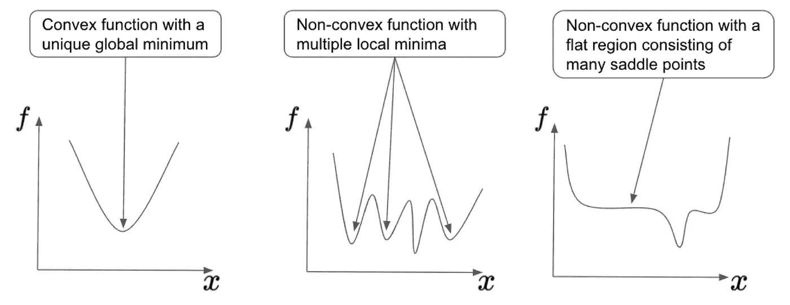
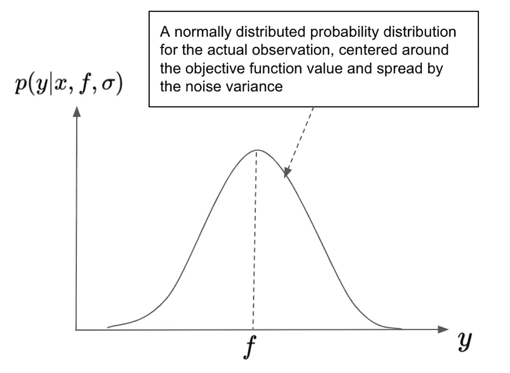
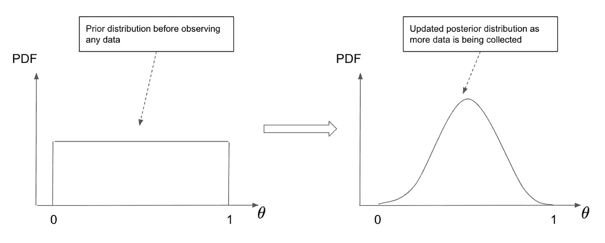
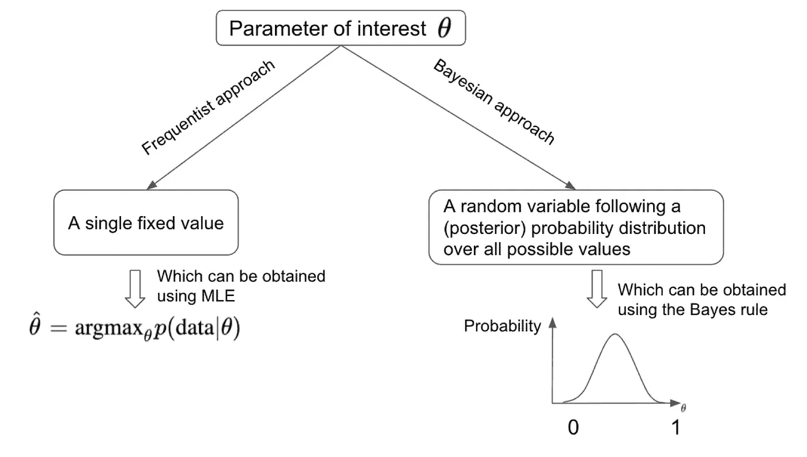
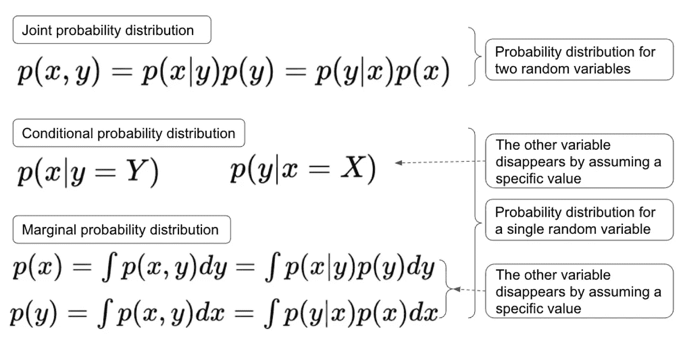
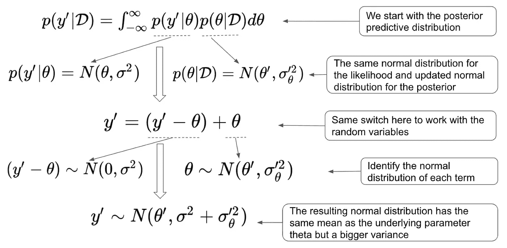
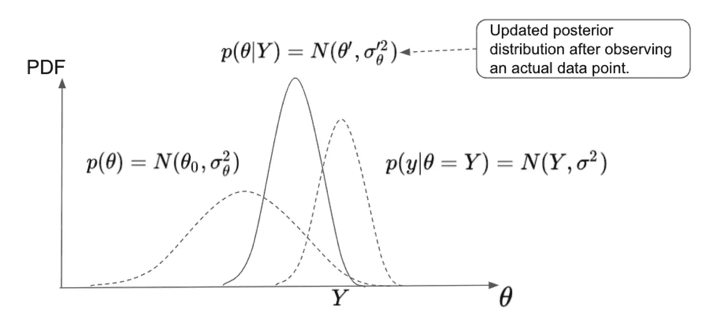

# 理解贝叶斯优化中的贝叶斯推理

> 原文：<https://towardsdatascience.com/understanding-bayesian-inference-in-bayesian-optimization-cd0cd45e6098>

## 应用于贝叶斯优化环境中的贝叶斯推理基础知识的直观指南

贝叶斯优化是使用贝叶斯方法研究优化问题的一个领域。优化旨在定位所有可能值的最优目标值(即全局最大值或最小值)或环境中最优值的相应位置。搜索过程从一个特定的位置开始，遵循一个特定的策略来迭代地引导随后的采样位置，收集相应的观察值，并刷新策略。

整体贝叶斯优化过程。该策略消化历史观测值并提出新的采样位置，并且环境控制如何向策略显示新提出的位置处的(可能被噪声破坏的)观测值。我们的目标是学习一个有效率和有效的政策，能够尽快地达到全局最优。图片由作者提供。

# 目标函数

对于贝叶斯优化，特定类型的目标函数通常具有以下属性:

*   我们无法获得目标函数的显式表达式，使其成为一个“黑箱”函数。这意味着我们只能与环境(即目标函数)交互，通过在特定位置采样来执行功能评估。
*   通过在特定位置探测而返回的值通常被噪声破坏，并且不代表目标函数在该位置的真实值。由于对其实际值的间接评估，我们需要考虑来自环境的实际观测中的这种噪声。
*   每个功能评估都是昂贵的，因此排除了彻底探查的选择。我们需要有一个*样本有效的*方法来最小化环境评估的数量，同时试图找到它的全局最优。换句话说，优化器需要充分利用现有的观察结果，系统地推理下一个采样决策，这样有限的资源就不会浪费在没有希望的位置上。
*   我们无法获得它的梯度。当函数求值相对便宜，并且函数形式平滑时，使用梯度下降类型的过程来计算梯度和优化将是非常方便的。如果无法获得梯度，我们就不清楚特定评估点的相邻曲率，从而使后续的行进方向变得困难。

三种可能的函数形式。左边是一个凸函数，它的优化很容易。中间是具有多个局部极小值的非凸函数，右边也是具有充满鞍点的宽平坦区域的非凸函数。后两种情况的优化是困难的。图片由作者提供。

# 观察模型

为了使我们的讨论更精确，让我们用 *f(x)* 来表示位置 *x* 处的(未知)目标函数值。我们使用 *y* 来表示位置 *x* 处的实际观察值，由于加性高斯噪声的扰动，这将与 *f* 略有不同。因此，我们可以基于特定位置 *x* 和真实函数值 *f* : *p(y|x，f)将观察模型表示为 *y* 的概率分布。*

假设实际观察值的正态概率分布为随机变量。高斯分布以在给定位置 x 评估的目标函数 f 值为中心，并通过噪声项的方差扩展。图片由作者提供。

# 贝叶斯推理

贝叶斯推理本质上依赖于贝叶斯公式(也称为贝叶斯规则)来推理几个组成部分之间的相互作用:先验分布、给定特定参数的可能性、后验分布以及数据证据。

随着更多的数据被收集，朝着后验正态分布更新先前的均匀分布。随着收集更多的数据来支持对真实基础分布的近似，先验分布的作用降低。图片由作者提供。

贝叶斯方法是一种为参数的可能值分配概率并根据观察到的数据更新这些概率的系统方法。然而，有时我们只对产生我们正在观察的数据的参数的最可能值感兴趣。这可以通过使用*频率主义者*方法来实现，将感兴趣的参数视为固定量，而不是随机变量。这种方法在机器学习社区中更经常采用，这种社区非常注重优化某个目标函数来定位最佳参数集。

关于感兴趣的参数，比较频率主义方法和贝叶斯方法。frequentist 方法将参数视为可以通过 MLE 估计的固定量，而 Bayesian 方法采用一种概率分布，随着收集的数据越来越多，这种概率分布会不断更新。图片由作者提供。

当我们处理多个(不止一个)变量时，事情变得更加有趣。假设我们有两个随机变量 *x* 和 *y* ，并且我们对两个*事件 X =*X*和 *y* =Y 感兴趣，其中 X 和 Y 都是分别为 *x* 和 *y* 可能取的特定值。此外，我们假设两个随机变量在某种程度上是相关的。这将引导我们进入现代机器学习和贝叶斯优化文献中常用的三种概率类型:联合概率、边际概率和条件概率。*

三种常见的概率分布。联合概率分布表示两个或更多随机变量的概率分布，而条件和边际概率分布通常指一个随机变量的概率分布。条件分布通过假设/调节其他变量的特定值来表示随机变量的概率，而边际分布通过整合其他变量将联合概率转换为单个随机变量。图片由作者提供。

我们感兴趣的是它的预测分布 *p(y)* ，即 *y* 的可能值以及相应的概率。如果我们对未来未知数据的预测分布有很好的了解，我们的决策将更加明智，特别是在贝叶斯优化框架中，人们需要仔细决定下一个采样位置。

先验和后验预测分布的定义。两者都是基于先验和似然之间的加权和的相同模式来计算的。图片由作者提供。

我们可以总结在正态假设下，连续参数的概率和先验的后验预测分布的推导。

收集一些观察值后，对新数据点的后验预测分布的推导过程，假设似然性和先验均为正态分布。图片由作者提供。

有了这些现成的工具，我们就可以得到感兴趣参数的更新后验分布以及特定输入位置的随机变量的后验预测分布。

更新了参数的后验分布，表明主观偏好与现实相符。图片由作者提供。

# **总结**

本文涵盖了贝叶斯优化框架中贝叶斯部分的一些亮点。在后面的文章中，我们将涵盖更重要的内容，如高斯过程和采集函数。关于贝叶斯优化基本知识和实现的更彻底和完整的治疗，请关注我的媒体账户，并关注我即将出版的书籍*用 Python 实现实用贝叶斯优化*。