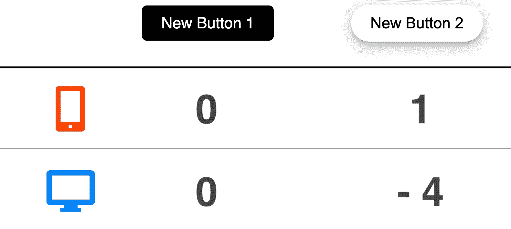
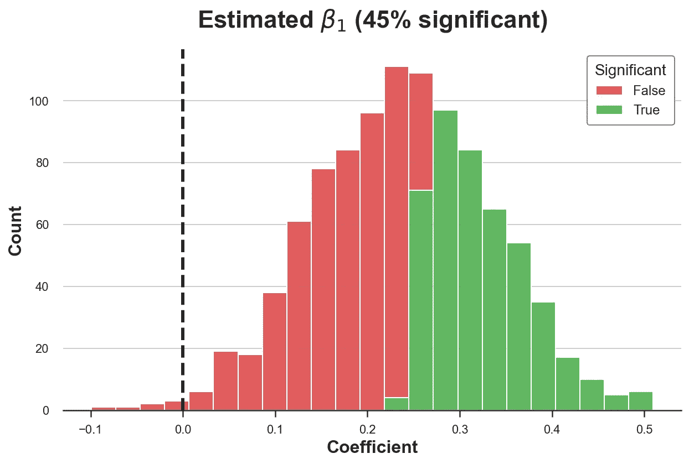

# 了解污染偏差

> 原文：<https://towardsdatascience.com/understanding-contamination-bias-58b63d25d2ef>

## [因果数据科学](https://towardsdatascience.com/tagged/causal-data-science)

## *多重处理的线性回归问题及解决方法*


作者图片

在许多因果推理环境中，我们可能对不止一种治疗的效果感兴趣，而是对**许多互斥治疗**的效果感兴趣。例如，我们可能想要测试替代的 UX 设计，或者药物，或者政策。根据具体情况，我们可能有很多原因想要同时测试不同的治疗方法，但一般来说，这可以帮助*减少样本量*，因为我们只需要一个对照组。恢复不同治疗效果的简单方法是对不同治疗指标的感兴趣结果进行线性回归。

然而，在因果推断中，我们通常**将其他可观察变量(通常称为控制变量)作为分析**的条件，以增加功效，或者特别是在准实验设置中，确定一个因果参数而不是简单的相关性。存在[增加控制变量会适得其反](/b63dc69e3d8c)的情况，但除此之外，我们曾经认为线性回归恢复了平均治疗效果。

在一篇突破性的论文中，[戈德史密斯-平克汉姆、赫尔和科勒萨尔(2022)](https://www.nber.org/papers/w30108) 最近表明，在*多重且互斥的*处理的情况下，并且在*控制变量*存在的情况下，**回归系数不能识别因果关系**。然而，并不是所有的东西都丢失了:作者提出了一个简单的解决这个问题的方法，仍然是利用线性回归。

在这篇博文中，我将通过一个简单的例子来说明问题的本质以及作者提出的解决方案。

# 多重治疗示例

假设我们是一家在线商店，我们对当前的结账页面不满意。特别是，我们想改变我们的**结账按钮**，以增加购买的可能性。我们的 UX 设计师提出了两个可供选择的结帐按钮，如下所示。


默认选项和替代处理，作者图片

为了了解使用哪个按钮，我们运行一个 [**A/B 测试**](https://en.wikipedia.org/wiki/A/B_testing) ，或随机对照试验。特别是，当人们到达结账页面时，我们会随机向他们展示三个选项中的一个。然后，对于每个用户，我们记录产生的收入，这是我们感兴趣的结果。

我使用来自`[src.dgp](https://github.com/matteocourthoud/Blog-Posts/blob/main/notebooks/src/dgp.py)`的`dgp_buttons()`作为数据生成过程来生成合成数据集。我也从`[src.utils](https://github.com/matteocourthoud/Blog-Posts/blob/main/notebooks/src/utils.py)`引进绘图函数和标准库。

```
from src.utils import *
from src.dgp import dgp_buttonsdgp = dgp_buttons()
df = dgp.generate_data()
df.head()
```


数据快照，图片由作者提供

我们有 1000 个用户的信息，我们观察他们的结帐按钮(`default`、`button1`或`button2`)、他们生成的`revenue`以及他们是从桌面还是`mobile`访问页面。

我们注意到随机化的问题时已经太晚了。我们更频繁地向桌面用户展示`button1`，向移动用户展示`button2`。看到`default`按钮的控制组是平衡的。


治疗分配不平衡，作者图片

我们做什么呢如果我们简单地比较`revenue`和`groups`会发生什么？让我们通过在`group`虚拟变量上回归`revenue`来实现。

```
smf.ols('revenue ~ group', data=df).fit().summary().tables[1]
```


回归摘要，按作者分类的图像

从回归结果来看，我们估计这两个按钮在 5%的水平上有显著的负面影响。我们应该相信这些估计吗？它们是**因果**吗？

> 我们所估计的不太可能是真实的治疗效果。

事实上，台式机和手机用户的购买态度可能会有很大的差异。由于我们没有跨治疗部门的可比较的移动和桌面用户数量，可能观察到的`revenue`差异是由于使用的*装置*而不是*按钮设计*。

因此，我们决定**对所用设备的分析进行条件化**，并在回归中加入`mobile`虚拟变量。

```
smf.ols('revenue ~ group + mobile', data=df).fit().summary().tables[1]
```


回归摘要，按作者分类的图像

现在`button1`的系数为正且显著。我们应该建议实施它吗？

答案是**想不到没有**。[戈德史密斯-平克汉姆、赫尔、科勒萨尔(2022)](https://www.nber.org/papers/w30108) 表明，这种类型的回归不能确定平均治疗效果，当:

*   有互斥的治疗分支(在我们的例子中，`groups`)
*   我们正在控制某个变量 *X* (在我们的例子中是`mobile`)
*   *X* 中有治疗效果不一

这是真的**，即使**一旦我们以 *X* 为条件，处理“和随机一样好”。

事实上，在我们的案例中，真正的治疗效果在下表中报告。



真实平均治疗效果，图片由作者提供

第一个按钮**对收入**没有影响，与设备无关，而第二个按钮对移动用户有**正面影响**，对桌面用户有**负面影响**。相反，我们的(错误的)回归规范估计了第一个按钮的积极影响。

现在让我们更详细地挖掘数学，以理解为什么会发生这种情况。

# 理论

这一节大量借用了[戈德史密斯-平克姆，赫尔，科勒萨尔(2022)](https://www.nber.org/papers/w30108) 。对于这篇论文的一个很好的总结，我推荐作者之一保罗·戈德史密斯-平克汉姆的这篇精彩的 Twitter 帖子。

关于污染偏见的推特帖子

# 单一治疗臂

假设我们对治疗对结果的影响感兴趣。首先，让我们考虑一个**单治疗臂**的标准情况，这样治疗变量是二元的， *D∈{0，1}* 。同样，考虑单个**二元控制变量** *X∈{0，1}* 。我们还假设治疗分配与随机分配一样好，有条件地取决于 *X* 。这种假设被称为<https://en.wikipedia.org/wiki/Ignorability>**，它意味着治疗组和对照组之间可能存在系统性差异，然而，这些差异被 *X* 完全解释。我们正式写作**

****

**条件可忽略性假设，作者的图像**

**其中 *Yᵢ(d)* 表示当个体 *i* 的治疗状态为 *d* 时的潜在结果。例如， *Yᵢ(0)* 表示个体 *i* 如果得不到治疗的潜在结果。这个符号来自[鲁宾的潜在结果框架](https://www.tandfonline.com/doi/abs/10.1198/016214504000001880)。我们可以将个人 *i* 的**个人治疗效果**写成**

****

**个人治疗效果，图片由作者提供**

**在此设置中，兴趣回归**为****

****

**回归规范，作者图片**

**兴趣系数为 *β* 。**

**[安格里斯特(1998)](https://www.jstor.org/stable/2998558) 表明**回归系数 *β* 标识平均处理效果**。特别地， *β* 标识了具有凸权重的组内 *x* 平均治疗效果 *τ(x)* 的加权平均值。在这种特殊的情况下，我们可以把它写成**

****

**系数分解，作者图片**

**权重 *λ* 和 *(1-λ)* 由组内处理方差给出。因此，OLS 估计器对治疗差异较小的组给予**较小的权重，即治疗更不平衡的组。对半分配治疗的小组获得的权重最大。****

****

**按作者分组权重、图像**

**可以使用[弗里希-沃夫-洛厄尔定理](/59f801eb3299)推导出权重，将 *β₁* 表示为 *Y* 对*dᵢ₁(⊥x*的一元回归的 OLS 系数，其中*dᵢ₁(⊥x*是回归 *D₁* 对 *X* 的残差。如果你不熟悉弗里希-沃-洛厄尔定理，我在这里写了一篇[介绍性的博文](/59f801eb3299)。**

****

**使用 FWL 定理的系数分解，图片由作者提供**

**中心表达式的第二项消失了，因为剩余的 *Dᵢ₁(⊥X)* 根据构造**意味着控制变量 *X* 的独立**，即**

****

**意味着独立，作者的形象**

**这种平均独立性对于获得无偏估计值至关重要，在多重治疗情况下，这种特性的失败是*污染偏差*的来源。**

# **多个治疗臂**

**现在让我们考虑多个处理分支的情况， *D∈{0，1，2}* ，其中 *1* 和 *2* 表示两个互斥的处理。我们仍然假设**条件可忽略性**，即治疗分配与随机一样好，以 *X* 为条件。**

****

**条件可忽略性假设，作者的图像**

**在这种情况下，我们有两个不同的**个体治疗效果**，每个治疗一个。**

****

**个人治疗效果，图片由作者提供**

****回归的利息**是**

****

**回归规范，作者图片**

**线性回归系数 *β₁* 和 *β₂* **确定了**平均治疗效果吗？**

**说“是”会很有诱惑力。事实上，相对于之前的设置，看起来没有太大的变化。我们只有一种额外的治疗，但潜在的结果仍然是有条件地独立于它。然而，事实并非如此。**

> **线性回归系数不能确定平均治疗效果。**

****问题**在哪里？**

**让我们专注于 *β₁* (同样适用于 *β₂* )。如前所述，可以使用[弗里希-沃-洛厄尔定理](/59f801eb3299)重写 *β₁* 作为 *Yᵢ* 对*dᵢ₁(⊥xd₂*的单变量回归的 OLS 系数，其中*dᵢ₁(⊥xd₂*是回归 *D₁* 对 *D₂* 和 *X* 的残差。**

****

**使用 FWL 定理的系数分解，图片由作者提供**

****题**是上学期。没有最后一项，我们仍然可以把 *β₁* 写成个体治疗效果的凸组合。然而，最后一项通过添加一个依赖于*d₂*t49】、 *τ₂* 的治疗效果的成分来使估计量产生偏差。为什么这个术语没有消失？**

**问题是， *Dᵢ₁(⊥X，*并不意味着独立于 *Dᵢ₂* ，即**

****

**违反平均独立性，作者的形象**

**原因在于这些处理是**互斥的**。这意味着当 *Dᵢ₁=1* ， *Dᵢ₂* 必须为零，不管 *Xᵢ* 的值是多少。因此，最后一项没有抵消，它引入了**污染偏差**。**

## **解决办法**

**[戈德史密斯-平克姆，赫尔，科勒萨尔(2022)](https://www.nber.org/papers/w30108) 对问题提出不同的解决方案。最简单的方法是由 [Imbens 和 Wooldridge (2009)](https://www.aeaweb.org/articles?id=10.1257/jel.47.1.5) 首先提出的，只需要一个**线性回归**。程序如下。**

1.  **去均值控制变量:*x̃= xx̅***
2.  **回归处理指标 *D* 和降低的控制变量 *X̃* 之间的相互作用 *Y***

***β₁* 和 *β₂* 的 OLS 估计量是平均治疗效果的**无偏**估计量。这个估计器对于*连续*控制变量 *X* 也是无偏的，而不仅仅是对于我们到目前为止所考虑的二元变量。**

****为什么**这个估计量最初是由[Imbens and Wooldridge(2009)](https://www.aeaweb.org/articles?id=10.1257/jel.47.1.5)提出的？让我们考虑一个具有单一处理 *D* 的模型，让我们分别分析两个部分:在 *D* 和 *X* 之间的**相互作用项**和在相互作用项中 *X* 被**去含义的事实。****

**首先，**交互项** *DX* 允许我们控制 *X* 在治疗组和对照组中的不同效果和/或分布。事实上，这相当于为治疗组和对照组估计一个单独的 *Y* 对 *X* 的回归。**

**第二，交互作用术语中的**去含义** *X* 允许我们**将**估计系数 *β̂* 解释为平均处理效果。事实上，假设我们正在估计下面的线性模型，其中 *X* 是*而不是*在相互作用项中的含义。**

****

**回归规范，自动生成图像**

**在这种情况下， *D* 对 *Y* 的边际效应是 *β+δXᵢ* ，因此*平均*边际效应是 *β* + *δX̅* ，这与 *β* 不同。**

**如果取而代之，我们使用交互项中的 *X* 的均值，则 *D* 对 *Y* 的边际效应为*β+δ*(*xᵢ*-*x̅̅*)，这样*对 *Y* 的平均*边际效应为 *β***

# **模拟**

**为了更好地理解问题和解决方案，让我们运行一些**模拟**。**

**我们对来自数据生成过程`dgp_buttons()`的不同绘制运行一个估计器。请注意，这只有在合成数据的情况下才有可能，而我们在现实中没有这种奢侈。对于每个样本，我们记录估计系数和相应的 [p 值](https://en.wikipedia.org/wiki/P-value)。**

**首先，让我们用旧的估算器来试试，它对`group`和`mobile`虚拟变量都回归了`revenue`。**

```
ols_estimator = lambda x: smf.ols('revenue ~ group + mobile', data=x).fit()
results = simulate(dgp, ols_estimator)
```

**我绘制了超过 1000 次模拟的`button1`的系数估计的**分布，突出了在 5%水平上的统计显著性。我还用一条垂直的虚线突出显示了系数的真实值零。****

```
plot_results(results)
```

****

**作者图片**

**如我们所见，我们拒绝了 45%的模拟中`button1`没有影响的零假设。由于我们设定了 5%的置信水平，我们预计最多会有 5%左右的拒绝。我们的估计量是有偏的。**

**正如我们在上面所看到的，问题是估计器不是移动和桌面用户的`button1`效应的凸组合(对两者都是零)，而是被`button2`效应的**污染了**。**

**现在让我们试试 [Imbens 和 Wooldridge (2009)](https://www.aeaweb.org/articles?id=10.1257/jel.47.1.5) 提出的估计量。首先，我们需要定义我们的控制变量`mobile`。然后，我们根据`group`和非均值控制变量`res_mobile`之间的相互作用回归`revenue`。**

```
df['mobile_res'] = df['mobile'] - np.mean(df['mobile'])
smf.ols('revenue ~ group * mobile_res', data=df).fit().summary().tables[1]
```

****

**回归摘要，按作者分类的图像**

**估计的系数现在**接近它们的真实值**。`button1`的估计系数不显著，而`button2`的估计系数为负且显著。**

**让我们通过运行模拟来检查这个结果是否在样本间保持**。我们重复估计过程 1000 次，并绘制`button1`的估计系数分布。****

```
new_estimator = lambda x: smf.ols('revenue ~ group * mobile', data=x).fit()
new_results = simulate(dgp, new_estimator)plot_results(new_results)
```

****

**作者图片**

**现在`button1`的估计系数的分布以真值零为中心。此外，我们仅在 1%的模拟中拒绝无效的零假设，与选择的 95%的置信水平一致。**

# **结论**

**在这篇文章中，我们已经看到了运行一个因子回归模型的危险，这个模型有多个*互斥的*治疗组和一个控制变量的治疗效果异质性。在这种情况下，因为处理不是独立的，回归系数不是组内平均处理效果的凸组合，但也捕捉了引入**污染偏差**的其他处理的处理效果。这个问题的解决方案既简单又优雅，只需要一个线性回归。**

**然而，**这个问题比这个设置更普遍**，通常涉及到(以下所有)每个设置**

1.  **我们有多种相互依赖的治疗方法**
2.  **我们需要以控制变量作为分析的条件**
3.  **在控制变量中，治疗效果是不均匀的**

**另一个流行的例子是[交错处理的双向固定效应(TWFE)估计器](https://arxiv.org/abs/2201.01194)。**

## **参考**

**[1] J. Angrist，[利用社会保障数据估计志愿兵役对军事申请人的劳动力市场影响](https://www.jstor.org/stable/2998558) (1998)，*计量经济学*。**

**[2] D. Rubin，[利用潜在结果进行因果推断](https://www.tandfonline.com/doi/abs/10.1198/016214504000001880) (2005)，*美国统计协会杂志*。**

**[3] G. Imbens，J. Wooldridge，[项目评估计量经济学的近期发展](https://www.aeaweb.org/articles?id=10.1257/jel.47.1.5) (2009)，*经济文献杂志*。**

**[4] P .戈德史密斯-平克汉姆，p .赫尔，m .科勒萨尔，[线性回归中的污染偏差](https://www.nber.org/papers/w30108) (2022)，*工作文件*。**

## **相关文章**

*   **[理解省略变量偏差](/344ac1477699)**
*   **[理解弗里希-沃-洛弗尔定理](/59f801eb3299)**
*   **[Dag 和控制变量](/b63dc69e3d8c)**

## **密码**

**你可以在这里找到 Jupyter 的原始笔记本:**

**<https://github.com/matteocourthoud/Blog-Posts/blob/main/notebooks/cbias.ipynb> ** 

## **感谢您的阅读！**

***我真的很感激！*🤗*如果你喜欢这个帖子并想看更多，可以考虑* [***关注我***](https://medium.com/@matteo.courthoud) *。我每周发布一次与因果推断和数据分析相关的主题。我尽量让我的帖子简单而精确，总是提供代码、例子和模拟。***

***还有，一个小小的* ***免责声明*** *:我写作是为了学习所以出错是家常便饭，尽管我尽了最大努力。当你发现他们的时候，请告诉我。也很欣赏新话题的建议！***