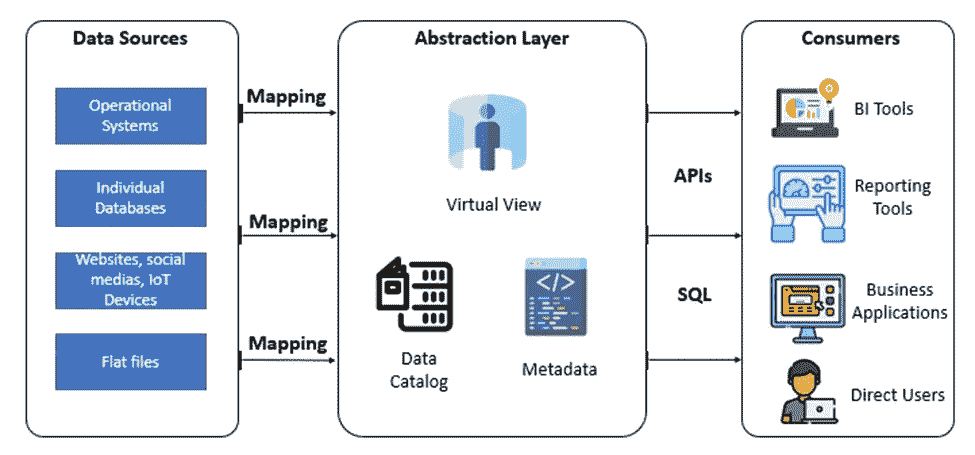
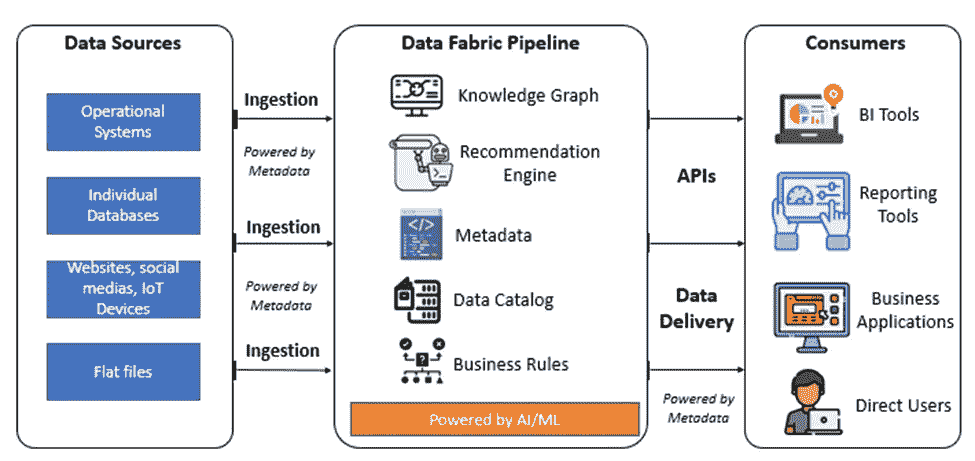

# 在不到 3 分钟的时间内了解数据结构

> 原文：<https://towardsdatascience.com/understanding-data-fabric-in-less-than-3-minutes-b6d4a17b148e>

## 什么是数据结构？它像听起来那样具有革命性吗？

数据管理架构的前景正在以闪电般的速度发展。每隔几个月就会有新的技术和术语出现，有时会让专业人士更难跟上发展的步伐。

[法托斯 Bytyqi](https://unsplash.com/@fatosi?utm_source=unsplash&utm_medium=referral&utm_content=creditCopyText) 在 [Unsplash](https://unsplash.com/collections/8926220/data-management?utm_source=unsplash&utm_medium=referral&utm_content=creditCopyText) 上的照片

最近，一个名为“数据结构”的新概念进入市场，承诺加快用户对不同数据的访问。但是什么是数据结构呢？它像听起来那样具有革命性吗？或者它只是另一种用新术语包装起来的“旧技术”？

这个故事将试图用极其简单的解释来揭示数据结构的概念。希望能让任何级别的数据管理专业人员更好地理解。

为了开始理解数据结构的旅程，让我们先回顾一下传统的数据管理架构。这种体系结构的图示如下。

传统数据管理架构|来源:作者

正如您在上面的图表中所看到的，传统的体系结构要求将来自不同来源的所有数据整合到集中的存储库中。这些存储库通常由数据湖、数据仓库和数据集市组成。所有这些都由 ETL 管理，以确保数据存储在正确的模式中。

这种方法有其优点，因为中央存储库中的数据变得如此结构化，因此易于用于分析和报告目的。这种传统方法持续了 30 年。

然而，随着产生的数据量以几何级数增长，这种方法暴露了它的缺陷。使用传统方法，数据必须得到一致的复制，这种机制可能效率低下且耗时。此外，在新的数据安全模式下，定期移动敏感数据并不是明智之举。更不用说某些类型的数据最好留在它们原来的位置。因此，传统的整合方法虽然适用于某些类型的组织，但并不适合以惊人的速度生产、移动和使用数据的现代数据驱动型组织。

然后，数据管理专家提出了一个名为数据虚拟化的出色解决方案。这种开箱即用的方法旨在为用户提供对多种数据的访问，而不必将这些数据移动到中央存储库。为此，引入了一个抽象层。

数据虚拟化架构|来源:作者

抽象层是一组中间件，提供来自映射到它的各种来源的数据的虚拟视图。这种映射由元数据控制，因此映射数据的所有属性(列名、表结构、标记等)都是由元数据控制的。)都保留了下来。还提供了一个数据目录来帮助根据业务定义组织数据，允许用户更快地找到他们需要的内容。更重要的是，中间件还提供了管理用户访问权限的安全治理，因此只有合法用户才能访问某些数据。

数据虚拟化是一种前所未有的方法，因为突然间我们不必不断整合来自多个来源的数据。节省了宝贵的时间、资源和成本。该解决方案已经很好地服务于许多组织，从快速发展的初创企业到成熟的企业。数据虚拟化的一个值得注意的[用例](https://www.altexsoft.com/blog/data-virtualization/#:~:text=tools%2C%20and%20more.-,What%20is%20data%20virtualization%3F,it%20virtually%20via%20special%20middleware.)是一家制药公司如何利用数据虚拟化来加速向其研究人员交付数据。移除“不必要的”ETL，并将项目开发时间减半。

我们已经了解了数据虚拟化的概念，现在我们来看看下图。

数据结构|来源:作者

看看上面的架构图与数据虚拟化有多相似。没有中央存储库，有几个组件提醒我们以前的方法。此外，还出现了新的组件，如推荐引擎和知识图。

这是数据结构方法的体系结构表示。

在这一点上，我们可以有把握地推断出，数据结构是数据虚拟化的一种发展，其额外的内置功能进一步增强了它的优势。

一个特别的改变游戏规则的组件是 AI/ML 技术的引入，它能够将映射和编目过程推进到下一个级别。机器学习通过识别数据目录中内容的微妙模式来做到这一点，从而创建使用以前的虚拟化方法可能无法建立的数据关系。此外，AI 还支持推荐引擎和知识图，因此数据发现方面有了显著改善。

上面简单而又按时间顺序排列的解释希望能启发我们，数据结构中“没有什么新奇的东西”。这确实是一个开箱即用的概念，然而，为其提供动力的构件已经存在了相当一段时间。

以知识图谱为例。它是一个全面的图表，表示真实世界实体(如当事人、事实或事件)之间的相互联系。简单来说，知识图谱帮助我们全面了解我们的数据。它从 20 世纪 70 年代就已经存在了。

但 AI/ML 的出现，自动化了构建知识图的过程，留下了大部分手工任务。而随着数据结构的兴起，知识图终于找到了它的杀手级用例。

总之，数据结构是若干技术使能因素的组合，这些技术使能因素有助于所有各方访问和使用其组织可支配的所有可用数据。而不必移动数据。它不是一个单一的软件，我们可以在一次完成，但它是一个增量之旅，从启用数据虚拟化开始。

首先掌握数据虚拟化，您就可以顺利实施数据结构。