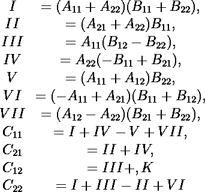
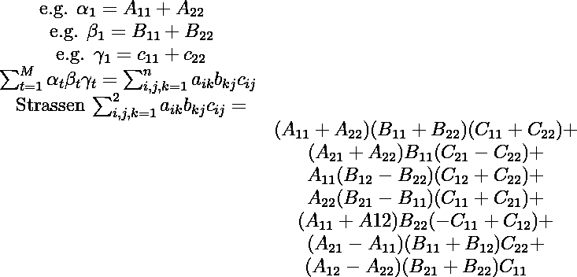
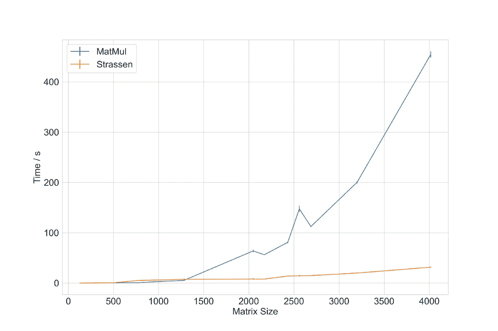
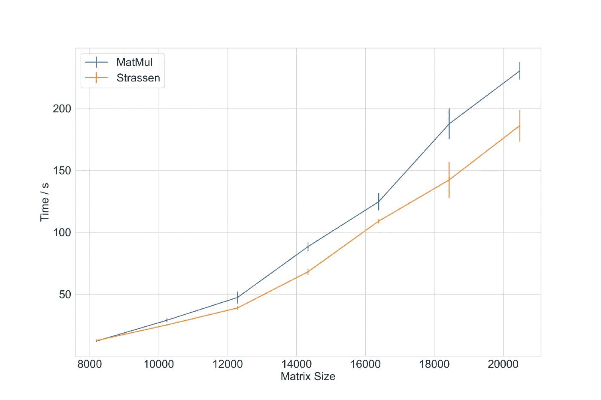

# 了解 DeepMind 和 Strassen 算法

> 原文：<https://towardsdatascience.com/understanding-deepmind-and-strassen-algorithms-9bdb3d8b6ea6>

## 矩阵乘法问题的介绍，以及在 Python 和 JAX 中的应用

图片由[伊万·迪亚兹](https://unsplash.com/@ivvndiaz)在 [Unsplash](https://unsplash.com/photos/vED-G-klEjo) 上拍摄

DeepMind 最近发表了一篇有趣的论文，该论文采用深度强化学习来寻找新的矩阵乘法算法[1]。本文的目标之一是降低矩阵乘法的计算复杂度。这篇文章提出了很多关于矩阵乘法的评论和问题——你可以从[戴密斯·哈萨比斯的推特](https://twitter.com/demishassabis/status/1577705373796016132?s=20&t=I0bhJgjsuFca7XgjG4u1QA)中看到。

矩阵乘法是数学中一个激烈的研究领域[2–10]。虽然矩阵乘法是一个简单的问题，但计算实现有一些障碍需要解决。如果我们只考虑方阵，第一个想法是将乘积计算为三元组`for-loop`:

图 Python 中的简单矩阵乘法，复杂度为 O(n)

这样一个简单的计算具有 *O(n )* 的计算复杂度。这意味着运行这种计算的时间随着矩阵大小的三次幂而增加。这是一个需要解决的障碍，因为在人工智能和 ML 中，我们为每个模型的步骤处理巨大的矩阵——神经网络是大量的矩阵乘法！因此，给定恒定的计算能力，我们需要越来越多的时间来运行我们所有的人工智能计算！

DeepMind 将矩阵乘法问题带到了更具体的一步。然而，在深入研究本文之前，让我们先看看矩阵乘法问题，以及哪些算法可以帮助我们降低计算能力。特别是，我们将看看斯特拉森的算法，然后我们将在 Python 和 JAX 实现它。

# 斯特拉森、铜匠&维诺格拉德、威廉姆斯&阿尔曼律师事务所

请记住，在本文的其余部分，矩阵的大小将是 N > > 1000。所有算法都将应用于 [*块矩阵*](https://en.wikipedia.org/wiki/Block_matrix) *。*

图 2:乘积矩阵 C 由矩阵 A 的第 I 个元素行和矩阵 B 的第 j 个元素列的和给出，返回矩阵 C 的元素(I，j)。[图片由作者提供]

乘积矩阵 C1 分别由矩阵 A 和 B 的行和列之和给出——图 2

图 3:矩阵 A 和 B 之间矩阵乘法的可视化方案，给出一个新的乘积矩阵 C 或 AB

正如我们在简介中看到的，标准矩阵乘法乘积的计算复杂度是 *O(n )* 。1969 年[德国数学家 Volker Strassen](https://en.wikipedia.org/wiki/Volker_Strassen) 打破了 *O(n )* 障碍，将矩阵乘法减少到 7 次乘法和 18 次加法，复杂度达到*o(n⁸⁰⁸)*【8】。如果我们考虑一组矩阵 A、B 和 C，如图 3 所示，Strassen 推导出以下算法:

图 4: Strassen 的算法，在他的论文“高斯消去法不是最优的”中提出。[图片由作者提供]

关于这个算法，有几件事值得注意:

*   该算法递归地作用于[块矩阵](https://en.wikipedia.org/wiki/Block_matrix)
*   很容易证明⁸⁰⁸).的复杂性 G 给定矩阵大小 *n* 和 7 次乘法，其结果如下:

图 5:给定矩阵大小和乘法次数，推导算法复杂度。[图片由作者提供]

图 4 中的所有步骤都是多项式，因此矩阵乘法可以被视为多项式问题。

*   计算 Strassen 的算法是不稳定的浮动精度数字[14]。数值不稳定性是由舍入所有子矩阵结果引起的。随着计算的进行，总误差累积起来会严重降低精确度。

从这些观点出发，我们可以将矩阵乘法转化为多项式问题*。*图 4 中的每一个操作都可以写成一个线性组合，例如步骤 I 是:

图 6:将 Strassen 算法的步骤 I 定义为线性组合。[图片由作者提供]

这里，α和β是来自矩阵 A 和 B 的元素的线性组合，而 H 表示用于加法/减法运算的一位热码编码矩阵。然后，可以将乘积矩阵 C 元素定义为线性组合，并写出:

图 7: Strassen 算法可以表示为三个元素的线性组合。[图片由作者提供]

正如你所看到的，整个算法已经简化为一个线性组合。特别地，图 7 中等式`Strassen`的左手侧可以由矩阵大小、 *m、n、*和 *p —* 来表示，这意味着矩阵 *m* x *p* 和 *n* x *p* 之间的乘法:

图 8:矩阵乘法可以表示为张量。[图片由作者提供]

对于 Strassen*n，m，p>是< 2，2，2 >。图 8 将矩阵乘法描述为一个线性组合，或一个*张量*——这就是为什么有时斯特拉森算法被称为*张量运算*。图 8 中的 *a、b、*和 *c* 元素组成了一个*三元组*。按照 DeepMind 的论文惯例，三和弦可以表示为:*

图 9:将矩阵乘法张量定义为三元组，如 Deep Mind 论文[1]中所定义的。[图片由作者提供]。

这个三元组确立了寻找最佳算法以最小化矩阵乘法运算的计算复杂度的目标。事实上，三元组的最小数量定义了计算乘积矩阵的最小操作数量。这个最小数就是张量的秩 *R(t)* 。对张量秩的研究将有助于我们找到新的更有效的矩阵乘法算法——这就是 DeepMind 的人们已经做的。

从 Strasse 的工作开始，从 1969 年到今天，解决矩阵乘法复杂性问题的新算法不断出现(表 1)。

表 1:1969 年至今发表的所有作品的矩阵乘法复杂度。希腊字母 omega 表示复杂性指数。对于每个作者，您可以找到建议解决方案的论文。勒加尔发现了一个解，其复杂度是 2.37287，而瓦西里夫斯卡和阿尔曼是 2.37286。[图片由作者提供]

潘、比尼、舍内奇和所有的研究人员是如何得到这些辉煌的结果的？解决计算机科学问题的一种方法是从定义一个代数问题 P 开始。以矩阵乘法问题为例，代数问题 P 可以是:“找一个数学模型求一组多项式的值”。从这里，科学家开始将问题简化，并将其“转换”为矩阵乘法问题— [这里的](https://www.youtube.com/watch?v=DruwS2_cVys)很好地解释了这种方法。简而言之，科学家能够证明定理以及将多项式求值分解为矩阵乘法算法的步骤。最终，他们都得到了比斯特拉森算法更强大的理论算法

然而，这些理论算法不能被编码，除非有一些沉重和强大的数学假设和限制，可能会影响算法的效率。

现在让我们看看斯特拉森的算法有多强大，以及我们如何用 Python 和 JAX 实现它。

# 0.20 提升:别开玩笑了！Strassen 的算法有效地提高了矩阵乘法吗？

[这里是回购](https://github.com/Steboss/matrix_multiplication)与所有下列代码。我在 MacBook Pro 上运行这些测试，2019 年，2.6GHz 6 核英特尔酷睿 i7，16 GB 2667MHz DDR4 内存。

# Python: numpy.matmul vs Strassen

图 10:标准 numpy 矩阵乘法(MatMul，蓝色)和 Strassen 算法(Strassen，橙色)的比较。[图片由作者提供]

在[主代码](https://github.com/Steboss/matrix_multiplication/blob/main/python_strassen/strassen.py)中我们可以遵循这些步骤:

*   我们将创建两个方阵 A 和 B，用随机整数初始化
*   我们将测试不同矩阵大小的算法:`128, 256, 512, 768, 1024, 1280, 2048`
*   对于每个尺寸，将运行`numpy.matmul`和 Strassen 的算法三次。每次运行时，我们都在列表中记录运行时间。从这个列表中，我们提取平均时间和标准偏差来比较这两种方法(图 10)

脚本的核心部分是递归的`strassen`函数:

*   首先，我们检查输入矩阵的维数。如果维度低于给定的阈值(或不能被 2 整除)，我们可以用标准`numpy`计算剩余的乘积，因为这不会影响最终的计算成本
*   对于每个输入矩阵，提取左上、右上、左下和右下子矩阵。在我的代码中，我提出了一个天真而简单的解决方案，这样每个人都可以理解发生了什么。要进一步测试和理解块矩阵的创建，请尝试手动计算小矩阵(如 12x12)的索引。
*   在最后一步，从所有计算出的子元素(图 4 中的 C11、C12、C21 和 C22)中重构乘积矩阵

图 11:计算矩阵乘法的 Strassen 函数。[图片由作者提供]

图 10 比较了标准的`numpy.matmul`和`strassen`算法。如您所见，对于维度< 2000 ( `Matrix Size < 2000`)，Strassen 的性能优于标准矩阵乘法。真正的改进可以在更大的矩阵上看到。Strassen 在 8.16 +/- 1.56 秒内完成 2048x2048 矩阵的矩阵乘法，而标准方法需要 63.89 +/- 2.48 秒。矩阵大小翻倍，4096 列和行，Strassen 在 31.57 +/- 1.01 秒内完成，而标准矩阵乘法需要 454.37 +/- 6.27 秒

# Jax 实现:在 DeepMind 的巨大肩膀上

根据图 9 中的等式，我们可以进一步以张量形式分解 Strassen 算法。张量 *u、v* 和 *w* 可以应用于矩阵的块，以获得最终的乘积矩阵。黄(C.H. Huang)、约翰逊(J. R. Johnson)和约翰逊(R. W. Johnson)发表了一篇小论文，说明如何推导 Strassen 的张量形式[18]，随后在 1994 年[19]发表了另一个公式，其中他们明确写出了 Strassen 的 *u，v* 和 *w* 张量。详细的计算可以查看[18]，而图 12 报告了张量值。

图 Strassen 算法的 U、V 和 W 张量。[图片由作者提供]

这是与 JAX 合作并将斯特拉森与标准`jax.numpy.matmul`进行比较的良好起点。对于 JAX 的脚本，我一直密切关注 DeepMind 的实现。

该脚本处理 4x4 块矩阵。核心函数`f`运行 Strassen 方法。在这种情况下，所有的 A 和 B 块矩阵都乘以 *u* 和 *v* 张量。结果乘以张量 *w，*得到最终乘积(图 13)。鉴于 JAX 强大的性能，该算法在以下矩阵的维度上进行测试:`8192, 10240, 12288, 14336, 16384, 18432, 20480`

图 13:JAX Strassen 算法的主要功能。块矩阵元素乘以 Strassen 向量(或因子)。[图片由作者提供]

最后，在最后一步，通过连接和整形来自`f`函数的乘积矩阵来重构乘积矩阵(图 14)。

图 14:重建尺寸为 x 的产品矩阵的最后一步。[图片由作者提供]

图 15 比较了 JAX 数字矩阵乘法和斯特拉森实现。你可以看到 JAX 是非常强大的，因为 8192x8192 矩阵乘法可以在 12 秒内运行(平均)。对于 12000x12000 以下的维度，没有真正的改善，JAX 标准方法在我的笔记本电脑上平均需要 60 秒的计算时间，而我正在运行其他一些东西。在这个维度之上，我们可以看到令人印象深刻的 20%的改进。例如，对于 18432x18432 和 20480x20480，Strassen 算法分别在 142.31+/-14.41 秒和 186.07+/-12.80 秒内运行，这是通过在 CPU 上运行完成的。一个好的作业可能是尝试添加`device_put`选项的代码，并在 Colab 的 GPU 上运行。我相信你会大吃一惊！

图 15:标准 JAX 矩阵乘法(马特穆尔，蓝色)和斯特拉森算法(斯特拉森，橙色)的比较。[图片由作者提供]

# 结论

今天我们向前迈了一小步，以完整理解 DeepMind 的出版物《用强化学习发现更快的矩阵乘法算法》[1]。本文提出了利用深度强化学习解决矩阵乘法问题的新方法。

在这第一篇文章中，我们开始触及矩阵乘法的表面。我们学习了这个操作的计算成本，我们看到了 Strassen 算法。

从这里我们定义了 Strassen 算法是如何产生的，以及它的数学含义是什么。自其发表以来，研究人员已经找到了越来越好的矩阵乘法问题的解决方案。然而，并非所有这些方法都可以用代码实现。

最后，我们用 Python 和 JAX 玩了一会儿，看看这个算法有多强大。我们了解到，当我们必须处理非常大的矩阵时，Strassen 是一个很好的工具。我们看到了 JAX 在处理大型矩阵乘法方面的强大功能，以及在不使用 GPU 或其他内存选项的情况下实现这种解决方案是多么容易。

在下一篇论文中，我们将从 DeepMind 的论文中看到更多细节。特别是，我们将处理深度强化算法，以及论文的发现。然后，我们将实现新的 DeepMind 算法，并在 JAX 的一个 GPU 实例上运行它们。

我希望你喜欢这篇文章:)，并感谢阅读。

# 支持我的写作:

  

如果有任何问题或意见，请随时给我发电子邮件，地址是:stefanobosisio1@gmail.com，或者直接在 Medium 这里。

# 文献学

1.  用强化学习发现更快的矩阵乘法算法。*性质*610.7930(2022):47–53。
2.  布莱斯，马库斯。“快速矩阵乘法。”*计算理论*(2013):1–60。
3.  宾尼达里奥。“O (n2。7799)nxn 近似矩阵乘法的复杂性。”(1979).
4.  铜匠，唐，和史穆尔·维诺格拉。"关于矩阵乘法的渐近复杂性."SIAM 计算杂志 11.3(1982):472–492。
5.  铜匠，唐，和史穆尔·维诺格拉。"通过算术级数的矩阵乘法."第十九届 ACM 计算理论年会会议录。1987.
6.  计算双线性映射的各种最佳算法 II。2× 2 矩阵乘法的最佳算法*理论计算机科学*7.2(1978):127–148。
7.  阿诺德·舍恩哈格。"加成链长度的一个下界."*理论计算机科学*1.1(1975):1–12。
8.  斯特拉森沃尔克。"高斯消去法不是最优的."数字数学 13.4(1969):354–356。
9.  什穆埃尔·威诺格拉德。"关于 2× 2 矩阵的乘法."*线性代数及其应用*4.4(1971):381–388。
10.  先生们，w·莫文。"矩阵乘法和快速傅立叶变换."*贝尔系统技术杂志*47.6(1968):1099–1103。
11.  阿尔曼，乔希和弗吉尼亚·瓦西列夫斯卡·威廉姆斯。"精确的激光方法和更快的矩阵乘法."*2021 年 ACM-SIAM 离散算法研讨会会议录(SODA)* 。工业和应用数学学会，2021。
12.  弗朗索瓦·勒加尔。"张量的幂和快速矩阵乘法."第 39 届符号和代数计算国际研讨会会议录。2014.
13.  弗吉尼亚·瓦西列夫斯卡·威廉姆斯。"矩阵乘法比 Coppersmith-Winograd 快."第 44 届 ACM 计算理论年会会议录*。2012.*
14.  贝利、大卫·h、金·李和霍斯特·西蒙。"使用 Strassen 算法加速线性系统的求解."《超级计算杂志》4.4(1991):357–371。
15.  潘诉雅。"对于构造矩阵运算的快速算法来说，Strassen 算法不是最佳的聚合、合并和消去的三线性技术."*第 19 届计算机科学基础年会(sfcs 1978)* 。IEEE，1978 年。
16.  阿诺德·舍恩哈格。"部分和全部矩阵乘法."SIAM 计算杂志 10.3(1981):434–455。
17.  戴维、亚历山大·芒罗和安德鲁·詹姆斯·斯托瑟斯。"改进矩阵乘法复杂度的界限."*爱丁堡皇家学会学报 A 辑:数学*143.2(2013):351–369。
18.  黄春辉，杰里米约翰逊，罗德尼约翰逊。"斯特拉森矩阵乘法算法的张量积公式."*应用数学快报*3.3(1990):67–71。
19.  带有记忆缩减的斯特拉森矩阵乘法算法的张量积公式。科学规划 4.4(1995):275–289。