# 举例理解极坐标数据帧中的分组方式

> 原文：<https://towardsdatascience.com/understanding-groupby-in-polars-dataframe-by-examples-1e910e4095b3>

## 了解如何在 Polars 中使用 groupby()方法来聚合数据和应用函数


照片由 [Hannah Busing](https://unsplash.com/@hannahbusing?utm_source=medium&utm_medium=referral) 在 [Unsplash](https://unsplash.com?utm_source=medium&utm_medium=referral) 上拍摄

到目前为止，在我关于 Polars 的前几篇文章中，我已经向您介绍了 Polars 数据框架的基础知识，为什么它是比 Pandas 更好的数据框架库，以及它的惰性评估特性如何允许它优化您的查询。在探索 Polars 时，您会遇到一个非常常见的问题——如何在 Polars 数据帧上执行 *groupby* ?大多数 Pandas 用户都熟悉`groupby()`函数，您可以根据类别对数据进行分组，然后对类别应用函数。在 Polars 里你是怎么做到的？

在本文中，我将带您了解如何在 Polars 数据帧上使用`groupby()`功能。特别是，我将用几个不同的例子来说明它们。准备好了吗？我们走吧！

# 示例 1

对于第一个示例，我将手动创建 Polars 数据帧:

```
import polars as plscores = {'Zone': ['North', 'North', 'South', 'South',
                   'East', 'East', 'West', 'West'], 
          'School': ['Rushmore', 'Rushmore','Bayside','Rydell',
                     'Shermer','Shermer','Ridgemont','Hogwarts'],
          'Name': ['Jonny', 'Mary', 'Joe', 'Jakob', 
                   'Jimmy', 'Erik', 'Lam', 'Yip'], 
          'Math': [78, 39, 76, 56, 67, 89, 100, 55],
          'Science': [70, 45, 68, 90, 45, 66, 89, 32]}df = pl.DataFrame(scores, columns = 
                  ['Zone', 'School', 'Name', 
                   'Science', 'Math'])          
df
```

正如您在输出中看到的，dataframe 具有 8 行 5 列的形状:


作者图片

dataframe 包含一组来自不同学校的学生的科学和数学成绩。

## 按区域分组

现在让我们通过使用`groupby()`和`agg()`方法来查看每个区域中的所有学校:

```
q = (
    df
    .lazy()
    .groupby(by='Zone')
    .agg(
        'School'
    )
)
q.collect()
```

> 您使用`lazy()`方法来确保 Polars 对后面的所有查询使用惰性评估。

您将看到以下输出:

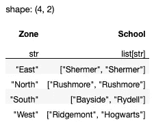

作者图片

请注意，每个区域的学校现在作为列表存储在`School`列下。要查看特定区域的所有学校，您可以使用`filter()`方法:

```
q = (
    df
    .lazy()
    .groupby(by='Zone')
    .agg(
        'School'
    )
 **.filter(
        pl.col('Zone')=='East'        
    )** )
q.collect()
```

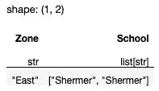

作者图片

## 查看每个区域的最高分数

如果你想知道每个区域的最高**科学**分数，使用**科学**栏上的`max()`方法:

```
q = (
    df
    .lazy()
    .groupby(by='Zone')
    .agg(        
        pl.col('Science').**max()**.alias('Science(Max)')
    )    
)
q.collect()
```

> `alias()`方法重命名输出列。

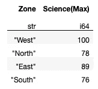

作者图片

也可以像这样直接使用**科普**栏目上的`pl.max()`方法:

```
 # pl.col('Science').max().alias('Science(Max)') **
        pl.max('Science').alias('Science(Max)')**
```

如果您还想计算每个区域中学校的数量，您可以在`agg()`方法中添加另一个表达式:

```
q = (
    df    
    .lazy()
    .groupby(by='Zone')
    .agg(
        [
 **pl.col('Science').count().alias('Number of Schools'),**
            pl.col('Science').max().alias('Science(Max)')
        ]
    )    
)
q.collect()
```

结果如下:

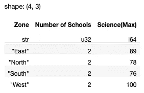

作者图片

您可以添加不同的表达式来获得聚合组的结果:

```
q = (
    df
    .lazy()
    .groupby(by='Zone')
    .agg(        
 **       [
**            pl.col('Science').count().alias('Number of Schools'),pl.col('Science').max().alias('Science(Max)')**,**
         **   pl.col('Science').min().alias('Science(Min)'),
            pl.col('Science').mean().alias('Science(Mean)'),
            pl.col('Math').max().alias('Math(Max)'),
            pl.col('Math').min().alias('Math(Min)'),    
            pl.col('Math').mean().alias('Math(Mean)'),    
        ]
**    )    
)
q.collect()
```


作者图片

## 修改排序顺序

由`groupby()`方法返回的结果的顺序是随机的，所以每次运行上述代码片段时，您可能会看到**区域**的顺序不同。你可以使用`sort()`方法给它一个命令:

```
q = (
    df
    .lazy()
    .groupby(by='Zone')
    .agg(
        [
            pl.max('Science').alias('Science(Max)')
        ]
    )
 **   .sort(by='Zone')**
)
q.collect()
```

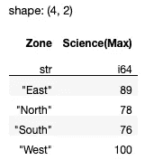

作者图片

注意到**区域**是按字母顺序排序的，而不是基于*主方向*(即北、南、东、西)。那么，如何根据基本方向对**区域**进行排序呢？以下代码片段显示了如何做到这一点:

```
**df_sortorder = pl.DataFrame({
   'Zone' : ['North','South','East','West'],
   'Zone_order' : [0,1,2,3]
}).lazy()**q = (
    df
    .lazy()
    **.join(df_sortorder, on='Zone', how='left')**
 **.groupby(by=['Zone','Zone_order'])**
    .agg(
        [
            pl.max('Science').alias('Science(Max)')
        ]
    )
 **.sort('Zone_order')
    .select(
        pl.exclude('Zone_order')
    )** )
q.collect()
```

在上面的代码片段中，我:

*   创建了另一个 dataframe ( `df_sortorder`)来指定我想要的区域排序顺序
*   用`df_sortorder`连接原始数据框架，这样我的数据框架现在有了一个名为`Zone_order`的新列
*   根据新的`Zone_order`列对组进行排序
*   在最终结果中排除了`Zone_order`列

结果如下所示:


作者图片

# 示例 2

下一个例子使用数据集" [**"车辆制造模型数据**](https://github.com/arthurkao/vehicle-make-model-data) **"。**从[这个页面](https://github.com/arthurkao/vehicle-make-model-data)下载 **csv_data.csv** 文件。

> **许可证** —麻省理工学院许可证
> 
> **描述** —准确的机动车制造&自 2001 年起的车型数据。该数据集包括汽车、摩托车、卡车和 UTV 制造商及其相应的型号。数据是数据库不可知的，并且是用户友好的，因为*相同的*数据集被移植到 mysql、json 和 csv 格式。Json 和 csv 数据集被扁平化，而 mysql 数据集被规范化为 3 个表。目前有 19，722 种型号，并且还在增加。

首先，将 CSV 文件加载到 Polars 数据框架中:

```
q = (
    pl.scan_csv('csv_data.csv')
)
q.collect()
```

您应该看到以下内容:


作者图片

数据框包含 2001 年至 2016 年的制造商(**制造商**)及其**型号**的列表。

## 按年份和品牌分组

先将数据框按**年份**和**品牌**分组，然后统计每个**年份**按**品牌**的**型号数量:**

```
q = (
    pl.scan_csv('csv_data.csv')
    .groupby(by=['year','make'])
    .agg(
        pl.col(['make']).count().alias('count')        
    )
    .sort(by=['year','make'])
)q.collect()
```

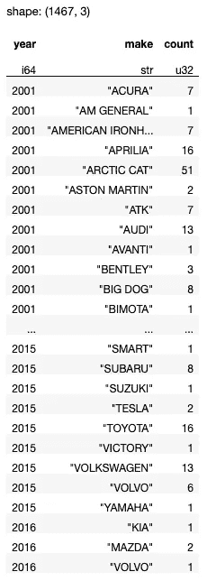

作者图片

使用`pl.count()`方法可以简化上述操作:

```
q = (
    pl.scan_csv('csv_data.csv')
    .groupby(by=['year','make'])
    .agg(        
 **pl.count()**
    )
    .sort(by=['year','make'])
)q.collect()
```

如果您想查看每个汽车制造商的所有型号，您可以指定**型号**列:

```
q = (
    pl.scan_csv('csv_data.csv')
    .groupby(by=['year','make'])
    .agg(        
 **'model'**
    )
    .sort(by=['year','make'])
)q.collect()
```

这将把所有的**车型**名称分组为每个**年份**和**品牌**的列表:

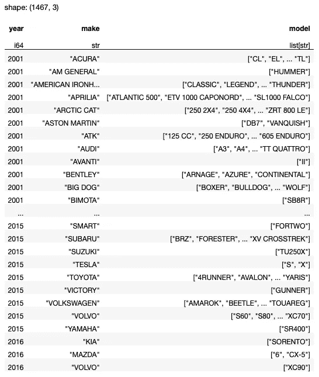

作者图片

## 显示每个汽车品牌的第一个和最后一个型号

如果要显示每辆**制造**的第一个和最后一个**型号**，分别使用`first()`和`last()`方法:

```
q = (
    pl.scan_csv('csv_data.csv')
    .groupby(by=['year','make'])
    .agg(
 **[**
            'model',
 **pl.first('model').alias('first'),
            pl.last('model').alias('last'),
        ]**    )
    .sort(by=['year','make'])
)q.collect()
```

第一个和最后一个模型现在将显示在各自独立的列中:

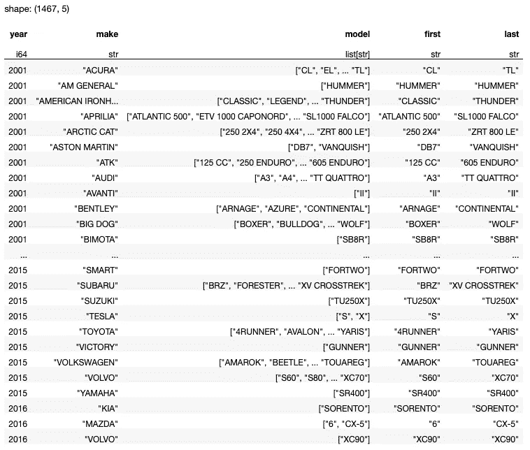

作者图片

# 示例 3

对于这个例子，我们将使用[这个数据集](https://www.kaggle.com/datasets/teertha/ushealthinsurancedataset?resource=download)。

> **许可** : [CC0:公共领域](https://creativecommons.org/publicdomain/zero/1.0/)
> 
> **描述** —该数据集包含 1338 行被保险人数据，其中根据被保险人的以下属性给出保险费用:年龄、性别、身体质量指数、子女数、吸烟者和地区。属性是数字和分类变量的混合。

首先，将 CSV 文件作为 Polars 数据帧加载:

```
q = (
    pl.scan_csv('insurance.csv')
)
q.collect()
```

数据框架包含各种客户资料:

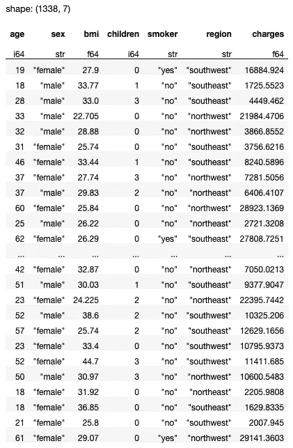

作者图片

## 计算雄性和雌性的数量

要计算每个地区的男性和女性人数，请在汇总时使用`sum()`方法:

```
q = (
    pl.scan_csv('insurance.csv')
    .groupby(by='region')
    .agg(
 **[
            (pl.col('sex') == 'male').sum().alias('male'),
            (pl.col('sex') == 'female').sum().alias('female'),
        ]**    )
    .sort(by='region')
)
q.collect()
```

每个地区的男性和女性人数现在将显示在两列中:

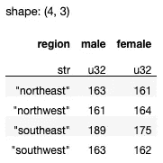

作者图片

## 计算每个性别的平均费用

要计算每个地区每个性别的平均费用，您必须:

*   首先选择`charges`列
*   每个性别的过滤器
*   计算平均费用
*   重命名该列

下面是执行上述步骤的代码片段:

```
q = (
    pl.scan_csv('insurance.csv')
    .groupby(by='region')
    .agg(
        [
 **(pl.col('charges')
             .filter(pl.col('sex')== 'male'))
            .mean()
            .alias('male_mean_charges'),

            (pl.col('charges')
             .filter(pl.col('sex')== 'female'))
            .mean()
            .alias('female_mean_charges'),**        ]    
    )
    .sort(by='region')
)
q.collect()
```

以下是上述代码片段的结果:

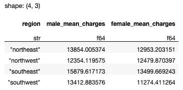

作者图片

为了验证上述结果是否正确，我们可以编写以下代码片段来手动检索所有包含来自东北地区的男性的行，然后计算他们的平均费用:

```
q = (
    pl.scan_csv('insurance.csv')
    .filter(
        (pl.col('region')=='northeast') & (pl.col('sex') == 'male')    
    )
    .select(
        pl.col('charges')
    )
    .mean()    
)
q.collect()
```

以下结果显示了东北地区所有男性的平均费用:

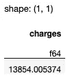

作者图片

## 计算每个地区吸烟者的比例

要计算每个地区吸烟者的比例，您需要:

*   总结所有吸烟者
*   计算吸烟者列中的总行数

下面是执行上述步骤的代码片段:

```
q = (
    pl.scan_csv('insurance.csv')
    .groupby(by='region')
    .agg(
        [
 **((pl.col('smoker')=='yes').sum() / 
             (pl.col('smoker')).count() * 100).alias('Smoker %')**        ]    
    )
    .sort(by='region')
)
q.collect()
```

下面的结果显示了每个地区吸烟者的百分比:

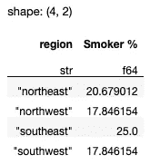

作者图片

<https://weimenglee.medium.com/membership>  

> 我将在即将到来的新加坡 ML 会议(2022 年 11 月 22-24 日)上主持一个关于 Polars 的研讨会。如果你想在 Polars 数据框架上快速起步，请在[https://ml conference . ai/machine-learning-advanced-development/using-Polars-for-data-analytics-workshop/](https://mlconference.ai/machine-learning-advanced-development/using-polars-for-data-analytics-workshop/)注册我的研讨会。


# 摘要

我希望上面的代码示例能为您提供足够的素材来了解`groupby()`方法的用法。正如您从代码中注意到的那样，`groupby()`方法通常与`agg()`方法结合使用。使用 Polars 时需要记住的一点是，应该避免使用`apply()`函数，因为它会影响查询的性能。

以下是我以前关于 Polars 数据框架的文章，供您参考:

</getting-started-with-the-polars-dataframe-library-6f9e1c014c5c>  </understanding-lazy-evaluation-in-polars-b85ccb864d0c>  </visualizing-polars-dataframes-using-plotly-express-8da4357d2ee0>  </manipulating-values-in-polars-dataframes-1087d88dd436> 