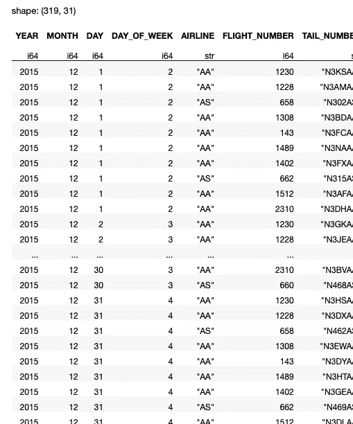
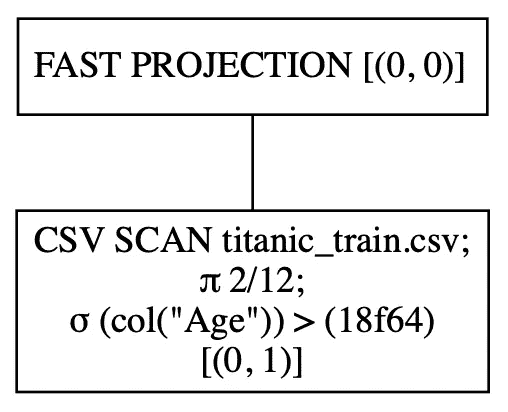
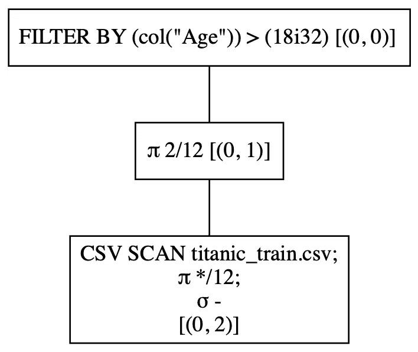
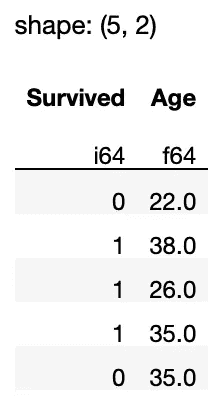

# 理解 Polars 中的惰性求值

> 原文：<https://towardsdatascience.com/understanding-lazy-evaluation-in-polars-b85ccb864d0c>

## 了解什么是急切执行和延迟执行，以及如何使用延迟执行来优化查询


汉斯-尤尔根·马格在 [Unsplash](https://unsplash.com?utm_source=medium&utm_medium=referral) 拍摄的照片

在我上一篇关于 Polars 的文章中，我向您介绍了 Polars 数据帧库，它比 Pandas 数据帧高效得多。

[](/getting-started-with-the-polars-dataframe-library-6f9e1c014c5c)  

在本文中，我将深入探究是什么让 Polar 如此之快——懒惰评估。你会学到急切执行和懒惰评估/执行的区别。

# 隐式懒惰评估

为了理解懒惰评估的有效性，与熊猫如何做事情进行比较是有用的。

> 在这个练习中，我将使用位于[https://www.kaggle.com/datasets/usdot/flight-delays](https://www.kaggle.com/datasets/usdot/flight-delays)的 **flights.csv** 文件。该数据集包含 2015 年美国航班延误和取消的详细信息。它是由交通部运输统计局收集和发布的。
> 
> **许可—** [CC0:公共领域](https://creativecommons.org/publicdomain/zero/1.0/)**(**[https://creativecommons.org/publicdomain/zero/1.0/](https://creativecommons.org/publicdomain/zero/1.0/))。

我们将使用 Pandas 加载 flights.csv 文件，该文件包含 580 万行和 31 列。通常，如果你在内存有限的机器上加载这个，Pandas 会花很长时间把它加载到一个 dataframe 中(如果加载的话)。以下代码执行以下操作:

*   将 flights.csv 文件加载到 Pandas 数据框架中
*   过滤数据帧以查找 12 月的航班，这些航班的始发地机场是 SEA，目的地机场是 DFW
*   测量将 CSV 文件加载到数据帧和过滤所需的时间

```
import pandas as pd
import timestart = time.time()df = pd.read_csv('flights.csv')
df = df[(df['MONTH'] == 12) & 
        (df['ORIGIN_AIRPORT'] == 'SEA') &
        (df['DESTINATION_AIRPORT'] == 'DFW')]end = time.time()
print(end - start)
df
```

在我的 8GB 内存的 M1 Mac 上，上面的代码片段花了大约 7.74 秒加载并显示以下结果:


作者图片

Pandas 的主要问题是，在进行任何过滤以删除所有不需要的行之前，您必须将数据集的所有行加载到 dataframe 中。

> 虽然您可以将数据集的前 n 行或后 n 行加载到 Pandas 数据帧中，但要将特定行(基于某些条件)加载到数据帧中，您需要先加载整个数据集，然后才能执行必要的过滤。

现在让我们使用 Polars，看看是否可以减少加载时间。以下代码片段执行以下操作:

*   使用 Polars 库的`read_csv()`方法加载 CSV 文件
*   使用`filter()`方法执行过滤，并指定保留我们想要的行的条件

```
**import polars as pl**
import timestart = time.time()df = **pl.read_csv('flights.csv').filter(
        (pl.col('MONTH') == 12) & 
        (pl.col('ORIGIN_AIRPORT') == 'SEA') &                                          
        (pl.col('DESTINATION_AIRPORT') == 'DFW'))**end = time.time()
print(end - start)
display(df)
```

在我的电脑上，上面的代码片段花了大约 3.21 秒，比熊猫有了很大的改进:



作者图片

现在，知道`read_csv()`方法使用*急切执行模式*很重要，这意味着它会在执行任何过滤之前直接将整个数据集加载到数据帧中。在这方面，这段使用 Polars 的代码与使用 Pandas 的代码相似。但是你已经可以看到 Polars 比熊猫快多了。

> 注意这里的`filter()`方法作用于 Polars DataFrame 对象

下一个改进是将`read_csv()`方法替换为使用*延迟执行—* `scan_csv()`的方法。`scan_csv()`方法延迟执行，直到`collect()`方法被调用。它分析所有查询，直到`collect()`方法，并尝试优化操作。以下代码片段显示了如何将`scan_csv()`方法与`collect()`方法结合使用:

```
import polars as pl
import timestart = time.time()
df = pl.**scan_csv**('flights.csv').filter(
        (pl.col('MONTH') == 12) & 
        (pl.col('ORIGIN_AIRPORT') == 'SEA') &
        (pl.col('DESTINATION_AIRPORT') == 'DFW'))**.collect()**
end = time.time()
print(end - start)
display(df)
```

> `scan_csv()`方法被称为**隐式懒惰方法**，因为默认情况下它使用懒惰评估。记住`scan_csv()`方法不返回数据帧是很重要的——它返回的是`LazyFrame`。

对于上面的代码片段，Polars 没有将所有行加载到 dataframe 中，而是优化了查询，只加载那些满足`filter()`方法中的条件的行。在我的电脑上，上面的代码片段耗时约 2.67 秒，与前面的代码片段相比，处理时间进一步减少。

> 注意这里的`*filter()*`方法适用于 Polars LazyFrame 对象

# 显式懒惰评估

还记得我之前提到的`read_csv()`方法使用急切执行模式吗？如果您想对所有后续查询使用延迟执行模式，该怎么办？嗯，你可以简单地调用上面的`lazy()`方法，然后使用`collect()`方法结束整个表达式，就像这样:

```
import polars as pl
import timestart = time.time()
df = pl.read_csv('flights.csv')
       .**lazy()** .filter(
         (pl.col('MONTH') == 12) & 
         (pl.col('ORIGIN_AIRPORT') == 'SEA') &
         (pl.col('DESTINATION_AIRPORT') == 'DFW'))**.collect()**
end = time.time()print(end - start)
display(df)
```

通过使用`lazy()`方法，您指示 Polars 暂停后续查询的执行，而是优化所有查询，直到使用`collect()`方法。`collect()`方法开始执行，*将结果收集到*数据帧中。本质上，这个方法指示 Polars 急切地执行查询。

# 了解 LazyFrame 对象

现在让我们分解一个查询，看看 Polars 实际上是如何工作的。首先，让我们使用`scan_csv()`方法，看看它返回什么:

```
pl.scan_csv('titanic_train.csv')
```

> ***数据来源*** *:本文数据来源于*[https://www.kaggle.com/datasets/tedllh/titanic-train](https://www.kaggle.com/datasets/tedllh/titanic-train)。
> 
> **许可—【https://opendatacommons.org/licenses/dbcl/1-0/】数据库内容许可(DbCL)1.0 版[T21](https://opendatacommons.org/licenses/dbcl/1-0/)**

上面的语句返回一个“`polars.internals.lazy_frame.LazyFrame`”对象。在 Jupyter Notebook 中，它将显示下面的执行图(我将在后面详细介绍):


作者图片

> **执行图**显示了 Polars 执行查询的顺序。

返回的`LazyFrame`对象表示您已经制定但尚未执行的查询。要执行查询，您需要使用`collect()`方法:

```
pl.scan_csv('titanic_train.csv')**.collect()**
```

还可以用一对括号将查询括起来，并将其赋给一个变量。要执行查询，只需调用查询的`collect()`方法，如下所示:

```
**q = (**
    pl.scan_csv('titanic_train.csv')    
**)**
**q.collect()**
```

> 将查询括在一对括号中的好处是，它允许您将多个查询链接起来，并将它们放在单独的行中，从而大大增强可读性。

上面的代码片段显示了以下输出:


作者图片

出于调试目的，有时只返回几行来检查输出是有用的，因此您可以使用`fetch()`方法来返回前 *n* 行:

```
q.**fetch**(5)
```

上述语句返回结果的前五行:


您可以在单个查询中链接各种方法:

```
q = (
    pl.scan_csv('titanic_train.csv')
 **.select(['Survived','Age'])
    .filter(
        pl.col('Age') > 18
    )** )
```

`show_graph()`方法显示您之前看到的执行图，并带有一个参数来指示您是否想要查看优化的图形:

```
q.**show_graph(optimized=True)**
```

上面的语句显示了下面的执行图。您可以看到，基于*年龄*列的过滤是在 CSV 文件加载期间一起完成的:



作者图片

相比之下，让我们来看看如果查询以急切模式(即非优化模式)执行，执行流程会是什么样子:

```
q.show_graph(**optimized=False**)
```

从下面的输出可以看出，首先加载 CSV 文件，然后选择两列，最后执行过滤:



作者图片

要执行查询，调用`collect()`方法:

```
q.collect()
```

将显示以下输出:


如果只需要前五行，调用`fetch()`方法:

```
q.fetch(5)
```



作者图片

[](https://weimenglee.medium.com/membership)  

> 我将在即将到来的新加坡 ML 会议(2022 年 11 月 22-24 日)上主持一个关于 Polars 的研讨会。如果你想快速启动 Polars 数据框架，请在[https://ml conference . ai/machine-learning-advanced-development/using-Polars-for-data-analytics-workshop/](https://mlconference.ai/machine-learning-advanced-development/using-polars-for-data-analytics-workshop/)注册参加我的研讨会。


# 摘要

我希望您现在对 Polars 中的惰性执行是如何工作的，以及如何为只支持急切执行的查询启用惰性执行有了更好的了解。显示执行图使您更容易理解查询是如何被优化的。在接下来的几篇文章中，我将继续讨论 Polars 数据框架以及操纵它们的各种方法。如果你想让我关注某个特定的话题，请给我留言！