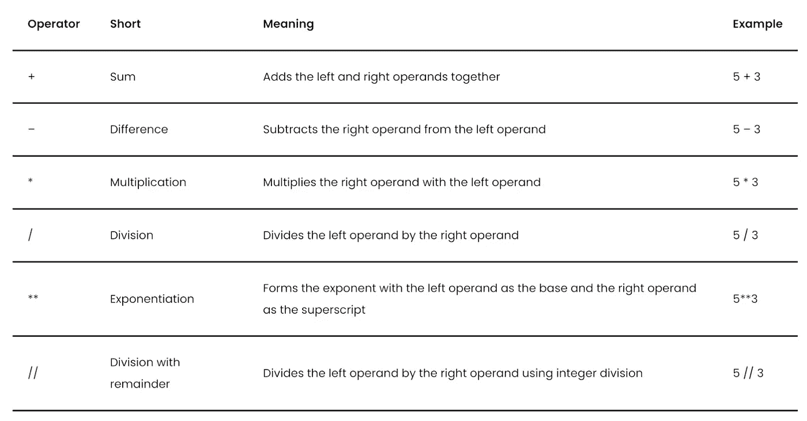
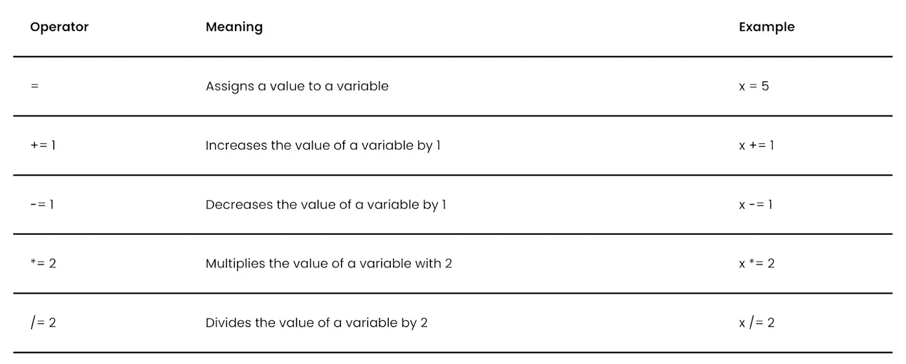

# 理解 Python 中的运算符

> 原文：<https://towardsdatascience.com/understanding-operators-in-python-7116abb06941>

## 了解 Python 运算符的基础知识

丹·洛马尔在 [Unsplash](https://unsplash.com?utm_source=medium&utm_medium=referral) 上拍摄的照片

Python 操作符是特殊类型的函数，在 [Python](https://databasecamp.de/en/python-coding) 编程语言中执行特定的、主要是数学的运算。

# 什么是运算符？

在 [Python](https://databasecamp.de/en/python-coding) 中，有所谓的操作符，像函数一样，执行固定定义的动作。然而，函数不一定要用传统的方式定义，而是可以使用更短的操作符。Python 操作符已经安装在 Python[的基础版本中，不需要通过导入额外的模块来添加。](https://databasecamp.de/en/python-coding)

更一般地说，Python 操作符由左侧、操作符和右侧组成。操作员决定左右两侧会发生什么。根据来源的不同，这也被称为操作数。我们将在本文中使用这个术语。

在 [Python](https://databasecamp.de/en/python-coding) 中有无数的操作符，我们将在接下来的章节中进一步讨论。其中之一就是数学上的不同，可以用“-”这个字符来称呼。

在我们的例子中，负号是操作符。两个操作数是数字 9 和 3。最后，数字六是运算的结果。

# Python 运算符有哪些类型？

Python 区分不同类型的操作符，我们将在接下来的章节中详细解释。

## 比较运算符

比较运算符可以将两个操作数相互比较。它们总是返回一个布尔值(真或假)作为结果。

Python 中的比较运算符|来源:作者

## 算术/数学运算符

数学或算术运算符在 Python 中实现基本的数学函数。为此，基本的计算类型，如和、差、乘等。都被盖住了。

Python 中的数学运算符|来源:作者

## 逻辑运算符

逻辑运算符也来源于数学，借助逻辑 and 和 Or 实现条件的连接。当两个语句中的一个为真时，用“或”连接的两个语句为真。当两个语句都为真时，用“与”连接的两个语句为真。

Python 中的逻辑运算符|来源:作者

## 恒等运算符

Python 运算符“is”用于检查两个变量是否具有相同的赋值。然后，运算符相应地返回 True 或 False。这也可以用来在脚本中动态检查变量是否相同。

## 子集运算符

子集操作符可以用来检查一个集合中是否存在一个或多个元素，比如一个 [Python 列表](https://databasecamp.de/en/python-coding/python-lists)。

否定可以用来检查对立面，即元素是否不是集合的一部分。

## 赋值运算符

从变量的定义中，我们已经知道了最基本的赋值操作符。在“=”的帮助下，我们可以给变量赋值。此外，还有其他赋值运算符，在它们的帮助下，例如，求和或乘积可以用缩写形式书写。

# 这是你应该带走的东西

*   Python 运算符是特殊类型的函数，主要执行数学函数。
*   Python 操作符允许快速调用，无需定义新函数。
*   有不同的类型，如逻辑运算符或赋值运算符。

*如果你喜欢我的作品，请在这里订阅*<https://medium.com/subscribe/@niklas_lang>**或者查看我的网站* [*数据大本营*](http://www.databasecamp.de/en/homepage) *！还有，medium 允许你每月免费阅读* ***3 篇*** *。如果你想让***无限制地访问我的文章和数以千计的精彩文章，不要犹豫，通过点击我的推荐链接:*[【https://medium.com/@niklas_lang/membership】](https://medium.com/@niklas_lang/membership)每月花$***5****获得会员资格***

**</5-basic-commands-for-working-with-python-lists-3088e57bace6>  </8-machine-learning-algorithms-everyone-new-to-data-science-should-know-772bd0f1eca1>  </4-basic-commands-when-working-with-python-dictionaries-1152e0331604> **