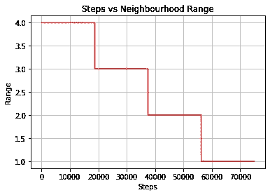
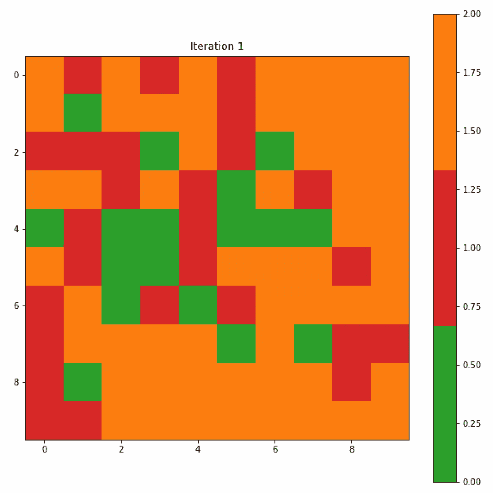
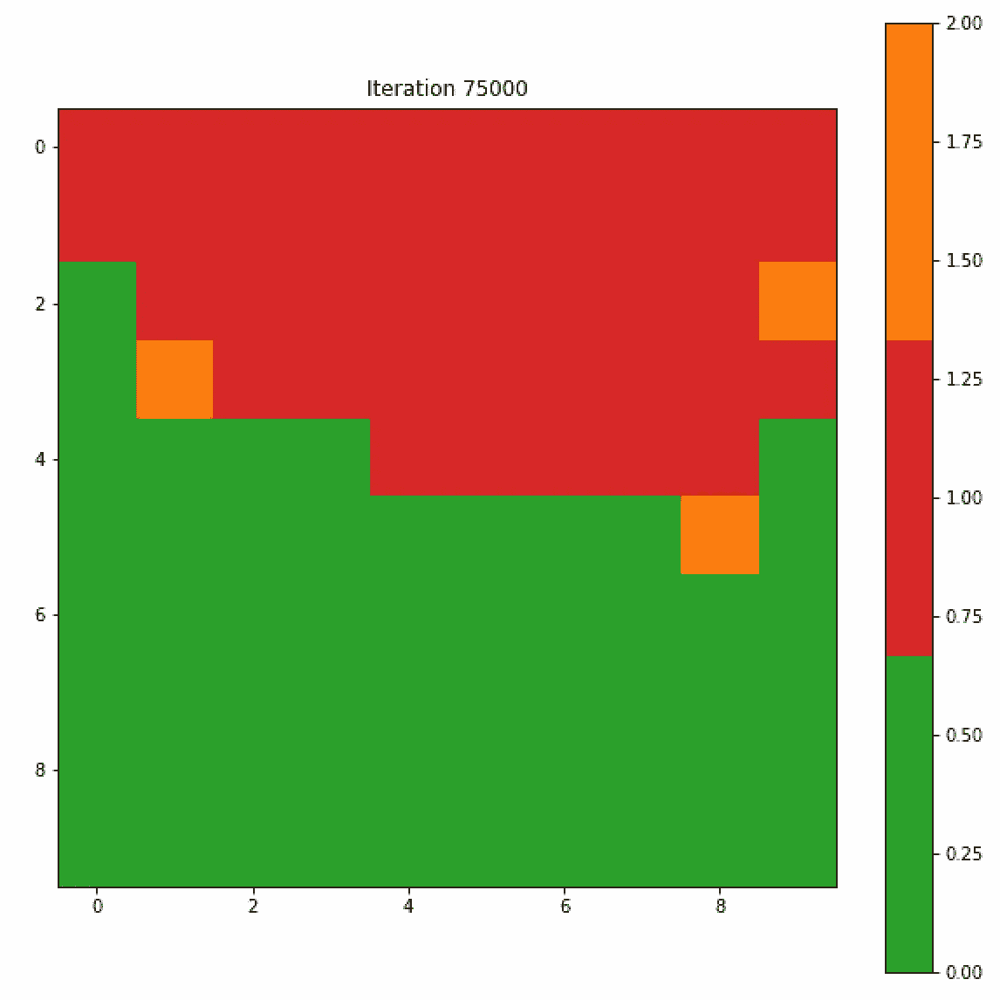
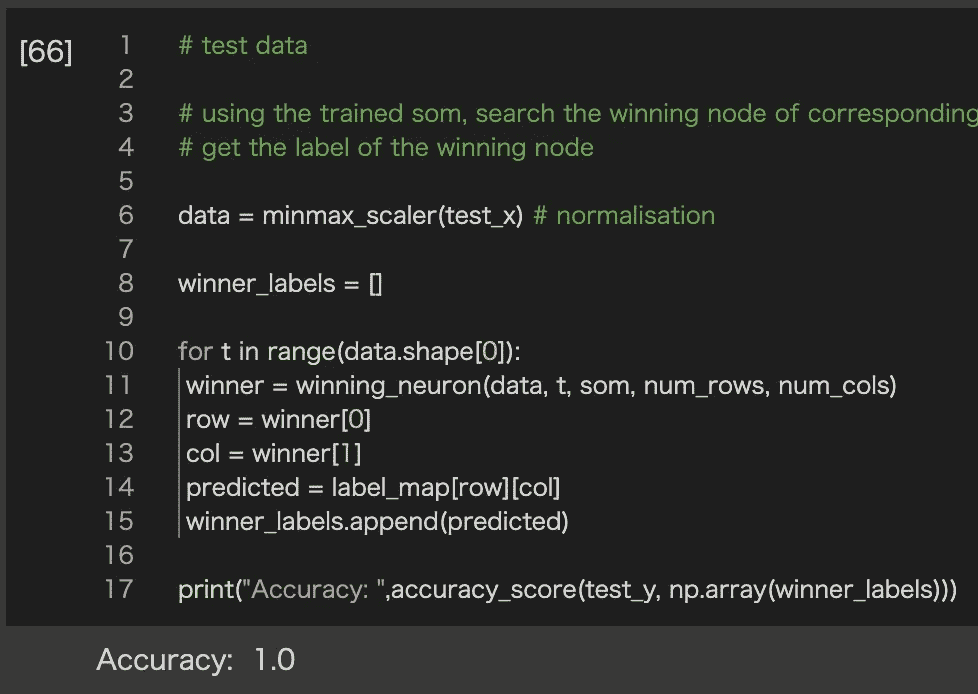

# 用 Python 代码理解自组织映射神经网络

> 原文：<https://towardsdatascience.com/understanding-self-organising-map-neural-network-with-python-code-7a77f501e985>

## 通过竞争、合作和适应的大脑启发的无监督机器学习


自组织映射的进化。作者图片

# 1.介绍

自组织映射(SOM)是一种无监督的机器学习算法，由 Teuvo Kohonen 于 20 世纪 80 年代提出[1]。顾名思义，地图在没有任何他人指导的情况下自行组织。这是一个受大脑启发的模型。我们大脑中大脑皮层的不同区域负责特定的活动。视觉、听觉、嗅觉和味觉等感官输入通过突触以自组织的方式映射到相应皮层区域的神经元。还已知具有相似输出的神经元在附近。SOM 通过竞争神经网络进行训练，这是一种类似于这些大脑机制的单层前馈网络。

SOM 的算法相对简单，但是乍一看可能会有一些混乱，并且很难弄清楚如何在实践中应用它。可能是因为 SOM 可以从多个角度来理解。它类似于用于降维和可视化的主成分分析(PCA)。SOM 也可以被认为是一种处理非线性降维的流形学习。SOM 还因其矢量量化特性而用于数据挖掘[2]。训练可以将高维可观测数据表示到较低维的潜在空间上，通常在 2D 正方形网格上，同时保留原始输入空间的拓扑。但是该地图也可以用于投影新的数据点，并查看哪个集群属于该地图。

本文解释了自组织映射的基本结构及其算法，重点放在它的自组织方面。我们用 Python 编写了 SOM 来解决一个聚类问题，使用了 UCI 机器学习知识库[3]中的数据集。然后，我们将看到在线(连续)训练中地图是如何组织自己的。最后，我们对训练好的 SOM 进行了评估，并讨论了它的优点和局限性。SOM 不是最流行的 ML 技术，在学术文献之外也不是很常见；然而，这并不意味着 SOM 不是解决所有问题的有效工具。训练一个模型是相对容易的，来自训练好的模型的可视化可以用来有效地向非技术审计人员解释。我们将会看到，该算法所面临的问题在其他无监督的方法中也经常出现。

# 2.架构和学习算法

自组织映射的神经网络具有一个输入层和一个输出层。第二层通常由一个二维网格组成，网格中有 *m* x *n* 个神经元。地图层的每个神经元与输入层的所有神经元紧密相连，拥有不同的权重值。

在竞争学习中，输出层的神经元相互竞争被激活。竞赛获胜的神经元是唯一可以被解雇的神经元；因此，它被称为赢家通吃神经元。在 SOM 中，竞争过程是寻找与输入模式最相似的神经元；获胜者被称为最佳匹配单位(BMU)。

相似性作为获胜的标准可以用几种方法来衡量。最常用的度量是欧几里德距离。与输入信号距离最短的神经元成为 BMU。

在 SOM 中，学习不仅是为了胜利者，也是为了在地图上物理上接近它的神经元。BMU 与其邻国共享共同学习的特权。邻域的定义由网络设计者确定，而最佳邻近度取决于其他超参数。如果邻域范围太小，则训练的模型将遭受过拟合，并且存在一些死亡神经元永远没有机会改变的风险。

在适应阶段，BMU 及其邻国会调整自身的权重。学习的效果是将获胜和相邻神经元的权重移动到更接近输入模式。举个例子，如果输入信号是蓝色的，而 BMU 神经元是浅蓝色的，胜出者会变得比浅蓝色更蓝。如果邻居是黄色的，他们会在当前的颜色上增加一点蓝色。

自组织映射学习算法(在线学习)可以用以下 4 个步骤来描述。

```
1\. Initialisation
   Weights of neurons in the map layer are initialised.

2\. Competitive process
   Select one input sample and search the best matching unit among all neurons in n x m grid using distance measures.

3\. Cooperative process
   Find the proximity neurons of BMU by neighbourhood function.

4\. Adaptation process
   Update the BMU and neighbours' weights by shifting the values towards the input pattern. If the maximum count of training iteration is reached, exit. If not, increment the iteration count by 1 and repeat the process from 2.
```

# 3.履行

在本文中，SOM 使用在 [UCI ML Repository](https://archive.ics.uci.edu/ml/datasets/banknote+authentication) 网站上提供的钞票认证数据集进行训练。数据文件包含 1372 行，每行有 4 个特征和 1 个标签。所有 4 个特征都是没有空值的数值。标签是一个二进制整数值。

首先，我们将数据随机分为训练数据和测试数据。我们使用所有 4 个特征通过在线训练算法来训练 SOM。然后，我们通过使用训练数据的标签可视化地图来评估训练的 SOM。最后，我们可以使用训练好的映射，使用测试数据来预测标签。

因此，我们可以证明，以无监督方式训练的 SOM 可以应用于使用标记数据集的分类。

## Python 代码

*1。导入库*

*2。导入数据集*

CSV 文件从网站下载并存储在一个目录中。我们使用前 4 列表示 x，最后一列表示 y。

*3。训练和测试数据分割*

数据以 0.8:0.2 的比例分割用于训练和测试。我们可以看到分别有 1097 个和 275 个观察值。

*4。助手功能*

**minmax_scaler** 用于在 0 和 1 之间标准化输入数据。因为算法会计算距离，所以我们应该将每个要素的值缩放到相同的范围，以避免其中任何一个要素对距离计算的影响大于其他要素。

**e_distance** 计算两点之间的欧氏距离。 **m_distance** 用于获取网格上两点之间的曼哈顿距离。在我们的例子中，欧几里德距离用于搜索获胜的神经元，而曼哈顿距离用于限制邻域范围。它通过应用矩形邻域函数来简化计算，其中位于距 BMU 的拓扑位置一定曼哈顿距离内的神经元在相同水平上被激活。

**winning_neuron** 在 BMU 中搜索样本数据 *t* 。计算输入信号和地图层中每个神经元之间的距离，并返回具有最短距离的神经元的网格的行和列索引。

**衰减**返回使用当前训练步、最大训练步数、最大邻域范围和学习率应用线性衰减后的学习率和邻域范围。



图 3–4–1 邻域范围衰减


图 3–4–2 邻域范围衰减

*5。超参数*

超参数是不可训练的参数，需要在训练算法之前选择。它们是神经元的数量、SOM 网格的尺寸、训练步骤的数量、学习速率和来自 BMU 的邻域范围。

在本例中，我们为网格设置了较小的数字(10*10 ),但是对于超参数的选择有启发性。我们可以使用[5 * sqrt(训练样本数)]公式[4]来选择神经元的数量。我们有 1097 个训练样本，因此可以在网格上创建 5* sqrt(1097) = 165.60 个神经元。因为我们有一个 2D 正方晶格，这个数的平方根暗示了我们在每个维度上可以有多少个神经元。sqrt 的上限(165.40) = 13。，所以地图的尺寸可以是 13*13。

训练步骤的数量可能需要至少(500 * *n* 行* *m* 列)来收敛。首先，我们可以将步数设置为 500 *13*13 = 84，500。学习率和邻域范围可以设置为较大的数字，并逐渐减小。建议使用不同的超参数集进行改进试验。

最大邻域范围和学习率的初始值可以设置为一个较大的数。如果比率太小，可能会导致过度拟合，并需要更多的学习训练步骤。

*6。培训*

在应用输入数据标准化之后，我们用 0 和 1 之间的随机值为网格上的每个神经元初始化映射。然后使用衰减函数计算学习率和邻近范围。从训练数据中随机选择样本输入观察，并搜索最佳匹配单元。基于曼哈顿距离准则，选择包括获胜者在内的邻居进行学习，并调整权重。

*7。向经过训练的 SOM 显示标签*

在上一步中，我们完成了培训。因为这是无监督学习，但我们的问题有一个标签数据，我们现在可以将标签投影到地图上。这一步有两个部分。首先，收集每个神经元的标签。其次，将单个标签投影到每个神经元，构建标签图。

我们创建与 SOM 相同的网格。对于每个训练数据，我们搜索获胜的神经元，并将观察的标签添加到每个 BMU 的列表中。

为了构建标签图，我们通过多数投票给图上的每个神经元分配一个标签。在没有选择 BMU 的神经元的情况下，我们将类值 2 指定为不可识别的。图 3–7–1 和 3–7–2 显示了第一次和最后一次迭代创建的标签映射。开始时，许多神经元既不是 0 也不是 1，类别标签看起来是随机分散的；最终的迭代清楚地显示了类 0 和 1 之间的区域分离，尽管我们在最终的迭代中看到几个不属于任何一个类的单元。



图 3–7–1 第一次迭代时训练图上的标签



图 3–7–2 最大迭代时训练图上的标签

figure 3–7–3 是一个动画 gif，显示了 SOM 从第一步到最大 75，000 步的演变。我们可以看到地图清楚地组织了自己。

要生成动画 gif，您可以参考我以前的文章，使用 Matplotlib 库为 Python 片段进行粒子群优化。


图 3–7–3 SOM 培训动画

*8。预测测试集标签*

最后，我们可以使用训练好的映射对测试数据进行二进制分类。我们对测试 x 数据进行归一化，并搜索每个观察值 t 的 MBU。返回与神经元相关联的标签。返回了准确性结果，我们的示例获得了非常好的结果，如图 3–8 所示。



图 3–8 预测结果

# 4.估价

在上一节中，演示了如何针对分类问题实现无监督的自组织映射。我们使用没有标注的数据集来训练地图，并通过将标注投影到地图上来确认训练的结果。正如预期的那样，我们可以观察到每个类别都有清晰的区域，具有相似属性的神经元彼此靠近。最后，我们用一个不可预见的测试数据集测试了地图，并测量了预测的准确性。

我们在示例中使用的数据是一个小而干净的数据集，具有有限数量的观察值和特征。在现实生活中，数据科学家面临的问题在维度上要高得多，并且带标签的数据集不完全可用。即使有，它们的质量也不一定可靠。例如，在为一家银行检测恶意交易时，不期望所有交易都对照阳性案例进行检查可能是明智的；可能只有少数阳性病例在真实数据集中被标记。

当把自组织地图应用到现实世界的场景中时，我们会遇到一些挑战。首先，如果我们没有带标签的数据集，我们就无法测量损失。我们无法验证训练好的地图有多可靠。地图的质量在很大程度上取决于数据本身的特征。通过归一化进行的数据预处理对于基于距离的算法是必不可少的。对数据集的预先分析对于理解数据点的分布也很重要。特别是对于无法可视化的高维数据，我们可以使用其他降维技术，如 PCA 和奇异值分解(SVD)。

此外，如果拓扑图的形状与潜在空间中数据点的分布不相关，则训练可能不成功。虽然我们在例子中使用了正方形网格，但是我们必须仔细设计地图的结构。一个值得推荐的方法是使用主成分分析的前两个主成分的解释方差的比率。但是，如果时间允许，尝试不同的超参数进行微调是值得的。

在算法的计算代价方面，训练时间复杂度取决于迭代次数、特征数和神经元数。最初，SOM 是为顺序学习而设计的，但在某些情况下，批量学习方法是首选。随着大数据的数据量增加，可能有必要研究更有效的学习算法。在我们的例子中，我们使用了矩形邻域函数，为简化起见，称为气泡。对于训练迭代，我们可以监控自组织映射的形成，并检查在循环过程中如何学习映射。训练步骤数量的减少直接影响计算的数量。

最后，本文没有涉及批量学习算法。如果问题的数据有限，使用批处理算法是一个不错的选择。事实上，Kohonen 指出，批处理算法是有效的，对于实际应用是值得推荐的[5]。我们想通过留下链接到 Kohonen 的文章“自组织地图的本质”来结束这篇文章，以供进一步阅读。

[](https://www.sciencedirect.com/science/article/pii/S0893608012002596?via%3Dihub) [## 自组织映射的本质

### 自组织映射(SOM)是一种自动数据分析方法。它被广泛应用于聚类问题和数据挖掘

www.sciencedirect.com](https://www.sciencedirect.com/science/article/pii/S0893608012002596?via%3Dihub) 

# 参考

[1] T. Kohonen，“拓扑正确特征图的自组织形成”，生物控制论，第 43 卷，第 1 期，第 59–69 页，1982 年，doi: 10.1007/bf00337288。

[2] de Bodt，e .，Cottrell，m .，Letremy，p .和 Verleysen，m .，2004 年。利用自组织映射加速矢量量化。神经计算，第 56 期，第 187-203 页。

[3]杜瓦和格拉夫(2019 年)。UCI 机器学习知识库[http://archive . ics . UCI . edu/ml]。加州欧文:加州大学信息与计算机科学学院。

[4]田军，M. H. Azarian，M. Pecht，“利用基于自组织映射的 K-最近邻算法进行异常检测”，《PHME_CONF》，第 2 卷第 1 期，2014 年 7 月。

[5] T. Kohonen，“自组织映射的本质”，神经网络，第 37 卷，第 52–65 页，2013 年 1 月，doi:10.1016/j . neu net . 2012 . 09 . 018。

‌