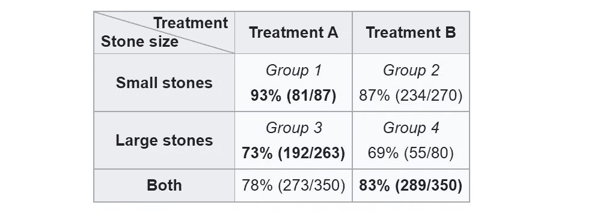
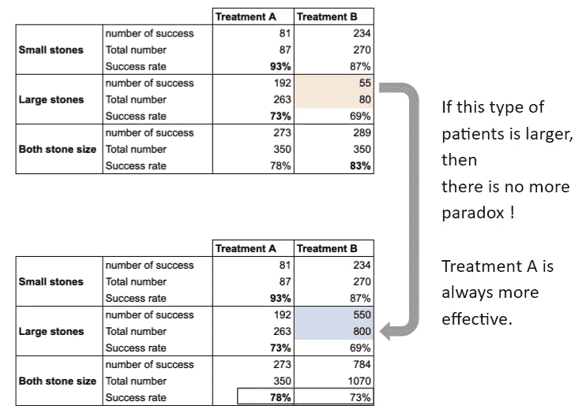
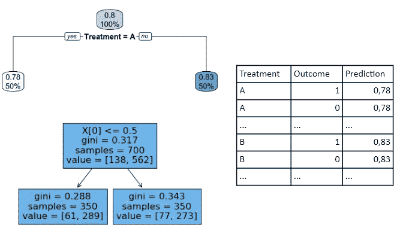
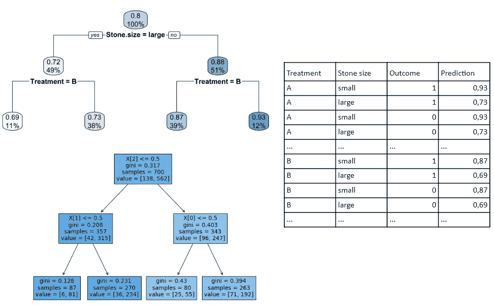
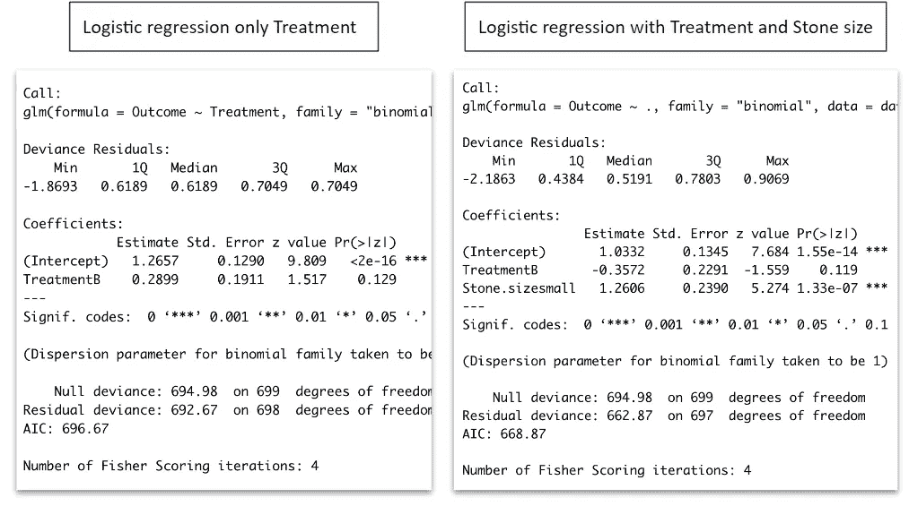
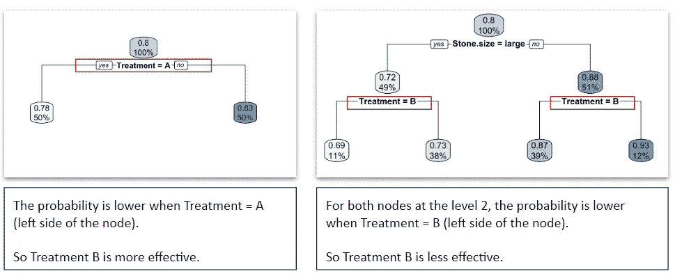
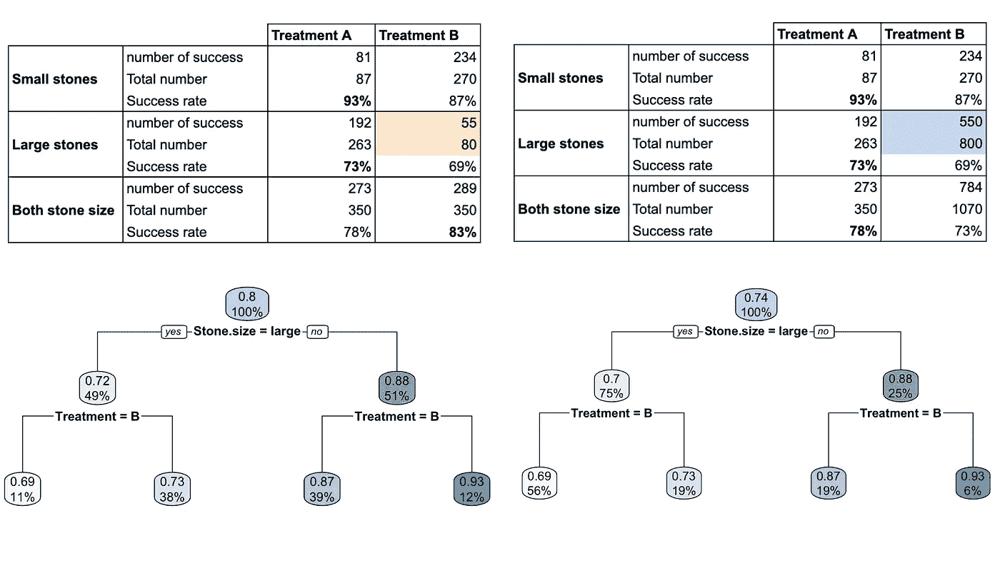
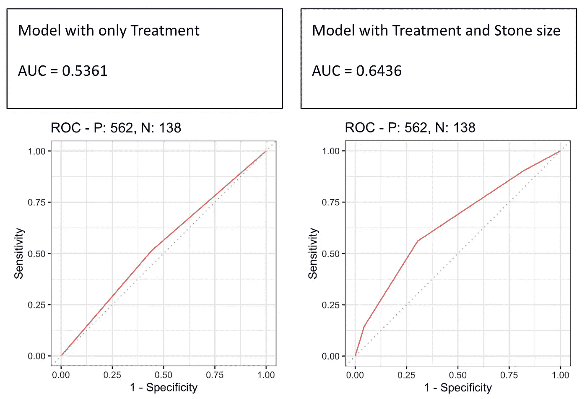

# 用机器学习问题框架理解辛普森悖论

> 原文：<https://towardsdatascience.com/understanding-simpsons-paradox-with-a-machine-learning-problem-framing-4d8b7d6b6abe>

## 所有的困惑都可以解释

辛普森悖论是一个众所周知的统计悖论。像所有的悖论(根据定义)一样，即使我们知道答案，它似乎也不是直观的。在辛普森悖论的情况下，机器学习框架有望让你清楚地看到我们应该如何处理数据。

[Edurne Tx](https://unsplash.com/@edurnetx?utm_source=medium&utm_medium=referral) 在 [Unsplash](https://unsplash.com?utm_source=medium&utm_medium=referral) 上拍摄的照片

# 为什么是悖论？

## 肾结石治疗的例子

让我们回忆一下这个肾结石治疗的例子，在[维基百科文章](https://en.wikipedia.org/wiki/Simpson%27s_paradox)的辛普森悖论中:

> 下表显示了成功率(这里的术语*成功率*实际上是指成功的比例)和涉及小肾结石和大肾结石的治疗次数...括号中的数字表示成功案例的数量占团队总规模的比例。

表来自:[https://en.wikipedia.org/wiki/Simpson%27s_paradox](https://en.wikipedia.org/wiki/Simpson%27s_paradox)

> 矛盾的结论是，当用于小结石时，治疗 A 更有效，当用于大结石时也更有效，然而当同时考虑两种大小时，治疗 B 似乎更有效。

现在的问题是:最终，在治疗 A 和 B 中，哪一个更有效？

更具体地说，如果你是一名医生，一个病人问你哪种治疗方法更有效，你必须给出明确的答案。

*   对于那些声称治疗 B 更有效的人来说，问题是:最终，患者会知道自己肾结石的大小，而结石的其他大小的数据对他们并不适用。所以结论会是 a。
*   对于那些声称治疗 A 更有效的人来说，问题是:如果你的数据中没有关于结石大小的信息呢？
*   如果你认为治疗 A 更有效，因为你有更多的信息，那么我们如何知道没有其他未知的“混杂”变量？这实际上又会与成功率成反比！
*   在我们的案例中，每个案例的样本大小是关键。例如，如果将治疗 B 的大结石患者的样本量乘以 10 会怎么样？不会有悖论！

辛普森悖论样本量偏差——作者图片

如您所见，统计数据在被误用时会产生误导…

那么你最终的答案是什么？一个病人在等着呢！

## 真正的答案似乎显而易见…

现在，让我们忘记统计数据。如果我们看一下这两种疗法的定义，答案可能相当明显:

> 治疗 A 包括开放式外科手术，治疗 B 包括封闭式外科手术

我不是医生，但我认为，在没有任何统计数据的情况下，我会说，一般来说，开放手术(治疗 A)比封闭手术(治疗 B)更有效。

而治疗 A 也通常用于较大的结石，所以比较复杂的病例。而且可能更贵，病人也可能承受更多的痛苦…

## 回到统计数据…

有了一定的领域专业知识，不用统计就能知道结论。但问题是，有时候，你(还)没有专业知识。然后我们必须处理统计数据。

当试图从机器学习实践者的角度来构建这个问题时，会解释很多混乱。

以下是应该回答的问题

*   我们是否必须使用可用的变量？
*   我们如何更好地界定“有效性”的概念？
*   “混杂变量”到底是什么？
*   如何才能知道不再有“混杂变量”？
*   如何处理样本数据可能有偏差的事实？

对于如何知道不再有混杂变量的问题，我们可以用一个回归的例子来说明。

带有两个混淆变量的辛普森悖论——作者图片

# 监督学习问题框架

## 特征和目标变量

为了建立机器学习模型，我们首先必须导入数据集。我们有哪些变量？特征变量为 ***结石大小*** 和 T ***处理*** 。

目标变量是一个二元变量 ***结果*** 以表示成功或失败。

问题是找到一个模型，用变量**结石大小**和**治疗**来预测结果。这是一个二元分类问题。

数据非常简单，许多行都是相同的，所以我们可以指出行数。

肾结石治疗数据集-图片由作者提供

## 构建机器学习模型

我们可以建立一些机器学习模型来预测目标变量。你可以通过这篇文章对机器学习模型有一个[的概述。这里我们将建立一个**决策树**模型和**逻辑回归**模型来预测成功率。](/overview-of-supervised-machine-learning-algorithms-a5107d036296)

我会用 R 和 python。如果你想拥有所有的代码，你可以在这里访问它[。](https://ko-fi.com/s/4cc6555852)

首先，对于只有一个变量**的处理**和决策树是相当简单的。我们可以用 R 或者 python 来建立模型。我在下图中展示了它们。最终的预测只取决于治疗的类型。

一元辛普森悖论决策树—作者图片

然后我们可以使用这两个特征，这是得到的决策树。重要的是要注意，根首先用变量**石头大小**一分为二。在我们已经看过的统计表中，你可以根据治疗和结石大小来判断不同的成功率。

两个变量的辛普森悖论决策树—作者图片

我们也可以建立逻辑回归模型，我们从 R 中得到结果，以及所有的系数和它们的显著性。

辛普森悖论逻辑回归—作者图片

值得注意的是，当有两个特征时，决策树模型和逻辑回归模型之间的预测略有不同。因为逻辑回归是线性分类器，而决策树是非线性模型。

使用机器学习模型预测辛普森悖论——图片由作者提供

现在，我们能对这两个模型说些什么呢？

## 对模型的评论

现在，让我们回到我们的问题:

*   **我们是否必须使用可用的变量？** →是的，我会一直使用所有可用的数据，机器学习模型会帮助我们使用或不使用它们。当没有使用足够的特征变量时，当我们谈到欠拟合时。因此，当涉及更多特性时，结论总是更好。
*   我们如何更好地定义“有效性”的概念？ →治疗的有效性就是这个变量的重要性。总的来说，我们可以谈论所有特性的重要性。我们应该在整个模型中解释变量的重要性，通过分析目标变量的一个特征(或几个特征)得出结论是不正确的。因此，对于治疗，我们可以在我们建立的两个模型中解释其不同的重要性:

对于决策树模型，我们可以看到，当只有一个特征处理时，处理 B 更有效。当有两个特征变量时，处理 B 变得更有效。

辛普森悖论与决策树的可变重要性—图片由作者提供

对于逻辑回归模型，我们用治疗系数 b 的符号来解释变量重要性(这里使用了一个热编码)。

使用逻辑回归的辛普森悖论变量重要性—图片由作者提供

顺便说一下，我们还注意到 p 值小于 5%。所以通常我们会得出结论，变量不显著，所以系数被认为是零。但是嘿，5%不是绝对的规定！

*   什么是真正的“混杂变量”？ →从机器学习模型的角度来看，当模型变得更加复杂时，混淆变量会改变其重要性，从而产生混淆。这里我们可以看到可变的**结石大小**比**处理**更重要。因为当涉及到这两个特征时，石头大小在 logistic 回归模型中的系数更大(我们可以比较系数，因为它们都是二进制的)，石头大小在决策树模型中也被用来做第一次分裂。因此，如果我们忽略一个更重要的变量，直接分析目标变量和一个不太重要的特征，结论可能是不相关的。
*   **如何才能知道不再有“混杂变量”？** →这个问题已经用珍贵的问题回答了。模型会给我们每个变量的重要性。如果我们使用最重要的变量来得出一些结论，那么我们应该对它们有信心。现在的问题当然是，如果我们没有所有的变量呢？嗯，除了收集更多的数据，你什么也做不了。这就是为什么我们说数据是新的石油。
*   **如何解决样本数据可能存在偏差的问题？** →当使用机器学习模型时，样本大小没有那么大的影响。下图我们可以看到，当大石块和处理 B 的样本量乘以 10，决策树模型几乎是一样的。

样本量的辛普森悖论影响—作者图片

## 关于不合身的更多信息…

由于第一个模型只使用了一个变量，我们可以说存在欠拟合。当数据被收集时，很明显，机器学习实践者会使用所有的变量。

对于高级模型，我们通常会讨论如何避免过度拟合。在实践中，我们通常会对模型进行欠拟合，因为我们没有足够的数据。所以在实践中，克服欠拟合的问题要比过拟合困难得多。

*   为了克服过度拟合，我们必须调整模型
*   为了克服拟合不足，我们必须收集更多的数据！

在下图中，我们可以看到两种模型的 AUC。

辛普森悖论 AUC 比较—作者图片

从机器学习实践者的角度来看，这些分数很低，尤其是考虑到只使用了两个特征这一事实。我们可以考虑更多的特征来提高预测的性能。

# 结论

我希望辛普森悖论现在不会再让你感到困惑。以下是我对使用机器学习模型的想法:

*   机器学习模型可以用在比人们想象的更多的情况下。在实践中，问题框架是最具挑战性的部分。当(X，y)被定义时，很容易写出 model.fit(X，y)。
*   机器学习模型通常被构建来预测目标变量。但在某些情况下，关于变量重要性的定性结果对商业人士来说可能是非常有洞察力的。
*   数据是新的石油！你真的可以用更多的数据改变游戏。这就是为什么 GAFAM 正在收集更多关于用户的数据。对于医疗数据，收集更多的数据也很重要。对于我们的肾脏治疗案例，如果我们有更多的数据，如年龄、性别、体重等。它们可以帮助创建一个更好的模型来预测成功率。
*   到最后，成功率不一定是我们想要的最终结果！如果 A 治疗比 B 治疗贵很多呢？死亡风险呢？

所以我最后的想法是:了解你的统计数据，了解你的机器学习模型，不要忘记现实生活要复杂得多！

别忘了[获取代码](https://ko-fi.com/s/4cc6555852)，了解更多关于机器学习的知识。谢谢你的支持。

[请在高保真上支持我——作者图片](https://ko-fi.com/s/4cc6555852)