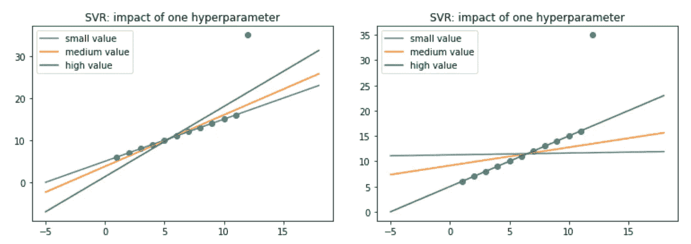
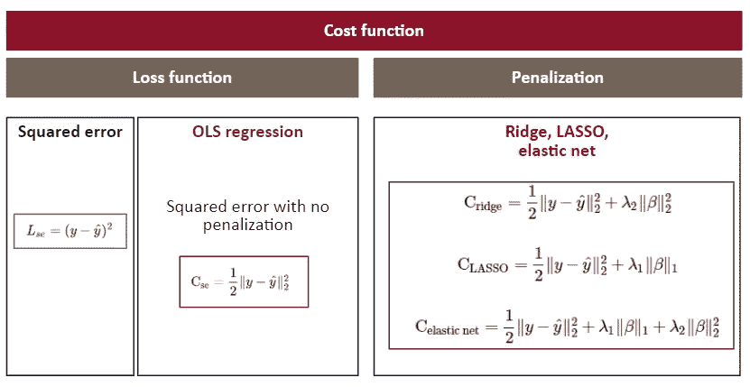
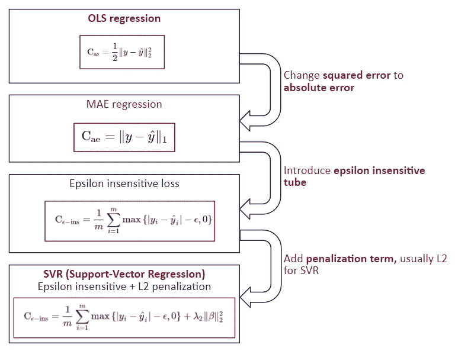
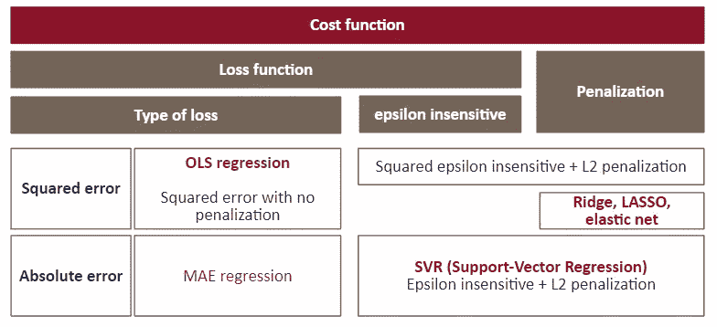
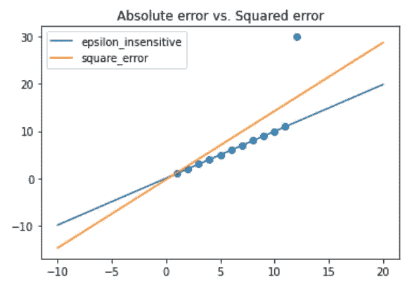
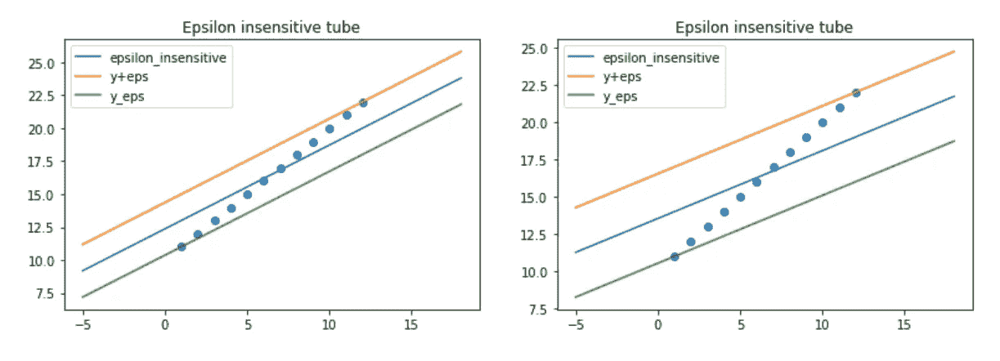
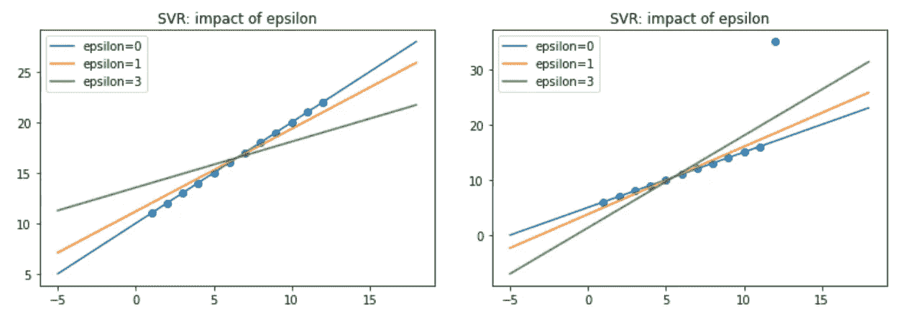
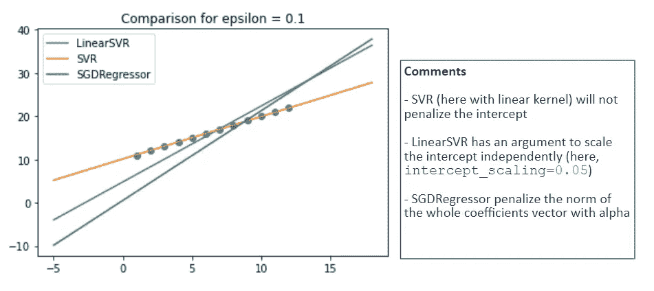

# 使用 Scikit-learn 了解 SVR 和 Epsilon 不敏感损耗

> 原文：<https://towardsdatascience.com/understanding-svr-and-epsilon-insensitive-loss-with-scikit-learn-28ec03a3d0d9>

## 通过可视化清楚地解释超参数的影响

SVR 或支持向量回归是一种回归任务模型。对于那些想知道它为什么有趣或认为他们已经知道模型如何工作的人，这里有一些简单的问题:

考虑以下只有一个要素和一些异常值的简单数据集。在每个图中，一个超参数改变了它的值，因此我们可以直观地解释模型是如何受到影响的。你能说出每个图形中的超参数是什么吗？

超参数的 SVR 影响-作者提供的图片

如果你不知道，那么，这篇文章就是为你写的。文章的结构是这样的:

*   首先，我们将回忆线性回归的不同损失函数。我们将看到如何从 OLS 回归到 SVR。
*   然后，我们将研究定义 SVR 成本函数的所有超参数的影响。

# 1.线性模型及其成本函数

## 1.1 OLS 回归及其惩罚版本

SVR 是一个线性回归器，像所有其他线性回归器一样，该模型可以写成 *y = aX+b* 。

然后求系数( *a* 和 *b* ，可以有不同的损失函数和代价函数。

[损失函数和成本函数](https://stats.stackexchange.com/questions/179026/objective-function-cost-function-loss-function-are-they-the-same-thing)的术语提示:一个**损失函数**通常定义在一个数据点上…一个**成本函数**通常更通用。它可能是训练集上损失函数的总和加上一些模型复杂性损失(正则化)。

最著名的线性模型当然是 OLS ( **普通最小二乘**)回归。有时候，我们就称之为**线性回归**(我觉得有点混乱)。我们称之为**普通**是因为系数没有被正则化或者惩罚。我们称之为**最小平方**，因为我们试图最小化平方误差。

如果我们引入系数的正则化，那么我们得到**山脊**、**套索**，或者**弹性网**。这里是一个回顾:

OSL 回归、岭、套索和弹性网的成本函数-图片由作者提供

## 1.2 从 OLS 回归到支持向量回归

现在，如果我们尝试使用另一个损失函数呢？另一个常见的是**绝对误差**。它可以有一些很好的性质，但我们通常说我们不使用它，因为它是不可微的，因此我们不能使用梯度下降来找到它的最小值。但是，我们可以使用随机梯度下降来克服这个问题。

然后想法是使用一个“**不敏感管**，其中的误差被忽略。这就是为什么在 SVR 的损失函数的名称中，我们有术语“ε不敏感”,ε定义了管的“宽度”。

最后，我们添加惩罚项。对于 SVR，通常是 L2。

这里有一个图表总结了我们如何从 OLS 回归到支持向量回归机。

从 OLS 回归到支持向量回归机——作者图片

## 1.3 阐明所有术语的大局

为了定义最终的成本函数，我们必须定义损失函数和惩罚。对于一个损失函数(平方误差或绝对误差)，可以引入“ε不敏感管”的概念，其中误差被忽略。

有了这三个概念，我们就可以随心所欲地构造最终的成本函数。由于一些历史原因，一些组合比其他组合更常见，而且，它们有一些既定的名称。

这是包含所有损失函数和成本函数的图表:

线性模型的成本函数—作者图片

下面是一个简化的视图:

线性模型的成本函数—作者图片

所以 SVR 是一个线性模型，其代价函数由**ε不敏感损失函数**和 **L2 惩罚**组成。

一个有趣的事实:当我们为分类定义 SVM 时，我们强调“边际最大化”部分，这相当于系数最小化，使用的范数是 L2。对于 SVR，我们通常关注“ε不敏感”部分。

我们通常不会说 MEA 回归，但它只是当 epsilon 为 0 且不使用惩罚时 SVR 的一个特例。

我们常说，山脊线、套索线和弹性网是 OLS 回归的改进版本。为了得到大的图片，最好说山脊，套索，和 OLS 是弹性网的特殊情况。

“ε不敏感管”也可以应用于 OLS 回归。但是没有专门的名称。这种损失称为平方ε不敏感。

因此在本文中，我们将研究 SVR，以了解以下影响:

*   平方误差与绝对误差
*   ε不敏感电子管和 L2 惩罚的影响
*   平方ε不敏感与ε不敏感

# 2.超参数影响分析

为了直观显示超参数值变化时的影响，我们将使用只有一个要素的简单数据集。目标变量 y 将与特征 x 具有线性关系，因为如果不是这样，线性模型将不能很好地拟合。我们还引入了一个异常值，因为如果数据集是全局线性的，那么我们不会看到大的差异。

我们将在 sci-kit learn 中使用不同的估计器——[SGD regressor](https://scikit-learn.org/stable/modules/generated/sklearn.linear_model.SGDRegressor.html#sklearn.linear_model.SGDRegressor)、 [LinearSVR](https://scikit-learn.org/stable/modules/generated/sklearn.svm.LinearSVR.html#sklearn.svm.LinearSVR) 或[SVR](https://scikit-learn.org/stable/modules/generated/sklearn.svm.SVR.html#sklearn.svm.SVR)——因为它允许我们选择超参数的不同值。我们还将讨论它们之间的一些微妙差异。

你可以在这里找到所有代码[的笔记本。](https://ko-fi.com/s/4cc6555852)

## 2.1 绝对误差对异常值更稳健

为了只分析损失类型:绝对误差与平方误差，我们将α和ε设为 0。所以我们基本上是在比较 OLS 回归和 MAE 回归。

线性模型的绝对误差与平方误差——图片由作者提供

MEA 最小化将最小化中间值，而 MSE 最小化平均值。

因此，在这种情况下，异常值被 SVR(或 MEA 回归)完全忽略，而它会影响 OLS 回归。

## 2.2ε不敏感管和处罚

为了使“ε不敏感管”形象化，我们可以绘制下图。

Epsilon 不敏感电子管 SVR —图片由作者提供

对于足够大的ε值(在这种情况下，ε的任何正值都足够大，因为数据集是完全线性的)，ε管将包含所有数据集。打个比方，在使用 SVM 分类的情况下，我们使用术语“硬边界”来描述数据点完全线性可分的事实。这里我们可以说它是一个“硬管”。

然后，必须实施惩罚，否则我们将有多种解决方案。因为所有可以包含数据点的管都是没有惩罚的解。通过惩罚，唯一的解决方案将是具有最低斜率(或最小的 L2 范数)的解决方案。这也相当于在 SVM 用于分类的情况下的“边际最大化”，因为“边际最大化”相当于“系数范数最小化”。这里我们也可以将“余量”定义为管的宽度，目标是使管的宽度最大化。

ε不敏感的兴趣是什么？当某些数据点的误差很小时，它们会被忽略。所以要找到最终的模型，只有一些数据点是有用的。

下图显示了存在异常值时，不同ε值的模型如何变化。所以基本上:

*   当ε值较小时，模型对异常值是稳健的。
*   当ε的值较大时，它会考虑离群值。
*   当ε的值足够大时，惩罚项开始起作用，以使系数的范数最小。

艾司隆不敏感损失-作者图片

## 2.3 拦截的处罚

当有许多特征时，截距的惩罚不太重要。但是这里我们只有一个特性，影响可能是混乱的。

例如，在数据集完全线性的情况下，ε值很小(或为 0)，我们应该会看到一个相当完美的模型(拟合数据点)。但是正如你在下面看到的，估计量 LinearSVR 和 SGDRegressor 给出了一些令人困惑的结果。

SVR 中的拦截惩罚—作者图片

为了可视化 alpha(或 C，即 1/alpha)的影响，我们可以使用 SVR。C 小的时候正则化强，所以斜率会小。

作者对 C-image 的 SVR 影响

# 结论

什么是 SVR？如何解释这个线性模型的工作原理？什么时候用？与其他线性模型有何不同？

以下是我的想法:

*   首先，与 OLS 回归相比，对于绝对误差，SVR 对异常值更稳健。所以如果两个模型给出非常不同的结果，那么我们可以尝试找出异常值并删除它们。我所说的异常值是指目标变量的异常值。
*   那么ε不敏感管有助于我们忽略有小误差的数据点。从模型优化的角度来看，并不是真的有用，因为数据少意味着信息少。但是从计算的角度来看，它可以加速模型训练。最后，只有一些数据点被用来定义模型，它们相应地被称为支持向量。
*   最后，应适用惩罚条款。值得注意的是，在用于分类的 SVM 的情况下，“余量最大化”等同于“惩罚”，并且对于 SVR，惩罚可以被解释为ε不敏感管的宽度的最大化。

别忘了[获取代码](https://ko-fi.com/s/4cc6555852)，了解更多关于机器学习的知识。谢谢你的支持。

[请在高保真上支持我——作者图片](https://ko-fi.com/s/4cc6555852)

如果你想了解如何用 Excel 训练机器学习模型，可以在这里访问一些有趣的文章[。](https://ko-fi.com/s/4ddca6dff1)