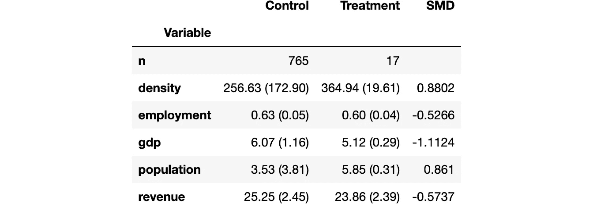
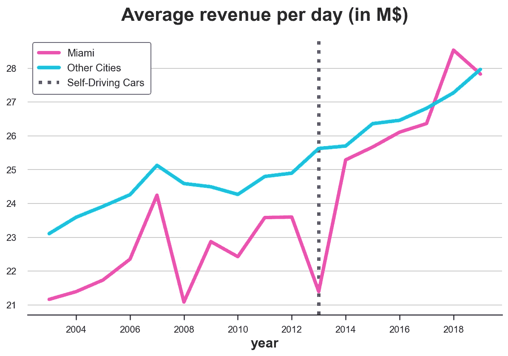
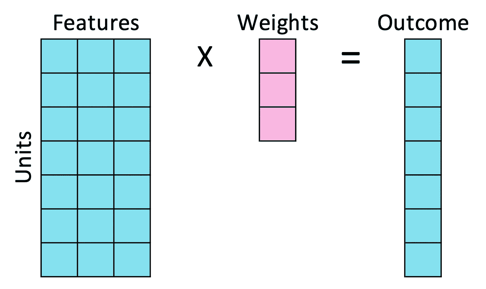
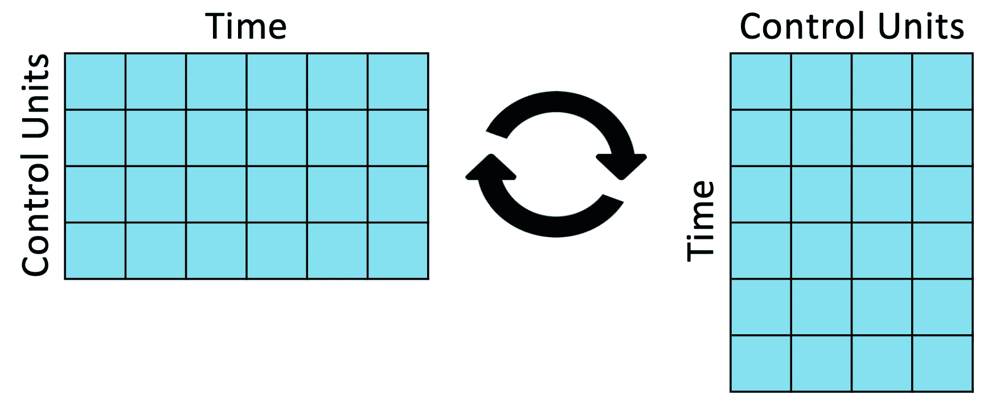
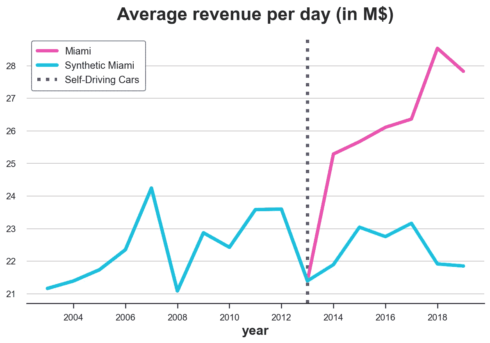
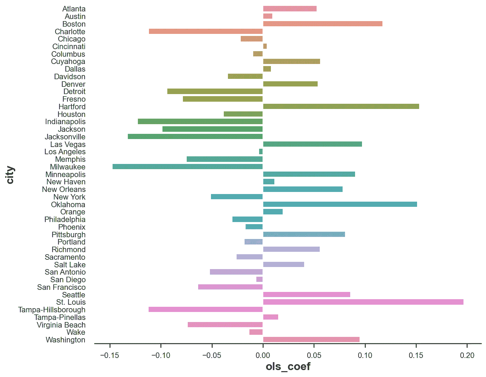
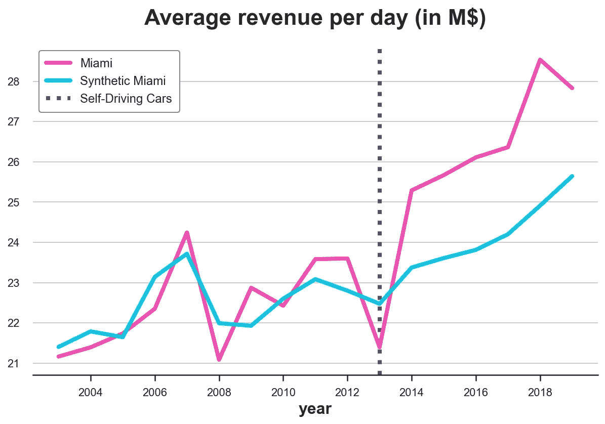
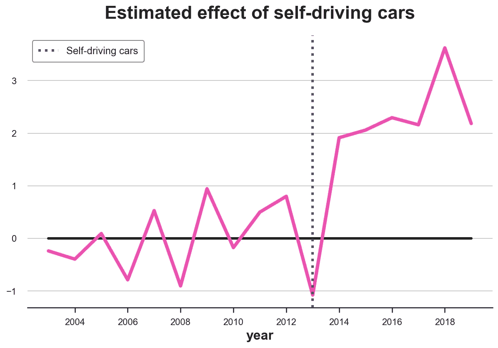
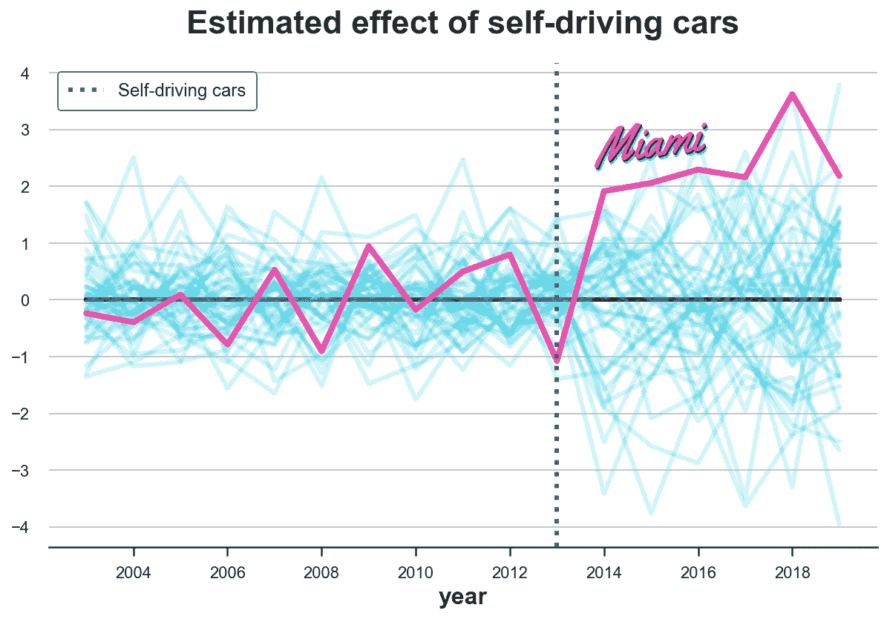
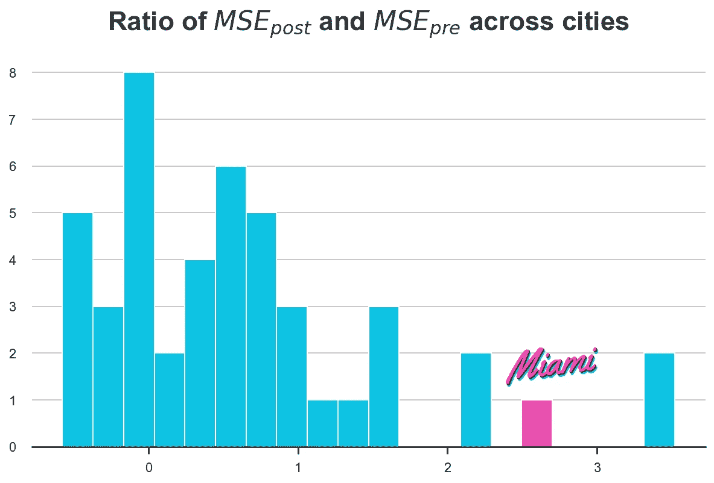

# 了解综合控制方法

> 原文：<https://towardsdatascience.com/understanding-synthetic-control-methods-dd9a291885a1>

## [因果数据科学](https://towardsdatascience.com/tagged/causal-data-science)

## *业内最流行的因果推理技术之一的详细指南*


封面，作者图片

现在人们普遍认为，计算治疗(药物、广告、产品等)对感兴趣的结果(疾病、公司收入、客户满意度等)的**因果效应**的黄金标准技术是 **AB 测试**，也称为随机实验。我们将一组受试者(患者、用户、顾客……)随机分为治疗组和对照组，并对治疗组进行治疗。这一程序确保了在此之前，两组之间的唯一预期差异是由治疗引起的。

AB 测试的一个关键假设是治疗组和对照组之间没有**污染**。给治疗组的一个病人服用一种药物并不影响对照组病人的健康。举例来说，如果我们试图治愈一种传染性疾病，而这两个群体并没有被隔离，情况可能就不一样了。在这个行业中，经常违反污染假设的是**网络效应**——我使用社交网络的效用随着网络上朋友数量的增加而增加——和**一般均衡效应**——如果我改进一个产品，它可能会减少另一个类似产品的销售。

由于这个原因，实验通常在足够大的范围内进行，这样就不会有跨群体的污染，如城市、州、甚至国家。然后另一个问题因为规模更大而出现:治疗变得**更贵**。给医院里 50%的病人开一种药，比给一个国家 50%的城市开一种药要便宜得多。因此，通常只有**几个单位接受治疗**但通常需要更长的时间。

在这种背景下，一种非常强大的方法在大约 10 年前出现:**合成控制**。综合控制的思想是利用数据的时间变化而不是横截面变化(跨时间而不是跨单元)。这种方法在业内非常流行——例如在像[谷歌](https://proceedings.neurips.cc/paper/2021/file/48d23e87eb98cc2227b5a8c33fa00680-Paper.pdf)、[优步](https://eng.uber.com/causal-inference-at-uber/)、[脸书](https://research.facebook.com/publications/regression-adjustment-with-synthetic-controls-in-online-experiments/)、[微软](https://github.com/Microsoft/SparseSC)和[亚马逊](https://www.amazon.science/publications/a-self-supervised-approach-to-hierarchical-forecasting-with-applications-to-groupwise-synthetic-controls)这样的公司——因为它很容易解释和处理经常大规模出现的背景。在这篇文章中，我们将通过例子来探索这种技术:我们将调查自动驾驶汽车对于拼车平台的有效性。

# 无人驾驶汽车的例子

假设你是一个**拼车平台**，你想在你的车队中测试自动驾驶汽车的效果。

可以想象，对于这种类型的特性，运行 AB/test 有许多限制。首先，把个人乘坐随机化是很复杂的。第二，这是一个非常昂贵的干预。第三，也是统计上最重要的一点，你不能在游乐设备级别进行干预。问题是，从治疗组到控制组存在**溢出**效应:如果自动驾驶汽车确实更高效，这意味着它们可以在相同的时间内服务更多的客户，减少了普通司机(对照组)可以获得的客户。这种溢出污染了实验，并阻止了对结果的因果解释。

出于所有这些原因，我们只选择一个城市。鉴于这篇文章的合成氛围，我们不得不选择… ( *鼓声* )…迈阿密！


迈阿密天际线，图片来自[Unsplash.com](https://unsplash.com/)

我生成了一个模拟数据集，在这个数据集里，我们观察了一组美国城市随时间的变化。收入数据是虚构的，而社会经济变量取自 [OECD 2022 大都市地区数据库](https://stats.oecd.org/Index.aspx?DataSetCode=CITIES)。我从`[src.dgp](https://github.com/matteocourthoud/Blog-Posts/blob/main/notebooks/src/dgp.py)`导入数据生成过程`dgp_selfdriving()`。我还从`[src.utils](https://github.com/matteocourthoud/Blog-Posts/blob/main/notebooks/src/utils.py)`引进了一些绘图函数和库。

```
from src.utils import *
from src.dgp import dgp_selfdriving

treatment_year = 2013
treated_city = 'Miami'
df = dgp_selfdriving().generate_data(year=treatment_year, city=treated_city)
df.head()
```


数据快照，图片由作者提供

我们有 2002 年至 2019 年期间美国最大的 46 个城市的信息。面板是**平衡的**，这意味着我们在所有时间段观察所有城市。自动驾驶汽车于 2013 年推出。

迈阿密的**处理过的**单元与样本中的其他单元具有可比性吗？让我们使用优步的`[causalml](https://causalml.readthedocs.io/)`包中的`create_table_one`函数来生成一个**协变量平衡表**，包含我们在治疗组和对照组中可观察到的特征的平均值。顾名思义，这应该永远是你在因果推断分析中呈现的第一张表。

```
from causalml.match import create_table_one

create_table_one(df, 'treated', ['density', 'employment', 'gdp', 'population', 'revenue'])
```



平衡表，作者图片

不出所料，这两个群体并不均衡:在我们的样本中，迈阿密比美国其他城市人口更密集、更贫穷、更大、就业率更低。

我们有兴趣了解**自动驾驶汽车**的推出对`revenue`的影响。

一个最初的想法可能是像我们在 A/B 测试中那样分析数据，比较对照组和治疗组。在引入自动驾驶汽车后，我们可以将治疗效果估计为治疗组和对照组之间在`revenue`中的均值差异。

```
smf.ols('revenue ~ treated', data=df[df['post']==True]).fit().summary().tables[1]
```


回归结果，图片由作者提供

自动驾驶汽车的效果看似负面但不显著。

这里的主要问题是治疗不是由**随机分配的**。我们有一个单一的治疗单位，迈阿密，它几乎不能与其他城市相比。

另一种方法是在迈阿密市内比较治疗前后的收入。

```
smf.ols('revenue ~ post', data=df[df['city']==treated_city]).fit().summary().tables[1]
```


回归结果，图片由作者提供

自动驾驶汽车的效果似乎是积极的，具有统计意义。

然而，这一程序的问题在于，2013 年后可能会有许多其他事情发生。把所有的差异都归结于自动驾驶汽车是相当牵强的。

如果我们画出各城市税收的时间趋势，就能更好地理解这种担忧。首先，我们需要将数据转换成宽格式**，每个城市一列，每年一行。**

```
df = df.pivot(index='year', columns='city', values='revenue').reset_index()
```

**现在，让我们画出迈阿密和其他城市的收入随时间变化的曲线图。**

```
cities = [c for c in df.columns if c!='year']
df['Other Cities'] = df[[c for c in cities if c != treated_city]].mean(axis=1)
```

**既然我们正在谈论迈阿密，让我们使用一个适当的调色板。**

```
sns.set_palette(sns.color_palette(['#f14db3', '#0dc3e2', '#443a84']))plot_lines(df, treated_city, 'Other Cities', treatment_year)
```

****

**正如我们所见，在迈阿密治疗后，收入似乎在增加。但这是一个非常不稳定的时间序列。该国其他地区的收入也在增加。从这个情节来看，很难将这种变化归因于自动驾驶汽车。**

**我们能做得更好吗？**

# **综合控制**

**答案是肯定的！当我们有**少至一个处理单元**和**多个控制单元**时，综合控制允许我们进行因果推断，并且我们随着时间观察它们**。这个想法很简单:将未处理的单元组合起来，使它们尽可能地模拟未处理单元的行为。然后用这个“合成单元”作为对照。该方法首先由 [Abadie 和 Gardeazabal (2003)](https://www.jstor.org/stable/3132164) 提出，并被称为[“过去几年政策评估文献中最重要的创新”](https://www.aeaweb.org/articles?id=10.1257/jep.31.2.3)。此外，由于其简单性和可解释性，它在行业中被广泛使用。****

## **环境**

**我们假设，对于一组 i.i.d .受试者 *i = 1，…，n* 随着时间的推移 *t=1，…，T* ，我们观察到一组变量 *(Xᵢₜ,Dᵢ,Yᵢₜ)* ，包括**

*   **一项治疗任务 *Dᵢ∈{0,1}* ( `treated`)**
*   **一个回应 *Yᵢₜ∈ℝ* ( `revenue`)**
*   **一个特征向量 *Xᵢₜ∈ℝⁿ* ( `population`、`density`、`employment`和`GDP`)**

**此外，在时间***(在我们的例子中是 2013 年)处理一个单元(在我们的例子中是迈阿密)。我们区分治疗前的时间段和治疗后的时间段。**

**至关重要的是，治疗 *D* 不是随机分配的，因此治疗组和对照组之间的平均值差异不是平均治疗效果的无偏估计值。**

## **问题是**

**问题是，像往常一样，我们没有观察到治疗单位的反事实结果，即我们不知道如果他们没有接受治疗会发生什么。这就是所谓的**因果推论的基本问题**。**

**最简单的方法就是比较治疗前后的时间。这被称为**事件研究**方法。**

**然而，我们可以做得比这更好。事实上，即使治疗不是随机分配的，我们仍然可以进入一些没有接受治疗的单位。**

**对于结果变量，我们观察以下值**

****

**结果变量，按作者分类的图像**

**其中 *Y* ⁽ᵈ⁾ₐ,ₜ是在时间 *t* 的结果，给定治疗分配 *a* 和治疗状态 *d* 。我们基本上有一个**缺失数据问题**，因为我们没有观察到 *Y* ⁽⁰⁾ₜ,ₚₒₛₜ:在未经处理( *a=t* )的情况下会发生什么。**

## **解决方案**

**根据 [Doudchenko 和 Inbens (2018)](https://arxiv.org/pdf/1610.07748.pdf) ，我们可以将治疗单位的反事实结果估计值公式化为对照单位观察结果的线性组合。**

****

**合成控制结果，图像由作者提供**

**在哪里**

*   **常数 *α* 允许两组之间有不同的平均值**
*   **重量 *βᵢ* 允许在控制单元 *i* 之间变化(否则，这将是差异中的差异)**

**我们应该如何**选择使用哪些砝码**？我们希望在治疗前，我们的合成对照尽可能接近结果。第一种方法是将权重定义为**

****

**合成控制权重，图片由作者提供**

**也就是说，权重使得在处理之前，控制单元 *Xc* 和被处理单元 *Xₜ* 的可观察特征之间的距离最小化。**

**您可能会注意到与**线性回归**非常相似。事实上，我们正在做非常相似的事情。**

**在线性回归中，我们通常有**多个单元**(观察值)**几个外生特征，**和**一个内生特征**，我们尝试将每个单元的内生特征表达为内生特征的线性组合。**

****

**线性回归，作者图片**

**对于综合控制，我们改为使用**多个时间段**(特征)、几个**控制单元**和单个**处理单元**，并且我们尝试将处理单元表示为每个时间段的控制单元的线性组合。**

**为了执行相同的操作，我们本质上需要**转置数据**。**

****

**由作者转置数据、图像**

**交换后，我们计算**综合控制**权重，就像我们计算回归系数一样。但是，现在一个观测值是一个时间段，一个要素是一个单元。**

****

**合成控制回归，图片由作者提供**

**请注意，这种交换是**而不是无辜的**。在线性回归中，我们假设外源特征和内源特征之间的关系在单位中是相同的**，而在合成控制中，我们假设处理单位和控制单位之间的关系在时间**上是相同的**。****

## **回到自动驾驶汽车**

**现在让我们回到数据上来！首先，我们编写一个`synth_predict`函数，该函数将一个模型作为输入，该模型在对照城市进行了训练，并试图在无人驾驶汽车引入之前预测被处理城市迈阿密的结果。**

**让我们通过线性回归估计模型。**

```
from sklearn.linear_model import LinearRegression

coef = synth_predict(df, LinearRegression(), treated_city, treatment_year).coef_
```

**在迈阿密，我们**与**预无人驾驶汽车`revenue`的匹配程度如何？自动驾驶汽车的隐含**效果**是什么？**

**通过将迈阿密的实际收入与预测收入进行对比，我们可以直观地回答这两个问题。**

```
plot_lines(df, treated_city, f'Synthetic {treated_city}', treatment_year)
```

****

**观察和合成的迈阿密收入，作者图片**

**看起来自动驾驶汽车对迈阿密的`revenue`产生了明显的**积极影响**:预测趋势低于实际数据，并在自动驾驶汽车推出后立即偏离。**

**另一方面，我们显然是**过拟合**:预处理预测`revenue`线与实际数据完美重叠。鉴于迈阿密`revenue`的高度可变性，至少可以说这是可疑的。**

**另一个问题与**砝码**有关。让我们画出它们。**

```
df_states = pd.DataFrame({'city': [c for c in cities if c!=treated_city], 'ols_coef': coef})
plt.figure(figsize=(10, 9))
sns.barplot(data=df_states, x='ols_coef', y='city');
```

****

**合成控制权重，图片由作者提供**

**我们有很多**负权重**，从因果推理的角度来看没有太大意义。我可以理解迈阿密可以表示为 0.2 圣路易斯，0.15 俄克拉荷马，0.15 哈特福德的组合。但是迈阿密是-0.15 密尔沃基是什么意思？**

**因为我们想把我们的合成对照解释为未处理状态的加权平均值，所有的权重应该是正的，并且它们的总和应该是 1。**

**为了解决这两个问题(权重和过度拟合)，我们需要对权重施加一些**限制。****

## **限制重量**

**为了解决超重和负权重的问题， [Abadie、Diamond 和 Hainmueller (2010)](https://www.tandfonline.com/doi/abs/10.1198/jasa.2009.ap08746) 提出了以下权重:**

****

**权重的约束定义，按作者排列的图像**

**该公式暗示了一组权重 *β* ,使得**

*   **对照组 *Xc* 的加权可观察特征与治疗前治疗组 *Xₜ* 的可观察特征相匹配**
*   **它们总计为 1**
*   **并且不是负面的。**

**通过这种方法，我们得到一个**可解释的反事实**作为未处理单位的加权平均值。**

**现在让我们写出我们自己的目标函数。我创建了一个新的类`SyntheticControl()`，它有一个`loss`函数，如上所述，一个方法来`fit`它和`predict`被处理单元的值。**

**我们现在可以像以前一样重复同样的程序，但是使用`SyntheticControl`方法代替简单的、不受约束的`LinearRegression`。**

```
df_states['coef_synth'] = synth_predict(df, SyntheticControl(), treated_city, treatment_year).coef_
plot_lines(df, treated_city, f'Synthetic {treated_city}', treatment_year)
```

****

**观察和合成的迈阿密收入，作者图片**

**正如我们所看到的，现在我们不再过度适应了。实际和预测的`revenue`预处理接近但不相同。原因是非负约束将大多数系数约束为零(正如[拉索](https://scikit-learn.org/stable/modules/generated/sklearn.linear_model.Lasso.html)所做的)。**

**看起来效果又是负面的。然而，让我们画出两条线之间的**差**来更好地形象化大小。**

```
plot_difference(df, treated_city, treatment_year)
```

****

**观察到的迈阿密和合成的迈阿密之间的差异，图片由作者提供**

**这种差异显然是正的，并且随着时间的推移略有增加。**

**我们还可以可视化**权重**来解释估计的反事实(如果没有自动驾驶汽车，迈阿密会发生什么)。**

```
plt.figure(figsize=(10, 9))
sns.barplot(data=df_states, x='coef_synth', y='city');
```

****

**受约束的权重，按作者排序的图像**

**正如我们所看到的，现在我们将迈阿密的`revenue`表示为几个城市的线性组合:坦帕、圣路易斯，以及在较低程度上的拉斯维加斯。这使得整个程序非常**透明**。**

# **推理**

**那么**推论**呢？估计值是否明显不同于零？或者，更实际地说，“在没有政策效应的零假设下，这个估计值有多不寻常？”。**

**为了回答这个问题，我们将进行一个 [**随机/排列测试**](https://en.wikipedia.org/wiki/Permutation_test) 。**想法**是，如果政策没有效果，我们在迈阿密观察到的效果不应该与我们在任何其他城市观察到的效果有明显不同。**

**因此，我们将对所有其他城市重复上述过程，并将它们与迈阿密的估计值进行比较。**

```
fig, ax = plt.subplots()
for city in cities:
    synth_predict(df, SyntheticControl(), city, treatment_year)
    plot_difference(df, city, treatment_year, vline=False, alpha=0.2, color='C1', lw=3)
plot_difference(df, treated_city, treatment_year)
```

****

**合成效果的分布，按作者分类的图像**

**从图表中，我们注意到两件事。首先，对迈阿密的影响非常极端，因此不太可能是由随机噪音造成的。**

**第二，我们还注意到，有几个城市我们不能很好地拟合前期趋势。特别是，有一条线明显低于所有其他线。这是意料之中的，因为对于每个城市，我们都将反事实趋势构建为所有其他城市的凸组合。就`revenue`而言非常极端的城市对于构建其他城市的反事实非常有用，但是**很难为它们构建反事实**。**

**为了不影响分析，让我们排除那些我们不能建立“足够好”的反事实的州，就治疗前 MSE 而言。**

****

**预处理预测均方误差，图片由作者提供**

**根据经验， [Abadie、Diamond 和 Hainmueller (2010)](https://www.tandfonline.com/doi/abs/10.1198/jasa.2009.ap08746) 建议排除预测均方误差大于处理单元均方误差两倍的单元。**

```
# Reference mse
mse_treated = synth_predict(df, SyntheticControl(), treated_city, treatment_year).mse

# Other mse
fig, ax = plt.subplots()
for city in cities:
    mse = synth_predict(df, SyntheticControl(), city, treatment_year).mse
    if mse < 2 * mse_treated:
        plot_difference(df, city, treatment_year, vline=False, alpha=0.2, color='C1', lw=3)
plot_difference(df, treated_city, treatment_year)
```

****

**没有不可预测单元的合成效果的分布，由作者提供的图像**

**在排除了极端的观察之后，看起来对迈阿密的影响很不寻常。**

**Abadie、Diamond 和 Hainmueller (2010) 建议进行随机化检验的一个**统计量**是治疗前 MSE 和治疗后 MSE 之间的比率。**

****

**前后均方预测误差比，图片由作者提供**

**我们可以将 p 值计算为具有较高比率的观察值的数量。**

```
p-value: 0.04348
```

**似乎只有 4.3%的城市的 MSE 比率大于迈阿密，这意味着 p 值为 0.043。我们可以用直方图形象化排列下统计量的分布。**

```
fig, ax = plt.subplots()
_, bins, _ = plt.hist(lambdas.values(), bins=20, color="C1");
plt.hist([lambdas[treated_city]], bins=bins)
plt.title('Ratio of $MSE_{post}$ and $MSE_{pre}$ across cities');
ax.add_artist(AnnotationBbox(OffsetImage(plt.imread('fig/miami.png'), zoom=0.25), (2.7, 1.7), frameon=False));
```

****

**城市中前后 MSE 比率的分布，按作者分类的图像。**

**事实上，迈阿密的统计数据非常极端，表明观察到的效应不太可能是由噪音引起的。**

# **结论**

**在这篇文章中，我们探索了一种非常流行的因果推断方法，当我们有**几个处理单元**，但有许多时间段时。当必须在**总水平**分配治疗并且随机化可能不可行时，这种设置经常出现在行业设置中。综合控制的核心思想是**将控制单元**组合成一个综合控制单元，作为反事实来估计治疗的因果效应。**

**合成控制的一个主要优点是，只要我们使用正的权重，这些权重被限制为总和为 1，方法就可以避免外推:我们永远不会脱离数据的支持。此外，合成对照研究可以**【预注册】**:您可以在研究前指定权重，以避免 [p-hacking](https://en.wikipedia.org/wiki/Data_dredging) 和 cherry-picking。这种方法在业内如此流行的另一个原因是，权重使得反事实分析**显而易见**:人们可以查看权重并理解我们正在进行的比较。**

**这种方法相对年轻，每年都有许多**扩展**出现。其中值得注意的有[徐(2017)](https://www.cambridge.org/core/journals/political-analysis/article/generalized-synthetic-control-method-causal-inference-with-interactive-fixed-effects-models/B63A8BD7C239DD4141C67DA10CD0E4F3) 的广义综合控制、[杜先科和伊本斯(2017)](https://arxiv.org/pdf/1610.07748.pdf) 的综合差分、以及[阿巴第·埃勒小时(2020)](https://www.tandfonline.com/doi/full/10.1080/01621459.2021.1971535) 的惩罚综合控制、以及[阿西等人(2021)](https://www.tandfonline.com/doi/abs/10.1080/01621459.2021.1891924) 的矩阵补全方法。最后但同样重要的是，如果你想让它的发明者来解释这个方法，在 Youtube 上有一个免费的由 Alberto Abadie 在 NBER 夏季学院做的精彩演讲。**

## **参考**

**[1] A. Abadie，J. Gardeazabal，[冲突的经济成本:巴斯克地区的案例研究](https://www.jstor.org/stable/3132164) (2003)，*《美国经济评论》*。**

**[2] A. Abadie，A. Diamond，J. Hainmueller，[比较案例研究的综合控制方法:估计加州烟草控制计划的效果](https://www.tandfonline.com/doi/abs/10.1198/jasa.2009.ap08746) (2010)，*美国统计协会杂志*。**

**[3] A. Abadie，[《使用综合控制:可行性、数据要求和方法学方面》](https://www.aeaweb.org/articles?id=10.1257/jel.20191450) (2021)，*《经济展望杂志》*。**

**[4] N. Doudchenko，G. Imbens，[平衡、回归、差异中的差异和综合控制方法:一个综合](https://arxiv.org/pdf/1610.07748.pdf) (2017)，*工作论文*。**

**[5] Y. Xu，[广义综合控制方法:具有交互固定效应模型的因果推断](https://www.cambridge.org/core/journals/political-analysis/article/generalized-synthetic-control-method-causal-inference-with-interactive-fixed-effects-models/B63A8BD7C239DD4141C67DA10CD0E4F3) (2018)，*政治分析*。**

**[6] A. Abadie，J. L'Hour，[一种用于分类数据的惩罚合成控制估计量](https://www.tandfonline.com/doi/full/10.1080/01621459.2021.1971535) (2020)，*美国统计协会杂志*。**

**[7] S. Athey，M. Bayati，N. Doudchenko，G. Imbens，K. Khosravi，[因果面板数据模型的矩阵补全方法](https://www.tandfonline.com/doi/abs/10.1080/01621459.2021.1891924) (2021)，*美国统计协会杂志*。**

## **相关文章**

*   **[Dag 和控制变量](/b63dc69e3d8c)**
*   **匹配、加权还是回归？**
*   **[了解元学习者](/8a9c1e340832)**

## **数据**

*   **经合组织(2022)， [*大都市地区数据库*](https://stats.oecd.org/Index.aspx?DataSetCode=CITIES) ，最后一次访问日期:2012 年 7 月 30 日**

## **密码**

**你可以在这里找到 Jupyter 的原始笔记本:**

**<https://github.com/matteocourthoud/Blog-Posts/blob/main/notebooks/synth.ipynb> ** 

## **感谢您的阅读！**

**我真的很感激！🤗*如果你喜欢这个帖子并想看更多，可以考虑* [***关注我***](https://medium.com/@matteo.courthoud) *。我每周发布一次与因果推断和数据分析相关的主题。我尽量让我的帖子简单而精确，总是提供代码、例子和模拟。***

***还有，一个小小的* ***免责声明*** *:我写作是为了学习所以错误是家常便饭，尽管我尽了最大努力。当你发现他们的时候，请告诉我。也很欣赏新话题的建议！***