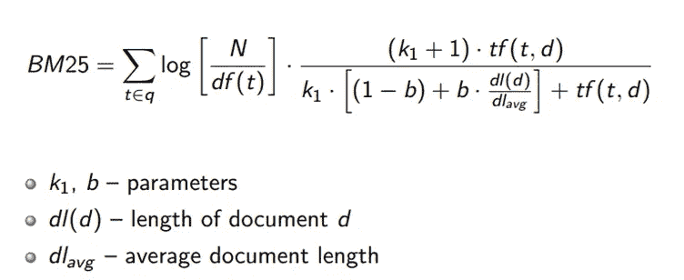
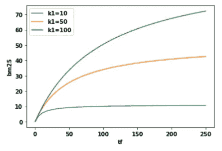
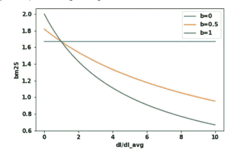
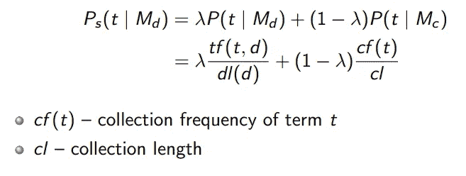

# 理解信息检索中基于术语的检索方法

> 原文：<https://towardsdatascience.com/understanding-term-based-retrieval-methods-in-information-retrieval-2be5eb3dde9f>

## BM25、TF-IDF、查询似然模型等最常见的基于术语的检索方法背后的直觉。

## ***1。什么是信息检索？***

照片由 [Siora 摄影](https://unsplash.com/@siora18)在 [Unsplash](https://unsplash.com/photos/VtNSaArmb-o) 上拍摄

术语信息检索(IR)的含义非常广泛。例如，把你的 ID 从口袋里拿出来，这样你就可以把它输入到文档中，这是一种简单的信息检索形式。虽然信息检索有几种定义，但许多人认为信息检索是关于将人们与信息联系起来的技术。这包括搜索引擎、推荐系统和对话系统等。从学术角度来看，信息检索可能被定义为:

> 信息检索(IR)是从大型集合(通常存储在计算机上)中寻找满足信息需求的非结构化性质(通常是文本)的材料(通常是文档)。
> 
> 曼宁等，“信息检索导论”

## ***2。基于术语的检索方法***

基于术语的检索方法是基于文档和查询之间的精确句法匹配来定义查询-文档匹配的数学框架，以估计文档与给定搜索查询的相关性。其思想是一对文档和搜索查询由它们包含术语来表示。本文解释了最常见的基于术语的检索方法(如 BM25、TF-IDF、查询似然模型)背后的直觉。

得到💬任何数据科学或编程问题的 GPT 式答案。为成千上万的人生成摘要和学习笔记📚只需一次点击即可获得学习资源。👉

 [## 面向数据科学家和开发人员的免费学习资源。精选的博客、教程、书籍和…

### 机器学习和人工智能工程师的培训课程、黑客马拉松、活动和工作

aigents.co](https://aigents.co/learn) 

**2.1。** **TF-IDF**

TF-IDF 基于词袋(BOW)模型处理信息检索问题，这可能是最简单的信息检索模型。TF-IDF 包含两部分:TF(词频)和 IDF(逆文档频)。

***TF —词频***

顾名思义，术语频率是术语 t 在文档 d 中的频率。其思想是，我们根据该术语在文档中的出现次数为文档中的每个术语分配一个权重。因此，文档的得分等于术语频率，这旨在反映单词对文档的重要性。

术语频率。来源:曼宁等《信息检索导论》

在文献中，我们找到了两个常用的术语频率公式，一个是计算术语 t 在文档 d 中出现频率的*原始*术语频率，另一个是由下面的公式给出的*对数*术语频率。对数对较大的术语频率值有抑制作用。如果我们看看上表中的术语“安东尼”，它在*安东尼和埃及艳后*中的出现频率是在*朱利叶斯凯撒中的两倍。使用原始术语频率，这意味着安东尼和克利奥帕特拉的相关性是朱利叶斯·凯撒的两倍。*

术语频率。来源:曼宁等《信息检索导论》

***IDF —逆文档频率***

术语频率遇到了一个关键问题:在评估查询的文档相关性时，所有术语都被认为是同等重要的，尽管情况并不总是如此。事实上，某些术语在确定相关性时很少或没有辨别能力(例如,“the”可能在一个文档中出现很多次，但对相关性没有任何贡献)。为此，我们引入了一种机制来减少在集合中频繁出现的对确定相关性没有意义的术语的影响。为了只识别重要的术语，我们可以报告该术语的文档频率(DF ),即该术语出现的文档数量。它说明了集合中术语的独特性。DF 越小，给定项越唯一。

文档频率。来源:曼宁等《信息检索导论》

因此，我们做得更好。但是 DF 有什么问题呢？不幸的是，DF 本身什么也没告诉我们。例如，如果术语“计算机”的 DF 是 100，这是一个罕见的还是常见的术语？我们根本不知道。这就是为什么 DF 需要放在一个语境中，这个语境就是语料库/集合的大小。如果语料库包含 100 个文档，则该术语非常常见，如果包含 1M 个文档，则该术语非常罕见。所以，让我们加上语料库的大小，称为 N，并除以术语的文档频率。

逆文档频率。来源:曼宁等《信息检索导论》

听起来不错吧？但是假设语料库的大小是 1000，包含该术语的文档的数量是 1，那么 N/DF 将是 1000。如果包含该术语的文档数量是 2，那么 N/DF 将是 500。很明显，DF 的一个小变化就能对 N/DF 和 IDF 评分产生非常大的影响。重要的是要记住，我们主要关心 DF 与语料库大小相比何时处于低范围。这是因为如果 DF 非常大，这个术语在所有文档中都很常见，可能与某个特定主题不太相关。在这种情况下，我们希望平滑 N/DF 的变化，一种简单的方法是取 N/DF 的对数。另外，应用日志有助于平衡 TF 和 N/DF 对最终分数的影响。因此，如果该术语出现在集合的所有文档中，DF 将等于 N。Log(N/DF)= log1 = 0，这意味着该术语在确定相关性方面没有任何能力。

我们可以将 TF-IDF 分数定义如下:

TF-IDF。来源:曼宁等《信息检索导论》

**2.2 BM25**

BM25 是一个概率检索框架，它扩展了 TF-IDF 的思想，改进了 TF-IDF 在术语饱和和文档长度方面的一些缺点。完整的 BM25 公式看起来有点吓人，但是你可能已经注意到 IDF 是 BM25 公式的一部分。让我们把剩下的部分分解成更小的组件，看看为什么有意义。

BM25 配方。来源:曼宁等《信息检索导论》

***期限饱和与收益递减***

如果一个文档包含 100 次“计算机”这个词，那么它真的是包含 50 次的文档的两倍吗？我们可以说，如果术语“计算机”出现的次数足够多，文档几乎肯定是相关的，任何更多的出现都不会增加相关性的可能性。因此，当一个项可能饱和时，我们希望控制 TF 的贡献。BM25 通过引入控制该饱和曲线形状的参数 k1 来解决这个问题。这使我们可以试验不同的 k1 值，看看哪个值效果最好。

不使用 TF，我们将使用以下公式:(k1+1)* TF / (TF + k1)

那么，这对我们有什么好处呢？它说如果 k1 = 0，那么(k1+1)*TF/TF+ k1 = 1。在这种情况下，BM25 现在变成了 IDF。如果 k 趋于无穷大，BM25 将与 TF-IDF 相同。参数 k1 可以调整为 i ***如果 TF 增加，在某个点，BM25 分数将饱和*** 如下图所示，这意味着 TF 的增加不再对分数有很大贡献。

使用参数 k1 的 TF 和 BM25 饱和曲线。来源:作者图片

***文档长度规范化***

TF-IDF 中跳过的另一个问题是文档长度。如果一个文档碰巧很短，并且只包含了一次“计算机”,这可能已经是一个很好的相关性指标了。但是如果文档真的很长，并且术语“计算机”只出现一次，则很可能该文档不是关于计算机的。我们希望奖励短文档的术语匹配，惩罚长文档。然而，你不希望过度惩罚，因为有时一个文档很长，因为它包含许多相关信息，而不仅仅是有许多单词。那么，如何才能做到这一点呢？我们将引入另一个参数 b，它用于构造 BM25 公式中的规格化器:(1-b) +b*dl/dlavg。参数 b 的值必须在 0 和 1 之间才能起作用。现在 BM25 分数将如下:

带参数 b 和 k1 的 BM25 公式。来源:曼宁等《信息检索导论》

首先，让我们理解文档的长短意味着什么。同样，文档的长短取决于语料库的上下文。决定的一个方法是使用语料库的平均长度作为参考点。长文档就是比语料库的平均长度长*的文档，而短文档则比语料库的平均长度短。这个规格化器为我们做了什么？从公式中可以看出，当 b 为 1 时，规格化器会变成(1–1+1 * dl/dl avg)。另一方面，如果 b 为 0，则整个值变为 1，并且完全不考虑文档长度的影响。*

当一个文档的长度(dl)大于平均文档长度时，该文档将受到惩罚并得到较低的分数。参数 b 控制这些文档受到的惩罚有多强:b 的值越高，对大文档的惩罚就越高，因为与平均语料库长度相比，文档长度的影响被放大得更多。另一方面，小于平均值的文档会得到奖励，并给出较高的分数。

使用参数 b 的文档长度和 BM25 分数。来源:作者图像

综上， *TF-IDF 奖励词频，惩罚文档频。BM25 超越了这一点，考虑了文档长度和术语频率饱和。*

**2.3。语言模型**

语言建模背后的一个中心思想是，当用户试图产生一个好的搜索查询时，他或她会提出可能出现在相关文档中的术语。换句话说，相关文档是可能包含查询术语的文档。语言建模与其他概率模型的不同之处在于，它为生成概率的每个文档创建一个*语言模型*，对应于在该文档中找到查询的*可能性*。这个概率由 P(q|M_d)给出。

*语言模型*的定义是一个函数，它为给定词汇表的一个单词或一组单词(例如，一个句子的一部分)产生概率。让我们看一个为单个单词产生概率的模型的例子:

语言模型的例子。来源:作者图片

*句子“猫喜欢鱼”的概率是 0.3x0.2x0.2 = 0.012，而句子“狗喜欢猫”的概率是 0.1x0.2x0.3 = 0.006* 。这意味着“猫喜欢鱼”一词比“狗喜欢猫”更容易出现在文档中。如果我们想要用相同的搜索查询比较不同的文档，我们分别产生每个文档的概率。请记住，每个文档都有其自己的概率不同的语言模型。

解释这些概率的另一种方式是询问这个模型*生成*句子“猫喜欢鱼”或“狗喜欢猫”的可能性有多大。从技术上讲，你还应该包括概率，即一个句子在每个单词后继续或停止的可能性。这些句子不一定要存在于文档中，也不一定要有意义。例如，在这个语言模型中，句子“猫喜欢鱼”和“猫喜欢鱼”具有相同的概率，换句话说，它们被生成的可能性是相等的。

上例中的语言模型被称为 *unigram 语言模型，*它是一个独立估计每个术语并忽略上下文的模型。一个*包含上下文的语言模型是*二元语言模型*。该模型包括给定其前面有另一术语的术语的条件概率。“猫喜欢鱼”的概率将由 *P(猫)x P(喜欢|猫)x P(喜欢|鱼)*给出。这当然需要所有的条件概率都存在。*

存在更复杂的模型，但它们不太可能被使用。每个文档创建一个新的语言模型，但是一个文档中的训练数据通常不够大，不足以精确训练一个更复杂的模型。这让人想起偏差-方差权衡。复杂的模型具有很高的方差，并且容易在较小的训练数据上过度拟合。

***使用查询似然模型进行匹配***

当根据文档与查询的相关程度对文档进行排序时，我们对条件概率 P(d|q)感兴趣。在查询似然模型中，这个概率是所谓的与 P(q|d)等级等价的*,因此我们只需要使用上面讨论的概率。为了解释为什么他们是等级相等的 T21，让我们来看看贝叶斯法则:*

*P(d|q) = P(q|d) P(d) / P(q)*

由于 P(q)对于每个文档都有相同的值，所以根本不会影响排名。另一方面，为了简单起见，P(d)被视为是统一的，因此也不会影响排名(例如，在更复杂的模型中，P(d)可以依赖于文档的长度)。因此，概率 P(d|q)等于 P(q|d)。换句话说，在查询可能性模型中，下面两个是*等级等价的:*

1.  文档 d 与查询 q 相关的可能性
2.  查询 q 由文档 d 的语言生成的概率。

当用户创建一个查询时，他或她已经有了一个相关文档可能是什么样子的想法。查询中使用的术语更可能出现在相关文档中，而不是不相关文档中。估计一元模型的概率 P(q|d)的一种方法是使用最大似然估计:

查询似然模型。来源:曼宁等《信息检索导论》

其中 tf_t，d 是术语 t 在文档 d 中的术语频率，L_d 是文档 d 的大小。换句话说，计算每个查询词在文档 d 中出现的频率与该文档中所有词的频率之比，然后将所有这些分数彼此相乘。

上面的公式有两个小问题。首先，如果查询中的一个术语没有出现在文档中，整个概率 P(q|d)将为零。换句话说，获得非零概率的唯一方法是查询中的每个术语都出现在文档中。第二个问题是，文档中出现频率较低的术语的概率可能会被高估。

***平滑技法***

上述问题的解决方案是引入*平滑技术，这*将有助于为未出现在文档中的术语创建非零概率，并为频繁出现的术语创建有效权重。存在不同的平滑技术，例如 Jelinek-Mercer 平滑，其使用特定于文档和特定于集合的最大似然估计的线性组合:

耶利内克-默瑟平滑。来源:曼宁等《信息检索导论》

或者狄利克雷平滑:

狄利克雷平滑。来源:曼宁等《信息检索导论》

但这是另一篇博文的主题。

总之，传统的基于术语的检索方法实现简单，BM25 等方法是使用最广泛的 ***信息检索*** 功能之一，因为其一贯的高检索准确率。然而，他们基于词袋(BoW)表示来处理问题，因此他们只关注精确的句法匹配，因此缺乏对语义相关词的考虑。