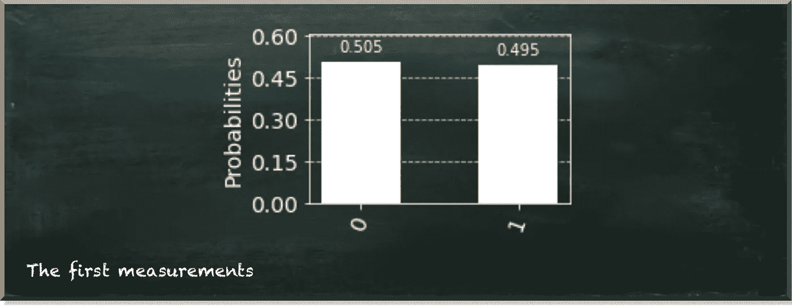
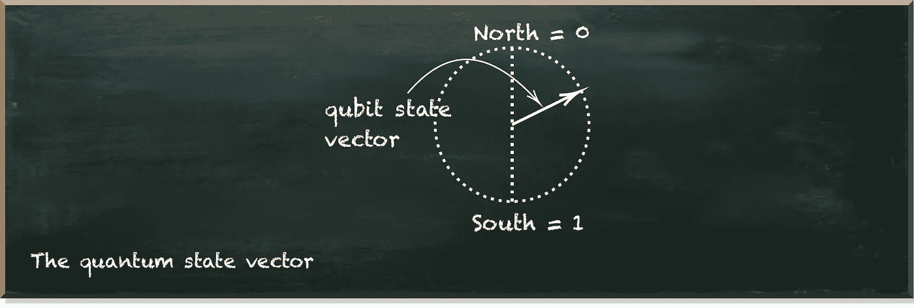
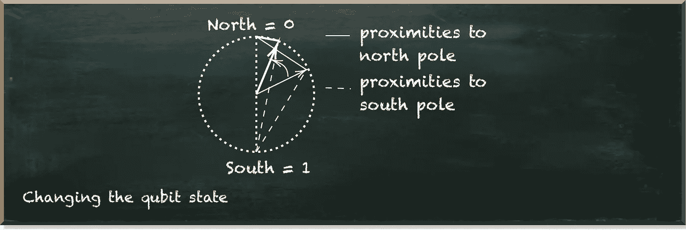
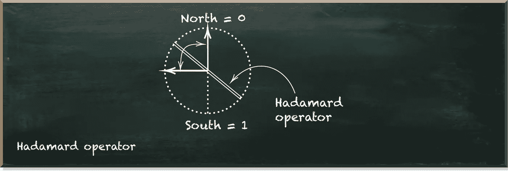
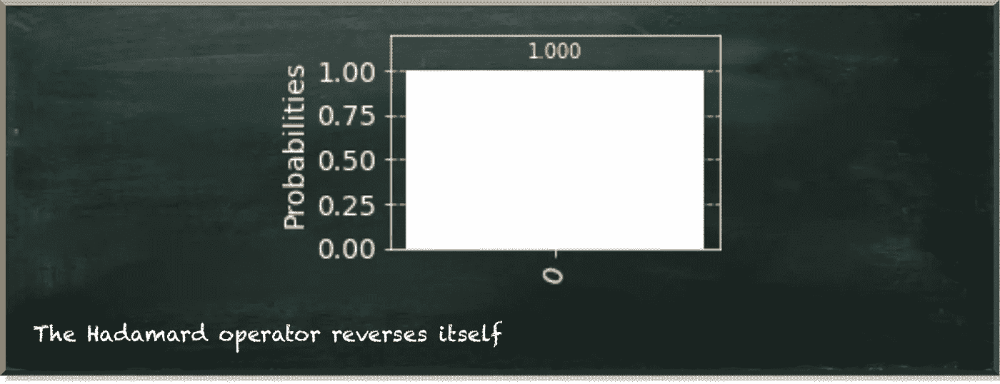
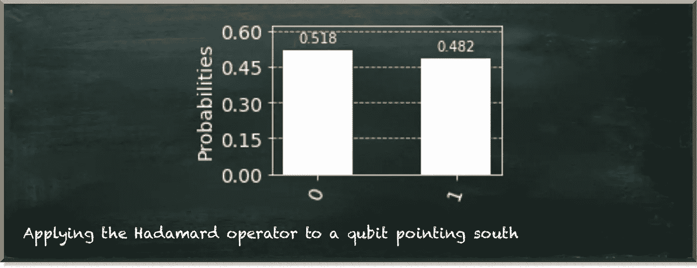
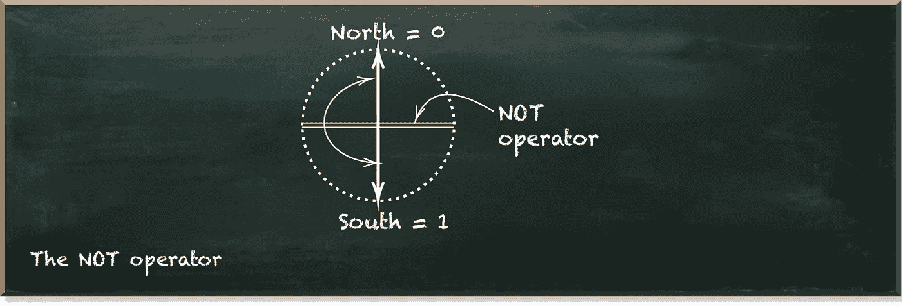
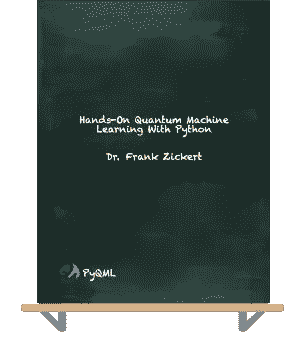

# 不用数学理解量子位状态

> 原文：<https://towardsdatascience.com/understanding-the-qubit-state-without-math-86a140b555d3>

## 和量子算符交朋友

量子机器学习要不要入门？看看 [**动手量子机器学习用 Python**](https://www.pyqml.com/page?ref=medium_statenomath&dest=/) **。**

今天的机器学习模型变得极其复杂。例如，脸书 OPT 的模型是 GPT-3 的开源兄弟，可以产生类似人类的文本，它太大了，以至于你甚至不能在单个 GPU 上运行它。通过跑步，我指的是使用它——我甚至不敢说训练它。如果我们不管理这种对计算能力日益增长的需求，我们可能会在下一个人工智能冬天结束。

但是隧道的尽头有光明。量子计算机有望以比任何经典计算机都快的指数速度解决计算难题。

不幸的是，量子计算似乎不是一个初学者友好的领域。但是外表是有欺骗性的。仔细观察，你会意识到量子计算可能非常简单和直观。

量子位(qubits)天生就是概率性的。你把它衡量为`0`或者`1`。你测量两者中的哪一个，取决于不可见量子位的状态和几率。

回想一下我们在[上一篇文章](https://pyqml.medium.com/getting-started-with-quantum-computing-is-surprisingly-easy-4ecd6d25de6)中开发的代码示例。

```
from qiskit import QuantumCircuit, execute, Aer
from qiskit.visualization import plot_histogram# Create a quantum circuit with one qubit
qc = QuantumCircuit(1)# YOUR CODE GOES HERE
qc.h(0)# measure the qubit
qc.measure_all()# Tell Qiskit how to simulate our circuit
backend = Aer.get_backend('qasm_simulator')# Do the simulation, returning the result
result = execute(qc,backend, shots=1000).result()# get the probability distribution
counts = result.get_counts()# Show the histogram
plot_histogram(counts)
```



作者图片

它将量子位置于一种状态，在这种状态下，两种可能的结果都有同等的可能性。在我们执行电路的 1000 次中，我们观察到量子位为`0` 505 次和`1` 495 次。平均分布的轻微偏离是由于实验的经验性质-上面提到的机会。

在设计算法时，这个机会是一个有用的工具。例如，当有许多同样好的选项可供选择时，让算法抛硬币要比描述一个合适的确定性规则容易得多。

而且随机化是很多实验的基础。它有助于减轻与重要的已知和未知混杂因素相关的偏倚(如选择偏倚),并有助于统计分析的有效性。

但是要利用这些好处，我们首先需要学习如何控制量子位的概率性质。如果没有这种能力，量子计算机就只能是一个随机数发生器。

那么，让我们来看看如何利用单个量子位的测量概率。就在`# YOUR CODE GOES HERE`之后，我们现在使用的是`qc.h(0)`线。

在 Qiskit 中，我们在电路上应用量子位变换(`qc`)，并引用量子位的位置(`0`)作为参数。函数`h`表示操作符——在本例中是哈达玛操作符。

为了理解哈达玛算符，我们首先需要了解量子态。通常，这是它变得非常数学化的地方，因为量子态是多维复向量空间中的一个向量。

我对数学很矛盾。数学是描述技术概念的好方法。数学是一种简洁而精确的语言。

相比之下，我们的自然语言，比如英语，既冗长又不精确。

解释一小群数学公式需要一整本书的自然语言。

但是我们大多数人理解自然语言的能力远远强于数学。只有最少的人看到一个未知的方程，并立即理解它。

对于所有其他人，包括我，这是一场真正的斗争。这要从符号的隐含意义说起。例如，有什么区别


最常见的是，大写字母表示方程式的答案。但是它们也可以表示一个矩阵或一组值。所以，这取决于你所处的环境。此外，通过在大写字母上加一个小帽子来表示操作符是被接受的惯例。所以，有经验的数学家知道 H^是一个算子。

但是，在量子力学中，所有算符都是矩阵。所以，我们甚至可以说，h 和 H^.没有区别

此外，许多等式忽略了中间的步骤。所以，不可能遵循方程的推导。当然，等式的剩余部分可能足以描述两个术语之间的关键关系，但它不会促进对主题的深入理解。

这就好比我告诉你量子计算是 21 世纪最具突破性的技术，但却没有为它提出理由。当然，你可能认为我是一个值得信赖的人，所以这可能是真的。但是如果有人问你对量子计算有什么看法呢？如果你能回答的只是网上这个值得信赖的家伙说这是下一个大事件，恐怕你没有表达你的观点。

顺便说一下，我想我在开始我的[上一篇文章](https://pyqml.medium.com/getting-started-with-quantum-computing-is-surprisingly-easy-4ecd6d25de6)时，也有同样的说法，没有任何论证。所以，我想通过参考我在[这篇文章](https://pyqml.medium.com/are-you-prepared-when-quantum-computing-becomes-real-7d4c7ffce5d9)中提供的论点来弥补这一点。

长话短说，一个数学方程把大量信息浓缩成很少的符号。但是仅仅因为你能比一本 400 页的书更快地写下来，并不意味着读者理解得也一样快。相比之下，如果读者独自一人，将需要更多的时间。

所以我通常会解释量子态，以及算符(比如 Hadamard 算符)对它的不同影响。

想象一个有北极和南极的圆，如下图所示。这两个极点代表了量子位的可能值。北极代表`0`，南极代表`1`。


作者图片

量子位状态是从中心到圆表面的向量。所以，当然，所有的州都有相同的起源，因为只有一个中心。本质特征是它接触表面的点。



作者图片

这不仅因州而异。但是，这个点与极点的接近程度，对于测量一个量子位元的可能性是决定性的。这个点离北极越近，就越有可能测量出量子位为`0`。


作者图片

因此，当我们旋转量子位元状态时，与一个磁极的接近度会增加，而与另一个磁极的接近度会成比例地减少。



作者图片

那么，现在我们来谈谈哈达玛算符。它只是通过从左上角到右下角的对角线来反映量子位的状态。



作者图片

因此，一个状态向量指向北极的量子位被镜像指向圆的赤道。

当然，从赤道到两极的距离是一样的。测量概率也是如此。


作者图片

由于 Qiskit 在指向北极的状态下初始化量子位，这解释了为什么在我们的例子中，我们看到测量量子位为`0`或`1`的概率相等。

这一形象化解释了 Hadamard 算子的进一步特征。例如，如果您应用它两次，它会恢复自身——无论其原始状态如何。但是，当然，这是因为镜像两次会产生原件。

```
# YOUR CODE GOES HERE
qc.h(0)
qc.h(0)
```



作者图片

此外，如果对指向南极的量子位应用哈达玛算符(`1`)，它也会指向赤道，但方向相反。但是由于对极点的接近不关心方向，所以测量结果没有差别。

```
# YOUR CODE GOES HERE
qc.x(0)
qc.h(0)
```



作者图片

我们在这里秘密地使用了另一个量子算符——它和 Hadamard 算符一样常见。这是在 X 轴上反映量子状态的 NOT 运算符。所以它的函数名是`x`。



作者图片

所以，当然，NOT 运算符也会反转。但是如果量子位态指向赤道，NOT 算符就没有作用了。

量子算符惊人的直观——如果你恰当地看待它们的话。当然，这种用简单英语的解释缺乏数学等式的精确性和简明性。然而，我真的相信这个解释比所有方程捆绑在一起更有助于开始量子计算。

[](https://pyqml.medium.com/membership)  

不要错过下一集，订阅我的[子栈频道](https://pyqml.substack.com/)。

量子机器学习要不要入门？看看 [**动手量子机器学习用 Python**](https://www.pyqml.com/page?ref=medium_statenomath&dest=/) **。**



免费获取前三章[这里](https://www.pyqml.com/page?ref=medium_statenomath&dest=/)。