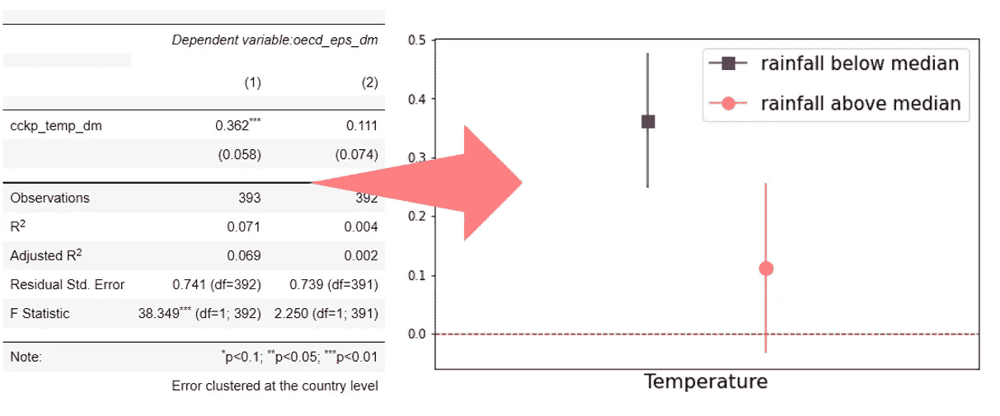

# 对统计学意义(p 值)不满意？这里有一个简单的解决方案

> 原文：<https://towardsdatascience.com/unhappy-with-statistical-significance-p-value-here-is-a-simple-solution-d196c936f8f2>

## 为什么以及如何高效利用林地？

从回归到森林情节，作者的形象

人类喜欢用一种简单的方式把东西放进垃圾箱:统计显著或不统计显著。这种对统计结果的二分法必须停止！近十年来，我听到了同样的辩论。一方面，人们认为统计显著性具有简单明了的优势(许多人已经在努力实现这一点)。另一方面，由于 p 值的局限性，有人主张采用更高级的模型(如贝叶斯方法)(见下一节)。我介于两者之间。我意识到这是有用的，因为它简单实用，而且我承认我不能对许多学生(包括一些科研人员)提出更多的要求。另一方面，我也被这种观点的问题性所困扰。

然而，今天我使用的解决方案似乎让双方都满意:它很简单，包括 p 值，同时解决了单独使用统计显著性的主要缺点。我希望这一提议能够有助于摆脱对统计意义的过度关注。

这篇文章有两个主要部分。首先，我提出概念:与统计显著性(p 值)相关的主要问题、解决方案(森林图)和一个结论。第二，我包括一个完整的例子和一个真实的研究问题(温度和环境政策执行之间的关系)。

## 有哪些问题具有统计学意义(p 值)？

重要的事情先来。p 值是什么，为什么使用统计显著性(仅)是一个问题？

*“p 值是在假设零假设正确的情况下，获得至少与实际观察到的结果一样极端的测试结果的概率。”* —维基百科

解释 p 值需要一整篇文章。所以，如果你还不熟悉这个关键概念，我让你快速查看一下[这篇关于数据科学的精彩总结](/p-values-explained-by-data-scientist-f40a746cfc8) ( [链接](/p-values-explained-by-data-scientist-f40a746cfc8))。

这里有两个主要问题:

**1。实用相关性:**

统计学上的显著性并没有说明影响的大小。比方说，我看到一个有助于减少脱发的洗发水广告。该广告声称，这些结果已经在实验室中通过一项大型实验得到了证明，并且这些结果具有统计学意义(使用这种洗发水的人脱发较少)。然而，当你阅读基础研究论文时，你会发现，平均而言，使用这种洗发水的人头上会多长五根头发。谁在乎呢。对吗？

这是我作为研究人员的另一个例子。我花了两年时间撰写了一篇论文，以评估 covid 遏制对病毒传播的影响(Bonardi 等人(2022 年)即将发表)。在这里，影响的大小是关键。封锁对经济、对许多人的心理健康等造成了巨大的损失。因此，我们不仅想知道他们是否减少了病毒的传播，还想知道减少了多少，以评估这些措施的成本/效益。

这就是为什么我总是主张简单地使用统计显著性作为解释效应大小的必要条件。然后，根据效果的大小，人们可以断定该效果是否具有实际意义。重点在于数量，而统计显著性提供了结果不是随机的证据。

**2。操作:**

对固定阈值(例如 5%)的关注导致了两个主要问题。在处理数据时，有时在统计检验、样本等的选择上有几个自由度。因此，这可能允许一些人稍微操纵结果以低于阈值。

另一方面，如果您稍微高于阈值，您可能无法发布您的结果。然而，基本上，4.9%的 p 值和 5.1%的 p 值显示了正在测试的假设的类似证据。这导致了研究中的严重问题。下面是我在 LinkedIn 上找到的一个说明性的例子(Florian Weigert):*“60 名研究人员检查了医疗 X 对疾病 y 减少的影响，57 名研究人员没有发现任何影响，无法公布结果。3 名研究人员记录了统计上显著的关系，并发表了论文。结论:一项荟萃研究为药物治疗 X 导致疾病 y 减少的事实提供了压倒性的支持。如果你想更进一步，请阅读*Zwet 和 Cator (2021)的《显著性过滤器，赢家的诅咒和收缩的需要》** 或者美国统计协会关于 p 值的声明。*

## 一个简单的解决方案:森林地块

为了全面理解一个测试结果，你需要做三件事:评估统计显著性(有保留地)，关注数量级(如果它是统计显著的)，以及解释可变性。

为什么森林地块是一个优雅的解决方案？森林图让我们可以看到所有这些信息，并更容易比较系数。本文顶部的图片显示了一个回归表旁边的森林图示例。在本文第二部分的例子中可以找到更多的例子。

1.**统计显著性:**统计显著性仍然是统计检验的一个重要方面。如果结果没有统计学意义，就不值得解读。森林图可以让你看到统计意义。如果 95%置信区间的棒线不包含 0，这意味着我们可以拒绝真实系数为 0 的双侧零假设。然而，这种表示并没有过分简化。在许多期刊中，来自回归或统计检验的系数都附有小星号，以表示它们的统计显著性(例如，如果 p 值小于 5%)。这种简化的问题是，我们不知道结果是远远没有统计学意义还是非常接近。森林情节让我们可以直观地看到 CI 中超出 0 线的部分，从而减少对明显分界线的困扰。

2.**量级**:量级容易读取，以及系数之间的相对量级。但是，有时系数不能简单比较。例如，在回归中，变量可能有非常不同的标度。通过标准偏差对变量进行标准化将得到一个可比较的范围(见下面的例子)。

3.**可变性**:置信区间的大小突出了不确定性。同样，它允许我们快速看到系数的下限和上限，并了解可变性。

## 结论

森林图使统计检验的所有关键要素(统计显著性、幅度和可变性)易于获取，无需成为统计专家。此外，通过提供其他信息，这种更丰富的表示自然会降低统计意义的权重。如果你能够正确地运行统计测试，你应该有能力绘制森林图并解释结果(例如，贝叶斯方法就不是这种情况)。

然而，重要的是要注意这些图表与表格相比的弱点:精确度的损失。为了获得系数的精确值，表格仍然是必要的(例如保存在附录中)。此外，在回归的情况下，如果你用标准差来标准化系数，即使它有利于相对大小的比较，解释也可能不太直观。

# Python 中的应用:温度和环境政策:

让我在我之前的文章的基础上再接再厉，在那篇文章中，我探讨了温度(热浪)和环境政策之间的关系。

以下是变量列表:

*   cname:国家名称
*   年份:年份
*   OECD _ EPS:index⁴的环境政策紧缩(摘自 Botta 和 Kozluk (2014 年))
*   cckp _ temp:celsius⁵年平均温度(来自气候变化知识门户)
*   cckp _ rain:mm⁵年平均降雨量(来自气候变化知识门户)
*   wdi_fossil:化石燃料能源消耗(total)⁶的%)
*   gdp _ PC _ PPP:parity⁶购买电力的人均 GDP(来自世界发展指标，世界银行)
*   pop: Population⁶(来自世界银行世界发展指标)

## 模型

以下是我将评估的基线模型:

回归方程式

用 *i* 和 *t* 分别代表国家和年份。 *EPS* 为环境政策严格性指数(取值为 0-5 的指数)。*温度*是以摄氏度为单位的年平均温度。我已经减去了每个国家每个变量的平均值。正如在初步分析中观察到的，这一想法是将法国最热的年份与法国最冷的年份进行比较，而不是将法国与加拿大进行比较(利用国内的差异)。 *X* 是一个控制向量，包括人口和人均 GDP(以购买力平价表示)。ɛ是聚集在国家级的误差项(在协方差矩阵中说明相同国家之间误差相关性的标准程序)。

我用来绘制系数的方法是基于左的博文[https://zhiyzuo . github . io/Python-Plot-Regression-Coefficient/](https://zhiyzuo.github.io/Python-Plot-Regression-Coefficient/)。

## 一个回归模型的森林图

**注:**我们可以看到，每增加 1°C，环境政策严格性指数就会增加约 0.27(环境政策严格性指数的平均值:1.58)，CI 介于 0.2 和 0.35 之间。该系数在 5%的水平上具有统计学意义。

## 具有两个回归模型的森林图

这里我将比较两个不同样本的温度系数:降雨量高于中值的年份和降雨量低于中值的年份。在第一篇论文中，我发现温度的影响在干旱年份明显更强。

**注:**我们能够确认前一篇文章中的发现，即当降雨量较低(低于中值)时，这种影响较大，实际上，对于降雨量高于中值的样本，在 5%阈值时，这种影响在统计上并不显著。此外，我们可以看到，在 5%的阈值处，两个系数之间的差异具有统计学意义。这是因为每个系数的置信区间不会超过另一个系数。

## 具有两个回归模型和多个变量的森林图

在这里，我将比较两个不同模型的温度系数:无控制变量和有控制变量(GDP 和化石燃料消耗)。

**注:**我们可以看到，一旦我们控制了国内生产总值和化石燃料消耗，温度系数不再具有统计意义。因此，我们的主要效应似乎受到了一个被忽略的变量偏差的影响。下面的相关表显示，GDP 与温度(-0.45)呈强负相关，与环境政策严格指数(0.65)呈强正相关。因此，温度的基本正系数是由于较富裕的国家位于较冷的地区，这些国家倾向于实施更多的环境政策。

还要注意的是，这里很难比较系数，因为它们处于不同的尺度(GDP 以美元计，化石燃料占消费的份额，温度以摄氏度计)。因此，最好通过每个变量的标准偏差来标准化系数。参见下一节。

## 具有两个回归模型和多个标准化变量的森林图

**注:**既然系数已经标准化，就更容易比较它们的大小，并看到各自的统计意义。然而，正如我们在本文第一部分中看到的，解释该系数更加困难。让我用无控制模型的温度系数来说明这一点。温度增加一个标准偏差(7.3 摄氏度)与政策严格性指数增加 2 个点相关(指数的平均值:1.58)。

## 参考

[1]范·兹韦特，E. W .，&卡托，E. A. (2021 年)。重要性过滤器，胜利者的诅咒和收缩的需要。尼尔兰迪卡统计，75(4)，437–452。

[2]沃瑟斯坦和耶戈(2016 年)。美国儿科学会关于 p 值的声明:背景、过程和目的。《美国统计学家》，第 70 卷第 2 期，第 129-133 页。

[3]波维金娜、玛丽娜、纳塔莉亚·阿尔瓦拉多·帕雄和杰姆·梅尔特·达利。"政府环境指标数据集的质量，版本 Sep21 . "哥德堡大学:政府学院的质量，【https://www.gu.se/en/quality-government (2021)。

[4]博塔、恩里科和托马斯·koźluk."衡量经合组织国家环境政策的严格性:综合指数方法."(2014).

5 世界银行集团。2021.气候变化知识门户。[https://climateknowledgeportal.worldbank.org](https://climateknowledgeportal.worldbank.org)

6 世界银行,《世界发展指标》。(2022).