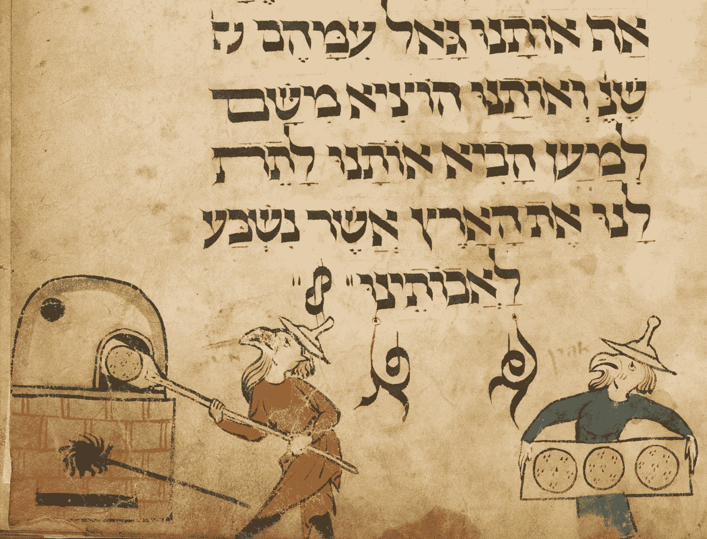
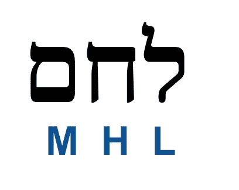
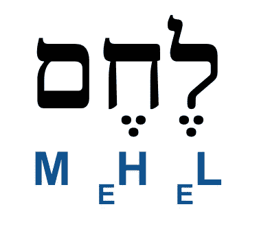
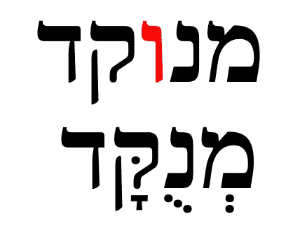
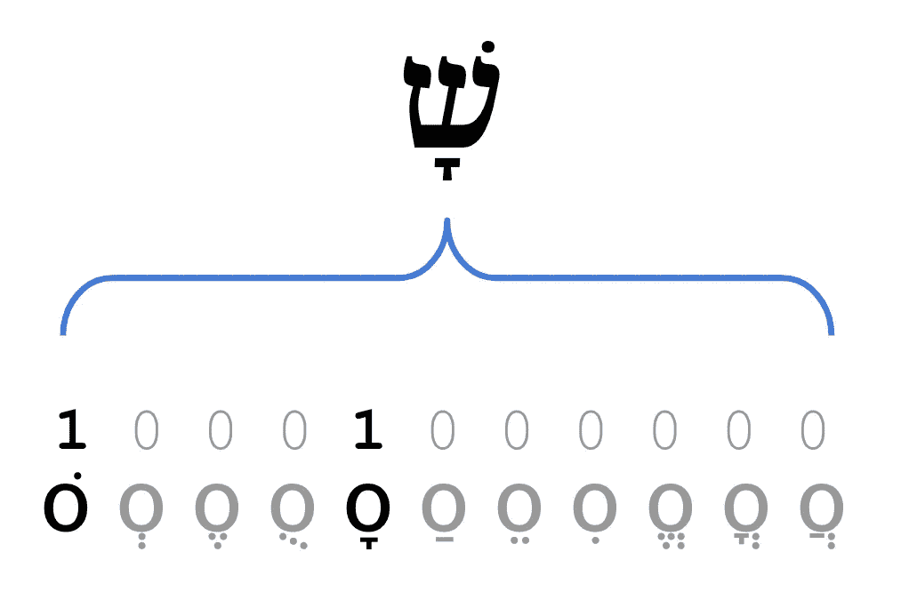
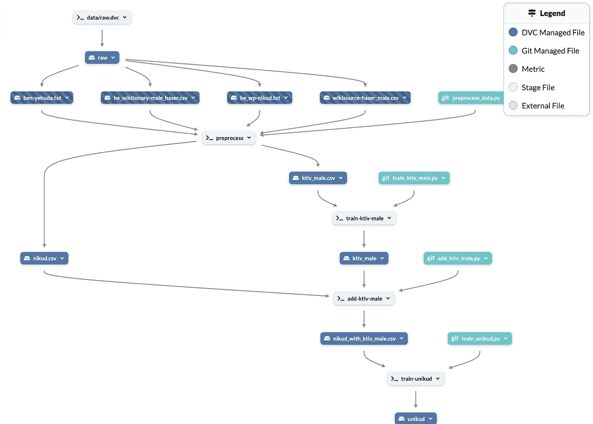
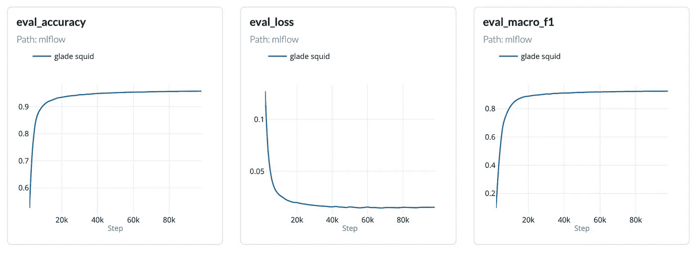

# UNIKUD:通过深度学习向希伯来文本添加元音

> 原文：<https://towardsdatascience.com/unikud-adding-vowels-to-hebrew-text-with-deep-learning-powered-by-dagshub-56d238e22d3f>

介绍一个开源的希伯来语 *nakdan* (נקדן语)工具，它不使用基于规则的逻辑。

希伯来文本“nikud”(元音指向)来自鸟头 Haggadah，写于 14 世纪早期，在现在的德国南部地区。(来源:[维基共享资源](https://commons.wikimedia.org/wiki/File:Scribe-_Menahem_-_The_Birds%27_Head_Haggadah_-_Google_Art_Project.jpg))

由于英语的广泛使用和经济重要性，自然语言处理(NLP)研究主要集中在英语上，但 NLP 的最新进展使其更容易应对世界上数千种其他语言带来的独特挑战。在这个项目中，我们将最先进的深度学习架构应用于希伯来语中的一个特定问题——添加元音标记(*nikud*；ניקוד)转换为文本——表明我们可以使用强大的机器学习模型，利用有限的可用数据来处理较小的语言。

示例 UNIKUD 输出，来自其 [Huggingface Spaces Streamlit 部署](https://huggingface.co/spaces/malper/unikud)(图片来源:作者)

我们展示了我们的模型 UNIKUD，这是一个完全不使用基于规则的逻辑向希伯来文本添加元音标记的开源工具，它是用一个犬类变压器网络构建的。互动演示可在 [Huggingface Spaces](https://huggingface.co/spaces/malper/unikud) 获得，我们所有的数据、预处理和训练脚本以及实验可在其 [UNIKUD DagsHub repo 页面](https://dagshub.com/morrisalp/unikud/experiments/#/experiment/m_3e026e0f4c3e4e35956d949e065a2e32)获得。我们希望 UNIKUD 将成为希伯来语 NLP 和一般资源不足/中等资源语言进一步发展的跳板。

**内容:**

1.  希伯来文字系统
2.  UNIKUD 简介
3.  UNIKUD 数据集
4.  方法
5.  结果
6.  局限性和进一步的方向
7.  结论
8.  参考

# 1.希伯来文字系统

为了理解 UNIKUD 解决的问题，我们首先必须暂时离开主题来讨论希伯来文字系统。

希伯来语是一种闪族语言，起源于古代黎凡特地区。目前，希伯来语是以色列最广泛使用的语言，也是犹太人散居地的礼拜仪式语言，大约有 500 万母语使用者和数百万第二语言学习者(截至 2014 年，根据维基百科。现代希伯来语书写系统使用[希伯来语字母](https://en.wikipedia.org/wiki/Hebrew_alphabet)，也用于书写意第绪语、拉迪诺语和其他各种语言，以及阿拉姆语的经典犹太教文献。

与英语使用的拉丁字母不同，希伯来字母是一个 [**abjad**](https://en.wikipedia.org/wiki/Abjad) ，这意味着字母代表辅音，元音通常是不书写的。为了说明这一点，让我们考虑希伯来语单词לחם“lehem”，意思是“面包”:

(图片来源:作者)

希伯来语是从右向左书写的，所以读者观察字母 L-H-M 的顺序。你可能想知道读者怎么知道这个单词发音是" *lehem* "而不是，比如说，" *laham* "。事实上，这必须根据上下文来推断。如果这听起来很奇怪，请记住，即使在阅读英语时，我们也必须记住许多单词的拼写和发音，所以阅读英语也需要上下文，但阅读希伯来语需要更多的上下文。

希伯来语也可以写元音点，希伯来语称为 *nikud* 。这些文字是在希伯来文字之后很久才发明的，并没有在正常的书写中使用。相反，它们被添加到精确或清晰很重要的文本中，如字典、语言学习材料和诗歌中。例如，当用 *nikud* 书写时，单词לחם *lehem* 被写成:

(图片来源:作者)

或者用数字文本:לֶחֶם.前两个字母下面的三个点表示后面有一个“e”元音。

根据上下文，希伯来语中相同的未发音(无元音点)书面单词可以对应于许多可能的发音单词。例如，书面单词ספר S-P-R 可以读作סֵפֶר *塞弗*(“书”)、סָפַר *萨法尔*(“算”)、סַפָּר *萨法尔*(“理发师”)、或者סְפָר *斯法尔*(“边疆”)。UNIKUD 模型的目标是自动添加指向希伯来文本的正确元音，使用上下文来确定每个单词的发音。

旁注:今天还有其他的 abjads 在使用，最著名的是用于书写阿拉伯语的阿拉伯文字。使用 abjads 的阿拉伯语和其他语言通常也有类似的可选发音符号来标记元音，我们相信 UNIKUD 可以通过微小的调整适应这些书写系统。如果你想了解包括 abjads 在内的世界各地的书写系统的更多信息，可以看看我 2012 年在麻省理工学院的演讲:[世界语言的书写系统](https://github.com/morrisalp/WSOWL)。

# 2.UNIKUD 简介

我们已经看到，希伯来语通常没有元音，但需要上下文来阅读；一个复杂的元音发音系统可以用来帮助读者，但添加这些元音需要对希伯来语和手头的文本有深刻的理解。各种 *nakdanim* (נקדנים) —自动添加*nikud*(ניקוד；元音标记)转换为文本，但直到最近，大多数模型都是专有的和/或使用一组复杂的手写规则编程的，这些规则是希伯来语特有的，并且制作起来极其费力。

我们提出了 UNIKUD 模型，该模型完全不使用手写规则，而是通过在现有希伯来语文本的数据集上进行训练，来学习如何自己给文本添加元音标记。我们选择 UNIKUD 这个名字是因为它是一个三重单词——一个使用 UNIcode 文本标准向文本添加 NIKUD (ניקוד，希伯来文元音标记)的独特模型。

该模型的灵感来自于最近随着变压器神经网络的出现而出现的 NLP 中的范式转变；由谷歌的一个研究团队在 2017 年的论文[中介绍的“注意力就是你所需要的一切](https://arxiv.org/abs/1706.03762)”中，BERT 等转换模型在几乎每个基准任务上都推进了 NLP 的最新水平，从机器翻译到问答等等。这些模型的关键特征是使用自我注意机制从编码为向量的复杂输入中提取上下文含义；关于技术细节，读者可以参考 Peter Bloem 在 2019 年发表的 lucid 帖子[“从零开始的变形金刚”](http://peterbloem.nl/blog/transformers)。

大多数 transformer 模型依赖“子词标记化”作为文本输入的预处理步骤。在 NLP 中，标记化指的是将文本分割成更小的单元——例如，单词标记化会将句子`I love tacos.`分割成单词单元`I`、`love`、`tacos`和`.`(标点符号通常被视为单独的单词标记)。像 BERT 这样的模型使用子词标记化，这意味着更复杂或不常用的词可以分成“子词”单元——例如，`tacos`可能被标记为两个单元`ta`和`##cos`。

然而，单词甚至子单词标记化对于像希伯来语这样的语言来说意义不大，因为在希伯来语中，单个单词可以通过内部变化来添加复杂的含义。例如，希伯来语词根כת״ב K-T-V 指的是书写；通过在这个词根中添加元音，我们可以创造出复杂的单词כָּתַב·卡塔夫“他写了”，יִכְתֹּב·伊赫托夫“他要写了”，מִכְתָּב·米赫塔夫“一封信”，等等。

在他们 2021 年 3 月的论文[中，来自 Google Research 的 Clark 等人介绍了犬齿变压器模型，其名称代表具有符号化**N**o**I**N**N**eural**E**编码器的 **C** 字符 **A** 结构。犬类不是将子词标记作为输入，而是接受原始字符，并学习每个 Unicode 码点的嵌入(向量表示)。该模型适用于具有复杂词法(构词法)的语言，如希伯来语。](https://arxiv.org/abs/2103.06874)

作为一个自动编码的字符级转换器模型，犬特别适合希伯来语发音，因为我们可以将这个问题框架为一个字符令牌分类问题。我们的 UNIKUD 模型使用犬科动物作为其语言主干，用预训练的权重进行初始化。我们在犬的顶部添加了一个分类头，以将其上下文嵌入转换为元音标记预测。

我们会看到，训练 UNIKUD 需要一个复杂的数据管道——首先，收集并归一化带元音的希伯来文文本；第二，训练一个辅助模型以“全拼写”(כתיב מלא)重写这些文本；最后，使用我们处理的数据训练核心 UNIKUD 模型来预测元音标记。我们使用 [DagsHub](https://dagshub.com/dashboard) 管理这个多阶段管道，这个平台托管包含 [Git](https://git-scm.com/) 版本化脚本文件和 [DVC](https://dvc.org/) 版本化数据文件和管道定义的存储库。我们提供了经过训练的 UNIKUD 模型，以及重现其预处理和训练步骤的说明。

# 3.UNIKUD 数据集

深度学习模型需要大量数据，UNIKUD 也不例外。为了训练 UNIKUD 学习如何发声希伯来文本，我们需要收集一个带有元音点的希伯来文本数据集。希伯来语在日常使用中通常没有元音标记，因此需要仔细搜索才能找到足够数量的带元音的数字化希伯来语文本。为了希伯来语 NLP 社区的利益，我们从公共领域的资源中精选了这样的数据，并在我们的存储库中将它们作为 DVC 版本的数据提供。

我们从以下来源收集了带有 *nikud* (元音标记)的文本:

*   [希伯来语维基百科](https://he.wikipedia.org/)(大多数文本没有元音，但我们搜索并提取了有元音的文本)
*   本-耶胡达项目(数字化希伯来经典文学的倡议；我们在这个项目中只使用了公共领域的资源，这些资源通常包含元音标记)

UNIKUD 的基本思想是，我们可以使用带有 *nikud* 的文本进行“自我监督学习”，用现代深度学习研究的术语来说。我们可以使用文本本身来创建我们的模型的输入和期望的输出:例如，通过自动移除元音字符，可以将带有元音的单词סֵפֶר " *sefer* "转换为未发音的ספר；后者将是模型的输入，而前者将是期望的输出。

如何用带元音的希伯来文训练 UNIKUD？去掉元音的文本作为模型的输入，带元音的原始文本作为目标(我们试图预测的)。(图片来源:作者)

然而，现代希伯来文字还有一个特点，在某些情况下使这变得复杂:随着时间的推移，抄写员开始在未发音的文本中添加额外的字母，以暗示元音的存在。被称为 [matres lectionis](https://en.wikipedia.org/wiki/Mater_lectionis) (希伯来语אימות קריאה，字面意思是“阅读之母”)的字母 *yud* (י)和 *vav* (ו)在文本中添加元音时通常必须删除，如下例所示:

“Ktiv male”(全拼):只用红色字母，不带元音。(图片来源:作者)

带有这些额外字母的单词的拼写在希伯来语中被通俗地称为“全拼写”( *ktiv male* כתיב מלא，更正式的说法是כתיב חסר ניקוד)。因为我们需要完整拼写的文本作为 UNIKUD 的输入，所以我们必须训练一个辅助模型来将这些额外的字母添加到带有元音的文本中。因此，我们需要完整和有缺陷(不完整)拼写的成对单词的训练数据。我们从两个来源收集了这些数据:

*   [希伯来语 wikitionary](https://he.wiktionary.org/)(ויקימילון):大多数词条的拼写都有缺陷，文章标题中有元音字母，侧栏列出了相应的完整拼写。
*   [希伯来语维基资源](https://he.wikisource.org/) (ויקימקור):)许多关于古典诗歌和其他资源的文章包含相同文本的平行版本，既有完整拼写(没有元音)也有有缺陷拼写(有元音)。

我们整理了来自这两个来源的数据，并以机器可读的格式排列它们。

作为数据和训练管道中的第一个预处理阶段，我们将来自这些来源的数据结合在一起，并对文本进行了轻微的清理。最重要的预处理步骤是:

*   从 Wikipedia/wiki source/wiki source 数据中删除一些特定于源的样板文件，比如用花括号`{{}}`括起来的模板标签。
*   [Unicode 规范化](https://unicode.org/reports/tr15/) —一些可视字符可以在原始 Unicode 中以多种方式表示。例如希伯来语的 *bet* + *dagesh* 既可以表示为בּ = `U+0531 (bet)` & `U+05BC (dagesh)`，也可以表示为בּ = `U+FB31 (bet with dagesh)`。这两种表示在视觉上看起来是一样的，但是第一种表示由两个 Unicode 码位组成，而第二种表示由单个码位组成的字符。我们使用 NFC Unicode 标准化来统一这种情况。
*   我们将两个代码点`U+05BA`和`U+05B9`组合在一起，它们都可以用于希伯来语中的单个 *holam* 元音点。

因为犬骨干模型接受 Unicode 字符输入，不需要子词标记化，所以我们保留标点和其他复杂字符。

# 4.方法

UNIKUD 的关键见解是，我们可以将希伯来语文本的发音视为多标记标记分类问题，其中标记是单个字符。单个希伯来语辅音字符可以用零个、一个或多个 *nikud* 标记来修饰，这些标记可以用一个二进制向量来表示:

希伯来语发音为 multilabel 分类:每个希伯来语字母可以用多个 *nikud* 修饰，可以用一个二进制向量来表示。UNIKUD 使用这个标签编码作为它的目标。为了清楚起见，该图被压缩，但是 UNIKUD 的二进制目标实际上包含 15 个条目。(图片来源:作者)

UNIKUD 模型包括一个犬齿变压器主干，其分类头有 15 个输出(针对每个输入字符标记)。前 14 个输出大致对应于 Unicode 码位`U+05B0`到`U+05C2`，用于编码各种希伯来语 *nikud* (详见[维基百科的希伯来语 Unicode 表](https://en.wikipedia.org/wiki/Unicode_and_HTML_for_the_Hebrew_alphabet))。第 15 个也是最后一个输出给出了字符应该被删除的概率，如果它是一个用于“完整拼写”的额外的 *yud* 或 *vav* 字母(见上文)。

虽然对于哪些标记可以一起出现有各种限制(例如，点只能出现在字母 *shin* 或 *sin* 上)，但是我们没有将它们硬编码到我们的模型中。我们发现 UNIKUD 能够自己学习这些限制。

我们使用 Pytorch 和 Huggingface 的`transformers`库实现了这个模型。特别地，我们使用犬齿的[拥抱面部端口，该端口用预训练的权重(`canine-c`)初始化，并使用二进制交叉熵损失进行训练。关于优化和训练超参数的更多细节可在](https://huggingface.co/docs/transformers/model_doc/canine) [UNIKUD DagsHub 实验页面](https://dagshub.com/morrisalp/unikud/experiments/#/)查看。

如上所述，为 UNIKUD 准备训练数据需要首先训练一个辅助模型——在我们的代码中为`KtivMaleModel`——将带元音的文本转换为“完整拼写”( *ktiv male* כתיב מלא).)我们使用另一个具有三级分类头的预训练犬齿副本来构建这个模型——对于输入中的每个字符，我们预测 0(无变化)、1(插入י *yud* 或 2(插入ו *vav* )。例如，给定输入מְנֻקָּד，模型将预测除字母ק之外的所有字符为 0，该字母将被训练为预测 2(插入ו *vav* )，从而产生完整拼写מנוקד(省略元音)。一旦这个模型被训练，我们使用它来添加“完全拼写”到我们的数据集中，用于训练主要的 UNIKUD 模型。

我们的完整管道可以方便地视为一个有向图:

通过 UNIKUD 的 [DagsHub repo 页面](https://dagshub.com/morrisalp/unikud)，我们的完整数据和培训管道以有向无环图(DAG)的形式呈现。在对原始数据进行预处理之后，我们训练我们的辅助“ktiv 男性”模型，使用它将完整拼写添加到主模型的训练数据中，然后训练主 UNIKUD 模型。(图片来源:作者)

如果我们的存储库是从 DagsHub 克隆的，那么这个流水线的每一步都可以用 DVC 来重现，例如，`dvc repro preprocess`运行数据预处理，`dvc repro train-ktiv-male`使用这个预处理的数据训练“全拼写”模型，等等。如图所示，管道最后一步的输出是经过训练的 UNIKUD 模型。

一旦该模型被训练，就可以使用简单的解码方法将 *nikud* 添加到文本中。由于我们使用了具有二进制交叉熵损失的二进制目标，我们的模型输出可以被解释为 14 种不同 *nikud* 类型中每一种出现的概率(更精确地说是 logits ),或者字符删除的概率。在解码中，我们用对应于高于固定概率阈值(0.5)的输出的动作来修改输入文本。有关更多细节，请参见我们代码中的`NikudTask`对象中定义的解码方法。

# 5.结果

我们首先提出定量结果，然后对选定的例子进行定性评估。不同超参数设置的训练结果可见于我们存储库的 DagsHub [实验表](https://dagshub.com/morrisalp/unikud/experiments):

[DagsHub 实验表](https://dagshub.com/morrisalp/unikud/experiments/#/)显示不同训练运行的超参数设置和指标(图片来源:作者)

我们将只讨论最终的 UNIKUD 模型训练(DagsHub 实验表标签:`unikud`)，但你可能也会在那里看到 *ktiv 男*模型训练的结果(标签:`unikud`)。部署中使用的最终设置标有标签`deployed`。

我们用交叉熵损失训练了我们的模型，还跟踪了准确性和宏 F1 度量。我们拿出 10%的数据进行验证；在`eval_loss, eval_accuracy, eval_macro_f1`列中可以看到验证指标。准确性被解释为其标签(可能是多个 *nikud* 或删除)被完美预测的验证集中字符的比例。Macro-F1 是不同标签类型的平均 F1 分数,对于不平衡数据的分类问题(如我们的案例，一些 *nikud* 远不如其他的常见),这通常是比准确度更有意义的指标。理想情况下，验证准确度和宏 F1 都应该接近 1，而验证损失应该尽可能接近 0。

我们的最终模型达到了最终验证指标:损失 0.0153，准确度 0.9572，宏 F1 0.9248。其[实验页面](https://dagshub.com/morrisalp/unikud/experiments/#/experiment/m_0633d30cc2f34f2391bede90daa14a66)显示了这些指标在整个培训过程中是如何改进的，MLFlow 记录了这些指标:

培训中的验证指标，来自我们模型的[实验页面](https://dagshub.com/morrisalp/unikud/experiments/#/experiment/m_0633d30cc2f34f2391bede90daa14a66)(图片来源:作者)

对于定性评估，我们在代表不同文本风格的各种输入上呈现我们的模型的输出:

> **כלבניאדםנולדובניחוריןושוויםבערכםובזכויותיהם.כולם חוננו בתבונה ובמצפון, לפיכך חובה עליהם לנהוג איש ברעהו ברוח של אחוה.**
> 
> כָּל בְּנֵי אָדָם נוֹלְדוּ בְנֵי חוֹרִין וְשָׁוִים בְּעָרְכָּם וּבִזְכֻוּיּוֹתֵיהֶם. כֻּלָּם חֻוֹנְנוּ בִּתְבוּנָה וּבְמַצְפּוּן, לְפִיכָךְ חוֹבָה עֲלֵיהֶם לִנְהֹג אִישׁ בְּרֵעֵהוּ בְּרוּחַ שֶׁל אַחֲוָה.
> 
> **האםתניןהואיותרארוךאויותרירוק？**
> 
> הַאִם תַּנִּין הוּא יוֹתֵר אָרךְ אוֹ יוֹתֵר יָרוֹק?
> 
> אבלליישרקשתיים.לנמלהישששרגליים
> 
> לַנְמָלָה יֵשׁ שֵׁשׁ רַגְלַיִם, אֲבָל לִי יֵשׁ רַק שְׁתַּיִם.
> 
> **עכבישיםבאפריקה:מפגשיםעםחיותקטלניותשכמעטנגמרורעמאודנחשיםבאוסטרליה**
> 
> נְחָשִׁים בְּאוֹסְטְרְלִיָה, עַכָּבִישִׁים בְּאַפְרִיקָה: מְפַגְּשִׁים עִם חַיּוֹת קַטְלָנִיּוֹת שֶׁכִּמְעַט נִגְמְרוּ רַע מֵאוֹד
> 
> **אחשליתודהנשמהוואלהאחלהגבראתה**
> 
> אָח שֶׁלִּי תּוֹדָה נְשָׁמָה ואֵלָה אַחלֶה גֶּבֶר אֶתָה
> 
> **שלום חברים**
> 
> שְׁלוֹם חַבְרִים
> 
> **חתול**
> 
> חתּוֹל

各种文本样式的 UNIKUD 输出示例

我们对 UNIKUD 在这些和其他各种输入上的测试的主要观察结果是:

*   我们发现，当输入更长并且包含更多上下文时，UNIKUD 通常表现得更好。当给定非常短的输入(一个或一两个单词)时，它有时不会完成 *nikud* 甚至会出错，而它在长输入句子或文本上的平均表现会更好，如上所述。
*   培训管道中的 *ktiv 男*这一步很重要。我们看到 UNIKUD 确实学会了在上面的כולם-כֻּלָּם和רגליים-רַגְלַיִם这样的单词中去掉 *yud* 和 *vav* 。在之前的实验中，我们在没有这一步骤的情况下训练 UNIKUD，它无法正确地将 *nikud* 添加到这些单词中，因为它在训练期间从未遇到过 *ktiv male* 拼写。
*   对于正式或古典文本，输出平均起来更准确，而 UNIKUD 则难以适应非正式的现代希伯来语。将以上正式文本的相对高质量的输出与俚语术语的错误进行比较，如וואלה.
*   当模型不能以高置信度预测元音时，它有时不输出任何 *nikud* 。这可以通过改变解码的概率阈值来调整，默认情况下是 0.5。

你也可以在它的[hugging face Spaces Streamlit deployment](https://huggingface.co/spaces/malper/unikud)亲自试用这个模型:

带 Streamlit 接口的 UNIKUD，可在 [Huggingface Spaces](https://huggingface.co/spaces/malper/unikud) 获得。滑块控制解码中使用的概率阈值。本文中的结果对所有阈值使用默认值 0.5。(图片来源:作者)

# 6.局限性和进一步的方向

我们简要提及 UNIKUD 模型的一些局限性和未来研究的可能方向:

*   UNIKUD 只使用输入文本的表面形式来猜测要添加的正确的 *nikud* 符号，因此它会努力学习外来语或其他在训练中没有看到的单词，而这些单词的 *nikud* 必须记住。一个有希望的方向是用一个检索组件来增强 UNIKUD，该组件允许对字典文件的学习访问，类似于最近对[检索增强生成](https://arxiv.org/abs/2005.11401)的研究，其中模型被给予对维基百科的动态访问以提取相关知识。
*   UNIKUD 输出每个字符的概率，在解码过程中，我们简单地使用贪婪解码的一种变体分别处理这些概率。 *Nikud* 具有各种共现限制，在解码时可以考虑这些限制，以生成更多的逻辑输出，例如使用具有维特比解码的 CRF ( [条件随机场](https://en.wikipedia.org/wiki/Conditional_random_field))层。我们也不能容易地为不明确的文本(例如“ספר”)生成多个候选输出，这可以通过波束搜索用自回归文本生成模型来完成。
*   作为一个大型深度学习模型，UNIKUD 在 CPU 而不是 GPU 上运行时，执行推理(向文本添加元音)的速度要慢得多。在长文本(数千个字符或更多)上运行还需要将文本分割成段，并且运行时高度依赖于这些段如何构建并馈入模型以进行批量推理。我们没有试图优化 UNIKUD 的这些方面。

# 7.结论

在这个项目中，我们展示了 UNIKUD 模型，它将 *nikud* 添加到希伯来文本中，这是一个开源的 *nakdan* 模型，它通过深度学习构建，没有使用针对希伯来语的手写规则。UNIKUD 是用犬变压器主干建造的，需要复杂的数据管道进行训练。

我们在以下链接中提供了我们的数据文件、模型和结果:

*   DagsHub 存储库(代码、数据和实验):[https://dagshub.com/morrisalp/unikud](https://dagshub.com/morrisalp/unikud)
*   简化部署:[https://huggingface.co/spaces/malper/unikud](https://huggingface.co/spaces/malper/unikud)

我们希望我们的模型对那些从事希伯来语自然语言处理的人有用，并作为资源不足和中等资源的语言的一个测试案例。

*我们要感谢 DagsHub 赞助这个项目，作为其 creators 计划的一部分，并提供简化其开发的平台。*

# 8.参考

莫里斯·阿尔珀。“世界语言的书写系统。" 2012.[https://github.com/morrisalp/WSOWL](https://github.com/morrisalp/WSOWL)

彼得·布鲁姆。《从零开始的变形金刚》2019，[http://peterbloem.nl/blog/transformers](http://peterbloem.nl/blog/transformers)。

Jonathan H. Clark，Dan Garrette，Iulia Turc，John Wieting:“犬:预训练一个高效的无标记化语言表示编码器”，2021 年； [arXiv:2103.06874](https://arxiv.org/abs/2103.06874) 。

Elazar Gershuni，Yuval Pinter:“在没有字典的情况下恢复希伯来语音调符号”，2021 年； [arXiv:2105.05209](http://arxiv.org/abs/2105.05209) 。

Patrick Lewis、Ethan Perez、Aleksandra Piktus、Fabio Petroni、Vladimir Karpukhin、Naman Goyal、Heinrich Küttler、迈克·刘易斯、Wen-tau Yih、Tim rocktschel、Sebastian Riedel、Douwe Kiela:“知识密集型自然语言处理任务的检索-增强生成”，2020 年； [arXiv:2005.11401](http://arxiv.org/abs/2005.11401) 。

阿希什·瓦斯瓦尼、诺姆·沙泽尔、尼基·帕尔马、雅各布·乌兹科雷特、利翁·琼斯、艾丹·n·戈麦斯、卢卡兹·凯泽、伊利亚·波洛苏欣:《注意力就是你需要的一切》，2017； [arXiv:1706.03762](http://arxiv.org/abs/1706.03762) 。

但是看看 Gershuni & Pinter (2021)最近的一个例外，他使用了一种和我们有些不同的方法。

**Morris Alper** 是以色列特拉维夫的一名数据科学家。他是[以色列技术挑战赛](https://www.itc.tech/)的数据科学负责人和讲师，目前是[特拉维夫大学](https://english.tau.ac.il/)计算机科学专业的硕士学生。咨询可以通过电子邮件([morrisalp@gmail.com](mailto:morrisalp@gmail.com))或 LinkedIn 进行:

 [## Morris Alper -以色列科技挑战赛数据科学负责人兼讲师| LinkedIn

### 查看莫里斯阿尔珀在全球最大的职业社区 LinkedIn 上的个人资料。莫里斯有 7 份工作列在他们的…

www.linkedin.com](https://www.linkedin.com/in/morris-alper/)