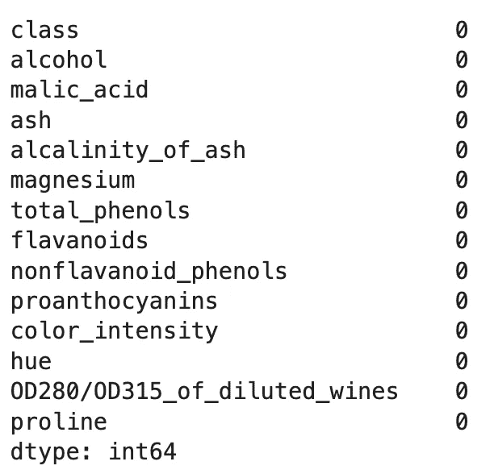
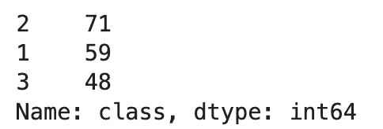
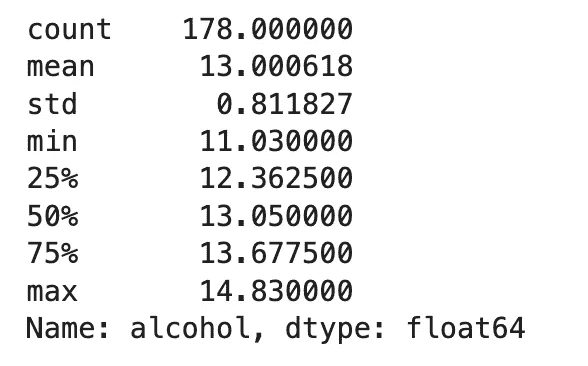
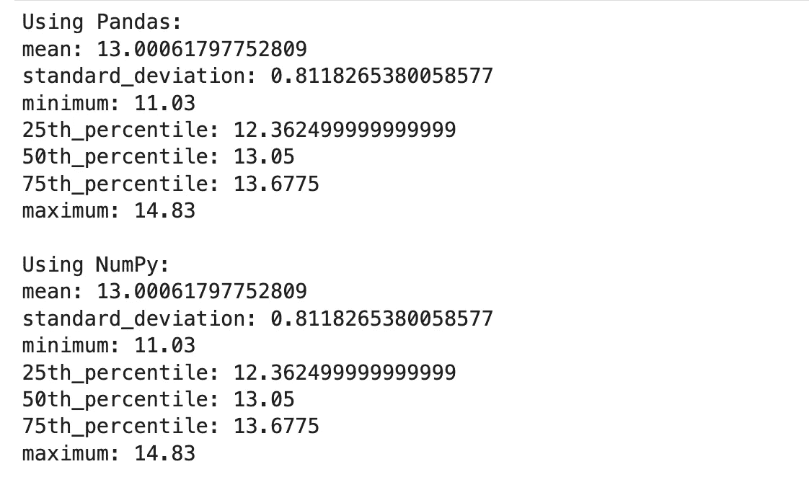
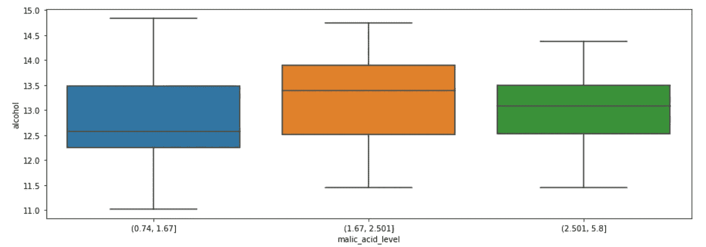
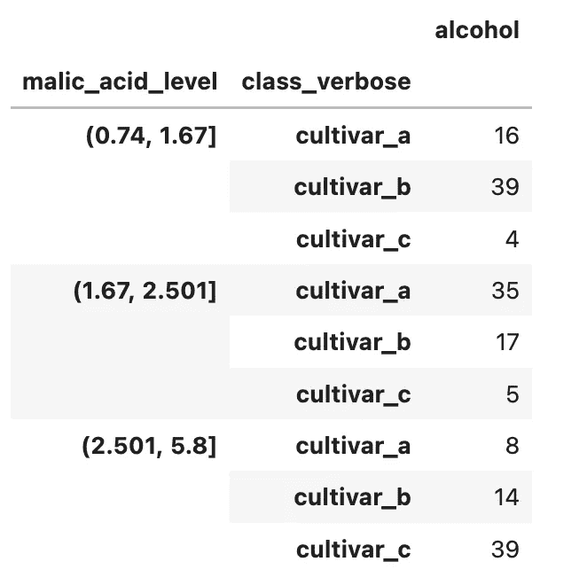
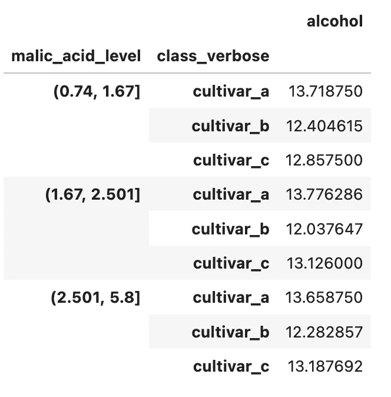

# 单变量分析——简介和实施

> 原文：<https://towardsdatascience.com/univariate-analysis-intro-and-implementation-b9d1e07e5c16>

## 使用 seaborn 的单变量分析:统计数据可视化


宇航员在看数据。E 2

作为一名数据科学家，当您收到一组新的不熟悉的数据时，您的第一步是什么？我们开始熟悉数据。这篇文章通过一次只分析一个变量来回答这个问题，这就是所谓的单变量分析。当我们面对一个不熟悉的数据集时，单变量分析可以作为一种熟悉数据的方法。它描述和总结数据，以找到仅通过查看整体数据不容易观察到的模式。执行单变量分析有多种方法，在本文中，我们将介绍一些最常见的方法，包括频率分析、数字和视觉汇总(例如直方图和箱线图)以及数据透视表。

和我的其他帖子类似，学习会通过练习问答来实现。我将根据需要在问题中包含提示和解释，以使旅程更容易。最后，我用来创建这个练习的笔记本也链接在文章的底部，你可以下载，运行和跟随。

我们开始吧！

*(所有图片，除非特别注明，均为作者所有。)*

[](https://medium.com/@fmnobar/membership) [## 加入我的介绍链接-法扎德 Mahmoodinobar 媒体

### 阅读法扎德(以及媒体上的其他作家)的每一个故事。你的会员费直接支持法扎德和其他…

medium.com](https://medium.com/@fmnobar/membership) 

# 数据集

为了练习单变量分析，我们将使用来自 [UCI 机器学习库](https://archive.ics.uci.edu/ml/datasets/Wine)的关于各种葡萄酒的化学分析的数据集，该数据集基于“用于数据探索、分类和关联的可扩展包”( [Forina，m .等人，1998](https://archive.ics.uci.edu/ml/datasets/Wine) )，并且可以从[此链接](https://gist.github.com/fmnobar/26904b27a6efbea70b1c96169a74c8db) (CC BY 4.0)下载。

让我们从导入我们今天将使用的库开始，然后将数据集读入数据帧，并查看数据帧的前 5 行来熟悉数据。

```
# Import libraries
import pandas as pd
import numpy as np
import seaborn as sns
import matplotlib.pyplot as plt
%matplotlib inline

# Read the data
df = pd.read_csv('wine.csv')

# Return top 5 rows of the dataframe
df.head()
```

结果:


正如我们上面看到的，这些是各种葡萄酒的化学分析。我们将主要使用几列，我将在下面简要说明:

*   “等级”——指葡萄酒所来自的品种。本研究中有三个品种(1、2 和 3)
*   “酒精”——显示葡萄酒的酒精含量
*   “苹果酸”——这种特殊的酸存在于葡萄酒中。与来自温暖气候地区的葡萄酒相比，来自寒冷气候地区的葡萄酒具有更高的苹果酸水平

现在我们已经熟悉了将要使用的列，让我们开始分析。

# 频率分析

频率分析是描述性分析中的基本概念之一，在描述性分析中，研究事件发生的次数。例如，如果我们掷骰子 12 次，得到以下结果:

```
[1, 3, 6, 6, 4, 5, 2, 3, 3, 6, 5, 1]
```

那么 1 出现的频率是 2，因为在投掷中 1 出现了两次。现在让我们看看如何在 Python 中实现这个概念。我们将使用“value_counts”方法来查看变量的每个不同值在数据帧中出现的次数。但由于“value_counts”不包含空值，所以我们先来看看有没有空值。

**问题 1:**

数据帧中有多少空值，在哪些列中？

**回答:**

```
# Return null values
df.isnull().sum()
```

结果:



根据结果，没有一列包含任何空值，因此，我们可以继续使用“value_counts”。让我们继续我们的频率分析。

**问题二:**

数据集包括来自三个不同栽培品种的葡萄酒信息，如“类别”栏所示。数据集中每个类有多少行？

**回答:**

```
# Apply value_counts to the df['class'] column
df['class'].value_counts()
```

结果:



如我们所见，有三个类别(如问题中所述)，栽培品种 2 有 71 个实例，栽培品种 1 有 59 个实例，栽培品种 3 有 48 个实例。

**问题三:**

创建一个名为“class_verbose”的新列，以替换下表中定义的“class”列的值。然后确定每个新类存在多少个实例，这应该与问题 2 的结果相匹配。


**回答:**

```
# Replace according to the mapping table provided above
df['class_verbose'] = df['class'].replace({1 : 'cultivar_a', 2 : 'cultivar_b', 3 : 'cultivar_c'})

# Compare results
df.class_verbose.value_counts()
```

结果:


正如所料，每个类的实例数量与问题 2 的结果相同。

# 数字汇总

在本节中，我们将更多地关注定量变量，并探索总结此类栏目的方法。一个简单的方法是使用“描述”方法。让我们看一个例子。

**问题 4:**

使用“描述”方法创建数据集“酒精”列的数字摘要。

**回答:**

```
# Use describe method
df['alcohol'].describe()
```



描述是不言自明的，正如您所看到的，这是一种非常方便的方法来概述数据的分布，而不是手动生成这些值。让我们在下一个问题中手动生成一些来练习。

**问题 5:**

返回数据集“酒精”列的以下值:平均值、标准偏差、最小值、第 25、50 和 75 个百分位以及最大值。

**回答:**

这些可以使用 Pandas 和/或 NumPy(等等)来计算。我在这里提供了两种方法供参考。

```
# Approach 1 - Using Pandas
print(f"Using Pandas:")
print(f"mean: {df.alcohol.mean()}")
print(f"standard_deviation: {df.alcohol.std()}")
print(f"minimum: {df.alcohol.min()}")
print(f"25th_percentile: {df.alcohol.quantile(0.25)}")
print(f"50th_percentile: {df.alcohol.quantile(0.50)}")
print(f"75th_percentile: {df.alcohol.quantile(0.75)}")
print(f"maximum: {df.alcohol.max()}\n")

# Approach 2 - Using NumPy
print(f"Using NumPy:")
print(f"mean: {np.mean(df.alcohol)}")
print(f"standard_deviation: {np.std(df.alcohol, ddof = 1)}")
print(f"minimum: {np.min(df.alcohol)}")
print(f"25th_percentile: {np.percentile(df.alcohol, 25)}")
print(f"50th_percentile: {np.percentile(df.alcohol, 50)}")
print(f"75th_percentile: {np.percentile(df.alcohol, 75)}")
print(f"maximum: {np.max(df.alcohol)}\n")
```

结果:



**问题 6:**

“苹果酸”小于 1.5 的葡萄酒和“苹果酸”大于或等于 1.5 的葡萄酒相比，其酒精含量的平均值如何？

**回答:**

```
lower_bound = np.mean(df['alcohol'][df.malic_acid < 1.5])
upper_bound = np.mean(df['alcohol'][df.malic_acid >= 1.5])

print(f"lower: {lower_bound}")
print(f"upper: {upper_bound}")
```

结果:


# 图形摘要

在这一节中，我们将看到可视化的定量变量。我们将使用直方图和箱线图，我将在开始提问之前介绍它们。

## 直方图

直方图是一种可视化工具，通过计算每个条柱中实例(或观察值)的数量来表示一个或多个变量的分布。在这篇文章中，我们将使用 seaborn 的“histplot”类来关注单变量直方图。让我们看一个例子。

**问题 7:**

创建数据集中酒精含量的直方图。

**回答:**

```
# Create the histogram
sns.histplot(df.alcohol)
plt.show()
```

结果:


这显示了每个酒精含量箱中有多少实例。例如，看起来包含 13.5 酒精水平的箱具有最高的实例数。

## 箱线图

箱线图展示了定量数据的分布。方框显示了数据的四分位数(即第 25 个百分位数或 Q1、第 50 个百分位数或中值以及第 75 个百分位数或第 3 季度)，而胡须显示了分布的其余部分，除了被确定为异常值的部分，异常值被定义为在 Q1 以下或第 3 季度以上延伸超过四分位数间距(IQR)的 1.5 倍。IQR 是 Q1 和 Q3 之间的距离，如下所示。


我们来看例子。

**问题 8:**

创建一个箱线图，比较三个品种的酒精分布。

**回答:**

```
# Assign a figure size
plt.figure(figsize = (15, 5))

# Create the box plots
sns.boxplot(data = df, x = 'class_verbose', y = 'alcohol')
plt.show()
```

结果:


## 分层

在数据中寻找模式的方法之一是将其分解成更小的子集或层次，并分别分析这些层次。每个起点都可能有新的发现。为了演示这种技术，我们将看一些例子。

**问题 9:**

创建一个名为“苹果酸水平”的新列，该列将“苹果酸”列的值分为三个部分，如下所述:

1.  最小至第 33 百分位
2.  第 33 百分位到第 66 百分位
3.  66%至最大值

然后为每个地层的酒精分布创建一组箱线图。你看到新的模式了吗？

**回答:**

首先，在将“苹果酸”划分为问题中描述的淀粉之前，让我们创建一个酒精水平的箱线图。然后我们将应用分层并直观地比较结果。

```
# Assign a figure size
plt.figure(figsize = (5, 5))

# Create the box plots
sns.boxplot(data = df, y = 'alcohol')
plt.show()
```

结果:


如上所述，Q1、中位数和 Q3 分别约为 12.4、13 和 13.7。让我们看看这些值在“苹果酸”开始时是如何变化的。

```
# Calculate the cut levels
minimum = np.min(df.malic_acid)
p33 = np.percentile(df.malic_acid, 33)
p66 = np.percentile(df.malic_acid, 66)
maximum = np.max(df.malic_acid)

# Create the new column
df['malic_acid_level'] = pd.cut(df.malic_acid, [minimum, p33, p66, maximum])

# Assign a figure size
plt.figure(figsize = (15, 5))

# Create the box plots
sns.boxplot(data = df, x = 'malic_acid_level', y = 'alcohol')
plt.show()
```

结果:



这个挺有意思的。还记得酒精浓度的中位数是 13 左右吗？现在我们看到“苹果酸”水平中间值的一些变化。例如，我们看到在蓝色和橙色箱线图的“苹果酸”的中间值之间存在相对较大的差异，它们对应于两个不同的星形图，分别代表低和中范围的“苹果酸”水平。另一个观察结果是，蓝色箱线图具有更大的范围(从~11 到~14.8)，而绿色箱线图具有更大的“苹果酸”水平，具有更小的范围(从~11.5 到~14.4)。

让我们把这一层再分层，作为练习。

**问题 10:**

创建与上一个问题相似的箱线图，但针对每个品种。

**回答:**

```
# Assign a figure size
plt.figure(figsize = (15, 5))

# Create the box plots
sns.boxplot(data = df, x = 'malic_acid_level', y = 'alcohol', hue = 'class_verbose')
plt.show()
```

结果:


接下来，让我们试着用表格的方式总结一下。

# 数据透视表

数据透视表是分组值的表格表示形式，这些值在特定的离散类别中聚合数据。让我们通过例子来理解实践中的数据透视表。

**问题 11:**

创建一个数据透视表，显示每个品种在每个苹果酸水平下的酒精含量。

**回答:**

```
# Create the pivot table
pd.pivot_table(df[['malic_acid_level', 'class_verbose', 'alcohol']], index = ['malic_acid_level', 'class_verbose'], aggfunc = 'count')
```

结果:



让我们读取其中一行来了解结果。第一行告诉我们在(0.74，1.67)的“苹果酸水平”内有 16 个“品种 _a”的实例。正如您在上面的脚本中看到的，我们在这个数据透视表中使用“count”作为聚合函数，因为这个问题问的是那些离散的类中有多少个实例。还可以使用其他聚合函数。让我们在下一个例子中尝试其中的一个。

**问题 12:**

创建一个数据透视表，展示每个苹果酸水平范围内每个品种的平均酒精水平。

**回答:**

注意，这次我们要实现一个聚合函数来计算平均值。

```
# Create the pivot table
pd.pivot_table(df[['malic_acid_level', 'class_verbose', 'alcohol']], index = ['malic_acid_level', 'class_verbose'], aggfunc = 'mean')
```

结果:



# 带练习题的笔记本

下面是带问题和答案的笔记本，您可以下载并练习。

# 结论

在这篇文章中，我们讨论了如何利用单变量分析作为通过数据了解新空间的第一步。在开始对数据进行任何推断之前，我们希望了解数据是关于什么的，单变量分析为我们提供了了解每个变量的工具，一次一个变量。作为单变量分析的一部分，我们学习了如何实施频率分析，如何将数据总结为各种子集/层次，以及如何利用直方图和箱线图等可视化工具来更好地了解数据的分布。

# 感谢阅读！

如果你觉得这篇文章有帮助，请[关注我的媒体](https://medium.com/@fmnobar)并订阅接收我的最新文章！