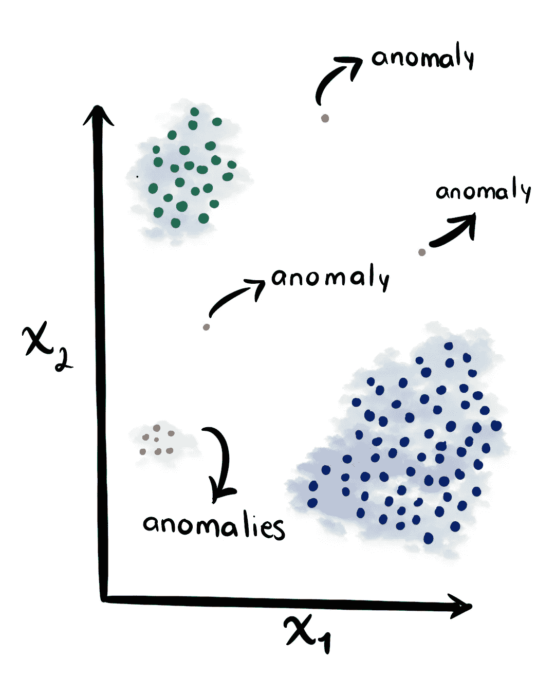
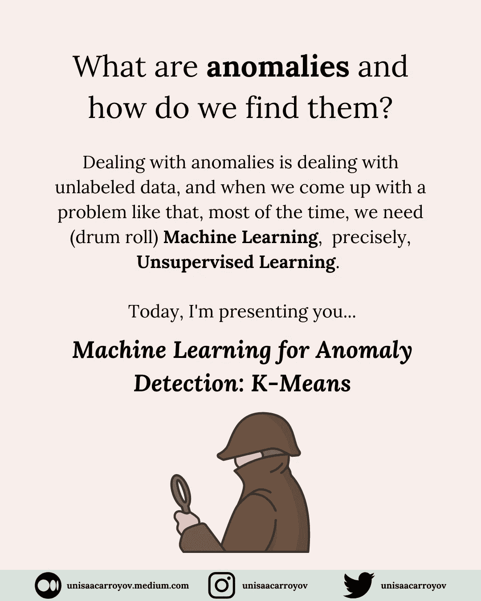
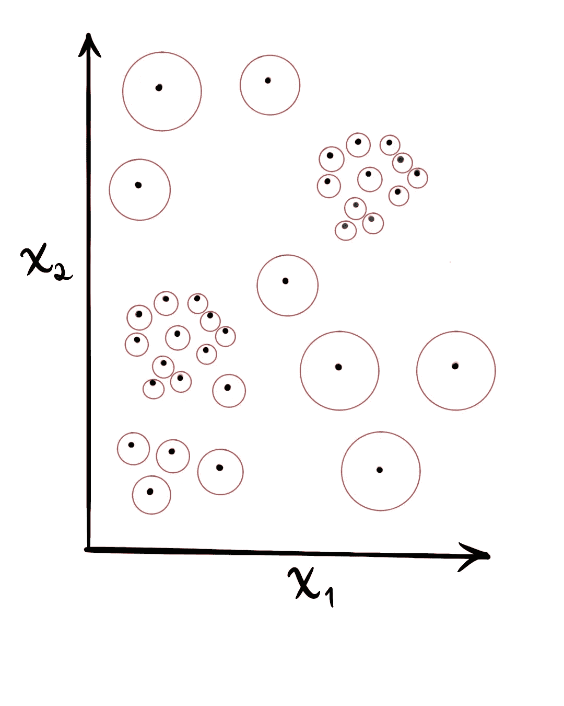

# Spotify 数据的无监督异常检测:K-Means 与局部异常因子

> 原文：<https://towardsdatascience.com/unsupervised-anomaly-detection-on-spotify-data-k-means-vs-local-outlier-factor-f96ae783d7a7>

## 通过发现不寻常的东西来探索我的 Spotify 数据

在 [Unsplash](https://unsplash.com?utm_source=medium&utm_medium=referral) 上由 [Mohammad Metri](https://unsplash.com/@mohammadmetri?utm_source=medium&utm_medium=referral) 拍摄的照片

# 什么是异常？

异常是偏离*标准*或*的数据模式，从其余数据中假设*行为[1]。根据这个定义，异常既不可怕也不伟大；它们只是异常现象。

图 1 示出了二维空间中的一组点。有两个主要的集群和一些异常。

图一。二维数据集及其异常。由作者提出并受到启发[1]

根据工作领域的不同，数据中的异常是由多种原因造成的；它们可能是信用卡检测(金融)、非法狩猎或砍伐森林(自然科学)、社会行为的改变(社会科学)以及其他活动。然而，这些原因有一些共同点:它们都是利益所在。异常的有趣性或现实相关性是异常检测的一个关键特征。[1]

重要的是不要混淆**异常**和*噪音*。*噪声*是数据中的一种现象，分析师对其不感兴趣，但却是一种障碍。

# 新奇与异常检测

# 这项工作的目的。

在这个项目中，我将应用两种方法来检测异常，比较它们并观察结果。当谈到无监督学习时，我喜欢用我对该主题的思考或了解来补充计算机所说的。

# 用于异常检测的机器学习

## k-均值算法

**K-Means 算法**寻求在数据集中找到 *K 个*聚类。这些簇必须尽可能地彼此分开，并使它们的元素尽可能地靠近[3]

图二。数据集中聚类的表示。

您可能想知道如何使用聚类算法来检测异常值。嗯，不久前，我分享了一个关于这个主题的*指南*，这里是。

图 3。使用 K-Means 作为异常检测算法的 Instagram 帖子。

这些步骤是:

1.  将 K-Means 应用于数据集(选择您偏好的 *k* 聚类)。
2.  计算每个分类的点到各自分类的质心之间的欧几里德距离。
3.  用直方图表示这些距离。
4.  找出直方图中的异常值。

这种方法很有趣，因为您可以了解数据中的组，并找到与这些组相距甚远的实例。在这种情况下，每个聚类点到其各自聚类质心的距离将通过**修改的 Z 得分(zmod)** 进行标准化，这是一种发现异常的优秀度量。

# 本地异常因素(LOF)

T2 离群值的定义并不总是一成不变的。这些年来它已经改变了。一开始，人们想到的是**全局异常值**，但后来**局部异常值**被引入。

**局部异常值因子(LOF)** 测量给定点到其邻居的密度的局部偏差。该分数取决于该对象相对于周围邻居的孤立程度[2]。LOF 不会返回二进制响应，因此必须给出一个阈值来识别它是否是异常。

图 4。数据点和局部异常值因子(分数)的表示

如果你想深入这个话题，这里有 Markus M. Breunig 的研究论文，“LOF:识别基于密度的局部异常值”[3]

# Spotify 数据上的应用

我使用的数据是 Spotify 每年推出的包装播放列表中每 100 首歌曲的汇编。

# 选择功能

异常检测算法将应用于不超过三个特征的 **N** 组中。通过这样做，数据点不是非常稀疏(更多的维度=数据点之间更多的空间)。**局部异常因子(LOF)** 和 **K 均值**分别是基于密度和距离的算法。

出现了一些问题，这些问题以成对特征的形式表示:

*   **价**和**艺人 _ 人气:**价描述了一首曲目所传达的音乐积极性。高价的音轨听起来更积极(例如，快乐、愉悦、欣快)，而低价的音轨听起来更消极(例如，悲伤、沮丧、愤怒)[4]。
    ***可能是什么异常现象？:***
    著名艺人的一首歌，比较正面还是比较负面？一首非当红歌手的歌更积极还是更消极？
*   **节奏**和**持续时间 _ 分钟:**节奏是给定乐曲的速度或节奏，直接来源于以 BPM(每分钟节拍数)计量的平均节拍持续时间[4]。人们总是想对所有事物进行分类，音乐也不例外——这是听节奏的一种方式(因为还有其他方式)。例如，雷鬼的典型 BPM 为 60-90，Hip-Hop 为 85-115，Pop 为 100-130。我不试图对我听的歌曲进行分类，而是从异常中识别出具有*预期*持续时间的歌曲；想想大多数流行歌曲平均持续 3.5 分钟(210 秒)。他们中有多少人属于这种假设？那些没有的人呢？关于音乐流派和速度的更多信息，请访问 [*音乐流派及其典型 BPMs*](https://www.gemtracks.com/guides/view.php?title=music-genres-and-their-typical-bpms&id=823#classification-of-genre) 。歌曲时长请访问 [*一首热门歌曲通常 3 到 5 分钟长。原因如下。*](https://www.vox.com/2014/8/18/6003271/why-are-songs-3-minutes-long)
*   **可舞性**和**能量:**有多少适合跳舞的歌曲(高**可舞性**)能量不高(低值**能量**)？这似乎是矛盾的，因为人们大部分时间都把跳舞和能量联系在一起，但是有趣的反常现象还没有在这种矛盾中被发现。

# 异常检测

## 如何识别异常情况？

为了识别异常，必须给每个指标一个阈值:

*   **k-means:**a**𝑧mod**t42】3**离群值**(远离中位数的一个值)
*   **局部异常因子(LOF):** 一分> 1.25

## **哪些歌曲是异常/异常值？**

就 LOF 而言，我们只需要看看比分。然而，对于 K-Means 算法的情况，必须采取不同的观点。

每个实例的 **zmod** 是根据各自的聚类质心，所以异常也是根据分配的聚类。因此，在分析和解释过程中牢记这一点至关重要。

# 案例 1:效价与艺术家受欢迎程度

在第一种情况下，根据这些特征有三种类型的歌曲:

**聚类 0:** 来自**高人气**即**正面**的艺人的歌曲。例如:

*   [阿莱西娅·卡拉](https://youtu.be/g5vUBQBykJ4)野生动物:效价=0.706，艺人 _ 人气= 0.81
*   [加尔文·哈里斯](https://youtu.be/McEoTIqoRKk)的夏天:效价=0.734，艺人 _ 人气= 0.86

**聚类 1:** 来自**高人气**的艺人**不正面**的歌曲。例如

*   [阿莱西娅·卡拉《我想你别给我打电话》](https://youtu.be/Vg3CMeX796I):效价=0.334，艺人 _ 人气=0.81
*   Kygo 的《脆弱》(英尺。Labrinth) :效价=0.218，艺人 _ 人气=0.84

**聚类 2:** 覆盖所有价值的**低人气**艺人的歌曲。例如:

*   威利斯·厄尔·比尔的《太干了，哭不出来》:化合价=0.421，艺人 _ 人气=0.3
*   格里塔·艾萨克的《悲观主义者》:化合价=0.729，艺术家人气=0.39

# `valence`和`artist_popularity`中的异常(修改的 Z 分数)

## **集群 0 中的异常**

聚类 0 具有来自具有高流行度的艺术家的歌曲，这些歌曲是正面的。在这种情况下，异常的是**对于艺术家流行范围来说过于正面的**歌曲。例如:

*   马特·纳森 : **化合价**= 0.95**艺人 _ 人气** =0.61
*   [艾德·希兰塑造的你](https://youtu.be/_dK2tDK9grQ) : **价** =0.931、**艺人 _ 人气** =0.97

一个非常有趣的异常是阿莱西娅·卡拉的歌曲[拆箱介绍](https://youtu.be/j90VVMC0Oho)，但是为什么呢？歌曲有**化合价** =0.974(最大)；然而，整首歌的意义和本质是关于困惑和被不积极的感觉包围。

## **集群 1 中的异常**

聚类 1 有来自**高流行度**、**不积极**的艺术家的歌曲。在这种情况下，异常的是**对艺人流行度范围不完全正面**的歌曲。例如:

*   [OA—主旋律](https://youtu.be/0gseBj5SISU) : **价**= 0.0736**艺人 _ 人气** =0.65
*   [不是今天由畅想龙](https://youtu.be/trig1MiEo1s) : **化合价** =0.0428 和**艺人 _ 人气** =0.92

一些异常引起了我的注意:

*   [你&我 by Bassnectar](https://youtu.be/mqOHvg-GTNY) : **化合价**= 0.151**艺人 _ 人气** =0.60
*   [怎么了布莱克威的危险](https://youtu.be/Y88LVU7MAe4) : **效价**= 0.116**艺人 _ 人气** =0.61

不要被这位歌手的受欢迎程度所迷惑，这两首歌都很受欢迎。第一首是夏季颂歌，从我的角度来看，并不觉得**消极**。据它的创造者说:

这是一首情歌:不一定是关于浪漫，而是关于友谊和家庭牢不可破的纽带。这是一种感觉，当你知道有人无论如何都会支持你，直到时间的尽头。:)"

第二首歌是奥斯卡奖得主“蜘蛛侠：平行宇宙”的配乐的一部分这首歌在电影高潮的一个场景中播放，并定义了主角是谁以及他在整个电影中的旅程。在我看来，这首歌的精髓感觉更像是自信；这是关于面对你最大的恐惧(不管它们是什么)，拥抱你是谁，并采取*信心的飞跃*。

## **集群 2 中的异常**

聚类 2 具有来自具有低流行度的艺术家的歌曲，覆盖所有价值。在这种情况下，异常是关于极值的歌曲，**太正**或**不太正**。

比如(**不太正**):

*   Lxandra : **化合价**= 0.112**艺人 _ 人气** =0.44
*   [juju bee《我是女王》](https://youtu.be/4P5XnyVhBK4) : **化合价**= 0.116**艺人 _ 人气** =0.31

比如(**太正**):

*   [8 Casi Creativo 的 Vasos Al día](https://youtu.be/dqwA5ZC8TmI?t=57):**价**= 0.891**艺人 _ 人气** =0.40
*   迈克尔·克鲁兹 : **效价**= 0.927**艺人 _ 人气** =0.36

# `valence`和`artist_popularity`中的异常(局部异常因素)

使用这种算法，异常是那些没有*很多邻居*的异常(根据给定的阈值)。在某些情况下，用 **K-Means** 检测到的异常几乎相同。

这种情况下，不如重点关注 **K-Means** 没有发现的异常。

有一些非常有趣的异常现象是用第一种方法检测不到的。其中一些是:

*   [柳树](https://youtu.be/7EvwIw4gIyk)和[流放](https://youtu.be/osdoLjUNFnA)都是由[泰勒斯威夫特](https://www.youtube.com/channel/UCqECaJ8Gagnn7YCbPEzWH6g)创作的:第一首歌是**第 0 簇**的一部分，而第二首是**第 1 簇**的一部分。同一艺术家在两个不同的集群(或情绪)中的异常。
*   [哈里·斯泰尔斯](https://youtu.be/WcKSPyhrGWc):这首歌是这个数据集中第二首*最悲伤*的歌；这是由 LOF 和 K-Means 检测到的异常。
*   [身体对话。凯莎):这首歌与同一位艺术家的另一首歌很接近:像我这样的首席女歌手(就化合价而言)，这让我想知道为什么身体语言是一种异常现象，而像我这样的首席女歌手不是。通过查看上面的散点图，我们可以看到它们之间的微小距离(或空间)造成了差异。](https://youtu.be/GcvBnhq0lFA?t=9)
*   [费莉西蒂](https://youtu.be/zI6V1gsz2-Y)和[王国舞蹈《恐高症》中的飞行员——来自《纠结》](https://youtu.be/0X0sLw63KLU):如果我们试图找到这两个点在哪里，我们会注意到它们彼此相距很远，并且都被检测为异常。

# 案例 2:节奏和持续时间

在这种情况下，根据这些特征有三种类型的歌曲:

**集群 0:** 中高速**(中值 147 BPM)、中值持续时间 3.5 分钟的歌曲。**

*   **[艾薇儿·拉维尼 Sk8er Boi](https://youtu.be/TIy3n2b7V9k?t=7):**节奏**= 149 BPM**时长 _ 分钟** = 3.4 分钟**
*   **[我们不在乎 Sigala](https://youtu.be/aR4CEO0N_-I) : **节拍** =180 BPM 和**持续时间 _ 分钟** = 3.45 分钟**

****聚类 1(数量最多的聚类):**中低速**(中值 103 BPM)，中值持续时间 3.43 分钟的歌曲。****

*   ****[杜阿·利帕悬浮](https://youtu.be/WHuBW3qKm9g) : **节拍**= 103 BPM**时长 _ 分钟** = 3.39 分钟****
*   ****[卢卡斯·格拉汉姆妈妈说](https://youtu.be/W_oEIYOERKI) : **节拍**= 83 BPM**时长 _ 分钟** = 3.44 分钟****

******集群 2(数量最少的集群):**具有**宽节奏范围**(130 BPM 的中值)和 6 分钟的中值持续时间的歌曲。****

*   ****[不停(汉密尔顿音乐剧)](https://youtu.be/DPgE7PNzXag) : **节奏**= 91 BPM**时长 _ 分钟** = 6.42 分钟****
*   ****[枪炮玫瑰乐队的《我的甜心小子》](https://youtu.be/1w7OgIMMRc4) : **节拍**= 125 BPM**时长 _ 分钟** = 5.9 分钟****

# ****`tempo`和`duration_minutes`中的异常(修改的 Z 分数)****

## ******集群 0 中的异常******

****聚类 0 具有中高节奏(147 BPM)或中值持续时间为 3.5 分钟的歌曲。异常的**速度高于中值**或**持续时间高于中值**。其中一些是:****

*   ****梵高作品 : **节奏** = 205 BPM，**时长 _ 分钟** = 3.88 分钟****
*   ****[加托 Que Avanza，Perro Que Ladra by Residente/Calle 13](https://youtu.be/1YCY8lr7Ecc):**tempo**= 170 BPM， **duration_minutes** = 5.10 分钟****
*   ****[Labrinth 公式](https://youtu.be/N7EKS2aW_oc) : **节拍**= 144 BPM**时长 _ 分钟** = 1.53 分钟****

****其他星团的边缘有两个异常点:****

*   ****加托 Que Avanza，Perro Que Ladra by Residente:靠近第 2 组。****
*   ****[我可以成为迪欧罗](https://youtu.be/OYJPdMnagII)的某个人:接近集群 1 的另一个异常，[被洛德](https://youtu.be/xguIYNjYU1A)超切。****

## ******集群 1 中的异常******

****集群 1 具有中低节奏的歌曲(中值为 103 BPM)和中值持续时间为 3.43 分钟。异常的**速度低于中值**或**持续时间高于中值**。其中一些是:****

*   ****[天鹅湖，作品 20，第二幕彼得·伊维奇·柴可夫斯基](https://youtu.be/ItMDZDExhKw) : **速度**= 58 BPM**时长 _ 分钟** = 2.78 分钟****
*   ****[Un Beso de Desayuno by Residente/Calle 13](https://youtu.be/LcsTb_ffxz8):**tempo**= 85 BPM 和 **duration_minutes** = 4.84 分钟****
*   ****[阿莱西娅·卡拉的拆箱介绍](https://youtu.be/j90VVMC0Oho) : **速度**= 50 BPM**时长 _ 分钟** = 0.68 分钟****

## ******集群 2 中的异常******

****集群 2 具有具有**宽速度范围**(130 BPM 的中值)和 6 分钟的中值持续时间的歌曲。****

****异常的持续时间**比中位数**长。异常情况有:****

*   ****闪耀——电影版。由 RADWIMPS : **速度** = 124 BPM 和**持续时间 _ 分钟** = 8.96 分钟****
*   ****[林纳德·斯金纳德乐队的自由鸟](https://youtu.be/IGLVMBTIAPE) : **节拍**= 118 BPM**时长 _ 分钟** = 9.11 分钟****

# ****`tempo`和`duration_minutes`中的异常(局部异常因素)****

****应用 LOF 时发生了一个奇怪的现象:来自聚类 2 的所有点都被认为是异常值。****

# ****案例 3:可舞性和能量****

****在这里，根据这些特征有两种类型的歌曲:****

******聚类 0:** 具有**中高能量**(中值为 0.773)的歌曲，不考虑**能量**的值****

*   ****[用 DNCE](https://youtu.be/1tMsx9IlThY) 表示:danceability = 0.7，energy**= 0.748******
*   ******约翰·传奇的《现在爱我》 : **跳舞度**= 0.416**能量** = 0.773******

******聚类 1:** 中低能量**(中值 0.486)的歌曲，不考虑**能量**的值******

*   ****奥利维亚·罗德里戈驾照[:**舞蹈能力**= 0.561**能量** = 0.431](https://youtu.be/ZmDBbnmKpqQ)****
*   ****卡门·萨拉希著 : **舞蹈能力**= 0.397**能量** = 0.356****

# ****`danceability`和`energy`中的异常(修改的 Z 分数和局部异常值因子)****

****通过可视化这一场景，我们可以注意到异常/异常值位于数据集的边界，这意味着异常要么是**不可思议的**，例如:****

*   ****[糖果计划 B](http://localhost:8888/lab/tree/notebooks/Anomaly-Outlier_Detection_Spotify.ipynb) (两个算法中的异常值):**舞蹈性** = 0.9 和**能量** = 0.85****

******与否**:****

*   ****[OA—主旋律](https://youtu.be/0gseBj5SISU):(两种算法中的异常值):**舞蹈性**= 0.136**能量** = 0.164****

****还有，**很有活力的歌曲**:****

*   ****[皮特保罗的坏人](https://youtu.be/QpAGSi8fd88)(LOF 的异数)**舞蹈能力**= 0.636**能量** = 0.971****

******与否**:****

*   ****[《玫瑰人生》——路易斯·阿姆斯特朗的单曲](https://youtu.be/fJkftOrBW1g)(Z 值中的异常值已修改):**舞蹈度**= 0.507**能量** = 0.0779****

# ****结论****

****这个项目产生了两个主要成果:****

## ******异常检测作为探索性数据分析(EDA)的补充******

****尽管 EDA 旨在理解数据集特征之间的结构、行为和关系，但深入那些经常被忽略的细节也是至关重要的。**异常**或**异常值**并不意味着坏的/灾难性的或好的/令人惊奇的事情；它们只是不符合*预期行为*的信息，需要分析。****

## ******用 K-Means 算法和局部异常因子进行异常检测的清晰实用的比较******

****有许多其他方法或算法来检测异常；然而，在一个特定的案例中尝试每一种方法并不是理解和使用它们的最佳方式。****

******局部异常因子**容易实现，顾名思义，发现**局部异常**。第一种情况(**化合价**和**艺人 _ 人气**，有些异常是在数据集内部*，而不仅仅是在边界处(像[王国之舞—出自《纠结》](https://youtu.be/0X0sLw63KLU))。当*预期行为*是寻找具有高密度点的聚类时，该算法是适用的。此外，要找到看起来不如异常*多的异常*(不在数据集边界上的点)。*****

****实现 **K-Means** 比 LOF 要复杂一点，因为需要额外的步骤来帮助描述数据点的特征。然而，当我们需要理解或找到数据集中的*隐藏类别*并找到这些类别中的异常时，K-Means 是一个很好的实现。****

# ****关于我****

> ****我是艾萨克·阿罗约，工程物理学家。我想象自己通过使用数据科学和机器学习工具来解决不同类型的问题。我对数据可视化和无监督学习感兴趣。****
> 
> ****你可以联系我，或者通过社交媒体(Instagram、Twitter 或 LinkedIn)关注我的工作和经历[这里](https://linktr.ee/unisaacarroyov)。我也用英语和西班牙语创建内容。****

# ****贮藏室ˌ仓库****

****如果你想看我做的过程，你可以去这个项目的 GitHub 库****

**** [## GitHub-isaacarroyov/Spotify _ anomalies _ k means-lof:我探索自己的数据科学项目…

### 数据科学项目，我探索我自己的 Spotify 数据，特别是我在大学期间听的歌曲…

github.com](https://github.com/isaacarroyov/spotify_anomalies_kmeans-lof) 

# 参考

*   **【1】**钱德拉，v .，班纳吉，a .&库马尔，V. (2009)。异常检测:综述。美国计算机学会计算调查(CSUR)，41(3)，1–58。
*   **【2】**sci kit——学习开发者。(未注明)。2.7.新奇和异常检测。sci kit-学习。2022 年 1 月 6 日检索，来自[https://sci kit-learn . org/stable/modules/outlier _ detection . html](https://scikit-learn.org/stable/modules/outlier_detection.html)
*   **【3】**breu nig，M. M .，Kriegel，H. P .，Ng，R. T .，& Sander，J. (2000 年 5 月)。LOF:识别基于密度的局部异常值。2000 年 ACM SIGMOD 数据管理国际会议记录(第 93-104 页)。****