# 基于生成模型的无监督分类

> 原文：<https://towardsdatascience.com/unsupervised-classification-with-generative-models-21c18ce20048>

## 一个简单的机器智能测试

作者图片

我的印象是，在人工智能(AI)概念和工具的巨大空间中，生成敌对网络(GANs)像一头未驯服的野兽一样站在一边。每个人都意识到它们是多么强大和酷，很少有人知道如何训练它们，更少有人能真正找到它们在实际任务中的用途。我可能错了，所以请随时纠正我。同时，我想再看一眼这个奇妙的机器，并研究它在分类和嵌入方面的可能用途。为此，我们将坚持以下计划

*   就培训策略而言，更新我们对 GANs 和使用 WGANs 的论据的知识
*   查看 WGAN 的自定义实现
*   在一组具有设计属性的对象上训练 WGAN
*   使用训练好的模型对另一组对象进行分类，看看我们能否解释这种分类

## 甘斯简介

参考文献[1]中介绍了 gan。它们由两部分组成——鉴别器和发生器。

鉴别器是一个函数，它接收一个对象并将其转换成一个数字。

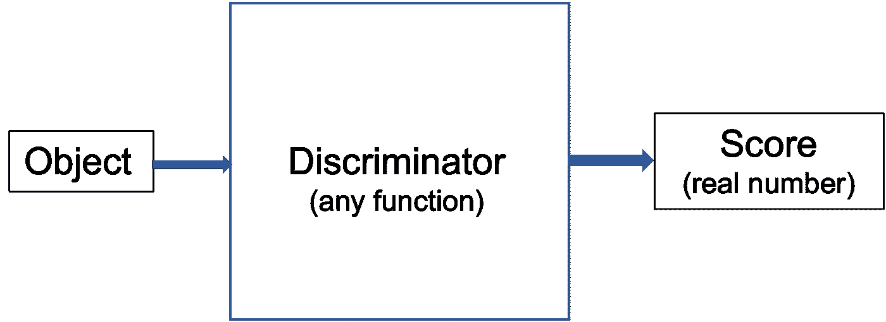

GAN 鉴频器部分的示意图。作者图片

当然，根据对象的复杂程度，将它转换成数字可能是一项艰巨的任务。出于这个原因，我们可能会为鉴别器使用一个非常复杂的函数，例如，深层卷积神经网络(CNN)。

从某种意义上说，生成器执行的是相反的任务。它接受一些随机数据作为输入，并从中生成一个对象。我所说的随机数据，实际上是指一些与我们的对象无关的随机数据。通常，它是从随机分布中抽取的具有一定长度的向量。向量长度和分布是固定的，因为模型的参数是不可训练的，这并不重要。

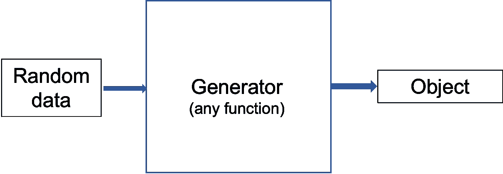

GAN 发生器部分的示意图。图片由作者提供。

与鉴别器的情况一样，发生器函数最好具有一定的复杂性。通常，一个生成器和一个鉴别器有相似的结构，我们很快就会在一个例子中看到。

我故意用“物体”这个词，而不是“图像”，因为我想让我们想得更大。它可以是物理实体、过程或一条信息的任何数字表示。当然，这里的关键是我们对特定类型的对象感兴趣，鉴别器和生成器处理的是同一类型的对象。所以，除了我们的模型，生成器+鉴别器，我们必须有数据。数据给出了我们想要处理的对象的例子。目标是教会模型识别这些对象。

训练是这样的。生成器开始生成对象，目标是生成与我们的数据集相似的东西。起初，这些物体看起来一点也不像。我们将它们提供给鉴别器并收集分数，分数指的是鉴别器的输出。此外，鉴别器对真实对象进行评分。在这里，生成者和鉴别者之间的敌意开始了，这就给这种方法起了“敌对”的名字。鉴别器被训练来最大程度地不同地给真实和生成的对象评分。生成器被训练成生成与真实对象非常相似的对象，以便鉴别器对它们进行相似的评分。现在的诀窍是将这一策略转化为一个或两个目标函数进行优化。

## WGAN 培训方法

这里的叙述通常是这样的。在机器学习中，判别模型根据数据学习概率，而生成模型学习联合概率。直觉上，这听起来是对的。就我个人而言，我无法找到一个非常令人信服的严格的数学证明或全面的说明性讨论来为这一说法提供良好的参考。然而，它在文献中被重复了如此之多的次数，以至于我们现在可以认为它是理所当然的，特别是考虑到我们将在以后探索这个性质。

由于我们手上有一个生成模型，我们将学习全概率，并且在训练期间，我们需要一些度量我们与真实事物有多接近。当谈到比较概率时，会出现交叉熵和 Kullback-Leibler 散度等标准度量。假设我们想要量化两个分布 *p(x)* 和 *q(x)* 之间的差异。这可以借助交叉熵来完成，交叉熵定义为

最后一项是库尔贝克-莱布勒散度

其本身可以用作差异的度量。当概率密度之间至少有一些重叠时，这种方法很有效。

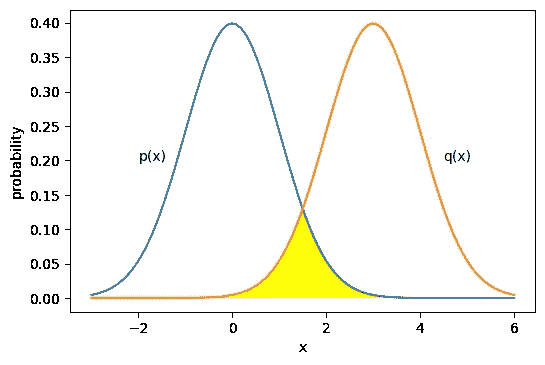

一个例子是两个分布之间的差异可以通过交叉熵度量成功评估的情况。图片由作者提供。

但是，如果分布彼此相差太远，这些措施就会失效。例如，下图中的情况看起来与交叉熵目标函数相同，不会产生有意义的量化。

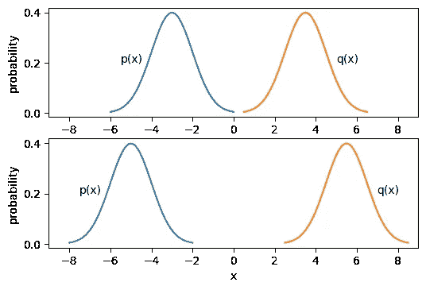

交叉熵没有帮助的例子。图片由作者提供。

然而最重要的是，目标函数的优化是基于梯度技术的，并且在分布相距太远的情况下，梯度将全部消失或不确定。我们的交叉熵目标函数不仅不会告诉我们有多远，它甚至不会指出该往哪个方向走！

出于这个原因，参考文献[2]的作者提出了一个不同的测量方法——wasser stein 距离。用文字表达，它被定义为“将分布 *q(x)* 转化为*p(x)】*所需的最小功”。也就是从字面上来说，如果我们的 *q(x)* 和 *p(x)* 是一堆堆的泥土，那么要把 *q(x)* 运到 *p(x)* 所在的地方，从 *q(x)* 中造出和 *p(x)* 一模一样的一堆，需要多少工作量。听起来很有趣，但是如果我们暂时忘记了用数学方法表达它的所有麻烦，我们会意识到这从概念上解决了我们的问题，因为它考虑了桩的形状和它们之间的距离的差异。

那么，我们如何将过程定义转换成数学表达式呢？不幸的是，答案并不简单。我可以试着在这里画一个草图，但是需要几个大的帖子来详细说明。一个关于这个主题的写得很好的博客可以在[3]中找到。首先，为了将我们对 Wasserstein 距离的单词定义 *W(p，q)* 转换成类似数学的东西，我们可以写

这里所说的是我们在所有运输计划γ中寻找一个最小值( *inf* )

运输所需的工作量。这里 *x* 是 *p(x)* 的支撑，即 *p* 不为零的所有数值，或者说 *p* 污物堆的位置。而 *y* 是 *q(y)* 的支撑，即 *q* 不为零的数值，或者是 *q* 污物堆的位置。而功的定义是一大块质量(密度γ)乘以它需要运输的距离， *||x-y||* 。这仍然不是很有帮助。但是我们现在可以看到，这是一个优化问题。一些人研究了类似的问题，并表明有一个等价的公式(Kantorovich-Rubinstein 对偶)允许重写我们的定义为

也就是说，我们现在正在寻找这个表达式的最大值( *sup* ),该最大值在所有增长受 1 约束(Lipschitz 约束)的函数上。这里跳过了几个步骤。它们可以在[3]和其中的参考文献中找到。我强烈推荐阅读关于 Wasserstein 距离的推导和有用的性质，然而，我们将在这里规定它们并继续前进。

这已经是我们可以利用的东西了。我们可以说 *f(x)* 是我们的鉴别器函数，并以最大化 *W(p，q)* 的最后一个表达式的方式训练模型。我们唯一要做的就是找出如何让函数 *f(x)* 满足李普希茨约束。参考文献[4]的作者建议施加梯度约束，迫使其接近 1。这可以通过给 *W(p，q)* 增加一个惩罚项来实现

其中在 *x ̂* 上评估梯度，沿着 *p* 和 *q* 之间的直线采样的点的子集。好了，是时候看看实际情况了。

## 模型

首先，让我们看看我在下面的代码中对 WGAN 的简单实现。

它是一个扩展 keras 模型的类，将生成器和鉴别器成员也定义为 keras 模型。生成器和鉴别器的实际结构必须在 WGAN 模型类之外构建。相反，该类实现了培训方法。对发生器和鉴别器的训练是分开进行的。该模型为每一个定义了一个步骤，并且通常，对于生成器训练中的一个步骤，在鉴别器训练中有多个步骤。生成器训练步骤简单地最大化生成的假对象的分数，或者更确切地说，最小化分数的负值。鉴别器步骤，与我们的 Wasserstein 距离策略一致，最大化真实和虚假对象得分之间的差异，或者更确切地说，最小化差异的负值，记住梯度惩罚。

下面是我在这篇文章中提供的结果中使用的生成器和鉴别器函数的详细信息:

它们都使用所谓的残差块，该残差块鼓励模型将其注意力集中在拟合上一步不太拟合的东西上，并促进稳健收敛:

我想指出的是，就本文的目的而言，我们不需要完美的模型，我们只需要一个或多或少有效的模型。我们稍后将检查它是如何工作的，但现在我们将看看训练集。

## 培训对象

对于训练对象，我创建了两类图像。图像是 3 通道 64x64 像素。下面是生成它们的代码:

这是两种不同的形状——正方形和圆形——每一种都有不同的颜色，如下图所示:

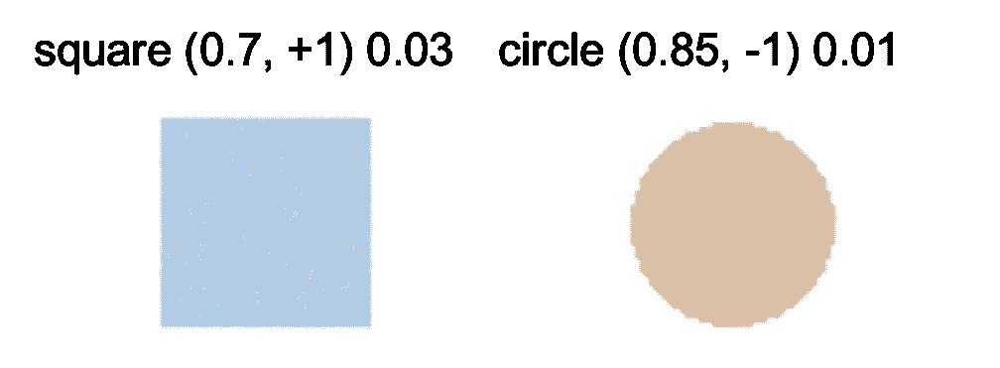

用于训练的两类物体。作者图片

对于第一个通道，归一化颜色定义为 0 到 1 之间的实数，其他两个通道的偏移量分别为 0.1 和 0.2。偏移的符号可以改变，正方形的符号为“+”，圆形的符号为“-”。颜色产生的方式没有特别的意义。我只是想有一个容易改变和记录的参数集。这样，颜色被记录为一对(基色，偏移的符号)，正如它在图片上所标记的那样。偏移量的值不会改变。此外，预定义方差的随机正态噪声被添加到每个通道。噪声的标准差是图像标签中的最后一个数字。

训练集包含每个类的 300 个副本。由于随机噪声，同一类的副本是不相同的。注意，噪声的添加并不作为某种正则化。相反，它意味着代表我们的数据的一个真正的连续特征。因此，我们有三种不同类型的特征:形状是绝对的；颜色是半分类的，因为在数字图像中，它有许多级别，但它们仍然是离散的(3 个通道乘以每个通道中的 256 个级别)；噪声是连续的，正如其方差所定义的那样。

## 培训

我以 8 个为一批，最多 200 个时期来训练模型。这次运行我将用于基准测试结果。下图显示了训练迭代中鉴别器目标函数值。

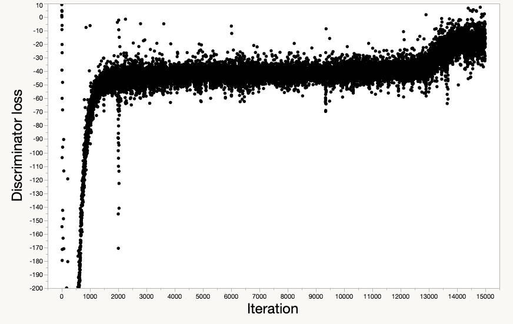

200 个历元训练期间鉴别器损失函数的轨迹图。图片由作者提供。

这就是我们的瓦瑟斯坦距离，它正朝着正确的方向前进。在最后 1000 次迭代中有一个明显的跳跃。我不知道为什么收敛不是更单调，但甘是棘手的，我们的训练集有点太人工。总的来说，我们对这次培训相当满意。

为了进一步检查，我在这里画了梯度罚项。它不完全是零，但从上面来看，它是有界的，并且是向下的。一切又好了。

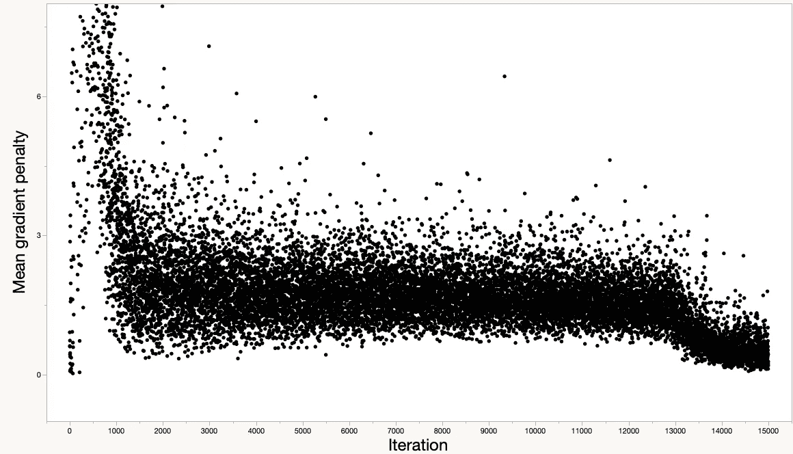

200 个历元训练期间梯度罚项的轨迹图。图片由作者提供。

现在，我们的模型已经训练到一个合理的程度，我们将测试它。

## 生成对象

在 GAN 模型被训练之后，人们通常丢弃它的鉴别器部分，并使用生成器来产生具有期望属性的新数据。我们也将这样做，但主要是作为另一种检查，证明训练是明智的。以下是我们的训练模型生成的图像示例。它们大小一样，都是 64x64，只是变小了。

模型经过 200 个历元训练后生成的对象。作者图片

可以看出这个模型已经掌握了窍门——至少它没有生成猫的图像！它把颜色弄对了。这些形状虽然可以辨认，但有时会混在一起。总的来说，生成的数据质量有改进的潜力，但模型还在路上。让我们看看这对我们的目的是否足够。

## 评分对象

现在我们开始着手我们所追求的——给模型从未见过的物体打分。我的目的一直是想看看训练过的鉴别器分数是否有什么模式。他们能告诉我们模型从底层数据中学到了什么吗？

以下是鉴别器的测试集:

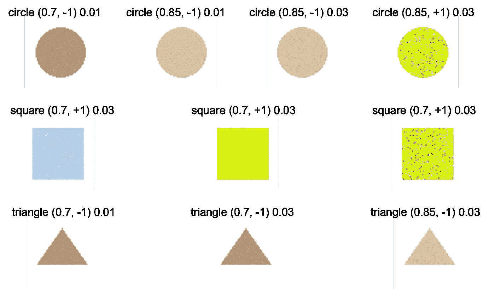

用于鉴别器测试的 10 类物体。图片由作者提供。

我在形状和颜色上添加了更多的变化，但除此之外，这些图像是以相同的模式和相同的大小生成的，64x64。新形状是一个三角形，两种新颜色(0.85，+1)和(0.7，-1)是通过切换偏移符号从旧颜色(0.85，-1)和(0.7，+1)创建的。总的来说，测试集中有 10 类对象，就我们的对象特征(形状、颜色和噪声)而言，其中两类与训练集中的相同。每个类在测试集中有 40 个重复。

我将所有测试图像通过训练有素的鉴别器，并收集分数。下表总结了结果，并为下面的分数直方图提供了图例。用红色突出显示的是用于训练的对象，其余的对象是模型以前没有见过的。

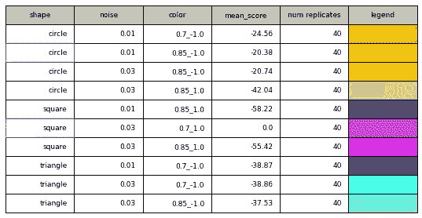

测试集中 10 个类的分数摘要。图例颜色对应于下面的直方图图像。图片由作者提供。

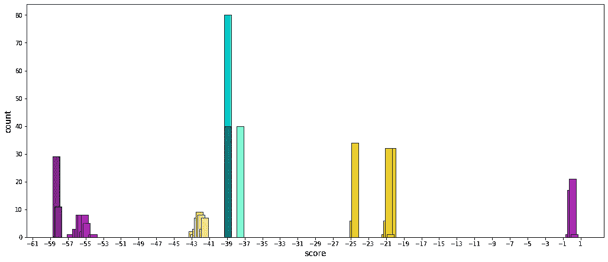

按对象类着色的测试集的鉴别器分数直方图。图片由作者提供。

令人惊讶的是，几乎所有被测试的类之间都有很好的分离。该模型已经认识到它们属于分布的不同空间中的某个地方。

正如我所料，形状和颜色是模型最容易识别的特征。那里没有混乱。新形状(三角形)的分数与其他形状(中间的两个绿色条)的分数非常接近。即使在三角形中，这个模型也能够根据颜色来区分物体。

噪音水平似乎是一个不太明显的特征。相同颜色的两个方块被噪声很好地分开(见直方图上最左边的两组)。然而，颜色相同但噪声水平不同的两个圆类的得分非常接近。尽管如此，如果我们放大分数分布，如下图所示，我们可以看到微小但清晰的分离。如果我们训练模型的时间更长，差距可能会变大。

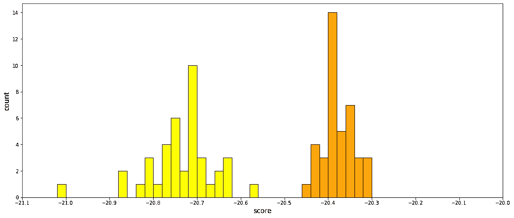

“circle (0.85，-1) 0.03”(亮黄色)和“circle (0.85 -1) 0.01”(暗金色)这两个分数相近的类别的分数放大视图。图片由作者提供。

到目前为止，唯一未解决的案例是两个颜色相同但噪声水平不同的三角形。

因此，如果我们愿意，我们可以使用这样训练的鉴别器作为一个很好的分类器。我想提醒你，培训期间没有提供标签。该模型学会了自己分离两个训练类。此外，它还学会了正确区分它从未见过的类别！

## 使用部分训练的模型评分

在那一点上，我问自己一个问题——分数的分离在训练过程中多早开始？它与生成图像的外观质量有什么关系？为了回答这个问题，我进行了 10、20 和 100 个时期的次优水平的训练。在每种情况下，训练都是从头开始的，而不是继续以前的训练。这导致分数的绝对值处于不同的范围，但这也是我想测试的一个方面。显而易见的预期结论是，分数的绝对值没有任何意义。

下图显示了模型能够在左侧的每个训练级别生成的图像，以及由测试图像类使用与上述相同的配色方案着色的鉴别器得分直方图。

左边是生成的对象，右边是对应于不同训练程度的测试对象的分数直方图。图片由作者提供。

为了让他们有一点可比性，我用“square(0.85，+1)0.03”培训班作为参考，从所有成绩中减去这个班的平均分。即“平方(0.85，+1)0.03”类的分数始终以 0 为中心。此外，如果你还没有注意到，相同形状的分数通过配色方案统一起来，以方便视觉比较。也就是说，直方图上的所有圆圈分数都是黄色的，所有正方形都是略带紫色的，三角形是绿色的。而且，分数颜色的强度与对象组的噪声水平有关。越强烈、越暗的阴影表示噪声级别越低，为 0.01。具有讽刺意味的是，物体的实际颜色并没有颜色编码。

从这张图中可以明显看出，分数聚类在训练过程中很早就开始了。在仅仅 10 个时期之后，训练显然不足以产生任何像样的图像。然而，该模型已经对形状进行了不同的评分。20 个时期后，分数聚类变得更加精细，而数据生成仍然不太顺利。值得指出的是，新的三角形形状始终在其他已经看到的形状之外。

当然，所有这些都是从人类的角度进行的评估。但是，本着我们这个时代的精神，我们应该想知道机器在想什么。让我们在下一节中了解一下。

## 使用 WGAN 分数进行嵌入

使用经过适当训练的 GAN 模型的鉴别器部分作为分类器已经是一种值得尊敬的策略。然而，我们可以变得更有创造性，将这些分数输入到另一个模型中，将它们与额外的元数据相结合，并执行一些复杂的分析。这种情况在机器学习中被称为嵌入。更准确地说，嵌入意味着将一些不同的数据格式集，或者将高维数据简化为计算上更友好的数据类型。一个例子是将代表单词的字符串转换成实数。

我们已经对我们的形状图像进行了这样的处理，并为每个图像生成了一个数字，但是让我们更加批判性地探索这些数字有多适合嵌入。什么构成了一个好的嵌入？我不知道这个问题的普遍公认的答案，所以我将陈述我的观点。数字的关键特征是可比性，随之而来的是距离的概念。也就是说，如果你有两个数字，你可以判断它们是相同还是不同，在后一种情况下，相差多少。我需要在这里向数学家们道歉，他们在那个时候，会开始谈论域和流形以及其中定义的测度，因为他们使用了这样一种普通的语言。当我们把一个看似不可比较的对象转换成数字时，我们自动获得了这种可比性的额外好处。当我们进行进一步分析时，这可能是一把双刃剑。一方面，机器可能会发现一些我们漏掉的模式，另一方面，它可以给没有任何意义的东西赋予意义。单词嵌入的著名例子是一个很好的嵌入例子，你可以用嵌入的单词进行算术运算，得到直观正确的结果，比如*国王-男人+女人=王后*。然而，我怀疑，由于人们只使用这个特定的例子，在自然语言处理(NLP)的相同领域中有许多其他情况，其中反直觉的意义被分配或者任何直觉的意义被丢失。总而言之，在我看来，一个好的嵌入是 a)以某种逻辑方式聚集对象；b)定义对象之间的距离，从而允许解释；c)坚持不懈。

我们的分数是多少？我们对项目 a)有利，因为我们清楚地观察到一些有意义的分组。让我们来看看这个模型给出的几个定量比较。根据分数的不同，机器将“*圆(0.85，+1)0.03* ”和“*方(0.7，+1)0.03* ”物体相对于“*三角形(0.7，-1)0.01* ”排列在这些位置。

不同测试类别的相对分数。图片由作者提供。

如果让我猜的话，我会说这里的决定因素可能是面积，这是形状属性量化的一部分。在另一个例子中，不同颜色和噪声的圆圈被放置在以下距离:

不同测试类别的相对分数。图片由作者提供。

这可以很好地用颜色作为主要考虑因素来解释。还有另一个有趣的观察:分数分布的宽度似乎与图像组噪声水平有关。这可以被解释为颜色和噪声特征之间的相互作用的度量。无论如何，b)项也可能得到满足。但是，如果部分训练模型的结果有任何指示的话，c)项是我们方法中最弱的部分。每次重新训练模型，班级的相对分数都会不一样。

我在这篇文章的最后一部分讨论的大部分是定性的思考，尽管它们与定量的估计有关。我没有对嵌入应用程序进行全面的研究。到目前为止，对于我们的鉴别器是否产生适合嵌入的分数这个问题的答案可能是“不”，无论如何不是以其当前的形式。但是我有一个想法，你必须等待另一个帖子:-)

## 结论

总之，我们学习了 GANs 的基本原理。我们还回顾了使用 Wasserstein 距离作为训练目标函数的论点。所有这些都被用来说明 GANs 是如何在玩具数据集上工作的。但是这篇文章的主要目的是引起人们对 GANs 中未被重视的部分——歧视者的注意。我希望我能够让读者相信它正在做一些了不起的工作。我真的认为是时候让 GANs 在机器学习领域扮演更重要的角色了。

## 参考

[1] I. J. Goodfellow，J. Pouget-Abadie，M. Mirza，B. Xu，D. Warde-Farley，S. Ozair，a .，Y. Bengio (2014)，[生成性对抗网络](https://arxiv.org/abs/1406.2661)，arXiv:1406.2661

[2] M. Arjovsky，S. Chintala 和 L. Bottou， [Wasserstein GAN](https://arxiv.org/abs/1701.07875) (2017)，arXiv:1701.07875

[3] V. Herrmann， [Wasserstein GAN 和 Kantorovich-Rubinstein 二重性](https://vincentherrmann.github.io/blog/wasserstein/)

[4] I. Gulrajani，F. Ahmed，M. Arjovsky，V. Dumoulin，a .库维尔，[wasser stein GNAs 的改进培训](https://arxiv.org/abs/1704.00028) (2017) arXiv:1704.00028