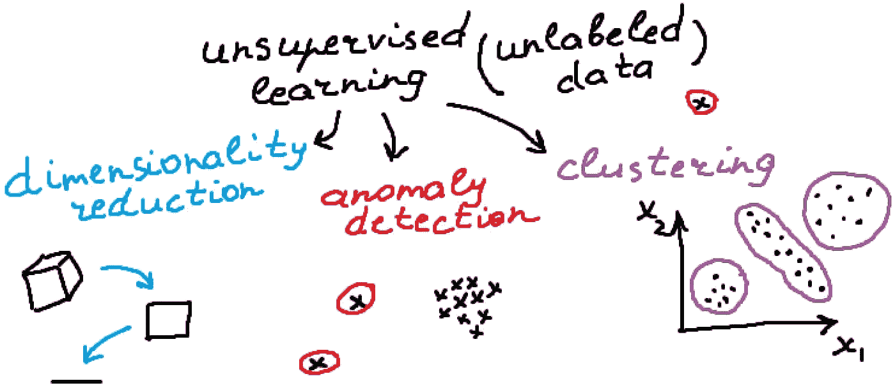
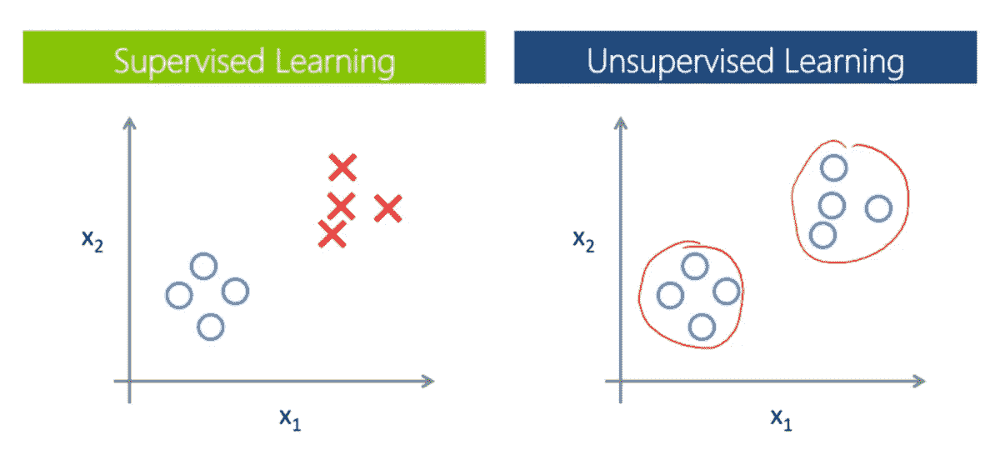

# 无监督学习算法备忘单

> 原文：<https://towardsdatascience.com/unsupervised-learning-algorithms-cheat-sheet-d391a39de44a>

## 你应该知道的所有无监督机器学习算法的完整备忘单

无人监督的学习任务。作者图片

本文提供了不同的无监督学习机器学习概念和算法的备忘单。这不是一个教程，但它可以帮助你更好地理解机器学习的结构，或者刷新你的记忆。

要了解更多关于特定算法的信息，只需谷歌一下或者在 [*sklearn 文档*](https://scikit-learn.org/stable/) 中查找。

接下来，我们将探讨以下任务:

*   *降维；*
*   *异常检测；*
*   *聚类；*
*   以及其他无监督学习算法(*密度估计*和*关联规则学习*

由于这些主题非常广泛，*维度减少、异常检测、*和*聚类*部分是独立的文章。我已经研究它们很长时间了，但我仍然想把它们放在一个地方。

如果我们把这篇文章看作是这三者的串联，它是相当浩繁的，所以我不建议你一次读完。将这篇文章添加到阅读列表中以便稍后回来，通过 GitLab 阅读章节[或下载这篇文章的 pdf 版本并打印出来(可在同一位置获得)。](https://gitlab.com/Winston-90/unsupervised_algorithms)

  

## 介绍

*无监督学习*是一种机器学习技术，开发者不需要监督模型。相反，这种类型的学习允许模型在没有任何监督的情况下独立工作*,以发现隐藏的模式和以前未检测到的信息。它主要处理*未标记数据*，而监督学习，正如我们所记得的，处理标记数据。*

监督与非监督学习。[公共领域](https://commons.wikimedia.org/wiki/File:Machin_learning.png)

三个最流行的无监督学习任务是:

*   **降维** —减少数据集中输入特征数量的任务。
*   **异常检测**——检测与标准非常不同的实例的任务，以及
*   **集群** —将相似的实例分组到集群中的任务。

这三个任务中的每一个以及解决它们的算法将在后面相应的章节中详细讨论。然而，请注意，**其他无监督学习任务**部分列出了其他不太受欢迎的任务，这些任务也可以归因于无监督学习。

# **降维**

下面提到了降维的算法:

*   *主成分分析；*
*   *流形学习* — *LLE* 、 *Isomap* 、*t-SNE；*
*   *自动编码器*和其他。

  

# 异常检测

对于异常检测，提到了以下算法:

*   *隔离林；*
*   *局部离群因子；*
*   *最小协方差行列式*等来自降维或监督学习的算法。

  

# 使聚集

下面提到了用于聚类的算法:

*   *K-表示；*
*   *层次聚类*和*谱聚类；*
*   *DBSCAN* 和*光学；*
*   *亲和繁殖；*
*   *均值偏移*和*桦木；*
*   *高斯混合模型。*

  

# **其他无监督学习任务**

虽然降维、异常检测和聚类是主要的和最流行的无监督学习任务，但还有其他任务。

由于定义是模糊的，任何处理未标记数据集的算法都可以被视为解决一些无监督的学习任务(例如计算平均值或应用*学生的 t 检验*)。然而，研究人员经常在其他任务中识别另外两个任务:*密度估计*和*关联规则学习*。

## **密度估计**

我已经在异常检测部分简要提到了密度估计。

密度估计是估计数据点分布密度的任务。更正式地说，它估计由给定数据集生成的随机过程的*概率密度函数* (PDF)。这项任务在历史上来自统计学，当时需要估计一些随机变量的 PDF，并且可以使用统计方法来解决。

在现代，它主要用于*数据分析*，并作为*异常检测*的辅助工具——位于低密度区域的数据点更有可能是异常或异常值。现在通常用基于*密度的聚类*算法如 **DBSCAN** 或 **Mean Shift** 来解决，用*期望最大化*算法到**高斯混合模型**中。

## **关联规则学习**

关联规则学习(也称为*关联规则*或简称为*关联*)是另一种无监督学习任务。它最常用于商业分析，以实现利润最大化。

它旨在检测数据集中变量之间不明显的关系，因此也可以被认为是一个*数据分析*工具。有许多复杂的算法来解决它，但最流行的是:

*   **先验** —基于广度优先搜索；
*   **Eclat** ( *等价类转换* ) —基于深度优先搜索；和
*   **FP-Growth** —设计用于检测数据中频繁出现的模式。

这种任务的一个常见例子是*产品放置*。例如，知道人们经常在超市一起购买洋葱和土豆，将它们并排放置以增加销量是有意义的。因此，关联规则被用于促销定价、市场营销、连续生产等。

# **结论**

在本文中，我试图描述所有主要的无监督学习任务和算法，并向您展示无监督学习的全貌。

希望这些描述和建议能够帮助到你，激励你去学习更多，更深入地学习机器。

您可能还对以下内容感兴趣:

  

# 感谢您的阅读！

*   我希望这些材料对你有用。[在 Medium](https://medium.com/@andimid) 上关注我，获取更多这样的文章。
*   如果您有任何问题或意见，我将很高兴得到任何反馈。在评论里问我，或者通过 [LinkedIn](https://www.linkedin.com/in/andimid/) 或者 [Twitter](https://twitter.com/dimid_ml) 联系。
*   为了支持我作为一个作家，并获得数以千计的其他媒体文章，使用[我的推荐链接](https://medium.com/@andimid/membership)获得媒体会员资格(不收取额外费用)。

# 参考

[1] Aurélien Géron，[使用 Scikit-Learn、Keras 和 TensorFlow 进行机器学习，第二版](https://www.oreilly.com/library/view/hands-on-machine-learning/9781492032632/) (2019)，奥赖利媒体公司