# k-均值聚类从零开始

> 原文：<https://towardsdatascience.com/unsupervised-learning-and-k-means-clustering-from-scratch-f4e5e9947c39>

## K-means:聚类数据的最佳 ML 算法

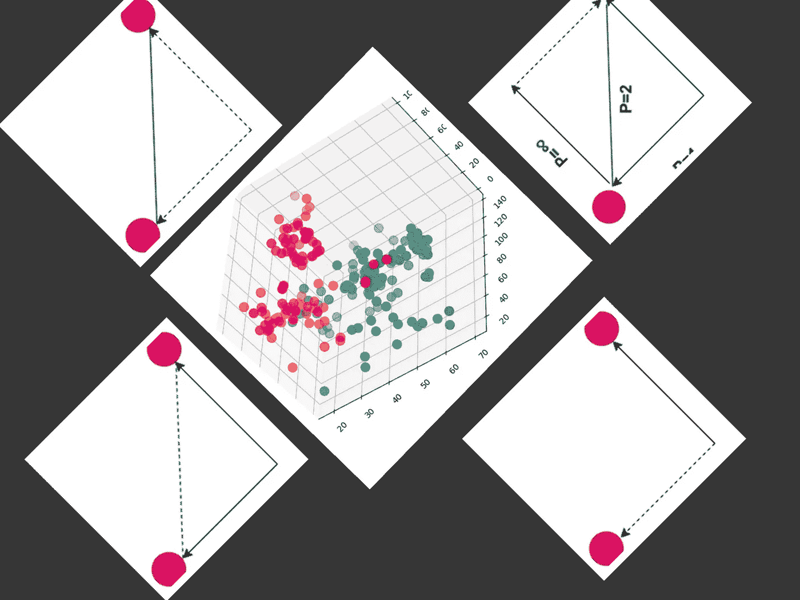

## 动机

机器学习的主要思想是创建一个通用模型，该模型可以根据以前的数据提供理性的决策，而无需显式编程。机器学习问题可以是有监督的，也可以是无监督的。本文重点介绍一种称为**‘K-means’**聚类的无监督机器学习算法。

当无监督机器学习这个术语出现时，我通常会在进行机器学习课程时向我的学生提供示例。假设给了你一些`*duck, snake, cow, dove, goat, hen, ship, crocodile, etc*` *的玩具。不幸的是，你不知道这些玩具的名字。如果让你把动物分成不同的种类，你会怎么做？如果你理性地思考，基于其外观的可能集群将是**集群 1:**`duck, hen, dove`；**集群二:**`goat, cow, ship`；和**簇 3** : `crocodiles, snake`。虽然确切的名字不为人知，但你可以将这些动物归类。因此，基于相似特征的聚类被称为无监督机器学习算法。*

对于基于相似性的数据分组，无监督机器学习是最适合的。

## **目录**

1.  `[**Overview of Unsupervised Learning**](#b7ae)`
2.  `[**Coordinate Distance Calculation for K-means**](#85d1)`
3.  `[**Overview of K-means**](#b8ad)`
4.  `[**Optimum Number of Cluster Selection**](#f558)`
5.  `[**Why K-means?**](#cbb9)`
6.  `[**Challenges of K-means**](#c110)`
7.  `[**Step-by-step Hands-on Implementation**](#f9b7)`

## 无监督学习概述

无监督学习，也称为无监督机器学习，使用机器学习算法来分析和聚类未标记的数据集。这些算法发现隐藏的模式或数据分组，无需人工干预[1]。

假设你是一名理学硕士，你有一个论文导师。你的导师会指导你完成论文，因为他知道如何进行研究和最终目标。有监督的机器学习算法以同样的方式工作。每个输入都有一个目标值，算法试图从标记的数据中优化其参数，以预测新的实例。无监督学习方法正好是监督学习的逆过程。这些方法处理未标记的数据。无监督学习的主要目的是发现潜在的隐藏模式和见解[2]。这些算法通常用于解决聚类问题。

无监督机器学习算法有两种类型。它们如下—

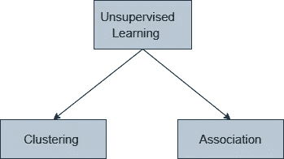

作者图片

`*The article only focuses on the clustering algorithm (K-means).*` ***聚类是将具有相似特征的数据点进行分组。*** 有时候无监督学习算法的作用变得非常重要。

已经给出了一些优点[2] —

*   无监督学习有助于从数据中找到有价值的见解。
*   无监督学习与人类非常相似。我们通过自己的经历来学习思考，这让它更接近真实的 AI。
*   无监督学习对未标记和未分类的数据起作用，这使得无监督学习变得更加重要。
*   在现实世界中，我们并不总是有相应输出的输入数据，因此要解决这种情况，我们需要无监督学习。

## K-means 的坐标距离计算

*   **欧几里德距离**

欧几里德距离是计算两个坐标点之间距离的最著名的方法。它计算对象对的坐标之间的平方差的平方根[4]。它是两个数据点之间的直线距离。

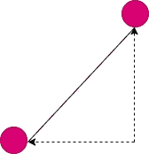

欧几里德距离(图片由作者提供)

欧几里得距离可以用下面的等式来测量。公式用 `***x*** and ***y***`表示两点。`***K***` 是维度的数量*(在数据科学中，每个数据集的特征被认为是一个维度)。*

*   **曼哈顿距离**

曼哈顿距离计算对象对的坐标之间的绝对差异[4]。

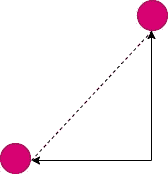

曼哈顿距离(图片作者提供)

曼哈顿距离是坐标绝对距离的总和。可以描述如下。

这里，`x **and** y`是两个坐标点，`‘‘k’’`是尺寸/特征的数量。

*   **切比雪夫距离**

切比雪夫距离也称为最大值距离，计算为一对对象的坐标之间差异的绝对大小[4]。这是最大坐标值。

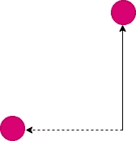

切比雪夫距离(图片作者)

`**x and y**` 代表两个坐标点。他们的切比雪夫距离可以通过找到坐标中的最大距离来计算。`**k**`表示特征的数量。

假设我们有两点，`**x(1, 3)** and **y(5,10)**`，**。**T3。所以，`max (4, 7) is 7`。这意味着**切比雪夫的距离**是 **7。**

*   **闵可夫斯基距离**

闵可夫斯基距离是一个统一的距离公式。有了这个距离公式，我们只要改变一个参数就可以得到以上所有的距离。

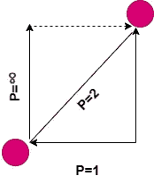

闵可夫斯基距离(图片作者提供)

该距离可以用下面的公式计算。两点之间的距离，`**x and y**`、**、**、 `**k**` 为特征的个数。`**P**` 是一个唯一的参数，它转换方程来计算不同的距离。

注意，当 `**p=2**,`时，距离变成欧几里德距离。当`**p=1**`时，变为城市街区距离。切比雪夫距离是闵可夫斯基距离的变体，其中 `**p=∞**` (取一个极限)【4】。

关于描述距离，研究论文[4]和文章[5]对我帮助很大。】

`The research finding shows that Euclidean distance is the best method for calculating the distances among the data points for the K-means clustering algorithm.`

## **K-means 聚类算法概述**

K-means 聚类是一种流行的无监督聚类机器学习算法。让我们解释一下它是如何工作的。

***第一步:*** 最开始，我们需要选择 **K** 的值。 **K** 表示您想要的集群数量。

样本数据点(图片由作者提供)

***第二步:*** 为每个簇随机选择质心。

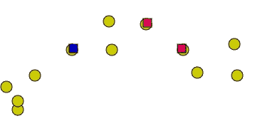

随机选择的质心(图片由作者提供)

假设对于以上数据点；我们想要创建 3 个集群。因此， ***K=3*** 并且正方形颜色的数据点是 3 个随机选择的质心。

***步骤 3:*** 计算数据点到质心的距离，并根据最小距离将数据点分配到聚类中。

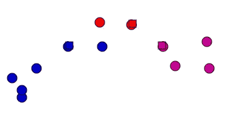

每个质心下分配的聚类(图片由作者提供)

从上面的图像中，我们清楚地看到，每个质心都被分配了一些数据点，这些数据点基于用不同颜色表示的最小距离。

***第四步:*** 计算每个聚类的平均值，将新的质心重新集中到平均值。

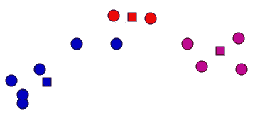

重新排列聚类(图片由作者提供)

该图像描绘了根据质心的平均值将质心居中到新位置。

***第五步:*** 重复第三步和第四步，直到质心收敛。

重新调整集群(图片由作者提供)

重复步骤 3 和步骤 4 之后，我们得到了上面的集群。对于下一次迭代，我们得到以下集群。

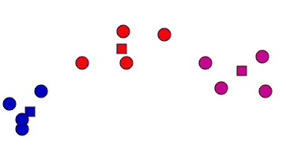

迭代后的新聚类(图片由作者提供)

下一次迭代做什么？让我们看看。

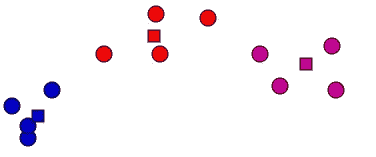

汇聚成最终的集群(图片由作者提供)

最后两个簇和质心是相同的。我们可以说，质心收敛，我们达到了我们的最终目标。

## K-均值的最佳聚类数

K-means 聚类算法的一个大问题是如何选择最佳的聚类数目。如果不知道最佳集群数，就要应用 [**肘法**](https://www.analyticsvidhya.com/blog/2021/01/in-depth-intuition-of-k-means-clustering-algorithm-in-machine-learning/) 来找出。*为了保持文章的精确和适度，我简单说明一下方法。*

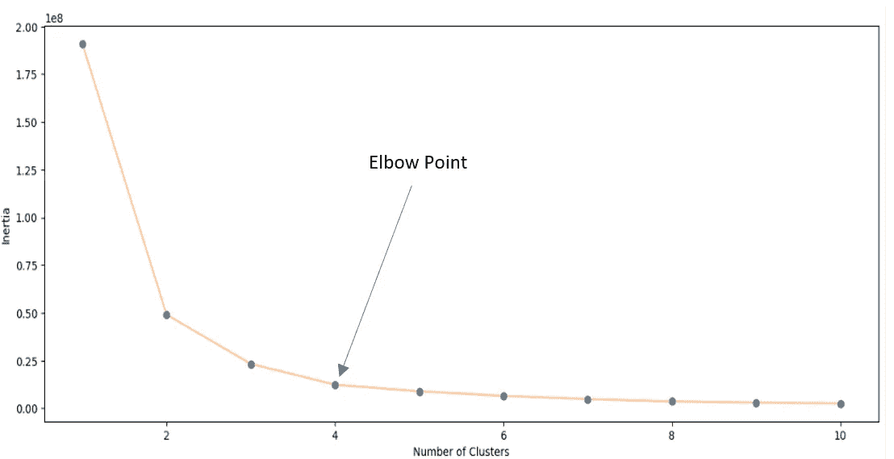

肘法图(图片由作者提供)[6]

应用肘方法后，我们会发现一个如上图所示的线图。从图中，我们需要找出肘点和相应的集群数。并且它将被认为是最佳的聚类数。对于上图，最佳聚类数是 4。肘法的详细解释可用 [***这里的***](https://www.analyticsvidhya.com/blog/2021/01/in-depth-intuition-of-k-means-clustering-algorithm-in-machine-learning/) ***。***

## 为什么是 K-means？

K-means 是最流行的聚类算法。这是一种简单的聚类算法，适用于大型数据集。相比之下，它比其他聚类算法运行得更快。它总是保证收敛到最终的聚类，并容易适应新的数据点[3]。

## K-means 的挑战

在上一节中，我们看到初始聚类质心在 K-means 聚类算法中是随机分配的，这导致了随机的迭代和执行时间。因此，初始质心点的选择是算法中的一个关键问题。你可以阅读下面的文章，它代表了一种系统地选择初始质心的技术。

  

该算法对复杂的分布式数据不太适用。

## 逐步动手实施

本节将从头开始展示 K-means 聚类算法的实际实现。对于任何机器学习模型，我们首先需要加载数据集。出于演示的目的，我使用了`[**mall_customer**](https://www.kaggle.com/datasets/shwetabh123/mall-customers?resource=download)` 数据集。这是一个受欢迎的数据集。

`[N.B. — *have used the* [*mall_customer*](https://www.kaggle.com/datasets/shwetabh123/mall-customers?resource=download) *dataset, which is a public domain dataset under the “*[*CC0: Public Domain*](https://creativecommons.org/publicdomain/zero/1.0/)*” license.*]`

*   ***导入必要的库***

*   ***加载数据集和一些预处理***

*数据集的信息*

`Customer ID`和`Gender` 不是那么重要，所以我已经丢弃了这些列。

将`dataframe`转换成一个`NumPy`数组。

提取列号和行号。

*   ***选择聚类数***

*   ***随机选择质心***

定义特征尺寸的空数组。

为 3 个簇随机选择 3 个质心。

*   ***下面的代码实现了 K-means 聚类概述章节*** 中提到的 `***step-3, step-4 and step-5***`

*我在上面的代码中添加了一些命令，以便于理解功能。*

*   ****可视化集群****

*每个聚类在 3D 空间中用不同的颜色表示。*

## *结论*

*K-means 聚类算法简单易用。在实现算法之前，我们需要小心算法的用例以及底层工作原理。对于非常复杂的分布式数据，该算法效果并不好。*

*`I am writing a series of articles on machine learning. The[**article describes KNN**](https://medium.com/towards-data-science/knn-algorithm-from-scratch-37febe0c15b3) algorithm implementation from scratch.`*

> *最后，如果你觉得这篇文章有帮助，别忘了给我`[**follow**](https://medium.com/@mzh706)`。也可以用我的`[**referral link**](https://mzh706.medium.com/membership)`加入 medium。通过电子邮件获取我所有的文章更新`[**subscribe**](https://mzh706.medium.com/subscribe)` 。*

## *参考*

1.  *[什么是无监督学习？IBM](https://www.ibm.com/cloud/learn/unsupervised-learning#:~:text=Unsupervised%20learning%2C%20also%20known%20as,the%20need%20for%20human%20intervention.)*
2.  *https://www.javatpoint.com/unsupervised-machine-learning*
3.  *[k-Means 优缺点|机器学习|谷歌开发者](https://developers.google.com/machine-learning/clustering/algorithm/advantages-disadvantages#:~:text=Advantages%20of%20k%2Dmeans&text=Guarantees%20convergence.,sizes%2C%20such%20as%20elliptical%20clusters.)*
4.  *辛格、亚达夫和拉纳(2013 年)。具有三种不同距离度量的 K-means。*《国际计算机应用杂志》*， *67* (10)。*
5.  *[https://towards data science . com/9-distance-measures-in-data-science-918109d 069 fa](/9-distance-measures-in-data-science-918109d069fa)*
6.  *Zubair，m .、Iqbal，M.A .、Shil，A. *等*一种面向高效数据驱动建模的改进 K 均值聚类算法。*安。数据。Sci。* (2022)。【https://doi.org/10.1007/s40745-022-00428-2 *

****其他相关文章。你可以看看。****

*     *