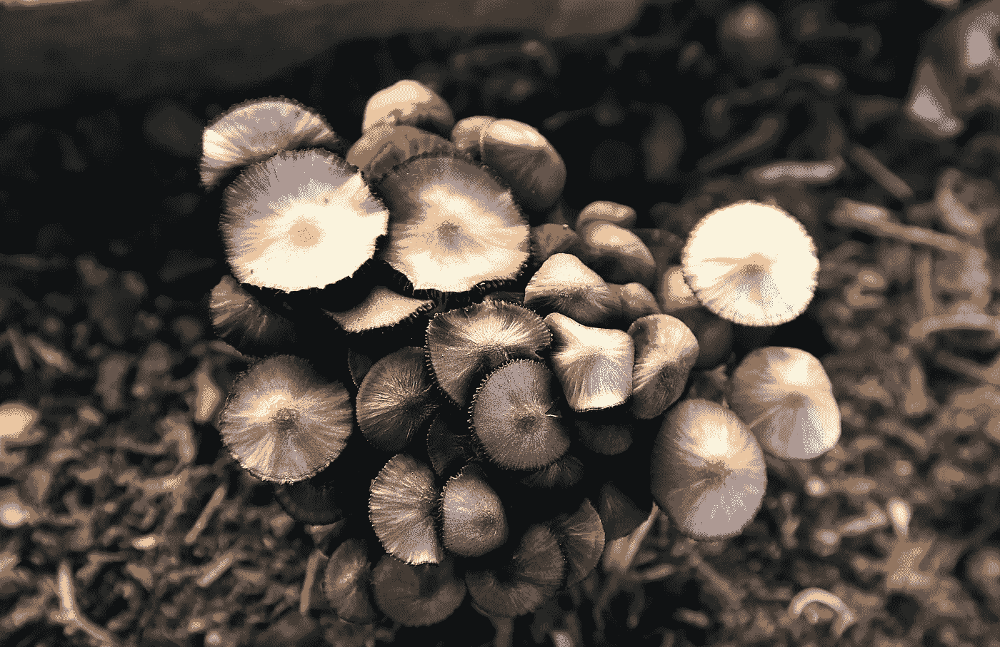

# 无监督学习:为聚类点建立分数度量

> 原文：<https://towardsdatascience.com/unsupervised-learning-building-score-metrics-for-cluster-points-97222a3b82b7>

## 测量相似聚类点内的差异

一簇褐色的小蘑菇。纳蕾塔·马丁在 [Unsplash](https://unsplash.com/s/photos/clusters?utm_source=unsplash&utm_medium=referral&utm_content=creditCopyText) 上的照片

聚类是一种无监督的机器学习技术，用于发现数据中的有趣模式。例如，根据相似客户的行为对其进行分组，构建垃圾邮件过滤器，识别欺诈或犯罪活动。

> 在群集中，相似的项目(或数据点)被分组在一起。然而，我们不仅希望将相似的项目分组在一起，我们还希望衡量它们的相似性或差异性。为了解决这个问题，我们可以很容易地创建一个评分算法。

在这个例子中，我使用了一个简单的 k-means 聚类方法。你可以在这里阅读。我们使用*sk learn . datasets . make _ blobs*生成用于聚类的各向同性高斯 blob。

接下来，我们建立一个简单的 k-means 算法，包含 3 个聚类，并获得这些聚类的质心。

现在，为了对不同聚类中的每个点进行评分，我们可以估计它们离聚类中心有多近，并将其与聚类中最远的点进行比较。质心的中心表示聚类点的理想位置，而质心的最远点是聚类点的最差点。

在本例中，我们的数据集包含 2 列，因此我们可以轻松地测量它们的平方差之和。为了便于解释，这些距离可以转换成百分比。

这些测量不仅能给我们一个距离一个星团中心有多远的估计，还能给我们一个距离下一个星团有多远的估计。这对于像客户细分这样的问题特别有意思，在这种情况下，我们想测试每种营销方法如何影响客户。

我希望这对你有帮助。期待您的评论，同时您也可以在 [twitter](https://twitter.com/samsonafo) 、 [Linkedin](https://www.linkedin.com/in/samson-afolabi/) 和 [medium](https://samsonafolabi.medium.com/) 上关注我。

如果你喜欢这篇文章，你可以考虑请我喝☕️.咖啡

你也可以在这里查看我的文章“*使用无监督机器学习建立客户群*”。

*Vielen Dank* 😊