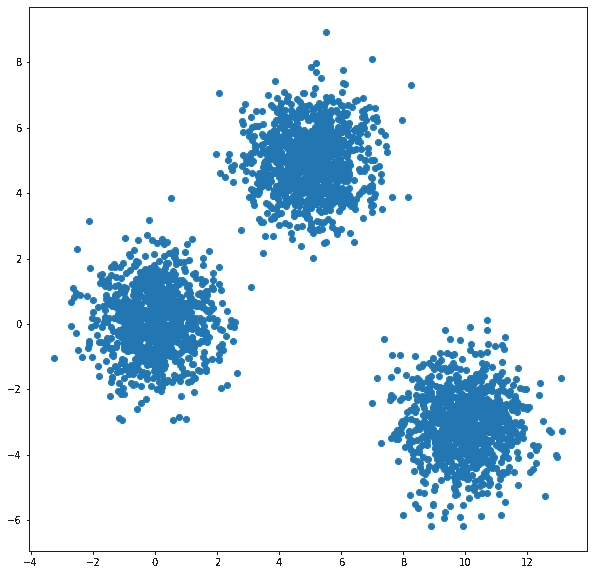
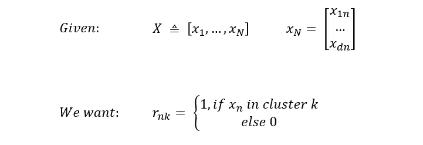
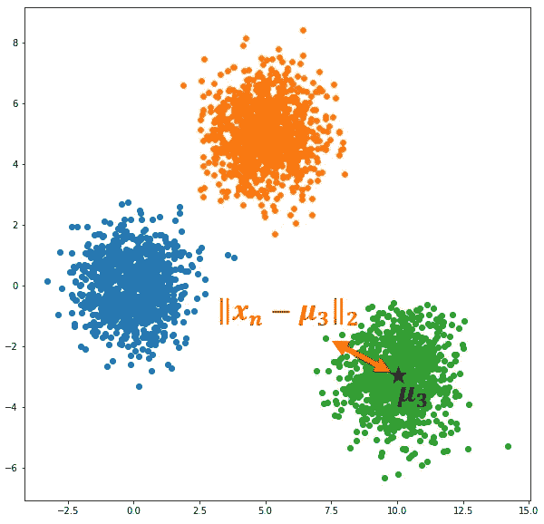
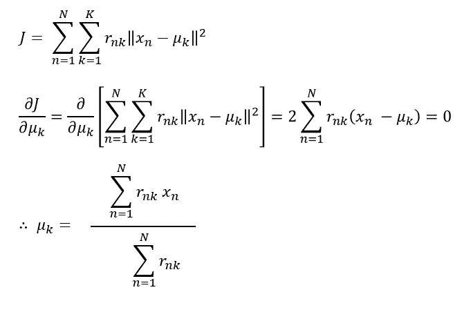
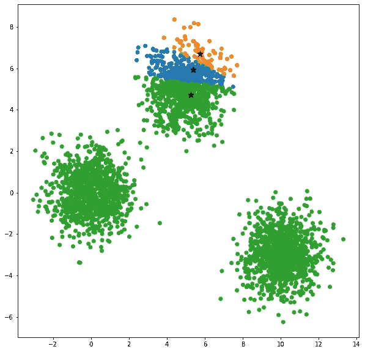
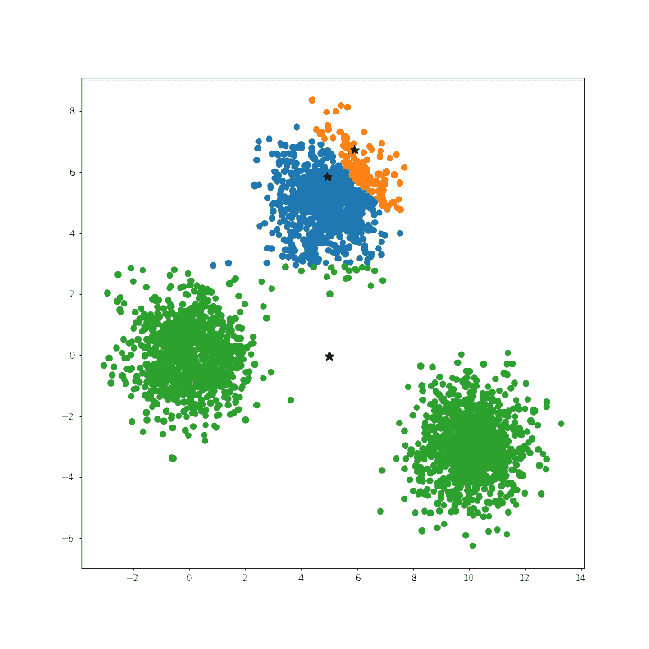
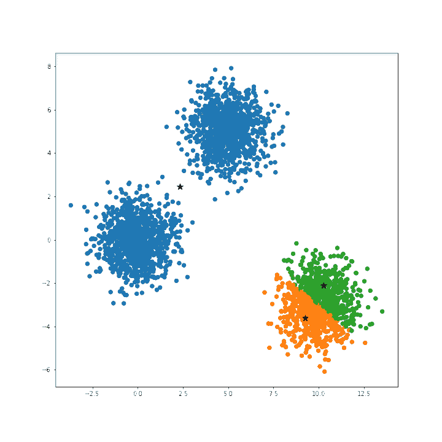
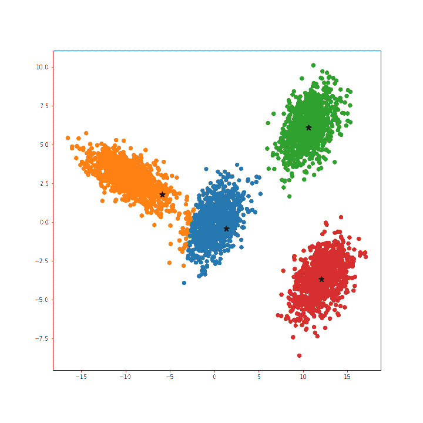

# 无监督学习:K-均值聚类

> 原文：<https://towardsdatascience.com/unsupervised-learning-k-means-clustering-6fd72393573c>

## 机器学习理论

## k-均值聚类直观解释

作者 Gif

K-均值聚类是一种迭代算法，它选择最小化类内方差的聚类中心。

# 介绍

在本文中，我想介绍一种最简单的数据聚类算法，k-means 聚类。这是一种经常在面试中出现的算法，用来测试你的基本面知识。读完这篇文章后，你会理解监督学习和非监督学习之间的区别，以及简单数据聚类模型背后的数学原理。

# 无监督学习

许多常见的机器学习问题都属于监督学习领域。任何与分类或回归有关的问题通常都属于监督学习。监督学习问题包括我们知道训练数据“标签”的问题。如果我们知道标签，那么任务就包括训练一些隐藏函数，将我们的数据矩阵映射到隐藏标签。例如，在分类器中，我们知道什么训练数据属于什么类，因此我们训练像神经网络这样的函数来拟合数据，并使用训练的模型来预测看不见的数据。

在无监督学习中，我们不知道我们训练数据的标签。我们不能在输入和输出之间建立直接的映射。因此，我们的目标是学会发现数据中的模式并加以利用。

# 数据聚类:K 均值

## 问题简介

聚类算法是一种无监督学习模型。他们的目标是将数据分组。考虑一个分类问题，您知道有多少个类，但您的数据是未标记的。

在 k-means 聚类中，我们假设我们知道有多少个组，然后我们将数据聚类到那个数量的组中。组的数量被表示为“k”，因此该算法的名称。

假设我们有以下问题:

3 集群问题(图片由作者提供)

我们有一个二维数据集。数据集似乎包含 3 个聚类(训练时我们不知道它们的真实标签)。我们不知道每个数据点的类成员，但我们知道系统中有 3 个组。能不能做一个算法，确定每个点属于哪个聚类？

## 制定

给定数据矩阵 x，它是一个 N×d 矩阵，有 N 个数据点，每个数据点有 d 维(在我们的问题中 d = 2)。我们想确定类成员(rnk)。如果数据点不属于某个聚类，则该变量为 0，否则为 1。这里有一个例子:

班级成员可视化(图片由作者提供)

上面是一个数据点的向量及其类成员的例子。该点属于簇 3，所以它 rn3 为 1，其余均为 0。目标是找出所有数据点的 rnk。

## 目标函数

为了训练机器学习模型，我们通常会寻找某种可以最小化的误差函数，以便训练我们的模型。在 k 均值聚类的情况下，**目标是找到最小化类内方差的聚类中心**:

如果我们最小化目标函数 J，我们就最小化了为该聚类选择的聚类中心μ之间的欧几里德距离的平方。

作者图片

因此，对于每个聚类，我们查看我们认为属于该聚类的点，并选择最小化聚类中心和该聚类中所有点之间的欧几里德距离的平方的聚类中心。我已经注意到上图中欧几里得距离是 L2 范数。

我们可以采用上面所示的目标函数，对聚类中心进行微分，并使其等于 0，以找到导致最小损失(聚类方差内的最小值)的聚类中心。

最佳聚类中心的推导。注意，当求微分时，在聚类中心 K 上求和。

在上面的推导中，我们发现最佳聚类中心(最小化聚类内方差的中心)是每个聚类的平均值。这是一个直观的结果。聚类中使方差最小的点将位于均值中。

## k 均值算法

所以我们知道最优聚类中心是每个聚类的均值，但是在不知道类成员(rnk)的情况下，我们无法计算每个聚类的均值。为了解决这个问题，我们实现了一个迭代算法:

k-表示伪代码(作者)

我们首先随机初始化我们的聚类中心(第 1 行)。我们可以通过随机选取 k 个点来实现。然后，我们根据欧几里德距离将每个数据点分配到离它最近的聚类中心(第 7-10 行)。

然后，我们通过计算每个聚类中心的平均值来更新聚类中心(第 14–17 行)。最后，我们重复这一过程，直到聚类中心收敛。

随机初始化(图片作者提供)

在上面的图像中，通过随机选取 3 个点初始化了 3 个聚类中心。颜色表示每个数据点被分配到哪个聚类中心。通过计算每个点到所有 3 个聚类中心的欧几里德距离，并挑选最接近它的一个来计算类成员 rnk。如您所见，最下面的聚类中心占据了大部分数据。该算法的下一步是计算每个聚类的平均值并更新聚类中心。橙色和蓝色的聚类中心不会移动太多，但绿色的聚类中心会向下移动很远。在更新聚类中心之后，我们再次计算类成员，重复直到点已经收敛:

从随机初始化收敛(GIF 由作者提供)

正如你在上面看到的，k-means 算法成功地找到了真正的聚类中心。

# k 均值聚类的问题

## 对初始化的依赖

k-means 聚类的一个大问题是它的一致性。由于随机初始化，k-means 不是很一致。根据初始化聚类中心的位置，该算法可以产生非常不同的结果。

k-means 被错误的初始化卡住(GIF 由作者提供)

在上面的 GIF 中，与之前的模型相同，但初始化不同。由于不幸的初始化，该模型未能找到真正的聚类中心。蓝色聚类的平均值卡在两个聚类之间，因为橙色和绿色聚类中心划分了第三个聚类。

## 我们并不总是知道 K

由于这是无监督学习，我们可能不知道真实的聚类数。这也将导致错误的聚类中心。

4 个聚类中心(GIF 由作者提供)

## 数据不总是均匀分布的

在 k-means 聚类中，每个数据点被分配到它最接近的聚类中心。在二维空间中，两个聚类中心之间的判定边界将是线性的，而不会考虑每个分布的形状。这对于没有相关性的分布很有效，就像我们到目前为止所展示的那样。但如果我们在数据中引入相关性，k 均值就开始表现不佳。

二元高斯和 k 均值(GIF 由作者提供)

看看上面 gif 中橙色和蓝色的星团。蓝色星团正在吞噬橙色星团，尽管从视觉上我们可以看出这些点属于橙色星团。在 k-means 中，我们不考虑数据中的相关性，但有其他聚类技术可以考虑。如果您的数据呈正态分布，如上图所示，k-means 可能不是最佳的聚类算法。敬请关注未来关于高斯混合模型的文章！

# 结论

本文直观地解释了 k-means 聚类，这是一种简单的数据聚类算法。k-means 聚类迭代地估计未标记数据集的聚类中心，以最小化类内方差。由于我们不知道类成员，为了计算类内方差，我们首先随机初始化类中心，然后期望每个类的新类中心是分配给每个类的数据点的平均值。k-means 有很大的缺点，我在文章的最后强调了这一点，在未来，我将引入高斯混合模型，这是一种将高斯分布拟合到未标记数据的方法。

## 支持我

希望这对你有所帮助，如果你喜欢，你可以 [**关注我！**](https://medium.com/@diegounzuetaruedas)

你也可以成为 [**中级会员**](https://diegounzuetaruedas.medium.com/membership) 使用我的推荐链接，获得我所有的文章和更多:[https://diegounzuetaruedas.medium.com/membership](https://diegounzuetaruedas.medium.com/membership)

# 你可能喜欢的其他文章

[数据可视化理论](/data-visualization-theory-an-introduction-a077c0d80498)

[分析西班牙酒店数据](https://medium.com/geekculture/analysis-of-synthetic-hotel-data-in-spain-d6bb5070c2fe)