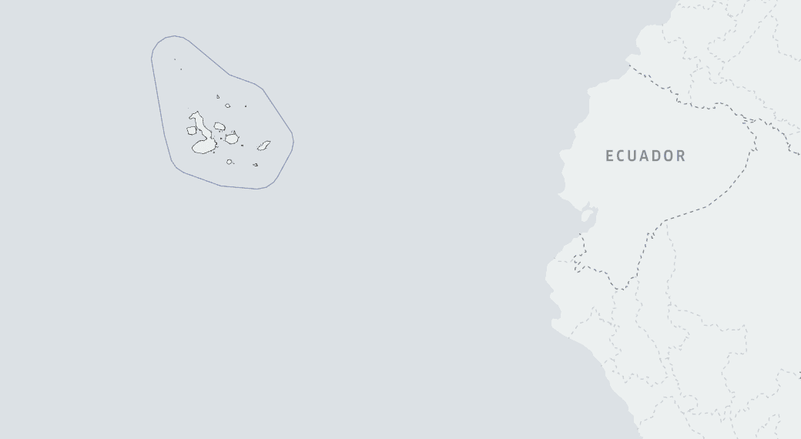
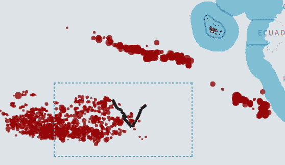

# 利用地理空间技术揭示捕鱼活动对海洋巨型动物的风险

> 原文：<https://towardsdatascience.com/unveiling-fishing-activity-risk-to-marine-megafauna-with-geospatial-technologies-48505e44d5e1>

## 中国渔船濒临灭绝的鲸鲨——加拉帕戈斯群岛

图片由作者提供。“天空”鲸鲨的轨迹上覆盖着中国的捕鱼活动。厄瓜多尔加拉帕戈斯。数据来自[全球渔业观察](https://globalfishingwatch.org/map) ( [CC BY-SA 4.0](https://creativecommons.org/licenses/by-sa/4.0/) )和[加拉帕戈斯鲸鲨项目](https://www.gis4-wildlife.com/galapagos-whale-shark-project)。 [*打开这个故事*](https://bryanvallejo16.medium.com/unveiling-fishing-activity-risk-to-marine-megafauna-with-geospatial-technologies-48505e44d5e1?sk=1dcd9b0e3aac4ed48989823f524b3916) ！

地理空间技术在过去十年中发展迅速，成果显著。地球观测数据可以在几秒钟内揭示环境和人类活动，并已用于不同的情况，如海洋保护、野火和城市热浪，仅举几例。[全球渔业观察](https://globalfishingwatch.org/)机构通过对帕劳群岛、加拉帕戈斯群岛、纽埃岛等海洋区域的数据分析，大力披露渔业活动，并成功支持许多国家保护其海洋资源免遭非法捕捞和过度捕捞。

过度捕捞活动给海洋生态系统链带来失衡，并通过罢工和不必要的捕捞危及海洋巨型动物的栖息地。在加拉帕戈斯海洋保护区，在[海洋巨型动物基金会(MMF)](https://marinemegafauna.org/) 和[加拉帕戈斯鲸鲨项目(GWSP)](https://www.galapagoswhaleshark.org/) 旁边，2019 年标记的鲸鲨“希望”的故事变得国际化。“希望”号开始以不切实际的速度从海面给出卫星轨迹，很可能被附近的一艘渔船捕获。了解更多关于 MMF 以加拉帕戈斯海洋保护区为目标的捕鱼船队的故事。

不幸的是，“希望”号并不是最后一条被意外捕获的鲨鱼。之后，2021 年在 GWSP 附近标记的另外三只鲸鲨开始从陆地上发出信号。[野生动物追踪器](https://www.gis4-wildlife.com/galapagos-whale-shark-project)地理框架的警报系统报告了厄瓜多尔和秘鲁海岸的鲸鲨。加拉帕戈斯鲸鲨项目与 [GIS4 野生动物运动分析](https://www.gis4-wildlife.com/)合作，撰写了一份关于这些事件中所涉及的保护工作和捕鱼活动风险的报告。在这里找到索菲亚·格林写的故事。

  

图片由 [GIS4 野生动物](https://medium.com/gis4-wildlife-tracking/application-of-the-wildlife-tracker-to-conservation-efforts-1d3cc572e4cd)提供。野生动物追踪警报系统报告的在陆地上发现的三个人的轨迹。数据来自[加拉帕戈斯鲸鲨](https://www.gis4-wildlife.com/galapagos-whale-shark-project)项目*DOI:*[*10.5281/Zeno do . 6477840*](https://github.com/gis4-wildlife/gallery-v0.3/tree/main)

# 中国渔船瞄准加拉帕戈斯群岛

中国船只是巨大的冰箱，可以在世界各地的任何海洋中运行(母舰)。他们的捕鱼活动在 2017 年被报道为非法[ [1](https://www.nationalgeographic.com/animals/article/wildlife-watch-galapagos-illegal-shark-fishing) ]，一艘装满鱼翅的船在严禁捕鱼的海洋保护区内被捕获。

《纽约时报》最近的一篇报道调查了 2020 年和 2021 年中国捕鱼活动是如何瞄准加拉帕戈斯海洋保护区的。主要问题是，海洋巨型动物物种需要很大范围的栖息地，而且通常超出了海洋保护区的界限。如果捕捞活动继续下去，没有计划加以控制，海洋巨型动物个体的事故可能会不断发生，包括船只撞击、意外捕获和非法捕捞。

> 几个世纪以来，**加拉帕戈斯群岛**周围丰富多样的生态环境吸引了当地渔民。现在，这片水域面临着一个更大、更贪婪的猎手:中国。
> 
> 《纽约时报》的迈尔斯、常、沃特金斯和傅(2022)

# 数据许可和归属

*   ***表观渔捞努力小时数—全球渔捞观察***数据集在知识共享署名许可下-ShareAlike 4.0 国际许可( [CC BY-SA 4.0](https://creativecommons.org/licenses/by-sa/4.0/) )。一旦你从[全球渔业观察门户](https://globalfishingwatch.org/map)或[下载门户](https://globalfishingwatch.org/data-download/datasets/public-fishing-effort)下载了表观捕捞努力量，你就可以在元数据中找到许可证。这些数据的用户被允许以任何媒体或格式复制和再分发这些材料，重新混合、转换这些材料，并基于这些材料用于任何目的，甚至是商业目的。应归功于全球渔业观察组织。
*   ***天空中的鲸鲨和陆地上发现的 3 只个体—由*** [***提供加拉帕戈斯鲸鲨项目***](https://www.gis4-wildlife.com/galapagos-whale-shark-project)
    可视化(图片)在知识共享署名 4.0 国际许可下开放访问。允许公众在引用归属的条件下共享内容，如:
    *Bryan R. Vallejo，& Sofia Green。(2022).野生动物跟踪器 v0.3 中的海洋卫星数据实现:用加拉帕戈斯鲸鲨项目(WildlifeTracker0.3)测试的生态地理变量和捕鱼压力。DOI:*[*10.5281/Zeno do . 6477840*](https://github.com/gis4-wildlife/gallery-v0.3/tree/main)

# 地理空间技术揭露中国在加拉帕戈斯的捕鱼活动

由于全球渔业观察机构及其在处理卫星记录的数百万个位置方面的努力，我们能够获得捕鱼活动的指标，如捕鱼作业时间。捕鱼活动已经被鲸鲨[【天空】覆盖。这些生物记录数据由加拉帕戈斯鲸鲨项目提供给其合作伙伴 GIS4 野生动物运动分析，用于地理空间数据实验。到目前为止，结果是成功的，通过鲸鲨跟踪数据揭示了捕鱼活动模式。](https://www.gis4-wildlife.com/galapagos-whale-shark-project)

## 方法概述

用于这些可视化的方法是一个基本的属性过滤。下载的数据代表指标*捕鱼努力小时*，它被下载并显示在加拉帕戈斯海洋保护区周围。你会从全球渔业观察的公共数据集中找到不同的部分，如捕捞努力量、锚地、载体和一些额外的数据集。本文中使用的是船只和旗帜的捕捞努力量。属性标志将允许您按感兴趣的国家(如厄瓜多尔、中国、智利、秘鲁、哥伦比亚和数据中可用的任何其他国家)对捕捞作业数据进行子集划分。您可以在[数据和代码页下载这些数据。](https://globalfishingwatch.org/datasets-and-code/)

> 如果你想知道更多关于捕鱼努力小时指标是如何计算的，请参考全球捕鱼观察:[研究页面](https://globalfishingwatch.org/publications/)和[技术页面](https://globalfishingwatch.org/our-technology/)

## 保护的应用和可用性

海洋巨型动物轨迹上捕捞压力的可视化有助于理解海洋物种可能受到捕捞活动威胁的区域。风险包括船只撞击、非法捕鱼和意外捕获。为了解决这个问题并促进海洋野生动物保护，我们对这种可视化方法有不同的应用:

*   根据海洋大型动物倾向于造访危险区域的季节，重新安排捕鱼活动。
*   当海洋巨型动物进入危险或高捕捞压力区时，向保护机构和渔业当局发出实时警报系统。
*   揭露可能对海洋巨型动物物种面临危险负责的国家。

> 如果你愿意基于数据了解更多关于保护工作的信息，你可以在 [GIS4 野生动物页面](https://www.gis4-wildlife.com/blog)找到更多信息

# 模式可视化

在这个快速查看中，我显示了与天空时间范围相匹配的捕鱼努力小时数，包括所有涉及的旗帜。时间范围为 2021 年 7 月 1 日至 2022 年 4 月 1 日。

图片由作者提供。天空时间范围内加拉帕戈斯海洋保护区的捕鱼活动。数据来自[全球渔业观察](https://globalfishingwatch.org/map) (CC BY-SA 4.0)

下一步，有助于理解捕鱼活动对海洋巨型动物的风险，可以通过添加“天空”轨迹和用中国国旗过滤捕鱼活动来可视化。

图片由作者提供。中国在加拉帕戈斯海洋保护区的捕鱼活动和鲸鲨轨迹。数据来自[全球渔业观察](https://globalfishingwatch.org/map) (CC BY-SA 4.0)和[加拉帕戈斯鲸鲨项目](https://www.gis4-wildlife.com/galapagos-whale-shark-project)。

有两点需要直观地指出:

当它到达南部地区第一个捕鱼活动集中的地方时，天空就停止了。显然，捕鱼活动的压力中断了海洋巨型动物的自由活动

图片由作者提供。天空轨迹中的第一个运动异常。数据来自[全球渔业观察](https://globalfishingwatch.org/map) (CC BY-SA 4.0)和[加拉帕戈斯鲸鲨项目](https://www.gis4-wildlife.com/galapagos-whale-shark-project)

然后，突然，天空停止运动，当它到达北部地区的捕鱼活动压力较高。天空最后一次报道是在 2022 年 3 月 24 日。很自然，我们知道天空停止发送信号是因为失去被标记的鲸鲨的信号是很常见的。但是在看到天空电视台最后的位置在一个濒危区域后，我开始怀疑了。

图片由作者提供。天空运动接近高渔业压力时结束。数据来自[全球渔业观察](https://globalfishingwatch.org/map) (CC BY-SA 4.0)和[加拉帕戈斯鲸鲨项目](https://www.gis4-wildlife.com/galapagos-whale-shark-project)

我们不能肯定地说是什么阻止了鲸鲨 Sky 的日志，但我们可以清楚地看到，在它的轨迹中，个体暴露于捕鱼活动。

正如我们所见，中国船只正在海洋保护区外遭遇巨型海洋动物。这些事件增加了危及脆弱海洋物种生命的问题发生的可能性。解决方案相当复杂，但根据海洋游客安排捕鱼活动是一种选择。根据当局的行为，该解决方案可以配备实时地理空间技术。

# 后续步骤

一旦数据与海洋巨型动物跟踪数据及时匹配，下一步就是开始模拟捕捞压力造成的风险区域。一个好办法是在大型海洋动物物种在时间和距离上经常暴露于渔船的地方建立一个缓冲区。这个模型正在开发中，我们的目标是让它实时工作，以便在保护工作中做出快速反应。这种模式愿意在海洋保护软件中实现，如[野生动物追踪器](https://www.gis4-wildlife.com/)。

# 结论

地理空间技术当然可以支持海洋野生动物的保护工作。捕鱼活动可以在海洋个体的轨迹中显示和叠加，以了解它可能如何影响它们的栖息地。如果当局决定获得海洋保护区管理的适当技术，他们就能够控制可能危及受保护海洋物种生命的捕捞活动的时间安排。作为地理空间分析的专业人士，我可以明确地说，这只是海洋巨型动物保护和捕鱼活动对其影响之间的开始。我想到了许多关于如何更深入地分析这些数据集之间的关系的想法，当然也揭示了更多的见解，如停止检测或标记轨迹注释。

## 作者:

> 布莱恩·r·巴列霍
> 
> 地理空间科学家[“野生动物追踪器”](https://www.gis4-wildlife.com/)的创造者
> 
> [订阅](https://bryanvallejo16.medium.com/membership)我的故事

# 参考

[1]贝尔，雷切尔(2017)。成千上万的鲨鱼被发现在巨大的非法捕捞船上。国家地理。从

[2] [史蒂文·李·迈尔斯](https://www.nytimes.com/by/steven-lee-myers)，艾格尼丝·张，[德里克·沃特金斯](https://www.nytimes.com/by/derek-watkins)，以及[克莱尔·傅](https://www.nytimes.com/by/claire-fu) (2022)。[中国如何瞄准全球鱼类供应](https://www.nytimes.com/interactive/2022/09/26/world/asia/china-fishing-south-america.html?smid=share-url&unlocked_article_code=5JOquGe_yZ64AhiU8FU_Du1B95d0tZAzYz1uQvvtESUQ2t717QuF8vwEA_iPg89GBjXGrsJwfMgq_19dgAI7-SGd8N6auWFCfPcG7amSyaQz8xP1yUiqCkSOWFFWunwVZjklzWPhD_vOmJwv2J2PQIf8ZAkDFxbS4I3paAV0fvbnD9yxzHk5uEl9d1yPloyJUWeEMs3fVzG5SNdrXDxyenpNOdWcAznjo9AjWgxRp2tRg_zrJWkqDEq2Si4-PKEo-LC0KzTG-b330rSbSasaN5_bEYnWKcksNAyCcQz7LNqF9qZ9rkqutXjkC6vYWm6iRtCAuozUl5PnwUhcmx44G2f34FV7-Nw6aXBtteRWdZ7SBU6gDrVuGYw)。纽约时报。