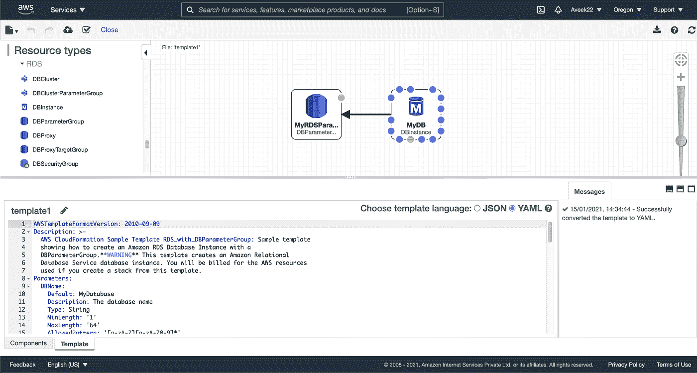
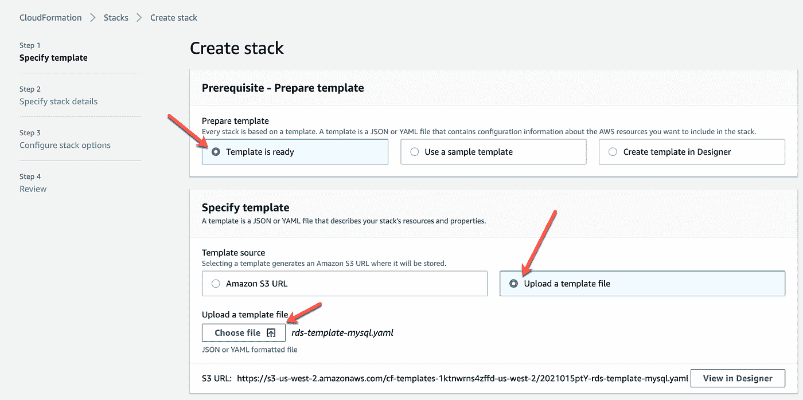
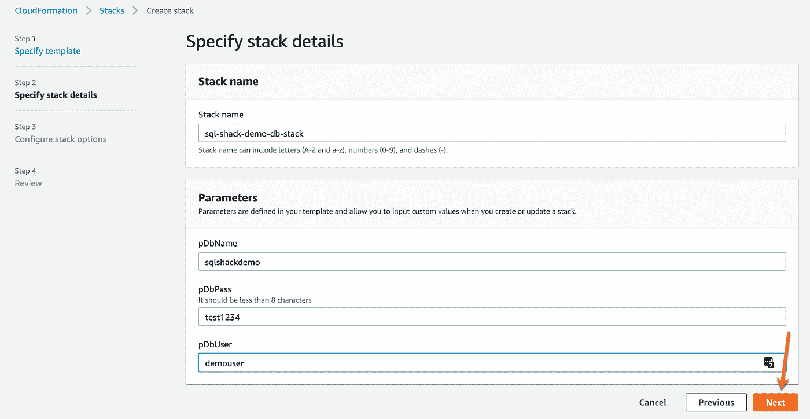
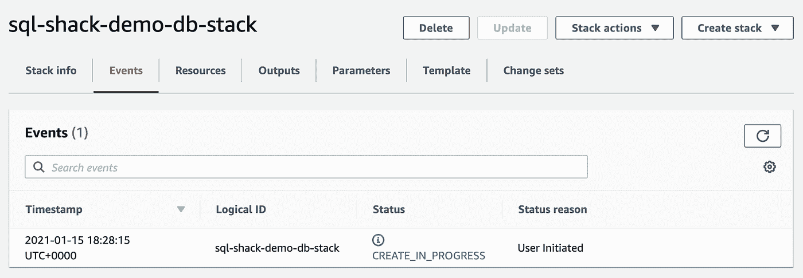
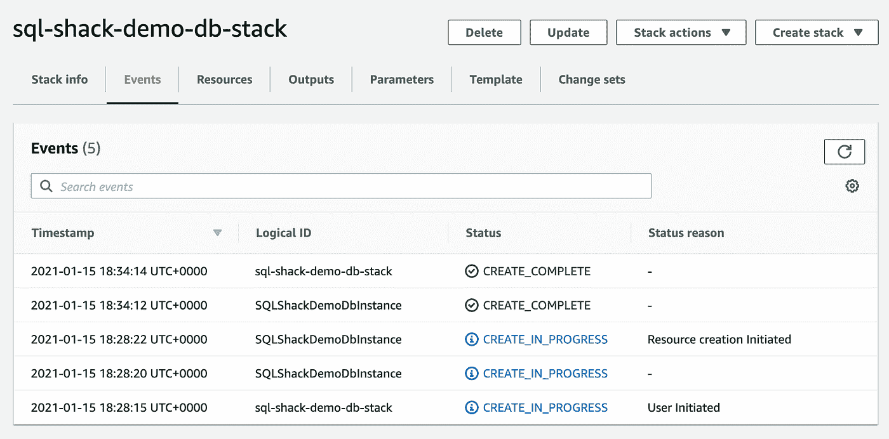
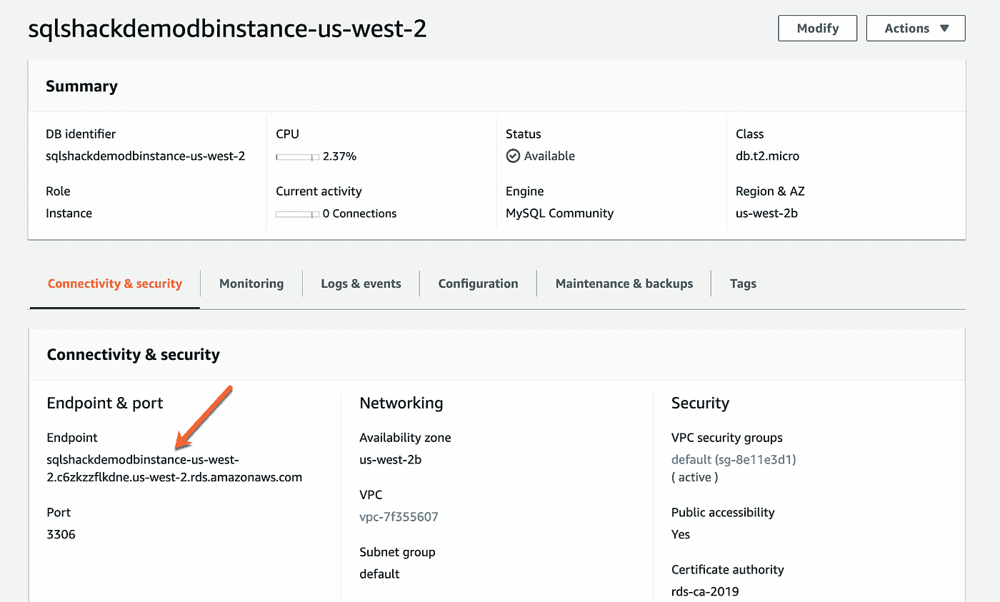
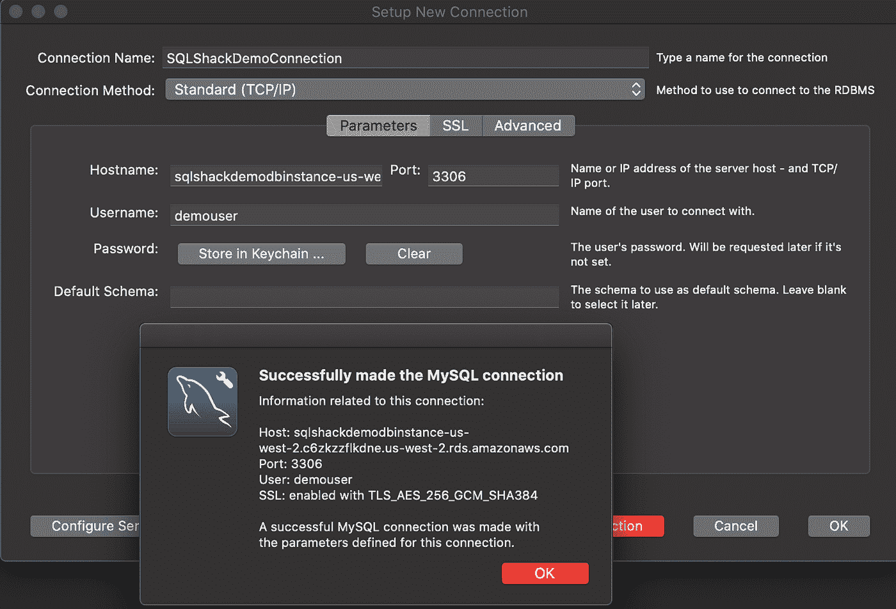
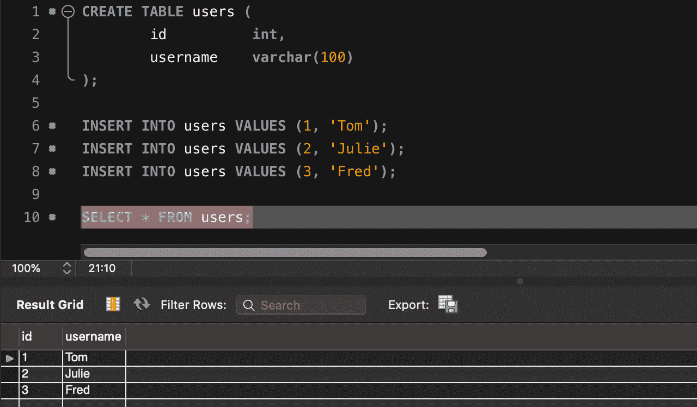
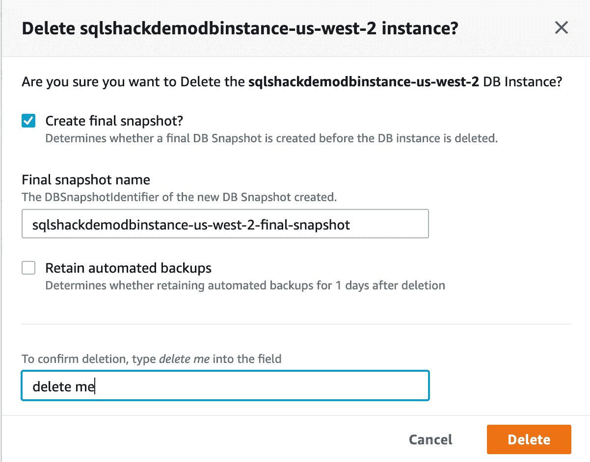

# 使用云形成模板在 RDS 上构建 MySQL 实例

> 原文：<https://towardsdatascience.com/use-cloud-formation-templates-to-spin-up-mysql-instances-on-rds-cebfd2057c97>

## 云形成模板允许您自动将资源部署到 AWS 云。了解如何在 Amazon RDS 上部署 MySQL。

Rafael Garcin 在 [Unsplash](https://unsplash.com?utm_source=medium&utm_medium=referral) 上的照片

在本文中，我将讨论如何使用云形成模板在 AWS RDS 上设置 MySQL 实例。在我的上一篇文章[如何为 MySQL](https://www.sqlshack.com/how-to-configure-amazon-rds-mysql-environment/) 配置 Amazon RDS 环境中，我提供了如何在 Amazon 上设置 MySQL 实例的详细演示。您可以使用 AWS 控制台提供设置实例所需的所有信息，然后使用它。然而，在本文中，我们将讨论使用云形成模板实现相同功能的自动化方法。

# 什么是云形成模板？

为了开始编写模板，我们首先需要了解云的形成是怎么回事。AWS 将云形成作为云服务提供，使 AWS 客户能够将任何基础设施的所需状态编写为代码，然后使用它将资源部署到 AWS。它允许我们按照简单的配置模板创建一个资源或一组资源。例如，如果您想在一个 EC2 实例上部署一个 web 应用程序，该实例也将使用 RDS 数据库，那么您可以简单地将这两个资源合并到一个堆栈中，并编写设置实例的代码。一旦运行，它将创建 EC2 和 RDS 实例，并部署您的 web 应用程序。

*图 AWS 控制台上的云形成模板*

云形成模板的组成如下:

*   一个 JSON 或 YAML 文件，其中的资源将被定义为模板
*   堆栈可以是需要设置为应用程序一部分的多个资源的组合。例如，对于 EC2 和 RDS
*   变更集可用于查看堆栈要执行的操作列表
*   栈集也可以被认为是被复制或再现的栈的管理组

除此之外，我们将主要关注本文中的 JSON/YAML 模板和堆栈。这些模板支持 AWS 上的各种资源。请点击此[链接](https://docs.aws.amazon.com/AWSCloudFormation/latest/UserGuide/Welcome.html)获取详细列表。

# 为云的形成编写 JSON 或 YAML 模板

第一次编写模板时，我们面临的主要挑战之一是模板中应该包含什么内容。为了方便起见，AWS 提供了大量的[模板样本](https://aws.amazon.com/cloudformation/resources/templates/)，可以在官方文档中轻松找到。一旦找到创建必要资源所需的模板，就可以使用它来创建自己的模板。模板可以使用 JSON 或 YAML 创建，也可以从一个转换到另一个。就个人而言，我更喜欢用 YAML 编写模板，因为它可以帮助我远离花括号和逗号，让文档更整洁。然而，你可以在 JSON 和 YAML 之间自由选择。

在这个练习中，让我们试着在 RDS 上运行一个 MySQL 实例，我们将在 YAML 编写代码。为了使用云结构建立一个 MySQL 数据库，我们需要以下物品。

*   **资源名称** —您要设置的资源的名称。
*   **资源类型** —资源的类型。
*   **资源属性** —要连接的数据库名称、用户名和密码。
*   **数据库引擎** — MySQL、SQL Server、PostgreSQL 等。
*   **存储类型** —要使用的存储类型。
*   **公共可访问性** —数据库是否应该具有公共可访问性。
*   **分配的内存** —应该分配给数据库实例的内存。
*   **AWS 区域** —将在其中创建实例的区域。

现在我们已经有了一些要点，让我们开始编写模板文件。

*图 2 —在 RDS 上创建 MySQL 实例的模板文件*

如上图所示，文件的结构分为两部分。在第一部分中，我们已经定义了一些参数，在 AWS 上创建资源时，第二部分中的资源定义将使用这些参数。您可以在您的机器上使用相同的脚本在您的 AWS 帐户上创建一个实例。

# 在控制台上设置堆栈

现在我们已经为 MySQL 创建了模板，是时候设置它了，看看是否一切运行良好。前往 AWS 控制台，在搜索栏上搜索云的形成。点击创建堆栈并从本地上传模板文件。完成后，单击下一步。

*图 3 —从模板创建堆栈*

在下一页，将要求您提供在云形成模板中定义的参数。继续提供必要的详细信息，然后单击 Next。

*图 4 —提供的堆栈参数*

查看堆栈更改和参数，并单击最后一页上的创建堆栈。将开始创建堆栈。可能需要一些时间来创建所有资源，然后才能使用它们。同时，您可以单击 Reload 按钮来检查是否所有事件都已成功创建。

*图 5 —正在创建堆栈*

正如您在时间戳上看到的，我花了大约 6 分钟的时间才获得资源，并且在控制台上也可以看到。导航到“Resources”选项卡，并单击资源的物理 ID。这将带您到 RDS 控制台。

*图 6 —堆栈创建成功*

## 连接 MySQL 数据库

一旦进入 RDS 控制台，就可以获得数据库实例的主机名，并使用它来连接数据库。从控制台抓取端点并使用它进行连接。

*图 RDS 上的 MySQL 实例细节*

现在让我们转到 MySQL Workbench，尝试使用我们之前提供的凭证连接到主机名。使用主机名、用户名和密码连接到实例。

*图 8 —使用 MySQL 工作台连接到 MySQL 实例*

如上图所示，我们已经成功连接到 RDS 上的数据库实例。现在让我们运行一些查询，看看它是否有效。

*图 9 —在 MySQL 工作台中执行脚本*

如上图所示，我们已经能够连接到数据库实例并执行查询。有了这个，您就可以编写自己的云形成模板，并启动任何其他资源，如 SQL Server 或 PostgreSQL 数据库。

# 移除资源

如果您将此作为练习，我建议您删除我们创建的资源，因为这会产生一些费用。您可以导航到 RDS 控制台，然后选择实例并单击“删除”来永久删除资源。

*图 10 —删除创建的资源*

成功删除资源后，您可以在控制台中再次检查是否有任何实例正在运行，以避免增加不必要的计费成本。

# 结论

在本文中，我们详细讨论了如何在 AWS RDS 环境中建立一个 MySQL 数据库实例，并使用 Cloud Formation 模板实现自动化。这样，在云上设置资源也被称为基础设施即代码服务，您可以将整个基础设施设置为代码，然后在各种环境中使用它。这些模板不仅可用于部署数据库实例，还可用于 AWS 中的其他基础设施，如 EC2、Lambda、RedShift 等。要了解更多关于云形成模板的信息，您可以查看[官方网站](https://aws.amazon.com/cloudformation/resources/templates/)上提供的样本模板。